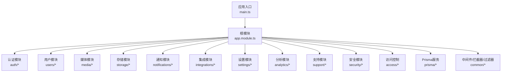
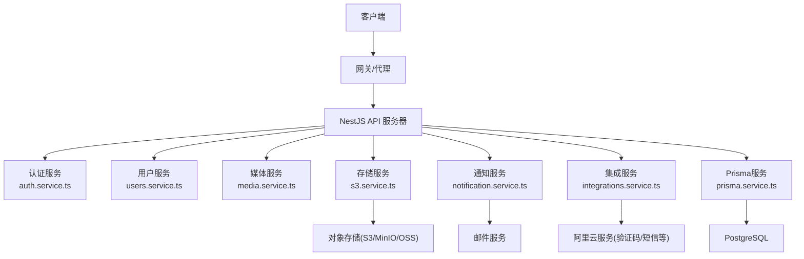
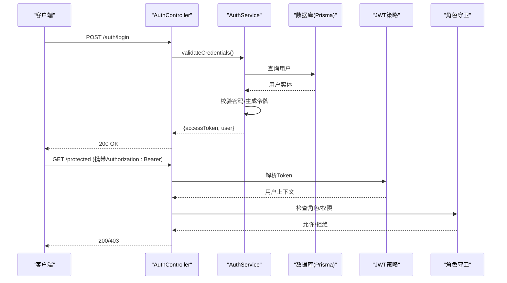
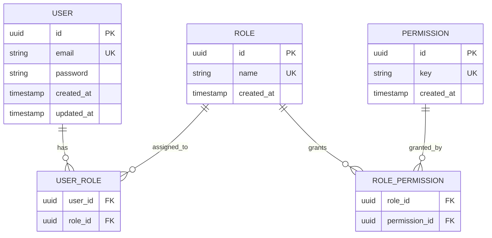
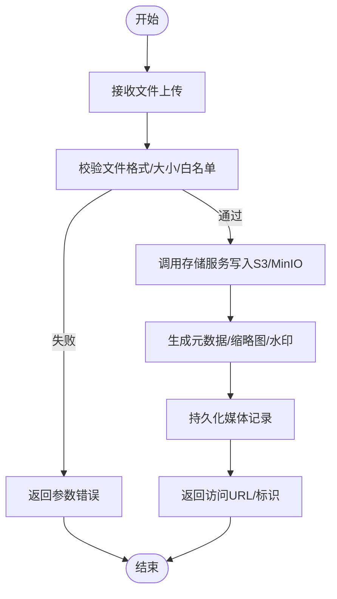
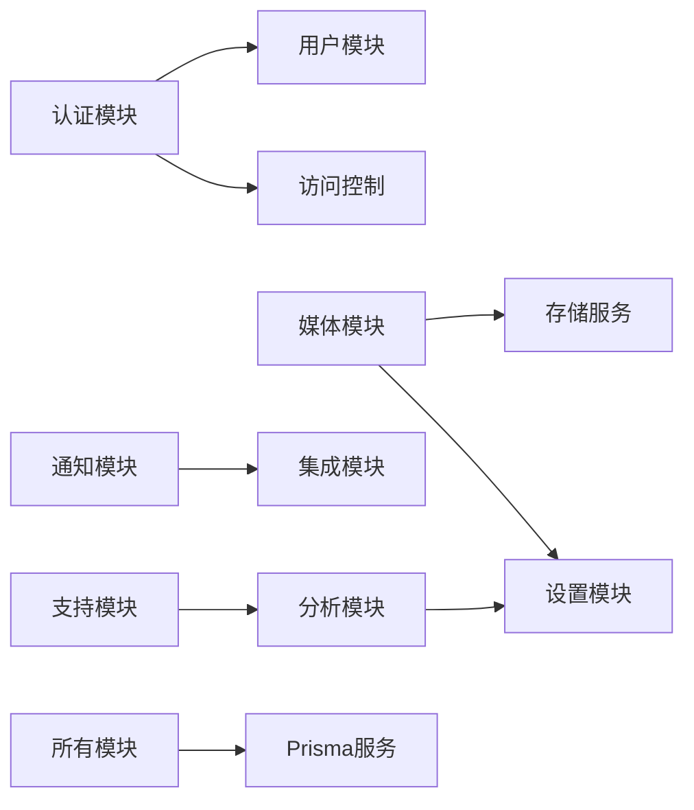

# API后端服务

<cite>
**本文档引用的文件**   
- [apps/api/src/main.ts](file://apps/api/src/main.ts)
- [apps/api/src/app.module.ts](file://apps/api/src/app.module.ts)
- [apps/api/src/auth/auth.controller.ts](file://apps/api/src/auth/auth.controller.ts)
- [apps/api/src/auth/auth.service.ts](file://apps/api/src/auth/auth.service.ts)
- [apps/api/src/auth/guards/jwt-auth.guard.ts](file://apps/api/src/auth/guards/jwt-auth.guard.ts)
- [apps/api/src/auth/strategies/jwt.strategy.ts](file://apps/api/src/auth/strategies/jwt.strategy.ts)
- [apps/api/src/common/filters/http-exception.filter.ts](file://apps/api/src/common/filters/http-exception.filter.ts)
- [apps/api/src/common/interceptors/audit.interceptor.ts](file://apps/api/src/common/interceptors/audit.interceptor.ts)
- [apps/api/src/common/interceptors/transform.interceptor.ts](file://apps/api/src/common/interceptors/transform.interceptor.ts)
- [apps/api/src/common/middleware/request-id.middleware.ts](file://apps/api/src/common/middleware/request-id.middleware.ts)
- [apps/api/src/config/env.validation.ts](file://apps/api/src/config/env.validation.ts)
- [apps/api/src/prisma/prisma.module.ts](file://apps/api/src/prisma/prisma.module.ts)
- [apps/api/src/prisma/prisma.service.ts](file://apps/api/src/prisma/prisma.service.ts)
- [apps/api/prisma/schema.prisma](file://apps/api/prisma/schema.prisma)
- [apps/api/src/media/media.controller.ts](file://apps/api/src/media/media.controller.ts)
- [apps/api/src/media/media.service.ts](file://apps/api/src/media/media.service.ts)
- [apps/api/src/storage/s3.service.ts](file://apps/api/src/storage/s3.service.ts)
- [apps/api/src/notifications/notification.service.ts](file://apps/api/src/notifications/notification.service.ts)
- [apps/api/src/integrations/integrations.service.ts](file://apps/api/src/integrations/integrations.service.ts)
- [apps/api/src/settings/settings.service.ts](file://apps/api/src/settings/settings.service.ts)
- [apps/api/src/users/users.controller.ts](file://apps/api/src/users/users.controller.ts)
- [apps/api/src/users/users.service.ts](file://apps/api/src/users/users.service.ts)
- [apps/api/src/access/roles.service.ts](file://apps/api/src/access/roles.service.ts)
- [apps/api/src/security/ip-ban.service.ts](file://apps/api/src/security/ip-ban.service.ts)
- [apps/api/src/analytics/analytics.service.ts](file://apps/api/src/analytics/analytics.service.ts)
- [apps/api/src/support/chat.gateway.ts](file://apps/api/src/support/chat.gateway.ts)
</cite>

## 目录
1. [简介](#简介)
2. [项目结构](#项目结构)
3. [核心组件](#核心组件)
4. [架构总览](#架构总览)
5. [详细组件分析](#详细组件分析)
6. [依赖关系分析](#依赖关系分析)
7. [性能考虑](#性能考虑)
8. [故障排查指南](#故障排查指南)
9. [结论](#结论)
10. [附录](#附录)

## 简介
本文件面向后端开发者与API调用者，系统化阐述基于NestJS的微服务后端API设计、RESTful规范、请求响应格式、错误处理与日志记录；覆盖用户认证授权、权限控制、数据验证与输入过滤；解释数据库设计与Prisma ORM使用、事务处理与性能优化；并包含文件存储、邮件通知、第三方集成与缓存策略。文档同时提供接口文档与集成指南，帮助快速对接与排障。

## 项目结构
后端服务位于 apps/api 目录，采用NestJS模块化组织：
- 入口与全局配置：main.ts、app.module.ts、env.validation.ts
- 领域模块：auth、users、access、media、storage、notifications、integrations、settings、analytics、support等
- 通用能力：filters、interceptors、middleware、pipes、validators、utils
- 数据层：prisma（schema、migrations、seed）
- 基础设施：Docker、脚本、CI/CD

图表来源
- [apps/api/src/main.ts](file://apps/api/src/main.ts)
- [apps/api/src/app.module.ts](file://apps/api/src/app.module.ts)

章节来源
- [apps/api/src/main.ts](file://apps/api/src/main.ts)
- [apps/api/src/app.module.ts](file://apps/api/src/app.module.ts)

## 核心组件
- 认证与授权
  - JWT鉴权流程：登录获取令牌、守卫校验、角色与权限控制
  - 装饰器：当前用户、公开路由、角色与权限校验
- 数据访问
  - Prisma ORM：类型安全的查询、迁移管理、种子数据
- 通用横切关注点
  - 异常过滤器：统一HTTP异常响应
  - 拦截器：审计日志、响应转换
  - 中间件：请求ID注入
- 外部集成
  - 对象存储（S3兼容）、阿里云短信/验证码、邮件发送
  - 设置中心与动态配置
- 实时通信
  - WebSocket网关用于聊天与会话状态

章节来源
- [apps/api/src/auth/auth.controller.ts](file://apps/api/src/auth/auth.controller.ts)
- [apps/api/src/auth/auth.service.ts](file://apps/api/src/auth/auth.service.ts)
- [apps/api/src/auth/guards/jwt-auth.guard.ts](file://apps/api/src/auth/guards/jwt-auth.guard.ts)
- [apps/api/src/auth/strategies/jwt.strategy.ts](file://apps/api/src/auth/strategies/jwt.strategy.ts)
- [apps/api/src/common/filters/http-exception.filter.ts](file://apps/api/src/common/filters/http-exception.filter.ts)
- [apps/api/src/common/interceptors/audit.interceptor.ts](file://apps/api/src/common/interceptors/audit.interceptor.ts)
- [apps/api/src/common/interceptors/transform.interceptor.ts](file://apps/api/src/common/interceptors/transform.interceptor.ts)
- [apps/api/src/common/middleware/request-id.middleware.ts](file://apps/api/src/common/middleware/request-id.middleware.ts)
- [apps/api/src/prisma/prisma.service.ts](file://apps/api/src/prisma/prisma.service.ts)
- [apps/api/src/media/media.service.ts](file://apps/api/src/media/media.service.ts)
- [apps/api/src/storage/s3.service.ts](file://apps/api/src/storage/s3.service.ts)
- [apps/api/src/notifications/notification.service.ts](file://apps/api/src/notifications/notification.service.ts)
- [apps/api/src/integrations/integrations.service.ts](file://apps/api/src/integrations/integrations.service.ts)
- [apps/api/src/settings/settings.service.ts](file://apps/api/src/settings/settings.service.ts)
- [apps/api/src/support/chat.gateway.ts](file://apps/api/src/support/chat.gateway.ts)

## 架构总览
整体采用“控制器-服务-数据层”的分层架构，配合NestJS的Guard、Interceptor、Middleware与Pipe实现横切能力。认证通过JWT策略与守卫完成，数据访问由Prisma封装，外部依赖通过服务抽象隔离。

图表来源
- [apps/api/src/main.ts](file://apps/api/src/main.ts)
- [apps/api/src/app.module.ts](file://apps/api/src/app.module.ts)
- [apps/api/src/auth/auth.service.ts](file://apps/api/src/auth/auth.service.ts)
- [apps/api/src/users/users.service.ts](file://apps/api/src/users/users.service.ts)
- [apps/api/src/media/media.service.ts](file://apps/api/src/media/media.service.ts)
- [apps/api/src/storage/s3.service.ts](file://apps/api/src/storage/s3.service.ts)
- [apps/api/src/notifications/notification.service.ts](file://apps/api/src/notifications/notification.service.ts)
- [apps/api/src/integrations/integrations.service.ts](file://apps/api/src/integrations/integrations.service.ts)
- [apps/api/src/prisma/prisma.service.ts](file://apps/api/src/prisma/prisma.service.ts)

## 详细组件分析

### 认证与授权（JWT + 角色权限）
- 登录流程：控制器接收凭证，服务校验并签发JWT，返回令牌与必要用户信息
- 鉴权流程：JWT守卫解析令牌，策略加载用户上下文，角色守卫进行权限判定
- 装饰器：@Public跳过鉴权，@CurrentUser注入当前用户，@Roles/@RequirePermissions控制访问

图表来源
- [apps/api/src/auth/auth.controller.ts](file://apps/api/src/auth/auth.controller.ts)
- [apps/api/src/auth/auth.service.ts](file://apps/api/src/auth/auth.service.ts)
- [apps/api/src/auth/strategies/jwt.strategy.ts](file://apps/api/src/auth/strategies/jwt.strategy.ts)
- [apps/api/src/auth/guards/jwt-auth.guard.ts](file://apps/api/src/auth/guards/jwt-auth.guard.ts)

章节来源
- [apps/api/src/auth/auth.controller.ts](file://apps/api/src/auth/auth.controller.ts)
- [apps/api/src/auth/auth.service.ts](file://apps/api/src/auth/auth.service.ts)
- [apps/api/src/auth/strategies/jwt.strategy.ts](file://apps/api/src/auth/strategies/jwt.strategy.ts)
- [apps/api/src/auth/guards/jwt-auth.guard.ts](file://apps/api/src/auth/guards/jwt-auth.guard.ts)

### 数据模型与Prisma ORM
- Schema定义：集中管理实体、关系、索引与约束
- 迁移与种子：版本化演进与初始数据填充
- 服务封装：PrismaService提供连接生命周期管理与事务支持

图表来源
- [apps/api/prisma/schema.prisma](file://apps/api/prisma/schema.prisma)

章节来源
- [apps/api/prisma/schema.prisma](file://apps/api/prisma/schema.prisma)
- [apps/api/src/prisma/prisma.service.ts](file://apps/api/src/prisma/prisma.service.ts)
- [apps/api/src/prisma/prisma.module.ts](file://apps/api/src/prisma/prisma.module.ts)

### 媒体与文件存储
- 上传流程：控制器接收文件，服务校验与元数据处理，存储服务写入对象存储
- 访问控制：媒体守卫限制未授权访问，支持签名URL或直链
- 水印与静态路径：可选水印处理与站点静态资源路径管理

图表来源
- [apps/api/src/media/media.controller.ts](file://apps/api/src/media/media.controller.ts)
- [apps/api/src/media/media.service.ts](file://apps/api/src/media/media.service.ts)
- [apps/api/src/storage/s3.service.ts](file://apps/api/src/storage/s3.service.ts)

章节来源
- [apps/api/src/media/media.controller.ts](file://apps/api/src/media/media.controller.ts)
- [apps/api/src/media/media.service.ts](file://apps/api/src/media/media.service.ts)
- [apps/api/src/storage/s3.service.ts](file://apps/api/src/storage/s3.service.ts)

### 通知与邮件
- 模板与渠道：邮件模板管理，SMTP/第三方服务接入
- 异步发送：队列或延迟任务避免阻塞主流程
- 重试与告警：失败重试、死信与监控告警

章节来源
- [apps/api/src/notifications/notification.service.ts](file://apps/api/src/notifications/notification.service.ts)

### 第三方集成与设置
- 集成注册：统一注册表管理不同供应商能力
- 测试与诊断：集成健康检查与连通性测试
- 设置中心：动态配置与默认值管理

章节来源
- [apps/api/src/integrations/integrations.service.ts](file://apps/api/src/integrations/integrations.service.ts)
- [apps/api/src/settings/settings.service.ts](file://apps/api/src/settings/settings.service.ts)

### 用户与访问控制
- 用户CRUD：用户创建、更新、查询与状态管理
- 角色与权限：RBAC模型，细粒度权限键控制
- IP封禁与安全：黑名单、频率限制与防护

章节来源
- [apps/api/src/users/users.controller.ts](file://apps/api/src/users/users.controller.ts)
- [apps/api/src/users/users.service.ts](file://apps/api/src/users/users.service.ts)
- [apps/api/src/access/roles.service.ts](file://apps/api/src/access/roles.service.ts)
- [apps/api/src/security/ip-ban.service.ts](file://apps/api/src/security/ip-ban.service.ts)

### 分析与实时通信
- 分析采集：页面浏览、访客识别、地理定位与来源追踪
- 实时聊天：WebSocket网关维护会话、在线状态与消息分发

章节来源
- [apps/api/src/analytics/analytics.service.ts](file://apps/api/src/analytics/analytics.service.ts)
- [apps/api/src/support/chat.gateway.ts](file://apps/api/src/support/chat.gateway.ts)

## 依赖关系分析
- 模块耦合
  - 控制器依赖服务，服务依赖Prisma与外部服务（存储、邮件、集成）
  - 认证相关模块被广泛引用（Guard、Strategy、装饰器）
- 外部依赖
  - 数据库：PostgreSQL（通过Prisma）
  - 对象存储：S3兼容（MinIO/OSS）
  - 邮件：SMTP或云服务
  - 第三方：阿里云验证码/短信等
- 潜在循环依赖
  - 通过服务抽象与模块隔离避免循环

图表来源
- [apps/api/src/app.module.ts](file://apps/api/src/app.module.ts)
- [apps/api/src/prisma/prisma.service.ts](file://apps/api/src/prisma/prisma.service.ts)

章节来源
- [apps/api/src/app.module.ts](file://apps/api/src/app.module.ts)

## 性能考虑
- 数据库
  - 合理使用索引与分页，避免N+1查询
  - 读写分离与连接池调优（Prisma连接池）
- 缓存策略
  - 热点数据Redis缓存，设置合理TTL与失效策略
  - 列表与聚合结果缓存，结合ETag/Last-Modified
- 传输与序列化
  - 启用压缩与HTTP缓存头
  - 响应体裁剪与按需字段选择
- 并发与限流
  - 接口级限流与熔断保护
  - 异步任务与队列解耦耗时操作
- 存储
  - CDN加速静态与媒体资源
  - 分片上传与断点续传

[本节为通用指导，不直接分析具体文件]

## 故障排查指南
- 统一异常处理
  - HTTP异常过滤器标准化错误响应码与消息
- 审计与日志
  - 审计拦截器记录关键操作与上下文
  - 请求ID中间件贯穿链路便于追踪
- 环境变量校验
  - 启动时校验必需配置，提前暴露问题
- 常见问题
  - 认证失败：检查JWT密钥、过期时间、角色权限
  - 存储失败：检查S3凭据、网络与CORS
  - 邮件发送失败：检查SMTP配置与域名反垃圾策略

章节来源
- [apps/api/src/common/filters/http-exception.filter.ts](file://apps/api/src/common/filters/http-exception.filter.ts)
- [apps/api/src/common/interceptors/audit.interceptor.ts](file://apps/api/src/common/interceptors/audit.interceptor.ts)
- [apps/api/src/common/middleware/request-id.middleware.ts](file://apps/api/src/common/middleware/request-id.middleware.ts)
- [apps/api/src/config/env.validation.ts](file://apps/api/src/config/env.validation.ts)

## 结论
本项目以NestJS为核心，结合Prisma与模块化设计，构建了可扩展、可维护的后端API体系。通过统一的认证授权、异常处理、审计与中间件机制，保障了安全性与可观测性。对外提供清晰的REST接口与实时能力，并通过存储、通知与第三方集成扩展业务边界。建议在生产环境完善缓存、限流与监控，持续优化性能与稳定性。

[本节为总结，不直接分析具体文件]

## 附录

### RESTful API设计规范
- URL命名
  - 名词复数形式，层级清晰，避免动词
  - 示例：/users、/documents、/media
- 方法语义
  - GET读取、POST创建、PUT全量更新、PATCH部分更新、DELETE删除
- 请求格式
  - Content-Type: application/json
  - 表单上传：multipart/form-data
- 响应格式
  - 成功：{ data, meta? }
  - 错误：{ error: { code, message, details? } }
- 分页与排序
  - query参数：page、pageSize、sort、order
- 状态码
  - 2xx成功、4xx客户端错误、5xx服务端错误

[本节为通用规范，不直接分析具体文件]

### 认证与授权接口
- 登录
  - POST /auth/login
  - 请求体：{ email, password }
  - 响应：{ accessToken, user }
- 刷新令牌
  - POST /auth/refresh
  - 请求头：Authorization: Bearer <refreshToken>
  - 响应：{ accessToken }
- 受保护资源
  - 需携带Authorization: Bearer <accessToken>
  - 角色/权限由装饰器与守卫控制

章节来源
- [apps/api/src/auth/auth.controller.ts](file://apps/api/src/auth/auth.controller.ts)
- [apps/api/src/auth/auth.service.ts](file://apps/api/src/auth/auth.service.ts)
- [apps/api/src/auth/guards/jwt-auth.guard.ts](file://apps/api/src/auth/guards/jwt-auth.guard.ts)
- [apps/api/src/auth/strategies/jwt.strategy.ts](file://apps/api/src/auth/strategies/jwt.strategy.ts)

### 数据验证与输入过滤
- DTO与管道
  - 使用DTO声明字段类型与校验规则
  - NestJS内置管道自动校验与转换
- 自定义验证器
  - 密码强度、邮箱格式、枚举值等
- 过滤与投影
  - 查询参数白名单与字段裁剪

章节来源
- [apps/api/src/common/validators/password.validator.ts](file://apps/api/src/common/validators/password.validator.ts)

### 错误处理与日志
- 错误响应
  - 统一错误码与消息结构
  - 区分业务错误与系统错误
- 审计日志
  - 记录操作人、IP、时间戳、变更摘要
- 链路追踪
  - 请求ID贯穿日志与下游调用

章节来源
- [apps/api/src/common/filters/http-exception.filter.ts](file://apps/api/src/common/filters/http-exception.filter.ts)
- [apps/api/src/common/interceptors/audit.interceptor.ts](file://apps/api/src/common/interceptors/audit.interceptor.ts)
- [apps/api/src/common/middleware/request-id.middleware.ts](file://apps/api/src/common/middleware/request-id.middleware.ts)

### 数据库设计与事务
- 建模原则
  - 规范化与反范式平衡，明确关系与索引
- 事务处理
  - 多步写操作使用事务保证一致性
- 迁移与回滚
  - 版本化管理，生产环境谨慎执行

章节来源
- [apps/api/prisma/schema.prisma](file://apps/api/prisma/schema.prisma)
- [apps/api/src/prisma/prisma.service.ts](file://apps/api/src/prisma/prisma.service.ts)

### 文件存储与邮件通知
- 文件存储
  - 上传校验、分块上传、防盗链与签名URL
  - 缩略图、水印与格式转换
- 邮件通知
  - 模板渲染、附件、重试与失败回调

章节来源
- [apps/api/src/media/media.service.ts](file://apps/api/src/media/media.service.ts)
- [apps/api/src/storage/s3.service.ts](file://apps/api/src/storage/s3.service.ts)
- [apps/api/src/notifications/notification.service.ts](file://apps/api/src/notifications/notification.service.ts)

### 第三方集成与缓存策略
- 集成注册
  - 统一接口与配置项，支持多供应商切换
- 缓存策略
  - 读多写少场景优先缓存
  - 缓存穿透/击穿/雪崩防护

章节来源
- [apps/api/src/integrations/integrations.service.ts](file://apps/api/src/integrations/integrations.service.ts)
- [apps/api/src/settings/settings.service.ts](file://apps/api/src/settings/settings.service.ts)

### 集成指南（调用方）
- 初始化
  - 获取基础URL与鉴权令牌
- 鉴权
  - 登录后保存accessToken，后续请求携带Authorization头
- 错误处理
  - 根据错误码提示用户或重试
- 最佳实践
  - 幂等请求、超时与重试、分页遍历

[本节为通用指导，不直接分析具体文件]