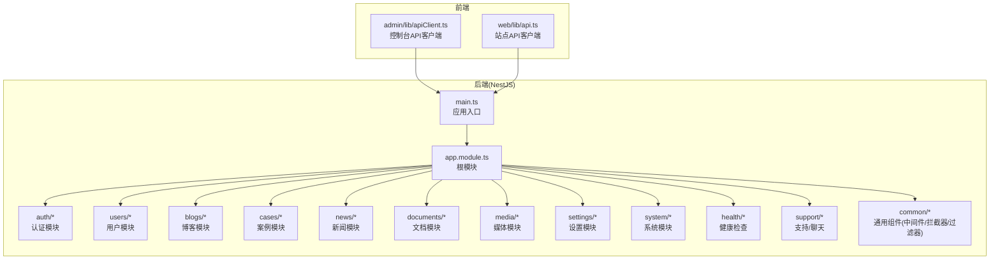
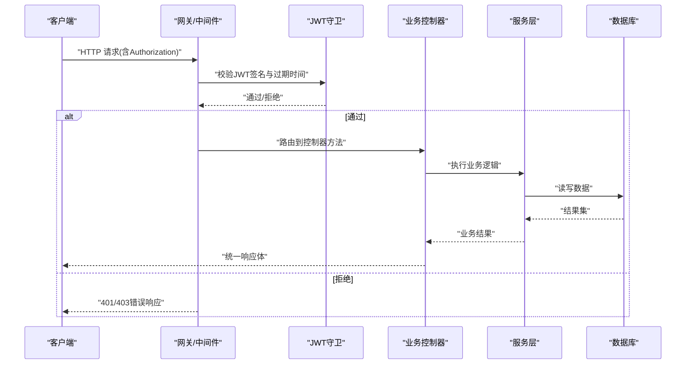
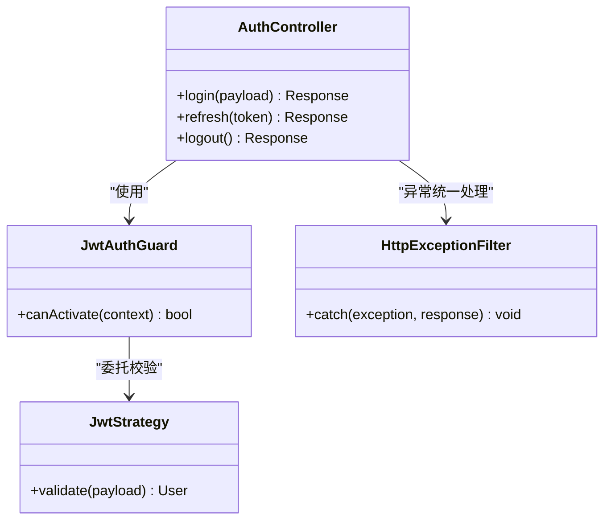
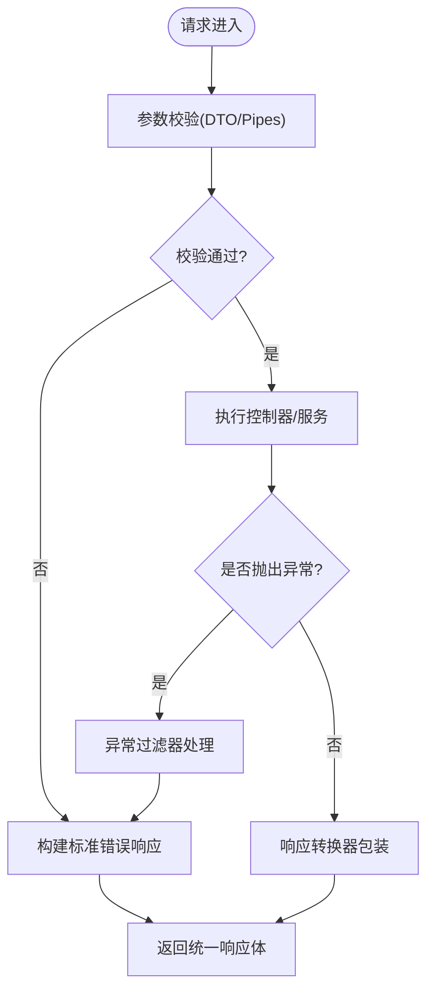
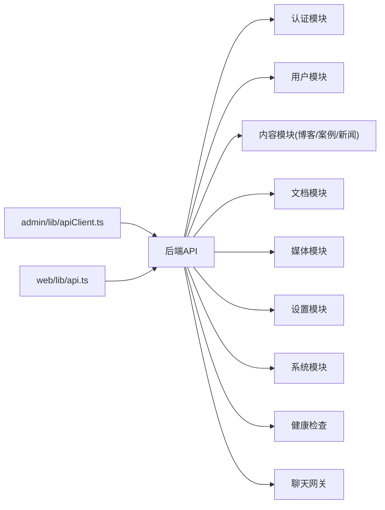

# API接口规范

<cite>
**本文档引用的文件**   
- [apps/api/src/main.ts](file://apps/api/src/main.ts)
- [apps/api/src/app.module.ts](file://apps/api/src/app.module.ts)
- [apps/api/src/auth/auth.controller.ts](file://apps/api/src/auth/auth.controller.ts)
- [apps/api/src/auth/guards/jwt-auth.guard.ts](file://apps/api/src/auth/guards/jwt-auth.guard.ts)
- [apps/api/src/auth/strategies/jwt.strategy.ts](file://apps/api/src/auth/strategies/jwt.strategy.ts)
- [apps/api/src/common/filters/http-exception.filter.ts](file://apps/api/src/common/filters/http-exception.filter.ts)
- [apps/api/src/common/interceptors/transform.interceptor.ts](file://apps/api/src/common/interceptors/transform.interceptor.ts)
- [apps/api/src/common/middleware/request-id.middleware.ts](file://apps/api/src/common/middleware/request-id.middleware.ts)
- [apps/api/src/config/env.validation.ts](file://apps/api/src/config/env.validation.ts)
- [apps/api/src/users/users.controller.ts](file://apps/api/src/users/users.controller.ts)
- [apps/api/src/blogs/blogs.controller.ts](file://apps/api/src/blogs/blogs.controller.ts)
- [apps/api/src/cases/cases.controller.ts](file://apps/api/src/cases/cases.controller.ts)
- [apps/api/src/news/news.controller.ts](file://apps/api/src/news/news.controller.ts)
- [apps/api/src/documents/documents.controller.ts](file://apps/api/src/documents/documents.controller.ts)
- [apps/api/src/media/media.controller.ts](file://apps/api/src/media/media.controller.ts)
- [apps/api/src/settings/settings.controller.ts](file://apps/api/src/settings/settings.controller.ts)
- [apps/api/src/system/system.controller.ts](file://apps/api/src/system/system.controller.ts)
- [apps/api/src/health/health.controller.ts](file://apps/api/src/health/health.controller.ts)
- [apps/api/src/support/chat.gateway.ts](file://apps/api/src/support/chat.gateway.ts)
- [apps/admin/src/lib/apiClient.ts](file://apps/admin/src/lib/apiClient.ts)
- [apps/web/src/lib/api.ts](file://apps/web/src/lib/api.ts)
- [apps/admin/src/features/types.ts](file://apps/admin/src/features/types.ts)
- [apps/web/src/lib/content-list.ts](file://apps/web/src/lib/content-list.ts)
</cite>

## 目录
1. [简介](#简介)
2. [项目结构](#项目结构)
3. [核心组件](#核心组件)
4. [架构总览](#架构总览)
5. [详细组件分析](#详细组件分析)
6. [依赖关系分析](#依赖关系分析)
7. [性能考虑](#性能考虑)
8. [故障排查指南](#故障排查指南)
9. [结论](#结论)
10. [附录](#附录)

## 简介
本文件为项目的API接口规范文档，面向前后端开发者与集成方。内容涵盖RESTful设计规范、请求响应格式、错误码定义、版本管理策略、鉴权机制、参数校验、分页排序与搜索过滤、API文档生成、测试用例与集成示例，以及完整的接口调用指南与SDK使用说明。目标是让读者在不深入源码的情况下也能正确、高效地对接系统。

## 项目结构
后端采用NestJS模块化架构，按领域划分模块（认证、用户、博客、案例、新闻、文档、媒体、设置、系统、健康检查、支持聊天等），并通过中间件、拦截器、过滤器和守卫实现横切关注点。前端包含Admin控制台与Web站点，分别通过各自的客户端库调用后端API。

**图表来源** 
- [apps/api/src/main.ts](file://apps/api/src/main.ts)
- [apps/api/src/app.module.ts](file://apps/api/src/app.module.ts)

**章节来源**
- [apps/api/src/main.ts](file://apps/api/src/main.ts)
- [apps/api/src/app.module.ts](file://apps/api/src/app.module.ts)

## 核心组件
- 应用入口与全局配置：统一注册中间件、拦截器、过滤器与CORS等。
- 认证与授权：基于JWT的无状态鉴权，结合角色与权限守卫。
- 业务控制器：各业务域控制器暴露RESTful端点，统一DTO校验与响应封装。
- 通用能力：请求ID、异常处理、响应转换、环境校验等。

**章节来源**
- [apps/api/src/common/middleware/request-id.middleware.ts](file://apps/api/src/common/middleware/request-id.middleware.ts)
- [apps/api/src/common/filters/http-exception.filter.ts](file://apps/api/src/common/filters/http-exception.filter.ts)
- [apps/api/src/common/interceptors/transform.interceptor.ts](file://apps/api/src/common/interceptors/transform.interceptor.ts)
- [apps/api/src/config/env.validation.ts](file://apps/api/src/config/env.validation.ts)
- [apps/api/src/auth/auth.controller.ts](file://apps/api/src/auth/auth.controller.ts)
- [apps/api/src/auth/guards/jwt-auth.guard.ts](file://apps/api/src/auth/guards/jwt-auth.guard.ts)
- [apps/api/src/auth/strategies/jwt.strategy.ts](file://apps/api/src/auth/strategies/jwt.strategy.ts)

## 架构总览
下图展示一次受保护资源的典型请求流程：客户端携带Token访问受保护接口，网关层进行身份验证与权限校验，随后进入业务控制器与服务层，最终返回统一格式的响应体。

**图表来源** 
- [apps/api/src/auth/guards/jwt-auth.guard.ts](file://apps/api/src/auth/guards/jwt-auth.guard.ts)
- [apps/api/src/auth/strategies/jwt.strategy.ts](file://apps/api/src/auth/strategies/jwt.strategy.ts)
- [apps/api/src/common/filters/http-exception.filter.ts](file://apps/api/src/common/filters/http-exception.filter.ts)

## 详细组件分析

### 认证与鉴权
- 登录与令牌发放：提供登录接口，成功后返回访问令牌与必要用户信息。
- JWT鉴权：所有受保护接口需携带Authorization头，服务端校验签名、有效期与主体信息。
- 角色与权限：通过装饰器与守卫控制资源访问，支持细粒度权限校验。

**图表来源** 
- [apps/api/src/auth/auth.controller.ts](file://apps/api/src/auth/auth.controller.ts)
- [apps/api/src/auth/guards/jwt-auth.guard.ts](file://apps/api/src/auth/guards/jwt-auth.guard.ts)
- [apps/api/src/auth/strategies/jwt.strategy.ts](file://apps/api/src/auth/strategies/jwt.strategy.ts)
- [apps/api/src/common/filters/http-exception.filter.ts](file://apps/api/src/common/filters/http-exception.filter.ts)

**章节来源**
- [apps/api/src/auth/auth.controller.ts](file://apps/api/src/auth/auth.controller.ts)
- [apps/api/src/auth/guards/jwt-auth.guard.ts](file://apps/api/src/auth/guards/jwt-auth.guard.ts)
- [apps/api/src/auth/strategies/jwt.strategy.ts](file://apps/api/src/auth/strategies/jwt.strategy.ts)

### 统一响应与错误处理
- 响应体结构：所有成功响应统一包装，包含数据、元信息（如分页）与状态码。
- 错误响应：标准化错误对象，包含错误码、消息、详情与追踪ID。
- 异常过滤：全局捕获未处理异常并转换为标准错误响应。

**图表来源** 
- [apps/api/src/common/filters/http-exception.filter.ts](file://apps/api/src/common/filters/http-exception.filter.ts)
- [apps/api/src/common/interceptors/transform.interceptor.ts](file://apps/api/src/common/interceptors/transform.interceptor.ts)

**章节来源**
- [apps/api/src/common/filters/http-exception.filter.ts](file://apps/api/src/common/filters/http-exception.filter.ts)
- [apps/api/src/common/interceptors/transform.interceptor.ts](file://apps/api/src/common/interceptors/transform.interceptor.ts)

### 请求追踪与日志
- 请求ID：每个请求分配唯一ID，贯穿日志与链路追踪，便于问题定位。
- 审计与操作记录：关键写操作可触发审计拦截器，记录操作人、时间与上下文。

**章节来源**
- [apps/api/src/common/middleware/request-id.middleware.ts](file://apps/api/src/common/middleware/request-id.middleware.ts)

### 环境配置与校验
- 环境变量：集中式配置加载与校验，确保运行期必需项存在且类型正确。
- 安全敏感项：密钥、连接串等通过环境变量注入，避免硬编码。

**章节来源**
- [apps/api/src/config/env.validation.ts](file://apps/api/src/config/env.validation.ts)

### 业务模块概览
- 用户管理：用户CRUD、角色与权限相关接口。
- 内容管理：博客、案例、新闻的增删改查与发布状态管理。
- 文档管理：文档与文件夹、标签、权限管理。
- 媒体管理：上传、下载、预览与水印处理。
- 设置与系统：站点设置、系统信息与运维接口。
- 健康检查：服务存活与健康状态探测。

**章节来源**
- [apps/api/src/users/users.controller.ts](file://apps/api/src/users/users.controller.ts)
- [apps/api/src/blogs/blogs.controller.ts](file://apps/api/src/blogs/blogs.controller.ts)
- [apps/api/src/cases/cases.controller.ts](file://apps/api/src/cases/cases.controller.ts)
- [apps/api/src/news/news.controller.ts](file://apps/api/src/news/news.controller.ts)
- [apps/api/src/documents/documents.controller.ts](file://apps/api/src/documents/documents.controller.ts)
- [apps/api/src/media/media.controller.ts](file://apps/api/src/media/media.controller.ts)
- [apps/api/src/settings/settings.controller.ts](file://apps/api/src/settings/settings.controller.ts)
- [apps/api/src/system/system.controller.ts](file://apps/api/src/system/system.controller.ts)
- [apps/api/src/health/health.controller.ts](file://apps/api/src/health/health.controller.ts)

### 实时通信（WebSocket）
- 聊天网关：基于Socket.IO或原生WebSocket实现房间与会话管理，支持在线状态与消息推送。
- 鉴权扩展：可在握手阶段校验Token，建立受保护的会话通道。

**章节来源**
- [apps/api/src/support/chat.gateway.ts](file://apps/api/src/support/chat.gateway.ts)

## 依赖关系分析
- NestJS模块间低耦合：控制器仅依赖服务，服务依赖数据访问层，遵循单一职责。
- 横切关注点解耦：中间件、拦截器、过滤器与守卫独立于业务逻辑。
- 前端客户端：Admin与Web各自维护轻量API客户端，封装基础URL、鉴权头与重试策略。

**图表来源** 
- [apps/admin/src/lib/apiClient.ts](file://apps/admin/src/lib/apiClient.ts)
- [apps/web/src/lib/api.ts](file://apps/web/src/lib/api.ts)

**章节来源**
- [apps/admin/src/lib/apiClient.ts](file://apps/admin/src/lib/apiClient.ts)
- [apps/web/src/lib/api.ts](file://apps/web/src/lib/api.ts)

## 性能考虑
- 分页与限流：列表接口默认分页，避免一次性拉取大量数据；必要时启用限流保护。
- 缓存策略：热点数据可引入Redis缓存，减少数据库压力。
- 传输优化：启用Gzip压缩、合理设置ETag与缓存头。
- 异步与并发：I/O密集型操作使用异步非阻塞模型，避免阻塞事件循环。
- 数据库查询优化：合理使用索引、避免N+1查询，批量写入与更新。

[本节为通用指导，不直接分析具体文件]

## 故障排查指南
- 常见错误码：
  - 400：参数校验失败（DTO约束不满足）。
  - 401：未认证或Token无效/过期。
  - 403：权限不足。
  - 404：资源不存在。
  - 422：业务规则校验失败。
  - 500：服务器内部错误。
- 定位步骤：
  - 查看请求ID与响应体中的错误详情。
  - 检查服务端日志中对应请求ID的堆栈。
  - 确认鉴权头与权限配置是否正确。
  - 复现最小化请求，逐步缩小范围。

**章节来源**
- [apps/api/src/common/filters/http-exception.filter.ts](file://apps/api/src/common/filters/http-exception.filter.ts)

## 结论
本规范明确了系统的API设计原则、鉴权与校验机制、统一响应与错误处理、以及前后端协作方式。遵循该规范可实现稳定、可维护、可扩展的接口体系，并为文档生成、自动化测试与集成提供坚实基础。

[本节为总结性内容，不直接分析具体文件]

## 附录

### RESTful API设计规范
- 资源命名：使用名词复数形式，层级清晰，避免动词。
- HTTP方法：GET读取、POST创建、PUT完整更新、PATCH部分更新、DELETE删除。
- URL路径：不包含版本号时，通过请求头或Accept字段控制版本；若需要版本化，建议以路径前缀区分。
- 状态码：严格遵循语义，避免滥用200表示错误。

[本节为通用指导，不直接分析具体文件]

### 请求与响应格式
- 请求头：
  - Authorization: Bearer <token>
  - Content-Type: application/json
  - X-Request-Id: 可选，用于追踪
- 成功响应体：
  - data: 业务数据
  - meta: 元信息（分页、排序等）
  - status: 状态码
- 错误响应体：
  - code: 错误码
  - message: 人类可读消息
  - details: 详细信息
  - requestId: 请求ID

[本节为通用指导，不直接分析具体文件]

### 鉴权与授权
- 登录流程：用户名/密码或第三方登录，返回JWT。
- Token刷新：支持刷新令牌延长有效期。
- 权限模型：基于角色的访问控制（RBAC），结合资源级权限。

**章节来源**
- [apps/api/src/auth/auth.controller.ts](file://apps/api/src/auth/auth.controller.ts)
- [apps/api/src/auth/guards/jwt-auth.guard.ts](file://apps/api/src/auth/guards/jwt-auth.guard.ts)
- [apps/api/src/auth/strategies/jwt.strategy.ts](file://apps/api/src/auth/strategies/jwt.strategy.ts)

### 参数验证
- DTO校验：使用装饰器声明字段类型、长度、枚举等约束。
- 管道校验：对查询参数、路径参数进行类型转换与校验。
- 自定义校验：复杂规则通过自定义校验器实现。

**章节来源**
- [apps/api/src/common/filters/http-exception.filter.ts](file://apps/api/src/common/filters/http-exception.filter.ts)

### 分页、排序与搜索过滤
- 分页：支持页码与每页大小，返回总数与页信息。
- 排序：支持多字段排序与方向控制。
- 过滤：支持按字段值、范围、模糊匹配等条件筛选。

**章节来源**
- [apps/web/src/lib/content-list.ts](file://apps/web/src/lib/content-list.ts)

### 版本管理
- 推荐策略：优先使用向后兼容变更；必要时通过URL前缀或请求头指定版本。
- 废弃策略：明确废弃时间表，提供迁移指南与兼容层。

[本节为通用指导，不直接分析具体文件]

### API文档生成
- 工具选择：Swagger/OpenAPI自动生成，结合装饰器描述端点、参数与响应。
- 文档发布：内嵌UI或静态站点托管，供前后端联调与外部查阅。

[本节为通用指导，不直接分析具体文件]

### 测试用例与集成示例
- 单元测试：针对服务与工具函数编写断言。
- 集成测试：启动测试容器，模拟数据库与外部依赖，端到端验证接口。
- 契约测试：保证前后端数据结构一致性。

[本节为通用指导，不直接分析具体文件]

### SDK使用说明
- 初始化：设置基础URL、默认超时与重试策略。
- 鉴权：在客户端构造时注入Token或实现自动刷新。
- 调用示例：封装常用业务方法，简化调用方代码。

**章节来源**
- [apps/admin/src/lib/apiClient.ts](file://apps/admin/src/lib/apiClient.ts)
- [apps/web/src/lib/api.ts](file://apps/web/src/lib/api.ts)

### 接口调用指南（示例）
- 登录：POST /api/auth/login，返回访问令牌。
- 获取用户信息：GET /api/users/me，需携带Bearer Token。
- 列出内容：GET /api/blogs?_page=1&_limit=20&sort=-createdAt&q=关键词。
- 上传媒体：POST /api/media/upload，multipart/form-data。

[本节为通用指导，不直接分析具体文件]