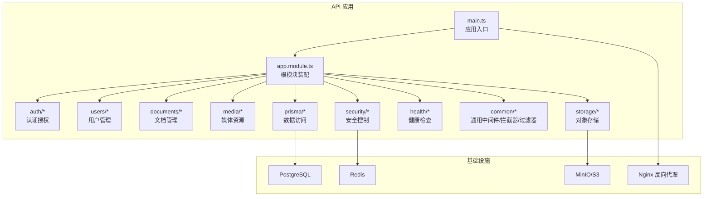
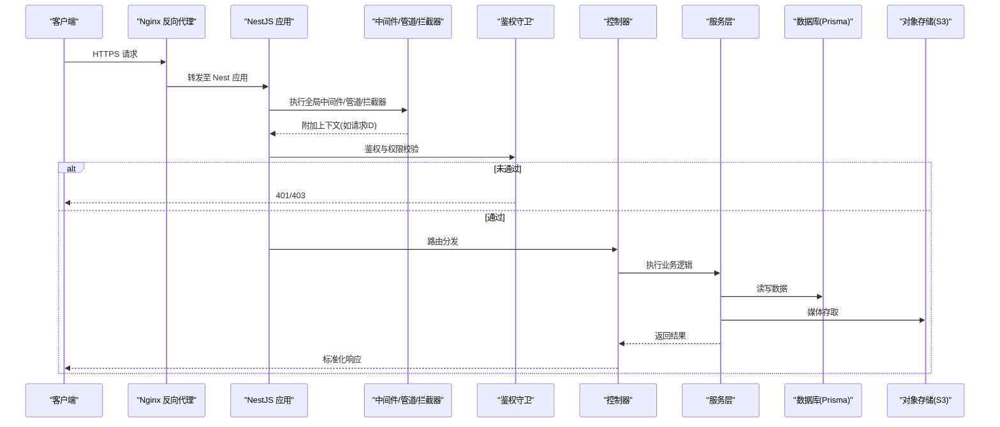
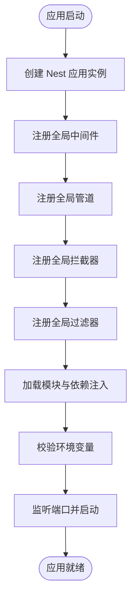
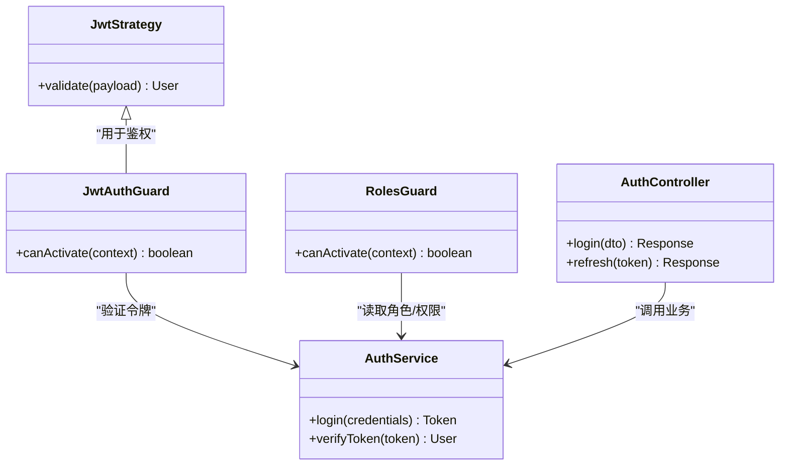
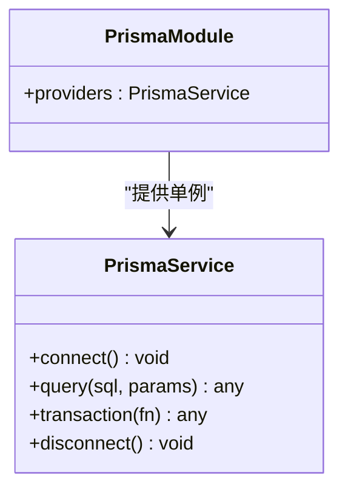
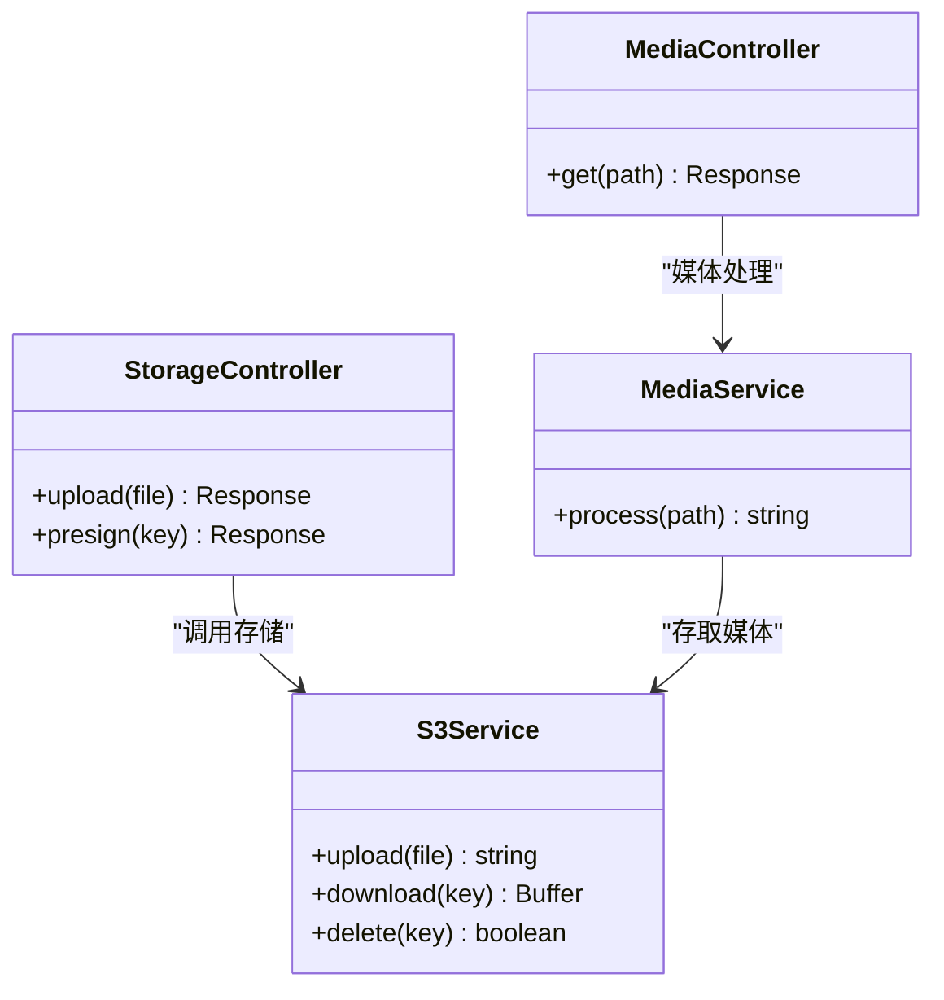
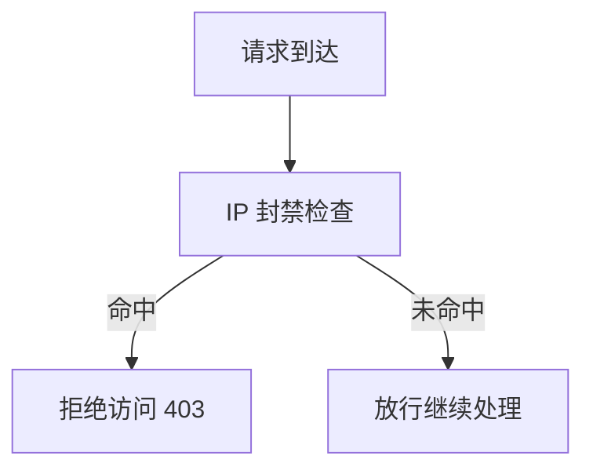
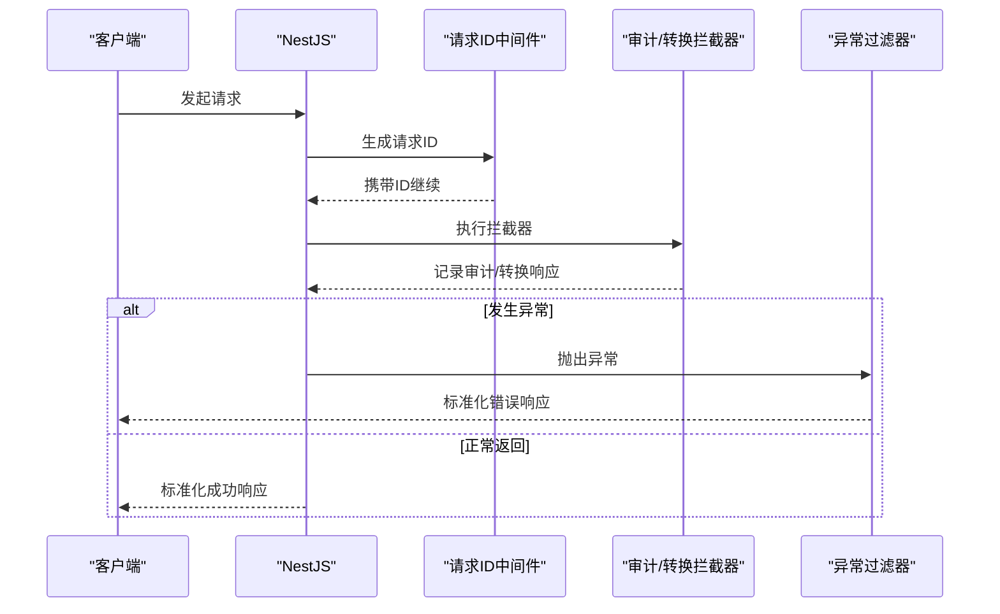
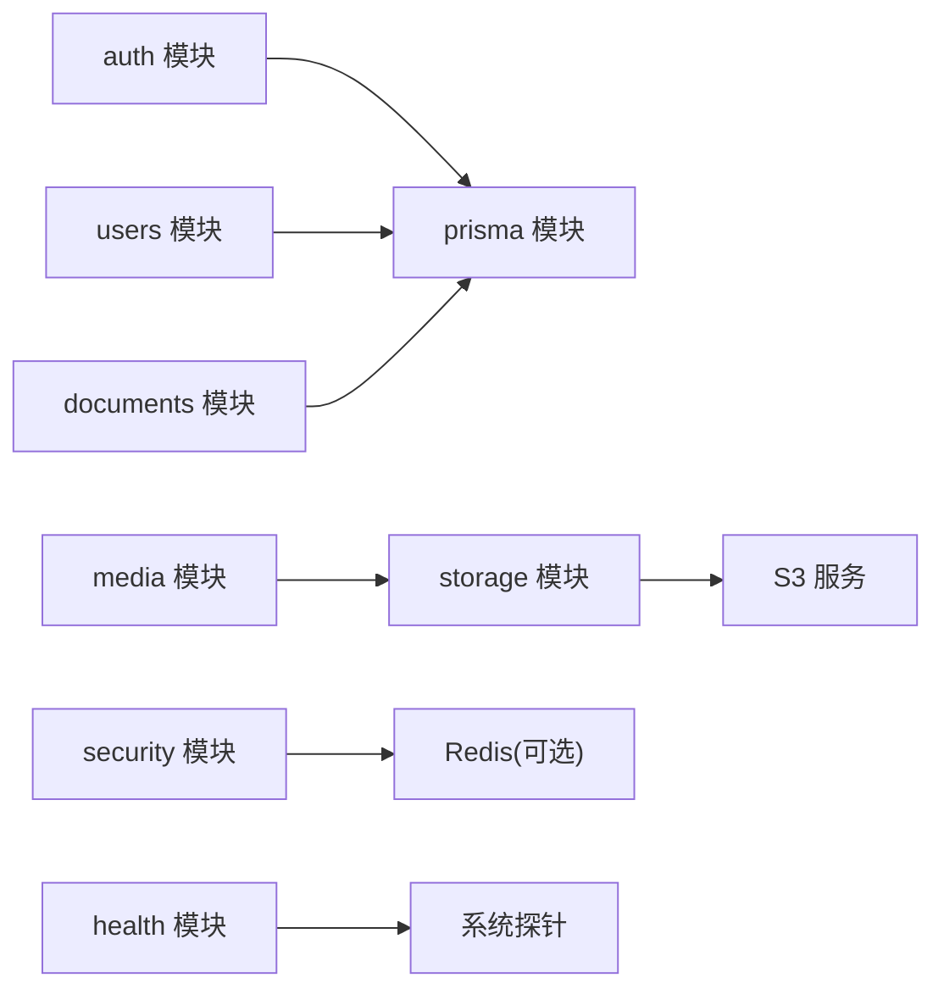

# API架构设计

<cite>
**本文引用的文件**   
- [main.ts](file://apps/api/src/main.ts)
- [app.module.ts](file://apps/api/src/app.module.ts)
- [package.json](file://apps/api/package.json)
- [nest-cli.json](file://apps/api/nest-cli.json)
- [env.validation.ts](file://apps/api/src/config/env.validation.ts)
- [http-exception.filter.ts](file://apps/api/src/common/filters/http-exception.filter.ts)
- [audit.interceptor.ts](file://apps/api/src/common/interceptors/audit.interceptor.ts)
- [transform.interceptor.ts](file://apps/api/src/common/interceptors/transform.interceptor.ts)
- [request-id.middleware.ts](file://apps/api/src/common/middleware/request-id.middleware.ts)
- [auth.controller.ts](file://apps/api/src/auth/auth.controller.ts)
- [auth.service.ts](file://apps/api/src/auth/auth.service.ts)
- [jwt-auth.guard.ts](file://apps/api/src/auth/guards/jwt-auth.guard.ts)
- [roles.guard.ts](file://apps/api/src/auth/guards/roles.guard.ts)
- [jwt.strategy.ts](file://apps/api/src/auth/strategies/jwt.strategy.ts)
- [prisma.service.ts](file://apps/api/src/prisma/prisma.service.ts)
- [prisma.module.ts](file://apps/api/src/prisma/prisma.module.ts)
- [s3.service.ts](file://apps/api/src/storage/s3.service.ts)
- [storage.controller.ts](file://apps/api/src/storage/storage.controller.ts)
- [media.controller.ts](file://apps/api/src/media/media.controller.ts)
- [media.service.ts](file://apps/api/src/media/media.service.ts)
- [health.controller.ts](file://apps/api/src/health/health.controller.ts)
- [security.controller.ts](file://apps/api/src/security/security.controller.ts)
- [ip-ban.guard.ts](file://apps/api/src/security/ip-ban.guard.ts)
- [ip-ban.service.ts](file://apps/api/src/security/ip-ban.service.ts)
- [nginx/tzj.conf](file://infra/docker/nginx/tzj.conf)
- [docker-compose.dev.yml](file://infra/docker/docker-compose.dev.yml)
</cite>

## 目录
1. [简介](#简介)
2. [项目结构](#项目结构)
3. [核心组件](#核心组件)
4. [架构总览](#架构总览)
5. [详细组件分析](#详细组件分析)
6. [依赖关系分析](#依赖关系分析)
7. [性能考量](#性能考量)
8. [故障排查指南](#故障排查指南)
9. [结论](#结论)
10. [附录](#附录)

## 简介
本文件面向基于 NestJS 的 API 后端服务，围绕微服务化与模块化组织、依赖注入容器、中间件管道与拦截器机制展开，系统阐述应用启动流程、环境配置管理、错误处理策略与日志记录体系。同时给出 CORS、请求压缩、速率限制与安全头的工程实践建议，并解释关键架构决策与技术选型理由，帮助开发者快速理解与扩展该 API 服务。

## 项目结构
API 服务位于 apps/api 子应用中，采用 NestJS 标准模块划分：按领域（如 auth、users、documents、media、storage、security、health 等）拆分为独立模块，并通过 app.module.ts 统一装配。基础设施层（数据库 Prisma、对象存储 S3、健康检查、安全控制）以可复用模块形式提供。

图表来源
- [main.ts:1-200](file://apps/api/src/main.ts#L1-L200)
- [app.module.ts:1-200](file://apps/api/src/app.module.ts#L1-L200)

章节来源
- [main.ts:1-200](file://apps/api/src/main.ts#L1-L200)
- [app.module.ts:1-200](file://apps/api/src/app.module.ts#L1-L200)
- [package.json:1-200](file://apps/api/package.json#L1-L200)
- [nest-cli.json:1-100](file://apps/api/nest-cli.json#L1-L100)

## 核心组件
- 应用入口与生命周期：main.ts 负责创建 NestFactory、挂载全局中间件、管道、拦截器、过滤器，并启动 HTTP/HTTPS 服务器。
- 根模块装配：app.module.ts 聚合业务模块与基础设施模块，声明控制器与服务，完成依赖注入容器的初始化。
- 环境配置：通过环境变量校验与加载，确保运行时配置一致性与安全性。
- 数据访问：Prisma 模块封装数据库连接与事务能力，为各业务模块提供稳定数据层。
- 存储抽象：S3 服务抽象对象存储操作，供媒体上传、下载与水印处理使用。
- 安全与鉴权：JWT 策略、角色守卫、IP 封禁守卫构成完整的鉴权与访问控制链。
- 可观测性：请求 ID 中间件、审计拦截器、HTTP 异常过滤器统一日志与错误输出。

章节来源
- [main.ts:1-200](file://apps/api/src/main.ts#L1-L200)
- [app.module.ts:1-200](file://apps/api/src/app.module.ts#L1-L200)
- [env.validation.ts:1-200](file://apps/api/src/config/env.validation.ts#L1-L200)
- [prisma.service.ts:1-200](file://apps/api/src/prisma/prisma.service.ts#L1-L200)
- [prisma.module.ts:1-200](file://apps/api/src/prisma/prisma.module.ts#L1-L200)
- [s3.service.ts:1-200](file://apps/api/src/storage/s3.service.ts#L1-L200)
- [storage.controller.ts:1-200](file://apps/api/src/storage/storage.controller.ts#L1-L200)
- [media.controller.ts:1-200](file://apps/api/src/media/media.controller.ts#L1-L200)
- [media.service.ts:1-200](file://apps/api/src/media/media.service.ts#L1-L200)
- [auth.controller.ts:1-200](file://apps/api/src/auth/auth.controller.ts#L1-200)
- [auth.service.ts:1-200](file://apps/api/src/auth/auth.service.ts#L1-200)
- [jwt.strategy.ts:1-200](file://apps/api/src/auth/strategies/jwt.strategy.ts#L1-200)
- [jwt-auth.guard.ts:1-200](file://apps/api/src/auth/guards/jwt-auth.guard.ts#L1-200)
- [roles.guard.ts:1-200](file://apps/api/src/auth/guards/roles.guard.ts#L1-200)
- [ip-ban.guard.ts:1-200](file://apps/api/src/security/ip-ban.guard.ts#L1-200)
- [ip-ban.service.ts:1-200](file://apps/api/src/security/ip-ban.service.ts#L1-200)
- [health.controller.ts:1-200](file://apps/api/src/health/health.controller.ts#L1-200)
- [security.controller.ts:1-200](file://apps/api/src/security/security.controller.ts#L1-200)

## 架构总览
下图展示从客户端到 API 服务的整体调用路径，包括反向代理、NestJS 中间件管道、鉴权守卫、业务控制器与服务、数据与存储层。

图表来源
- [main.ts:1-200](file://apps/api/src/main.ts#L1-200)
- [auth.controller.ts:1-200](file://apps/api/src/auth/auth.controller.ts#L1-200)
- [auth.service.ts:1-200](file://apps/api/src/auth/auth.service.ts#L1-200)
- [jwt.strategy.ts:1-200](file://apps/api/src/auth/strategies/jwt.strategy.ts#L1-200)
- [jwt-auth.guard.ts:1-200](file://apps/api/src/auth/guards/jwt-auth.guard.ts#L1-200)
- [roles.guard.ts:1-200](file://apps/api/src/auth/guards/roles.guard.ts#L1-200)
- [prisma.service.ts:1-200](file://apps/api/src/prisma/prisma.service.ts#L1-200)
- [s3.service.ts:1-200](file://apps/api/src/storage/s3.service.ts#L1-200)
- [nginx/tzj.conf:1-200](file://infra/docker/nginx/tzj.conf#L1-200)

## 详细组件分析

### 应用启动与全局装配
- 启动流程：main.ts 中创建 NestFactory，注册全局中间件（如请求 ID）、全局管道（参数校验）、全局拦截器（审计、响应转换）、全局过滤器（HTTP 异常），最后监听端口并打印启动信息。
- 依赖注入容器：app.module.ts 作为根模块，导入业务模块与基础设施模块，声明控制器与服务，由 Nest 容器统一管理生命周期与作用域。
- 环境配置：通过 env.validation.ts 对必需的环境变量进行校验，避免运行期缺失或类型错误导致崩溃。

图表来源
- [main.ts:1-200](file://apps/api/src/main.ts#L1-200)
- [app.module.ts:1-200](file://apps/api/src/app.module.ts#L1-200)
- [env.validation.ts:1-200](file://apps/api/src/config/env.validation.ts#L1-200)

章节来源
- [main.ts:1-200](file://apps/api/src/main.ts#L1-200)
- [app.module.ts:1-200](file://apps/api/src/app.module.ts#L1-200)
- [env.validation.ts:1-200](file://apps/api/src/config/env.validation.ts#L1-200)

### 鉴权与授权（JWT + 角色）
- JWT 策略：jwt.strategy.ts 解析 Token 并注入当前用户上下文。
- 守卫：jwt-auth.guard.ts 校验 Token 有效性；roles.guard.ts 校验角色与权限。
- 控制器与服务：auth.controller.ts 暴露登录/刷新等接口；auth.service.ts 实现令牌签发与验证逻辑。

图表来源
- [jwt.strategy.ts:1-200](file://apps/api/src/auth/strategies/jwt.strategy.ts#L1-200)
- [jwt-auth.guard.ts:1-200](file://apps/api/src/auth/guards/jwt-auth.guard.ts#L1-200)
- [roles.guard.ts:1-200](file://apps/api/src/auth/guards/roles.guard.ts#L1-200)
- [auth.controller.ts:1-200](file://apps/api/src/auth/auth.controller.ts#L1-200)
- [auth.service.ts:1-200](file://apps/api/src/auth/auth.service.ts#L1-200)

章节来源
- [jwt.strategy.ts:1-200](file://apps/api/src/auth/strategies/jwt.strategy.ts#L1-200)
- [jwt-auth.guard.ts:1-200](file://apps/api/src/auth/guards/jwt-auth.guard.ts#L1-200)
- [roles.guard.ts:1-200](file://apps/api/src/auth/guards/roles.guard.ts#L1-200)
- [auth.controller.ts:1-200](file://apps/api/src/auth/auth.controller.ts#L1-200)
- [auth.service.ts:1-200](file://apps/api/src/auth/auth.service.ts#L1-200)

### 数据访问（Prisma）
- PrismaService 封装数据库连接、事务与查询方法，供业务服务按需注入。
- PrismaModule 提供单例服务，确保连接池与生命周期管理。

图表来源
- [prisma.service.ts:1-200](file://apps/api/src/prisma/prisma.service.ts#L1-200)
- [prisma.module.ts:1-200](file://apps/api/src/prisma/prisma.module.ts#L1-200)

章节来源
- [prisma.service.ts:1-200](file://apps/api/src/prisma/prisma.service.ts#L1-200)
- [prisma.module.ts:1-200](file://apps/api/src/prisma/prisma.module.ts#L1-200)

### 对象存储（S3）
- S3Service 抽象上传、下载、删除与元数据操作，支持多后端（MinIO、阿里云 OSS 等）。
- StorageController 暴露上传/签名等接口，MediaController 与 MediaService 组合使用以实现媒体资源管理与水印处理。

图表来源
- [s3.service.ts:1-200](file://apps/api/src/storage/s3.service.ts#L1-200)
- [storage.controller.ts:1-200](file://apps/api/src/storage/storage.controller.ts#L1-200)
- [media.controller.ts:1-200](file://apps/api/src/media/media.controller.ts#L1-200)
- [media.service.ts:1-200](file://apps/api/src/media/media.service.ts#L1-200)

章节来源
- [s3.service.ts:1-200](file://apps/api/src/storage/s3.service.ts#L1-200)
- [storage.controller.ts:1-200](file://apps/api/src/storage/storage.controller.ts#L1-200)
- [media.controller.ts:1-200](file://apps/api/src/media/media.controller.ts#L1-200)
- [media.service.ts:1-200](file://apps/api/src/media/media.service.ts#L1-200)

### 安全控制（IP 封禁）
- IPBanGuard 在请求进入时检查黑名单，命中则直接拒绝。
- IPBanService 提供封禁/解封与缓存查询能力（通常结合 Redis）。

图表来源
- [ip-ban.guard.ts:1-200](file://apps/api/src/security/ip-ban.guard.ts#L1-200)
- [ip-ban.service.ts:1-200](file://apps/api/src/security/ip-ban.service.ts#L1-200)

章节来源
- [ip-ban.guard.ts:1-200](file://apps/api/src/security/ip-ban.guard.ts#L1-200)
- [ip-ban.service.ts:1-200](file://apps/api/src/security/ip-ban.service.ts#L1-200)

### 可观测性与错误处理
- 请求 ID 中间件：为每个请求生成唯一 ID，贯穿日志链路。
- 审计拦截器：记录请求/响应摘要与耗时，便于追踪。
- 响应转换拦截器：统一响应体结构与字段命名。
- HTTP 异常过滤器：捕获业务与框架异常，输出标准化错误格式。

图表来源
- [request-id.middleware.ts:1-200](file://apps/api/src/common/middleware/request-id.middleware.ts#L1-200)
- [audit.interceptor.ts:1-200](file://apps/api/src/common/interceptors/audit.interceptor.ts#L1-200)
- [transform.interceptor.ts:1-200](file://apps/api/src/common/interceptors/transform.interceptor.ts#L1-200)
- [http-exception.filter.ts:1-200](file://apps/api/src/common/filters/http-exception.filter.ts#L1-200)

章节来源
- [request-id.middleware.ts:1-200](file://apps/api/src/common/middleware/request-id.middleware.ts#L1-200)
- [audit.interceptor.ts:1-200](file://apps/api/src/common/interceptors/audit.interceptor.ts#L1-200)
- [transform.interceptor.ts:1-200](file://apps/api/src/common/interceptors/transform.interceptor.ts#L1-200)
- [http-exception.filter.ts:1-200](file://apps/api/src/common/filters/http-exception.filter.ts#L1-200)

### 健康检查与系统信息
- HealthController 暴露健康检查端点，配合外部探针与负载均衡器进行存活探测。
- SecurityController 提供系统级安全相关接口（如 IP 列表管理）。

章节来源
- [health.controller.ts:1-200](file://apps/api/src/health/health.controller.ts#L1-200)
- [security.controller.ts:1-200](file://apps/api/src/security/security.controller.ts#L1-200)

## 依赖关系分析
- 模块耦合：业务模块通过服务层与基础设施解耦，控制器仅负责路由与入参出参映射。
- 外部依赖：数据库（PostgreSQL）、缓存（Redis）、对象存储（MinIO/S3）、反向代理（Nginx）。
- 循环依赖规避：通过模块拆分与接口抽象避免循环引用。

图表来源
- [app.module.ts:1-200](file://apps/api/src/app.module.ts#L1-200)
- [prisma.module.ts:1-200](file://apps/api/src/prisma/prisma.module.ts#L1-200)
- [storage.controller.ts:1-200](file://apps/api/src/storage/storage.controller.ts#L1-200)
- [media.controller.ts:1-200](file://apps/api/src/media/media.controller.ts#L1-200)
- [security.controller.ts:1-200](file://apps/api/src/security/security.controller.ts#L1-200)
- [health.controller.ts:1-200](file://apps/api/src/health/health.controller.ts#L1-200)

章节来源
- [app.module.ts:1-200](file://apps/api/src/app.module.ts#L1-200)
- [package.json:1-200](file://apps/api/package.json#L1-200)

## 性能考量
- 连接池与并发：合理配置数据库连接池大小与超时，避免连接耗尽；对热点接口启用缓存（如 Redis）。
- 传输优化：在反向代理层启用 gzip/brotli 压缩；对大文件上传使用分片与断点续传。
- 限流与防刷：在网关或应用层实现速率限制（如基于 IP/用户维度的令牌桶/漏桶算法）。
- 异步与批处理：对非实时任务采用队列与消费者模型，降低主链路延迟。
- 监控与告警：集中式日志与指标采集，设置关键指标阈值告警。

[本节为通用指导，不直接分析具体文件]

## 故障排查指南
- 启动失败：检查环境变量是否齐全且符合校验规则；查看端口占用与网络连通性。
- 鉴权失败：确认 Token 有效性与签名密钥；检查角色与权限配置。
- 存储异常：核对 S3 凭据与 Bucket 权限；检查网络与域名解析。
- 数据库问题：检查连接串、迁移状态与索引；关注慢查询与锁等待。
- 日志定位：通过请求 ID 关联全链路日志；利用审计拦截器输出关键步骤。

章节来源
- [env.validation.ts:1-200](file://apps/api/src/config/env.validation.ts#L1-200)
- [http-exception.filter.ts:1-200](file://apps/api/src/common/filters/http-exception.filter.ts#L1-200)
- [audit.interceptor.ts:1-200](file://apps/api/src/common/interceptors/audit.interceptor.ts#L1-200)
- [request-id.middleware.ts:1-200](file://apps/api/src/common/middleware/request-id.middleware.ts#L1-200)

## 结论
本 API 服务以 NestJS 为核心，采用模块化与依赖注入构建清晰的层次结构，结合中间件、拦截器与过滤器形成统一的横切能力。通过 Prisma 与 S3 抽象数据与存储访问，借助鉴权与安全防护保障系统健壮性。建议在网关与应用层完善限流、压缩与安全头策略，并建立完善的监控与排障体系，以支撑高可用与可扩展的微服务目标。

[本节为总结性内容，不直接分析具体文件]

## 附录

### 架构决策说明与技术选型理由
- 选择 NestJS：强类型、模块化与依赖注入天然契合微服务边界划分；内置管道、拦截器、过滤器与守卫简化横切逻辑。
- 选择 Prisma：类型安全的 ORM，提升开发效率与可维护性；迁移与种子脚本完善。
- 选择 S3/MinIO：对象存储解耦媒体与静态资源，支持水平扩展与 CDN 加速。
- 选择 Nginx 作为反向代理：统一入口、TLS 终止、压缩与缓存策略集中管理。

[本节为概念性说明，不直接分析具体文件]

### CORS、请求压缩、速率限制与安全头设置（工程实践）
- CORS：在反向代理或应用层配置允许的源、方法与头部，生产环境严格限定白名单。
- 请求压缩：Nginx 开启 gzip/brotli，针对文本类响应压缩；二进制媒体按需处理。
- 速率限制：网关层基于 IP/用户维度限流；应用层对敏感接口二次限流。
- 安全头：设置 X-Content-Type-Options、X-Frame-Options、Strict-Transport-Security、Content-Security-Policy 等。

[本节为通用指导，不直接分析具体文件]

### 部署与环境
- Docker Compose：编排 PostgreSQL、Redis、MinIO、Nginx 与 API 服务，便于本地与 CI 环境一致性。
- Nginx 配置：统一路由、SSL 证书与上游转发策略。

章节来源
- [docker-compose.dev.yml:1-200](file://infra/docker/docker-compose.dev.yml#L1-200)
- [nginx/tzj.conf:1-200](file://infra/docker/nginx/tzj.conf#L1-200)