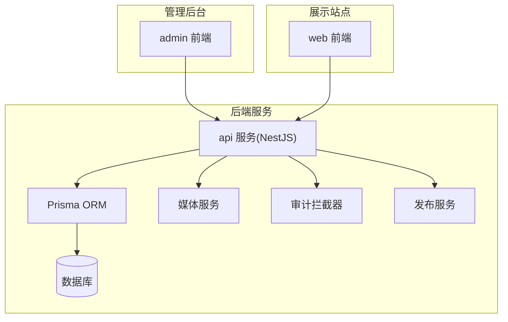
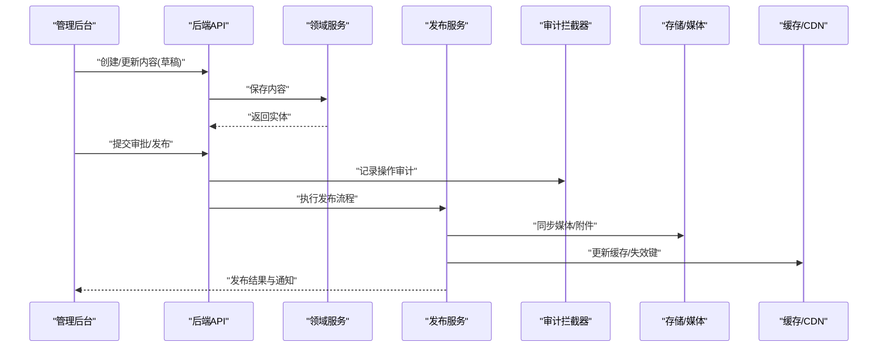
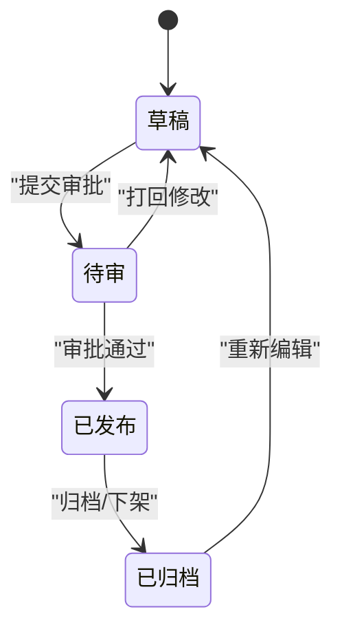
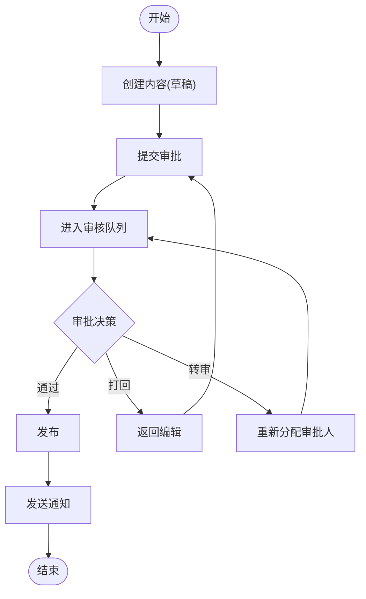
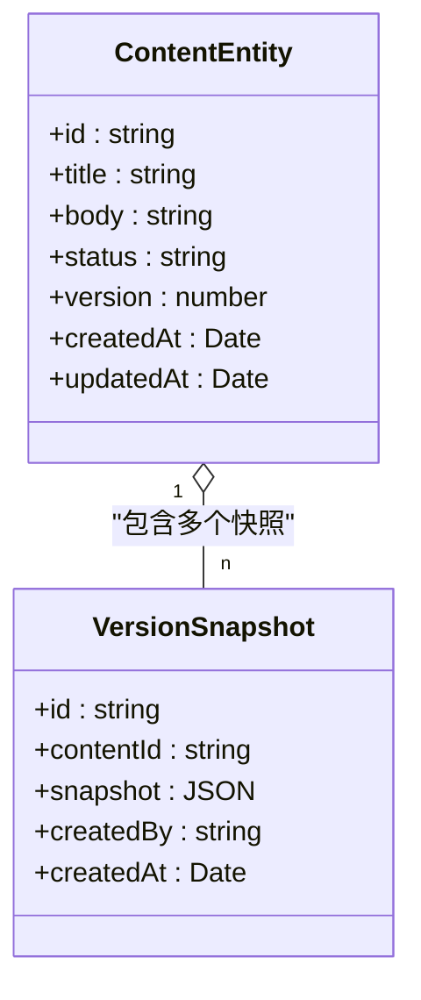
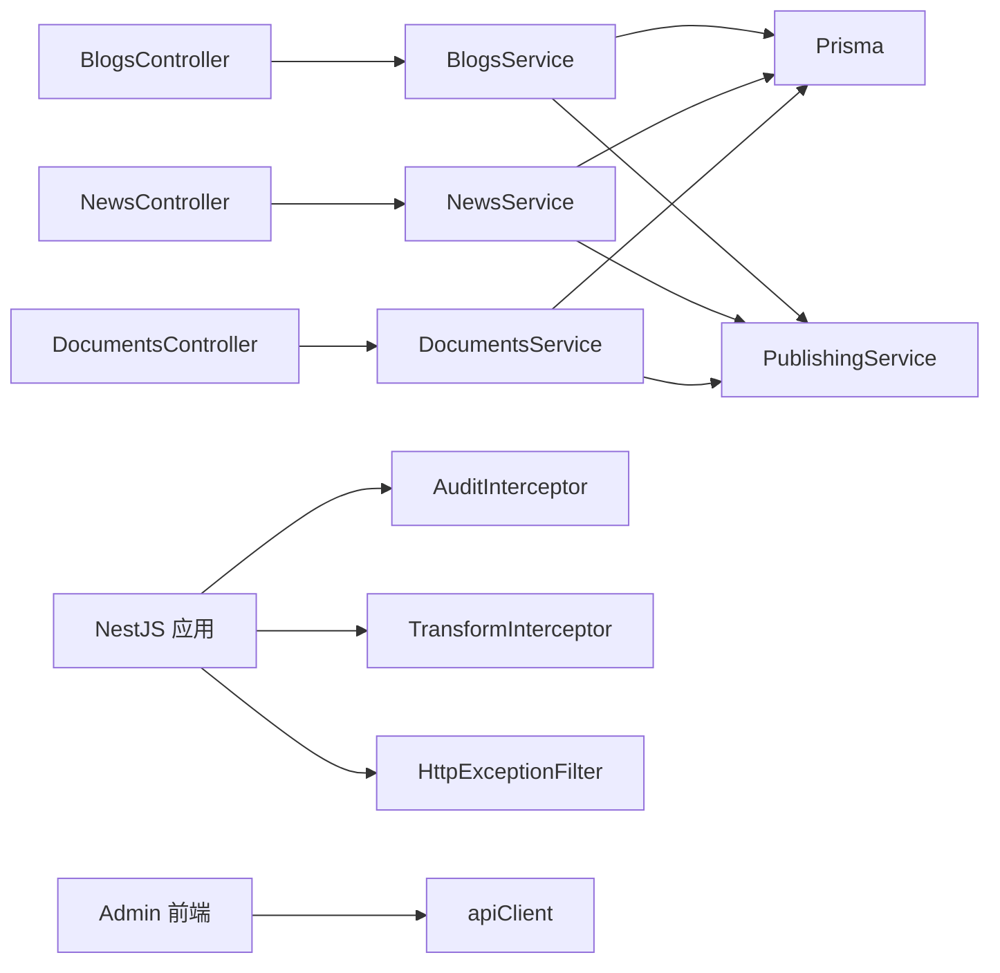

# 内容工作流

<cite>
**本文引用的文件**   
- [content-status.enum.ts](file://apps/api/src/common/enums/content-status.enum.ts)
- [blogs.controller.ts](file://apps/api/src/blogs/blogs.controller.ts)
- [blogs.service.ts](file://apps/api/src/blogs/blogs.service.ts)
- [news.controller.ts](file://apps/api/src/news/news.controller.ts)
- [news.service.ts](file://apps/api/src/news/news.service.ts)
- [documents.controller.ts](file://apps/api/src/documents/documents.controller.ts)
- [documents.service.ts](file://apps/api/src/documents/documents.service.ts)
- [publishing.service.ts](file://apps/api/src/publishing/publishing.service.ts)
- [audit.interceptor.ts](file://apps/api/src/common/interceptors/audit.interceptor.ts)
- [transform.interceptor.ts](file://apps/api/src/common/interceptors/transform.interceptor.ts)
- [http-exception.filter.ts](file://apps/api/src/common/filters/http-exception.filter.ts)
- [schema.prisma](file://apps/api/prisma/schema.prisma)
- [seed-content-media.ts](file://apps/api/prisma/seed-content-media.ts)
- [sync-content-media.ts](file://apps/api/prisma/lib/sync-content-media.ts)
- [apiClient.ts](file://apps/admin/src/lib/apiClient.ts)
- [ResourceEditor.tsx](file://apps/admin/src/components/crud/ResourceEditor.tsx)
- [ResourceForm.tsx](file://apps/admin/src/components/crud/ResourceForm.tsx)
- [ResourceListView.tsx](file://apps/admin/src/components/crud/ResourceListView.tsx)
- [blog.tsx](file://apps/admin/src/features/resources/blog.tsx)
- [news.tsx](file://apps/admin/src/features/resources/news.tsx)
- [documents.tsx](file://apps/admin/src/features/resources/documents.tsx)
- [site-notifications.ts](file://apps/admin/src/features/site-notifications.ts)
- [notify.ts](file://apps/admin/src/lib/notify.ts)
</cite>

## 目录
1. [引言](#引言)
2. [项目结构](#项目结构)
3. [核心组件](#核心组件)
4. [架构总览](#架构总览)
5. [详细组件分析](#详细组件分析)
6. [依赖关系分析](#依赖关系分析)
7. [性能考虑](#性能考虑)
8. [故障排查指南](#故障排查指南)
9. [结论](#结论)
10. [附录](#附录)

## 引言
本文件面向“内容工作流”的完整生命周期管理，覆盖从草稿到发布的状态机、审批流程与版本控制机制，并给出审核队列、批量操作与内容迁移工具的设计说明。同时提供API接口规范（支持自定义审批规则与通知）、缓存更新策略与实时同步机制的实现要点，帮助读者快速理解并扩展系统能力。

## 项目结构
本项目采用前后端分离的多应用结构：
- apps/admin：管理后台前端（Next.js），负责内容编辑、列表、预览、权限与通知等。
- apps/api：后端服务（NestJS），提供内容CRUD、发布、审计、媒体、设置、集成等能力。
- apps/web：对外展示站点（Next.js），消费API进行渲染。
- prisma：数据库模型与种子数据、迁移脚本。
- infra：容器化与部署配置。
- packages：共享包（主题、UI、类型等）。

图表来源
- [blogs.controller.ts](file://apps/api/src/blogs/blogs.controller.ts)
- [news.controller.ts](file://apps/api/src/news/news.controller.ts)
- [documents.controller.ts](file://apps/api/src/documents/documents.controller.ts)
- [publishing.service.ts](file://apps/api/src/publishing/publishing.service.ts)
- [audit.interceptor.ts](file://apps/api/src/common/interceptors/audit.interceptor.ts)
- [schema.prisma](file://apps/api/prisma/schema.prisma)

章节来源
- [blogs.controller.ts](file://apps/api/src/blogs/blogs.controller.ts)
- [news.controller.ts](file://apps/api/src/news/news.controller.ts)
- [documents.controller.ts](file://apps/api/src/documents/documents.controller.ts)
- [publishing.service.ts](file://apps/api/src/publishing/publishing.service.ts)
- [audit.interceptor.ts](file://apps/api/src/common/interceptors/audit.interceptor.ts)
- [schema.prisma](file://apps/api/prisma/schema.prisma)

## 核心组件
- 内容状态枚举：定义内容生命周期状态（如草稿、待审、已发布、已归档等），作为状态机的基础。
- 领域控制器与服务：博客、新闻、文档等内容的CRUD与业务编排。
- 发布服务：统一处理发布、回滚、批量发布等操作。
- 审计与转换拦截器：记录变更、标准化响应格式。
- 异常过滤器：统一错误处理与返回。
- 前端资源编辑器与列表：统一的表单、列表、预览与操作入口。
- 通知模块：站内通知与邮件模板。

章节来源
- [content-status.enum.ts](file://apps/api/src/common/enums/content-status.enum.ts)
- [blogs.service.ts](file://apps/api/src/blogs/blogs.service.ts)
- [news.service.ts](file://apps/api/src/news/news.service.ts)
- [documents.service.ts](file://apps/api/src/documents/documents.service.ts)
- [publishing.service.ts](file://apps/api/src/publishing/publishing.service.ts)
- [audit.interceptor.ts](file://apps/api/src/common/interceptors/audit.interceptor.ts)
- [transform.interceptor.ts](file://apps/api/src/common/interceptors/transform.interceptor.ts)
- [http-exception.filter.ts](file://apps/api/src/common/filters/http-exception.filter.ts)
- [ResourceEditor.tsx](file://apps/admin/src/components/crud/ResourceEditor.tsx)
- [ResourceForm.tsx](file://apps/admin/src/components/crud/ResourceForm.tsx)
- [ResourceListView.tsx](file://apps/admin/src/components/crud/ResourceListView.tsx)

## 架构总览
内容工作流的核心交互路径如下：
- 管理员在前端创建/编辑内容，提交至后端API。
- 后端通过控制器接收请求，进入服务层进行校验、持久化与状态流转。
- 发布阶段由发布服务协调，触发审计记录、媒体同步、缓存更新与通知。
- 展示站点通过API读取已发布内容，必要时走缓存或CDN。

图表来源
- [blogs.controller.ts](file://apps/api/src/blogs/blogs.controller.ts)
- [blogs.service.ts](file://apps/api/src/blogs/blogs.service.ts)
- [publishing.service.ts](file://apps/api/src/publishing/publishing.service.ts)
- [audit.interceptor.ts](file://apps/api/src/common/interceptors/audit.interceptor.ts)

## 详细组件分析

### 内容状态机与生命周期
- 状态定义：通过统一的状态枚举管理内容状态，确保跨模块一致。
- 状态流转：草稿→待审→已发布→已归档；支持回退与撤销。
- 约束与校验：在保存与发布时进行字段校验、权限校验与业务规则校验。

图表来源
- [content-status.enum.ts](file://apps/api/src/common/enums/content-status.enum.ts)

章节来源
- [content-status.enum.ts](file://apps/api/src/common/enums/content-status.enum.ts)

### 审批流程与审核队列
- 审批触发：在提交发布前进入待审状态，等待审批人处理。
- 审核队列：基于任务队列或数据库表维护待审项，支持优先级与重试。
- 审批动作：通过、打回、转审、加签等。
- 并发控制：使用乐观锁或版本号避免重复审批。

图表来源
- [publishing.service.ts](file://apps/api/src/publishing/publishing.service.ts)
- [audit.interceptor.ts](file://apps/api/src/common/interceptors/audit.interceptor.ts)

章节来源
- [publishing.service.ts](file://apps/api/src/publishing/publishing.service.ts)
- [audit.interceptor.ts](file://apps/api/src/common/interceptors/audit.interceptor.ts)

### 版本控制机制
- 版本字段：为内容实体增加版本号，每次变更递增。
- 快照策略：关键节点（如提交审批、发布）生成快照，便于回溯。
- 冲突解决：合并策略与冲突提示，支持手动干预。

图表来源
- [schema.prisma](file://apps/api/prisma/schema.prisma)

章节来源
- [schema.prisma](file://apps/api/prisma/schema.prisma)

### 内容审核队列实现要点
- 入队：提交审批时写入队列或数据库任务表。
- 出队：消费者轮询或事件驱动处理，支持幂等与重试。
- 状态同步：处理完成后更新内容状态与审计日志。
- 监控：失败告警与死信队列。

章节来源
- [publishing.service.ts](file://apps/api/src/publishing/publishing.service.ts)
- [audit.interceptor.ts](file://apps/api/src/common/interceptors/audit.interceptor.ts)

### 批量操作与内容迁移工具
- 批量操作：批量发布、批量归档、批量转移分类等。
- 迁移工具：脚本化数据迁移，保证一致性；支持回滚。
- 进度与报告：输出执行日志与统计。

章节来源
- [seed-content-media.ts](file://apps/api/prisma/seed-content-media.ts)
- [sync-content-media.ts](file://apps/api/prisma/lib/sync-content-media.ts)

### 内容工作流API接口规范
- 通用约定：
  - 认证与授权：JWT鉴权与角色权限控制。
  - 请求体：统一DTO校验，错误码与消息标准化。
  - 响应体：统一包装格式，分页与排序参数。
- 内容CRUD：
  - 列表查询：支持过滤、排序、分页、全文检索。
  - 详情获取：按ID或Slug获取，支持多语言。
  - 创建/更新：草稿态保存，字段校验与媒体关联。
  - 删除/软删：逻辑删除与回收站。
- 发布与审批：
  - 提交审批：将内容置为待审，记录审计。
  - 审批通过/打回：状态流转与通知。
  - 发布：更新状态为已发布，触发缓存更新与媒体同步。
- 版本与快照：
  - 获取历史版本：按时间或版本号查询。
  - 恢复版本：基于快照重建当前版本。
- 通知：
  - 站内通知：创建通知记录与推送。
  - 邮件模板：根据事件选择模板并发送。

章节来源
- [blogs.controller.ts](file://apps/api/src/blogs/blogs.controller.ts)
- [blogs.service.ts](file://apps/api/src/blogs/blogs.service.ts)
- [news.controller.ts](file://apps/api/src/news/news.controller.ts)
- [news.service.ts](file://apps/api/src/news/news.service.ts)
- [documents.controller.ts](file://apps/api/src/documents/documents.controller.ts)
- [documents.service.ts](file://apps/api/src/documents/documents.service.ts)
- [publishing.service.ts](file://apps/api/src/publishing/publishing.service.ts)
- [audit.interceptor.ts](file://apps/api/src/common/interceptors/audit.interceptor.ts)
- [transform.interceptor.ts](file://apps/api/src/common/interceptors/transform.interceptor.ts)
- [http-exception.filter.ts](file://apps/api/src/common/filters/http-exception.filter.ts)

### 前端资源编辑器与列表
- ResourceEditor：统一编辑器外壳，集成Markdown/富文本、媒体选择与预览。
- ResourceForm：表单封装，支持动态字段、校验与提交。
- ResourceListView：列表视图，支持筛选、排序、分页与批量操作。
- 特性配置：各资源（博客、新闻、文档）通过配置文件声明列、表单与权限。

章节来源
- [ResourceEditor.tsx](file://apps/admin/src/components/crud/ResourceEditor.tsx)
- [ResourceForm.tsx](file://apps/admin/src/components/crud/ResourceForm.tsx)
- [ResourceListView.tsx](file://apps/admin/src/components/crud/ResourceListView.tsx)
- [blog.tsx](file://apps/admin/src/features/resources/blog.tsx)
- [news.tsx](file://apps/admin/src/features/resources/news.tsx)
- [documents.tsx](file://apps/admin/src/features/resources/documents.tsx)

### 通知机制
- 站内通知：基于事件创建通知记录，前端轮询或WebSocket推送。
- 邮件模板：根据事件类型选择模板，支持变量替换。
- 配置：通过设置模块管理通知开关与模板。

章节来源
- [site-notifications.ts](file://apps/admin/src/features/site-notifications.ts)
- [notify.ts](file://apps/admin/src/lib/notify.ts)

## 依赖关系分析
- 控制器依赖服务：每个领域控制器调用对应服务完成业务逻辑。
- 服务依赖ORM与外部服务：通过Prisma访问数据库，调用媒体服务与发布服务。
- 拦截器与过滤器：全局审计、响应转换与异常处理。
- 前端依赖API客户端：统一封装请求、重试与错误处理。

图表来源
- [blogs.controller.ts](file://apps/api/src/blogs/blogs.controller.ts)
- [blogs.service.ts](file://apps/api/src/blogs/blogs.service.ts)
- [news.controller.ts](file://apps/api/src/news/news.controller.ts)
- [news.service.ts](file://apps/api/src/news/news.service.ts)
- [documents.controller.ts](file://apps/api/src/documents/documents.controller.ts)
- [documents.service.ts](file://apps/api/src/documents/documents.service.ts)
- [publishing.service.ts](file://apps/api/src/publishing/publishing.service.ts)
- [audit.interceptor.ts](file://apps/api/src/common/interceptors/audit.interceptor.ts)
- [transform.interceptor.ts](file://apps/api/src/common/interceptors/transform.interceptor.ts)
- [http-exception.filter.ts](file://apps/api/src/common/filters/http-exception.filter.ts)
- [apiClient.ts](file://apps/admin/src/lib/apiClient.ts)

章节来源
- [blogs.controller.ts](file://apps/api/src/blogs/blogs.controller.ts)
- [blogs.service.ts](file://apps/api/src/blogs/blogs.service.ts)
- [news.controller.ts](file://apps/api/src/news/news.controller.ts)
- [news.service.ts](file://apps/api/src/news/news.service.ts)
- [documents.controller.ts](file://apps/api/src/documents/documents.controller.ts)
- [documents.service.ts](file://apps/api/src/documents/documents.service.ts)
- [publishing.service.ts](file://apps/api/src/publishing/publishing.service.ts)
- [audit.interceptor.ts](file://apps/api/src/common/interceptors/audit.interceptor.ts)
- [transform.interceptor.ts](file://apps/api/src/common/interceptors/transform.interceptor.ts)
- [http-exception.filter.ts](file://apps/api/src/common/filters/http-exception.filter.ts)
- [apiClient.ts](file://apps/admin/src/lib/apiClient.ts)

## 性能考虑
- 缓存策略：
  - 读多写少场景使用缓存（Redis）与CDN，发布后失效相关键。
  - 列表页分页与增量更新，减少全量拉取。
- 异步处理：
  - 发布、媒体同步、通知等耗时操作放入队列异步执行。
- 数据库优化：
  - 合理索引与查询条件，避免N+1问题。
- 前端优化：
  - 懒加载与虚拟滚动，减少首屏压力。

[本节为通用指导，不直接分析具体文件]

## 故障排查指南
- 常见错误：
  - 权限不足：检查JWT与角色权限配置。
  - 状态非法：确认状态机流转是否允许该操作。
  - 媒体同步失败：检查存储配置与网络连通性。
- 调试手段：
  - 审计日志：查看操作记录与变更轨迹。
  - 异常过滤器：统一错误信息定位问题。
  - 前端控制台：查看请求与响应细节。

章节来源
- [audit.interceptor.ts](file://apps/api/src/common/interceptors/audit.interceptor.ts)
- [http-exception.filter.ts](file://apps/api/src/common/filters/http-exception.filter.ts)

## 结论
本工作流以统一状态机为核心，结合审批队列、版本控制与发布服务，形成完整的从草稿到发布的内容生命周期管理。通过拦截器与过滤器保障可观测性与健壮性，前端提供统一的编辑与列表体验。建议在生产环境引入队列与缓存，提升吞吐与稳定性，并通过审计与通知完善协作闭环。

## 附录
- 术语表：
  - 草稿：未提交或未发布的内容版本。
  - 待审：已进入审批流程的内容。
  - 已发布：对外可见的内容。
  - 已归档：不再公开但保留的历史内容。
- 最佳实践：
  - 严格状态机约束，避免非法跳转。
  - 关键操作必须记录审计日志。
  - 发布前进行完整性校验与媒体同步。
  - 通知与缓存更新需幂等与重试。

[本节为概念性总结，不直接分析具体文件]