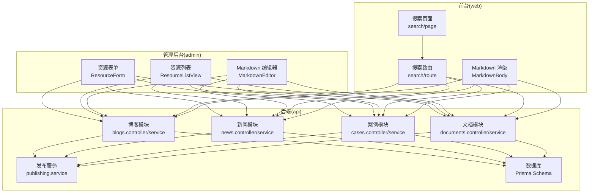
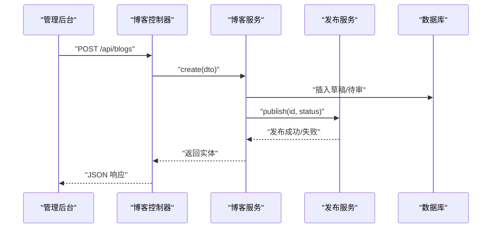
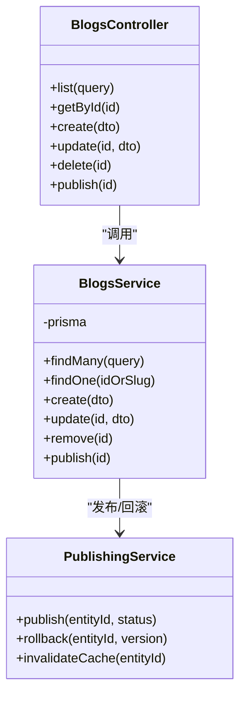
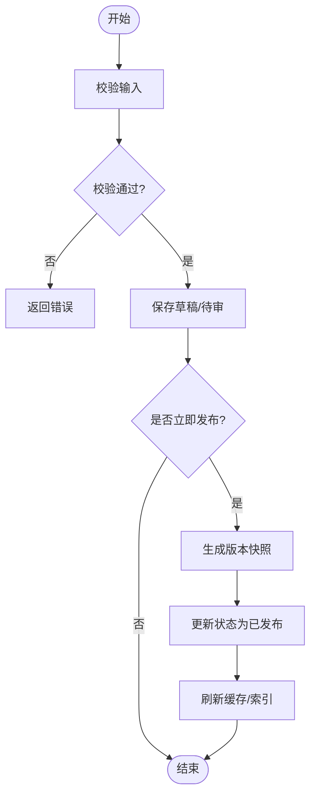
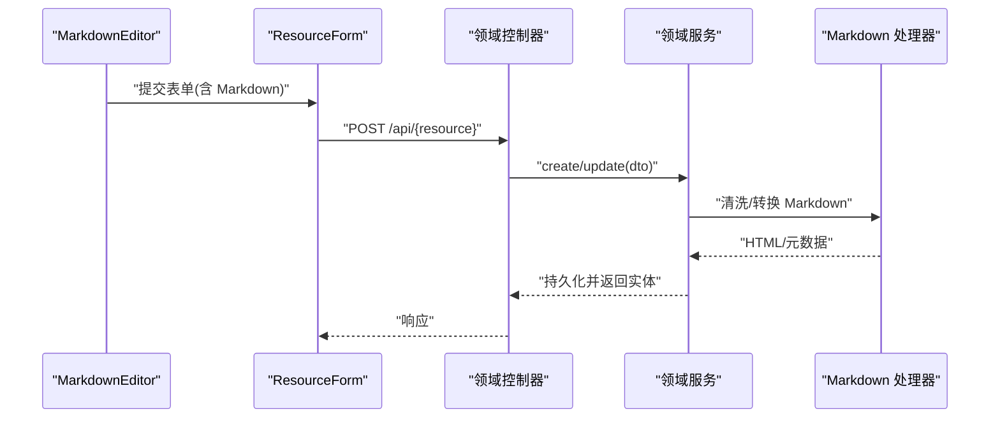
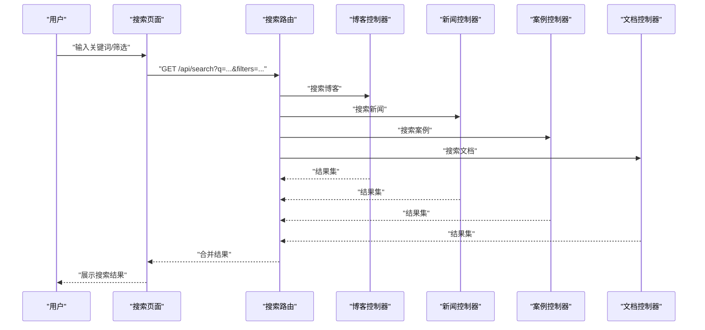
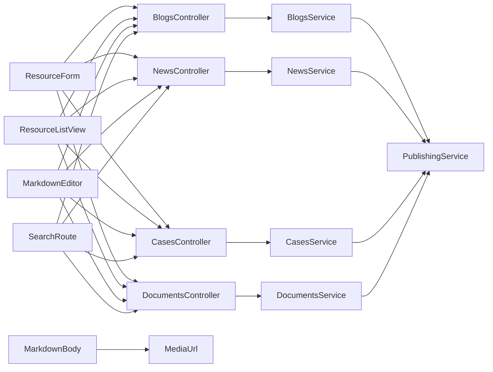

# 内容管理系统

<cite>
**本文引用的文件**   
- [apps/admin/src/components/crud/MarkdownEditor.tsx](file://apps/admin/src/components/crud/MarkdownEditor.tsx)
- [apps/admin/src/components/crud/ResourceForm.tsx](file://apps/admin/src/components/crud/ResourceForm.tsx)
- [apps/admin/src/components/crud/ResourceListView.tsx](file://apps/admin/src/components/crud/ResourceListView.tsx)
- [apps/admin/src/features/resources/blog.tsx](file://apps/admin/src/features/resources/blog.tsx)
- [apps/admin/src/features/resources/news.tsx](file://apps/admin/src/features/resources/news.tsx)
- [apps/admin/src/features/resources/cases.tsx](file://apps/admin/src/features/resources/cases.tsx)
- [apps/admin/src/features/resources/documents.tsx](file://apps/admin/src/features/resources/documents.tsx)
- [apps/api/src/blogs/blogs.controller.ts](file://apps/api/src/blogs/blogs.controller.ts)
- [apps/api/src/blogs/blogs.service.ts](file://apps/api/src/blogs/blogs.service.ts)
- [apps/api/src/news/news.controller.ts](file://apps/api/src/news/news.controller.ts)
- [apps/api/src/news/news.service.ts](file://apps/api/src/news/news.service.ts)
- [apps/api/src/cases/cases.controller.ts](file://apps/api/src/cases/cases.controller.ts)
- [apps/api/src/cases/cases.service.ts](file://apps/api/src/cases/cases.service.ts)
- [apps/api/src/documents/documents.controller.ts](file://apps/api/src/documents/documents.controller.ts)
- [apps/api/src/documents/documents.service.ts](file://apps/api/src/documents/documents.service.ts)
- [apps/api/src/common/enums/content-status.enum.ts](file://apps/api/src/common/enums/content-status.enum.ts)
- [apps/api/src/publishing/publishing.service.ts](file://apps/api/src/publishing/publishing.service.ts)
- [apps/api/src/prisma/schema.prisma](file://apps/api/src/prisma/schema.prisma)
- [apps/web/src/lib/search/route.ts](file://apps/web/src/lib/search/route.ts)
- [apps/web/src/app/[locale]/search/page.tsx](file://apps/web/src/app/[locale]/search/page.tsx)
- [apps/web/src/components/content/MarkdownBody.tsx](file://apps/web/src/components/content/MarkdownBody.tsx)
- [apps/web/src/lib/media-url.ts](file://apps/web/src/lib/media-url.ts)
</cite>

## 目录
1. [简介](#简介)
2. [项目结构](#项目结构)
3. [核心组件](#核心组件)
4. [架构总览](#架构总览)
5. [详细组件分析](#详细组件分析)
6. [依赖关系分析](#依赖关系分析)
7. [性能考量](#性能考量)
8. [故障排查指南](#故障排查指南)
9. [结论](#结论)
10. [附录](#附录)

## 简介
本文件系统性地梳理内容管理系统的实现与使用，覆盖博客、新闻、案例与文档等内容的增删改查（CRUD）、版本控制与发布流程；说明 Markdown 编辑器集成、富文本处理、标签分类与搜索能力；并给出内容审核、草稿管理、批量操作与内容迁移工具的使用建议。同时提供内容 API 接口规范与前端集成指南，帮助开发者快速接入与扩展。

## 项目结构
系统采用前后端分离的多应用架构：
- admin：管理后台（Next.js），提供资源编辑、列表、媒体选择与 Markdown 编辑器等界面。
- api：后端服务（NestJS），按领域划分模块（blogs、news、cases、documents 等），统一鉴权、审计、存储与发布服务。
- web：面向用户的前台站点（Next.js），负责内容展示、搜索与媒体渲染。
- infra：容器化与部署配置（Docker、Nginx、MinIO、Postgres、Redis）。
- packages：共享包（主题、UI、类型定义等）。

图表来源
- [apps/admin/src/components/crud/ResourceForm.tsx](file://apps/admin/src/components/crud/ResourceForm.tsx)
- [apps/admin/src/components/crud/ResourceListView.tsx](file://apps/admin/src/components/crud/ResourceListView.tsx)
- [apps/admin/src/components/crud/MarkdownEditor.tsx](file://apps/admin/src/components/crud/MarkdownEditor.tsx)
- [apps/api/src/blogs/blogs.controller.ts](file://apps/api/src/blogs/blogs.controller.ts)
- [apps/api/src/news/news.controller.ts](file://apps/api/src/news/news.controller.ts)
- [apps/api/src/cases/cases.controller.ts](file://apps/api/src/cases/cases.controller.ts)
- [apps/api/src/documents/documents.controller.ts](file://apps/api/src/documents/documents.controller.ts)
- [apps/api/src/publishing/publishing.service.ts](file://apps/api/src/publishing/publishing.service.ts)
- [apps/api/src/prisma/schema.prisma](file://apps/api/src/prisma/schema.prisma)
- [apps/web/src/lib/search/route.ts](file://apps/web/src/lib/search/route.ts)
- [apps/web/src/app/[locale]/search/page.tsx](file://apps/web/src/app/[locale]/search/page.tsx)
- [apps/web/src/components/content/MarkdownBody.tsx](file://apps/web/src/components/content/MarkdownBody.tsx)

章节来源
- [apps/admin/src/components/crud/ResourceForm.tsx](file://apps/admin/src/components/crud/ResourceForm.tsx)
- [apps/admin/src/components/crud/ResourceListView.tsx](file://apps/admin/src/components/crud/ResourceListView.tsx)
- [apps/admin/src/components/crud/MarkdownEditor.tsx](file://apps/admin/src/components/crud/MarkdownEditor.tsx)
- [apps/api/src/blogs/blogs.controller.ts](file://apps/api/src/blogs/blogs.controller.ts)
- [apps/api/src/news/news.controller.ts](file://apps/api/src/news/news.controller.ts)
- [apps/api/src/cases/cases.controller.ts](file://apps/api/src/cases/cases.controller.ts)
- [apps/api/src/documents/documents.controller.ts](file://apps/api/src/documents/documents.controller.ts)
- [apps/api/src/publishing/publishing.service.ts](file://apps/api/src/publishing/publishing.service.ts)
- [apps/api/src/prisma/schema.prisma](file://apps/api/src/prisma/schema.prisma)
- [apps/web/src/lib/search/route.ts](file://apps/web/src/lib/search/route.ts)
- [apps/web/src/app/[locale]/search/page.tsx](file://apps/web/src/app/[locale]/search/page.tsx)
- [apps/web/src/components/content/MarkdownBody.tsx](file://apps/web/src/components/content/MarkdownBody.tsx)

## 核心组件
- 资源表单（ResourceForm）：统一的创建/编辑表单，支持标题、摘要、封面、正文（Markdown）、标签、分类、状态（草稿/待审/已发布）等字段。
- 资源列表（ResourceListView）：分页、筛选、排序、批量操作（启用/禁用、删除、导出）。
- Markdown 编辑器（MarkdownEditor）：基于 Vditor 的编辑器，支持预览、快捷键、图片上传、代码高亮、国际化。
- 领域控制器与服务（blogs/news/cases/documents）：分别暴露 CRUD 接口，封装业务逻辑与数据访问。
- 发布服务（publishing.service）：统一的内容发布编排，包含校验、版本记录、状态流转与缓存刷新。
- 搜索（web search）：前台搜索路由聚合各内容类型的索引查询，返回结构化结果。
- Markdown 渲染（MarkdownBody）：将 Markdown 安全地渲染为 HTML，适配主题与媒体链接。

章节来源
- [apps/admin/src/components/crud/ResourceForm.tsx](file://apps/admin/src/components/crud/ResourceForm.tsx)
- [apps/admin/src/components/crud/ResourceListView.tsx](file://apps/admin/src/components/crud/ResourceListView.tsx)
- [apps/admin/src/components/crud/MarkdownEditor.tsx](file://apps/admin/src/components/crud/MarkdownEditor.tsx)
- [apps/api/src/blogs/blogs.controller.ts](file://apps/api/src/blogs/blogs.controller.ts)
- [apps/api/src/news/news.controller.ts](file://apps/api/src/news/news.controller.ts)
- [apps/api/src/cases/cases.controller.ts](file://apps/api/src/cases/cases.controller.ts)
- [apps/api/src/documents/documents.controller.ts](file://apps/api/src/documents/documents.controller.ts)
- [apps/api/src/publishing/publishing.service.ts](file://apps/api/src/publishing/publishing.service.ts)
- [apps/web/src/lib/search/route.ts](file://apps/web/src/lib/search/route.ts)
- [apps/web/src/components/content/MarkdownBody.tsx](file://apps/web/src/components/content/MarkdownBody.tsx)

## 架构总览
内容管理系统的整体交互如下：
- 管理后台通过 ResourceForm/ResourceListView 调用后端各领域的 Controller。
- Controller 委托 Service 完成数据校验、持久化与发布编排。
- 发布服务协调状态机、版本记录与缓存更新。
- 前台通过搜索路由获取内容，并使用 MarkdownBody 渲染正文。

图表来源
- [apps/api/src/blogs/blogs.controller.ts](file://apps/api/src/blogs/blogs.controller.ts)
- [apps/api/src/blogs/blogs.service.ts](file://apps/api/src/blogs/blogs.service.ts)
- [apps/api/src/publishing/publishing.service.ts](file://apps/api/src/publishing/publishing.service.ts)
- [apps/api/src/prisma/schema.prisma](file://apps/api/src/prisma/schema.prisma)

## 详细组件分析

### 博客模块（blogs）
- 职责：提供博客内容的 CRUD、状态管理与发布流程。
- 关键接口：
  - 列表：支持分页、筛选（状态、标签、分类）、排序。
  - 详情：根据 ID 或 slug 获取。
  - 创建/更新：接收 DTO，写入数据库并生成版本快照。
  - 删除：软删除或物理删除（视策略而定）。
  - 发布：触发发布服务进行状态流转与缓存更新。
- 数据模型：标题、slug、摘要、正文（Markdown）、封面、标签、分类、作者、状态、发布时间等。
- 版本控制：每次提交生成版本记录，支持回滚到指定版本。
- 审核流程：草稿→待审→已发布/已下架。

图表来源
- [apps/api/src/blogs/blogs.controller.ts](file://apps/api/src/blogs/blogs.controller.ts)
- [apps/api/src/blogs/blogs.service.ts](file://apps/api/src/blogs/blogs.service.ts)
- [apps/api/src/publishing/publishing.service.ts](file://apps/api/src/publishing/publishing.service.ts)

章节来源
- [apps/api/src/blogs/blogs.controller.ts](file://apps/api/src/blogs/blogs.controller.ts)
- [apps/api/src/blogs/blogs.service.ts](file://apps/api/src/blogs/blogs.service.ts)
- [apps/api/src/publishing/publishing.service.ts](file://apps/api/src/publishing/publishing.service.ts)

### 新闻模块（news）
- 职责：新闻内容的快速发布与归档，支持置顶、推荐位与定时发布。
- 关键接口：与博客类似，但强调时效性与推荐位管理。
- 版本控制：保留历史版本，支持一键恢复。
- 审核流程：草稿→待审→已发布。

章节来源
- [apps/api/src/news/news.controller.ts](file://apps/api/src/news/news.controller.ts)
- [apps/api/src/news/news.service.ts](file://apps/api/src/news/news.service.ts)
- [apps/api/src/publishing/publishing.service.ts](file://apps/api/src/publishing/publishing.service.ts)

### 案例模块（cases）
- 职责：案例库管理，支持多标签、多分类、关联产品与解决方案。
- 关键接口：列表、详情、创建/更新、删除、发布。
- 版本控制：版本快照与差异对比。
- 审核流程：草稿→待审→已发布。

章节来源
- [apps/api/src/cases/cases.controller.ts](file://apps/api/src/cases/cases.controller.ts)
- [apps/api/src/cases/cases.service.ts](file://apps/api/src/cases/cases.service.ts)
- [apps/api/src/publishing/publishing.service.ts](file://apps/api/src/publishing/publishing.service.ts)

### 文档模块（documents）
- 职责：文档知识库管理，支持文件夹树、权限控制、标签与全文检索。
- 关键接口：文件夹 CRUD、文档 CRUD、权限设置、移动/复制、批量导入/导出。
- 版本控制：版本历史、在线对比、回滚。
- 审核流程：草稿→待审→已发布。

章节来源
- [apps/api/src/documents/documents.controller.ts](file://apps/api/src/documents/documents.controller.ts)
- [apps/api/src/documents/documents.service.ts](file://apps/api/src/documents/documents.service.ts)
- [apps/api/src/publishing/publishing.service.ts](file://apps/api/src/publishing/publishing.service.ts)

### 内容状态与发布流程
- 状态枚举：草稿、待审、已发布、已下架。
- 发布编排：校验必填字段、生成 slug、写入版本、更新状态、刷新缓存。
- 回滚机制：基于版本号恢复到指定快照。

图表来源
- [apps/api/src/common/enums/content-status.enum.ts](file://apps/api/src/common/enums/content-status.enum.ts)
- [apps/api/src/publishing/publishing.service.ts](file://apps/api/src/publishing/publishing.service.ts)

章节来源
- [apps/api/src/common/enums/content-status.enum.ts](file://apps/api/src/common/enums/content-status.enum.ts)
- [apps/api/src/publishing/publishing.service.ts](file://apps/api/src/publishing/publishing.service.ts)

### Markdown 编辑器集成与富文本处理
- 编辑器：Vditor，支持预览、快捷键、图片上传、代码高亮、国际化。
- 富文本处理：服务端对 Markdown 进行清洗与转换，输出安全的 HTML。
- 媒体处理：统一媒体 URL 生成与 CDN 适配。

图表来源
- [apps/admin/src/components/crud/MarkdownEditor.tsx](file://apps/admin/src/components/crud/MarkdownEditor.tsx)
- [apps/admin/src/components/crud/ResourceForm.tsx](file://apps/admin/src/components/crud/ResourceForm.tsx)
- [apps/api/src/blogs/blogs.controller.ts](file://apps/api/src/blogs/blogs.controller.ts)
- [apps/api/src/blogs/blogs.service.ts](file://apps/api/src/blogs/blogs.service.ts)

章节来源
- [apps/admin/src/components/crud/MarkdownEditor.tsx](file://apps/admin/src/components/crud/MarkdownEditor.tsx)
- [apps/admin/src/components/crud/ResourceForm.tsx](file://apps/admin/src/components/crud/ResourceForm.tsx)
- [apps/web/src/components/content/MarkdownBody.tsx](file://apps/web/src/components/content/MarkdownBody.tsx)
- [apps/web/src/lib/media-url.ts](file://apps/web/src/lib/media-url.ts)

### 标签分类与搜索功能
- 标签分类：在资源表单中维护标签与分类，后端提供标签聚合与过滤接口。
- 搜索：前台搜索路由聚合各内容类型的索引查询，支持关键词、标签、分类、时间范围等条件。

图表来源
- [apps/web/src/lib/search/route.ts](file://apps/web/src/lib/search/route.ts)
- [apps/web/src/app/[locale]/search/page.tsx](file://apps/web/src/app/[locale]/search/page.tsx)
- [apps/api/src/blogs/blogs.controller.ts](file://apps/api/src/blogs/blogs.controller.ts)
- [apps/api/src/news/news.controller.ts](file://apps/api/src/news/news.controller.ts)
- [apps/api/src/cases/cases.controller.ts](file://apps/api/src/cases/cases.controller.ts)
- [apps/api/src/documents/documents.controller.ts](file://apps/api/src/documents/documents.controller.ts)

章节来源
- [apps/web/src/lib/search/route.ts](file://apps/web/src/lib/search/route.ts)
- [apps/web/src/app/[locale]/search/page.tsx](file://apps/web/src/app/[locale]/search/page.tsx)

### 内容审核、草稿管理与批量操作
- 草稿管理：所有新建内容默认进入草稿状态，支持保存进度与自动保存。
- 内容审核：待审内容需经审核通过后发布，支持批量审核通过/驳回。
- 批量操作：列表页支持批量启用/禁用、删除、导出 CSV/JSON。

章节来源
- [apps/admin/src/components/crud/ResourceListView.tsx](file://apps/admin/src/components/crud/ResourceListView.tsx)
- [apps/api/src/common/enums/content-status.enum.ts](file://apps/api/src/common/enums/content-status.enum.ts)

### 内容迁移工具
- 数据迁移：基于 Prisma 迁移脚本，确保数据库结构演进一致性。
- 内容迁移：提供种子脚本与迁移工具，用于从旧系统导入内容、媒体与标签。
- 媒体迁移：支持从本地/对象存储迁移至 MinIO/OSS，并更新引用路径。

章节来源
- [apps/api/src/prisma/schema.prisma](file://apps/api/src/prisma/schema.prisma)

## 依赖关系分析
- 管理后台依赖：ResourceForm/ResourceListView/MarkdownEditor 依赖各领域的 Controller。
- 后端模块依赖：各领域 Service 依赖 Prisma 客户端与发布服务。
- 前台依赖：搜索路由依赖各领域 Controller 的搜索接口；MarkdownBody 依赖媒体 URL 工具。

图表来源
- [apps/admin/src/components/crud/ResourceForm.tsx](file://apps/admin/src/components/crud/ResourceForm.tsx)
- [apps/admin/src/components/crud/ResourceListView.tsx](file://apps/admin/src/components/crud/ResourceListView.tsx)
- [apps/admin/src/components/crud/MarkdownEditor.tsx](file://apps/admin/src/components/crud/MarkdownEditor.tsx)
- [apps/api/src/blogs/blogs.controller.ts](file://apps/api/src/blogs/blogs.controller.ts)
- [apps/api/src/news/news.controller.ts](file://apps/api/src/news/news.controller.ts)
- [apps/api/src/cases/cases.controller.ts](file://apps/api/src/cases/cases.controller.ts)
- [apps/api/src/documents/documents.controller.ts](file://apps/api/src/documents/documents.controller.ts)
- [apps/api/src/blogs/blogs.service.ts](file://apps/api/src/blogs/blogs.service.ts)
- [apps/api/src/news/news.service.ts](file://apps/api/src/news/news.service.ts)
- [apps/api/src/cases/cases.service.ts](file://apps/api/src/cases/cases.service.ts)
- [apps/api/src/documents/documents.service.ts](file://apps/api/src/documents/documents.service.ts)
- [apps/api/src/publishing/publishing.service.ts](file://apps/api/src/publishing/publishing.service.ts)
- [apps/web/src/lib/search/route.ts](file://apps/web/src/lib/search/route.ts)
- [apps/web/src/components/content/MarkdownBody.tsx](file://apps/web/src/components/content/MarkdownBody.tsx)
- [apps/web/src/lib/media-url.ts](file://apps/web/src/lib/media-url.ts)

章节来源
- [apps/admin/src/components/crud/ResourceForm.tsx](file://apps/admin/src/components/crud/ResourceForm.tsx)
- [apps/admin/src/components/crud/ResourceListView.tsx](file://apps/admin/src/components/crud/ResourceListView.tsx)
- [apps/admin/src/components/crud/MarkdownEditor.tsx](file://apps/admin/src/components/crud/MarkdownEditor.tsx)
- [apps/api/src/blogs/blogs.controller.ts](file://apps/api/src/blogs/blogs.controller.ts)
- [apps/api/src/news/news.controller.ts](file://apps/api/src/news/news.controller.ts)
- [apps/api/src/cases/cases.controller.ts](file://apps/api/src/cases/cases.controller.ts)
- [apps/api/src/documents/documents.controller.ts](file://apps/api/src/documents/documents.controller.ts)
- [apps/api/src/blogs/blogs.service.ts](file://apps/api/src/blogs/blogs.service.ts)
- [apps/api/src/news/news.service.ts](file://apps/api/src/news/news.service.ts)
- [apps/api/src/cases/cases.service.ts](file://apps/api/src/cases/cases.service.ts)
- [apps/api/src/documents/documents.service.ts](file://apps/api/src/documents/documents.service.ts)
- [apps/api/src/publishing/publishing.service.ts](file://apps/api/src/publishing/publishing.service.ts)
- [apps/web/src/lib/search/route.ts](file://apps/web/src/lib/search/route.ts)
- [apps/web/src/components/content/MarkdownBody.tsx](file://apps/web/src/components/content/MarkdownBody.tsx)
- [apps/web/src/lib/media-url.ts](file://apps/web/src/lib/media-url.ts)

## 性能考量
- 列表分页与索引：对高频查询字段建立数据库索引，避免全表扫描。
- 缓存策略：发布后刷新缓存，热点内容使用 Redis 缓存。
- 媒体优化：图片懒加载、CDN 加速、按需生成缩略图。
- 搜索优化：构建倒排索引，增量更新索引，避免实时全量检索。
- 编辑器体验：自动保存与防抖提交，减少网络请求。

## 故障排查指南
- 发布失败：检查状态枚举与发布服务日志，确认必填字段与权限。
- 搜索无结果：核对索引是否更新，关键词分词是否正确。
- 媒体无法加载：检查媒体 URL 生成规则与 CDN 配置。
- Markdown 渲染异常：检查清洗规则与 HTML 白名单。

章节来源
- [apps/api/src/common/enums/content-status.enum.ts](file://apps/api/src/common/enums/content-status.enum.ts)
- [apps/api/src/publishing/publishing.service.ts](file://apps/api/src/publishing/publishing.service.ts)
- [apps/web/src/lib/media-url.ts](file://apps/web/src/lib/media-url.ts)
- [apps/web/src/components/content/MarkdownBody.tsx](file://apps/web/src/components/content/MarkdownBody.tsx)

## 结论
本内容管理系统以模块化设计实现博客、新闻、案例与文档的统一管理，提供完善的 CRUD、版本控制与发布流程；通过 Markdown 编辑器与富文本处理提升内容创作效率；借助标签分类与搜索增强内容发现能力；并通过审核、草稿与批量操作保障内容质量与运营效率。未来可进一步引入更细粒度的权限控制、AI 辅助写作与智能推荐。

## 附录
- API 接口规范（示例）
  - 博客
    - GET /api/blogs?status=&tag=&category=&page=&size=
    - GET /api/blogs/:id
    - POST /api/blogs
    - PUT /api/blogs/:id
    - DELETE /api/blogs/:id
    - POST /api/blogs/:id/publish
  - 新闻/案例/文档：结构与博客类似，按领域命名。
- 前端集成指南
  - 使用 ResourceForm 集成编辑器与表单校验。
  - 使用 ResourceListView 实现列表与批量操作。
  - 使用 MarkdownBody 渲染内容，结合 media-url 处理媒体链接。
  - 搜索通过 search/route 聚合查询，分页与筛选参数保持一致。