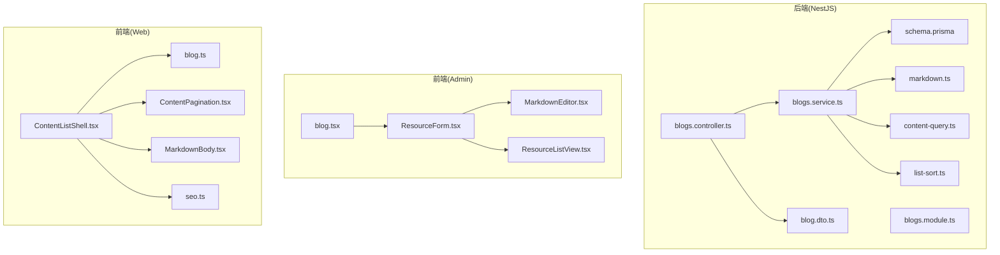
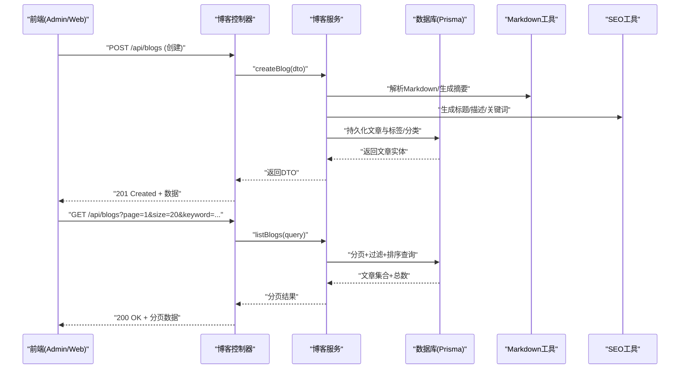
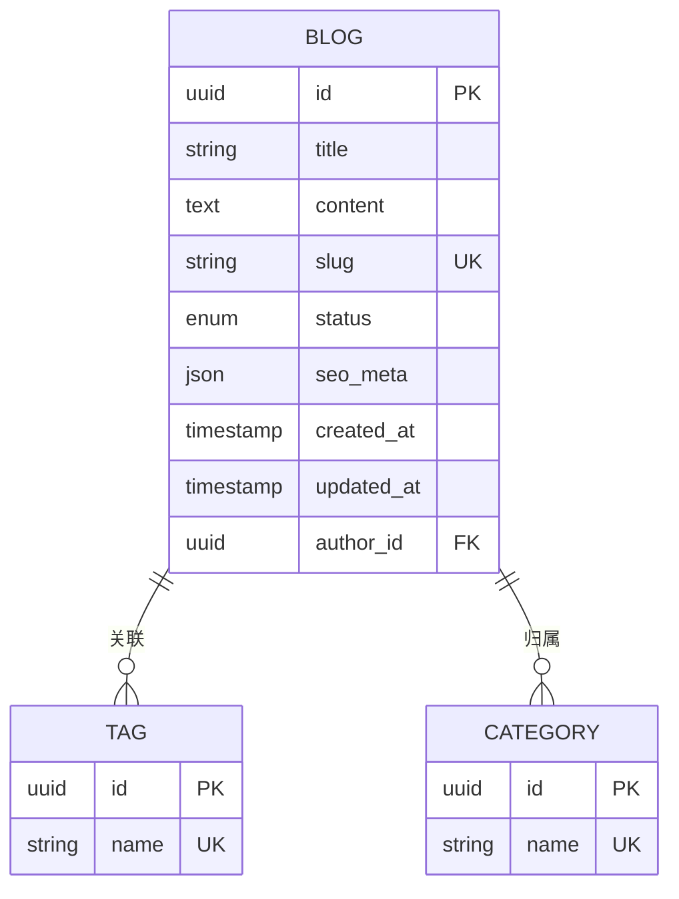
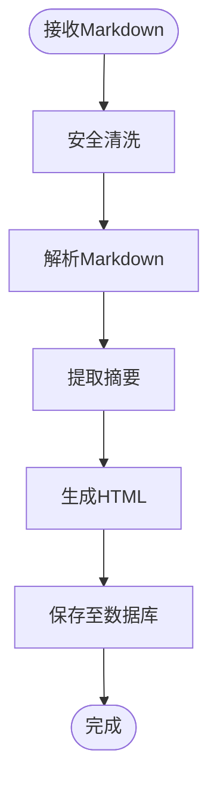
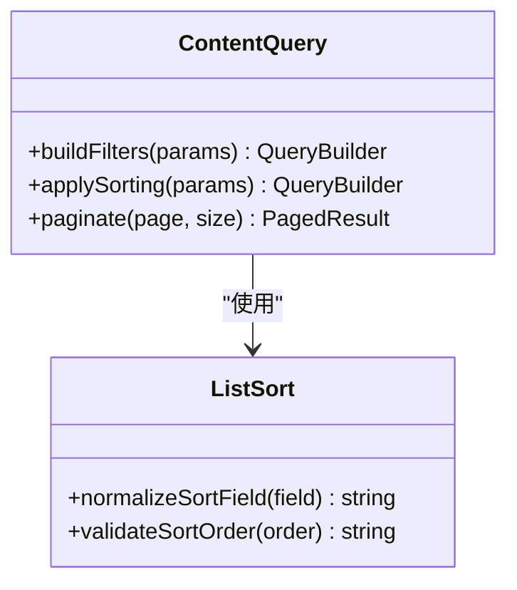
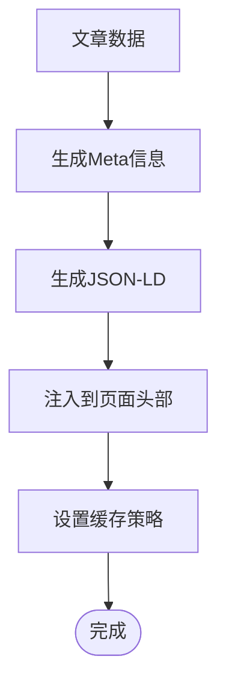
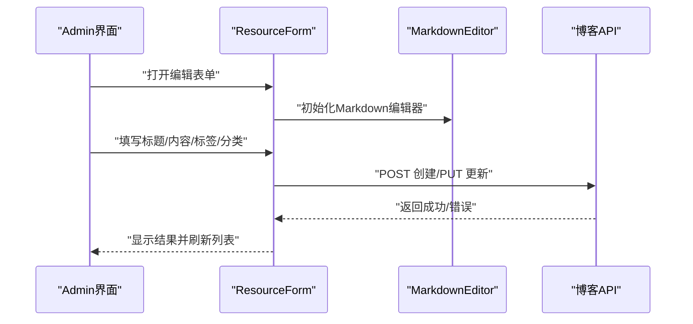
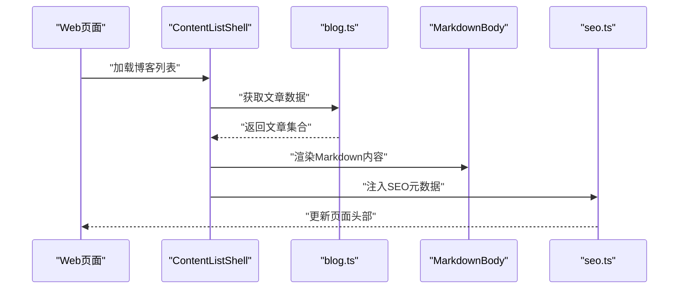
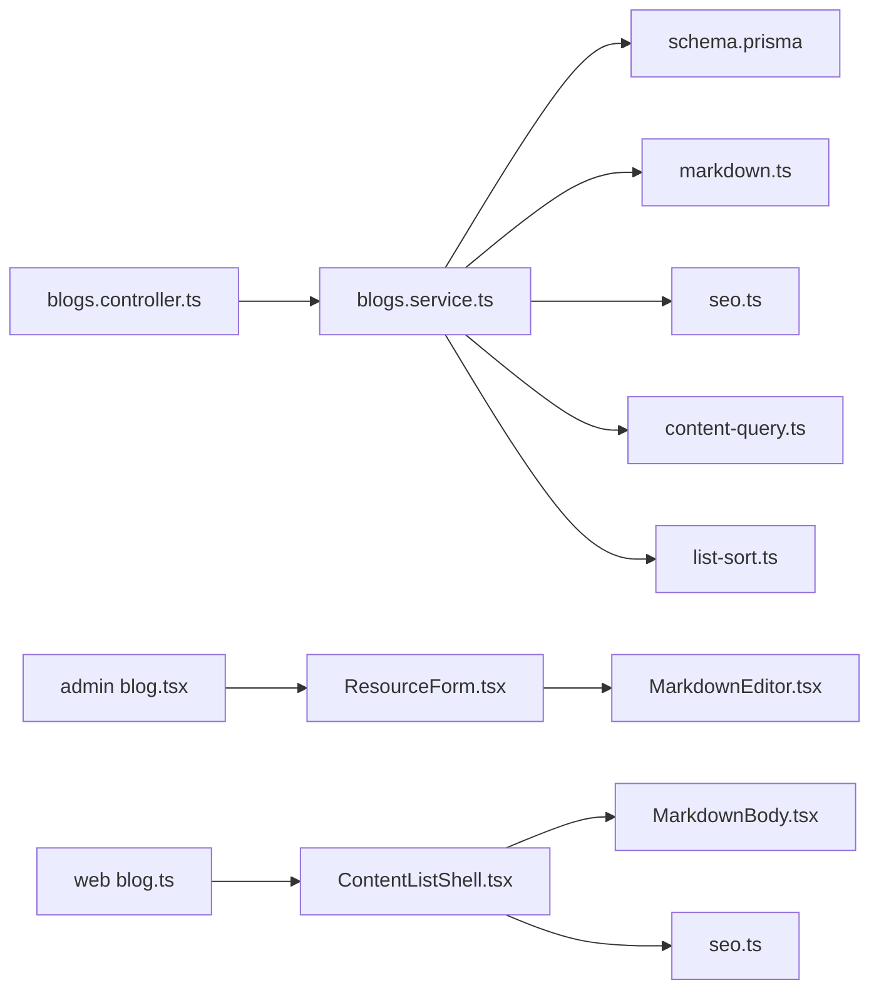

# 博客管理

<cite>
**本文引用的文件**   
- [blogs.controller.ts](file://apps/api/src/blogs/blogs.controller.ts)
- [blogs.service.ts](file://apps/api/src/blogs/blogs.service.ts)
- [blog.dto.ts](file://apps/api/src/blogs/dto/blog.dto.ts)
- [blogs.module.ts](file://apps/api/src/blogs/blogs.module.ts)
- [schema.prisma](file://apps/api/prisma/schema.prisma)
- [content-status.enum.ts](file://apps/api/src/common/enums/content-status.enum.ts)
- [markdown.ts](file://apps/api/src/common/utils/markdown.ts)
- [content-query.ts](file://apps/api/src/common/utils/content-query.ts)
- [list-sort.ts](file://apps/api/src/common/utils/list-sort.ts)
- [seo.ts](file://apps/web/src/lib/seo.ts)
- [MarkdownEditor.tsx](file://apps/admin/src/components/crud/MarkdownEditor.tsx)
- [ResourceForm.tsx](file://apps/admin/src/components/crud/ResourceForm.tsx)
- [ResourceListView.tsx](file://apps/admin/src/components/crud/ResourceListView.tsx)
- [blog.tsx](file://apps/admin/src/features/resources/blog.tsx)
- [blog.ts](file://apps/web/src/lib/blog.ts)
- [ContentListShell.tsx](file://apps/web/src/components/content/ContentListShell.tsx)
- [ContentPagination.tsx](file://apps/web/src/components/content/ContentPagination.tsx)
- [MarkdownBody.tsx](file://apps/web/src/components/content/MarkdownBody.tsx)
</cite>

## 目录
1. [简介](#简介)
2. [项目结构](#项目结构)
3. [核心组件](#核心组件)
4. [架构总览](#架构总览)
5. [详细组件分析](#详细组件分析)
6. [依赖关系分析](#依赖关系分析)
7. [性能考量](#性能考量)
8. [故障排查指南](#故障排查指南)
9. [结论](#结论)
10. [附录：API 规范与前端集成](#附录api-规范与前端集成)

## 简介
本模块为博客管理子系统，覆盖博客文章的创建、读取、更新、删除（CRUD）、Markdown 内容处理、标签与分类、SEO 优化、列表查询、搜索过滤、分页与批量操作。后端基于 NestJS + Prisma，提供 REST API；前端 Admin 端用于编辑与管理，Web 端用于展示与阅读。文档面向开发者与产品/运营人员，既包含代码级实现说明，也提供接口规范与最佳实践。

## 项目结构
- 后端（NestJS）
  - 控制器层：路由与参数校验、权限控制、响应格式化
  - 服务层：业务逻辑、数据访问、Markdown 处理、SEO 元信息生成
  - DTO：请求/响应数据结构定义与校验
  - 工具库：Markdown 转换、通用查询构建、排序、状态枚举等
  - 数据模型：Prisma Schema 定义实体与关系
- 前端（Admin）
  - 资源编辑器：Markdown 编辑器、表单封装、列表视图
  - 功能配置：博客资源的 CRUD 页面与交互流程
- 前端（Web）
  - 内容展示：Markdown 渲染、分页、SEO 注入、结构化数据

**图表来源** 
- [blogs.controller.ts](file://apps/api/src/blogs/blogs.controller.ts)
- [blogs.service.ts](file://apps/api/src/blogs/blogs.service.ts)
- [blog.dto.ts](file://apps/api/src/blogs/dto/blog.dto.ts)
- [blogs.module.ts](file://apps/api/src/blogs/blogs.module.ts)
- [content-query.ts](file://apps/api/src/common/utils/content-query.ts)
- [list-sort.ts](file://apps/api/src/common/utils/list-sort.ts)
- [markdown.ts](file://apps/api/src/common/utils/markdown.ts)
- [schema.prisma](file://apps/api/prisma/schema.prisma)
- [MarkdownEditor.tsx](file://apps/admin/src/components/crud/MarkdownEditor.tsx)
- [ResourceForm.tsx](file://apps/admin/src/components/crud/ResourceForm.tsx)
- [ResourceListView.tsx](file://apps/admin/src/components/crud/ResourceListView.tsx)
- [blog.tsx](file://apps/admin/src/features/resources/blog.tsx)
- [blog.ts](file://apps/web/src/lib/blog.ts)
- [ContentListShell.tsx](file://apps/web/src/components/content/ContentListShell.tsx)
- [ContentPagination.tsx](file://apps/web/src/components/content/ContentPagination.tsx)
- [MarkdownBody.tsx](file://apps/web/src/components/content/MarkdownBody.tsx)
- [seo.ts](file://apps/web/src/lib/seo.ts)

**章节来源**
- [blogs.controller.ts](file://apps/api/src/blogs/blogs.controller.ts)
- [blogs.service.ts](file://apps/api/src/blogs/blogs.service.ts)
- [blog.dto.ts](file://apps/api/src/blogs/dto/blog.dto.ts)
- [blogs.module.ts](file://apps/api/src/blogs/blogs.module.ts)
- [schema.prisma](file://apps/api/prisma/schema.prisma)
- [markdown.ts](file://apps/api/src/common/utils/markdown.ts)
- [content-query.ts](file://apps/api/src/common/utils/content-query.ts)
- [list-sort.ts](file://apps/api/src/common/utils/list-sort.ts)
- [seo.ts](file://apps/web/src/lib/seo.ts)
- [MarkdownEditor.tsx](file://apps/admin/src/components/crud/MarkdownEditor.tsx)
- [ResourceForm.tsx](file://apps/admin/src/components/crud/ResourceForm.tsx)
- [ResourceListView.tsx](file://apps/admin/src/components/crud/ResourceListView.tsx)
- [blog.tsx](file://apps/admin/src/features/resources/blog.tsx)
- [blog.ts](file://apps/web/src/lib/blog.ts)
- [ContentListShell.tsx](file://apps/web/src/components/content/ContentListShell.tsx)
- [ContentPagination.tsx](file://apps/web/src/components/content/ContentPagination.tsx)
- [MarkdownBody.tsx](file://apps/web/src/components/content/MarkdownBody.tsx)

## 核心组件
- 控制器（Controller）
  - 负责路由定义、入参校验、鉴权与审计、统一响应格式
  - 暴露博客文章列表、详情、创建、更新、删除、批量操作等接口
- 服务（Service）
  - 封装业务逻辑：Markdown 解析、摘要生成、SEO 元信息、标签/分类关联、状态流转、版本记录
  - 通过 Prisma 进行数据读写，支持复杂查询与分页
- DTO（Data Transfer Object）
  - 定义请求体与响应体的字段、类型、校验规则
- 工具库
  - Markdown 转换、通用查询构建器、排序、状态枚举、SEO 工具
- 数据模型（Prisma）
  - 定义博客文章实体、标签、分类、作者、状态、时间戳等字段及关系

**章节来源**
- [blogs.controller.ts](file://apps/api/src/blogs/blogs.controller.ts)
- [blogs.service.ts](file://apps/api/src/blogs/blogs.service.ts)
- [blog.dto.ts](file://apps/api/src/blogs/dto/blog.dto.ts)
- [content-query.ts](file://apps/api/src/common/utils/content-query.ts)
- [list-sort.ts](file://apps/api/src/common/utils/list-sort.ts)
- [markdown.ts](file://apps/api/src/common/utils/markdown.ts)
- [content-status.enum.ts](file://apps/api/src/common/enums/content-status.enum.ts)
- [schema.prisma](file://apps/api/prisma/schema.prisma)

## 架构总览
后端采用分层架构：控制器 → 服务 → 数据访问（Prisma），配合 DTO 校验与通用工具库。前端 Admin 使用统一的资源编辑器与列表组件，Web 端通过内容壳组件聚合 Markdown 渲染、分页与 SEO。

**图表来源** 
- [blogs.controller.ts](file://apps/api/src/blogs/blogs.controller.ts)
- [blogs.service.ts](file://apps/api/src/blogs/blogs.service.ts)
- [markdown.ts](file://apps/api/src/common/utils/markdown.ts)
- [seo.ts](file://apps/web/src/lib/seo.ts)
- [schema.prisma](file://apps/api/prisma/schema.prisma)

## 详细组件分析

### 数据模型与状态管理
- 实体关系
  - 博客文章与标签、分类多对多或一对多关系（由 schema 决定）
  - 作者、更新时间、状态字段（草稿、已发布、归档等）
- 状态机
  - 使用统一的状态枚举，确保生命周期一致
- 版本控制
  - 通过时间戳或版本号字段记录变更历史，便于回滚与审计

**图表来源** 
- [schema.prisma](file://apps/api/prisma/schema.prisma)
- [content-status.enum.ts](file://apps/api/src/common/enums/content-status.enum.ts)

**章节来源**
- [schema.prisma](file://apps/api/prisma/schema.prisma)
- [content-status.enum.ts](file://apps/api/src/common/enums/content-status.enum.ts)

### Markdown 内容处理
- 输入校验与清洗
  - 对 Markdown 内容进行安全清洗，避免 XSS
- 摘要生成
  - 根据内容长度或特定标记提取摘要
- HTML 输出
  - 将 Markdown 转换为可渲染的 HTML，供 Web 端展示

**图表来源** 
- [markdown.ts](file://apps/api/src/common/utils/markdown.ts)

**章节来源**
- [markdown.ts](file://apps/api/src/common/utils/markdown.ts)

### 列表查询、搜索过滤与分页
- 查询构建
  - 支持关键字搜索、标签/分类筛选、状态过滤、时间范围
- 排序
  - 支持按发布时间、更新时间、热度等多维度排序
- 分页
  - 统一的分页参数与响应结构，含总数与页码信息

**图表来源** 
- [content-query.ts](file://apps/api/src/common/utils/content-query.ts)
- [list-sort.ts](file://apps/api/src/common/utils/list-sort.ts)

**章节来源**
- [content-query.ts](file://apps/api/src/common/utils/content-query.ts)
- [list-sort.ts](file://apps/api/src/common/utils/list-sort.ts)

### SEO 优化
- 元数据生成
  - 根据标题、摘要、标签自动生成 meta title、description、keywords
- 结构化数据
  - 在 Web 端注入 JSON-LD，提升搜索引擎理解度
- 链接与缓存
  - 合理设置缓存头与 CDN 策略，提高首屏加载速度

**图表来源** 
- [seo.ts](file://apps/web/src/lib/seo.ts)

**章节来源**
- [seo.ts](file://apps/web/src/lib/seo.ts)

### 前端集成（Admin）
- Markdown 编辑器
  - 使用 Vditor 或其他编辑器组件，支持实时预览与语法高亮
- 表单封装
  - ResourceForm 统一处理提交、校验、错误提示
- 列表视图
  - ResourceListView 提供表格展示、批量操作、搜索过滤

**图表来源** 
- [ResourceForm.tsx](file://apps/admin/src/components/crud/ResourceForm.tsx)
- [MarkdownEditor.tsx](file://apps/admin/src/components/crud/MarkdownEditor.tsx)
- [ResourceListView.tsx](file://apps/admin/src/components/crud/ResourceListView.tsx)
- [blog.tsx](file://apps/admin/src/features/resources/blog.tsx)

**章节来源**
- [MarkdownEditor.tsx](file://apps/admin/src/components/crud/MarkdownEditor.tsx)
- [ResourceForm.tsx](file://apps/admin/src/components/crud/ResourceForm.tsx)
- [ResourceListView.tsx](file://apps/admin/src/components/crud/ResourceListView.tsx)
- [blog.tsx](file://apps/admin/src/features/resources/blog.tsx)

### 前端集成（Web）
- 内容壳组件
  - ContentListShell 聚合列表、分页、搜索与 Markdown 渲染
- Markdown 渲染
  - MarkdownBody 将后端返回的 HTML 安全渲染
- SEO 注入
  - 使用 seo.ts 动态注入 meta 与 JSON-LD

**图表来源** 
- [ContentListShell.tsx](file://apps/web/src/components/content/ContentListShell.tsx)
- [blog.ts](file://apps/web/src/lib/blog.ts)
- [MarkdownBody.tsx](file://apps/web/src/components/content/MarkdownBody.tsx)
- [seo.ts](file://apps/web/src/lib/seo.ts)

**章节来源**
- [ContentListShell.tsx](file://apps/web/src/components/content/ContentListShell.tsx)
- [blog.ts](file://apps/web/src/lib/blog.ts)
- [MarkdownBody.tsx](file://apps/web/src/components/content/MarkdownBody.tsx)
- [seo.ts](file://apps/web/src/lib/seo.ts)

## 依赖关系分析
- 控制器依赖服务与 DTO
- 服务依赖 Prisma、Markdown 工具、SEO 工具、查询构建器
- 前端 Admin 依赖资源编辑器与表单组件
- 前端 Web 依赖内容壳、Markdown 渲染与 SEO 工具

**图表来源** 
- [blogs.controller.ts](file://apps/api/src/blogs/blogs.controller.ts)
- [blogs.service.ts](file://apps/api/src/blogs/blogs.service.ts)
- [schema.prisma](file://apps/api/prisma/schema.prisma)
- [markdown.ts](file://apps/api/src/common/utils/markdown.ts)
- [seo.ts](file://apps/web/src/lib/seo.ts)
- [content-query.ts](file://apps/api/src/common/utils/content-query.ts)
- [list-sort.ts](file://apps/api/src/common/utils/list-sort.ts)
- [blog.tsx](file://apps/admin/src/features/resources/blog.tsx)
- [ResourceForm.tsx](file://apps/admin/src/components/crud/ResourceForm.tsx)
- [MarkdownEditor.tsx](file://apps/admin/src/components/crud/MarkdownEditor.tsx)
- [blog.ts](file://apps/web/src/lib/blog.ts)
- [ContentListShell.tsx](file://apps/web/src/components/content/ContentListShell.tsx)
- [MarkdownBody.tsx](file://apps/web/src/components/content/MarkdownBody.tsx)

**章节来源**
- [blogs.controller.ts](file://apps/api/src/blogs/blogs.controller.ts)
- [blogs.service.ts](file://apps/api/src/blogs/blogs.service.ts)
- [schema.prisma](file://apps/api/prisma/schema.prisma)
- [markdown.ts](file://apps/api/src/common/utils/markdown.ts)
- [seo.ts](file://apps/web/src/lib/seo.ts)
- [content-query.ts](file://apps/api/src/common/utils/content-query.ts)
- [list-sort.ts](file://apps/api/src/common/utils/list-sort.ts)
- [blog.tsx](file://apps/admin/src/features/resources/blog.tsx)
- [ResourceForm.tsx](file://apps/admin/src/components/crud/ResourceForm.tsx)
- [MarkdownEditor.tsx](file://apps/admin/src/components/crud/MarkdownEditor.tsx)
- [blog.ts](file://apps/web/src/lib/blog.ts)
- [ContentListShell.tsx](file://apps/web/src/components/content/ContentListShell.tsx)
- [MarkdownBody.tsx](file://apps/web/src/components/content/MarkdownBody.tsx)

## 性能考量
- 数据库查询优化
  - 合理使用索引（slug、status、created_at、author_id）
  - 分页查询避免深分页，必要时使用游标
- Markdown 处理
  - 服务端仅做必要转换，避免重复解析
  - 对静态 HTML 进行缓存
- SEO 与缓存
  - 设置合理的 Cache-Control 与 ETag
  - 利用 CDN 缓存静态资源与页面片段
- 前端渲染
  - 懒加载 Markdown 内容与图片
  - 使用虚拟滚动优化长列表

[本节为通用指导，不直接分析具体文件]

## 故障排查指南
- 常见错误
  - 参数校验失败：检查 DTO 定义与请求体字段
  - Markdown 解析异常：确认内容格式与安全清洗
  - 分页参数非法：检查 page、size 边界值
  - 权限不足：确认用户角色与权限配置
- 调试建议
  - 启用请求日志与审计拦截器
  - 使用统一异常过滤器捕获并返回友好错误
  - 在前端增加重试与超时机制

**章节来源**
- [blog.dto.ts](file://apps/api/src/blogs/dto/blog.dto.ts)
- [markdown.ts](file://apps/api/src/common/utils/markdown.ts)
- [content-query.ts](file://apps/api/src/common/utils/content-query.ts)

## 结论
博客管理模块以清晰的层次结构与通用工具库为基础，实现了完整的 CRUD、Markdown 处理、标签分类、SEO 优化与前后端一体化集成。通过标准化 DTO、查询构建与分页机制，保证了系统的可扩展性与可维护性。建议在生产环境加强缓存与监控，持续优化查询与渲染性能。

[本节为总结性内容，不直接分析具体文件]

## 附录：API 规范与前端集成

### API 接口规范（示例）
- 创建博客文章
  - 方法：POST
  - 路径：/api/blogs
  - 请求体：参考 blog.dto.ts 定义
  - 响应：201 Created + 文章 DTO
- 获取博客列表
  - 方法：GET
  - 路径：/api/blogs
  - 查询参数：page、size、keyword、tags、categories、status、sort
  - 响应：200 OK + 分页数据
- 获取博客详情
  - 方法：GET
  - 路径：/api/blogs/:id
  - 响应：200 OK + 文章 DTO
- 更新博客文章
  - 方法：PUT
  - 路径：/api/blogs/:id
  - 请求体：参考 blog.dto.ts 定义
  - 响应：200 OK + 文章 DTO
- 删除博客文章
  - 方法：DELETE
  - 路径：/api/blogs/:id
  - 响应：204 No Content
- 批量操作
  - 方法：POST/PUT
  - 路径：/api/blogs/batch
  - 请求体：数组形式的操作指令
  - 响应：200 OK + 操作结果

**章节来源**
- [blogs.controller.ts](file://apps/api/src/blogs/blogs.controller.ts)
- [blog.dto.ts](file://apps/api/src/blogs/dto/blog.dto.ts)

### 前端集成最佳实践
- Admin 端
  - 使用 ResourceForm 统一处理表单提交与校验
  - MarkdownEditor 支持实时预览与语法高亮
  - ResourceListView 提供批量操作与搜索过滤
- Web 端
  - ContentListShell 聚合列表、分页与 Markdown 渲染
  - MarkdownBody 安全渲染 HTML
  - seo.ts 动态注入 meta 与 JSON-LD

**章节来源**
- [ResourceForm.tsx](file://apps/admin/src/components/crud/ResourceForm.tsx)
- [MarkdownEditor.tsx](file://apps/admin/src/components/crud/MarkdownEditor.tsx)
- [ResourceListView.tsx](file://apps/admin/src/components/crud/ResourceListView.tsx)
- [blog.tsx](file://apps/admin/src/features/resources/blog.tsx)
- [ContentListShell.tsx](file://apps/web/src/components/content/ContentListShell.tsx)
- [MarkdownBody.tsx](file://apps/web/src/components/content/MarkdownBody.tsx)
- [seo.ts](file://apps/web/src/lib/seo.ts)