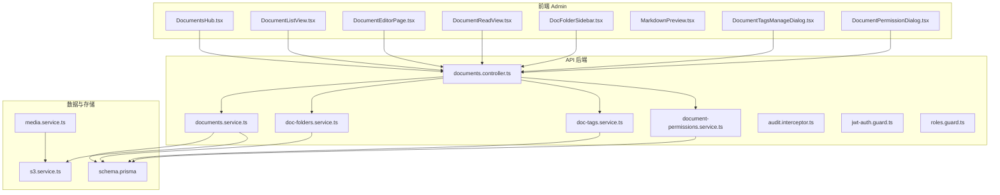
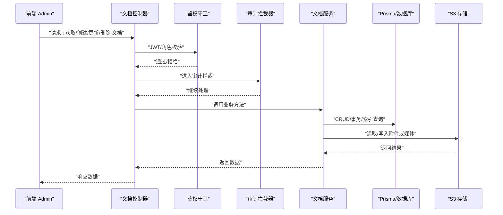
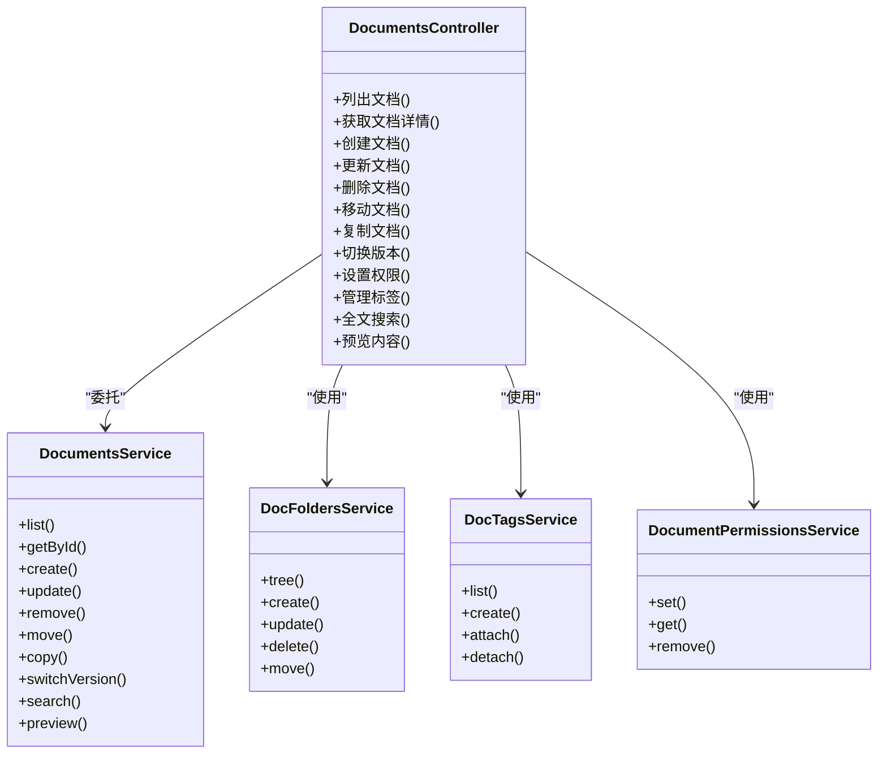
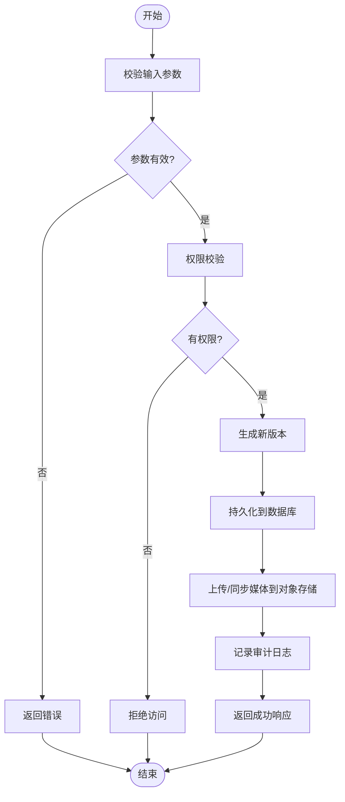
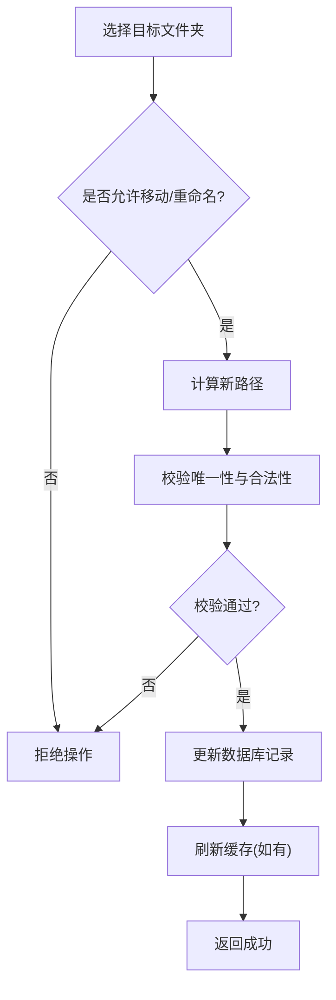
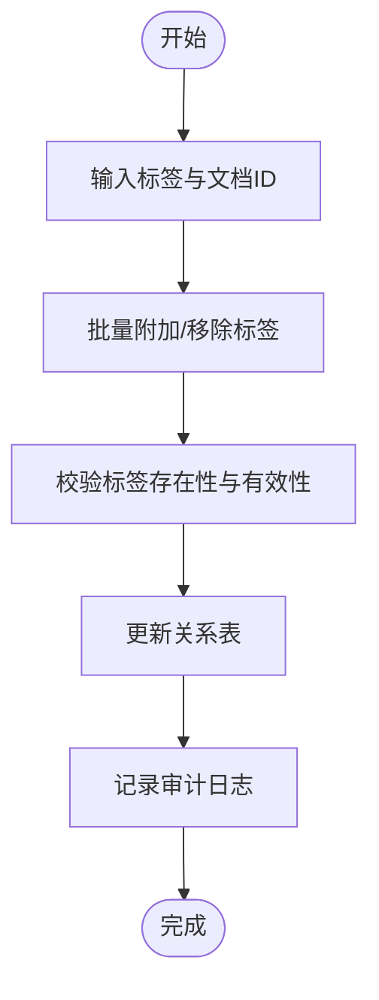
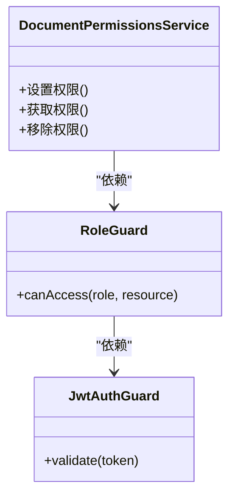
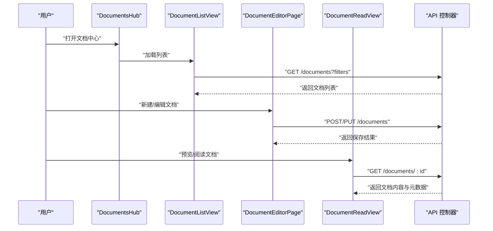
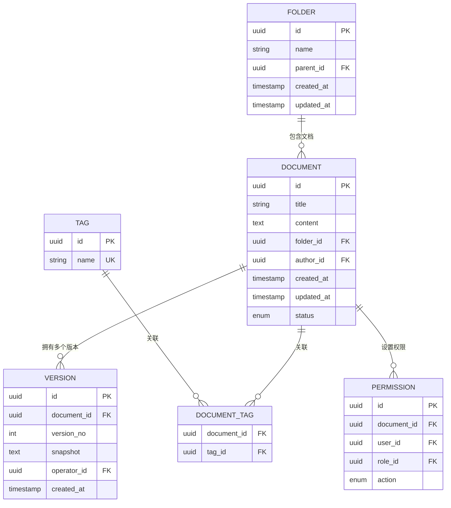
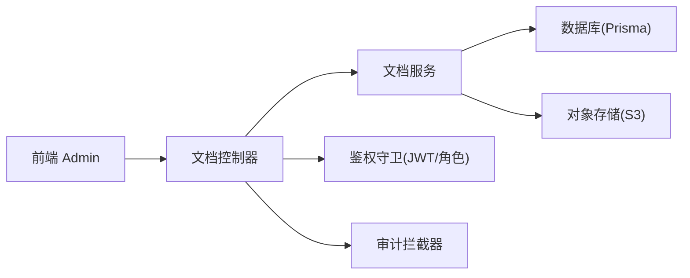

# 文档管理

<cite>
**本文引用的文件**   
- [documents.controller.ts](file://apps/api/src/documents/documents.controller.ts)
- [documents.service.ts](file://apps/api/src/documents/documents.service.ts)
- [doc-folders.service.ts](file://apps/api/src/documents/doc-folders.service.ts)
- [doc-tags.service.ts](file://apps/api/src/documents/doc-tags.service.ts)
- [document-permissions.service.ts](file://apps/api/src/documents/document-permissions.service.ts)
- [document.dto.ts](file://apps/api/src/documents/dto/document.dto.ts)
- [document-permission.dto.ts](file://apps/api/src/documents/dto/document-permission.dto.ts)
- [audit.interceptor.ts](file://apps/api/src/common/interceptors/audit.interceptor.ts)
- [jwt-auth.guard.ts](file://apps/api/src/auth/guards/jwt-auth.guard.ts)
- [roles.guard.ts](file://apps/api/src/auth/guards/roles.guard.ts)
- [require-permissions.decorator.ts](file://apps/api/src/auth/decorators/require-permissions.decorator.ts)
- [current-user.decorator.ts](file://apps/api/src/auth/decorators/current-user.decorator.ts)
- [schema.prisma](file://apps/api/prisma/schema.prisma)
- [documents.tsx](file://apps/admin/src/features/resources/documents.tsx)
- [DocumentsHub.tsx](file://apps/admin/src/components/documents/DocumentsHub.tsx)
- [DocumentListView.tsx](file://apps/admin/src/components/documents/DocumentListView.tsx)
- [DocFolderSidebar.tsx](file://apps/admin/src/components/documents/DocFolderSidebar.tsx)
- [DocumentEditorPage.tsx](file://apps/admin/src/components/documents/DocumentEditorPage.tsx)
- [DocumentReadView.tsx](file://apps/admin/src/components/documents/DocumentReadView.tsx)
- [MarkdownPreview.tsx](file://apps/admin/src/components/documents/MarkdownPreview.tsx)
- [DocumentTagsManageDialog.tsx](file://apps/admin/src/components/documents/DocumentTagsManageDialog.tsx)
- [DocumentPermissionDialog.tsx](file://apps/admin/src/components/DocumentPermissionDialog.tsx)
- [apiClient.ts](file://apps/admin/src/lib/apiClient.ts)
- [s3.service.ts](file://apps/api/src/storage/s3.service.ts)
- [media.service.ts](file://apps/api/src/media/media.service.ts)
- [env.validation.ts](file://apps/api/src/config/env.validation.ts)
</cite>

## 目录
1. [简介](#简介)
2. [项目结构](#项目结构)
3. [核心组件](#核心组件)
4. [架构总览](#架构总览)
5. [详细组件分析](#详细组件分析)
6. [依赖关系分析](#依赖关系分析)
7. [性能考虑](#性能考虑)
8. [故障排查指南](#故障排查指南)
9. [结论](#结论)
10. [附录](#附录)

## 简介
本模块为系统的“文档管理”能力，提供文档的层级化文件夹组织、权限控制、版本与协作编辑、审计日志、标签管理、全文搜索与预览、以及完整的 API 规范。后端基于 NestJS + Prisma，前端采用 Next.js Admin 控制台，存储通过 S3/OSS 兼容对象存储，鉴权使用 JWT，权限模型支持角色与资源级细粒度授权。

## 项目结构
文档管理在后端位于 apps/api/src/documents，包含控制器、服务、DTO 与权限相关服务；在前端位于 apps/admin/src/components/documents 与 features/resources/documents.tsx，提供列表、编辑器、阅读视图、标签与权限管理等 UI。数据库模型由 Prisma schema 定义，存储由 S3 服务抽象。

图表来源
- [documents.controller.ts](file://apps/api/src/documents/documents.controller.ts)
- [documents.service.ts](file://apps/api/src/documents/documents.service.ts)
- [doc-folders.service.ts](file://apps/api/src/documents/doc-folders.service.ts)
- [doc-tags.service.ts](file://apps/api/src/documents/doc-tags.service.ts)
- [document-permissions.service.ts](file://apps/api/src/documents/document-permissions.service.ts)
- [schema.prisma](file://apps/api/prisma/schema.prisma)
- [s3.service.ts](file://apps/api/src/storage/s3.service.ts)
- [media.service.ts](file://apps/api/src/media/media.service.ts)

章节来源
- [documents.controller.ts](file://apps/api/src/documents/documents.controller.ts)
- [documents.service.ts](file://apps/api/src/documents/documents.service.ts)
- [documents.tsx](file://apps/admin/src/features/resources/documents.tsx)
- [DocumentsHub.tsx](file://apps/admin/src/components/documents/DocumentsHub.tsx)

## 核心组件
- 文档控制器：暴露 RESTful 接口，统一路由文档 CRUD、权限、标签、移动、版本等能力。
- 文档服务：封装业务逻辑，处理文档创建、更新、删除、查询、分页、排序、过滤、全文检索、版本生成、协作编辑冲突策略、审计记录写入。
- 文件夹服务：维护树形文件夹结构，支持层级导航、路径校验、重命名与移动。
- 标签服务：维护标签集合与文档-标签多对多关系，支持批量关联与去重。
- 权限服务：实现资源级权限（读/写/分享/管理），支持用户与角色维度，继承与覆盖策略。
- 审计拦截器：自动捕获关键操作并落库，记录操作人、时间、IP、变更摘要。
- 鉴权守卫：JWT 校验与角色校验，结合装饰器进行细粒度权限检查。
- 存储与媒体：S3/OSS 对象存储抽象，媒体上传、水印、访问控制与 URL 生成。

章节来源
- [documents.controller.ts](file://apps/api/src/documents/documents.controller.ts)
- [documents.service.ts](file://apps/api/src/documents/documents.service.ts)
- [doc-folders.service.ts](file://apps/api/src/documents/doc-folders.service.ts)
- [doc-tags.service.ts](file://apps/api/src/documents/doc-tags.service.ts)
- [document-permissions.service.ts](file://apps/api/src/documents/document-permissions.service.ts)
- [audit.interceptor.ts](file://apps/api/src/common/interceptors/audit.interceptor.ts)
- [jwt-auth.guard.ts](file://apps/api/src/auth/guards/jwt-auth.guard.ts)
- [roles.guard.ts](file://apps/api/src/auth/guards/roles.guard.ts)
- [s3.service.ts](file://apps/api/src/storage/s3.service.ts)
- [media.service.ts](file://apps/api/src/media/media.service.ts)

## 架构总览
文档管理遵循分层架构：前端页面调用 API 控制器，控制器委托服务完成业务，服务通过 Prisma 访问数据库，并通过 S3 服务读写对象存储。鉴权与审计在控制器层通过守卫与拦截器横切注入。

图表来源
- [documents.controller.ts](file://apps/api/src/documents/documents.controller.ts)
- [documents.service.ts](file://apps/api/src/documents/documents.service.ts)
- [jwt-auth.guard.ts](file://apps/api/src/auth/guards/jwt-auth.guard.ts)
- [roles.guard.ts](file://apps/api/src/auth/guards/roles.guard.ts)
- [audit.interceptor.ts](file://apps/api/src/common/interceptors/audit.interceptor.ts)
- [s3.service.ts](file://apps/api/src/storage/s3.service.ts)

## 详细组件分析

### 文档控制器与 API 规范
- 路由设计：遵循 REST 风格，支持文档列表、详情、创建、更新、删除、移动、复制、版本切换、权限设置、标签管理、搜索与预览。
- 输入校验：使用 DTO 约束字段类型、长度、枚举值与必填项。
- 权限控制：通过装饰器与守卫组合，确保仅具备相应角色的用户可执行敏感操作。
- 审计记录：所有写操作均被拦截器记录，包含操作者、时间、IP、目标资源与变更摘要。

图表来源
- [documents.controller.ts](file://apps/api/src/documents/documents.controller.ts)
- [documents.service.ts](file://apps/api/src/documents/documents.service.ts)
- [doc-folders.service.ts](file://apps/api/src/documents/doc-folders.service.ts)
- [doc-tags.service.ts](file://apps/api/src/documents/doc-tags.service.ts)
- [document-permissions.service.ts](file://apps/api/src/documents/document-permissions.service.ts)

章节来源
- [documents.controller.ts](file://apps/api/src/documents/documents.controller.ts)
- [document.dto.ts](file://apps/api/src/documents/dto/document.dto.ts)
- [require-permissions.decorator.ts](file://apps/api/src/auth/decorators/require-permissions.decorator.ts)
- [current-user.decorator.ts](file://apps/api/src/auth/decorators/current-user.decorator.ts)

### 文档服务与业务逻辑
- 版本控制：每次更新生成新版本，保留历史快照，支持回滚与差异对比。
- 协作编辑：基于乐观锁或版本号冲突检测，合并策略支持最后写入优先或三方合并。
- 全文搜索：对标题、正文与标签建立索引，支持关键词匹配、高亮与分页。
- 预览：渲染 Markdown 为 HTML，按需加载媒体资源，支持水印与安全过滤。

图表来源
- [documents.service.ts](file://apps/api/src/documents/documents.service.ts)
- [audit.interceptor.ts](file://apps/api/src/common/interceptors/audit.interceptor.ts)
- [s3.service.ts](file://apps/api/src/storage/s3.service.ts)

章节来源
- [documents.service.ts](file://apps/api/src/documents/documents.service.ts)
- [document.dto.ts](file://apps/api/src/documents/dto/document.dto.ts)

### 文件夹服务与层级结构
- 树形结构：支持多级文件夹，提供树形遍历、路径校验与重复名检测。
- 移动与重命名：原子性更新父节点与路径，保证一致性。
- 权限继承：子文件夹默认继承父级权限，支持覆盖。

图表来源
- [doc-folders.service.ts](file://apps/api/src/documents/doc-folders.service.ts)

章节来源
- [doc-folders.service.ts](file://apps/api/src/documents/doc-folders.service.ts)

### 标签服务与标签管理
- 标签集合：全局唯一标签，支持创建、删除与批量管理。
- 文档-标签关系：多对多映射，支持批量附加与移除。
- 搜索增强：标签作为搜索维度，提升检索精度。

图表来源
- [doc-tags.service.ts](file://apps/api/src/documents/doc-tags.service.ts)

章节来源
- [doc-tags.service.ts](file://apps/api/src/documents/doc-tags.service.ts)

### 权限服务与协作编辑
- 权限模型：支持读、写、分享、管理四种权限，按用户与角色维度配置。
- 继承与覆盖：子资源继承父级权限，支持显式覆盖。
- 协作编辑：基于版本号的并发控制，冲突时提示合并策略。

图表来源
- [document-permissions.service.ts](file://apps/api/src/documents/document-permissions.service.ts)
- [roles.guard.ts](file://apps/api/src/auth/guards/roles.guard.ts)
- [jwt-auth.guard.ts](file://apps/api/src/auth/guards/jwt-auth.guard.ts)

章节来源
- [document-permissions.service.ts](file://apps/api/src/documents/document-permissions.service.ts)
- [document-permission.dto.ts](file://apps/api/src/documents/dto/document-permission.dto.ts)

### 前端组件与交互流程
- 文档中心：DocumentsHub 聚合列表、搜索、标签与权限入口。
- 列表视图：DocumentListView 支持分页、排序、筛选与批量操作。
- 编辑器：DocumentEditorPage 集成 Markdown 编辑器与实时预览。
- 阅读视图：DocumentReadView 渲染最终内容，支持媒体与外链安全策略。
- 标签管理：DocumentTagsManageDialog 提供标签选择与批量管理。
- 权限管理：DocumentPermissionDialog 可视化设置与查看权限。

图表来源
- [DocumentsHub.tsx](file://apps/admin/src/components/documents/DocumentsHub.tsx)
- [DocumentListView.tsx](file://apps/admin/src/components/documents/DocumentListView.tsx)
- [DocumentEditorPage.tsx](file://apps/admin/src/components/documents/DocumentEditorPage.tsx)
- [DocumentReadView.tsx](file://apps/admin/src/components/documents/DocumentReadView.tsx)
- [documents.controller.ts](file://apps/api/src/documents/documents.controller.ts)

章节来源
- [DocumentsHub.tsx](file://apps/admin/src/components/documents/DocumentsHub.tsx)
- [DocumentListView.tsx](file://apps/admin/src/components/documents/DocumentListView.tsx)
- [DocumentEditorPage.tsx](file://apps/admin/src/components/documents/DocumentEditorPage.tsx)
- [DocumentReadView.tsx](file://apps/admin/src/components/documents/DocumentReadView.tsx)
- [MarkdownPreview.tsx](file://apps/admin/src/components/documents/MarkdownPreview.tsx)
- [DocumentTagsManageDialog.tsx](file://apps/admin/src/components/documents/DocumentTagsManageDialog.tsx)
- [DocumentPermissionDialog.tsx](file://apps/admin/src/components/DocumentPermissionDialog.tsx)
- [documents.tsx](file://apps/admin/src/features/resources/documents.tsx)
- [apiClient.ts](file://apps/admin/src/lib/apiClient.ts)

### 数据库模型与存储策略
- 模型设计：文档、文件夹、标签、权限、版本等实体通过 Prisma 定义，明确关系与约束。
- 存储策略：文本内容存数据库，媒体文件存 S3/OSS，URL 动态生成并受访问控制。
- 备份恢复：数据库定期快照与增量备份，对象存储启用版本化与跨区域复制。
- 数据迁移：通过 Prisma migrations 管理结构演进，脚本化回滚与验证。

图表来源
- [schema.prisma](file://apps/api/prisma/schema.prisma)

章节来源
- [schema.prisma](file://apps/api/prisma/schema.prisma)
- [s3.service.ts](file://apps/api/src/storage/s3.service.ts)
- [media.service.ts](file://apps/api/src/media/media.service.ts)

## 依赖关系分析
- 控制器依赖服务：控制器仅负责路由与入参校验，业务逻辑下沉至服务层。
- 服务依赖数据与存储：服务通过 Prisma 访问数据库，通过 S3 服务访问对象存储。
- 鉴权与审计横切：JWT 与角色守卫在控制器前拦截，审计拦截器记录操作轨迹。
- 前端依赖 API 客户端：Admin 前端通过 apiClient 统一发起请求，集中处理错误与重试。

图表来源
- [documents.controller.ts](file://apps/api/src/documents/documents.controller.ts)
- [documents.service.ts](file://apps/api/src/documents/documents.service.ts)
- [jwt-auth.guard.ts](file://apps/api/src/auth/guards/jwt-auth.guard.ts)
- [roles.guard.ts](file://apps/api/src/auth/guards/roles.guard.ts)
- [audit.interceptor.ts](file://apps/api/src/common/interceptors/audit.interceptor.ts)
- [apiClient.ts](file://apps/admin/src/lib/apiClient.ts)

章节来源
- [documents.controller.ts](file://apps/api/src/documents/documents.controller.ts)
- [documents.service.ts](file://apps/api/src/documents/documents.service.ts)
- [apiClient.ts](file://apps/admin/src/lib/apiClient.ts)

## 性能考虑
- 查询优化：对常用过滤字段建立索引，避免全表扫描；分页与游标结合提升大数据集体验。
- 缓存策略：热点文档与标签列表使用 Redis 缓存，设置合理过期与失效策略。
- 异步任务：大文件上传与媒体处理使用队列异步执行，降低请求延迟。
- 并发控制：协作编辑采用版本号与乐观锁，减少锁竞争与死锁风险。
- 存储优化：媒体文件分片上传与 CDN 加速，静态资源预取与懒加载。

[本节为通用指导，不直接分析具体文件]

## 故障排查指南
- 鉴权失败：检查 JWT 令牌有效期与签名，确认角色与权限配置是否正确。
- 权限拒绝：核对资源级权限设置与继承规则，确认当前用户角色是否具备所需权限。
- 审计缺失：确认审计拦截器已注册且未跳过，检查日志输出与入库流程。
- 存储异常：检查 S3/OSS 配置与网络连通性，确认 Bucket 权限与 CORS 设置。
- 搜索无结果：确认全文索引构建状态，检查关键词匹配与分词策略。

章节来源
- [jwt-auth.guard.ts](file://apps/api/src/auth/guards/jwt-auth.guard.ts)
- [roles.guard.ts](file://apps/api/src/auth/guards/roles.guard.ts)
- [audit.interceptor.ts](file://apps/api/src/common/interceptors/audit.interceptor.ts)
- [s3.service.ts](file://apps/api/src/storage/s3.service.ts)
- [env.validation.ts](file://apps/api/src/config/env.validation.ts)

## 结论
文档管理模块以清晰的分层架构与完善的权限、审计、版本与协作机制，提供了企业级的文档管理能力。通过 Prisma 与 S3 的组合，实现了结构化数据与对象存储的高效协同。前端组件覆盖从列表到编辑、预览与权限管理的完整链路，满足复杂场景下的协作需求。建议在生产环境加强缓存与异步任务治理，完善监控与告警，持续提升稳定性与性能。

[本节为总结性内容，不直接分析具体文件]

## 附录

### API 接口规范（节选）
- 文档列表：GET /api/documents，支持分页、排序、过滤与标签筛选。
- 文档详情：GET /api/documents/:id，返回文档元数据与最新内容。
- 创建文档：POST /api/documents，提交标题、内容与初始标签。
- 更新文档：PUT /api/documents/:id，提交增量更新与版本说明。
- 删除文档：DELETE /api/documents/:id，软删除或硬删除策略可选。
- 移动文档：PATCH /api/documents/:id/move，指定目标文件夹。
- 复制文档：POST /api/documents/:id/copy，生成副本并保留权限。
- 切换版本：POST /api/documents/:id/versions/:versionNo/activate，激活指定版本。
- 设置权限：POST /api/documents/:id/permissions，添加/修改/移除权限。
- 管理标签：POST /api/documents/:id/tags，批量附加或移除标签。
- 全文搜索：GET /api/documents/search?q=...&tags=...，返回匹配结果与高亮片段。
- 预览内容：GET /api/documents/:id/preview，返回渲染后的 HTML 与媒体清单。

章节来源
- [documents.controller.ts](file://apps/api/src/documents/documents.controller.ts)
- [document.dto.ts](file://apps/api/src/documents/dto/document.dto.ts)
- [document-permission.dto.ts](file://apps/api/src/documents/dto/document-permission.dto.ts)