# 新闻管理

<cite>
**本文引用的文件**   
- [news.controller.ts](file://apps/api/src/news/news.controller.ts)
- [news.service.ts](file://apps/api/src/news/news.service.ts)
- [news.dto.ts](file://apps/api/src/news/dto/news.dto.ts)
- [schema.prisma](file://apps/api/prisma/schema.prisma)
- [content-status.enum.ts](file://apps/api/src/common/enums/content-status.enum.ts)
- [publishing.service.ts](file://apps/api/src/publishing/publishing.service.ts)
- [media.service.ts](file://apps/api/src/media/media.service.ts)
- [markdown.ts](file://apps/api/src/common/utils/markdown.ts)
- [sanitize.ts](file://apps/api/src/common/utils/sanitize.ts)
- [slug.ts](file://apps/api/src/common/utils/slug.ts)
- [content-list.ts](file://apps/api/src/common/utils/content-list.ts)
- [content-metadata.ts](file://apps/api/src/common/utils/content-metadata.ts)
- [read-time.ts](file://apps/api/src/common/utils/read-time.ts)
- [news.tsx](file://apps/admin/src/features/resources/news.tsx)
- [MediaPicker.tsx](file://apps/admin/src/components/crud/MediaPicker.tsx)
- [MarkdownEditor.tsx](file://apps/admin/src/components/crud/MarkdownEditor.tsx)
- [apiClient.ts](file://apps/admin/src/lib/apiClient.ts)
- [news.ts](file://apps/web/src/lib/news.ts)
- [ContentListShell.tsx](file://apps/web/src/components/content/ContentListShell.tsx)
- [MarkdownBody.tsx](file://apps/web/src/components/content/MarkdownBody.tsx)
- [search/route.ts](file://apps/web/src/app/api/search/route.ts)
</cite>

## 目录
1. [简介](#简介)
2. [项目结构](#项目结构)
3. [核心组件](#核心组件)
4. [架构总览](#架构总览)
5. [详细组件分析](#详细组件分析)
6. [依赖关系分析](#依赖关系分析)
7. [性能与缓存策略](#性能与缓存策略)
8. [故障排查指南](#故障排查指南)
9. [结论](#结论)
10. [附录：API 接口规范](#附录api-接口规范)

## 简介
本模块面向“新闻”内容的全生命周期管理，覆盖后台编辑、内容审核、定时发布、富文本处理、媒体资源管理、分类与标签、搜索索引以及多语言支持。后端采用 NestJS + Prisma，前端包含 Admin（后台）与 Web（前台），并通过统一的 API 客户端进行交互。

## 项目结构
新闻模块在前后端均有对应实现：
- 后端 API：控制器、服务、DTO、枚举、通用工具与数据库模型
- 后台管理：资源定义、编辑器、媒体选择器、表单校验与提交
- 前台展示：列表页、详情页渲染、搜索与国际化

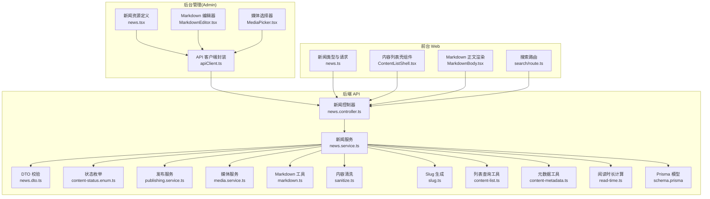

**图表来源** 
- [news.controller.ts](file://apps/api/src/news/news.controller.ts)
- [news.service.ts](file://apps/api/src/news/news.service.ts)
- [news.dto.ts](file://apps/api/src/news/dto/news.dto.ts)
- [schema.prisma](file://apps/api/prisma/schema.prisma)
- [content-status.enum.ts](file://apps/api/src/common/enums/content-status.enum.ts)
- [publishing.service.ts](file://apps/api/src/publishing/publishing.service.ts)
- [media.service.ts](file://apps/api/src/media/media.service.ts)
- [markdown.ts](file://apps/api/src/common/utils/markdown.ts)
- [sanitize.ts](file://apps/api/src/common/utils/sanitize.ts)
- [slug.ts](file://apps/api/src/common/utils/slug.ts)
- [content-list.ts](file://apps/api/src/common/utils/content-list.ts)
- [content-metadata.ts](file://apps/api/src/common/utils/content-metadata.ts)
- [read-time.ts](file://apps/api/src/common/utils/read-time.ts)
- [news.tsx](file://apps/admin/src/features/resources/news.tsx)
- [MediaPicker.tsx](file://apps/admin/src/components/crud/MediaPicker.tsx)
- [MarkdownEditor.tsx](file://apps/admin/src/components/crud/MarkdownEditor.tsx)
- [apiClient.ts](file://apps/admin/src/lib/apiClient.ts)
- [news.ts](file://apps/web/src/lib/news.ts)
- [ContentListShell.tsx](file://apps/web/src/components/content/ContentListShell.tsx)
- [MarkdownBody.tsx](file://apps/web/src/components/content/MarkdownBody.tsx)
- [search/route.ts](file://apps/web/src/app/api/search/route.ts)

**章节来源**
- [news.controller.ts](file://apps/api/src/news/news.controller.ts)
- [news.service.ts](file://apps/api/src/news/news.service.ts)
- [news.dto.ts](file://apps/api/src/news/dto/news.dto.ts)
- [schema.prisma](file://apps/api/prisma/schema.prisma)
- [content-status.enum.ts](file://apps/api/src/common/enums/content-status.enum.ts)
- [publishing.service.ts](file://apps/api/src/publishing/publishing.service.ts)
- [media.service.ts](file://apps/api/src/media/media.service.ts)
- [markdown.ts](file://apps/api/src/common/utils/markdown.ts)
- [sanitize.ts](file://apps/api/src/common/utils/sanitize.ts)
- [slug.ts](file://apps/api/src/common/utils/slug.ts)
- [content-list.ts](file://apps/api/src/common/utils/content-list.ts)
- [content-metadata.ts](file://apps/api/src/common/utils/content-metadata.ts)
- [read-time.ts](file://apps/api/src/common/utils/read-time.ts)
- [news.tsx](file://apps/admin/src/features/resources/news.tsx)
- [MediaPicker.tsx](file://apps/admin/src/components/crud/MediaPicker.tsx)
- [MarkdownEditor.tsx](file://apps/admin/src/components/crud/MarkdownEditor.tsx)
- [apiClient.ts](file://apps/admin/src/lib/apiClient.ts)
- [news.ts](file://apps/web/src/lib/news.ts)
- [ContentListShell.tsx](file://apps/web/src/components/content/ContentListShell.tsx)
- [MarkdownBody.tsx](file://apps/web/src/components/content/MarkdownBody.tsx)
- [search/route.ts](file://apps/web/src/app/api/search/route.ts)

## 核心组件
- 控制器层：对外暴露新闻的增删改查、发布、审核、分页与搜索等 REST 接口
- 服务层：编排业务逻辑，包括内容校验、富文本处理、媒体关联、状态流转、定时发布、元数据处理
- DTO 层：统一输入校验与错误提示
- 工具层：Markdown 转换、内容清洗、URL 友好化、列表排序过滤、阅读时长估算
- 数据层：基于 Prisma 的模型与迁移，支撑分类、标签、多语言字段与媒体引用
- 发布调度：通过发布服务驱动定时任务，将草稿转为已发布并更新可见性
- 媒体服务：上传、转码、水印、CDN 地址解析与访问控制
- 前端 Admin：资源定义、富文本编辑器、媒体选择器、表单校验与提交
- 前端 Web：列表与详情渲染、搜索入口、国际化与 SEO

**章节来源**
- [news.controller.ts](file://apps/api/src/news/news.controller.ts)
- [news.service.ts](file://apps/api/src/news/news.service.ts)
- [news.dto.ts](file://apps/api/src/news/dto/news.dto.ts)
- [schema.prisma](file://apps/api/prisma/schema.prisma)
- [content-status.enum.ts](file://apps/api/src/common/enums/content-status.enum.ts)
- [publishing.service.ts](file://apps/api/src/publishing/publishing.service.ts)
- [media.service.ts](file://apps/api/src/media/media.service.ts)
- [markdown.ts](file://apps/api/src/common/utils/markdown.ts)
- [sanitize.ts](file://apps/api/src/common/utils/sanitize.ts)
- [slug.ts](file://apps/api/src/common/utils/slug.ts)
- [content-list.ts](file://apps/api/src/common/utils/content-list.ts)
- [content-metadata.ts](file://apps/api/src/common/utils/content-metadata.ts)
- [read-time.ts](file://apps/api/src/common/utils/read-time.ts)
- [news.tsx](file://apps/admin/src/features/resources/news.tsx)
- [MediaPicker.tsx](file://apps/admin/src/components/crud/MediaPicker.tsx)
- [MarkdownEditor.tsx](file://apps/admin/src/components/crud/MarkdownEditor.tsx)
- [apiClient.ts](file://apps/admin/src/lib/apiClient.ts)
- [news.ts](file://apps/web/src/lib/news.ts)
- [ContentListShell.tsx](file://apps/web/src/components/content/ContentListShell.tsx)
- [MarkdownBody.tsx](file://apps/web/src/components/content/MarkdownBody.tsx)
- [search/route.ts](file://apps/web/src/app/api/search/route.ts)

## 架构总览
新闻模块遵循典型的分层架构：Controller -> Service -> Utils/Services -> Prisma。Admin 与 Web 通过 apiClient 调用 Controller 暴露的 REST API。

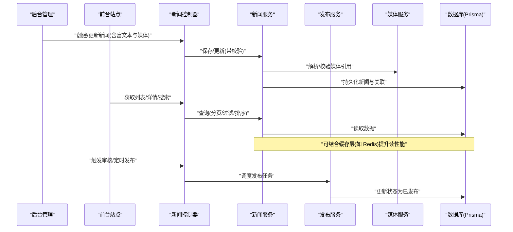

**图表来源** 
- [news.controller.ts](file://apps/api/src/news/news.controller.ts)
- [news.service.ts](file://apps/api/src/news/news.service.ts)
- [publishing.service.ts](file://apps/api/src/publishing/publishing.service.ts)
- [media.service.ts](file://apps/api/src/media/media.service.ts)
- [schema.prisma](file://apps/api/prisma/schema.prisma)

## 详细组件分析

### 数据模型与领域对象
- 新闻实体包含标题、摘要、正文（Markdown）、封面图、分类、标签、作者、发布时间、状态、SEO 信息、多语言字段等
- 分类与标签作为独立维度，支持多对多关联
- 媒体资源以 ID 引用方式关联，避免冗余存储
- 状态机：草稿 -> 待审 -> 已发布 -> 已下架（示例）

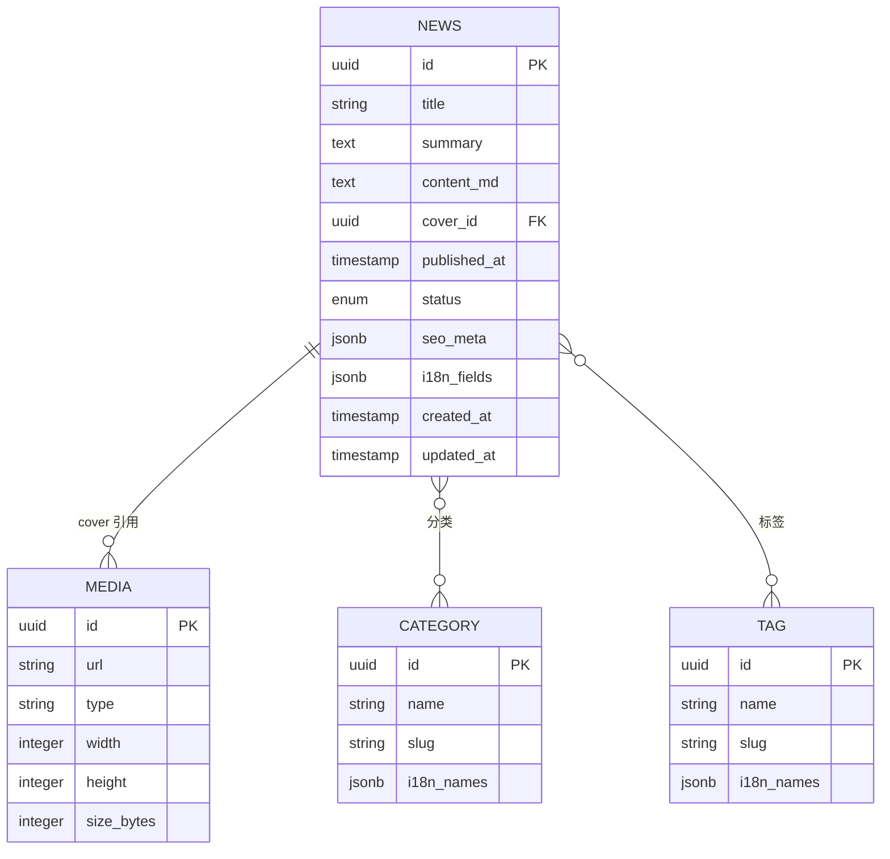

**图表来源** 
- [schema.prisma](file://apps/api/prisma/schema.prisma)

**章节来源**
- [schema.prisma](file://apps/api/prisma/schema.prisma)

### 富文本处理与内容安全
- Markdown 编辑器用于创作与预览
- 服务端对 Markdown 进行转换与安全清洗，防止 XSS 与恶意脚本
- 自动提取首图、生成阅读时长、SEO 元数据补全

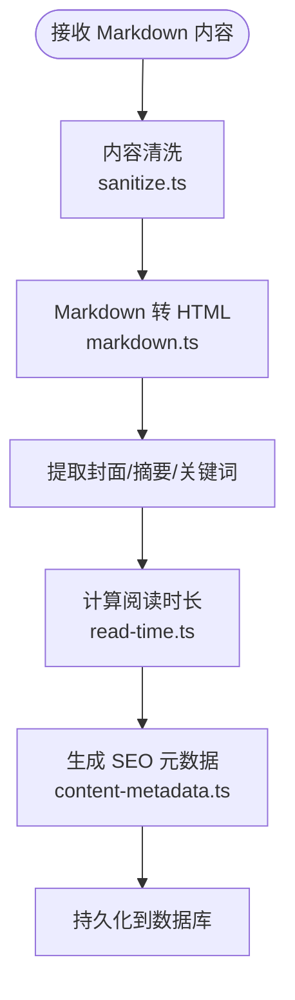

**图表来源** 
- [markdown.ts](file://apps/api/src/common/utils/markdown.ts)
- [sanitize.ts](file://apps/api/src/common/utils/sanitize.ts)
- [read-time.ts](file://apps/api/src/common/utils/read-time.ts)
- [content-metadata.ts](file://apps/api/src/common/utils/content-metadata.ts)

**章节来源**
- [markdown.ts](file://apps/api/src/common/utils/markdown.ts)
- [sanitize.ts](file://apps/api/src/common/utils/sanitize.ts)
- [read-time.ts](file://apps/api/src/common/utils/read-time.ts)
- [content-metadata.ts](file://apps/api/src/common/utils/content-metadata.ts)

### 媒体资源管理
- 上传与转码：支持图片压缩、格式转换、尺寸裁剪
- 水印与 CDN：可选添加品牌水印，输出 CDN 加速 URL
- 访问控制：鉴权与防盗链配置
- 与新闻关联：封面图、内嵌图片通过 ID 引用

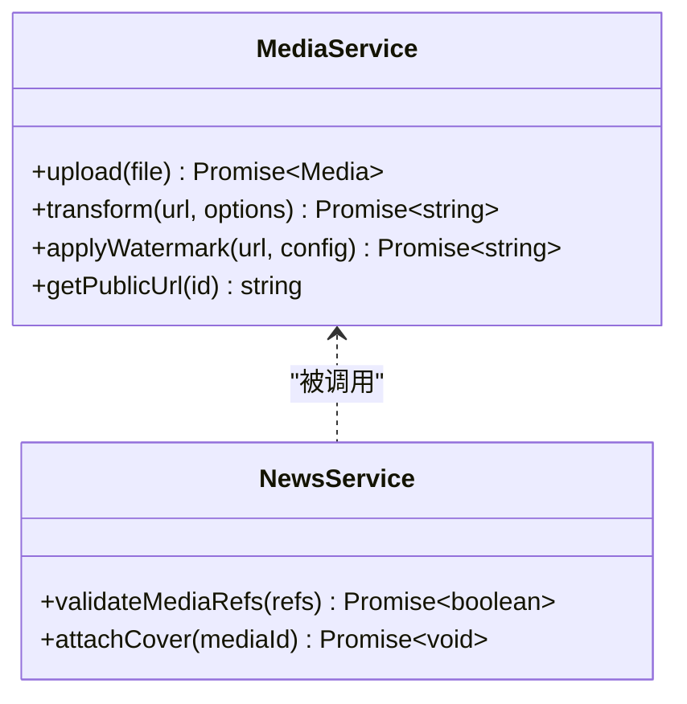

**图表来源** 
- [media.service.ts](file://apps/api/src/media/media.service.ts)
- [news.service.ts](file://apps/api/src/news/news.service.ts)

**章节来源**
- [media.service.ts](file://apps/api/src/media/media.service.ts)
- [news.service.ts](file://apps/api/src/news/news.service.ts)

### 发布流程与审核机制
- 草稿态：保存但不公开
- 待审态：提交审核后进入审核队列
- 已发布：满足发布时间与审核通过后对外可见
- 定时发布：通过发布服务按时间触发状态变更

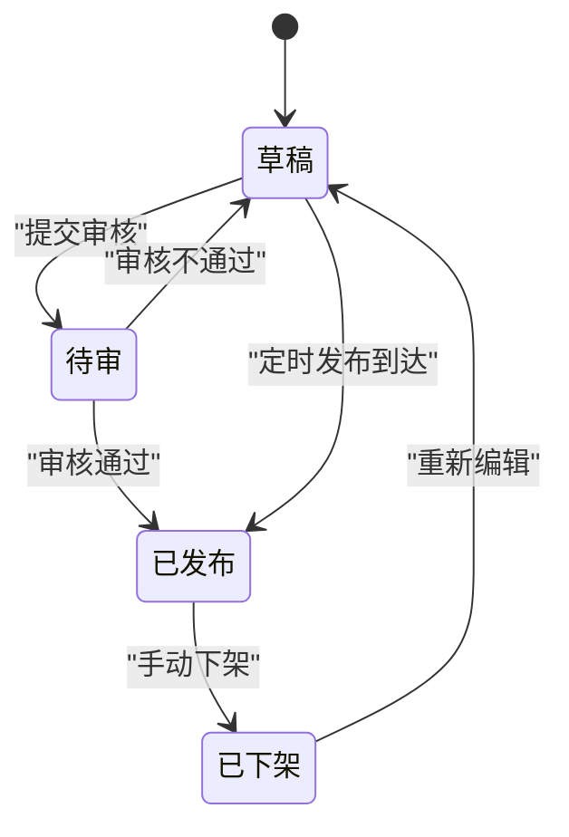

**图表来源** 
- [content-status.enum.ts](file://apps/api/src/common/enums/content-status.enum.ts)
- [publishing.service.ts](file://apps/api/src/publishing/publishing.service.ts)
- [news.service.ts](file://apps/api/src/news/news.service.ts)

**章节来源**
- [content-status.enum.ts](file://apps/api/src/common/enums/content-status.enum.ts)
- [publishing.service.ts](file://apps/api/src/publishing/publishing.service.ts)
- [news.service.ts](file://apps/api/src/news/news.service.ts)

### 分类、标签与搜索索引
- 分类与标签支持多语言名称与 slug
- 列表查询支持按分类、标签、时间范围、作者等过滤
- 搜索索引：全文检索建议与结果聚合，支持高亮与分页

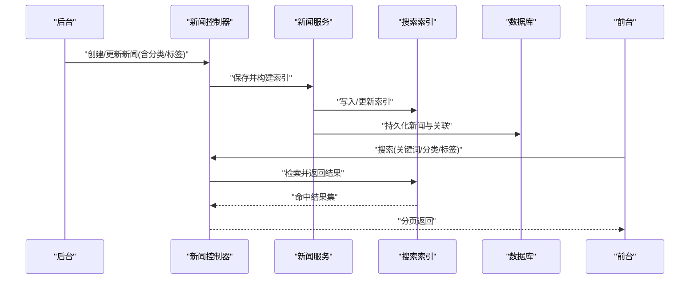

**图表来源** 
- [news.controller.ts](file://apps/api/src/news/news.controller.ts)
- [news.service.ts](file://apps/api/src/news/news.service.ts)
- [search/route.ts](file://apps/web/src/app/api/search/route.ts)

**章节来源**
- [news.controller.ts](file://apps/api/src/news/news.controller.ts)
- [news.service.ts](file://apps/api/src/news/news.service.ts)
- [search/route.ts](file://apps/web/src/app/api/search/route.ts)

### 多语言内容与国际化
- 新闻标题、摘要、正文、分类/标签名称支持多语言字段
- 前端根据 locale 切换显示内容
- 后台编辑器支持多语言输入与校验

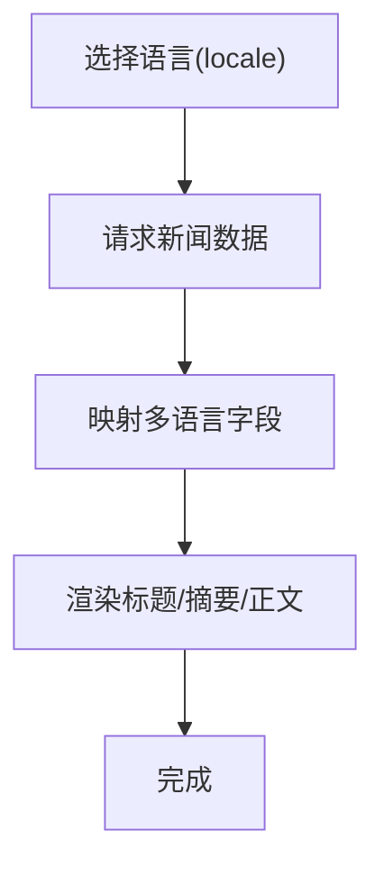

**图表来源** 
- [news.ts](file://apps/web/src/lib/news.ts)
- [news.tsx](file://apps/admin/src/features/resources/news.tsx)

**章节来源**
- [news.ts](file://apps/web/src/lib/news.ts)
- [news.tsx](file://apps/admin/src/features/resources/news.tsx)

### 后台编辑与媒体选择
- 资源定义：字段、校验规则、列表视图、表单布局
- Markdown 编辑器：实时预览、语法高亮、快捷键
- 媒体选择器：从媒体库选择图片/视频，插入到正文或设置封面

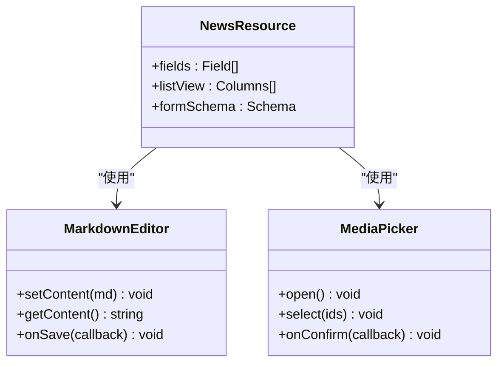

**图表来源** 
- [news.tsx](file://apps/admin/src/features/resources/news.tsx)
- [MarkdownEditor.tsx](file://apps/admin/src/components/crud/MarkdownEditor.tsx)
- [MediaPicker.tsx](file://apps/admin/src/components/crud/MediaPicker.tsx)

**章节来源**
- [news.tsx](file://apps/admin/src/features/resources/news.tsx)
- [MarkdownEditor.tsx](file://apps/admin/src/components/crud/MarkdownEditor.tsx)
- [MediaPicker.tsx](file://apps/admin/src/components/crud/MediaPicker.tsx)

### 前台展示与列表/详情
- 列表页：分页、筛选、排序、搜索建议
- 详情页：Markdown 渲染、媒体懒加载、SEO 元信息注入

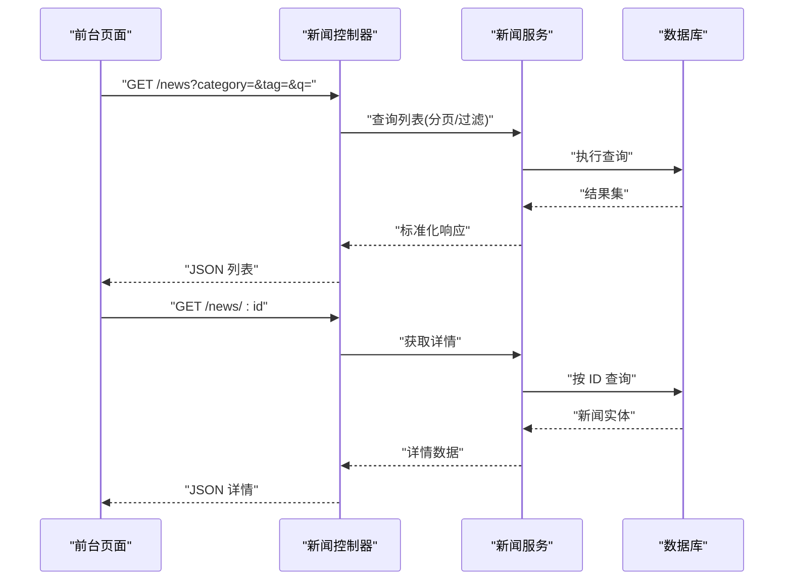

**图表来源** 
- [news.controller.ts](file://apps/api/src/news/news.controller.ts)
- [news.service.ts](file://apps/api/src/news/news.service.ts)
- [ContentListShell.tsx](file://apps/web/src/components/content/ContentListShell.tsx)
- [MarkdownBody.tsx](file://apps/web/src/components/content/MarkdownBody.tsx)

**章节来源**
- [news.controller.ts](file://apps/api/src/news/news.controller.ts)
- [news.service.ts](file://apps/api/src/news/news.service.ts)
- [ContentListShell.tsx](file://apps/web/src/components/content/ContentListShell.tsx)
- [MarkdownBody.tsx](file://apps/web/src/components/content/MarkdownBody.tsx)

## 依赖关系分析
- 控制器依赖服务层，服务层依赖工具与外部服务（媒体、发布调度）
- 列表与搜索依赖通用查询工具与索引
- 前端 Admin/Web 通过 apiClient 与控制器通信

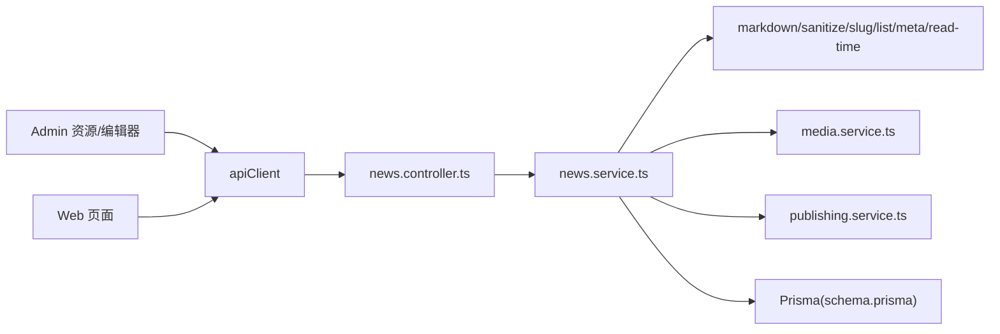

**图表来源** 
- [apiClient.ts](file://apps/admin/src/lib/apiClient.ts)
- [news.controller.ts](file://apps/api/src/news/news.controller.ts)
- [news.service.ts](file://apps/api/src/news/news.service.ts)
- [markdown.ts](file://apps/api/src/common/utils/markdown.ts)
- [sanitize.ts](file://apps/api/src/common/utils/sanitize.ts)
- [slug.ts](file://apps/api/src/common/utils/slug.ts)
- [content-list.ts](file://apps/api/src/common/utils/content-list.ts)
- [content-metadata.ts](file://apps/api/src/common/utils/content-metadata.ts)
- [read-time.ts](file://apps/api/src/common/utils/read-time.ts)
- [media.service.ts](file://apps/api/src/media/media.service.ts)
- [publishing.service.ts](file://apps/api/src/publishing/publishing.service.ts)
- [schema.prisma](file://apps/api/prisma/schema.prisma)

**章节来源**
- [apiClient.ts](file://apps/admin/src/lib/apiClient.ts)
- [news.controller.ts](file://apps/api/src/news/news.controller.ts)
- [news.service.ts](file://apps/api/src/news/news.service.ts)
- [markdown.ts](file://apps/api/src/common/utils/markdown.ts)
- [sanitize.ts](file://apps/api/src/common/utils/sanitize.ts)
- [slug.ts](file://apps/api/src/common/utils/slug.ts)
- [content-list.ts](file://apps/api/src/common/utils/content-list.ts)
- [content-metadata.ts](file://apps/api/src/common/utils/content-metadata.ts)
- [read-time.ts](file://apps/api/src/common/utils/read-time.ts)
- [media.service.ts](file://apps/api/src/media/media.service.ts)
- [publishing.service.ts](file://apps/api/src/publishing/publishing.service.ts)
- [schema.prisma](file://apps/api/prisma/schema.prisma)

## 性能与缓存策略
- 读路径优化
  - 列表与详情查询增加缓存键（按参数哈希），命中直接返回
  - 静态资源（封面图、媒体）走 CDN，启用浏览器缓存与压缩
  - Markdown 渲染在服务端预编译或缓存 HTML 片段
- 写路径优化
  - 批量更新时合并事务，减少锁竞争
  - 媒体上传异步处理，先落盘再回调更新引用
- 搜索优化
  - 增量索引更新，避免全量重建
  - 搜索结果分页与限流，防抖建议接口
- 监控与降级
  - 关键接口超时与熔断保护
  - 缓存失效与回源策略

[本节为通用指导，无需特定文件来源]

## 故障排查指南
- 富文本渲染异常
  - 检查 sanitize 规则是否过严或过松
  - 确认 Markdown 转换链路是否正常
- 媒体无法加载
  - 校验媒体服务返回的公共 URL 与 CORS 配置
  - 检查水印与转码任务是否成功
- 定时发布未生效
  - 核对发布服务的调度任务状态与日志
  - 确认状态机转换权限与条件
- 搜索无结果或延迟
  - 检查索引同步任务与一致性
  - 查看搜索路由的分页与过滤参数

**章节来源**
- [sanitize.ts](file://apps/api/src/common/utils/sanitize.ts)
- [markdown.ts](file://apps/api/src/common/utils/markdown.ts)
- [media.service.ts](file://apps/api/src/media/media.service.ts)
- [publishing.service.ts](file://apps/api/src/publishing/publishing.service.ts)
- [search/route.ts](file://apps/web/src/app/api/search/route.ts)

## 结论
新闻管理模块围绕“内容生产—审核—发布—展示—搜索”的完整闭环设计，具备完善的富文本处理、媒体管理与多语言支持能力。通过分层架构与工具化组件，保证了可扩展性与可维护性。建议在读写路径上进一步引入缓存与索引优化，以提升大规模内容场景下的性能与稳定性。

[本节为总结，无需特定文件来源]

## 附录：API 接口规范
以下列出新闻相关接口的常见方法与用途（具体字段以 DTO 与模型为准）：
- 列表查询
  - GET /news
  - 查询参数：page、pageSize、category、tag、author、dateFrom、dateTo、keyword、locale
  - 返回：分页结果、统计信息、建议词
- 详情查询
  - GET /news/:id
  - 返回：标题、摘要、正文（HTML）、封面、分类、标签、作者、发布时间、SEO、多语言字段
- 创建/更新
  - POST /news
  - PUT /news/:id
  - 请求体：标题、摘要、正文（Markdown）、封面媒体 ID、分类/标签、作者、发布时间、状态、SEO、多语言字段
- 审核与发布
  - PATCH /news/:id/status
  - 支持状态：草稿、待审、已发布、已下架
  - 定时发布：POST /news/:id/schedule-publish（携带发布时间）
- 删除
  - DELETE /news/:id
- 搜索与建议
  - GET /api/search/suggest
  - GET /api/search?q=...&type=news

说明：
- 所有写操作需鉴权；部分操作需要角色或权限
- 媒体资源需通过媒体服务校验与转码
- 富文本内容需经过清洗与转换
- 多语言字段按 locale 返回对应值

**章节来源**
- [news.controller.ts](file://apps/api/src/news/news.controller.ts)
- [news.dto.ts](file://apps/api/src/news/dto/news.dto.ts)
- [schema.prisma](file://apps/api/prisma/schema.prisma)
- [content-status.enum.ts](file://apps/api/src/common/enums/content-status.enum.ts)
- [publishing.service.ts](file://apps/api/src/publishing/publishing.service.ts)
- [media.service.ts](file://apps/api/src/media/media.service.ts)
- [search/route.ts](file://apps/web/src/app/api/search/route.ts)