# 案例管理

<cite>
**本文引用的文件**   
- [cases.controller.ts](file://apps/api/src/cases/cases.controller.ts)
- [cases.service.ts](file://apps/api/src/cases/cases.service.ts)
- [case.dto.ts](file://apps/api/src/cases/dto/case.dto.ts)
- [schema.prisma](file://apps/api/prisma/schema.prisma)
- [content-query.ts](file://apps/api/src/common/utils/content-query.ts)
- [list-sort.ts](file://apps/api/src/common/utils/list-sort.ts)
- [content-metadata.ts](file://apps/api/src/common/utils/content-metadata.ts)
- [media.service.ts](file://apps/api/src/media/media.service.ts)
- [media.controller.ts](file://apps/api/src/media/media.controller.ts)
- [cases.tsx](file://apps/admin/src/features/resources/cases.tsx)
- [ResourceForm.tsx](file://apps/admin/src/components/crud/ResourceForm.tsx)
- [MediaPicker.tsx](file://apps/admin/src/components/crud/MediaPicker.tsx)
- [ContentListShell.tsx](file://apps/web/src/components/content/ContentListShell.tsx)
- [ContentCategoryTabs.tsx](file://apps/web/src/components/content/ContentCategoryTabs.tsx)
- [MarkdownBody.tsx](file://apps/web/src/components/content/MarkdownBody.tsx)
- [route.ts](file://apps/web/src/app/[locale]/cases/route.ts)
- [cases.ts](file://apps/web/src/lib/cases.ts)
</cite>

## 目录
1. [简介](#简介)
2. [项目结构](#项目结构)
3. [核心组件](#核心组件)
4. [架构总览](#架构总览)
5. [详细组件分析](#详细组件分析)
6. [依赖关系分析](#依赖关系分析)
7. [性能考虑](#性能考虑)
8. [故障排查指南](#故障排查指南)
9. [结论](#结论)
10. [附录：API 规范与示例](#附录api-规范与示例)

## 简介
本模块提供“客户案例”的完整管理能力，覆盖案例的创建、编辑、发布与展示。支持多媒体内容（图片、视频等）嵌入、分类与标签管理、全文搜索与高级筛选、排序分页，以及基于角色与权限的访问控制。前端包含后台管理界面与前台展示页面，后端提供 RESTful API，数据持久化通过 Prisma + PostgreSQL，媒体资源通过对象存储（如 MinIO/OSS）。

## 项目结构
- 后端 NestJS 应用位于 apps/api，案例相关代码集中在 cases 模块与通用内容工具 utils。
- 前端 Admin 应用位于 apps/admin，提供案例资源的表单、列表与媒体选择器。
- 前端 Web 应用位于 apps/web，提供案例列表页、详情页与 Markdown 渲染。
- 数据库模型定义在 apps/api/prisma/schema.prisma。

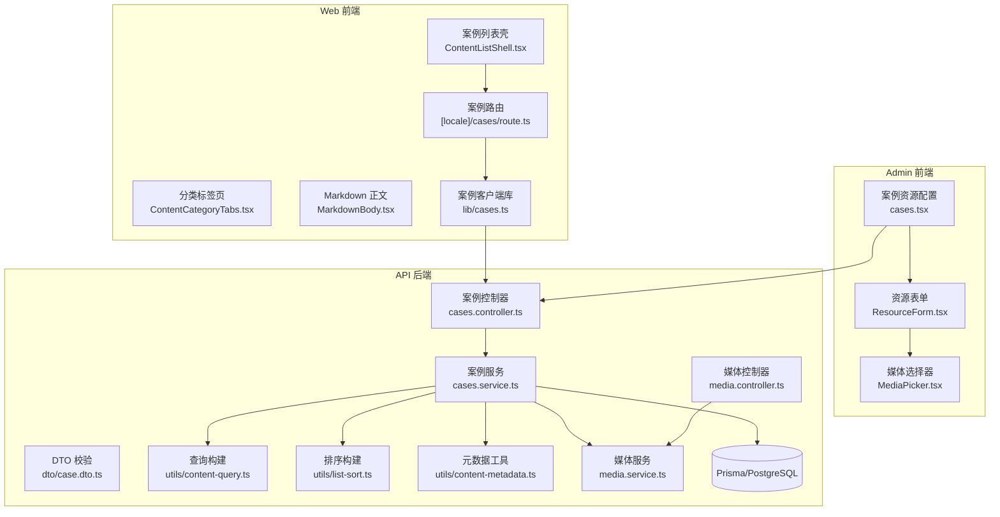

**图表来源** 
- [cases.controller.ts](file://apps/api/src/cases/cases.controller.ts)
- [cases.service.ts](file://apps/api/src/cases/cases.service.ts)
- [case.dto.ts](file://apps/api/src/cases/dto/case.dto.ts)
- [content-query.ts](file://apps/api/src/common/utils/content-query.ts)
- [list-sort.ts](file://apps/api/src/common/utils/list-sort.ts)
- [content-metadata.ts](file://apps/api/src/common/utils/content-metadata.ts)
- [media.service.ts](file://apps/api/src/media/media.service.ts)
- [media.controller.ts](file://apps/api/src/media/media.controller.ts)
- [cases.tsx](file://apps/admin/src/features/resources/cases.tsx)
- [ResourceForm.tsx](file://apps/admin/src/components/crud/ResourceForm.tsx)
- [MediaPicker.tsx](file://apps/admin/src/components/crud/MediaPicker.tsx)
- [ContentListShell.tsx](file://apps/web/src/components/content/ContentListShell.tsx)
- [ContentCategoryTabs.tsx](file://apps/web/src/components/content/ContentCategoryTabs.tsx)
- [MarkdownBody.tsx](file://apps/web/src/components/content/MarkdownBody.tsx)
- [route.ts](file://apps/web/src/app/[locale]/cases/route.ts)
- [cases.ts](file://apps/web/src/lib/cases.ts)

**章节来源**
- [cases.controller.ts](file://apps/api/src/cases/cases.controller.ts)
- [cases.service.ts](file://apps/api/src/cases/cases.service.ts)
- [case.dto.ts](file://apps/api/src/cases/dto/case.dto.ts)
- [schema.prisma](file://apps/api/prisma/schema.prisma)

## 核心组件
- 案例控制器：暴露 REST 接口，处理请求参数校验、鉴权与响应封装。
- 案例服务：实现业务逻辑，包括 CRUD、关联媒体、分类与标签、搜索与排序、分页与元数据。
- DTO：定义输入输出数据结构与校验规则。
- 查询与排序工具：统一构建复杂查询条件与排序选项。
- 媒体服务：负责媒体上传、URL 生成、水印与访问控制。
- 前端 Admin：案例资源表单、媒体选择器、列表与操作按钮。
- 前端 Web：案例列表、分类筛选、详情渲染与 SEO。

**章节来源**
- [cases.controller.ts](file://apps/api/src/cases/cases.controller.ts)
- [cases.service.ts](file://apps/api/src/cases/cases.service.ts)
- [case.dto.ts](file://apps/api/src/cases/dto/case.dto.ts)
- [content-query.ts](file://apps/api/src/common/utils/content-query.ts)
- [list-sort.ts](file://apps/api/src/common/utils/list-sort.ts)
- [media.service.ts](file://apps/api/src/media/media.service.ts)

## 架构总览
案例管理采用前后端分离架构：
- 前端 Admin 通过统一的资源框架调用后端 API，完成案例的增删改查与媒体选择。
- 前端 Web 通过 Next.js 路由与 API 客户端获取案例数据，渲染列表与详情。
- 后端 NestJS 控制器接收请求，服务层组合查询、排序、媒体与权限校验，最终由 Prisma 访问数据库。

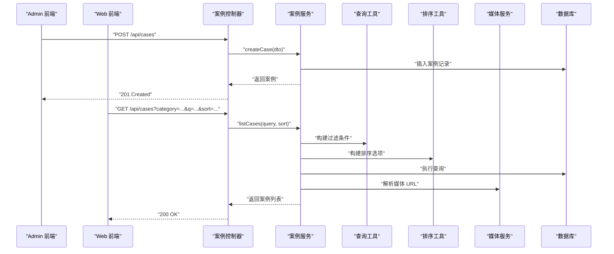

**图表来源** 
- [cases.controller.ts](file://apps/api/src/cases/cases.controller.ts)
- [cases.service.ts](file://apps/api/src/cases/cases.service.ts)
- [content-query.ts](file://apps/api/src/common/utils/content-query.ts)
- [list-sort.ts](file://apps/api/src/common/utils/list-sort.ts)
- [media.service.ts](file://apps/api/src/media/media.service.ts)

## 详细组件分析

### 数据模型与领域实体
- 案例实体包含标题、摘要、正文（Markdown）、状态、发布时间、作者、分类、标签、媒体引用等字段。
- 分类与标签为可复用维度，支持多对多关系。
- 媒体引用指向对象存储中的资源，支持图片、视频等多类型。

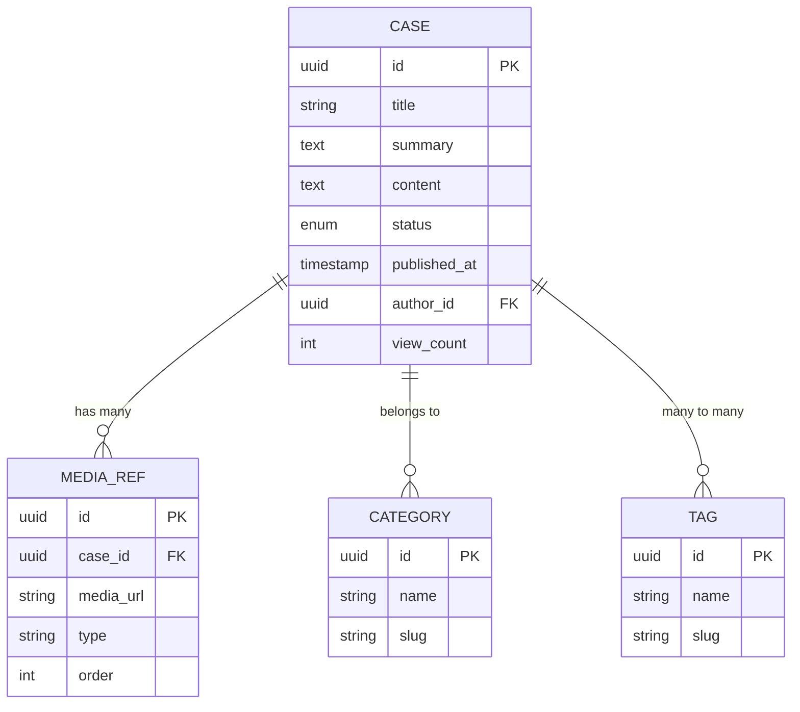

**图表来源** 
- [schema.prisma](file://apps/api/prisma/schema.prisma)

**章节来源**
- [schema.prisma](file://apps/api/prisma/schema.prisma)

### 案例服务与业务逻辑
- 创建/更新：校验 DTO，处理媒体引用，维护分类与标签关联，设置元数据（作者、时间戳）。
- 列表查询：支持按分类、标签、关键词、状态、时间范围等过滤；支持多字段排序与分页。
- 详情读取：根据 ID 或 slug 获取单条案例，附带媒体与分类标签信息。
- 删除：软删除或硬删除策略，清理关联媒体引用。

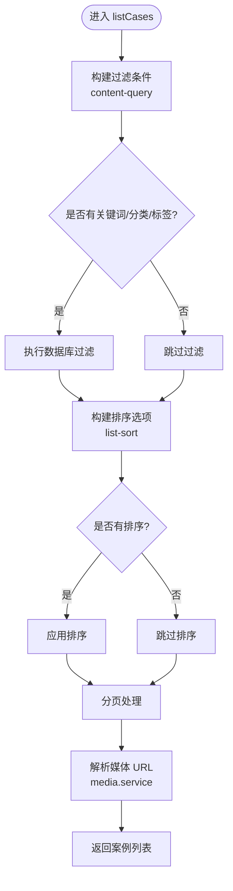

**图表来源** 
- [cases.service.ts](file://apps/api/src/cases/cases.service.ts)
- [content-query.ts](file://apps/api/src/common/utils/content-query.ts)
- [list-sort.ts](file://apps/api/src/common/utils/list-sort.ts)
- [media.service.ts](file://apps/api/src/media/media.service.ts)

**章节来源**
- [cases.service.ts](file://apps/api/src/cases/cases.service.ts)
- [content-query.ts](file://apps/api/src/common/utils/content-query.ts)
- [list-sort.ts](file://apps/api/src/common/utils/list-sort.ts)

### 案例控制器与 API 设计
- 路由前缀：/api/cases
- 方法：
  - POST /api/cases：创建案例
  - PUT /api/cases/:id：更新案例
  - DELETE /api/cases/:id：删除案例
  - GET /api/cases：列表查询（支持复杂查询与排序）
  - GET /api/cases/:id：详情查询
- 鉴权：需要管理员或具备案例管理权限的角色。
- 响应：统一格式，包含数据、分页信息与元数据。

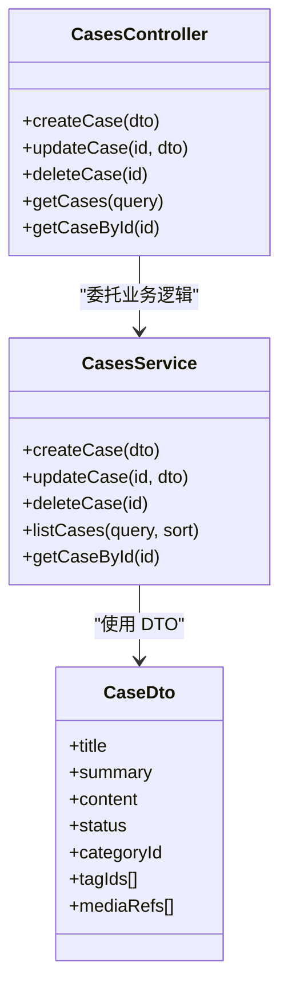

**图表来源** 
- [cases.controller.ts](file://apps/api/src/cases/cases.controller.ts)
- [cases.service.ts](file://apps/api/src/cases/cases.service.ts)
- [case.dto.ts](file://apps/api/src/cases/dto/case.dto.ts)

**章节来源**
- [cases.controller.ts](file://apps/api/src/cases/cases.controller.ts)
- [case.dto.ts](file://apps/api/src/cases/dto/case.dto.ts)

### 多媒体内容与展示模板
- 媒体上传与引用：通过媒体服务统一管理，支持图片、视频、文档等类型；媒体 URL 生成与水印可选。
- 内容模板：正文使用 Markdown，前端通过 MarkdownBody 渲染；支持代码高亮、表格、链接等。
- 展示模板系统：Web 端案例详情页由 MarkdownBody 渲染内容，结合分类与标签进行展示。

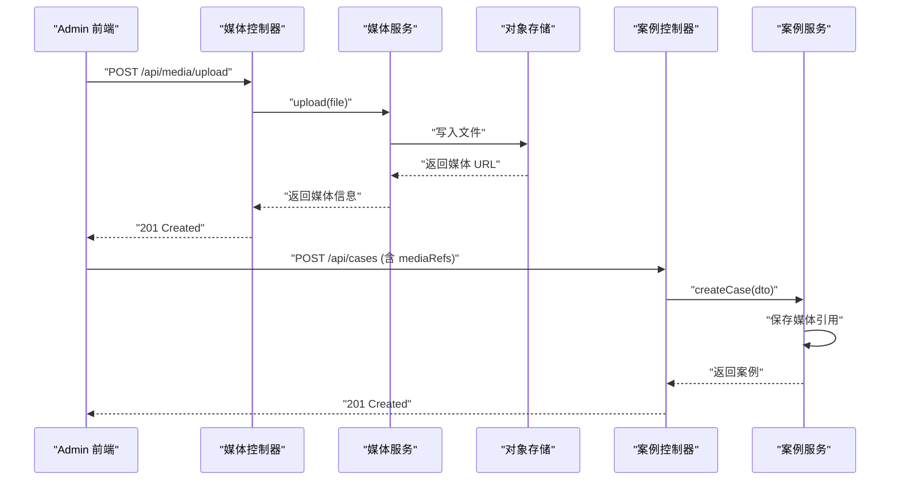

**图表来源** 
- [media.controller.ts](file://apps/api/src/media/media.controller.ts)
- [media.service.ts](file://apps/api/src/media/media.service.ts)
- [cases.controller.ts](file://apps/api/src/cases/cases.controller.ts)
- [cases.service.ts](file://apps/api/src/cases/cases.service.ts)

**章节来源**
- [media.service.ts](file://apps/api/src/media/media.service.ts)
- [media.controller.ts](file://apps/api/src/media/media.controller.ts)
- [MarkdownBody.tsx](file://apps/web/src/components/content/MarkdownBody.tsx)

### 分类与标签管理
- 分类：用于案例的业务分组，支持 slug 与名称。
- 标签：细粒度标记，支持多标签组合查询。
- 关联：案例与分类为多对一，与标签为多对多。

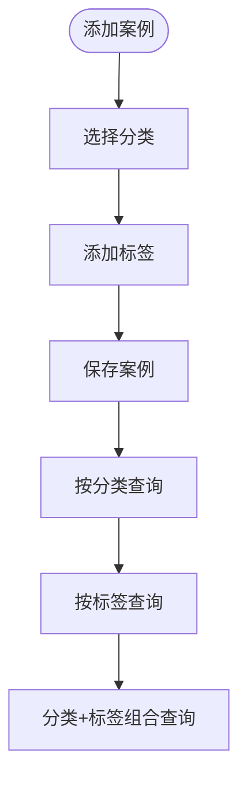

**图表来源** 
- [schema.prisma](file://apps/api/prisma/schema.prisma)
- [cases.service.ts](file://apps/api/src/cases/cases.service.ts)

**章节来源**
- [schema.prisma](file://apps/api/prisma/schema.prisma)
- [cases.service.ts](file://apps/api/src/cases/cases.service.ts)

### 搜索与高级查询
- 关键词搜索：支持标题、摘要、正文全文检索。
- 过滤条件：分类、标签、状态、时间范围、作者等。
- 排序选项：按发布时间、浏览量、更新时间等字段排序，支持升序/降序。
- 分页：支持 page、pageSize 参数。

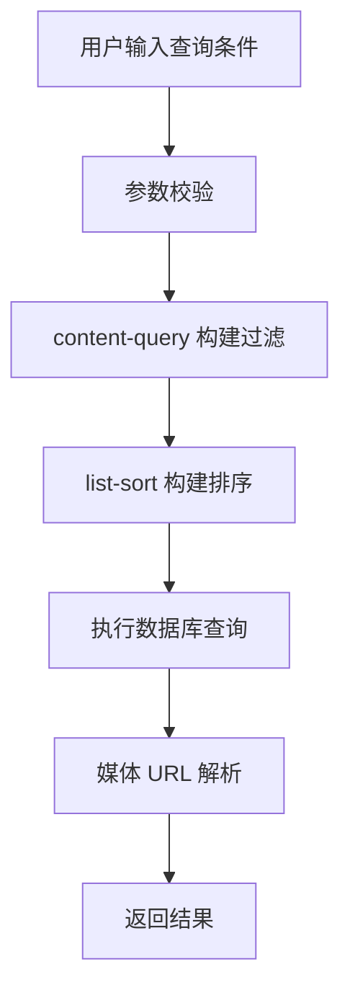

**图表来源** 
- [content-query.ts](file://apps/api/src/common/utils/content-query.ts)
- [list-sort.ts](file://apps/api/src/common/utils/list-sort.ts)
- [cases.service.ts](file://apps/api/src/cases/cases.service.ts)

**章节来源**
- [content-query.ts](file://apps/api/src/common/utils/content-query.ts)
- [list-sort.ts](file://apps/api/src/common/utils/list-sort.ts)
- [cases.service.ts](file://apps/api/src/cases/cases.service.ts)

### 权限控制与访问控制
- 角色与权限：通过 JWT 鉴权与角色守卫，限制案例的创建、编辑、删除等操作。
- 内容级权限：可基于作者或组织维度控制可见性（例如仅内部可见）。
- 媒体访问控制：媒体资源可通过签名 URL 或访问令牌保护。

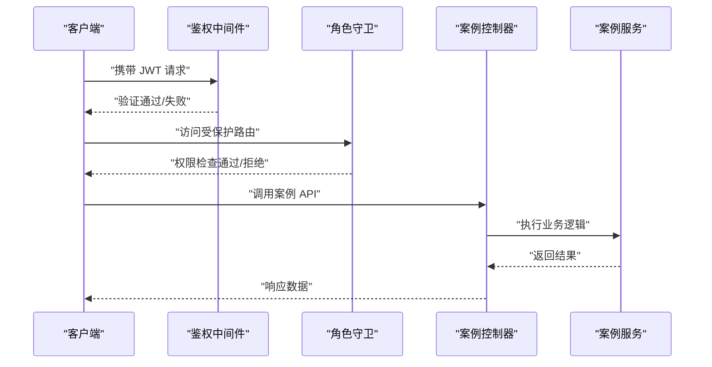

**图表来源** 
- [cases.controller.ts](file://apps/api/src/cases/cases.controller.ts)
- [cases.service.ts](file://apps/api/src/cases/cases.service.ts)

**章节来源**
- [cases.controller.ts](file://apps/api/src/cases/cases.controller.ts)
- [cases.service.ts](file://apps/api/src/cases/cases.service.ts)

### 前端 Admin 与 Web 集成
- Admin：通过 cases.tsx 配置资源，使用 ResourceForm 与 MediaPicker 完成案例编辑与媒体选择。
- Web：通过 route.ts 与 lib/cases.ts 调用 API，ContentListShell 与 ContentCategoryTabs 提供列表与分类筛选，MarkdownBody 渲染详情。

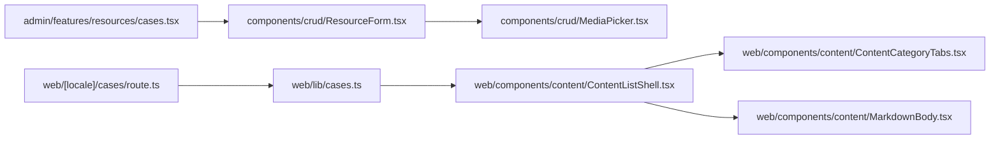

**图表来源** 
- [cases.tsx](file://apps/admin/src/features/resources/cases.tsx)
- [ResourceForm.tsx](file://apps/admin/src/components/crud/ResourceForm.tsx)
- [MediaPicker.tsx](file://apps/admin/src/components/crud/MediaPicker.tsx)
- [route.ts](file://apps/web/src/app/[locale]/cases/route.ts)
- [cases.ts](file://apps/web/src/lib/cases.ts)
- [ContentListShell.tsx](file://apps/web/src/components/content/ContentListShell.tsx)
- [ContentCategoryTabs.tsx](file://apps/web/src/components/content/ContentCategoryTabs.tsx)
- [MarkdownBody.tsx](file://apps/web/src/components/content/MarkdownBody.tsx)

**章节来源**
- [cases.tsx](file://apps/admin/src/features/resources/cases.tsx)
- [ResourceForm.tsx](file://apps/admin/src/components/crud/ResourceForm.tsx)
- [MediaPicker.tsx](file://apps/admin/src/components/crud/MediaPicker.tsx)
- [route.ts](file://apps/web/src/app/[locale]/cases/route.ts)
- [cases.ts](file://apps/web/src/lib/cases.ts)
- [ContentListShell.tsx](file://apps/web/src/components/content/ContentListShell.tsx)
- [ContentCategoryTabs.tsx](file://apps/web/src/components/content/ContentCategoryTabs.tsx)
- [MarkdownBody.tsx](file://apps/web/src/components/content/MarkdownBody.tsx)

## 依赖关系分析
- 控制器依赖服务，服务依赖查询与排序工具、媒体服务与数据库。
- 前端 Admin 依赖资源框架与媒体选择器。
- 前端 Web 依赖 API 客户端与内容渲染组件。

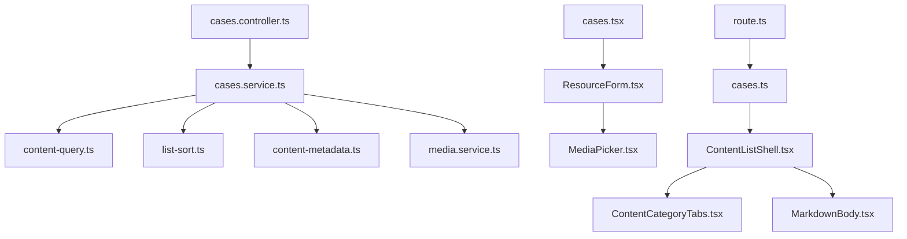

**图表来源** 
- [cases.controller.ts](file://apps/api/src/cases/cases.controller.ts)
- [cases.service.ts](file://apps/api/src/cases/cases.service.ts)
- [content-query.ts](file://apps/api/src/common/utils/content-query.ts)
- [list-sort.ts](file://apps/api/src/common/utils/list-sort.ts)
- [content-metadata.ts](file://apps/api/src/common/utils/content-metadata.ts)
- [media.service.ts](file://apps/api/src/media/media.service.ts)
- [cases.tsx](file://apps/admin/src/features/resources/cases.tsx)
- [ResourceForm.tsx](file://apps/admin/src/components/crud/ResourceForm.tsx)
- [MediaPicker.tsx](file://apps/admin/src/components/crud/MediaPicker.tsx)
- [route.ts](file://apps/web/src/app/[locale]/cases/route.ts)
- [cases.ts](file://apps/web/src/lib/cases.ts)
- [ContentListShell.tsx](file://apps/web/src/components/content/ContentListShell.tsx)
- [ContentCategoryTabs.tsx](file://apps/web/src/components/content/ContentCategoryTabs.tsx)
- [MarkdownBody.tsx](file://apps/web/src/components/content/MarkdownBody.tsx)

**章节来源**
- [cases.controller.ts](file://apps/api/src/cases/cases.controller.ts)
- [cases.service.ts](file://apps/api/src/cases/cases.service.ts)
- [content-query.ts](file://apps/api/src/common/utils/content-query.ts)
- [list-sort.ts](file://apps/api/src/common/utils/list-sort.ts)
- [content-metadata.ts](file://apps/api/src/common/utils/content-metadata.ts)
- [media.service.ts](file://apps/api/src/media/media.service.ts)
- [cases.tsx](file://apps/admin/src/features/resources/cases.tsx)
- [ResourceForm.tsx](file://apps/admin/src/components/crud/ResourceForm.tsx)
- [MediaPicker.tsx](file://apps/admin/src/components/crud/MediaPicker.tsx)
- [route.ts](file://apps/web/src/app/[locale]/cases/route.ts)
- [cases.ts](file://apps/web/src/lib/cases.ts)
- [ContentListShell.tsx](file://apps/web/src/components/content/ContentListShell.tsx)
- [ContentCategoryTabs.tsx](file://apps/web/src/components/content/ContentCategoryTabs.tsx)
- [MarkdownBody.tsx](file://apps/web/src/components/content/MarkdownBody.tsx)

## 性能考虑
- 查询优化：合理使用索引（标题、slug、分类、标签、状态、时间字段），避免全表扫描。
- 分页与懒加载：默认分页大小适中，前端按需加载媒体缩略图。
- 缓存策略：热点案例列表与详情可引入 Redis 缓存，减少数据库压力。
- 媒体优化：图片压缩与 CDN 分发，视频流式传输。

## 故障排查指南
- 鉴权失败：检查 JWT 令牌与角色权限配置，确认路由守卫是否正确。
- 媒体上传失败：检查对象存储配置与 CORS，确认媒体服务日志。
- 查询无结果：检查查询参数合法性，确认关键词与分类/标签是否存在。
- 渲染异常：检查 Markdown 内容格式与组件兼容性。

**章节来源**
- [cases.controller.ts](file://apps/api/src/cases/cases.controller.ts)
- [media.service.ts](file://apps/api/src/media/media.service.ts)
- [cases.service.ts](file://apps/api/src/cases/cases.service.ts)

## 结论
案例管理模块提供了完整的案例生命周期管理能力，涵盖数据模型、多媒体支持、分类与标签、搜索与排序、权限控制与前后端集成。通过统一的查询与排序工具、媒体服务与权限机制，确保了系统的可扩展性与安全性。建议在生产环境中启用缓存与 CDN，并持续监控查询性能与错误率。

## 附录：API 规范与示例
- 基础路径：/api/cases
- 认证：Bearer Token（JWT）
- 常用查询参数：
  - category：分类 slug
  - tags：标签数组（逗号分隔）
  - q：关键词（全文检索）
  - status：状态枚举
  - sort：排序字段与方向（如 created_at:desc）
  - page、pageSize：分页
- 响应体：
  - data：案例列表或详情
  - meta：分页与统计信息
  - error：错误信息（失败时）

示例请求与响应请参考各控制器与服务实现的具体行为。

**章节来源**
- [cases.controller.ts](file://apps/api/src/cases/cases.controller.ts)
- [cases.service.ts](file://apps/api/src/cases/cases.service.ts)
- [case.dto.ts](file://apps/api/src/cases/dto/case.dto.ts)