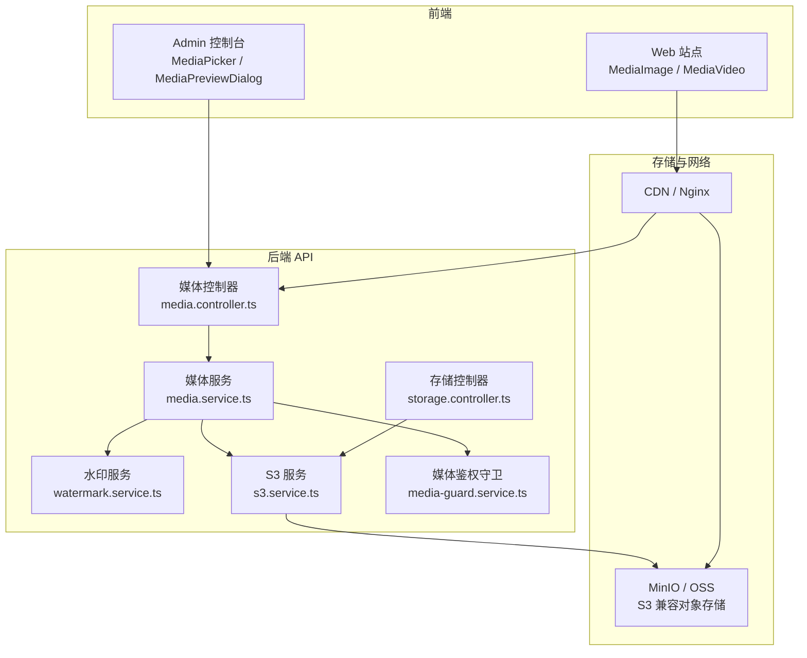
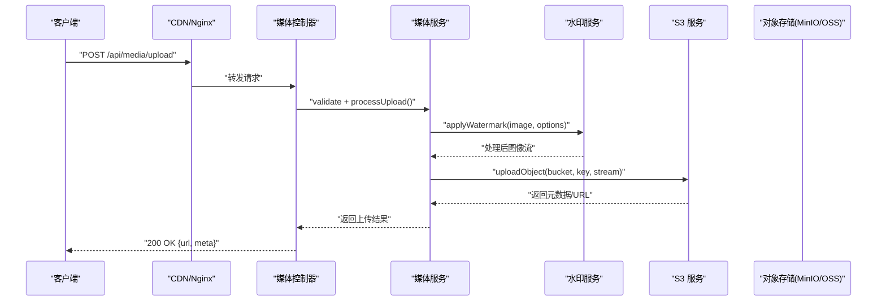
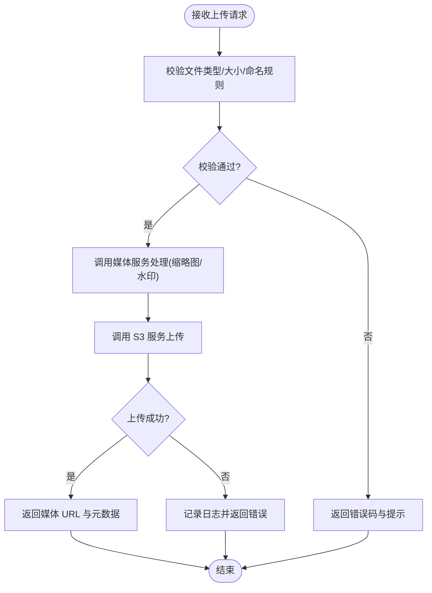
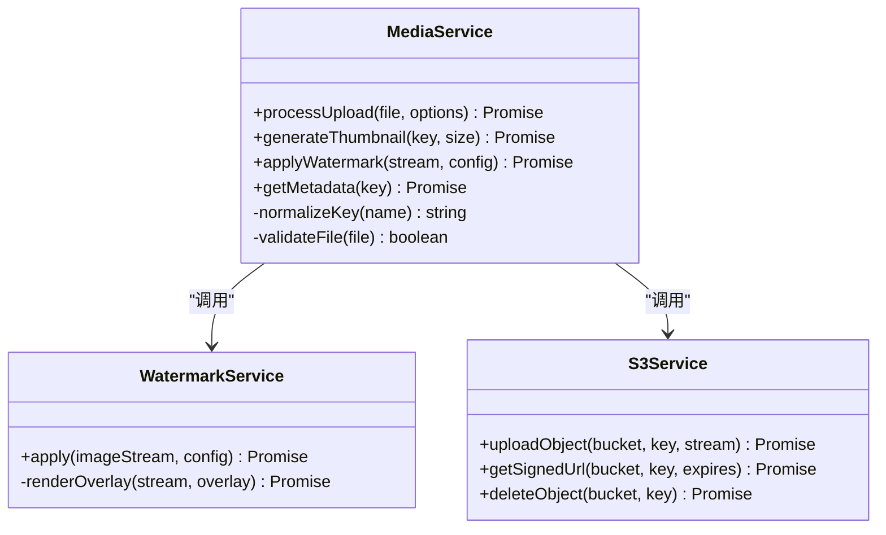
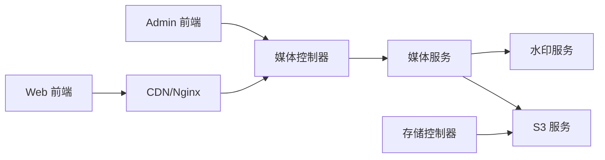

# 媒体文件存储

<cite>
**本文引用的文件**   
- [media.controller.ts](file://apps/api/src/media/media.controller.ts)
- [media.service.ts](file://apps/api/src/media/media.service.ts)
- [watermark.service.ts](file://apps/api/src/media/watermark.service.ts)
- [s3.service.ts](file://apps/api/src/storage/s3.service.ts)
- [storage.controller.ts](file://apps/api/src/storage/storage.controller.ts)
- [media-guard.service.ts](file://apps/api/src/media/media-guard.service.ts)
- [site-static-paths.ts](file://apps/api/src/media/site-static-paths.ts)
- [MediaPicker.tsx](file://apps/admin/src/components/crud/MediaPicker.tsx)
- [MediaPreviewDialog.tsx](file://apps/admin/src/components/media/MediaPreviewDialog.tsx)
- [media-utils.ts](file://apps/admin/src/components/media/media-utils.ts)
- [media.ts](file://apps/admin/src/features/media.ts)
- [media-url.ts](file://apps/admin/src/lib/media-url.ts)
- [oss-image-loader.ts](file://apps/web/src/lib/oss-image-loader.ts)
- [media-origin.ts](file://apps/web/src/lib/media-origin.ts)
- [MediaImage.tsx](file://apps/web/src/components/MediaImage.tsx)
- [MediaVideo.tsx](file://apps/web/src/components/MediaVideo.tsx)
- [docker-compose.dev.yml](file://infra/docker/docker-compose.dev.yml)
- [docker-compose.prod.yml](file://infra/docker/docker-compose.prod.yml)
- [nginx/tzj.conf](file://infra/docker/nginx/tzj.conf)
- [nginx/templates/tzj.conf.template](file://infra/docker/nginx/templates/tzj.conf.template)
- [minio/cors.xml](file://infra/docker/minio/cors.xml)
- [oss/cors.json](file://infra/docker/oss/cors.json)
</cite>

## 目录
1. [简介](#简介)
2. [项目结构](#项目结构)
3. [核心组件](#核心组件)
4. [架构总览](#架构总览)
5. [详细组件分析](#详细组件分析)
6. [依赖关系分析](#依赖关系分析)
7. [性能考虑](#性能考虑)
8. [故障排查指南](#故障排查指南)
9. [结论](#结论)
10. [附录](#附录)

## 简介
本文件为媒体文件存储系统的技术文档，覆盖上传、下载、预览与管理功能，并详细说明 S3 兼容存储集成、水印处理、格式转换与缩略图生成。同时包含权限控制、CDN 加速、缓存策略与存储空间优化建议，提供 API 接口说明、前端上传组件集成方式以及性能优化要点。

## 项目结构
系统采用前后端分离架构：
- 后端 NestJS 应用提供媒体与存储相关 API，封装 S3 兼容对象存储访问、鉴权守卫、水印与静态路径管理。
- 前端 Admin 控制台提供媒体选择器、预览对话框与工具函数；Web 站点通过图片加载器与媒体 URL 工具进行 CDN 化展示。
- 基础设施层使用 MinIO（本地开发）或阿里云 OSS（生产），Nginx 作为反向代理与静态资源分发，配合 CORS 配置实现跨域访问。

图表来源
- [media.controller.ts:1-200](file://apps/api/src/media/media.controller.ts#L1-L200)
- [media.service.ts:1-300](file://apps/api/src/media/media.service.ts#L1-L300)
- [watermark.service.ts:1-200](file://apps/api/src/media/watermark.service.ts#L1-L200)
- [s3.service.ts:1-200](file://apps/api/src/storage/s3.service.ts#L1-L200)
- [storage.controller.ts:1-200](file://apps/api/src/storage/storage.controller.ts#L1-L200)
- [media-guard.service.ts:1-150](file://apps/api/src/media/media-guard.service.ts#L1-L150)
- [nginx/tzj.conf:1-200](file://infra/docker/nginx/tzj.conf#L1-L200)

章节来源
- [media.controller.ts:1-200](file://apps/api/src/media/media.controller.ts#L1-L200)
- [media.service.ts:1-300](file://apps/api/src/media/media.service.ts#L1-L300)
- [s3.service.ts:1-200](file://apps/api/src/storage/s3.service.ts#L1-L200)
- [storage.controller.ts:1-200](file://apps/api/src/storage/storage.controller.ts#L1-L200)
- [docker-compose.dev.yml:1-200](file://infra/docker/docker-compose.dev.yml#L1-L200)
- [docker-compose.prod.yml:1-200](file://infra/docker/docker-compose.prod.yml#L1-L200)
- [nginx/tzj.conf:1-200](file://infra/docker/nginx/tzj.conf#L1-L200)

## 核心组件
- 媒体控制器：定义上传、下载、列表、删除等 REST 接口，统一响应与错误处理。
- 媒体服务：编排上传流程、生成缩略图、调用水印服务、与 S3 服务交互。
- 水印服务：对图片/视频帧添加水印，支持位置、透明度、尺寸等参数。
- S3 服务：封装 S3 兼容 SDK，提供分片上传、直传签名、预签名 URL、批量操作。
- 存储控制器：面向通用存储能力（如桶管理、路径校验、配额）。
- 媒体鉴权守卫：基于角色/权限校验访问媒体资源的合法性。
- 静态路径管理：维护站点静态资源映射，便于快速定位与缓存命中。

章节来源
- [media.controller.ts:1-200](file://apps/api/src/media/media.controller.ts#L1-L200)
- [media.service.ts:1-300](file://apps/api/src/media/media.service.ts#L1-L300)
- [watermark.service.ts:1-200](file://apps/api/src/media/watermark.service.ts#L1-L200)
- [s3.service.ts:1-200](file://apps/api/src/storage/s3.service.ts#L1-L200)
- [storage.controller.ts:1-200](file://apps/api/src/storage/storage.controller.ts#L1-L200)
- [media-guard.service.ts:1-150](file://apps/api/src/media/media-guard.service.ts#L1-L150)
- [site-static-paths.ts:1-150](file://apps/api/src/media/site-static-paths.ts#L1-L150)

## 架构总览
媒体文件从前端发起请求，经 Nginx/CDN 路由到后端 API，由媒体服务协调水印与 S3 服务完成存储与处理，最终通过 CDN 返回给客户端。

图表来源
- [media.controller.ts:1-200](file://apps/api/src/media/media.controller.ts#L1-L200)
- [media.service.ts:1-300](file://apps/api/src/media/media.service.ts#L1-L300)
- [watermark.service.ts:1-200](file://apps/api/src/media/watermark.service.ts#L1-L200)
- [s3.service.ts:1-200](file://apps/api/src/storage/s3.service.ts#L1-L200)

## 详细组件分析

### 媒体控制器（上传/下载/管理）
- 上传接口：支持表单上传与分片上传，校验 MIME 类型与大小限制，返回可访问的媒体 URL。
- 下载接口：根据路径与权限生成临时访问链接或直接流式传输。
- 管理接口：列出、搜索、删除媒体条目，支持按标签/分类过滤。

图表来源
- [media.controller.ts:1-200](file://apps/api/src/media/media.controller.ts#L1-L200)
- [media.service.ts:1-300](file://apps/api/src/media/media.service.ts#L1-L300)

章节来源
- [media.controller.ts:1-200](file://apps/api/src/media/media.controller.ts#L1-L200)
- [media.service.ts:1-300](file://apps/api/src/media/media.service.ts#L1-L300)

### 媒体服务（流程编排与缩略图）
- 上传流程：接收文件流，生成唯一键名，触发缩略图生成与水印处理。
- 缩略图：针对图片与视频首帧生成不同尺寸的缩略图，缓存至对象存储。
- 元数据：记录原始文件名、MIME、大小、哈希、创建时间等。

图表来源
- [media.service.ts:1-300](file://apps/api/src/media/media.service.ts#L1-L300)
- [watermark.service.ts:1-200](file://apps/api/src/media/watermark.service.ts#L1-L200)
- [s3.service.ts:1-200](file://apps/api/src/storage/s3.service.ts#L1-L200)

章节来源
- [media.service.ts:1-300](file://apps/api/src/media/media.service.ts#L1-L300)
- [watermark.service.ts:1-200](file://apps/api/src/media/watermark.service.ts#L1-L200)
- [s3.service.ts:1-200](file://apps/api/src/storage/s3.service.ts#L1-L200)

### 水印服务（图片/视频帧）
- 支持文本与图片水印，可配置位置、透明度、缩放比例。
- 对视频逐帧或关键帧叠加水印，输出新流供后续处理。

章节来源
- [watermark.service.ts:1-200](file://apps/api/src/media/watermark.service.ts#L1-L200)

### S3 兼容存储集成
- 封装 MinIO/OSS 的 SDK 调用，提供上传、下载、签名 URL、批量删除等能力。
- 支持分块上传与断点续传，提升大文件稳定性。

章节来源
- [s3.service.ts:1-200](file://apps/api/src/storage/s3.service.ts#L1-L200)
- [storage.controller.ts:1-200](file://apps/api/src/storage/storage.controller.ts#L1-L200)

### 媒体鉴权守卫（权限控制）
- 基于用户角色与资源权限判断是否允许访问特定媒体路径。
- 支持白名单路径与动态令牌校验，防止未授权访问。

章节来源
- [media-guard.service.ts:1-150](file://apps/api/src/media/media-guard.service.ts#L1-L150)

### 静态路径管理（站点资源）
- 维护站点静态资源的路径映射，便于快速检索与缓存命中。
- 与 CDN 路径策略结合，减少回源压力。

章节来源
- [site-static-paths.ts:1-150](file://apps/api/src/media/site-static-paths.ts#L1-L150)

### 前端上传组件集成（Admin）
- MediaPicker：在内容编辑场景中提供媒体选择与上传入口。
- MediaPreviewDialog：预览选中媒体的缩略图与详情。
- media-utils：提供媒体 URL 构建、类型判断与尺寸计算工具。
- features/media：封装媒体相关的状态管理与 API 调用。

章节来源
- [MediaPicker.tsx:1-200](file://apps/admin/src/components/crud/MediaPicker.tsx#L1-L200)
- [MediaPreviewDialog.tsx:1-200](file://apps/admin/src/components/media/MediaPreviewDialog.tsx#L1-L200)
- [media-utils.ts:1-200](file://apps/admin/src/components/media/media-utils.ts#L1-L200)
- [media.ts:1-200](file://apps/admin/src/features/media.ts#L1-L200)
- [media-url.ts:1-200](file://apps/admin/src/lib/media-url.ts#L1-L200)

### Web 站点媒体展示（CDN 加速）
- oss-image-loader：适配 OSS/CDN 的图片加载器，支持尺寸裁剪与质量优化。
- media-origin：统一管理媒体域名与协议，便于切换 CDN 环境。
- MediaImage/MediaVideo：通用媒体组件，自动拼接 CDN 参数与懒加载。

章节来源
- [oss-image-loader.ts:1-200](file://apps/web/src/lib/oss-image-loader.ts#L1-L200)
- [media-origin.ts:1-200](file://apps/web/src/lib/media-origin.ts#L1-L200)
- [MediaImage.tsx:1-200](file://apps/web/src/components/MediaImage.tsx#L1-L200)
- [MediaVideo.tsx:1-200](file://apps/web/src/components/MediaVideo.tsx#L1-L200)

## 依赖关系分析
- 控制器与服务之间松耦合，通过依赖注入组合职责。
- 媒体服务依赖水印与 S3 服务，形成清晰的处理流水线。
- 前端组件通过统一的媒体 URL 工具与加载器，屏蔽底层存储差异。

图表来源
- [media.controller.ts:1-200](file://apps/api/src/media/media.controller.ts#L1-L200)
- [media.service.ts:1-300](file://apps/api/src/media/media.service.ts#L1-L300)
- [watermark.service.ts:1-200](file://apps/api/src/media/watermark.service.ts#L1-L200)
- [s3.service.ts:1-200](file://apps/api/src/storage/s3.service.ts#L1-L200)
- [storage.controller.ts:1-200](file://apps/api/src/storage/storage.controller.ts#L1-L200)

章节来源
- [media.controller.ts:1-200](file://apps/api/src/media/media.controller.ts#L1-L200)
- [media.service.ts:1-300](file://apps/api/src/media/media.service.ts#L1-L300)
- [s3.service.ts:1-200](file://apps/api/src/storage/s3.service.ts#L1-L200)
- [storage.controller.ts:1-200](file://apps/api/src/storage/storage.controller.ts#L1-L200)

## 性能考虑
- 上传优化：启用分片上传与并发上传，降低超时风险；服务端校验前置，避免无效传输。
- 缩略图与水印：异步队列处理，避免阻塞主线程；合理设置缩略图尺寸与压缩质量。
- 缓存策略：CDN 开启强缓存与版本化 URL；对象存储设置合理的 Cache-Control 与 ETag。
- 带宽优化：按需生成缩略图，避免全量大图传输；视频采用 HLS/DASH 分段播放。
- 存储优化：冷热分层，归档历史媒体；定期清理无用缩略图与临时文件。

[本节为通用指导，不直接分析具体文件]

## 故障排查指南
- 上传失败：检查文件大小与类型限制、CORS 配置、S3 连接凭证与网络连通性。
- 水印异常：确认输入流有效、水印素材可用、内存与 CPU 资源充足。
- 权限拒绝：核对用户角色与资源权限策略，检查守卫逻辑与白名单路径。
- CDN 无法访问：验证域名解析、HTTPS 证书、Nginx 反向代理与缓存失效。

章节来源
- [media-guard.service.ts:1-150](file://apps/api/src/media/media-guard.service.ts#L1-L150)
- [minio/cors.xml:1-100](file://infra/docker/minio/cors.xml#L1-L100)
- [oss/cors.json:1-100](file://infra/docker/oss/cors.json#L1-L100)
- [nginx/tzj.conf:1-200](file://infra/docker/nginx/tzj.conf#L1-L200)
- [nginx/templates/tzj.conf.template:1-200](file://infra/docker/nginx/templates/tzj.conf.template#L1-L200)

## 结论
本系统以模块化设计将媒体上传、处理与存储解耦，借助 S3 兼容对象存储与 CDN 实现高可用与高性能。通过水印与缩略图增强内容安全与展示体验，结合权限守卫与缓存策略保障安全与效率。建议在大规模场景下引入消息队列与异步任务调度，进一步提升吞吐与稳定性。

[本节为总结性内容，不直接分析具体文件]

## 附录

### API 接口概览（媒体）
- 上传媒体：POST /api/media/upload
  - 请求体：multipart/form-data，字段包括 file、bucket、key、options（水印、缩略图尺寸）
  - 响应：{ url, meta: { size, mime, hash, createdAt } }
- 下载媒体：GET /api/media/download/:key
  - 查询参数：token（可选）、expires（可选）
  - 响应：二进制流或重定向到预签名 URL
- 列表媒体：GET /api/media/list
  - 查询参数：bucket、prefix、page、pageSize、filters
  - 响应：分页结果与总数
- 删除媒体：DELETE /api/media/:key
  - 响应：{ success: true }

章节来源
- [media.controller.ts:1-200](file://apps/api/src/media/media.controller.ts#L1-L200)
- [media.service.ts:1-300](file://apps/api/src/media/media.service.ts#L1-L300)

### 基础设施与环境
- 开发环境：MinIO 作为 S3 兼容存储，Nginx 反向代理，Postgres/Redis 辅助服务。
- 生产环境：阿里云 OSS 作为对象存储，Nginx/CDN 加速，Kubernetes 部署。

章节来源
- [docker-compose.dev.yml:1-200](file://infra/docker/docker-compose.dev.yml#L1-L200)
- [docker-compose.prod.yml:1-200](file://infra/docker/docker-compose.prod.yml#L1-L200)
- [nginx/tzj.conf:1-200](file://infra/docker/nginx/tzj.conf#L1-L200)
- [nginx/templates/tzj.conf.template:1-200](file://infra/docker/nginx/templates/tzj.conf.template#L1-L200)
- [minio/cors.xml:1-100](file://infra/docker/minio/cors.xml#L1-L100)
- [oss/cors.json:1-100](file://infra/docker/oss/cors.json#L1-L100)