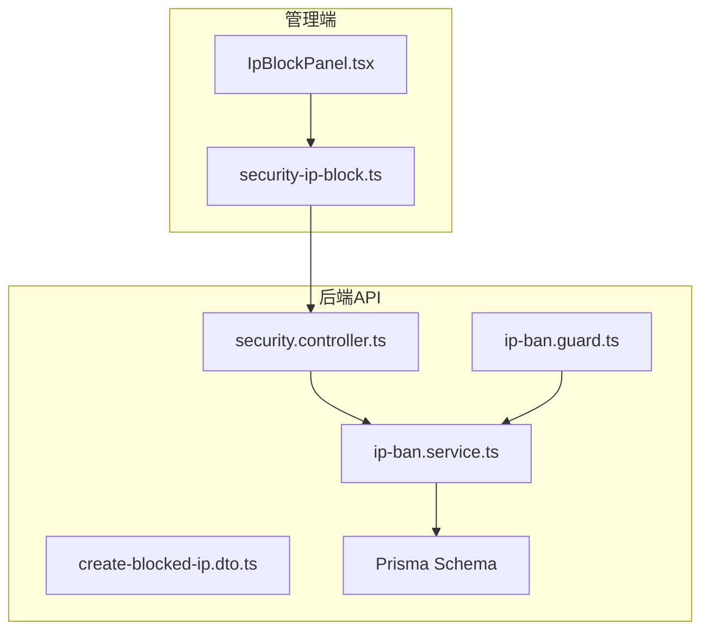
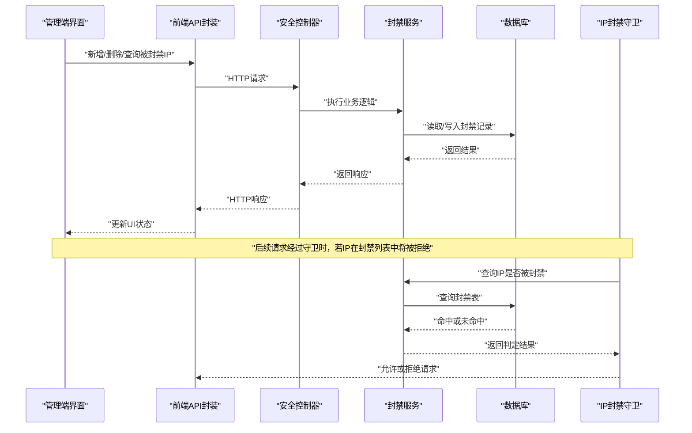
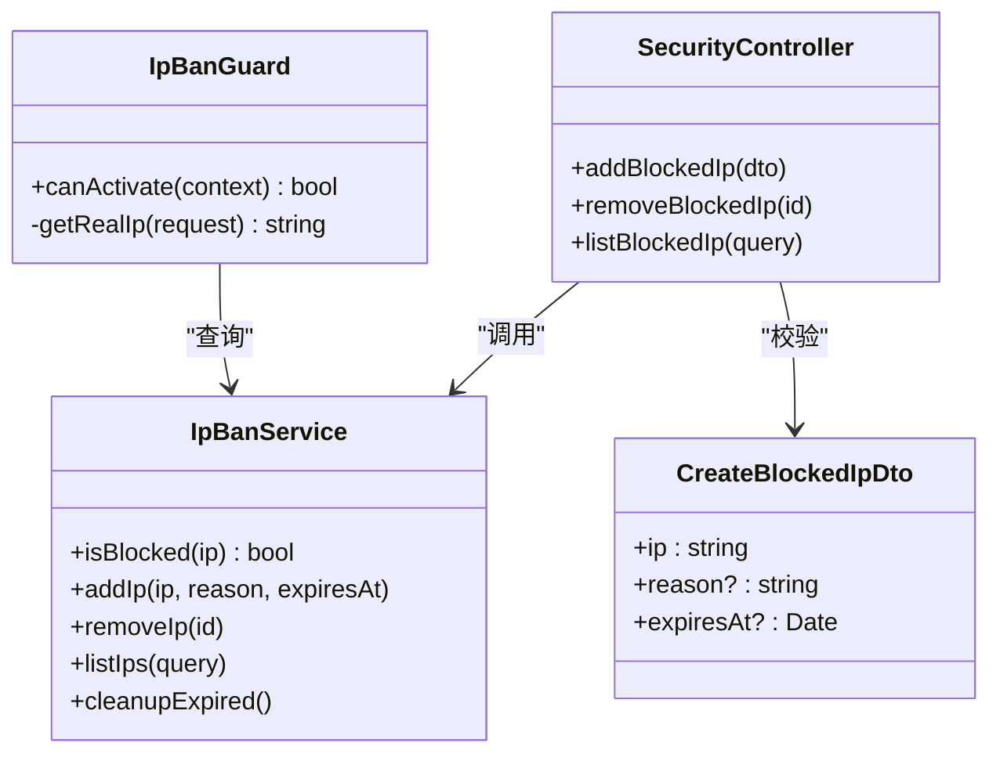

# IP黑名单管理

<cite>
**本文引用的文件**   
- [security.controller.ts](file://apps/api/src/security/security.controller.ts)
- [ip-ban.service.ts](file://apps/api/src/security/ip-ban.service.ts)
- [ip-ban.guard.ts](file://apps/api/src/security/ip-ban.guard.ts)
- [create-blocked-ip.dto.ts](file://apps/api/src/security/dto/create-blocked-ip.dto.ts)
- [IpBlockPanel.tsx](file://apps/admin/src/components/security/IpBlockPanel.tsx)
- [security-ip-block.ts](file://apps/admin/src/features/security-ip-block.ts)
- [schema.prisma](file://apps/api/prisma/schema.prisma)
</cite>

## 目录
1. [简介](#简介)
2. [项目结构](#项目结构)
3. [核心组件](#核心组件)
4. [架构总览](#架构总览)
5. [详细组件分析](#详细组件分析)
6. [依赖关系分析](#依赖关系分析)
7. [性能考虑](#性能考虑)
8. [故障排查指南](#故障排查指南)
9. [结论](#结论)
10. [附录](#附录)

## 简介
本文件面向IP封禁（黑名单）功能，系统性说明其实现原理、数据库设计、API接口与守卫机制，覆盖添加、删除、查询被封禁IP的完整流程，以及自动清理策略。同时给出业务规则、性能优化建议、监控告警配置思路，并提供使用示例与故障排查方法，帮助读者快速理解并安全落地该能力。

## 项目结构
IP封禁功能横跨后端API与管理端前端：
- 后端API（NestJS）
  - 控制器：提供REST接口用于增删改查被封禁的IP
  - 服务层：封装业务逻辑与数据访问
  - 守卫：在请求进入控制器前进行IP封禁检查
  - DTO：校验请求体字段
  - Prisma Schema：定义持久化模型
- 管理端（Next.js Admin）
  - 页面组件：可视化操作被封禁IP列表
  - 特性模块：封装前端API调用与状态管理

图表来源
- [IpBlockPanel.tsx](file://apps/admin/src/components/security/IpBlockPanel.tsx)
- [security-ip-block.ts](file://apps/admin/src/features/security-ip-block.ts)
- [security.controller.ts](file://apps/api/src/security/security.controller.ts)
- [ip-ban.service.ts](file://apps/api/src/security/ip-ban.service.ts)
- [ip-ban.guard.ts](file://apps/api/src/security/ip-ban.guard.ts)
- [create-blocked-ip.dto.ts](file://apps/api/src/security/dto/create-blocked-ip.dto.ts)
- [schema.prisma](file://apps/api/prisma/schema.prisma)

章节来源
- [security.controller.ts](file://apps/api/src/security/security.controller.ts)
- [ip-ban.service.ts](file://apps/api/src/security/ip-ban.service.ts)
- [ip-ban.guard.ts](file://apps/api/src/security/ip-ban.guard.ts)
- [create-blocked-ip.dto.ts](file://apps/api/src/security/dto/create-blocked-ip.dto.ts)
- [IpBlockPanel.tsx](file://apps/admin/src/components/security/IpBlockPanel.tsx)
- [security-ip-block.ts](file://apps/admin/src/features/security-ip-block.ts)
- [schema.prisma](file://apps/api/prisma/schema.prisma)

## 核心组件
- 控制器（Controller）
  - 暴露REST API：新增、删除、查询被封禁IP；支持分页与过滤
  - 输入校验：通过DTO对请求体进行参数校验
- 服务（Service）
  - 封装封禁业务：判断是否已封禁、批量导入、按条件查询、过期清理等
  - 数据访问：基于Prisma对数据库进行读写
- 守卫（Guard）
  - 拦截请求：从请求上下文提取客户端IP，查询封禁表，命中则拒绝访问
- 前端面板（Admin UI）
  - 展示被封禁IP列表、搜索与分页
  - 提供新增、删除等操作入口
- 前端API封装
  - 统一调用后端接口，处理错误提示与状态更新

章节来源
- [security.controller.ts](file://apps/api/src/security/security.controller.ts)
- [ip-ban.service.ts](file://apps/api/src/security/ip-ban.service.ts)
- [ip-ban.guard.ts](file://apps/api/src/security/ip-ban.guard.ts)
- [create-blocked-ip.dto.ts](file://apps/api/src/security/dto/create-blocked-ip.dto.ts)
- [IpBlockPanel.tsx](file://apps/admin/src/components/security/IpBlockPanel.tsx)
- [security-ip-block.ts](file://apps/admin/src/features/security-ip-block.ts)

## 架构总览
下图展示了从管理端发起封禁操作到后端执行守卫拦截的整体流程。

图表来源
- [security.controller.ts](file://apps/api/src/security/security.controller.ts)
- [ip-ban.service.ts](file://apps/api/src/security/ip-ban.service.ts)
- [ip-ban.guard.ts](file://apps/api/src/security/ip-ban.guard.ts)
- [schema.prisma](file://apps/api/prisma/schema.prisma)

## 详细组件分析

### 控制器（Security Controller）
职责
- 定义REST路由：新增被封禁IP、删除被封禁IP、查询被封禁IP列表
- 参数校验：使用DTO约束请求体格式
- 权限控制：结合系统权限装饰器限制访问范围（如仅管理员）

关键流程
- 新增：接收IP与可选原因/过期时间，调用服务层创建封禁记录
- 删除：根据ID或IP移除封禁记录
- 查询：支持分页、排序、过滤（如按原因、时间段）

章节来源
- [security.controller.ts](file://apps/api/src/security/security.controller.ts)
- [create-blocked-ip.dto.ts](file://apps/api/src/security/dto/create-blocked-ip.dto.ts)

### 服务（IP Ban Service）
职责
- 业务规则：
  - 重复封禁：若IP已存在，可合并或拒绝重复插入
  - 过期策略：支持设置过期时间，定时任务清理过期记录
  - 批量导入：支持批量添加被封禁IP
- 数据访问：
  - 查询：按IP、原因、时间范围检索
  - 统计：统计封禁数量、命中率等指标
  - 清理：定期清理过期记录，释放存储

复杂度与优化
- 查询索引：为IP字段建立唯一索引，提升查找与去重效率
- 批量操作：使用事务与批量写入降低IO开销
- 缓存策略：热点IP可在内存缓存中短期缓存，减少数据库压力

章节来源
- [ip-ban.service.ts](file://apps/api/src/security/ip-ban.service.ts)
- [schema.prisma](file://apps/api/prisma/schema.prisma)

### 守卫（IP Ban Guard）
职责
- 请求拦截：在控制器之前执行，判断客户端IP是否在封禁列表
- 决策逻辑：
  - 命中：直接返回403/自定义错误码，阻止请求继续
  - 未命中：放行至控制器处理

实现要点
- 获取真实IP：优先从代理头（如X-Forwarded-For）解析，回退到连接地址
- 缓存命中：可结合本地缓存或Redis加速判断
- 白名单：支持系统IP、健康检查等豁免

章节来源
- [ip-ban.guard.ts](file://apps/api/src/security/ip-ban.guard.ts)

### 前端面板（IpBlockPanel）
职责
- 列表展示：显示被封禁IP、原因、创建时间、过期时间
- 操作按钮：新增、删除、刷新、导出
- 搜索过滤：按IP、原因、时间范围筛选

交互流程
- 初始化：加载列表数据
- 新增：弹出表单，提交后刷新列表
- 删除：确认后调用删除接口，更新本地状态

章节来源
- [IpBlockPanel.tsx](file://apps/admin/src/components/security/IpBlockPanel.tsx)
- [security-ip-block.ts](file://apps/admin/src/features/security-ip-block.ts)

### 前端API封装（security-ip-block）
职责
- 封装后端接口调用：新增、删除、查询
- 错误处理：统一捕获网络错误与业务错误，提示用户
- 状态管理：与React Query或本地状态集成，保证UI一致性

章节来源
- [security-ip-block.ts](file://apps/admin/src/features/security-ip-block.ts)

### 数据库设计（Prisma Schema）
模型字段建议
- id：主键，自增或UUID
- ip：字符串，唯一索引，存储IPv4/IPv6
- reason：字符串，封禁原因
- created_at：时间戳，创建时间
- updated_at：时间戳，更新时间
- expires_at：时间戳，过期时间（可为空）

索引与约束
- 唯一索引：确保IP不重复
- 普通索引：reason、created_at、expires_at便于查询与清理
- 外键：如需关联审计日志，可引入user_id或operator_id

章节来源
- [schema.prisma](file://apps/api/prisma/schema.prisma)

## 依赖关系分析

图表来源
- [security.controller.ts](file://apps/api/src/security/security.controller.ts)
- [ip-ban.service.ts](file://apps/api/src/security/ip-ban.service.ts)
- [ip-ban.guard.ts](file://apps/api/src/security/ip-ban.guard.ts)
- [create-blocked-ip.dto.ts](file://apps/api/src/security/dto/create-blocked-ip.dto.ts)

章节来源
- [security.controller.ts](file://apps/api/src/security/security.controller.ts)
- [ip-ban.service.ts](file://apps/api/src/security/ip-ban.service.ts)
- [ip-ban.guard.ts](file://apps/api/src/security/ip-ban.guard.ts)
- [create-blocked-ip.dto.ts](file://apps/api/src/security/dto/create-blocked-ip.dto.ts)

## 性能考虑
- 索引优化
  - 为IP字段建立唯一索引，避免重复插入与提升查询速度
  - 为reason、created_at、expires_at建立复合索引，支持常见过滤场景
- 缓存策略
  - 热点IP封禁判断可使用本地内存缓存或Redis，设置合理TTL
  - 写操作后同步更新缓存，保证一致性
- 批量操作
  - 批量导入时使用事务与批量写入，减少数据库往返
- 异步清理
  - 使用定时任务（如Cron）清理过期记录，避免阻塞请求路径
- 限流与熔断
  - 对封禁相关接口进行限流，防止滥用
  - 数据库异常时快速失败，避免级联故障

[本节为通用性能指导，无需特定文件引用]

## 故障排查指南
常见问题与定位步骤
- 无法封禁IP
  - 检查DTO校验是否通过，确认IP格式正确
  - 查看数据库唯一约束冲突，确认是否重复
- 封禁无效
  - 验证守卫是否正确注册并生效
  - 检查IP解析逻辑，确认代理头配置正确
- 查询缓慢
  - 检查索引是否创建成功
  - 分析慢查询日志，优化查询条件
- 过期未清理
  - 确认定时任务是否运行
  - 检查清理任务的SQL与索引

监控与告警
- 指标采集
  - 封禁次数、命中率、误封率
  - 数据库查询耗时、缓存命中率
- 告警规则
  - 封禁量突增告警
  - 数据库连接池耗尽告警
  - 缓存不可用告警

章节来源
- [ip-ban.guard.ts](file://apps/api/src/security/ip-ban.guard.ts)
- [ip-ban.service.ts](file://apps/api/src/security/ip-ban.service.ts)
- [schema.prisma](file://apps/api/prisma/schema.prisma)

## 结论
IP黑名单管理通过控制器、服务、守卫与前端面板协同工作，实现了完整的封禁生命周期管理。合理的数据库设计、索引优化、缓存策略与监控告警是保障系统稳定性的关键。建议在生产环境充分测试边界情况，持续优化性能与可观测性。

[本节为总结性内容，无需特定文件引用]

## 附录

### 业务规则
- 唯一性：同一IP只能有一条有效封禁记录
- 过期策略：支持设置过期时间，到期自动失效
- 白名单：系统IP、健康检查等可豁免
- 审计：记录操作人、操作时间与原因

### API接口定义
- 新增被封禁IP
  - 方法：POST
  - 路径：/api/security/blocked-ips
  - 请求体：包含IP、原因、过期时间
  - 响应：返回新增记录
- 删除被封禁IP
  - 方法：DELETE
  - 路径：/api/security/blocked-ips/:id
  - 响应：返回删除结果
- 查询被封禁IP列表
  - 方法：GET
  - 路径：/api/security/blocked-ips
  - 查询参数：页码、每页大小、过滤条件
  - 响应：返回分页列表

章节来源
- [security.controller.ts](file://apps/api/src/security/security.controller.ts)
- [create-blocked-ip.dto.ts](file://apps/api/src/security/dto/create-blocked-ip.dto.ts)

### 使用示例
- 新增封禁
  - 管理端点击“新增”，填写IP与原因，提交后列表刷新
- 删除封禁
  - 在列表中选择目标IP，点击“删除”，确认后移除
- 查询封禁
  - 使用搜索框输入IP或原因，支持分页浏览

章节来源
- [IpBlockPanel.tsx](file://apps/admin/src/components/security/IpBlockPanel.tsx)
- [security-ip-block.ts](file://apps/admin/src/features/security-ip-block.ts)

### 自动清理机制
- 定时任务：每日凌晨执行清理过期记录
- 清理策略：删除expires_at小于当前时间的记录
- 资源回收：清理后释放索引空间，重建统计信息

章节来源
- [ip-ban.service.ts](file://apps/api/src/security/ip-ban.service.ts)
- [schema.prisma](file://apps/api/prisma/schema.prisma)