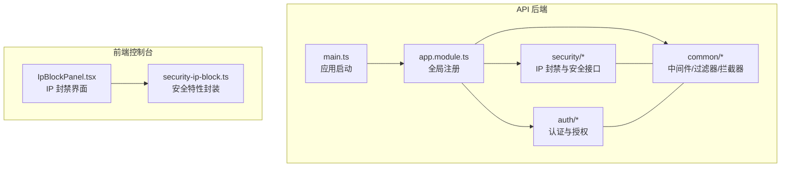
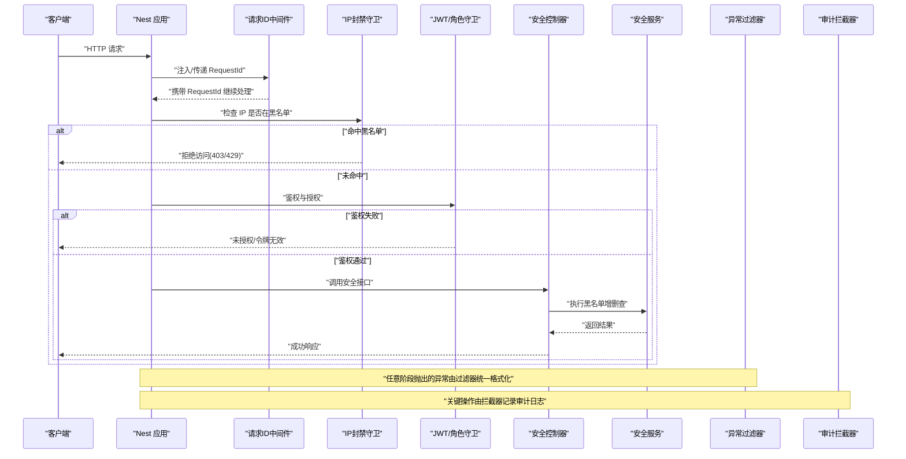
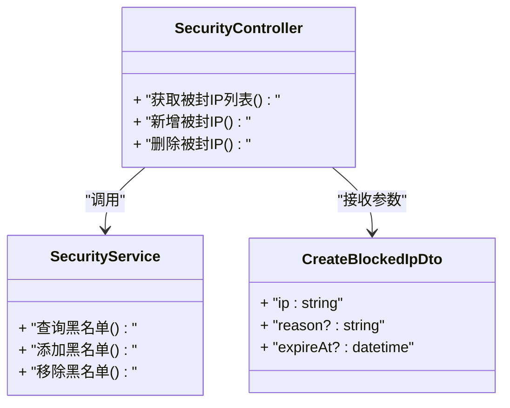
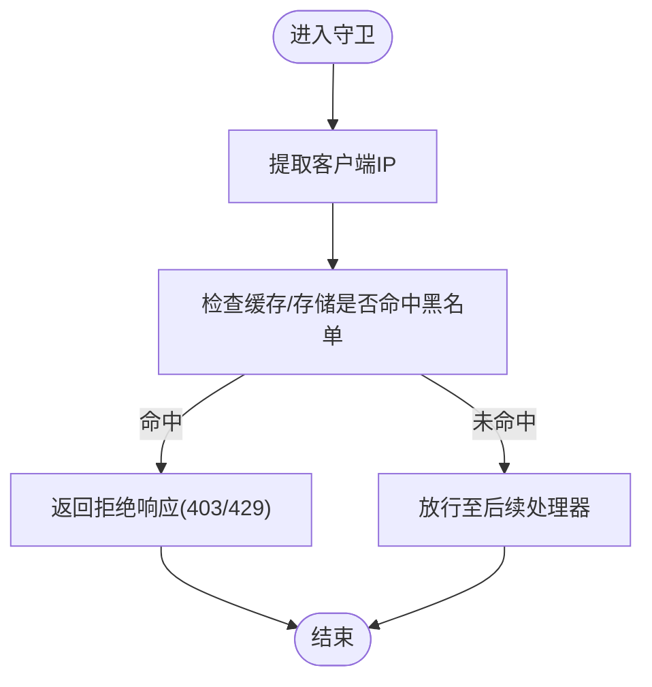
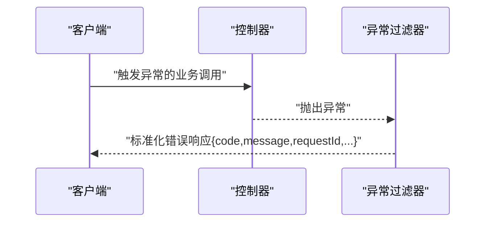
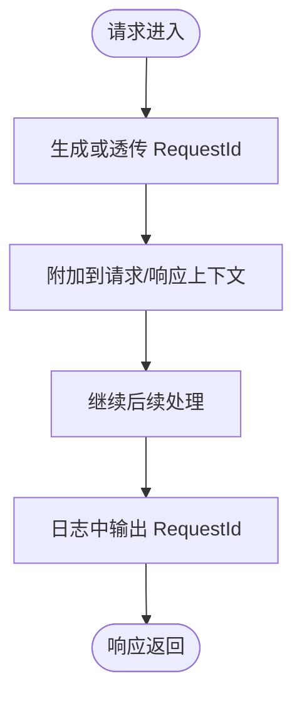
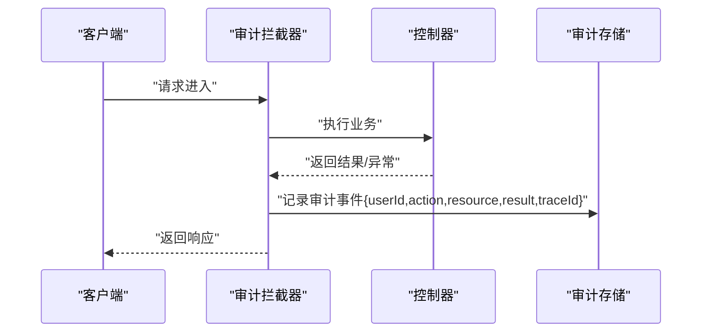
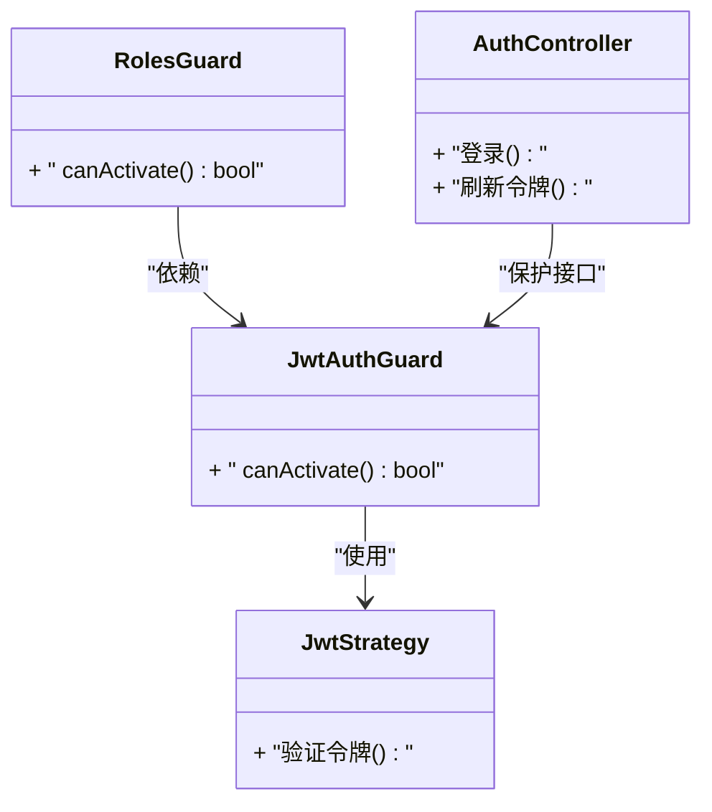
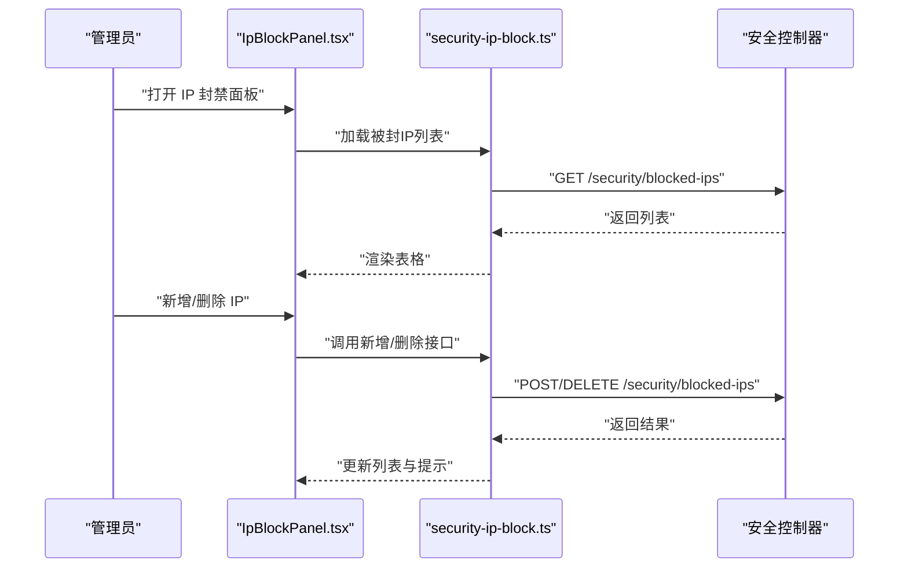
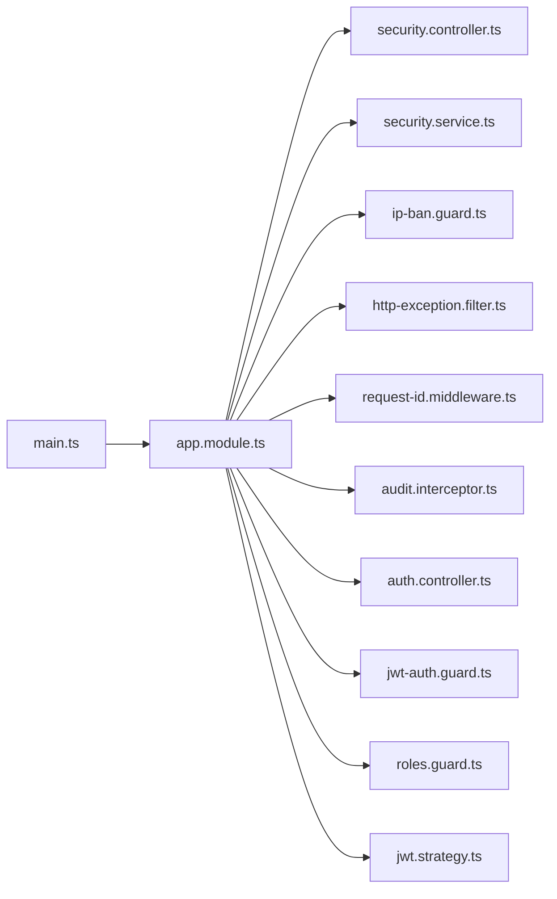

# 安全与访问控制

<cite>
**本文引用的文件**   
- [security.controller.ts](file://apps/api/src/security/security.controller.ts)
- [security.service.ts](file://apps/api/src/security/security.service.ts)
- [ip-ban.guard.ts](file://apps/api/src/security/ip-ban.guard.ts)
- [ip-ban.service.ts](file://apps/api/src/security/ip-ban.service.ts)
- [create-blocked-ip.dto.ts](file://apps/api/src/security/dto/create-blocked-ip.dto.ts)
- [http-exception.filter.ts](file://apps/api/src/common/filters/http-exception.filter.ts)
- [request-id.middleware.ts](file://apps/api/src/common/middleware/request-id.middleware.ts)
- [audit.interceptor.ts](file://apps/api/src/common/interceptors/audit.interceptor.ts)
- [auth.controller.ts](file://apps/api/src/auth/auth.controller.ts)
- [jwt-auth.guard.ts](file://apps/api/src/auth/guards/jwt-auth.guard.ts)
- [roles.guard.ts](file://apps/api/src/auth/guards/roles.guard.ts)
- [jwt.strategy.ts](file://apps/api/src/auth/strategies/jwt.strategy.ts)
- [app.module.ts](file://apps/api/src/app.module.ts)
- [main.ts](file://apps/api/src/main.ts)
- [env.validation.ts](file://apps/api/src/config/env.validation.ts)
- [IpBlockPanel.tsx](file://apps/admin/src/components/security/IpBlockPanel.tsx)
- [security-ip-block.ts](file://apps/admin/src/features/security-ip-block.ts)
</cite>

## 目录
1. [简介](#简介)
2. [项目结构](#项目结构)
3. [核心组件](#核心组件)
4. [架构总览](#架构总览)
5. [详细组件分析](#详细组件分析)
6. [依赖关系分析](#依赖关系分析)
7. [性能考量](#性能考量)
8. [故障排查指南](#故障排查指南)
9. [结论](#结论)
10. [附录](#附录)

## 简介
本文件面向“安全与访问控制”主题，系统化梳理本项目在 IP 黑名单管理、请求过滤、异常处理与审计日志方面的设计与实现。重点覆盖：
- 安全中间件与全局过滤器（请求 ID 追踪、HTTP 异常统一格式化）
- 基于守卫的 IP 封禁拦截机制
- 认证与授权（JWT、角色权限）
- 审计日志记录与可视化
- 安全配置、最佳实践、漏洞防护与监控告警建议
- 常见问题的定位与排障方法

## 项目结构
后端 API（NestJS）集中实现了安全相关能力：
- 安全模块：IP 封禁控制器、服务、DTO、守卫与服务
- 通用层：中间件（请求 ID）、过滤器（HTTP 异常）、拦截器（审计）
- 认证模块：JWT 策略、守卫、控制器
- 前端控制台：IP 封禁面板与功能特性封装

图表来源
- [main.ts](file://apps/api/src/main.ts)
- [app.module.ts](file://apps/api/src/app.module.ts)
- [security.controller.ts](file://apps/api/src/security/security.controller.ts)
- [ip-ban.guard.ts](file://apps/api/src/security/ip-ban.guard.ts)
- [http-exception.filter.ts](file://apps/api/src/common/filters/http-exception.filter.ts)
- [request-id.middleware.ts](file://apps/api/src/common/middleware/request-id.middleware.ts)
- [audit.interceptor.ts](file://apps/api/src/common/interceptors/audit.interceptor.ts)
- [IpBlockPanel.tsx](file://apps/admin/src/components/security/IpBlockPanel.tsx)
- [security-ip-block.ts](file://apps/admin/src/features/security-ip-block.ts)

章节来源
- [main.ts](file://apps/api/src/main.ts)
- [app.module.ts](file://apps/api/src/app.module.ts)

## 核心组件
- IP 封禁控制器与服务：提供查询、新增、删除被封 IP 的 API；对接存储或缓存以维护黑名单
- IP 封禁守卫：在路由级拦截来自黑名单的请求并返回拒绝响应
- HTTP 异常过滤器：统一捕获并格式化 HTTP 异常为一致的错误响应体
- 请求 ID 中间件：为每个请求生成/透传唯一标识，便于链路追踪与审计
- 审计拦截器：记录关键操作上下文（用户、资源、动作、结果等），用于合规与回溯
- 认证与授权：JWT 鉴权、角色守卫，确保仅受信任主体访问敏感接口

章节来源
- [security.controller.ts](file://apps/api/src/security/security.controller.ts)
- [security.service.ts](file://apps/api/src/security/security.service.ts)
- [ip-ban.guard.ts](file://apps/api/src/security/ip-ban.guard.ts)
- [ip-ban.service.ts](file://apps/api/src/security/ip-ban.service.ts)
- [http-exception.filter.ts](file://apps/api/src/common/filters/http-exception.filter.ts)
- [request-id.middleware.ts](file://apps/api/src/common/middleware/request-id.middleware.ts)
- [audit.interceptor.ts](file://apps/api/src/common/interceptors/audit.interceptor.ts)
- [auth.controller.ts](file://apps/api/src/auth/auth.controller.ts)
- [jwt-auth.guard.ts](file://apps/api/src/auth/guards/jwt-auth.guard.ts)
- [roles.guard.ts](file://apps/api/src/auth/guards/roles.guard.ts)
- [jwt.strategy.ts](file://apps/api/src/auth/strategies/jwt.strategy.ts)

## 架构总览
下图展示了从请求进入、安全校验、业务处理到响应返回的关键路径，以及审计与错误处理的贯穿点。

图表来源
- [request-id.middleware.ts](file://apps/api/src/common/middleware/request-id.middleware.ts)
- [ip-ban.guard.ts](file://apps/api/src/security/ip-ban.guard.ts)
- [jwt-auth.guard.ts](file://apps/api/src/auth/guards/jwt-auth.guard.ts)
- [roles.guard.ts](file://apps/api/src/auth/guards/roles.guard.ts)
- [security.controller.ts](file://apps/api/src/security/security.controller.ts)
- [security.service.ts](file://apps/api/src/security/security.service.ts)
- [http-exception.filter.ts](file://apps/api/src/common/filters/http-exception.filter.ts)
- [audit.interceptor.ts](file://apps/api/src/common/interceptors/audit.interceptor.ts)

## 详细组件分析

### IP 封禁管理（控制器/服务/DTO）
- 职责
  - 提供对 IP 黑名单的增删查接口
  - 对外暴露统一的 DTO 进行输入校验
  - 内部通过服务层与存储/缓存交互
- 关键点
  - 使用 DTO 约束入参，避免非法数据进入系统
  - 服务层负责持久化与一致性，控制器仅做参数转发与响应组装
  - 支持批量操作与分页查询（按实际实现）

图表来源
- [security.controller.ts](file://apps/api/src/security/security.controller.ts)
- [security.service.ts](file://apps/api/src/security/security.service.ts)
- [create-blocked-ip.dto.ts](file://apps/api/src/security/dto/create-blocked-ip.dto.ts)

章节来源
- [security.controller.ts](file://apps/api/src/security/security.controller.ts)
- [security.service.ts](file://apps/api/src/security/security.service.ts)
- [create-blocked-ip.dto.ts](file://apps/api/src/security/dto/create-blocked-ip.dto.ts)

### IP 封禁守卫（请求过滤）
- 职责
  - 在路由级拦截来自黑名单 IP 的请求
  - 快速拒绝并返回标准错误响应
- 关键点
  - 优先于业务逻辑执行，减少无效负载
  - 结合速率限制与限流策略可进一步缓解攻击
  - 支持白名单（如健康检查、内网网关）

图表来源
- [ip-ban.guard.ts](file://apps/api/src/security/ip-ban.guard.ts)
- [ip-ban.service.ts](file://apps/api/src/security/ip-ban.service.ts)

章节来源
- [ip-ban.guard.ts](file://apps/api/src/security/ip-ban.guard.ts)
- [ip-ban.service.ts](file://apps/api/src/security/ip-ban.service.ts)

### HTTP 异常过滤器（错误响应格式化）
- 职责
  - 统一捕获 NestJS 抛出的 HTTP 异常
  - 将异常转换为一致的 JSON 错误响应格式
- 关键点
  - 包含状态码、错误消息、时间戳、请求 ID
  - 避免泄露堆栈与敏感信息
  - 便于前端统一处理与告警采集

图表来源
- [http-exception.filter.ts](file://apps/api/src/common/filters/http-exception.filter.ts)

章节来源
- [http-exception.filter.ts](file://apps/api/src/common/filters/http-exception.filter.ts)

### 请求 ID 中间件（追踪与审计关联）
- 职责
  - 为每个请求生成或透传唯一 RequestId
  - 将 RequestId 注入响应头与日志上下文
- 关键点
  - 便于跨服务链路追踪与问题定位
  - 与审计日志、错误日志联动，提升可观测性

图表来源
- [request-id.middleware.ts](file://apps/api/src/common/middleware/request-id.middleware.ts)

章节来源
- [request-id.middleware.ts](file://apps/api/src/common/middleware/request-id.middleware.ts)

### 审计拦截器（操作审计）
- 职责
  - 记录关键操作的上下文（用户、资源、动作、结果、耗时等）
  - 与 RequestId 关联，形成完整审计链
- 关键点
  - 区分读/写操作，降低写入开销
  - 脱敏敏感字段，避免泄露密码、密钥等
  - 支持异步落库或消息队列上报

图表来源
- [audit.interceptor.ts](file://apps/api/src/common/interceptors/audit.interceptor.ts)

章节来源
- [audit.interceptor.ts](file://apps/api/src/common/interceptors/audit.interceptor.ts)

### 认证与授权（JWT/角色）
- 职责
  - 基于 JWT 的身份验证与令牌校验
  - 基于角色的访问控制（RBAC）
- 关键点
  - 策略层解析与验证令牌
  - 守卫层校验登录态与角色权限
  - 公开接口需显式标注，避免误保护

图表来源
- [jwt.strategy.ts](file://apps/api/src/auth/strategies/jwt.strategy.ts)
- [jwt-auth.guard.ts](file://apps/api/src/auth/guards/jwt-auth.guard.ts)
- [roles.guard.ts](file://apps/api/src/auth/guards/roles.guard.ts)
- [auth.controller.ts](file://apps/api/src/auth/auth.controller.ts)

章节来源
- [jwt.strategy.ts](file://apps/api/src/auth/strategies/jwt.strategy.ts)
- [jwt-auth.guard.ts](file://apps/api/src/auth/guards/jwt-auth.guard.ts)
- [roles.guard.ts](file://apps/api/src/auth/guards/roles.guard.ts)
- [auth.controller.ts](file://apps/api/src/auth/auth.controller.ts)

### 前端控制台（IP 封禁面板）
- 职责
  - 提供可视化的 IP 封禁管理能力（查看、新增、删除）
  - 与后端安全接口对接，展示实时状态
- 关键点
  - 表单校验与错误提示
  - 操作后刷新列表与状态
  - 与审计日志联动，便于追溯

图表来源
- [IpBlockPanel.tsx](file://apps/admin/src/components/security/IpBlockPanel.tsx)
- [security-ip-block.ts](file://apps/admin/src/features/security-ip-block.ts)
- [security.controller.ts](file://apps/api/src/security/security.controller.ts)

章节来源
- [IpBlockPanel.tsx](file://apps/admin/src/components/security/IpBlockPanel.tsx)
- [security-ip-block.ts](file://apps/admin/src/features/security-ip-block.ts)

## 依赖关系分析
- 全局注册
  - main.ts 中启用中间件、过滤器、拦截器
  - app.module.ts 中注册模块、守卫、策略、服务
- 安全模块依赖
  - 控制器依赖服务；服务依赖存储/缓存
  - 守卫依赖服务以读取黑名单
- 认证模块依赖
  - 控制器依赖守卫与策略；守卫依赖策略

图表来源
- [main.ts](file://apps/api/src/main.ts)
- [app.module.ts](file://apps/api/src/app.module.ts)
- [security.controller.ts](file://apps/api/src/security/security.controller.ts)
- [security.service.ts](file://apps/api/src/security/security.service.ts)
- [ip-ban.guard.ts](file://apps/api/src/security/ip-ban.guard.ts)
- [http-exception.filter.ts](file://apps/api/src/common/filters/http-exception.filter.ts)
- [request-id.middleware.ts](file://apps/api/src/common/middleware/request-id.middleware.ts)
- [audit.interceptor.ts](file://apps/api/src/common/interceptors/audit.interceptor.ts)
- [auth.controller.ts](file://apps/api/src/auth/auth.controller.ts)
- [jwt-auth.guard.ts](file://apps/api/src/auth/guards/jwt-auth.guard.ts)
- [roles.guard.ts](file://apps/api/src/auth/guards/roles.guard.ts)
- [jwt.strategy.ts](file://apps/api/src/auth/strategies/jwt.strategy.ts)

章节来源
- [main.ts](file://apps/api/src/main.ts)
- [app.module.ts](file://apps/api/src/app.module.ts)

## 性能考量
- IP 黑名单查询
  - 使用内存缓存（如 Redis）以降低延迟
  - 合理设置过期时间与 TTL，避免热点键放大
- 请求过滤
  - 将 IP 封禁守卫置于最外层，尽早拒绝无效请求
  - 配合限流与频率限制，防止滥用
- 审计日志
  - 采用异步写入或消息队列，避免阻塞主流程
  - 对高频读操作不强制审计，降低写入压力
- 错误处理
  - 统一异常过滤器避免重复处理，减少序列化开销
- 配置与环境
  - 环境变量校验与默认值，避免运行时异常

[本节为通用指导，无需特定文件引用]

## 故障排查指南
- 无法访问被误封 IP
  - 检查 IP 封禁列表是否包含该地址
  - 确认守卫逻辑与白名单策略
  - 查看审计日志与 RequestId 定位具体请求
- 认证失败或令牌无效
  - 检查 JWT 策略配置与签名算法
  - 确认令牌有效期与刷新流程
  - 查看鉴权守卫与角色守卫的权限规则
- 错误响应不一致
  - 确认全局异常过滤器已启用
  - 检查控制器抛出的异常类型与状态码
- 审计缺失
  - 确认审计拦截器已全局注册
  - 检查审计写入通道（数据库/消息队列）可用性
- 性能抖动
  - 观察黑名单缓存命中率与延迟
  - 评估审计写入是否阻塞主线程

章节来源
- [ip-ban.guard.ts](file://apps/api/src/security/ip-ban.guard.ts)
- [ip-ban.service.ts](file://apps/api/src/security/ip-ban.service.ts)
- [http-exception.filter.ts](file://apps/api/src/common/filters/http-exception.filter.ts)
- [audit.interceptor.ts](file://apps/api/src/common/interceptors/audit.interceptor.ts)
- [jwt.strategy.ts](file://apps/api/src/auth/strategies/jwt.strategy.ts)
- [jwt-auth.guard.ts](file://apps/api/src/auth/guards/jwt-auth.guard.ts)
- [roles.guard.ts](file://apps/api/src/auth/guards/roles.guard.ts)

## 结论
本项目围绕“安全与访问控制”构建了较为完整的体系：
- 通过 IP 封禁守卫实现请求级快速拦截
- 借助统一异常过滤器与请求 ID 中间件提升可观测性与一致性
- 审计拦截器保障关键操作可追溯
- 认证与授权基于 JWT 与 RBAC，满足常见权限需求
- 前端控制台提供直观的 IP 封禁管理能力
建议在生产环境结合限流、WAF、审计聚合与告警平台，进一步完善安全防护与监控能力。

[本节为总结性内容，无需特定文件引用]

## 附录

### 安全配置指南
- 环境变量与校验
  - 使用 env.validation.ts 集中校验必要配置项（如 JWT 密钥、存储连接、缓存地址等）
- 中间件与过滤器顺序
  - 请求 ID 中间件应最先执行，保证所有日志与审计均带 RequestId
  - 异常过滤器最后执行，确保所有异常都能被统一格式化
- 安全策略
  - 最小权限原则：仅开放必要的公开接口
  - 白名单策略：允许健康检查与内网网关绕过部分限制
  - 审计脱敏：避免记录敏感字段（密码、密钥、个人信息）

章节来源
- [env.validation.ts](file://apps/api/src/config/env.validation.ts)
- [request-id.middleware.ts](file://apps/api/src/common/middleware/request-id.middleware.ts)
- [http-exception.filter.ts](file://apps/api/src/common/filters/http-exception.filter.ts)
- [audit.interceptor.ts](file://apps/api/src/common/interceptors/audit.interceptor.ts)

### 安全最佳实践与漏洞防护
- 输入校验与输出编码
  - 使用 DTO 与管道严格校验输入，避免注入与越权
  - 输出前对数据进行编码与脱敏
- 防重放与限流
  - 对敏感接口实施速率限制与幂等设计
  - 结合 Token 与时间戳防止重放攻击
- 密钥与证书管理
  - 使用环境变量或密钥管理服务，禁止硬编码
  - 定期轮换 JWT 密钥与证书
- 监控与告警
  - 对异常率、拒绝率、审计事件峰值设置阈值告警
  - 结合 RequestId 与审计日志建立可观测性看板

[本节为通用指导，无需特定文件引用]

### 监控告警机制建议
- 指标采集
  - 请求成功率、失败率、平均时延、P95/P99
  - IP 封禁命中率、认证失败率、审计写入延迟
- 告警规则
  - 异常率突增、认证失败激增、审计写入失败
  - 黑名单增长过快、缓存命中率下降
- 可视化
  - 仪表盘展示关键指标趋势
  - 审计事件按 RequestId 聚合，支持钻取

[本节为通用指导，无需特定文件引用]