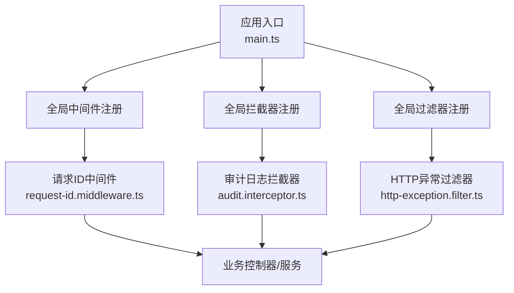
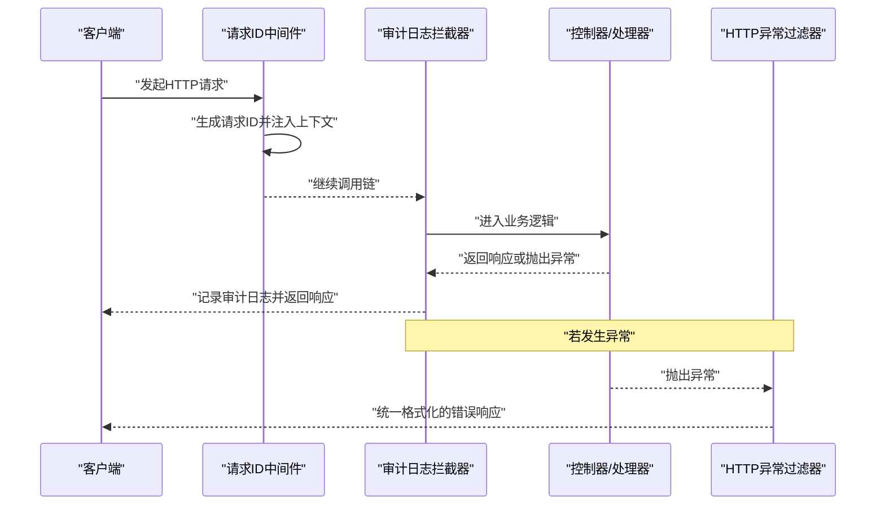
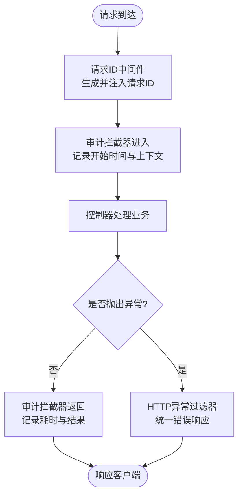
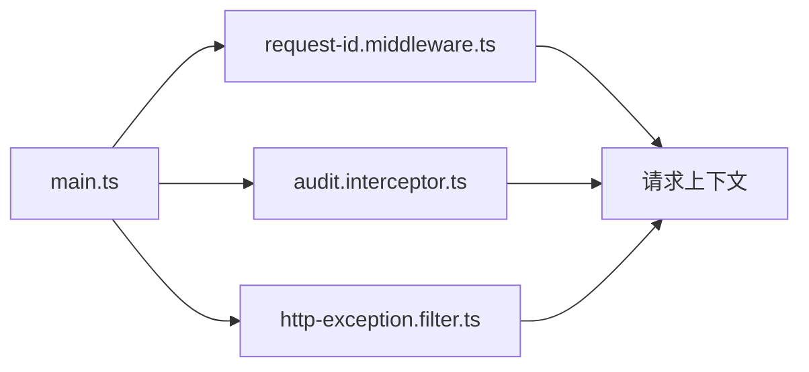

# 安全中间件

<cite>
**本文引用的文件**   
- [request-id.middleware.ts](file://apps/api/src/common/middleware/request-id.middleware.ts)
- [audit.interceptor.ts](file://apps/api/src/common/interceptors/audit.interceptor.ts)
- [http-exception.filter.ts](file://apps/api/src/common/filters/http-exception.filter.ts)
- [main.ts](file://apps/api/src/main.ts)
- [app.module.ts](file://apps/api/src/app.module.ts)
</cite>

## 目录
1. [简介](#简介)
2. [项目结构](#项目结构)
3. [核心组件](#核心组件)
4. [架构总览](#架构总览)
5. [详细组件分析](#详细组件分析)
6. [依赖关系分析](#依赖关系分析)
7. [性能考虑](#性能考虑)
8. [故障排查指南](#故障排查指南)
9. [结论](#结论)
10. [附录](#附录)

## 简介
本文件聚焦于后端 API（NestJS）中的安全中间件与横切能力，包括：
- 请求 ID 生成与追踪机制
- 审计日志拦截器
- HTTP 异常过滤器
并说明中间件的执行顺序、数据流转、错误处理流程，以及自定义中间件的开发指南、性能优化与调试方法。同时提供配置选项与使用示例，帮助开发者快速集成与扩展。

## 项目结构
本项目采用 NestJS 模块化组织，安全相关横切能力集中在 common 目录下：
- middleware：请求级中间件（如请求 ID 注入）
- interceptors：响应级拦截器（如审计日志）
- filters：全局异常过滤器（统一 HTTP 异常处理）
- main.ts：应用启动与全局中间件/拦截器/过滤器注册
- app.module.ts：模块级配置与依赖注入

图表来源
- [main.ts](file://apps/api/src/main.ts)
- [request-id.middleware.ts](file://apps/api/src/common/middleware/request-id.middleware.ts)
- [audit.interceptor.ts](file://apps/api/src/common/interceptors/audit.interceptor.ts)
- [http-exception.filter.ts](file://apps/api/src/common/filters/http-exception.filter.ts)

章节来源
- [main.ts](file://apps/api/src/main.ts)
- [app.module.ts](file://apps/api/src/app.module.ts)

## 核心组件
- 请求 ID 中间件：为每个请求生成唯一 ID，并将其注入到请求上下文，便于全链路追踪与日志关联。
- 审计日志拦截器：在请求进入与返回时记录关键信息（如路由、方法、耗时、用户标识等），用于审计与问题定位。
- HTTP 异常过滤器：统一捕获并格式化 HTTP 异常，输出结构化响应，避免泄露敏感信息。

章节来源
- [request-id.middleware.ts](file://apps/api/src/common/middleware/request-id.middleware.ts)
- [audit.interceptor.ts](file://apps/api/src/common/interceptors/audit.interceptor.ts)
- [http-exception.filter.ts](file://apps/api/src/common/filters/http-exception.filter.ts)

## 架构总览
下图展示了 NestJS 请求生命周期中各横切组件的协作关系与执行顺序。

图表来源
- [request-id.middleware.ts](file://apps/api/src/common/middleware/request-id.middleware.ts)
- [audit.interceptor.ts](file://apps/api/src/common/interceptors/audit.interceptor.ts)
- [http-exception.filter.ts](file://apps/api/src/common/filters/http-exception.filter.ts)

## 详细组件分析

### 请求 ID 中间件
职责
- 为每个请求生成唯一请求 ID（建议基于 UUID v4 或时间戳+随机数）。
- 将请求 ID 写入请求对象或 NestJS 上下文，供后续日志与审计使用。
- 可选：从上游代理（如 Nginx）透传 X-Request-ID 头，若无则生成新 ID。

执行时机
- 作为全局中间件优先执行，确保所有后续组件都能获取到请求 ID。

数据流转
- 入参：原始请求对象（含头部、路径、查询参数等）。
- 出参：更新后的请求对象（包含请求 ID），并继续调用链。

错误处理
- 若无法生成 ID（极端情况），应回退到默认策略并记录警告，不中断请求。

性能考虑
- 生成 ID 应为 O(1) 操作，避免阻塞 I/O。
- 尽量复用线程局部存储或 NestJS 上下文，减少额外内存分配。

调试方法
- 在日志中打印请求 ID，便于跨服务/组件关联。
- 通过请求头 X-Request-ID 验证透传是否生效。

章节来源
- [request-id.middleware.ts](file://apps/api/src/common/middleware/request-id.middleware.ts)

### 审计日志拦截器
职责
- 在请求进入与返回阶段记录审计信息：请求 ID、方法、路径、状态码、耗时、用户标识等。
- 对敏感字段进行脱敏（如密码、令牌）。
- 支持按路由或控制器开关审计级别。

执行时机
- 作为全局拦截器，包裹控制器处理逻辑，确保覆盖成功与失败路径。

数据流转
- 入参：ExecutionContext（包含请求、响应、元数据）。
- 出参：Observable/Promise 包装的响应流，在 finally 块中记录审计日志。

错误处理
- 捕获业务异常但不吞掉异常，继续向上抛出；审计日志需保证即使异常也记录。

性能考虑
- 异步写日志（如队列化或批量落盘），避免同步 I/O 影响响应延迟。
- 控制日志粒度，避免记录过大负载（如 body 大小限制）。

调试方法
- 开启 DEBUG 级别日志，观察审计条目是否完整。
- 校验耗时统计准确性（注意时区与时钟漂移）。

章节来源
- [audit.interceptor.ts](file://apps/api/src/common/interceptors/audit.interceptor.ts)

### HTTP 异常过滤器
职责
- 统一捕获 NestJS 内置与业务抛出的异常。
- 将异常转换为标准 JSON 响应结构，包含错误码、消息、请求 ID、时间戳等。
- 屏蔽堆栈与内部细节，防止信息泄露。

执行时机
- 作为全局过滤器，在所有异常未处理时接管。

数据流转
- 入参：异常对象、原始请求、响应。
- 出参：标准化错误响应体与合适的 HTTP 状态码。

错误处理
- 对未知异常提供兜底响应，确保系统稳定性。
- 区分可恢复错误与致命错误，设置不同状态码与提示。

性能考虑
- 避免在过滤器中进行重型计算或外部 I/O。
- 合理缓存错误模板，减少重复构造开销。

调试方法
- 开发环境可附加堆栈信息以便定位；生产环境关闭敏感信息。
- 结合请求 ID 与审计日志快速定位问题。

章节来源
- [http-exception.filter.ts](file://apps/api/src/common/filters/http-exception.filter.ts)

### 中间件执行顺序与数据流转
整体顺序
- 中间件（请求前）→ 拦截器（请求前后）→ 控制器 → 拦截器（响应后）→ 过滤器（异常）

数据流转要点
- 请求 ID 由中间件注入，贯穿整个调用链。
- 审计拦截器在请求进入与返回时读取上下文，记录审计项。
- 异常过滤器在异常发生时统一格式化响应。

图表来源
- [request-id.middleware.ts](file://apps/api/src/common/middleware/request-id.middleware.ts)
- [audit.interceptor.ts](file://apps/api/src/common/interceptors/audit.interceptor.ts)
- [http-exception.filter.ts](file://apps/api/src/common/filters/http-exception.filter.ts)

章节来源
- [main.ts](file://apps/api/src/main.ts)

## 依赖关系分析
- main.ts 负责注册全局中间件、拦截器与过滤器，决定其生效范围与顺序。
- 各组件之间低耦合：中间件仅关注请求上下文注入；拦截器关注横切日志；过滤器关注异常统一处理。
- 无循环依赖：中间件不依赖拦截器/过滤器；拦截器与过滤器仅在调用链中按序参与。

图表来源
- [main.ts](file://apps/api/src/main.ts)
- [request-id.middleware.ts](file://apps/api/src/common/middleware/request-id.middleware.ts)
- [audit.interceptor.ts](file://apps/api/src/common/interceptors/audit.interceptor.ts)
- [http-exception.filter.ts](file://apps/api/src/common/filters/http-exception.filter.ts)

章节来源
- [app.module.ts](file://apps/api/src/app.module.ts)
- [main.ts](file://apps/api/src/main.ts)

## 性能考虑
- 中间件与拦截器应避免阻塞 I/O，必要时使用异步队列或批处理。
- 审计日志建议异步写入，控制日志体积与频率，避免影响主流程。
- 请求 ID 生成需高效且唯一，避免锁竞争。
- 过滤器中不做复杂计算，保持轻量。
- 合理设置超时与重试策略，提升整体吞吐与稳定性。

[本节为通用指导，无需引用具体文件]

## 故障排查指南
常见问题
- 请求 ID 缺失：检查中间件是否全局注册，上游是否覆盖 X-Request-ID。
- 审计日志不完整：确认拦截器是否正确包裹控制器，异常路径是否记录。
- 错误响应不一致：检查过滤器是否全局启用，异常类型是否被正确识别。
- 性能退化：评估日志写入方式、请求 ID 生成算法、过滤器的复杂度。

排查步骤
- 启用调试日志，查看中间件/拦截器/过滤器的执行轨迹。
- 通过请求 ID 串联多组件日志，定位断点。
- 模拟异常场景，验证过滤器行为是否符合预期。
- 压测环境下监控 P95/P99 延迟与错误率变化。

章节来源
- [http-exception.filter.ts](file://apps/api/src/common/filters/http-exception.filter.ts)
- [audit.interceptor.ts](file://apps/api/src/common/interceptors/audit.interceptor.ts)
- [request-id.middleware.ts](file://apps/api/src/common/middleware/request-id.middleware.ts)

## 结论
通过请求 ID 中间件、审计日志拦截器与 HTTP 异常过滤器的协同，系统实现了可追踪、可审计、可观测的安全横切能力。合理的执行顺序与数据流转保障了稳定性与可维护性。遵循本文的配置与最佳实践，可快速扩展自定义中间件并持续优化性能与可观测性。

[本节为总结性内容，无需引用具体文件]

## 附录

### 自定义中间件开发指南
- 实现接口：实现 NestJS 中间件接口（如 use(req, res, next)）。
- 注册方式：在 main.ts 中全局注册或在模块中局部注册。
- 上下文共享：使用 NestJS 上下文或请求对象传递数据。
- 错误处理：中间层抛出异常交由过滤器处理；避免吞异常。
- 性能与安全：避免阻塞 I/O，谨慎处理敏感数据。

使用示例（概念性）
- 在全局注册自定义鉴权中间件，校验 Token 并注入用户信息。
- 在特定模块注册限流中间件，基于 IP 或用户维度限制请求频率。

[本节为概念性说明，无需引用具体文件]

### 配置选项与使用示例
- 请求 ID 策略：是否允许上游透传、生成算法、最大长度。
- 审计级别：按路由白名单/黑名单控制审计粒度。
- 异常映射：自定义错误码与消息模板。
- 日志输出：控制台、文件、远程收集（如 ELK/Sentry）。

章节来源
- [main.ts](file://apps/api/src/main.ts)