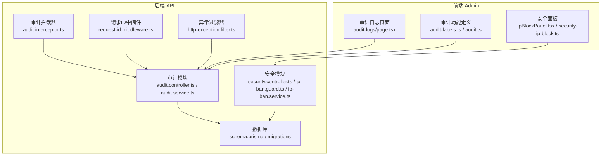
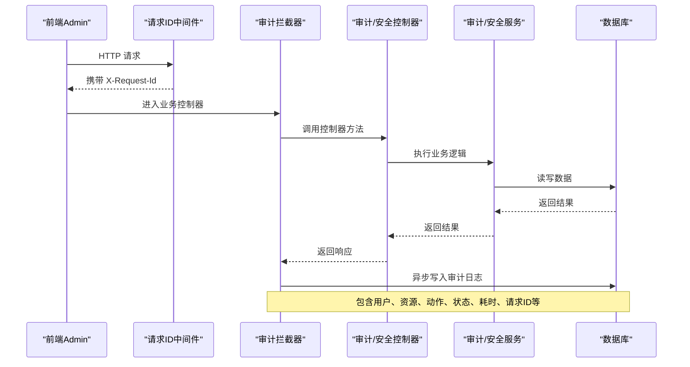
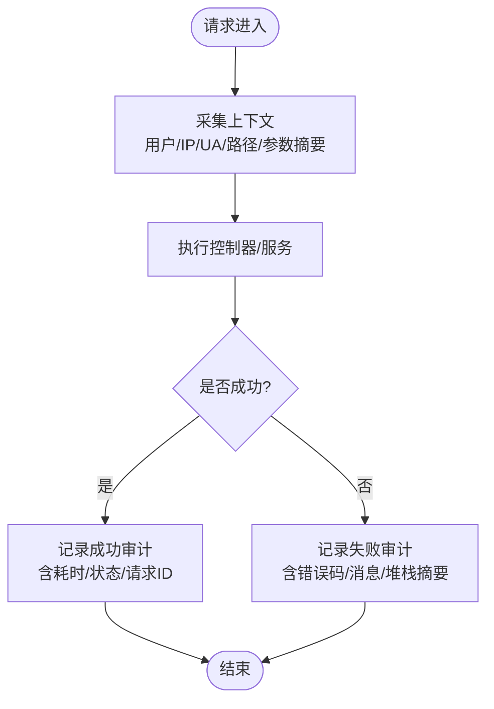
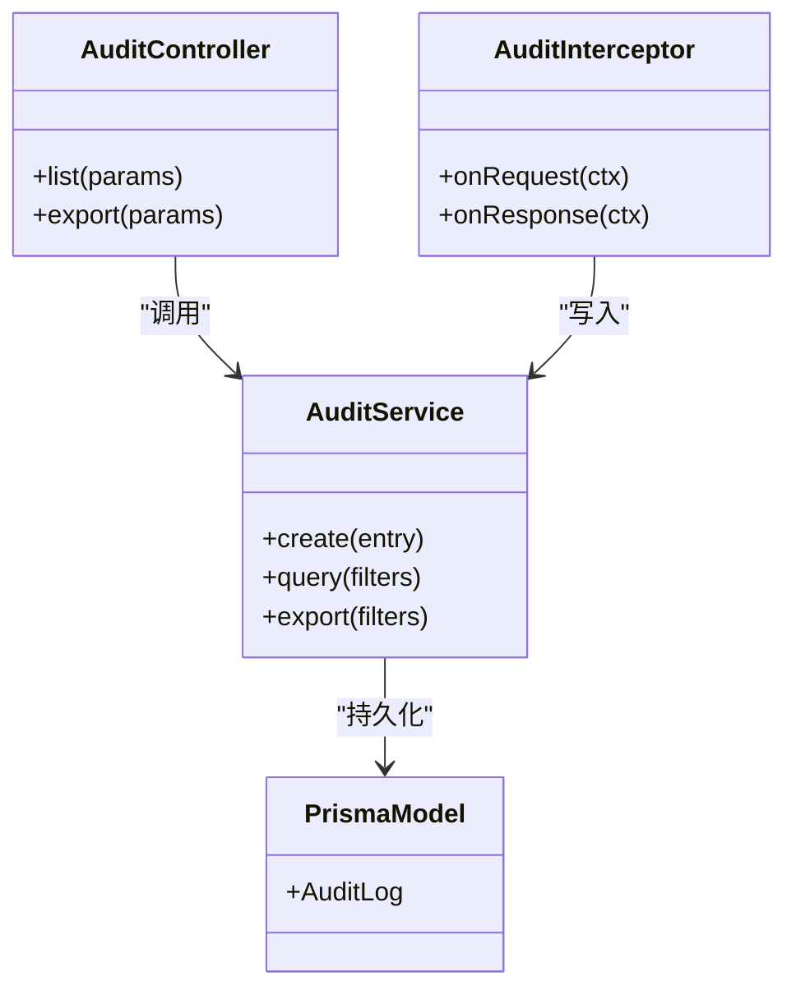
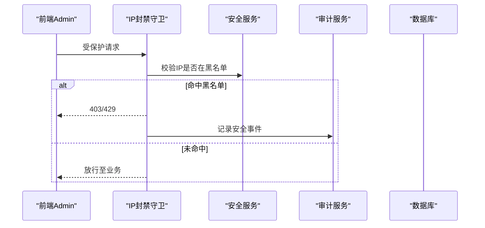
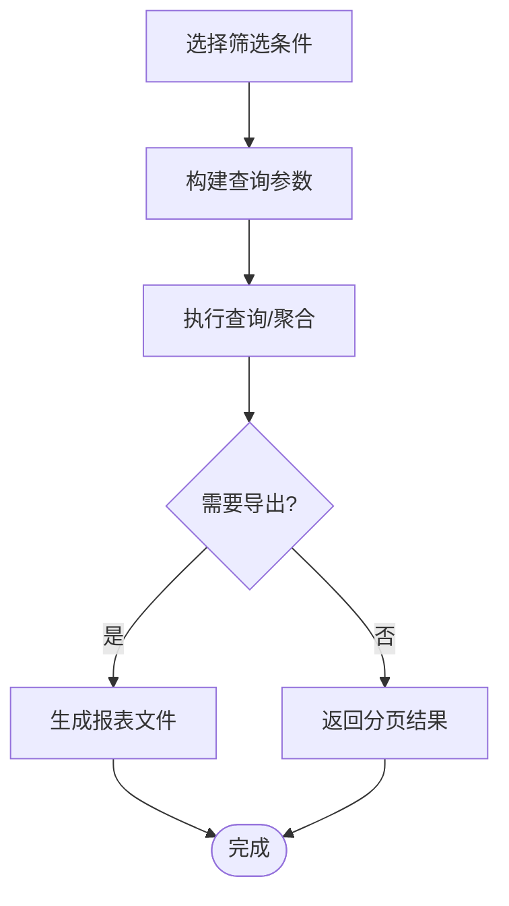
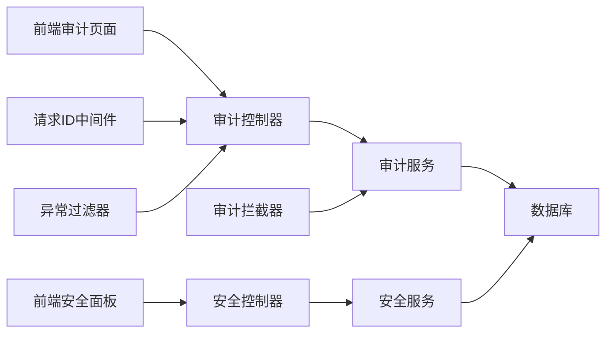

# 安全监控与审计

<cite>
**本文引用的文件**   
- [audit.interceptor.ts](file://apps/api/src/common/interceptors/audit.interceptor.ts)
- [audit.controller.ts](file://apps/api/src/audit/audit.controller.ts)
- [audit.service.ts](file://apps/api/src/audit/audit.service.ts)
- [audit.module.ts](file://apps/api/src/audit/audit.module.ts)
- [request-id.middleware.ts](file://apps/api/src/common/middleware/request-id.middleware.ts)
- [http-exception.filter.ts](file://apps/api/src/common/filters/http-exception.filter.ts)
- [schema.prisma](file://apps/api/prisma/schema.prisma)
- [migration.sql（初始）](file://apps/api/prisma/migrations/0_init/migration.sql)
- [app.module.ts](file://apps/api/src/app.module.ts)
- [main.ts](file://apps/api/src/main.ts)
- [audit-labels.ts](file://apps/admin/src/features/audit-labels.ts)
- [audit.ts](file://apps/admin/src/features/audit.ts)
- [audit-logs/page.tsx](file://apps/admin/src/app/(dashboard)/audit-logs/page.tsx)
- [security-ip-block.ts](file://apps/admin/src/features/security-ip-block.ts)
- [IpBlockPanel.tsx](file://apps/admin/src/components/security/IpBlockPanel.tsx)
- [ip-ban.guard.ts](file://apps/api/src/security/ip-ban.guard.ts)
- [ip-ban.service.ts](file://apps/api/src/security/ip-ban.service.ts)
- [security.controller.ts](file://apps/api/src/security/security.controller.ts)
- [security.service.ts](file://apps/api/src/security/security.service.ts)
- [env.validation.ts](file://apps/api/src/config/env.validation.ts)
</cite>

## 目录
1. [简介](#简介)
2. [项目结构](#项目结构)
3. [核心组件](#核心组件)
4. [架构总览](#架构总览)
5. [详细组件分析](#详细组件分析)
6. [依赖关系分析](#依赖关系分析)
7. [性能考虑](#性能考虑)
8. [故障排查指南](#故障排查指南)
9. [结论](#结论)
10. [附录](#附录)

## 简介
本文件面向安全监控与审计，覆盖以下目标：
- 审计日志记录机制：用户操作审计、系统安全事件记录、请求链路追踪。
- 安全事件监控与告警配置：IP封禁、异常访问、权限违规等。
- 合规性报告生成：基于审计数据的统计与导出能力。
- 数据存储策略、查询接口与可视化展示。
- 配置方法、告警规则设置与故障排查指南。

## 项目结构
与安全监控和审计相关的代码主要分布在后端 NestJS 模块与前端管理端页面中：
- 后端
  - 审计模块：控制器、服务、拦截器、中间件、异常过滤器。
  - 安全模块：IP 封禁守卫与服务、安全控制器。
  - 数据模型：Prisma schema 与迁移脚本。
- 前端
  - 审计日志页面与功能定义。
  - 安全面板（如 IP 封禁）。

图表来源
- [audit.controller.ts](file://apps/api/src/audit/audit.controller.ts)
- [audit.service.ts](file://apps/api/src/audit/audit.service.ts)
- [audit.interceptor.ts](file://apps/api/src/common/interceptors/audit.interceptor.ts)
- [request-id.middleware.ts](file://apps/api/src/common/middleware/request-id.middleware.ts)
- [http-exception.filter.ts](file://apps/api/src/common/filters/http-exception.filter.ts)
- [security.controller.ts](file://apps/api/src/security/security.controller.ts)
- [ip-ban.guard.ts](file://apps/api/src/security/ip-ban.guard.ts)
- [ip-ban.service.ts](file://apps/api/src/security/ip-ban.service.ts)
- [schema.prisma](file://apps/api/prisma/schema.prisma)
- [audit-logs/page.tsx](file://apps/admin/src/app/(dashboard)/audit-logs/page.tsx)
- [audit-labels.ts](file://apps/admin/src/features/audit-labels.ts)
- [audit.ts](file://apps/admin/src/features/audit.ts)
- [IpBlockPanel.tsx](file://apps/admin/src/components/security/IpBlockPanel.tsx)
- [security-ip-block.ts](file://apps/admin/src/features/security-ip-block.ts)

章节来源
- [app.module.ts](file://apps/api/src/app.module.ts)
- [main.ts](file://apps/api/src/main.ts)

## 核心组件
- 审计拦截器：在请求处理前后采集上下文信息（用户、资源、动作、结果、耗时、请求ID等），并异步写入审计日志。
- 审计控制器与服务：提供审计日志的查询、过滤、分页与导出接口；封装持久化逻辑。
- 请求ID中间件：为每个请求生成唯一ID，贯穿日志与追踪。
- 异常过滤器：捕获未处理异常，统一输出错误码与消息，便于审计与告警。
- 安全模块（IP 封禁）：守卫在服务层拦截恶意或受限IP访问，结合服务进行黑名单管理与审计记录。
- 前端审计与安全面板：提供审计日志查看、筛选与导出；提供IP封禁管理等操作界面。

章节来源
- [audit.interceptor.ts](file://apps/api/src/common/interceptors/audit.interceptor.ts)
- [audit.controller.ts](file://apps/api/src/audit/audit.controller.ts)
- [audit.service.ts](file://apps/api/src/audit/audit.service.ts)
- [request-id.middleware.ts](file://apps/api/src/common/middleware/request-id.middleware.ts)
- [http-exception.filter.ts](file://apps/api/src/common/filters/http-exception.filter.ts)
- [ip-ban.guard.ts](file://apps/api/src/security/ip-ban.guard.ts)
- [ip-ban.service.ts](file://apps/api/src/security/ip-ban.service.ts)
- [security.controller.ts](file://apps/api/src/security/security.controller.ts)
- [security.service.ts](file://apps/api/src/security/security.service.ts)
- [audit-logs/page.tsx](file://apps/admin/src/app/(dashboard)/audit-logs/page.tsx)
- [audit-labels.ts](file://apps/admin/src/features/audit-labels.ts)
- [audit.ts](file://apps/admin/src/features/audit.ts)
- [IpBlockPanel.tsx](file://apps/admin/src/components/security/IpBlockPanel.tsx)
- [security-ip-block.ts](file://apps/admin/src/features/security-ip-block.ts)

## 架构总览
审计与安全监控的整体流程如下：
- 请求进入后，中间件注入请求ID。
- 审计拦截器收集上下文并在响应完成后落库。
- 异常过滤器捕获异常并记录到审计。
- 安全守卫根据IP封禁策略拒绝访问并记录审计。
- 前端通过审计与安全API进行查询与管理。

图表来源
- [request-id.middleware.ts](file://apps/api/src/common/middleware/request-id.middleware.ts)
- [audit.interceptor.ts](file://apps/api/src/common/interceptors/audit.interceptor.ts)
- [audit.controller.ts](file://apps/api/src/audit/audit.controller.ts)
- [audit.service.ts](file://apps/api/src/audit/audit.service.ts)
- [schema.prisma](file://apps/api/prisma/schema.prisma)

## 详细组件分析

### 审计日志记录机制
- 审计拦截器负责采集请求上下文（用户身份、角色、IP、UA、路径、参数摘要、响应状态、耗时、请求ID等），并以异步方式写入审计表，避免阻塞主流程。
- 审计服务提供统一的写入与查询接口，支持按时间范围、操作类型、用户、资源、状态等维度过滤。
- 异常过滤器将未捕获异常纳入审计，便于快速定位问题。

图表来源
- [audit.interceptor.ts](file://apps/api/src/common/interceptors/audit.interceptor.ts)
- [http-exception.filter.ts](file://apps/api/src/common/filters/http-exception.filter.ts)
- [audit.service.ts](file://apps/api/src/audit/audit.service.ts)

章节来源
- [audit.interceptor.ts](file://apps/api/src/common/interceptors/audit.interceptor.ts)
- [audit.service.ts](file://apps/api/src/audit/audit.service.ts)
- [http-exception.filter.ts](file://apps/api/src/common/filters/http-exception.filter.ts)

### 用户操作审计
- 通过拦截器对受保护路由的操作进行记录，包括增删改查、权限变更、敏感配置修改等。
- 前端“审计日志”页面支持按操作类型、用户、时间范围、资源类型等筛选与分页浏览。

图表来源
- [audit.controller.ts](file://apps/api/src/audit/audit.controller.ts)
- [audit.service.ts](file://apps/api/src/audit/audit.service.ts)
- [audit.interceptor.ts](file://apps/api/src/common/interceptors/audit.interceptor.ts)
- [schema.prisma](file://apps/api/prisma/schema.prisma)

章节来源
- [audit.controller.ts](file://apps/api/src/audit/audit.controller.ts)
- [audit.service.ts](file://apps/api/src/audit/audit.service.ts)
- [audit-logs/page.tsx](file://apps/admin/src/app/(dashboard)/audit-logs/page.tsx)
- [audit-labels.ts](file://apps/admin/src/features/audit-labels.ts)
- [audit.ts](file://apps/admin/src/features/audit.ts)

### 系统安全事件记录与告警
- 安全模块提供IP封禁守卫与服务，拦截来自黑名单IP的请求，并记录审计事件。
- 可通过环境变量配置阈值与策略（例如短时间内失败登录次数、异常状态码比例等），触发告警（可对接外部通知渠道）。
- 审计日志中包含安全事件标签与分类，便于聚合分析与报表生成。

图表来源
- [ip-ban.guard.ts](file://apps/api/src/security/ip-ban.guard.ts)
- [ip-ban.service.ts](file://apps/api/src/security/ip-ban.service.ts)
- [security.controller.ts](file://apps/api/src/security/security.controller.ts)
- [audit.service.ts](file://apps/api/src/audit/audit.service.ts)

章节来源
- [ip-ban.guard.ts](file://apps/api/src/security/ip-ban.guard.ts)
- [ip-ban.service.ts](file://apps/api/src/security/ip-ban.service.ts)
- [security.controller.ts](file://apps/api/src/security/security.controller.ts)
- [security.service.ts](file://apps/api/src/security/security.service.ts)

### 合规性报告生成
- 基于审计日志的分页与导出接口，可按时间范围、操作类型、用户、资源类型等维度生成报表。
- 前端提供筛选与导出入口，后端服务聚合数据并输出结构化结果（如CSV/JSON）。

图表来源
- [audit.controller.ts](file://apps/api/src/audit/audit.controller.ts)
- [audit.service.ts](file://apps/api/src/audit/audit.service.ts)

章节来源
- [audit.controller.ts](file://apps/api/src/audit/audit.controller.ts)
- [audit.service.ts](file://apps/api/src/audit/audit.service.ts)

### 审计数据存储策略
- 使用关系型数据库存储审计日志，字段涵盖请求ID、用户、角色、IP、UA、路径、方法、参数摘要、响应状态、耗时、错误信息、审计标签等。
- 建议对高频查询字段建立索引（如时间、用户、资源类型、状态），以优化查询性能。
- 历史数据归档策略：定期归档旧数据，保留最近N天在线查询，更早数据转入冷存储。

章节来源
- [schema.prisma](file://apps/api/prisma/schema.prisma)
- [migration.sql（初始）](file://apps/api/prisma/migrations/0_init/migration.sql)

### 查询接口与可视化展示
- 后端提供审计日志列表与导出接口，支持多维度过滤与排序。
- 前端“审计日志”页面提供筛选栏、表格展示、分页与导出按钮，提升可观测性与可操作性。

章节来源
- [audit.controller.ts](file://apps/api/src/audit/audit.controller.ts)
- [audit.service.ts](file://apps/api/src/audit/audit.service.ts)
- [audit-logs/page.tsx](file://apps/admin/src/app/(dashboard)/audit-logs/page.tsx)

### 安全监控配置与告警规则
- 通过环境变量配置安全策略（如IP封禁阈值、失败登录限制、异常状态码阈值等）。
- 可在审计拦截器或服务层实现规则引擎，匹配高风险行为并触发告警（邮件、短信、IM等）。
- 前端“安全面板”提供IP封禁管理、查看封禁列表、批量操作等功能。

章节来源
- [env.validation.ts](file://apps/api/src/config/env.validation.ts)
- [IpBlockPanel.tsx](file://apps/admin/src/components/security/IpBlockPanel.tsx)
- [security-ip-block.ts](file://apps/admin/src/features/security-ip-block.ts)

## 依赖关系分析
- 审计模块依赖数据库（Prisma）、请求上下文（中间件/拦截器）、异常过滤器。
- 安全模块依赖IP封禁服务与审计服务，用于记录封禁事件。
- 前端依赖后端审计与安全API，渲染审计日志与安全面板。

图表来源
- [audit.controller.ts](file://apps/api/src/audit/audit.controller.ts)
- [audit.service.ts](file://apps/api/src/audit/audit.service.ts)
- [security.controller.ts](file://apps/api/src/security/security.controller.ts)
- [security.service.ts](file://apps/api/src/security/security.service.ts)
- [audit.interceptor.ts](file://apps/api/src/common/interceptors/audit.interceptor.ts)
- [request-id.middleware.ts](file://apps/api/src/common/middleware/request-id.middleware.ts)
- [http-exception.filter.ts](file://apps/api/src/common/filters/http-exception.filter.ts)
- [schema.prisma](file://apps/api/prisma/schema.prisma)

章节来源
- [app.module.ts](file://apps/api/src/app.module.ts)
- [main.ts](file://apps/api/src/main.ts)

## 性能考虑
- 审计写入采用异步非阻塞方式，避免影响主请求时延。
- 对审计日志表建立合适索引，减少查询开销。
- 控制参数摘要长度，避免过大负载。
- 合理设置日志保留周期与归档策略，降低存储压力。
- 在高并发场景下，可对审计写入进行批处理或队列化。

[本节为通用指导，不直接分析具体文件]

## 故障排查指南
- 无法记录审计日志
  - 检查数据库连接与表结构是否正确。
  - 确认审计拦截器已注册且未被跳过。
  - 查看异常过滤器是否捕获了写入异常。
- 审计日志缺失关键信息
  - 检查中间件是否注入请求ID。
  - 确认拦截器上下文采集逻辑是否完整。
- 安全事件未触发告警
  - 核对环境变量配置是否正确。
  - 检查安全服务规则匹配逻辑与阈值。
- 前端无法加载审计数据
  - 检查后端审计接口可用性。
  - 确认前端筛选参数与后端期望一致。

章节来源
- [http-exception.filter.ts](file://apps/api/src/common/filters/http-exception.filter.ts)
- [audit.interceptor.ts](file://apps/api/src/common/interceptors/audit.interceptor.ts)
- [request-id.middleware.ts](file://apps/api/src/common/middleware/request-id.middleware.ts)
- [audit.service.ts](file://apps/api/src/audit/audit.service.ts)
- [ip-ban.service.ts](file://apps/api/src/security/ip-ban.service.ts)

## 结论
本项目通过拦截器、中间件、异常过滤器与安全守卫构建了完整的审计与安全监控体系。审计日志覆盖用户操作与系统安全事件，支持多维查询与导出，满足合规性需求。安全模块提供IP封禁与告警扩展点，便于持续演进。建议在大规模部署中引入异步队列与数据归档，进一步提升性能与可维护性。

[本节为总结性内容，不直接分析具体文件]

## 附录
- 审计字段建议：请求ID、时间戳、用户ID、用户名、角色、IP、UA、HTTP方法、路径、参数摘要、响应状态、耗时、错误信息、审计标签。
- 告警规则示例：短时间多次失败登录、敏感资源频繁访问、异常状态码突增、被封IP再次尝试访问。
- 合规报表模板：按日/周/月汇总操作量、失败率、高危事件数、受影响用户与资源。

[本节为补充说明，不直接分析具体文件]