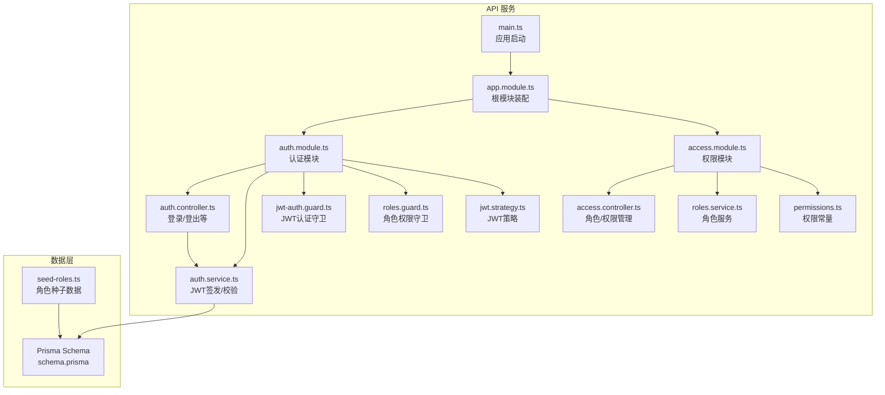
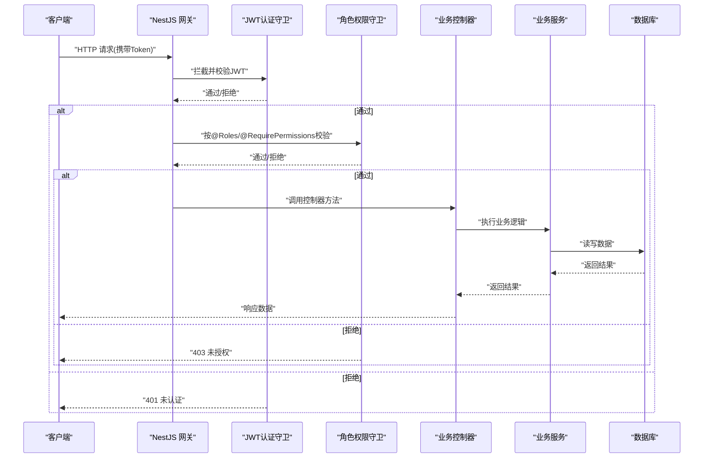
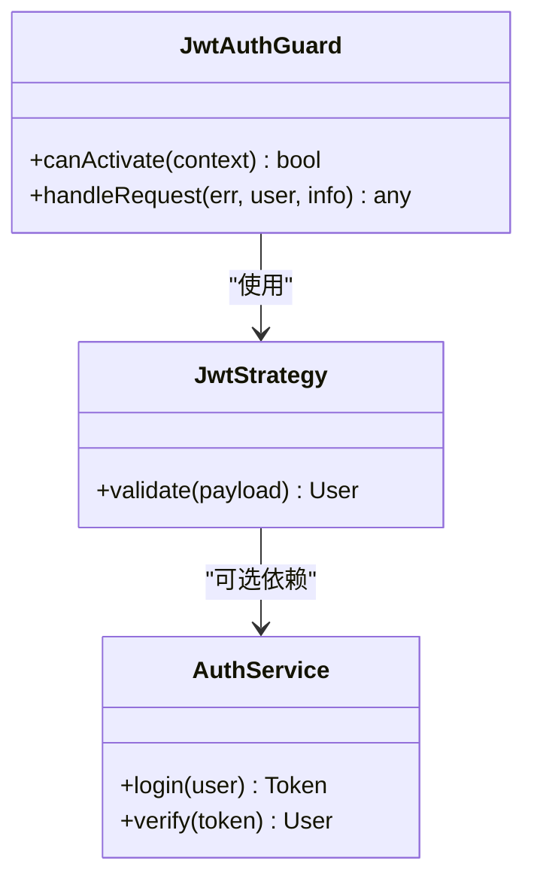
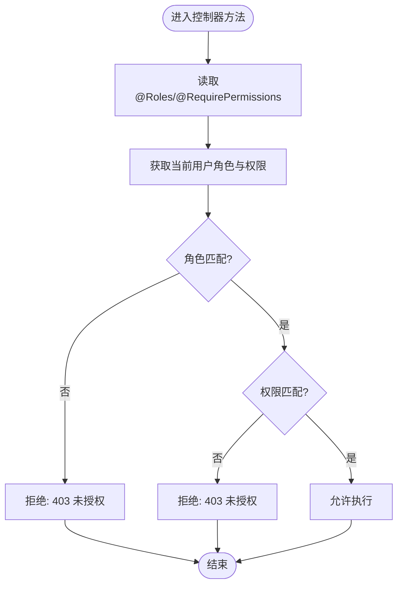
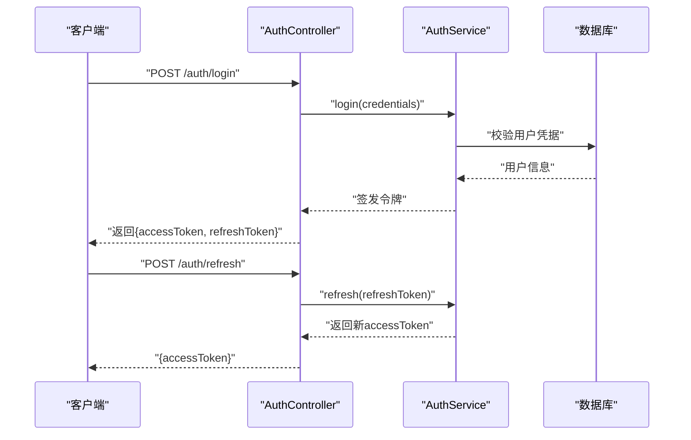
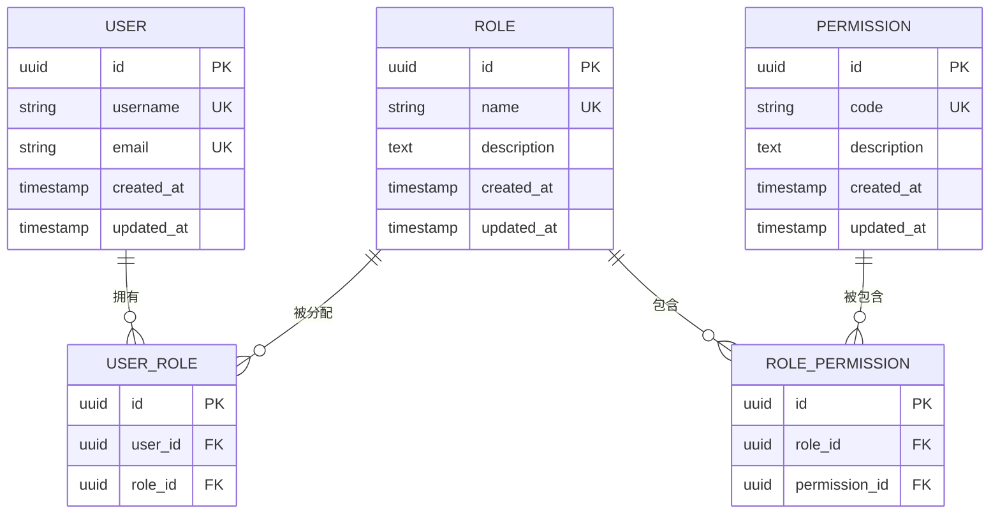
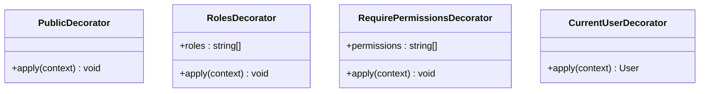
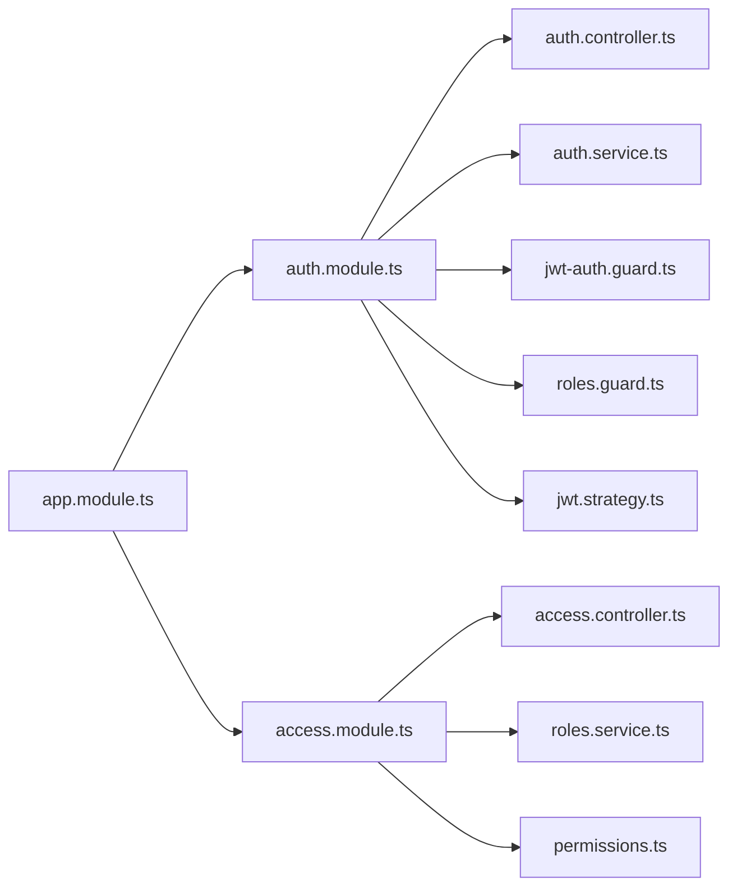

# 访问控制系统

<cite>
**本文引用的文件**   
- [jwt-auth.guard.ts](file://apps/api/src/auth/guards/jwt-auth.guard.ts)
- [roles.guard.ts](file://apps/api/src/auth/guards/roles.guard.ts)
- [jwt.strategy.ts](file://apps/api/src/auth/strategies/jwt.strategy.ts)
- [auth.controller.ts](file://apps/api/src/auth/auth.controller.ts)
- [auth.service.ts](file://apps/api/src/auth/auth.service.ts)
- [current-user.decorator.ts](file://apps/api/src/auth/decorators/current-user.decorator.ts)
- [public.decorator.ts](file://apps/api/src/auth/decorators/public.decorator.ts)
- [require-permissions.decorator.ts](file://apps/api/src/auth/decorators/require-permissions.decorator.ts)
- [roles.decorator.ts](file://apps/api/src/auth/decorators/roles.decorator.ts)
- [permissions.ts](file://apps/api/src/access/permissions.ts)
- [roles.service.ts](file://apps/api/src/access/roles.service.ts)
- [access.controller.ts](file://apps/api/src/access/access.controller.ts)
- [access.module.ts](file://apps/api/src/access/access.module.ts)
- [auth.module.ts](file://apps/api/src/auth/auth.module.ts)
- [app.module.ts](file://apps/api/src/app.module.ts)
- [main.ts](file://apps/api/src/main.ts)
- [schema.prisma](file://apps/api/prisma/schema.prisma)
- [seed-roles.ts](file://apps/api/scripts/seed-roles.ts)
</cite>

## 目录
1. [简介](#简介)
2. [项目结构](#项目结构)
3. [核心组件](#核心组件)
4. [架构总览](#架构总览)
5. [详细组件分析](#详细组件分析)
6. [依赖关系分析](#依赖关系分析)
7. [性能考量](#性能考量)
8. [故障排查指南](#故障排查指南)
9. [结论](#结论)
10. [附录](#附录)

## 简介
本文件面向访问控制系统的实现与使用，重点覆盖：
- JWT 认证守卫、角色权限守卫与装饰器机制的实现原理
- 基于角色的访问控制（RBAC）模型、权限验证流程与会话管理
- 自定义守卫开发指南、权限配置方法与最佳实践
- 权限控制的实际使用示例与常见问题解决方案

该系统采用 NestJS 框架，结合 Prisma 数据模型与脚本初始化，提供从登录鉴权到细粒度权限控制的一体化方案。

## 项目结构
访问控制相关代码主要位于后端 API 应用（apps/api）的 auth 与 access 模块中，并通过全局中间件与模块装配进行集成。前端（apps/admin）通过 BFF 或直连 API 调用受保护接口，并在客户端侧配合会话与令牌刷新逻辑。

图表来源
- [main.ts](file://apps/api/src/main.ts)
- [app.module.ts](file://apps/api/src/app.module.ts)
- [auth.module.ts](file://apps/api/src/auth/auth.module.ts)
- [auth.controller.ts](file://apps/api/src/auth/auth.controller.ts)
- [auth.service.ts](file://apps/api/src/auth/auth.service.ts)
- [jwt-auth.guard.ts](file://apps/api/src/auth/guards/jwt-auth.guard.ts)
- [roles.guard.ts](file://apps/api/src/auth/guards/roles.guard.ts)
- [jwt.strategy.ts](file://apps/api/src/auth/strategies/jwt.strategy.ts)
- [access.module.ts](file://apps/api/src/access/access.module.ts)
- [access.controller.ts](file://apps/api/src/access/access.controller.ts)
- [roles.service.ts](file://apps/api/src/access/roles.service.ts)
- [permissions.ts](file://apps/api/src/access/permissions.ts)
- [schema.prisma](file://apps/api/prisma/schema.prisma)
- [seed-roles.ts](file://apps/api/scripts/seed-roles.ts)

章节来源
- [main.ts](file://apps/api/src/main.ts)
- [app.module.ts](file://apps/api/src/app.module.ts)
- [auth.module.ts](file://apps/api/src/auth/auth.module.ts)
- [access.module.ts](file://apps/api/src/access/access.module.ts)

## 核心组件
- JWT 认证守卫：负责解析请求中的令牌，校验签名与有效期，并将用户上下文注入到请求对象。
- 角色权限守卫：在控制器方法执行前检查当前用户的角色是否满足所需权限。
- 装饰器：
  - @Public：标记公开接口，跳过认证守卫。
  - @Roles：声明方法所需的角色集合。
  - @RequirePermissions：声明方法所需的权限码集合。
  - @CurrentUser：注入当前已认证用户信息。
- 认证控制器与服务：处理登录、令牌签发、刷新与注销等流程。
- 权限与角色服务：提供角色与权限的查询、分配与管理能力。
- 数据模型与种子：通过 Prisma 定义用户、角色、权限等实体，并提供初始数据。

章节来源
- [jwt-auth.guard.ts](file://apps/api/src/auth/guards/jwt-auth.guard.ts)
- [roles.guard.ts](file://apps/api/src/auth/guards/roles.guard.ts)
- [current-user.decorator.ts](file://apps/api/src/auth/decorators/current-user.decorator.ts)
- [public.decorator.ts](file://apps/api/src/auth/decorators/public.decorator.ts)
- [require-permissions.decorator.ts](file://apps/api/src/auth/decorators/require-permissions.decorator.ts)
- [roles.decorator.ts](file://apps/api/src/auth/decorators/roles.decorator.ts)
- [auth.controller.ts](file://apps/api/src/auth/auth.controller.ts)
- [auth.service.ts](file://apps/api/src/auth/auth.service.ts)
- [roles.service.ts](file://apps/api/src/access/roles.service.ts)
- [permissions.ts](file://apps/api/src/access/permissions.ts)
- [schema.prisma](file://apps/api/prisma/schema.prisma)

## 架构总览
下图展示了从请求进入、JWT 校验、角色/权限校验到业务处理的完整链路。

图表来源
- [jwt-auth.guard.ts](file://apps/api/src/auth/guards/jwt-auth.guard.ts)
- [roles.guard.ts](file://apps/api/src/auth/guards/roles.guard.ts)
- [auth.controller.ts](file://apps/api/src/auth/auth.controller.ts)
- [auth.service.ts](file://apps/api/src/auth/auth.service.ts)
- [schema.prisma](file://apps/api/prisma/schema.prisma)

## 详细组件分析

### JWT 认证守卫与策略
- 职责：从请求头提取 Token，调用策略进行解析与校验，将用户信息挂载到请求上下文，供后续守卫与控制器使用。
- 关键点：
  - 策略类负责具体的 JWT 解码与载荷映射。
  - 守卫统一拦截并复用策略，保证一致的认证行为。
  - 失败时抛出标准异常，便于全局过滤器统一处理。

图表来源
- [jwt.strategy.ts](file://apps/api/src/auth/strategies/jwt.strategy.ts)
- [jwt-auth.guard.ts](file://apps/api/src/auth/guards/jwt-auth.guard.ts)
- [auth.service.ts](file://apps/api/src/auth/auth.service.ts)

章节来源
- [jwt.strategy.ts](file://apps/api/src/auth/strategies/jwt.strategy.ts)
- [jwt-auth.guard.ts](file://apps/api/src/auth/guards/jwt-auth.guard.ts)
- [auth.service.ts](file://apps/api/src/auth/auth.service.ts)

### 角色权限守卫与装饰器
- 职责：在控制器方法执行前，根据装饰器声明的角色与权限进行检查。
- 关键点：
  - @Roles 声明所需角色集合。
  - @RequirePermissions 声明所需权限码集合。
  - roles.guard 读取当前用户角色与权限，进行匹配判断。
  - 不通过时返回 403 未授权。

图表来源
- [roles.guard.ts](file://apps/api/src/auth/guards/roles.guard.ts)
- [roles.decorator.ts](file://apps/api/src/auth/decorators/roles.decorator.ts)
- [require-permissions.decorator.ts](file://apps/api/src/auth/decorators/require-permissions.decorator.ts)

章节来源
- [roles.guard.ts](file://apps/api/src/auth/guards/roles.guard.ts)
- [roles.decorator.ts](file://apps/api/src/auth/decorators/roles.decorator.ts)
- [require-permissions.decorator.ts](file://apps/api/src/auth/decorators/require-permissions.decorator.ts)

### 认证控制器与服务
- 职责：处理登录、令牌签发、刷新、注销等操作；维护会话状态与令牌生命周期。
- 关键点：
  - 登录成功后签发短期访问令牌与可刷新令牌。
  - 支持令牌刷新以延长会话。
  - 登出时使旧令牌失效（如加入黑名单或撤销）。

图表来源
- [auth.controller.ts](file://apps/api/src/auth/auth.controller.ts)
- [auth.service.ts](file://apps/api/src/auth/auth.service.ts)
- [schema.prisma](file://apps/api/prisma/schema.prisma)

章节来源
- [auth.controller.ts](file://apps/api/src/auth/auth.controller.ts)
- [auth.service.ts](file://apps/api/src/auth/auth.service.ts)

### 权限与角色服务
- 职责：提供角色与权限的查询、分配与管理能力，支撑 RBAC 模型。
- 关键点：
  - 角色与权限的关联关系由数据模型定义。
  - 服务封装对角色的增删改查与权限分配。
  - 权限常量集中管理，便于前后端一致。

图表来源
- [schema.prisma](file://apps/api/prisma/schema.prisma)
- [roles.service.ts](file://apps/api/src/access/roles.service.ts)
- [permissions.ts](file://apps/api/src/access/permissions.ts)

章节来源
- [roles.service.ts](file://apps/api/src/access/roles.service.ts)
- [permissions.ts](file://apps/api/src/access/permissions.ts)
- [schema.prisma](file://apps/api/prisma/schema.prisma)

### 装饰器机制详解
- @Public：用于标注无需认证的接口，通常用于登录、注册、健康检查等。
- @Roles：声明方法所需角色，例如管理员、编辑者等。
- @RequirePermissions：声明方法所需权限码，例如“文档:编辑”、“客户:删除”。
- @CurrentUser：注入当前已认证用户对象，避免重复解析。

图表来源
- [public.decorator.ts](file://apps/api/src/auth/decorators/public.decorator.ts)
- [roles.decorator.ts](file://apps/api/src/auth/decorators/roles.decorator.ts)
- [require-permissions.decorator.ts](file://apps/api/src/auth/decorators/require-permissions.decorator.ts)
- [current-user.decorator.ts](file://apps/api/src/auth/decorators/current-user.decorator.ts)

章节来源
- [public.decorator.ts](file://apps/api/src/auth/decorators/public.decorator.ts)
- [roles.decorator.ts](file://apps/api/src/auth/decorators/roles.decorator.ts)
- [require-permissions.decorator.ts](file://apps/api/src/auth/decorators/require-permissions.decorator.ts)
- [current-user.decorator.ts](file://apps/api/src/auth/decorators/current-user.decorator.ts)

### 权限配置与种子数据
- 权限常量：集中定义系统可用权限码，确保前后端一致性。
- 种子脚本：在初始化时创建默认角色与权限，便于开发与演示环境快速运行。

章节来源
- [permissions.ts](file://apps/api/src/access/permissions.ts)
- [seed-roles.ts](file://apps/api/scripts/seed-roles.ts)

## 依赖关系分析
- 模块装配：根模块引入认证与权限模块，使其在全局生效。
- 守卫与策略：认证模块内装配 JWT 策略与认证守卫，权限模块装配角色守卫。
- 控制器与服务：认证控制器依赖认证服务；权限控制器依赖角色服务。
- 数据层：所有持久化操作通过 Prisma 服务访问数据库。

图表来源
- [app.module.ts](file://apps/api/src/app.module.ts)
- [auth.module.ts](file://apps/api/src/auth/auth.module.ts)
- [access.module.ts](file://apps/api/src/access/access.module.ts)
- [auth.controller.ts](file://apps/api/src/auth/auth.controller.ts)
- [auth.service.ts](file://apps/api/src/auth/auth.service.ts)
- [jwt-auth.guard.ts](file://apps/api/src/auth/guards/jwt-auth.guard.ts)
- [roles.guard.ts](file://apps/api/src/auth/guards/roles.guard.ts)
- [jwt.strategy.ts](file://apps/api/src/auth/strategies/jwt.strategy.ts)
- [access.controller.ts](file://apps/api/src/access/access.controller.ts)
- [roles.service.ts](file://apps/api/src/access/roles.service.ts)
- [permissions.ts](file://apps/api/src/access/permissions.ts)

章节来源
- [app.module.ts](file://apps/api/src/app.module.ts)
- [auth.module.ts](file://apps/api/src/auth/auth.module.ts)
- [access.module.ts](file://apps/api/src/access/access.module.ts)

## 性能考量
- 令牌校验开销：JWT 无状态校验成本低，但需避免频繁解析大载荷；建议仅携带必要用户标识。
- 缓存策略：角色与权限查询可考虑 Redis 缓存，减少数据库压力。
- 批量加载：用户角色与权限尽量一次性加载，避免 N+1 查询。
- 超时与重试：网络与数据库调用设置合理超时与重试策略，提升稳定性。
- 日志与监控：记录鉴权失败与慢查询，便于定位问题。

## 故障排查指南
- 401 未认证：
  - 检查请求头是否携带有效 Token。
  - 确认 JWT 策略配置与密钥一致。
  - 查看全局异常过滤器输出。
- 403 未授权：
  - 检查控制器是否声明了 @Roles 或 @RequirePermissions。
  - 确认当前用户角色与权限是否满足要求。
  - 核对权限常量与数据库中的权限码是否一致。
- 登录失败：
  - 校验用户名/密码是否正确。
  - 检查用户状态与锁定策略。
- 令牌刷新失败：
  - 确认 refresh token 是否过期或被撤销。
  - 检查刷新接口路径与参数。

章节来源
- [jwt-auth.guard.ts](file://apps/api/src/auth/guards/jwt-auth.guard.ts)
- [roles.guard.ts](file://apps/api/src/auth/guards/roles.guard.ts)
- [auth.controller.ts](file://apps/api/src/auth/auth.controller.ts)
- [auth.service.ts](file://apps/api/src/auth/auth.service.ts)

## 结论
本访问控制系统以 JWT 为核心，结合角色与权限守卫以及装饰器机制，实现了灵活且可扩展的 RBAC 模型。通过集中化的权限常量与种子数据，保证了前后端一致性与环境快速初始化。建议在项目中遵循最小权限原则，持续优化查询与缓存策略，并完善日志与监控，以提升安全性与可维护性。

## 附录

### 自定义守卫开发指南
- 步骤：
  - 新建守卫类，实现 canActivate 方法。
  - 在方法中解析请求上下文，执行自定义校验逻辑。
  - 通过或拒绝请求，必要时抛出标准异常。
  - 在控制器或模块级别启用守卫。
- 示例场景：
  - IP 白名单守卫：限制特定来源访问。
  - 资源归属守卫：校验用户对资源的拥有关系。
  - 动态权限守卫：结合外部系统实时校验权限。

### 权限配置方法
- 权限常量：在权限常量文件中统一定义权限码，避免硬编码。
- 角色分配：通过角色服务为不同用户分配角色与权限。
- 接口保护：在控制器方法上使用 @Roles 与 @RequirePermissions 声明所需权限。
- 公开接口：使用 @Public 标注无需认证的接口。

### 安全最佳实践
- 令牌安全：
  - 使用强随机密钥与合适的算法。
  - 设置合理的过期时间，短效访问令牌与长效刷新令牌分离。
  - 服务端存储敏感信息，避免泄露。
- 输入校验：对所有入参进行严格校验与清理。
- 错误处理：统一异常过滤器，避免泄露敏感信息。
- 审计与日志：记录关键操作与鉴权事件，便于追踪与审计。
- 最小权限：默认拒绝，按需授予最小权限。

### 权限控制使用示例
- 登录与令牌刷新：
  - 调用登录接口获取访问令牌与刷新令牌。
  - 在后续请求中携带访问令牌。
  - 使用刷新接口续期访问令牌。
- 受保护接口调用：
  - 在控制器方法上添加 @Roles 或 @RequirePermissions。
  - 使用 @CurrentUser 获取当前用户信息。
- 角色与权限管理：
  - 通过权限控制器创建角色、分配权限。
  - 为用户分配角色以实现权限继承。

章节来源
- [auth.controller.ts](file://apps/api/src/auth/auth.controller.ts)
- [auth.service.ts](file://apps/api/src/auth/auth.service.ts)
- [roles.guard.ts](file://apps/api/src/auth/guards/roles.guard.ts)
- [roles.decorator.ts](file://apps/api/src/auth/decorators/roles.decorator.ts)
- [require-permissions.decorator.ts](file://apps/api/src/auth/decorators/require-permissions.decorator.ts)
- [current-user.decorator.ts](file://apps/api/src/auth/decorators/current-user.decorator.ts)
- [permissions.ts](file://apps/api/src/access/permissions.ts)
- [roles.service.ts](file://apps/api/src/access/roles.service.ts)
- [access.controller.ts](file://apps/api/src/access/access.controller.ts)