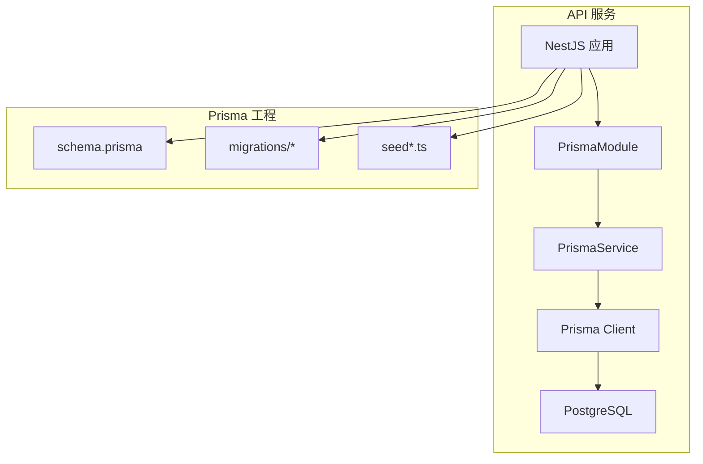
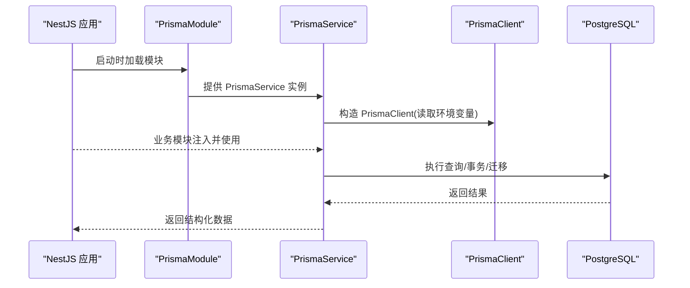
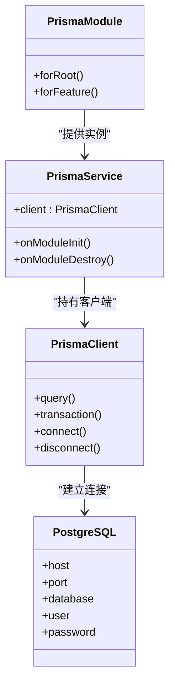

# 数据库设计与模型

<cite>
**本文引用的文件**
- [schema.prisma](file://apps/api/prisma/schema.prisma)
- [migration_lock.toml](file://apps/api/prisma/migrations/migration_lock.toml)
- [0_init/migration.sql](file://apps/api/prisma/migrations/0_init/migration.sql)
- [20260723110621_add_device_details/migration.sql](file://apps/api/prisma/migrations/20260723110621_add_device_details/migration.sql)
- [20260723120000_add_contact_visitor_id/migration.sql](file://apps/api/prisma/migrations/20260723120000_add_contact_visitor_id/migration.sql)
- [20260724122950_customer_visitor_id/migration.sql](file://apps/api/prisma/migrations/20260724122950_customer_visitor_id/migration.sql)
- [seed.ts](file://apps/api/prisma/seed.ts)
- [seed-content.ts](file://apps/api/prisma/seed-content.ts)
- [seed-content-media.ts](file://apps/api/prisma/seed-content-media.ts)
- [prisma.service.ts](file://apps/api/src/prisma/prisma.service.ts)
- [prisma.module.ts](file://apps/api/src/prisma/prisma.module.ts)
- [env.validation.ts](file://apps/api/src/config/env.validation.ts)
- [init.sql](file://infra/docker/postgres/init.sql)
</cite>

## 目录
1. [简介](#简介)
2. [项目结构](#项目结构)
3. [核心组件](#核心组件)
4. [架构总览](#架构总览)
5. [详细组件分析](#详细组件分析)
6. [依赖关系分析](#依赖关系分析)
7. [性能考虑](#性能考虑)
8. [故障排查指南](#故障排查指南)
9. [结论](#结论)
10. [附录](#附录)

## 简介
本文件面向数据库与数据模型，系统性梳理 Prisma ORM 配置、数据模型定义、关系映射与索引优化策略；并覆盖数据库迁移策略、种子数据生成、事务处理与连接池配置。同时给出查询优化、缓存策略与数据备份恢复建议，以及数据库设计原则与性能调优指南，帮助读者快速理解与高效使用本项目的数据层。

## 项目结构
与数据库相关的关键位置：
- Prisma 模型与迁移：apps/api/prisma
- NestJS 中 Prisma 模块与服务：apps/api/src/prisma
- 环境变量校验（含数据库连接）：apps/api/src/config/env.validation.ts
- 容器初始化脚本（PostgreSQL）：infra/docker/postgres/init.sql

图表来源
- [prisma.module.ts](file://apps/api/src/prisma/prisma.module.ts)
- [prisma.service.ts](file://apps/api/src/prisma/prisma.service.ts)
- [schema.prisma](file://apps/api/prisma/schema.prisma)

章节来源
- [schema.prisma](file://apps/api/prisma/schema.prisma)
- [prisma.service.ts](file://apps/api/src/prisma/prisma.service.ts)
- [prisma.module.ts](file://apps/api/src/prisma/prisma.module.ts)
- [env.validation.ts](file://apps/api/src/config/env.validation.ts)
- [init.sql](file://infra/docker/postgres/init.sql)

## 核心组件
- Prisma 模型定义：集中位于 schema.prisma，描述数据实体、字段类型、关系与索引。
- 迁移管理：migrations 目录下的 SQL 文件由 Prisma Migrate 生成与维护，确保数据库结构与代码一致。
- 种子数据：seed*.ts 用于初始化或填充测试/演示数据。
- Prisma 集成：通过 NestJS 的 PrismaModule 与 PrismaService 暴露 PrismaClient 实例，供业务模块注入使用。
- 环境配置：通过 env.validation.ts 校验数据库连接串等环境变量，保证运行时可用性。

章节来源
- [schema.prisma](file://apps/api/prisma/schema.prisma)
- [prisma.service.ts](file://apps/api/src/prisma/prisma.service.ts)
- [prisma.module.ts](file://apps/api/src/prisma/prisma.module.ts)
- [env.validation.ts](file://apps/api/src/config/env.validation.ts)

## 架构总览
下图展示从 API 请求到数据库访问的整体流程，包括 Prisma 模块装配、客户端创建与连接参数来源。

图表来源
- [prisma.module.ts](file://apps/api/src/prisma/prisma.module.ts)
- [prisma.service.ts](file://apps/api/src/prisma/prisma.service.ts)
- [env.validation.ts](file://apps/api/src/config/env.validation.ts)

## 详细组件分析

### Prisma ORM 配置与连接池
- 数据源与驱动：在 schema.prisma 中声明数据源 provider 与 URL，URL 通常来自环境变量，便于多环境部署。
- 连接池参数：可通过 Prisma 的连接参数（如连接数、超时、健康检查等）进行调优，建议在高频读写场景下根据负载调整。
- 事务支持：Prisma 原生支持事务，适合需要强一致性的批量写入或跨表更新。

章节来源
- [schema.prisma](file://apps/api/prisma/schema.prisma)
- [env.validation.ts](file://apps/api/src/config/env.validation.ts)

### 数据模型定义与关系映射
- 实体建模：在 schema.prisma 中定义模型、字段类型、默认值、唯一约束与关联关系（一对一、一对多、多对多）。
- 关系映射：通过外键字段与 relation 注解建立模型间关系，保持引用完整性与可读性。
- 命名规范：建议使用复数名词表示集合，字段名采用小写下划线风格，避免歧义。

章节来源
- [schema.prisma](file://apps/api/prisma/schema.prisma)

### 索引优化
- 复合索引：针对高频查询条件组合创建复合索引，提升过滤与排序性能。
- 唯一索引：对业务唯一字段（如邮箱、编码）设置唯一索引，保障数据一致性。
- 覆盖索引：尽量让查询仅命中索引列，减少回表开销。
- 索引维护：定期评估慢查询日志，结合 EXPLAIN 分析执行计划，持续优化索引。

章节来源
- [schema.prisma](file://apps/api/prisma/schema.prisma)

### 数据库迁移策略
- 版本化迁移：每个变更对应一个迁移目录与 SQL 文件，保证可追溯与可回滚。
- 基线迁移：首次部署可使用初始迁移构建基线，后续增量迁移逐步演进。
- 安全变更：避免破坏性变更（如删除列），优先采用新增列+数据迁移+废弃旧列的策略。
- 锁定机制：migration_lock.toml 记录迁移锁信息，防止并发冲突。

章节来源
- [0_init/migration.sql](file://apps/api/prisma/migrations/0_init/migration.sql)
- [20260723110621_add_device_details/migration.sql](file://apps/api/prisma/migrations/20260723110621_add_device_details/migration.sql)
- [20260723120000_add_contact_visitor_id/migration.sql](file://apps/api/prisma/migrations/20260723120000_add_contact_visitor_id/migration.sql)
- [20260724122950_customer_visitor_id/migration.sql](file://apps/api/prisma/migrations/20260724122950_customer_visitor_id/migration.sql)
- [migration_lock.toml](file://apps/api/prisma/migrations/migration_lock.toml)

### 种子数据生成
- 用途：为开发、测试与演示环境准备基础数据，如角色、站点设置、示例内容等。
- 模块化：按功能域拆分 seed 脚本，便于按需执行与维护。
- 幂等性：种子脚本应具备幂等能力，重复执行不产生副作用。

章节来源
- [seed.ts](file://apps/api/prisma/seed.ts)
- [seed-content.ts](file://apps/api/prisma/seed-content.ts)
- [seed-content-media.ts](file://apps/api/prisma/seed-content-media.ts)

### 事务处理
- 适用场景：跨表写入、批量更新、补偿操作等需要原子性的业务。
- 最佳实践：最小化事务范围，避免长事务；失败时及时回滚并记录审计日志。
- 嵌套事务：谨慎使用，必要时通过保存点实现局部回滚。

章节来源
- [schema.prisma](file://apps/api/prisma/schema.prisma)

### 连接池配置
- 连接数：根据 CPU 核数与数据库承载能力设定最大连接数，避免过多连接导致上下文切换开销。
- 超时与重试：合理设置连接超时、查询超时与重试策略，提高鲁棒性。
- 监控与健康检查：启用连接池指标与健康检查，及时发现连接泄漏与瓶颈。

章节来源
- [env.validation.ts](file://apps/api/src/config/env.validation.ts)
- [schema.prisma](file://apps/api/prisma/schema.prisma)

### 查询优化
- 选择必要字段：只查询所需字段，减少网络传输与序列化开销。
- 分页与游标：大数据集使用分页或基于游标的分页，避免全表扫描。
- 预加载关联：合理使用 include 或 join 策略，避免 N+1 问题。
- 统计与聚合：将复杂聚合下沉至数据库侧，利用索引与物化视图加速。

章节来源
- [schema.prisma](file://apps/api/prisma/schema.prisma)

### 缓存策略
- 读多写少场景：对热点数据引入缓存（如 Redis），降低数据库压力。
- 缓存失效：采用 TTL 与事件驱动的失效策略，保证数据一致性。
- 缓存穿透与雪崩：增加空值缓存与随机过期时间，避免击穿与雪崩。

章节来源
- [env.validation.ts](file://apps/api/src/config/env.validation.ts)

### 数据备份与恢复
- 定期备份：制定全量与增量备份策略，保留足够历史版本。
- 异地容灾：将备份存储于不同地域或对象存储，防范单点故障。
- 恢复演练：定期进行恢复演练，验证备份可用性与恢复时长。

章节来源
- [init.sql](file://infra/docker/postgres/init.sql)

## 依赖关系分析
Prisma 与 NestJS 的集成关系如下：

图表来源
- [prisma.module.ts](file://apps/api/src/prisma/prisma.module.ts)
- [prisma.service.ts](file://apps/api/src/prisma/prisma.service.ts)
- [schema.prisma](file://apps/api/prisma/schema.prisma)

章节来源
- [prisma.module.ts](file://apps/api/src/prisma/prisma.module.ts)
- [prisma.service.ts](file://apps/api/src/prisma/prisma.service.ts)

## 性能考虑
- 索引设计：围绕查询模式设计索引，避免过度索引影响写入性能。
- 连接池调优：依据负载曲线动态调整连接数与超时，避免资源争用。
- 查询瘦身：限制返回字段、使用分页与过滤，减少内存与带宽消耗。
- 读写分离：在高并发场景考虑主从复制与读写分离，提升吞吐。
- 监控告警：接入数据库慢查询、连接池与错误率监控，及时定位瓶颈。

## 故障排查指南
- 连接失败：检查环境变量中的数据库连接串、网络连通性与防火墙规则。
- 迁移冲突：核对 migration_lock 与本地迁移状态，必要时清理未提交迁移。
- 慢查询：开启慢查询日志，结合 EXPLAIN 分析执行计划，补充或调整索引。
- 事务死锁：缩短事务范围，统一加锁顺序，避免循环依赖。
- 种子失败：确认种子脚本幂等性与依赖数据存在，分步执行定位问题。

章节来源
- [env.validation.ts](file://apps/api/src/config/env.validation.ts)
- [migration_lock.toml](file://apps/api/prisma/migrations/migration_lock.toml)

## 结论
本项目以 Prisma 为核心，配合 NestJS 的模块化组织，实现了清晰的数据模型定义、严格的迁移管理与灵活的种子数据机制。通过合理的索引设计、连接池调优与查询优化，可在高并发场景下保持稳定与高性能。建议持续完善监控与备份策略，确保数据安全与系统韧性。

## 附录
- 数据库设计原则
  - 单一职责：每个模型聚焦一个业务概念，避免过度耦合。
  - 规范化与反规范化平衡：适度规范化保证一致性，关键路径可反规范化提升性能。
  - 可扩展性：预留扩展字段与枚举值空间，降低后期重构成本。
- 性能调优清单
  - 索引：覆盖常用过滤、排序与关联字段。
  - 连接池：根据 QPS 与延迟目标调整大小与超时。
  - 查询：分页、投影、预加载与聚合下沉。
  - 缓存：热点数据缓存与失效策略。
  - 备份：全量+增量，异地容灾与恢复演练。