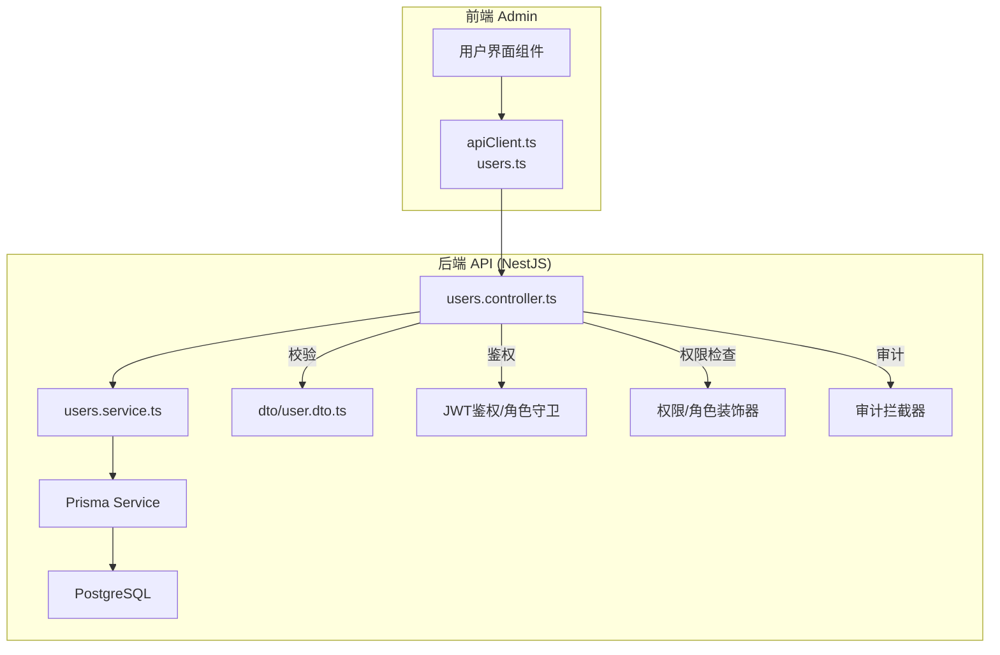
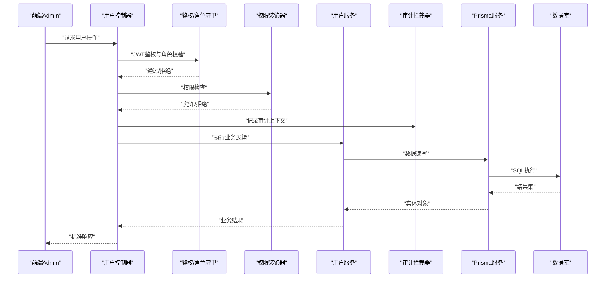
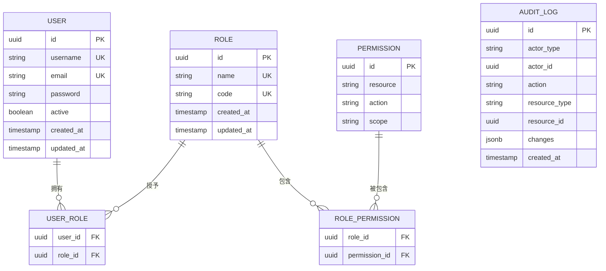
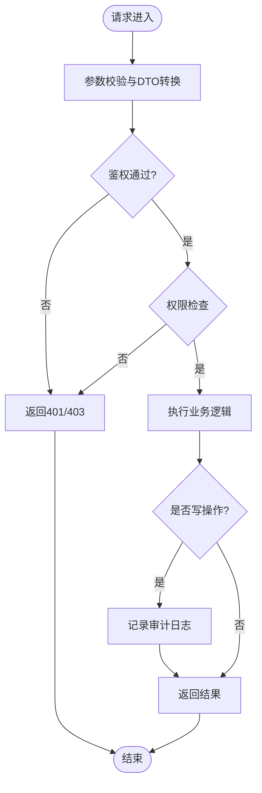
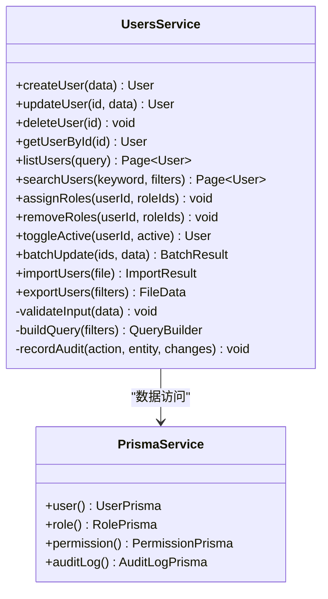
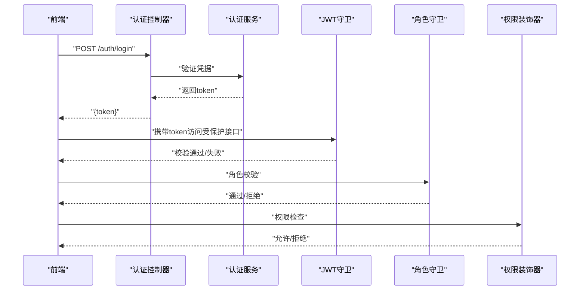
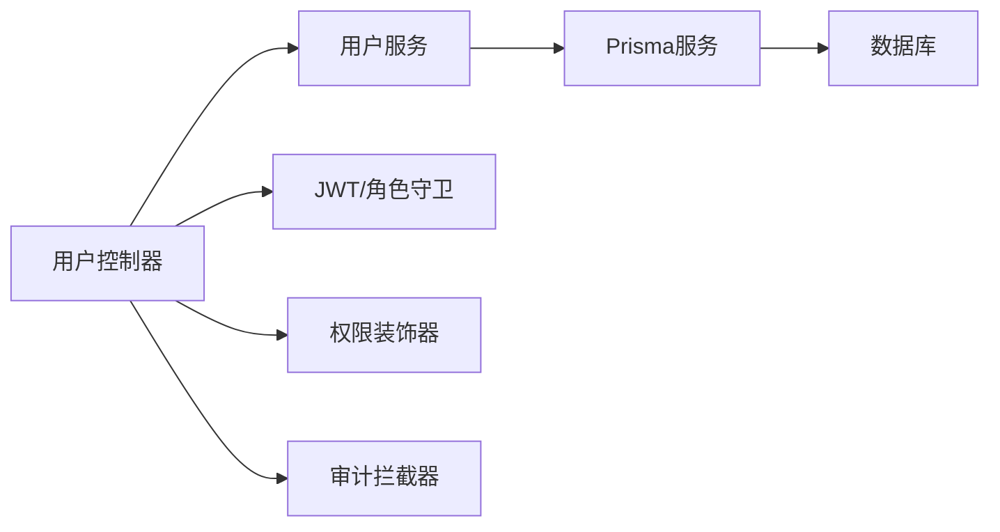

# 用户管理系统

<cite>
**本文档引用的文件**   
- [users.controller.ts](file://apps/api/src/users/users.controller.ts)
- [users.service.ts](file://apps/api/src/users/users.service.ts)
- [user.dto.ts](file://apps/api/src/users/dto/user.dto.ts)
- [users.module.ts](file://apps/api/src/users/users.module.ts)
- [schema.prisma](file://apps/api/prisma/schema.prisma)
- [audit.interceptor.ts](file://apps/api/src/common/interceptors/audit.interceptor.ts)
- [jwt-auth.guard.ts](file://apps/api/src/auth/guards/jwt-auth.guard.ts)
- [roles.guard.ts](file://apps/api/src/auth/guards/roles.guard.ts)
- [require-permissions.decorator.ts](file://apps/api/src/auth/decorators/require-permissions.decorator.ts)
- [roles.decorator.ts](file://apps/api/src/auth/decorators/roles.decorator.ts)
- [current-user.decorator.ts](file://apps/api/src/auth/decorators/current-user.decorator.ts)
- [auth.controller.ts](file://apps/api/src/auth/auth.controller.ts)
- [auth.service.ts](file://apps/api/src/auth/auth.service.ts)
- [permissions.ts](file://apps/api/src/access/permissions.ts)
- [roles.service.ts](file://apps/api/src/access/roles.service.ts)
- [access.controller.ts](file://apps/api/src/access/access.controller.ts)
- [audit.controller.ts](file://apps/api/src/audit/audit.controller.ts)
- [audit.service.ts](file://apps/api/src/audit/audit.service.ts)
- [apiClient.ts](file://apps/admin/src/lib/apiClient.ts)
- [users.ts](file://apps/admin/src/features/users.ts)
</cite>

## 目录
1. [简介](#简介)
2. [项目结构](#项目结构)
3. [核心组件](#核心组件)
4. [架构总览](#架构总览)
5. [详细组件分析](#详细组件分析)
6. [依赖关系分析](#依赖关系分析)
7. [性能考虑](#性能考虑)
8. [故障排查指南](#故障排查指南)
9. [结论](#结论)
10. [附录：API接口与集成示例](#附录api接口与集成示例)

## 简介
本文件面向“用户管理系统”的完整实现，覆盖用户CRUD、角色分配、权限管理、用户状态控制、搜索与批量操作、导入导出以及审计日志记录。文档从系统架构、数据模型、DTO验证、业务逻辑、数据库操作到API接口与前端集成进行系统化说明，帮助开发者快速理解并扩展该模块。

## 项目结构
用户管理功能位于后端 NestJS 应用（apps/api）与前端管理端（apps/admin）中：
- 后端：控制器、服务、DTO、鉴权守卫与装饰器、审计拦截器、Prisma 数据模型
- 前端：API客户端封装、用户特性模块、页面与组件调用

图表来源
- [users.controller.ts](file://apps/api/src/users/users.controller.ts)
- [users.service.ts](file://apps/api/src/users/users.service.ts)
- [user.dto.ts](file://apps/api/src/users/dto/user.dto.ts)
- [jwt-auth.guard.ts](file://apps/api/src/auth/guards/jwt-auth.guard.ts)
- [roles.guard.ts](file://apps/api/src/auth/guards/roles.guard.ts)
- [audit.interceptor.ts](file://apps/api/src/common/interceptors/audit.interceptor.ts)
- [schema.prisma](file://apps/api/prisma/schema.prisma)

章节来源
- [users.controller.ts](file://apps/api/src/users/users.controller.ts)
- [users.service.ts](file://apps/api/src/users/users.service.ts)
- [user.dto.ts](file://apps/api/src/users/dto/user.dto.ts)
- [users.module.ts](file://apps/api/src/users/users.module.ts)
- [schema.prisma](file://apps/api/prisma/schema.prisma)

## 核心组件
- 控制器层：暴露用户相关REST接口，处理请求参数校验、权限与角色校验、响应格式化与审计记录。
- 服务层：封装用户业务逻辑，包括创建、更新、删除、查询、搜索、批量操作、导入导出、状态切换、角色与权限关联等。
- DTO与验证：定义输入输出数据结构与校验规则，确保数据一致性。
- 鉴权与授权：基于JWT的认证与基于角色的访问控制（RBAC），支持细粒度权限检查。
- 审计日志：通过拦截器统一记录关键操作的审计信息。
- 数据模型：使用 Prisma 定义用户、角色、权限及关联关系。

章节来源
- [users.controller.ts](file://apps/api/src/users/users.controller.ts)
- [users.service.ts](file://apps/api/src/users/users.service.ts)
- [user.dto.ts](file://apps/api/src/users/dto/user.dto.ts)
- [jwt-auth.guard.ts](file://apps/api/src/auth/guards/jwt-auth.guard.ts)
- [roles.guard.ts](file://apps/api/src/auth/guards/roles.guard.ts)
- [audit.interceptor.ts](file://apps/api/src/common/interceptors/audit.interceptor.ts)
- [schema.prisma](file://apps/api/prisma/schema.prisma)

## 架构总览
用户管理采用分层架构：
- 表现层（Controller）：接收HTTP请求，参数校验，调用Service，返回标准化响应。
- 业务层（Service）：实现用户领域逻辑，协调数据访问与外部服务。
- 数据访问层（Prisma）：ORM抽象数据库操作，提供类型安全的数据模型。
- 横切关注点：鉴权（Guards）、授权（Decorators/Guards）、审计（Interceptors）。

图表来源
- [users.controller.ts](file://apps/api/src/users/users.controller.ts)
- [users.service.ts](file://apps/api/src/users/users.service.ts)
- [jwt-auth.guard.ts](file://apps/api/src/auth/guards/jwt-auth.guard.ts)
- [roles.guard.ts](file://apps/api/src/auth/guards/roles.guard.ts)
- [require-permissions.decorator.ts](file://apps/api/src/auth/decorators/require-permissions.decorator.ts)
- [audit.interceptor.ts](file://apps/api/src/common/interceptors/audit.interceptor.ts)
- [schema.prisma](file://apps/api/prisma/schema.prisma)

## 详细组件分析

### 用户数据模型与关系
- 用户实体包含基础身份信息、状态字段、时间戳等。
- 角色与权限采用多对多或一对多关系，支持用户-角色-权限的灵活组合。
- 审计日志独立表记录操作主体、动作、资源、变更前后值、时间等。

图表来源
- [schema.prisma](file://apps/api/prisma/schema.prisma)

章节来源
- [schema.prisma](file://apps/api/prisma/schema.prisma)

### DTO与验证规则
- 用户创建/更新DTO：用户名、邮箱、密码、状态、角色ID列表等字段校验（必填、格式、唯一性）。
- 查询DTO：分页、排序、过滤条件（如用户名模糊匹配、状态筛选）。
- 批量操作DTO：数组长度限制、元素校验。
- 导入导出DTO：文件格式、列映射、错误行收集。

章节来源
- [user.dto.ts](file://apps/api/src/users/dto/user.dto.ts)

### 控制器层：用户CRUD与搜索
- 列出用户：支持分页、排序、过滤；返回用户列表与元数据。
- 获取用户详情：按ID查询，包含角色与权限信息。
- 创建用户：校验输入，生成默认状态，写入审计日志。
- 更新用户：支持基本信息、状态、角色分配等更新。
- 删除用户：软删除或硬删除策略，记录审计日志。
- 搜索用户：关键词、状态、角色等多条件组合查询。
- 批量操作：批量启用/禁用、批量分配角色、批量删除等。
- 导入导出：CSV/Excel导入用户、导出用户清单。

图表来源
- [users.controller.ts](file://apps/api/src/users/users.controller.ts)
- [user.dto.ts](file://apps/api/src/users/dto/user.dto.ts)
- [jwt-auth.guard.ts](file://apps/api/src/auth/guards/jwt-auth.guard.ts)
- [roles.guard.ts](file://apps/api/src/auth/guards/roles.guard.ts)
- [require-permissions.decorator.ts](file://apps/api/src/auth/decorators/require-permissions.decorator.ts)
- [audit.interceptor.ts](file://apps/api/src/common/interceptors/audit.interceptor.ts)

章节来源
- [users.controller.ts](file://apps/api/src/users/users.controller.ts)
- [user.dto.ts](file://apps/api/src/users/dto/user.dto.ts)

### 服务层：业务逻辑与数据库操作
- 用户生命周期管理：创建、更新、删除、状态切换（激活/禁用）。
- 角色与权限管理：为用户分配/移除角色，计算最终权限集合。
- 搜索与过滤：构建动态查询条件，支持分页与排序。
- 批量操作：事务性批量更新，失败回滚与部分成功处理。
- 导入导出：解析文件、数据清洗、批量入库、错误报告。
- 审计日志：记录操作人、动作、资源、变更差异。

图表来源
- [users.service.ts](file://apps/api/src/users/users.service.ts)
- [schema.prisma](file://apps/api/prisma/schema.prisma)

章节来源
- [users.service.ts](file://apps/api/src/users/users.service.ts)

### 鉴权与授权
- JWT认证：登录成功后签发令牌，守卫校验令牌有效性。
- 角色守卫：根据用户角色决定接口访问权限。
- 权限装饰器：细粒度权限检查（资源+动作+作用域）。
- 当前用户注入：在控制器方法中注入当前登录用户上下文。

图表来源
- [auth.controller.ts](file://apps/api/src/auth/auth.controller.ts)
- [auth.service.ts](file://apps/api/src/auth/auth.service.ts)
- [jwt-auth.guard.ts](file://apps/api/src/auth/guards/jwt-auth.guard.ts)
- [roles.guard.ts](file://apps/api/src/auth/guards/roles.guard.ts)
- [require-permissions.decorator.ts](file://apps/api/src/auth/decorators/require-permissions.decorator.ts)
- [current-user.decorator.ts](file://apps/api/src/auth/decorators/current-user.decorator.ts)

章节来源
- [auth.controller.ts](file://apps/api/src/auth/auth.controller.ts)
- [auth.service.ts](file://apps/api/src/auth/auth.service.ts)
- [jwt-auth.guard.ts](file://apps/api/src/auth/guards/jwt-auth.guard.ts)
- [roles.guard.ts](file://apps/api/src/auth/guards/roles.guard.ts)
- [require-permissions.decorator.ts](file://apps/api/src/auth/decorators/require-permissions.decorator.ts)
- [current-user.decorator.ts](file://apps/api/src/auth/decorators/current-user.decorator.ts)

### 审计日志
- 拦截器自动捕获请求上下文、操作主体、动作、资源标识、变更差异。
- 支持按用户、时间范围、动作类型检索审计日志。
- 审计日志用于合规审查与安全分析。

章节来源
- [audit.interceptor.ts](file://apps/api/src/common/interceptors/audit.interceptor.ts)
- [audit.controller.ts](file://apps/api/src/audit/audit.controller.ts)
- [audit.service.ts](file://apps/api/src/audit/audit.service.ts)

### 角色与权限管理
- 角色定义：名称、代码、描述。
- 权限定义：资源、动作、作用域。
- 角色-权限关联：一个角色可包含多个权限。
- 用户-角色关联：一个用户可拥有多个角色。
- 权限计算：合并用户所有角色的权限集合。

章节来源
- [permissions.ts](file://apps/api/src/access/permissions.ts)
- [roles.service.ts](file://apps/api/src/access/roles.service.ts)
- [access.controller.ts](file://apps/api/src/access/access.controller.ts)

## 依赖关系分析
- 控制器依赖服务层完成业务逻辑。
- 服务层依赖Prisma进行数据访问。
- 鉴权与授权通过守卫与装饰器在控制器层生效。
- 审计拦截器贯穿所有写操作。

图表来源
- [users.controller.ts](file://apps/api/src/users/users.controller.ts)
- [users.service.ts](file://apps/api/src/users/users.service.ts)
- [jwt-auth.guard.ts](file://apps/api/src/auth/guards/jwt-auth.guard.ts)
- [roles.guard.ts](file://apps/api/src/auth/guards/roles.guard.ts)
- [require-permissions.decorator.ts](file://apps/api/src/auth/decorators/require-permissions.decorator.ts)
- [audit.interceptor.ts](file://apps/api/src/common/interceptors/audit.interceptor.ts)
- [schema.prisma](file://apps/api/prisma/schema.prisma)

章节来源
- [users.controller.ts](file://apps/api/src/users/users.controller.ts)
- [users.service.ts](file://apps/api/src/users/users.service.ts)
- [users.module.ts](file://apps/api/src/users/users.module.ts)

## 性能考虑
- 分页与索引：对用户列表查询添加合适索引，避免全表扫描。
- 批量操作：使用事务减少往返次数，提高吞吐。
- 导入导出：流式处理大文件，避免内存溢出。
- 缓存热点数据：如角色与权限集合，减少重复计算。
- 异步任务：将耗时导入导出放入队列异步执行。

[本节为通用指导，不直接分析具体文件]

## 故障排查指南
- 鉴权失败：检查JWT令牌有效期、签名配置、角色与权限分配。
- 权限不足：确认用户角色是否包含所需权限，检查装饰器参数。
- 数据校验错误：核对DTO字段约束与前端提交数据。
- 审计日志缺失：确认拦截器是否注册，写操作是否触发。
- 导入失败：查看错误行报告，修正数据格式。

章节来源
- [jwt-auth.guard.ts](file://apps/api/src/auth/guards/jwt-auth.guard.ts)
- [roles.guard.ts](file://apps/api/src/auth/guards/roles.guard.ts)
- [require-permissions.decorator.ts](file://apps/api/src/auth/decorators/require-permissions.decorator.ts)
- [audit.interceptor.ts](file://apps/api/src/common/interceptors/audit.interceptor.ts)

## 结论
用户管理系统以清晰的层次结构与完善的鉴权授权机制为核心，结合DTO验证、审计日志与批量导入导出能力，提供了完整的用户管理能力。通过合理的索引与事务优化，系统在可扩展性与性能方面具备良好基础。

[本节为总结，不直接分析具体文件]

## 附录：API接口与集成示例

### 用户接口概览
- 列出用户：GET /users，支持分页、排序、过滤
- 获取用户详情：GET /users/:id
- 创建用户：POST /users
- 更新用户：PUT /users/:id
- 删除用户：DELETE /users/:id
- 搜索用户：GET /users/search?keyword=&status=&role=
- 批量操作：POST /users/batch（启用/禁用、分配角色、删除）
- 导入用户：POST /users/import（CSV/Excel）
- 导出用户：GET /users/export?filters=...

章节来源
- [users.controller.ts](file://apps/api/src/users/users.controller.ts)
- [user.dto.ts](file://apps/api/src/users/dto/user.dto.ts)

### 认证与授权接口
- 登录：POST /auth/login
- 刷新令牌：POST /auth/refresh
- 获取当前用户：GET /auth/me

章节来源
- [auth.controller.ts](file://apps/api/src/auth/auth.controller.ts)
- [auth.service.ts](file://apps/api/src/auth/auth.service.ts)

### 角色与权限接口
- 列出角色：GET /access/roles
- 创建角色：POST /access/roles
- 更新角色：PUT /access/roles/:id
- 删除角色：DELETE /access/roles/:id
- 分配权限：PUT /access/roles/:id/permissions
- 列出权限：GET /access/permissions

章节来源
- [access.controller.ts](file://apps/api/src/access/access.controller.ts)
- [roles.service.ts](file://apps/api/src/access/roles.service.ts)
- [permissions.ts](file://apps/api/src/access/permissions.ts)

### 审计日志接口
- 列出审计日志：GET /audit/logs?actor=&action=&resource=&from=&to=
- 导出审计日志：GET /audit/logs/export

章节来源
- [audit.controller.ts](file://apps/api/src/audit/audit.controller.ts)
- [audit.service.ts](file://apps/api/src/audit/audit.service.ts)

### 前端集成示例
- 使用apiClient封装请求，统一处理鉴权头与错误。
- users.ts定义用户相关的API调用与类型。
- 页面组件调用API，渲染用户列表与编辑表单。

章节来源
- [apiClient.ts](file://apps/admin/src/lib/apiClient.ts)
- [users.ts](file://apps/admin/src/features/users.ts)