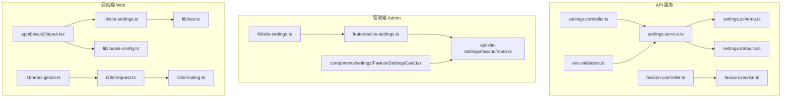
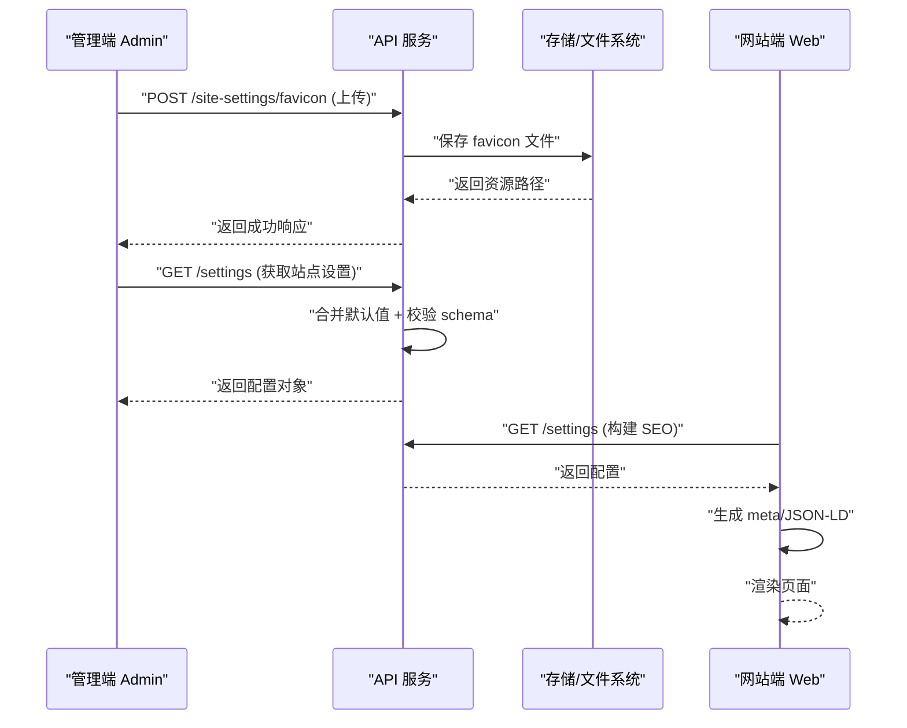
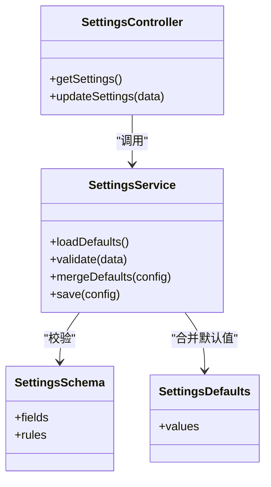
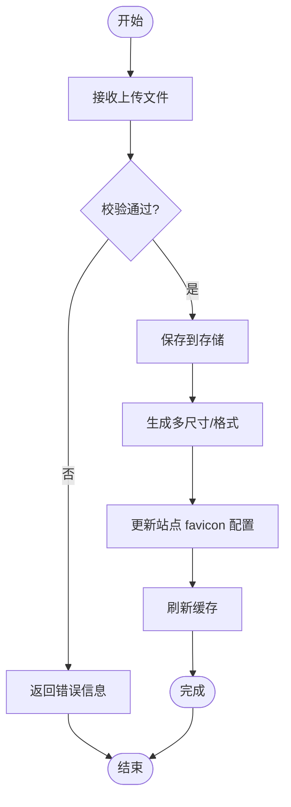
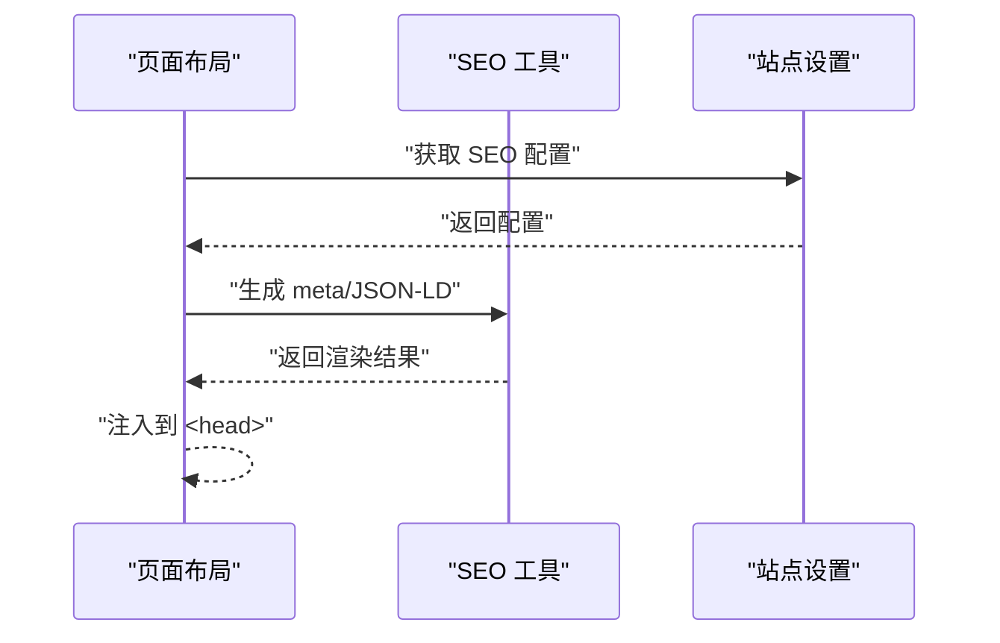
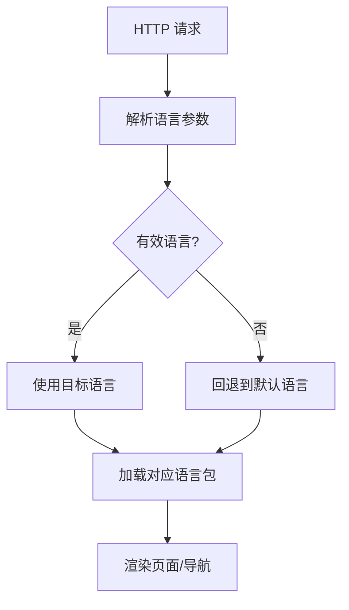
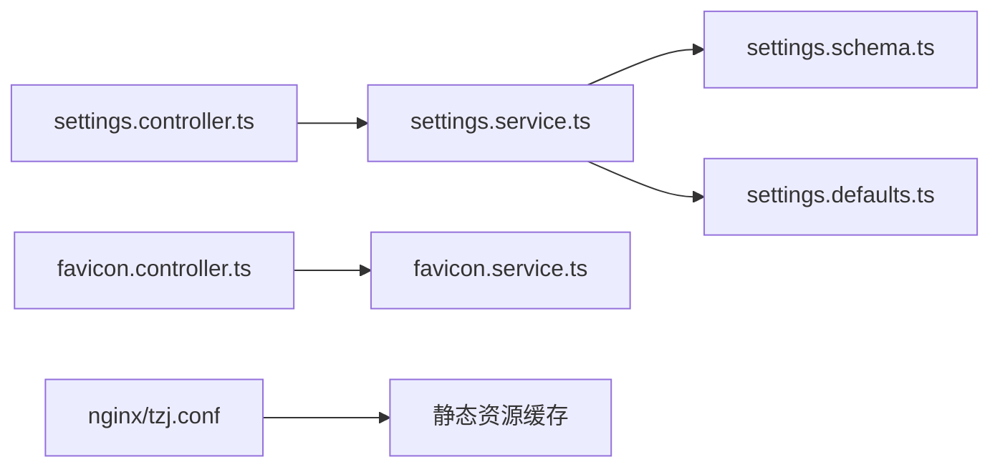

# 系统设置与配置

<cite>
**本文引用的文件**   
- [apps/admin/src/features/site-settings.ts](file://apps/admin/src/features/site-settings.ts)
- [apps/admin/src/lib/site-settings.ts](file://apps/admin/src/lib/site-settings.ts)
- [apps/admin/src/components/settings/FaviconSettingsCard.tsx](file://apps/admin/src/components/settings/FaviconSettingsCard.tsx)
- [apps/admin/src/api/site-settings/favicon/route.ts](file://apps/admin/src/api/site-settings/favicon/route.ts)
- [apps/web/src/lib/site-settings.ts](file://apps/web/src/lib/site-settings.ts)
- [apps/web/src/lib/seo.ts](file://apps/web/src/lib/seo.ts)
- [apps/web/src/app/[locale]/layout.tsx](file://apps/web/src/app/[locale]/layout.tsx)
- [apps/web/src/lib/locale-config.ts](file://apps/web/src/lib/locale-config.ts)
- [apps/web/src/i18n/navigation.ts](file://apps/web/src/i18n/navigation.ts)
- [apps/web/src/i18n/request.ts](file://apps/web/src/i18n/request.ts)
- [apps/web/src/i18n/routing.ts](file://apps/web/src/i18n/routing.ts)
- [apps/api/src/settings/settings.controller.ts](file://apps/api/src/settings/settings.controller.ts)
- [apps/api/src/settings/settings.service.ts](file://apps/api/src/settings/settings.service.ts)
- [apps/api/src/settings/settings.schema.ts](file://apps/api/src/settings/settings.schema.ts)
- [apps/api/src/settings/settings.defaults.ts](file://apps/api/src/settings/settings.defaults.ts)
- [apps/api/src/settings/settings-media.schema.ts](file://apps/api/src/settings/settings-media.schema.ts)
- [apps/api/src/settings/settings-notifications.schema.ts](file://apps/api/src/settings/settings-notifications.schema.ts)
- [apps/api/src/settings/settings-media.defaults.ts](file://apps/api/src/settings/settings-media.defaults.ts)
- [apps/api/src/settings/settings-notifications.defaults.ts](file://apps/api/src/settings/settings-notifications.defaults.ts)
- [apps/api/src/site-settings/favicon.controller.ts](file://apps/api/src/site-settings/favicon.controller.ts)
- [apps/api/src/site-settings/favicon.service.ts](file://apps/api/src/site-settings/favicon.service.ts)
- [apps/api/src/config/env.validation.ts](file://apps/api/src/config/env.validation.ts)
- [apps/api/scripts/test-favicon.ts](file://apps/api/scripts/test-favicon.ts)
- [apps/web/public/browser-support.js](file://apps/web/public/browser-support.js)
- [infra/docker/nginx/tzj.conf](file://infra/docker/nginx/tzj.conf)
- [infra/docker/nginx/templates/tzj.conf.template](file://infra/docker/nginx/templates/tzj.conf.template)
</cite>

## 目录
1. [简介](#简介)
2. [项目结构](#项目结构)
3. [核心组件](#核心组件)
4. [架构总览](#架构总览)
5. [详细组件分析](#详细组件分析)
6. [依赖关系分析](#依赖关系分析)
7. [性能考虑](#性能考虑)
8. [故障排查指南](#故障排查指南)
9. [结论](#结论)
10. [附录](#附录)

## 简介
本文件聚焦“系统设置与配置管理”，覆盖站点配置、主题设置、SEO 配置与 favicon 管理。文档从数据结构、验证规则、动态加载与缓存策略入手，结合多语言支持、环境变量管理与配置迁移工具，给出完整的配置 API 接口说明与自定义扩展指南，帮助读者快速理解并安全地扩展系统配置能力。

## 项目结构
系统设置与配置相关代码分布在三个应用层：
- 后端 API（NestJS）：负责配置的持久化、校验、默认值与迁移脚本。
- 管理端（Next.js Admin）：提供可视化配置界面与前端校验。
- 网站端（Next.js Web）：消费配置用于渲染 SEO、主题与国际化。

图表来源
- [apps/api/src/settings/settings.controller.ts](file://apps/api/src/settings/settings.controller.ts)
- [apps/api/src/settings/settings.service.ts](file://apps/api/src/settings/settings.service.ts)
- [apps/api/src/settings/settings.schema.ts](file://apps/api/src/settings/settings.schema.ts)
- [apps/api/src/settings/settings.defaults.ts](file://apps/api/src/settings/settings.defaults.ts)
- [apps/api/src/site-settings/favicon.controller.ts](file://apps/api/src/site-settings/favicon.controller.ts)
- [apps/api/src/site-settings/favicon.service.ts](file://apps/api/src/site-settings/favicon.service.ts)
- [apps/api/src/config/env.validation.ts](file://apps/api/src/config/env.validation.ts)
- [apps/admin/src/features/site-settings.ts](file://apps/admin/src/features/site-settings.ts)
- [apps/admin/src/lib/site-settings.ts](file://apps/admin/src/lib/site-settings.ts)
- [apps/admin/src/components/settings/FaviconSettingsCard.tsx](file://apps/admin/src/components/settings/FaviconSettingsCard.tsx)
- [apps/admin/src/api/site-settings/favicon/route.ts](file://apps/admin/src/api/site-settings/favicon/route.ts)
- [apps/web/src/lib/site-settings.ts](file://apps/web/src/lib/site-settings.ts)
- [apps/web/src/lib/seo.ts](file://apps/web/src/lib/seo.ts)
- [apps/web/src/app/[locale]/layout.tsx](file://apps/web/src/app/[locale]/layout.tsx)
- [apps/web/src/lib/locale-config.ts](file://apps/web/src/lib/locale-config.ts)
- [apps/web/src/i18n/navigation.ts](file://apps/web/src/i18n/navigation.ts)
- [apps/web/src/i18n/request.ts](file://apps/web/src/i18n/request.ts)
- [apps/web/src/i18n/routing.ts](file://apps/web/src/i18n/routing.ts)

章节来源
- [apps/api/src/settings/settings.controller.ts](file://apps/api/src/settings/settings.controller.ts)
- [apps/api/src/settings/settings.service.ts](file://apps/api/src/settings/settings.service.ts)
- [apps/api/src/settings/settings.schema.ts](file://apps/api/src/settings/settings.schema.ts)
- [apps/api/src/settings/settings.defaults.ts](file://apps/api/src/settings/settings.defaults.ts)
- [apps/api/src/site-settings/favicon.controller.ts](file://apps/api/src/site-settings/favicon.controller.ts)
- [apps/api/src/site-settings/favicon.service.ts](file://apps/api/src/site-settings/favicon.service.ts)
- [apps/api/src/config/env.validation.ts](file://apps/api/src/config/env.validation.ts)
- [apps/admin/src/features/site-settings.ts](file://apps/admin/src/features/site-settings.ts)
- [apps/admin/src/lib/site-settings.ts](file://apps/admin/src/lib/site-settings.ts)
- [apps/admin/src/components/settings/FaviconSettingsCard.tsx](file://apps/admin/src/components/settings/FaviconSettingsCard.tsx)
- [apps/admin/src/api/site-settings/favicon/route.ts](file://apps/admin/src/api/site-settings/favicon/route.ts)
- [apps/web/src/lib/site-settings.ts](file://apps/web/src/lib/site-settings.ts)
- [apps/web/src/lib/seo.ts](file://apps/web/src/lib/seo.ts)
- [apps/web/src/app/[locale]/layout.tsx](file://apps/web/src/app/[locale]/layout.tsx)
- [apps/web/src/lib/locale-config.ts](file://apps/web/src/lib/locale-config.ts)
- [apps/web/src/i18n/navigation.ts](file://apps/web/src/i18n/navigation.ts)
- [apps/web/src/i18n/request.ts](file://apps/web/src/i18n/request.ts)
- [apps/web/src/i18n/routing.ts](file://apps/web/src/i18n/routing.ts)

## 核心组件
- 站点设置控制器与服务：提供配置的读取、更新、校验与默认值合并。
- 设置数据模型与默认值：通过 schema 定义字段类型与约束，defaults 提供初始值。
- Favicon 管理：上传、预览、回退与浏览器兼容性处理。
- 前端配置消费：Admin 侧编辑与校验，Web 侧渲染 SEO 与主题。
- 多语言与路由：基于 Next.js i18n 的导航与请求解析。
- 环境变量校验：启动时校验关键配置项。

章节来源
- [apps/api/src/settings/settings.controller.ts](file://apps/api/src/settings/settings.controller.ts)
- [apps/api/src/settings/settings.service.ts](file://apps/api/src/settings/settings.service.ts)
- [apps/api/src/settings/settings.schema.ts](file://apps/api/src/settings/settings.schema.ts)
- [apps/api/src/settings/settings.defaults.ts](file://apps/api/src/settings/settings.defaults.ts)
- [apps/api/src/site-settings/favicon.controller.ts](file://apps/api/src/site-settings/favicon.controller.ts)
- [apps/api/src/site-settings/favicon.service.ts](file://apps/api/src/site-settings/favicon.service.ts)
- [apps/admin/src/features/site-settings.ts](file://apps/admin/src/features/site-settings.ts)
- [apps/admin/src/lib/site-settings.ts](file://apps/admin/src/lib/site-settings.ts)
- [apps/admin/src/components/settings/FaviconSettingsCard.tsx](file://apps/admin/src/components/settings/FaviconSettingsCard.tsx)
- [apps/admin/src/api/site-settings/favicon/route.ts](file://apps/admin/src/api/site-settings/favicon/route.ts)
- [apps/web/src/lib/site-settings.ts](file://apps/web/src/lib/site-settings.ts)
- [apps/web/src/lib/seo.ts](file://apps/web/src/lib/seo.ts)
- [apps/web/src/app/[locale]/layout.tsx](file://apps/web/src/app/[locale]/layout.tsx)
- [apps/web/src/lib/locale-config.ts](file://apps/web/src/lib/locale-config.ts)
- [apps/web/src/i18n/navigation.ts](file://apps/web/src/i18n/navigation.ts)
- [apps/web/src/i18n/request.ts](file://apps/web/src/i18n/request.ts)
- [apps/web/src/i18n/routing.ts](file://apps/web/src/i18n/routing.ts)
- [apps/api/src/config/env.validation.ts](file://apps/api/src/config/env.validation.ts)

## 架构总览
下图展示了从管理端到 API 再到网站端的完整配置流，包括 favicon 的上传与回退逻辑，以及 SEO 元数据的生成过程。

图表来源
- [apps/admin/src/api/site-settings/favicon/route.ts](file://apps/admin/src/api/site-settings/favicon/route.ts)
- [apps/api/src/site-settings/favicon.controller.ts](file://apps/api/src/site-settings/favicon.controller.ts)
- [apps/api/src/site-settings/favicon.service.ts](file://apps/api/src/site-settings/favicon.service.ts)
- [apps/api/src/settings/settings.controller.ts](file://apps/api/src/settings/settings.controller.ts)
- [apps/api/src/settings/settings.service.ts](file://apps/api/src/settings/settings.service.ts)
- [apps/web/src/lib/seo.ts](file://apps/web/src/lib/seo.ts)

## 详细组件分析

### 站点设置（Settings）模块
- 职责
  - 定义配置 schema（字段类型、必填、枚举等）。
  - 提供默认值合并策略，确保未配置项有合理回退。
  - 暴露统一的 CRUD 接口供管理端与网站端使用。
- 数据结构
  - 以 schema 为中心，集中管理所有站点级配置项的类型与约束。
  - 默认值与 schema 分离，便于维护与演进。
- 验证规则
  - 在写入前进行 schema 校验，拒绝非法输入。
  - 对敏感或外部依赖的配置项进行额外校验（如 URL、邮箱、布尔开关等）。
- 动态加载与缓存
  - 建议在服务启动时加载默认值与当前配置，合并后缓存于内存。
  - 写操作后失效对应缓存，保证一致性。
- 多语言支持
  - 配置项可按 locale 维度区分（如站点名称、描述、关键词等），读取时根据当前语言选择。
- 环境变量管理
  - 启动阶段通过 env.validation 校验必要的环境变量，缺失则报错或启用安全默认值。
- 配置迁移
  - 新增字段时，提供迁移脚本将旧配置升级到新结构，避免破坏性变更。

图表来源
- [apps/api/src/settings/settings.controller.ts](file://apps/api/src/settings/settings.controller.ts)
- [apps/api/src/settings/settings.service.ts](file://apps/api/src/settings/settings.service.ts)
- [apps/api/src/settings/settings.schema.ts](file://apps/api/src/settings/settings.schema.ts)
- [apps/api/src/settings/settings.defaults.ts](file://apps/api/src/settings/settings.defaults.ts)

章节来源
- [apps/api/src/settings/settings.controller.ts](file://apps/api/src/settings/settings.controller.ts)
- [apps/api/src/settings/settings.service.ts](file://apps/api/src/settings/settings.service.ts)
- [apps/api/src/settings/settings.schema.ts](file://apps/api/src/settings/settings.schema.ts)
- [apps/api/src/settings/settings.defaults.ts](file://apps/api/src/settings/settings.defaults.ts)

### Favicon 管理模块
- 职责
  - 提供 favicon 文件的上传、预览、删除与回退机制。
  - 处理不同尺寸与格式，确保跨浏览器兼容。
- 数据结构
  - 记录 favicon 的资源路径、尺寸、格式、是否主图标等信息。
- 验证规则
  - 限制文件大小、MIME 类型与命名规范。
  - 校验上传后的文件完整性。
- 动态加载与缓存
  - 静态资源由 CDN/Nginx 缓存；服务端可缓存最近一次生成的路径列表。
- 浏览器兼容
  - 为旧版浏览器生成兼容图标，并在 HTML 中注入相应 link 标签。
- 前端交互
  - Admin 侧提供卡片式编辑器，支持拖拽上传与实时预览。
  - Web 侧根据配置自动注入 favicon 链接。

图表来源
- [apps/api/src/site-settings/favicon.controller.ts](file://apps/api/src/site-settings/favicon.controller.ts)
- [apps/api/src/site-settings/favicon.service.ts](file://apps/api/src/site-settings/favicon.service.ts)
- [apps/admin/src/components/settings/FaviconSettingsCard.tsx](file://apps/admin/src/components/settings/FaviconSettingsCard.tsx)
- [apps/admin/src/api/site-settings/favicon/route.ts](file://apps/admin/src/api/site-settings/favicon/route.ts)
- [apps/web/public/browser-support.js](file://apps/web/public/browser-support.js)

章节来源
- [apps/api/src/site-settings/favicon.controller.ts](file://apps/api/src/site-settings/favicon.controller.ts)
- [apps/api/src/site-settings/favicon.service.ts](file://apps/api/src/site-settings/favicon.service.ts)
- [apps/admin/src/components/settings/FaviconSettingsCard.tsx](file://apps/admin/src/components/settings/FaviconSettingsCard.tsx)
- [apps/admin/src/api/site-settings/favicon/route.ts](file://apps/admin/src/api/site-settings/favicon/route.ts)
- [apps/web/public/browser-support.js](file://apps/web/public/browser-support.js)

### SEO 配置与渲染
- 职责
  - 聚合站点标题、描述、关键词、社交分享图、结构化数据等。
  - 按当前 locale 输出对应的 SEO 元数据。
- 数据来源
  - 从站点设置中读取 SEO 相关字段，若缺失则回退到默认值。
- 渲染流程
  - 在页面布局中注入 meta、link 与 JSON-LD。
  - 针对特定页面覆盖全局 SEO 配置。

图表来源
- [apps/web/src/lib/seo.ts](file://apps/web/src/lib/seo.ts)
- [apps/web/src/app/[locale]/layout.tsx](file://apps/web/src/app/[locale]/layout.tsx)
- [apps/web/src/lib/site-settings.ts](file://apps/web/src/lib/site-settings.ts)

章节来源
- [apps/web/src/lib/seo.ts](file://apps/web/src/lib/seo.ts)
- [apps/web/src/app/[locale]/layout.tsx](file://apps/web/src/app/[locale]/layout.tsx)
- [apps/web/src/lib/site-settings.ts](file://apps/web/src/lib/site-settings.ts)

### 多语言支持与路由
- 职责
  - 解析请求中的语言参数，决定返回的语言包与导航文案。
  - 提供语言切换组件与路由前缀。
- 实现要点
  - 使用 Next.js i18n 能力，结合 request、routing 与 navigation 模块。
  - 站点设置中的多语言字段按 locale 维度存取。
- 缓存策略
  - 语言包按需加载，避免首屏过大。
  - 路由变化时仅重新解析语言，不重复初始化。

图表来源
- [apps/web/src/i18n/request.ts](file://apps/web/src/i18n/request.ts)
- [apps/web/src/i18n/routing.ts](file://apps/web/src/i18n/routing.ts)
- [apps/web/src/i18n/navigation.ts](file://apps/web/src/i18n/navigation.ts)
- [apps/web/src/lib/locale-config.ts](file://apps/web/src/lib/locale-config.ts)

章节来源
- [apps/web/src/i18n/request.ts](file://apps/web/src/i18n/request.ts)
- [apps/web/src/i18n/routing.ts](file://apps/web/src/i18n/routing.ts)
- [apps/web/src/i18n/navigation.ts](file://apps/web/src/i18n/navigation.ts)
- [apps/web/src/lib/locale-config.ts](file://apps/web/src/lib/locale-config.ts)

### 环境变量与启动校验
- 职责
  - 在应用启动时校验必需的环境变量（如数据库连接、存储凭证、第三方服务密钥等）。
  - 提供清晰的错误提示与默认回退策略。
- 最佳实践
  - 将敏感配置放入环境变量，不在代码中硬编码。
  - 对可选配置提供安全默认值，降低部署风险。

章节来源
- [apps/api/src/config/env.validation.ts](file://apps/api/src/config/env.validation.ts)

### 配置迁移工具
- 职责
  - 当 schema 或默认值发生变更时，执行迁移脚本将现有配置升级到新结构。
  - 保证向后兼容，避免破坏已有功能。
- 示例
  - favicon 测试脚本可用于验证上传与回退流程。

章节来源
- [apps/api/scripts/test-favicon.ts](file://apps/api/scripts/test-favicon.ts)

## 依赖关系分析
- 控制器与服务解耦：控制器负责入参校验与响应格式化，服务封装业务逻辑与数据访问。
- Schema 与默认值分离：schema 定义约束，defaults 提供初始值，便于独立演进。
- 前端与后端契约：Admin 与 Web 通过一致的 API 消费配置，减少不一致风险。
- Nginx 与静态资源：favicon 等资源通过 Nginx 缓存，提升性能。

图表来源
- [apps/api/src/settings/settings.controller.ts](file://apps/api/src/settings/settings.controller.ts)
- [apps/api/src/settings/settings.service.ts](file://apps/api/src/settings/settings.service.ts)
- [apps/api/src/settings/settings.schema.ts](file://apps/api/src/settings/settings.schema.ts)
- [apps/api/src/settings/settings.defaults.ts](file://apps/api/src/settings/settings.defaults.ts)
- [apps/api/src/site-settings/favicon.controller.ts](file://apps/api/src/site-settings/favicon.controller.ts)
- [apps/api/src/site-settings/favicon.service.ts](file://apps/api/src/site-settings/favicon.service.ts)
- [infra/docker/nginx/tzj.conf](file://infra/docker/nginx/tzj.conf)

章节来源
- [apps/api/src/settings/settings.controller.ts](file://apps/api/src/settings/settings.controller.ts)
- [apps/api/src/settings/settings.service.ts](file://apps/api/src/settings/settings.service.ts)
- [apps/api/src/settings/settings.schema.ts](file://apps/api/src/settings/settings.schema.ts)
- [apps/api/src/settings/settings.defaults.ts](file://apps/api/src/settings/settings.defaults.ts)
- [apps/api/src/site-settings/favicon.controller.ts](file://apps/api/src/site-settings/favicon.controller.ts)
- [apps/api/src/site-settings/favicon.service.ts](file://apps/api/src/site-settings/favicon.service.ts)
- [infra/docker/nginx/tzj.conf](file://infra/docker/nginx/tzj.conf)

## 性能考虑
- 配置缓存
  - 在服务进程内缓存站点设置，减少频繁 I/O。
  - 写操作后主动失效缓存，保证一致性。
- 静态资源优化
  - favicon 与媒体资源通过 CDN/Nginx 缓存，缩短延迟。
  - 生成多种尺寸与格式，避免客户端重复转换。
- 首屏优化
  - SEO 元数据在布局层预生成，避免运行时计算开销。
  - 语言包按需加载，减小包体积。
- 并发与限流
  - 对上传与写配置接口实施速率限制，防止滥用。
  - 大文件上传分片与断点续传（可选）。

[本节为通用指导，无需引用具体文件]

## 故障排查指南
- 常见问题
  - favicon 无法显示：检查上传成功状态、存储路径是否正确、Nginx 缓存是否生效。
  - SEO 元数据缺失：确认站点设置中 SEO 字段是否填写，布局是否正确注入。
  - 多语言异常：检查请求中的语言参数是否被正确解析，语言包是否加载。
  - 环境变量缺失：查看启动日志中的校验错误，补齐必要变量。
- 调试步骤
  - 使用 favicon 测试脚本验证上传与回退流程。
  - 在管理端打开网络面板，观察 API 请求与响应。
  - 检查 Nginx 配置模板与实际运行配置的一致性。

章节来源
- [apps/api/scripts/test-favicon.ts](file://apps/api/scripts/test-favicon.ts)
- [apps/admin/src/api/site-settings/favicon/route.ts](file://apps/admin/src/api/site-settings/favicon/route.ts)
- [apps/api/src/site-settings/favicon.controller.ts](file://apps/api/src/site-settings/favicon.controller.ts)
- [apps/api/src/site-settings/favicon.service.ts](file://apps/api/src/site-settings/favicon.service.ts)
- [infra/docker/nginx/templates/tzj.conf.template](file://infra/docker/nginx/templates/tzj.conf.template)

## 结论
本系统通过清晰的模块划分与严格的 schema 校验，实现了稳定可靠的站点配置与 favicon 管理能力。配合多语言支持与环境变量校验，确保了在不同环境下的可移植性与安全性。建议在后续迭代中持续完善配置迁移工具与监控告警，进一步提升可维护性与用户体验。

[本节为总结，无需引用具体文件]

## 附录

### 配置 API 接口概览
- 站点设置
  - GET /settings：获取站点设置（含默认值合并）。
  - PUT /settings：更新站点设置（需通过 schema 校验）。
- Favicon
  - POST /site-settings/favicon：上传 favicon。
  - GET /site-settings/favicon：获取当前 favicon 信息。
  - DELETE /site-settings/favicon：删除 favicon 并回退默认。

章节来源
- [apps/api/src/settings/settings.controller.ts](file://apps/api/src/settings/settings.controller.ts)
- [apps/api/src/site-settings/favicon.controller.ts](file://apps/api/src/site-settings/favicon.controller.ts)

### 自定义扩展指南
- 新增配置项
  - 在 schema 中定义字段与约束。
  - 在 defaults 中补充默认值。
  - 在 Admin 与 Web 侧消费该字段。
- 新增媒体配置
  - 参考 settings-media.schema 与 defaults，定义媒体相关字段。
- 新增通知配置
  - 参考 settings-notifications.schema 与 defaults，定义通知渠道与模板。
- 迁移脚本
  - 编写迁移脚本，将旧配置平滑升级到新结构。

章节来源
- [apps/api/src/settings/settings.schema.ts](file://apps/api/src/settings/settings.schema.ts)
- [apps/api/src/settings/settings.defaults.ts](file://apps/api/src/settings/settings.defaults.ts)
- [apps/api/src/settings/settings-media.schema.ts](file://apps/api/src/settings/settings-media.schema.ts)
- [apps/api/src/settings/settings-media.defaults.ts](file://apps/api/src/settings/settings-media.defaults.ts)
- [apps/api/src/settings/settings-notifications.schema.ts](file://apps/api/src/settings/settings-notifications.schema.ts)
- [apps/api/src/settings/settings-notifications.defaults.ts](file://apps/api/src/settings/settings-notifications.defaults.ts)