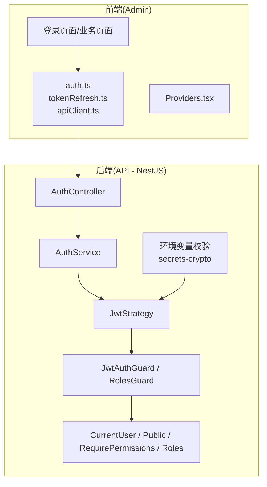
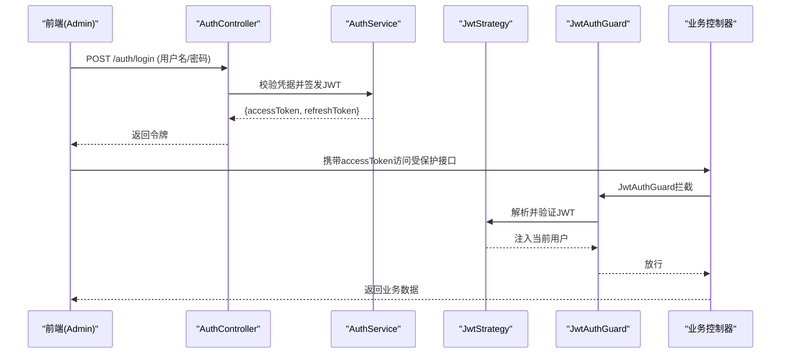
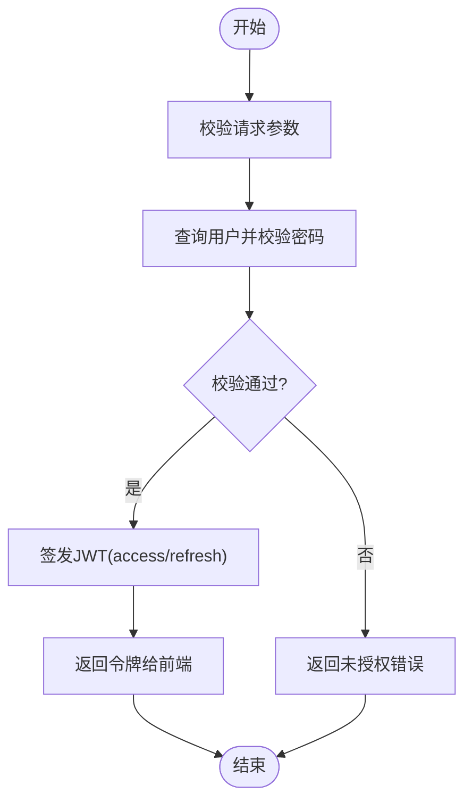
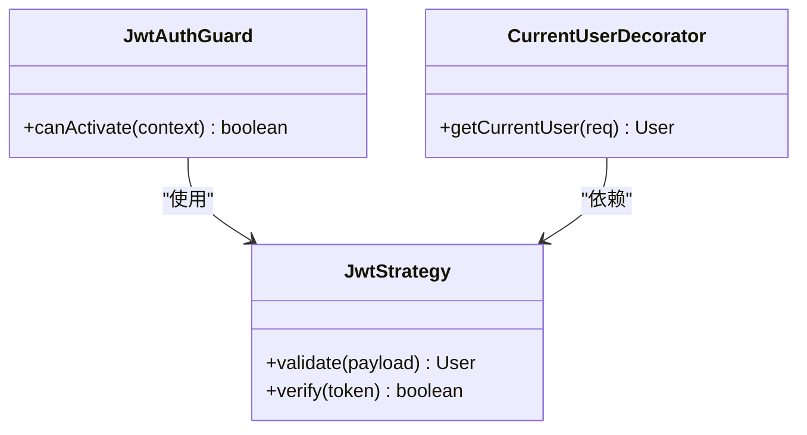
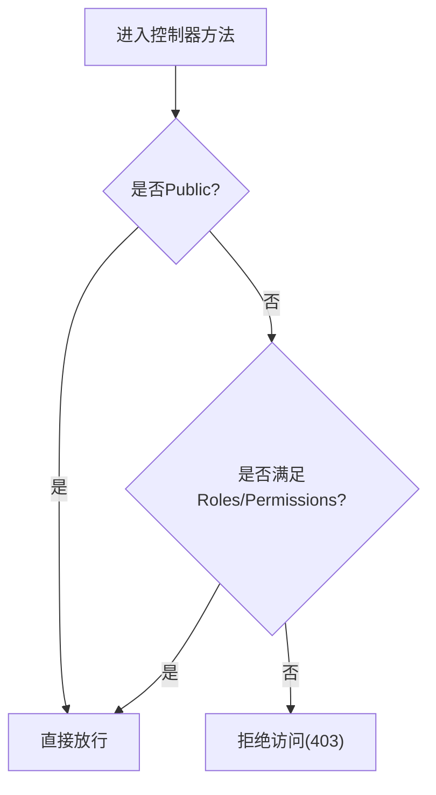
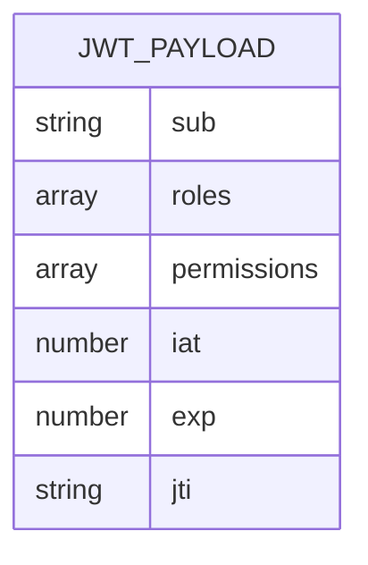
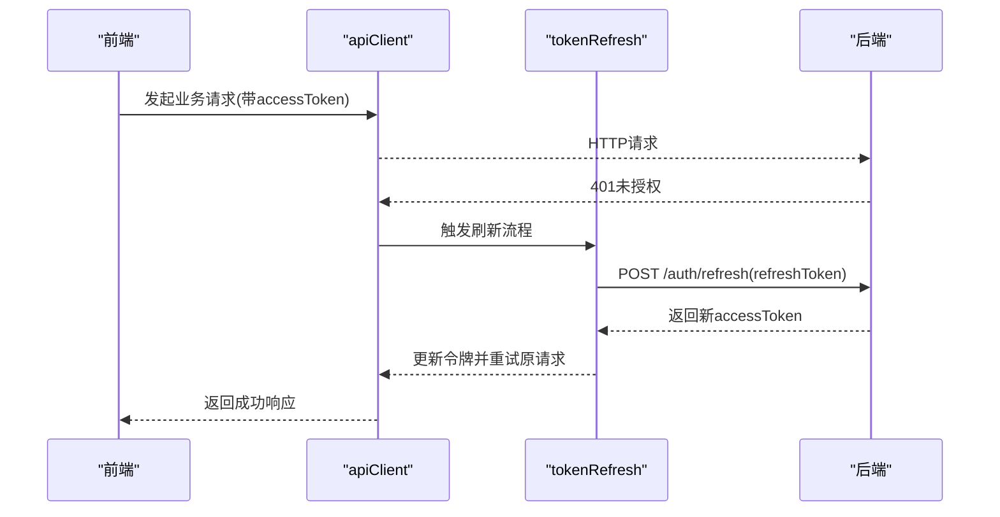
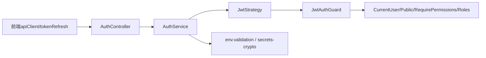

# JWT令牌认证

<cite>
**本文引用的文件**   
- [auth.controller.ts](file://apps/api/src/auth/auth.controller.ts)
- [auth.service.ts](file://apps/api/src/auth/auth.service.ts)
- [jwt.strategy.ts](file://apps/api/src/auth/strategies/jwt.strategy.ts)
- [jwt-auth.guard.ts](file://apps/api/src/auth/guards/jwt-auth.guard.ts)
- [roles.guard.ts](file://apps/api/src/auth/guards/roles.guard.ts)
- [current-user.decorator.ts](file://apps/api/src/auth/decorators/current-user.decorator.ts)
- [public.decorator.ts](file://apps/api/src/auth/decorators/public.decorator.ts)
- [require-permissions.decorator.ts](file://apps/api/src/auth/decorators/require-permissions.decorator.ts)
- [roles.decorator.ts](file://apps/api/src/auth/decorators/roles.decorator.ts)
- [auth.dto.ts](file://apps/api/src/auth/dto/auth.dto.ts)
- [profile.dto.ts](file://apps/api/src/auth/dto/profile.dto.ts)
- [env.validation.ts](file://apps/api/src/config/env.validation.ts)
- [secrets-crypto.ts](file://apps/api/src/common/crypto/secrets-crypto.ts)
- [tokenRefresh.ts](file://apps/admin/src/lib/tokenRefresh.ts)
- [apiClient.ts](file://apps/admin/src/lib/apiClient.ts)
- [auth.ts](file://apps/admin/src/lib/auth.ts)
- [providers.tsx](file://apps/admin/src/components/Providers.tsx)
- [main.ts](file://apps/api/src/main.ts)
- [app.module.ts](file://apps/api/src/app.module.ts)
</cite>

## 目录
1. [简介](#简介)
2. [项目结构](#项目结构)
3. [核心组件](#核心组件)
4. [架构总览](#架构总览)
5. [详细组件分析](#详细组件分析)
6. [依赖关系分析](#依赖关系分析)
7. [性能考虑](#性能考虑)
8. [故障排查指南](#故障排查指南)
9. [结论](#结论)
10. [附录](#附录)

## 简介
本文件围绕JWT令牌认证，系统性阐述登录流程、令牌生命周期管理、刷新机制与安全配置。重点覆盖：
- JWT策略实现原理与签名验证过程
- 令牌载荷结构与字段含义
- 前端令牌存储与自动刷新策略
- 跨域处理与错误处理策略
- 集成示例与常见问题解决方案

## 项目结构
本项目采用前后端分离架构：
- 后端（NestJS）提供认证API、JWT策略、守卫与装饰器，负责签发与校验JWT
- 前端（Next.js Admin）负责登录交互、令牌存储、请求拦截与自动刷新

图表来源
- [auth.controller.ts](file://apps/api/src/auth/auth.controller.ts)
- [auth.service.ts](file://apps/api/src/auth/auth.service.ts)
- [jwt.strategy.ts](file://apps/api/src/auth/strategies/jwt.strategy.ts)
- [jwt-auth.guard.ts](file://apps/api/src/auth/guards/jwt-auth.guard.ts)
- [roles.guard.ts](file://apps/api/src/auth/guards/roles.guard.ts)
- [current-user.decorator.ts](file://apps/api/src/auth/decorators/current-user.decorator.ts)
- [public.decorator.ts](file://apps/api/src/auth/decorators/public.decorator.ts)
- [require-permissions.decorator.ts](file://apps/api/src/auth/decorators/require-permissions.decorator.ts)
- [roles.decorator.ts](file://apps/api/src/auth/decorators/roles.decorator.ts)
- [env.validation.ts](file://apps/api/src/config/env.validation.ts)
- [secrets-crypto.ts](file://apps/api/src/common/crypto/secrets-crypto.ts)
- [tokenRefresh.ts](file://apps/admin/src/lib/tokenRefresh.ts)
- [apiClient.ts](file://apps/admin/src/lib/apiClient.ts)
- [auth.ts](file://apps/admin/src/lib/auth.ts)
- [providers.tsx](file://apps/admin/src/components/Providers.tsx)

章节来源
- [main.ts](file://apps/api/src/main.ts)
- [app.module.ts](file://apps/api/src/app.module.ts)

## 核心组件
- 认证控制器（AuthController）：暴露登录、登出、刷新等接口
- 认证服务（AuthService）：封装用户校验、令牌签发与刷新逻辑
- JWT策略（JwtStrategy）：解析并验证JWT，注入当前用户上下文
- 守卫（JwtAuthGuard/RolesGuard）：统一鉴权与角色权限校验
- 装饰器（CurrentUser/Public/RequirePermissions/Roles）：便捷获取用户信息与声明式权限控制
- 配置与加密（env.validation.ts/secrets-crypto.ts）：环境变量校验与密钥安全读取
- 前端令牌库（auth.ts/tokenRefresh.ts/apiClient.ts）：登录、存储、拦截与刷新

章节来源
- [auth.controller.ts](file://apps/api/src/auth/auth.controller.ts)
- [auth.service.ts](file://apps/api/src/auth/auth.service.ts)
- [jwt.strategy.ts](file://apps/api/src/auth/strategies/jwt.strategy.ts)
- [jwt-auth.guard.ts](file://apps/api/src/auth/guards/jwt-auth.guard.ts)
- [roles.guard.ts](file://apps/api/src/auth/guards/roles.guard.ts)
- [current-user.decorator.ts](file://apps/api/src/auth/decorators/current-user.decorator.ts)
- [public.decorator.ts](file://apps/api/src/auth/decorators/public.decorator.ts)
- [require-permissions.decorator.ts](file://apps/api/src/auth/decorators/require-permissions.decorator.ts)
- [roles.decorator.ts](file://apps/api/src/auth/decorators/roles.decorator.ts)
- [env.validation.ts](file://apps/api/src/config/env.validation.ts)
- [secrets-crypto.ts](file://apps/api/src/common/crypto/secrets-crypto.ts)
- [tokenRefresh.ts](file://apps/admin/src/lib/tokenRefresh.ts)
- [apiClient.ts](file://apps/admin/src/lib/apiClient.ts)
- [auth.ts](file://apps/admin/src/lib/auth.ts)

## 架构总览
下图展示从登录到受保护资源访问的完整调用链，以及JWT在前后端的流转方式。

图表来源
- [auth.controller.ts](file://apps/api/src/auth/auth.controller.ts)
- [auth.service.ts](file://apps/api/src/auth/auth.service.ts)
- [jwt.strategy.ts](file://apps/api/src/auth/strategies/jwt.strategy.ts)
- [jwt-auth.guard.ts](file://apps/api/src/auth/guards/jwt-auth.guard.ts)

## 详细组件分析

### 登录流程与令牌签发
- 客户端提交用户名与密码至登录接口
- 服务端校验用户身份后，生成包含必要载荷的JWT（如用户标识、角色、过期时间等）
- 响应中返回accessToken与refreshToken（或仅accessToken，具体取决于实现）

图表来源
- [auth.controller.ts](file://apps/api/src/auth/auth.controller.ts)
- [auth.service.ts](file://apps/api/src/auth/auth.service.ts)

章节来源
- [auth.controller.ts](file://apps/api/src/auth/auth.controller.ts)
- [auth.service.ts](file://apps/api/src/auth/auth.service.ts)

### JWT策略与签名验证
- JwtStrategy负责从请求头提取JWT并进行签名验证
- 验证通过后，将用户信息注入到请求上下文，供后续装饰器与守卫使用
- 支持自定义验证逻辑（如黑名单、设备指纹等）

图表来源
- [jwt.strategy.ts](file://apps/api/src/auth/strategies/jwt.strategy.ts)
- [jwt-auth.guard.ts](file://apps/api/src/auth/guards/jwt-auth.guard.ts)
- [current-user.decorator.ts](file://apps/api/src/auth/decorators/current-user.decorator.ts)

章节来源
- [jwt.strategy.ts](file://apps/api/src/auth/strategies/jwt.strategy.ts)
- [jwt-auth.guard.ts](file://apps/api/src/auth/guards/jwt-auth.guard.ts)
- [current-user.decorator.ts](file://apps/api/src/auth/decorators/current-user.decorator.ts)

### 角色与权限控制
- RolesGuard基于用户角色进行细粒度授权
- RequirePermissions装饰器用于声明式权限检查
- Public装饰器可跳过鉴权（公开接口）

图表来源
- [roles.guard.ts](file://apps/api/src/auth/guards/roles.guard.ts)
- [require-permissions.decorator.ts](file://apps/api/src/auth/decorators/require-permissions.decorator.ts)
- [roles.decorator.ts](file://apps/api/src/auth/decorators/roles.decorator.ts)
- [public.decorator.ts](file://apps/api/src/auth/decorators/public.decorator.ts)

章节来源
- [roles.guard.ts](file://apps/api/src/auth/guards/roles.guard.ts)
- [require-permissions.decorator.ts](file://apps/api/src/auth/decorators/require-permissions.decorator.ts)
- [roles.decorator.ts](file://apps/api/src/auth/decorators/roles.decorator.ts)
- [public.decorator.ts](file://apps/api/src/auth/decorators/public.decorator.ts)

### 令牌载荷结构与生命周期
- 典型载荷包含：用户ID、角色、权限、签发时间、过期时间等
- accessToken较短生命周期，refreshToken较长生命周期
- 建议最小化载荷，避免敏感信息泄露

章节来源
- [auth.service.ts](file://apps/api/src/auth/auth.service.ts)
- [jwt.strategy.ts](file://apps/api/src/auth/strategies/jwt.strategy.ts)

### 前端令牌存储与自动刷新
- 登录成功后，前端保存accessToken与refreshToken（推荐HttpOnly Cookie或内存存储）
- apiClient在请求前附加accessToken，并在收到401时尝试使用refreshToken刷新
- tokenRefresh模块封装刷新逻辑，确保并发刷新时的幂等性

图表来源
- [apiClient.ts](file://apps/admin/src/lib/apiClient.ts)
- [tokenRefresh.ts](file://apps/admin/src/lib/tokenRefresh.ts)
- [auth.ts](file://apps/admin/src/lib/auth.ts)

章节来源
- [apiClient.ts](file://apps/admin/src/lib/apiClient.ts)
- [tokenRefresh.ts](file://apps/admin/src/lib/tokenRefresh.ts)
- [auth.ts](file://apps/admin/src/lib/auth.ts)
- [providers.tsx](file://apps/admin/src/components/Providers.tsx)

### 安全配置与环境变量
- 使用环境变量校验确保关键配置存在且类型正确
- 密钥通过加密模块安全读取，避免硬编码
- 建议启用HTTPS、设置合理的过期时间与CORS策略

章节来源
- [env.validation.ts](file://apps/api/src/config/env.validation.ts)
- [secrets-crypto.ts](file://apps/api/src/common/crypto/secrets-crypto.ts)

## 依赖关系分析
- 控制器依赖服务层，服务层依赖策略与配置模块
- 守卫与装饰器贯穿请求生命周期，形成统一的鉴权体系
- 前端通过拦截器与刷新模块与后端认证能力紧密耦合

图表来源
- [auth.controller.ts](file://apps/api/src/auth/auth.controller.ts)
- [auth.service.ts](file://apps/api/src/auth/auth.service.ts)
- [jwt.strategy.ts](file://apps/api/src/auth/strategies/jwt.strategy.ts)
- [jwt-auth.guard.ts](file://apps/api/src/auth/guards/jwt-auth.guard.ts)
- [current-user.decorator.ts](file://apps/api/src/auth/decorators/current-user.decorator.ts)
- [public.decorator.ts](file://apps/api/src/auth/decorators/public.decorator.ts)
- [require-permissions.decorator.ts](file://apps/api/src/auth/decorators/require-permissions.decorator.ts)
- [roles.decorator.ts](file://apps/api/src/auth/decorators/roles.decorator.ts)
- [env.validation.ts](file://apps/api/src/config/env.validation.ts)
- [secrets-crypto.ts](file://apps/api/src/common/crypto/secrets-crypto.ts)
- [apiClient.ts](file://apps/admin/src/lib/apiClient.ts)
- [tokenRefresh.ts](file://apps/admin/src/lib/tokenRefresh.ts)

章节来源
- [auth.controller.ts](file://apps/api/src/auth/auth.controller.ts)
- [auth.service.ts](file://apps/api/src/auth/auth.service.ts)
- [jwt.strategy.ts](file://apps/api/src/auth/strategies/jwt.strategy.ts)
- [jwt-auth.guard.ts](file://apps/api/src/auth/guards/jwt-auth.guard.ts)
- [roles.guard.ts](file://apps/api/src/auth/guards/roles.guard.ts)
- [current-user.decorator.ts](file://apps/api/src/auth/decorators/current-user.decorator.ts)
- [public.decorator.ts](file://apps/api/src/auth/decorators/public.decorator.ts)
- [require-permissions.decorator.ts](file://apps/api/src/auth/decorators/require-permissions.decorator.ts)
- [roles.decorator.ts](file://apps/api/src/auth/decorators/roles.decorator.ts)
- [env.validation.ts](file://apps/api/src/config/env.validation.ts)
- [secrets-crypto.ts](file://apps/api/src/common/crypto/secrets-crypto.ts)
- [apiClient.ts](file://apps/admin/src/lib/apiClient.ts)
- [tokenRefresh.ts](file://apps/admin/src/lib/tokenRefresh.ts)

## 性能考虑
- 合理设置accessToken短时效，减少泄露风险；refreshToken长时效但需安全存储
- 避免在JWT载荷中存放大对象或敏感数据，降低传输与解析开销
- 前端刷新逻辑应去重并发请求，避免重复刷新导致竞争条件
- 服务端签名算法选择高效且安全的方案（如HS256/RS256），并根据部署环境权衡

## 故障排查指南
- 401未授权：检查请求头是否携带有效accessToken；确认服务器签名密钥一致
- 403禁止访问：检查用户角色与权限是否满足接口要求；确认Public装饰器使用是否正确
- 刷新失败：确认refreshToken有效性；检查网络与CORS配置；排查并发刷新导致的令牌覆盖问题
- 跨域问题：核对后端CORS白名单与前端域名；确保Cookie的SameSite与Secure属性正确

章节来源
- [jwt.strategy.ts](file://apps/api/src/auth/strategies/jwt.strategy.ts)
- [jwt-auth.guard.ts](file://apps/api/src/auth/guards/jwt-auth.guard.ts)
- [roles.guard.ts](file://apps/api/src/auth/guards/roles.guard.ts)
- [apiClient.ts](file://apps/admin/src/lib/apiClient.ts)
- [tokenRefresh.ts](file://apps/admin/src/lib/tokenRefresh.ts)

## 结论
本项目的JWT认证体系以NestJS为核心，结合策略、守卫与装饰器实现了完整的鉴权链路。前端通过拦截器与刷新模块保障用户体验与安全性。遵循最小载荷、短期令牌、安全存储与严格CORS等最佳实践，可有效提升系统的安全性与稳定性。

## 附录
- 集成示例要点
  - 登录：调用登录接口获取accessToken与refreshToken
  - 存储：优先使用HttpOnly Cookie或内存存储，避免持久化明文
  - 请求：在请求头附加Authorization: Bearer <accessToken>
  - 刷新：捕获401后使用refreshToken刷新，重试原请求
  - 权限：使用Public/RequirePermissions/Roles装饰器声明接口权限
- 常见问题
  - 跨域错误：检查CORS配置与域名白名单
  - 令牌失效：缩短accessToken有效期，完善刷新逻辑
  - 权限不足：核对用户角色与接口权限声明
  - 并发刷新：实现刷新锁，避免多次刷新覆盖令牌