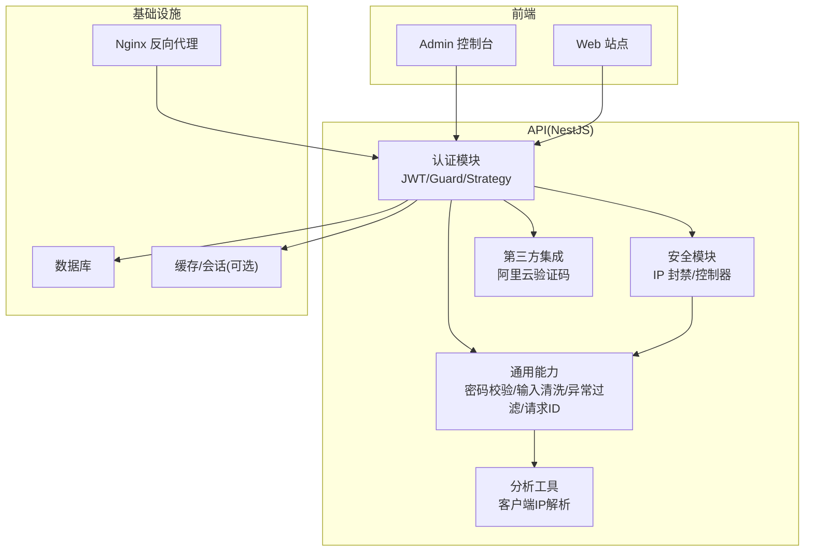
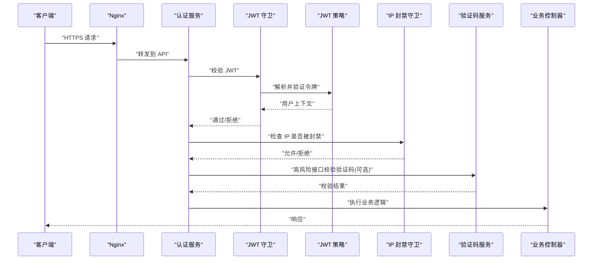
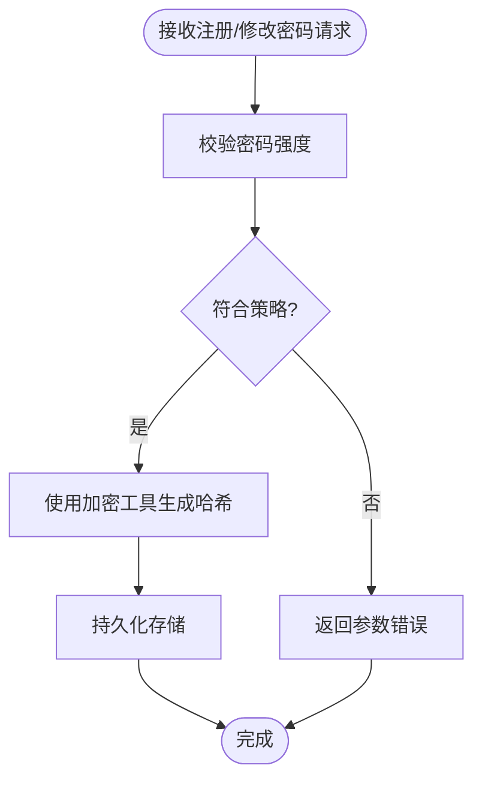
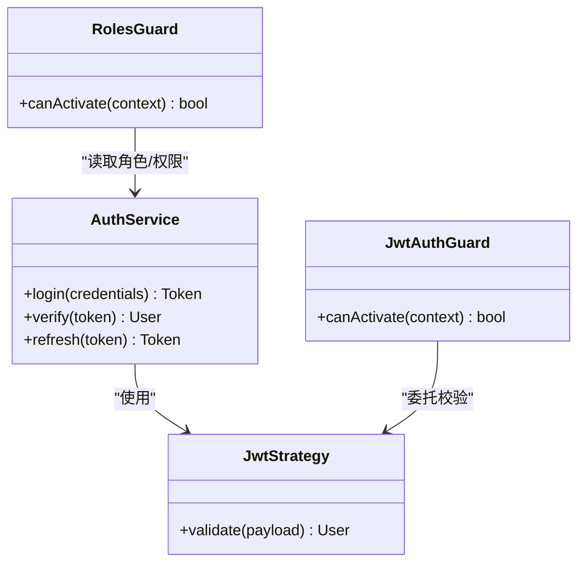
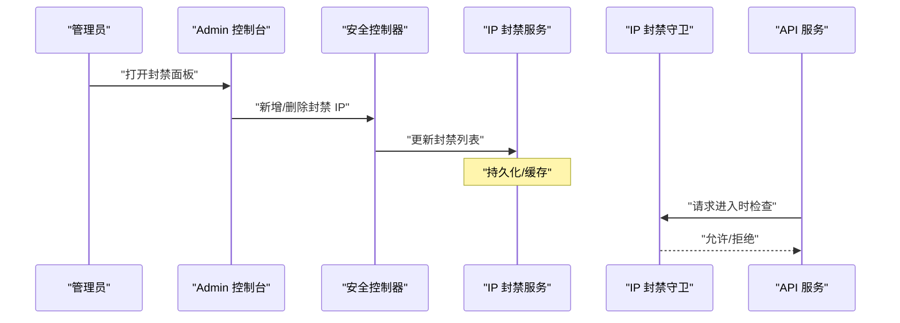
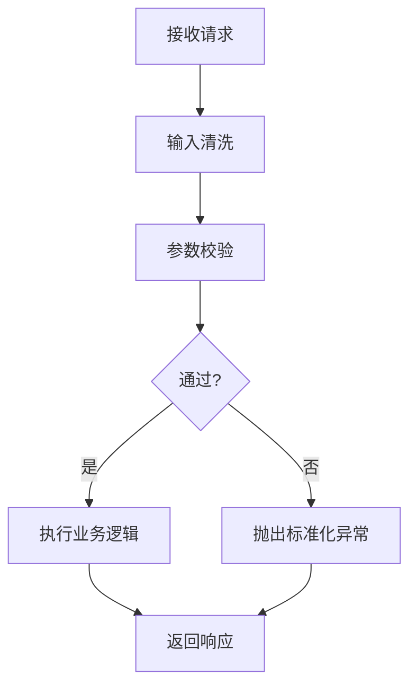
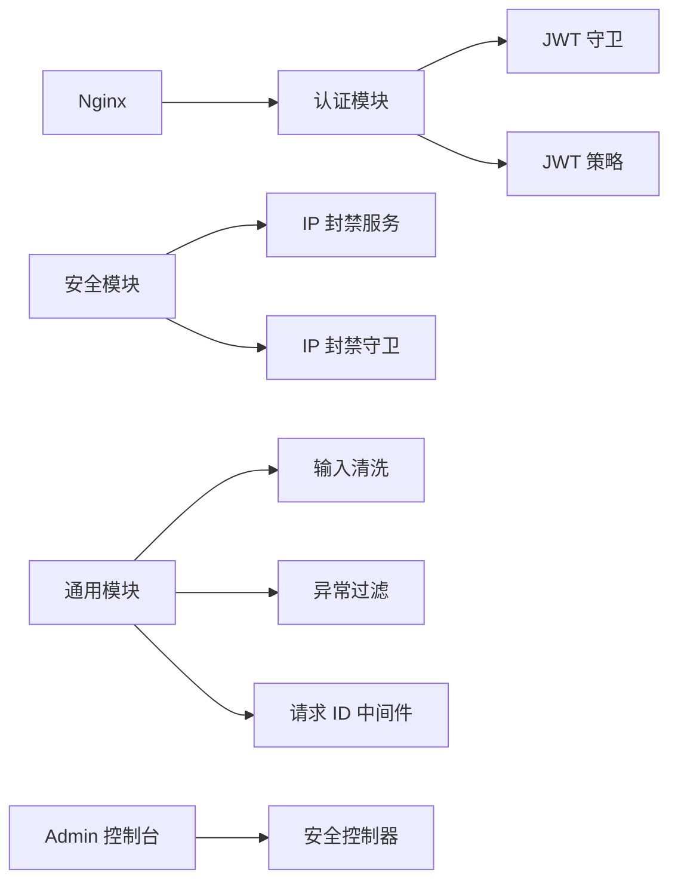

# 安全最佳实践

<cite>
**本文引用的文件**   
- [apps/api/src/common/crypto/secrets-crypto.ts](file://apps/api/src/common/crypto/secrets-crypto.ts)
- [apps/api/src/common/validators/password.validator.ts](file://apps/api/src/common/validators/password.validator.ts)
- [apps/api/src/auth/auth.service.ts](file://apps/api/src/auth/auth.service.ts)
- [apps/api/src/auth/guards/jwt-auth.guard.ts](file://apps/api/src/auth/guards/jwt-auth.guard.ts)
- [apps/api/src/auth/strategies/jwt.strategy.ts](file://apps/api/src/auth/strategies/jwt.strategy.ts)
- [apps/api/src/security/ip-ban.guard.ts](file://apps/api/src/security/ip-ban.guard.ts)
- [apps/api/src/security/ip-ban.service.ts](file://apps/api/src/security/ip-ban.service.ts)
- [apps/api/src/security/security.controller.ts](file://apps/api/src/security/security.controller.ts)
- [apps/api/src/config/env.validation.ts](file://apps/api/src/config/env.validation.ts)
- [apps/api/src/common/middleware/request-id.middleware.ts](file://apps/api/src/common/middleware/request-id.middleware.ts)
- [apps/api/src/common/filters/http-exception.filter.ts](file://apps/api/src/common/filters/http-exception.filter.ts)
- [apps/api/src/analytics/utils/client-ip.ts](file://apps/api/src/analytics/utils/client-ip.ts)
- [apps/api/src/common/utils/sanitize.ts](file://apps/api/src/common/utils/sanitize.ts)
- [apps/admin/src/features/security-ip-block.ts](file://apps/admin/src/features/security-ip-block.ts)
- [apps/admin/src/components/security/IpBlockPanel.tsx](file://apps/admin/src/components/security/IpBlockPanel.tsx)
- [infra/docker/nginx/tzj.conf](file://infra/docker/nginx/tzj.conf)
- [infra/docker/nginx/snippets/proxy-docker.conf](file://infra/docker/nginx/snippets/proxy-docker.conf)
- [apps/api/src/integrations/aliyun-captcha.service.ts](file://apps/api/src/integrations/aliyun-captcha.service.ts)
</cite>

## 目录
1. [简介](#简介)
2. [项目结构](#项目结构)
3. [核心组件](#核心组件)
4. [架构总览](#架构总览)
5. [详细组件分析](#详细组件分析)
6. [依赖关系分析](#依赖关系分析)
7. [性能考量](#性能考量)
8. [故障排查指南](#故障排查指南)
9. [结论](#结论)
10. [附录](#附录)

## 简介
本文件面向本项目（前后端分离的 NestJS + Next.js 应用）的安全最佳实践，覆盖密码加密存储、敏感信息保护、请求验证与输入清洗、IP 封禁机制、速率限制与防暴力破解策略、环境变量管理与密钥轮换、安全配置检查、安全审计清单、常见漏洞防护与应急响应。文档以仓库实际实现为依据，结合可视化图示帮助读者快速理解并落地安全措施。

## 项目结构
从安全视角看，关键代码分布在以下位置：
- API 层（NestJS）：认证鉴权、密码校验、IP 封禁、请求 ID、异常过滤、客户端 IP 解析、输入清洗、验证码集成等。
- 管理端（Next.js Admin）：IP 封禁面板与安全功能的前端交互。
- 基础设施（Nginx/Docker）：反向代理、SSL、请求头透传等安全相关配置。

图表来源
- [apps/api/src/auth/auth.service.ts](file://apps/api/src/auth/auth.service.ts)
- [apps/api/src/security/security.controller.ts](file://apps/api/src/security/security.controller.ts)
- [apps/api/src/common/validators/password.validator.ts](file://apps/api/src/common/validators/password.validator.ts)
- [apps/api/src/common/utils/sanitize.ts](file://apps/api/src/common/utils/sanitize.ts)
- [apps/api/src/analytics/utils/client-ip.ts](file://apps/api/src/analytics/utils/client-ip.ts)
- [apps/api/src/integrations/aliyun-captcha.service.ts](file://apps/api/src/integrations/aliyun-captcha.service.ts)
- [infra/docker/nginx/tzj.conf](file://infra/docker/nginx/tzj.conf)

章节来源
- [apps/api/src/auth/auth.service.ts](file://apps/api/src/auth/auth.service.ts)
- [apps/api/src/security/security.controller.ts](file://apps/api/src/security/security.controller.ts)
- [apps/api/src/common/validators/password.validator.ts](file://apps/api/src/common/validators/password.validator.ts)
- [apps/api/src/common/utils/sanitize.ts](file://apps/api/src/common/utils/sanitize.ts)
- [apps/api/src/analytics/utils/client-ip.ts](file://apps/api/src/analytics/utils/client-ip.ts)
- [apps/api/src/integrations/aliyun-captcha.service.ts](file://apps/api/src/integrations/aliyun-captcha.service.ts)
- [infra/docker/nginx/tzj.conf](file://infra/docker/nginx/tzj.conf)

## 核心组件
- 密码加密与校验：使用专用加密工具与密码校验器，确保密码不可逆存储与强度校验。
- 认证与鉴权：基于 JWT 的无状态认证，配合 Guard/Strategy 进行令牌校验与角色权限控制。
- IP 封禁与访问控制：通过 Guard 拦截恶意或黑名单 IP，提供管理端操作接口。
- 请求验证与输入清洗：统一异常过滤器、请求 ID 中间件、输入清洗工具，降低注入与 XSS 风险。
- 客户端 IP 解析：可靠获取真实客户端 IP，支撑风控与封禁。
- 第三方验证码：接入阿里云验证码服务，增强登录/注册等高风险接口的抗暴力破解能力。
- 环境变量与配置校验：集中式环境配置校验，避免缺失或错误配置导致的安全隐患。

章节来源
- [apps/api/src/common/crypto/secrets-crypto.ts](file://apps/api/src/common/crypto/secrets-crypto.ts)
- [apps/api/src/common/validators/password.validator.ts](file://apps/api/src/common/validators/password.validator.ts)
- [apps/api/src/auth/auth.service.ts](file://apps/api/src/auth/auth.service.ts)
- [apps/api/src/auth/guards/jwt-auth.guard.ts](file://apps/api/src/auth/guards/jwt-auth.guard.ts)
- [apps/api/src/auth/strategies/jwt.strategy.ts](file://apps/api/src/auth/strategies/jwt.strategy.ts)
- [apps/api/src/security/ip-ban.guard.ts](file://apps/api/src/security/ip-ban.guard.ts)
- [apps/api/src/security/ip-ban.service.ts](file://apps/api/src/security/ip-ban.service.ts)
- [apps/api/src/common/middleware/request-id.middleware.ts](file://apps/api/src/common/middleware/request-id.middleware.ts)
- [apps/api/src/common/filters/http-exception.filter.ts](file://apps/api/src/common/filters/http-exception.filter.ts)
- [apps/api/src/analytics/utils/client-ip.ts](file://apps/api/src/analytics/utils/client-ip.ts)
- [apps/api/src/common/utils/sanitize.ts](file://apps/api/src/common/utils/sanitize.ts)
- [apps/api/src/integrations/aliyun-captcha.service.ts](file://apps/api/src/integrations/aliyun-captcha.service.ts)
- [apps/api/src/config/env.validation.ts](file://apps/api/src/config/env.validation.ts)

## 架构总览
下图展示认证与安全防护的关键调用链：客户端请求经 Nginx 进入 API，认证模块校验 JWT，安全模块对 IP 进行封禁判断，必要时调用验证码服务；同时记录请求 ID 与异常信息，便于审计与排障。

图表来源
- [apps/api/src/auth/auth.service.ts](file://apps/api/src/auth/auth.service.ts)
- [apps/api/src/auth/guards/jwt-auth.guard.ts](file://apps/api/src/auth/guards/jwt-auth.guard.ts)
- [apps/api/src/auth/strategies/jwt.strategy.ts](file://apps/api/src/auth/strategies/jwt.strategy.ts)
- [apps/api/src/security/ip-ban.guard.ts](file://apps/api/src/security/ip-ban.guard.ts)
- [apps/api/src/integrations/aliyun-captcha.service.ts](file://apps/api/src/integrations/aliyun-captcha.service.ts)
- [infra/docker/nginx/tzj.conf](file://infra/docker/nginx/tzj.conf)

## 详细组件分析

### 密码加密存储与校验
- 加密工具：使用专用加密模块处理敏感数据，确保不可逆与一致性。
- 密码校验器：在 DTO 或控制器层对密码强度进行校验（长度、复杂度等），防止弱口令。
- 建议：所有密码必须哈希存储；禁止明文日志输出；定期评估算法强度。

图表来源
- [apps/api/src/common/validators/password.validator.ts](file://apps/api/src/common/validators/password.validator.ts)
- [apps/api/src/common/crypto/secrets-crypto.ts](file://apps/api/src/common/crypto/secrets-crypto.ts)

章节来源
- [apps/api/src/common/validators/password.validator.ts](file://apps/api/src/common/validators/password.validator.ts)
- [apps/api/src/common/crypto/secrets-crypto.ts](file://apps/api/src/common/crypto/secrets-crypto.ts)

### 认证与鉴权（JWT）
- 认证流程：登录成功后签发 JWT，后续请求携带令牌由 Guard 校验，Strategy 负责解析与载荷验证。
- 鉴权策略：可结合角色与权限装饰器进行细粒度控制。
- 建议：设置合理的令牌有效期与刷新机制；严格校验签名与受众；避免将敏感信息放入令牌载荷。

图表来源
- [apps/api/src/auth/auth.service.ts](file://apps/api/src/auth/auth.service.ts)
- [apps/api/src/auth/guards/jwt-auth.guard.ts](file://apps/api/src/auth/guards/jwt-auth.guard.ts)
- [apps/api/src/auth/strategies/jwt.strategy.ts](file://apps/api/src/auth/strategies/jwt.strategy.ts)

章节来源
- [apps/api/src/auth/auth.service.ts](file://apps/api/src/auth/auth.service.ts)
- [apps/api/src/auth/guards/jwt-auth.guard.ts](file://apps/api/src/auth/guards/jwt-auth.guard.ts)
- [apps/api/src/auth/strategies/jwt.strategy.ts](file://apps/api/src/auth/strategies/jwt.strategy.ts)

### IP 封禁机制与管理
- 封禁守卫：在请求进入控制器前检查客户端 IP 是否在黑名单中，命中则直接拒绝。
- 封禁服务：提供添加/移除封禁 IP 的能力，通常由管理端触发。
- 管理端：Admin 控制台提供 IP 封禁面板与功能，便于运营人员操作。

图表来源
- [apps/api/src/security/ip-ban.guard.ts](file://apps/api/src/security/ip-ban.guard.ts)
- [apps/api/src/security/ip-ban.service.ts](file://apps/api/src/security/ip-ban.service.ts)
- [apps/api/src/security/security.controller.ts](file://apps/api/src/security/security.controller.ts)
- [apps/admin/src/features/security-ip-block.ts](file://apps/admin/src/features/security-ip-block.ts)
- [apps/admin/src/components/security/IpBlockPanel.tsx](file://apps/admin/src/components/security/IpBlockPanel.tsx)

章节来源
- [apps/api/src/security/ip-ban.guard.ts](file://apps/api/src/security/ip-ban.guard.ts)
- [apps/api/src/security/ip-ban.service.ts](file://apps/api/src/security/ip-ban.service.ts)
- [apps/api/src/security/security.controller.ts](file://apps/api/src/security/security.controller.ts)
- [apps/admin/src/features/security-ip-block.ts](file://apps/admin/src/features/security-ip-block.ts)
- [apps/admin/src/components/security/IpBlockPanel.tsx](file://apps/admin/src/components/security/IpBlockPanel.tsx)

### 请求验证与输入清洗
- 输入清洗：对可能包含脚本或危险字符的内容进行清洗，降低 XSS 与注入风险。
- 异常过滤：统一捕获并格式化异常，避免泄露内部细节。
- 请求 ID：为每个请求分配唯一 ID，便于追踪与审计。

图表来源
- [apps/api/src/common/utils/sanitize.ts](file://apps/api/src/common/utils/sanitize.ts)
- [apps/api/src/common/filters/http-exception.filter.ts](file://apps/api/src/common/filters/http-exception.filter.ts)
- [apps/api/src/common/middleware/request-id.middleware.ts](file://apps/api/src/common/middleware/request-id.middleware.ts)

章节来源
- [apps/api/src/common/utils/sanitize.ts](file://apps/api/src/common/utils/sanitize.ts)
- [apps/api/src/common/filters/http-exception.filter.ts](file://apps/api/src/common/filters/http-exception.filter.ts)
- [apps/api/src/common/middleware/request-id.middleware.ts](file://apps/api/src/common/middleware/request-id.middleware.ts)

### 客户端 IP 解析与风控
- 客户端 IP：从请求头或连接信息中解析真实客户端 IP，用于封禁与审计。
- 建议：优先信任可信代理（如 Nginx）传递的头部；对不信任来源做白名单校验。

章节来源
- [apps/api/src/analytics/utils/client-ip.ts](file://apps/api/src/analytics/utils/client-ip.ts)

### 验证码集成（防暴力破解）
- 验证码服务：接入阿里云验证码，用于登录、注册、重置密码等高风险接口。
- 建议：结合频率限制与设备指纹，提升抗自动化攻击能力。

章节来源
- [apps/api/src/integrations/aliyun-captcha.service.ts](file://apps/api/src/integrations/aliyun-captcha.service.ts)

### 环境变量与配置校验
- 配置校验：集中式校验环境变量，确保必要项存在且格式正确，避免运行时错误。
- 建议：敏感配置（密钥、令牌、数据库凭据）仅通过环境变量注入，不在代码中硬编码。

章节来源
- [apps/api/src/config/env.validation.ts](file://apps/api/src/config/env.validation.ts)

### Nginx 反向代理与 SSL
- 反向代理：Nginx 作为入口，转发 HTTPS 请求至后端服务，并透传必要的安全头。
- SSL：启用 TLS 证书，强制 HTTPS，减少中间人攻击风险。

章节来源
- [infra/docker/nginx/tzj.conf](file://infra/docker/nginx/tzj.conf)
- [infra/docker/nginx/snippets/proxy-docker.conf](file://infra/docker/nginx/snippets/proxy-docker.conf)

## 依赖关系分析
- 认证模块依赖 JWT 策略与守卫，安全模块依赖 IP 封禁服务与守卫，通用模块提供输入清洗、异常过滤与请求 ID。
- 管理端依赖安全控制器提供的接口，实现 IP 封禁的管理界面。
- Nginx 作为入口，影响请求头与协议安全。

图表来源
- [apps/api/src/auth/auth.service.ts](file://apps/api/src/auth/auth.service.ts)
- [apps/api/src/auth/guards/jwt-auth.guard.ts](file://apps/api/src/auth/guards/jwt-auth.guard.ts)
- [apps/api/src/auth/strategies/jwt.strategy.ts](file://apps/api/src/auth/strategies/jwt.strategy.ts)
- [apps/api/src/security/ip-ban.guard.ts](file://apps/api/src/security/ip-ban.guard.ts)
- [apps/api/src/security/ip-ban.service.ts](file://apps/api/src/security/ip-ban.service.ts)
- [apps/api/src/security/security.controller.ts](file://apps/api/src/security/security.controller.ts)
- [apps/api/src/common/utils/sanitize.ts](file://apps/api/src/common/utils/sanitize.ts)
- [apps/api/src/common/filters/http-exception.filter.ts](file://apps/api/src/common/filters/http-exception.filter.ts)
- [apps/api/src/common/middleware/request-id.middleware.ts](file://apps/api/src/common/middleware/request-id.middleware.ts)
- [infra/docker/nginx/tzj.conf](file://infra/docker/nginx/tzj.conf)

## 性能考量
- 输入清洗应在最小范围内执行，避免对大文本或高频路径造成额外开销。
- IP 封禁检查应使用高效数据结构（如内存集合或缓存），减少 I/O 延迟。
- JWT 校验尽量无状态，避免频繁查询数据库；如需吊销，考虑短生命周期与黑名单缓存。
- 验证码服务调用需设置超时与重试上限，避免阻塞主流程。

[本节为通用指导，无需特定文件引用]

## 故障排查指南
- 认证失败：检查 JWT 签名、过期时间、颁发者/受众配置；查看请求是否携带有效令牌。
- IP 被误封：核对客户端 IP 解析逻辑与封禁列表；确认代理头是否正确透传。
- 输入异常：定位清洗规则与参数校验点；检查异常过滤器是否输出过多内部信息。
- 验证码失败：检查第三方服务状态、密钥配置与网络连通性。
- 请求追踪：利用请求 ID 关联日志，快速定位问题链路。

章节来源
- [apps/api/src/auth/auth.service.ts](file://apps/api/src/auth/auth.service.ts)
- [apps/api/src/analytics/utils/client-ip.ts](file://apps/api/src/analytics/utils/client-ip.ts)
- [apps/api/src/common/filters/http-exception.filter.ts](file://apps/api/src/common/filters/http-exception.filter.ts)
- [apps/api/src/common/middleware/request-id.middleware.ts](file://apps/api/src/common/middleware/request-id.middleware.ts)
- [apps/api/src/integrations/aliyun-captcha.service.ts](file://apps/api/src/integrations/aliyun-captcha.service.ts)

## 结论
本项目在密码安全、认证鉴权、IP 封禁、输入清洗、异常处理、请求追踪与第三方验证码等方面具备较为完善的安全基础。建议持续强化环境变量与密钥管理、引入更严格的速率限制与风控策略，并建立常态化的安全审计与应急响应流程，以提升整体安全性与韧性。

[本节为总结性内容，无需特定文件引用]

## 附录

### 安全审计清单（建议）
- 密码与密钥
  - 所有密码均使用不可逆哈希存储，禁用明文。
  - 密钥与敏感配置仅通过环境变量注入，禁止硬编码。
  - 定期轮换密钥与令牌，设置合理有效期。
- 认证与授权
  - JWT 签名与载荷校验严格；避免在令牌中存放敏感信息。
  - 角色与权限控制覆盖所有敏感接口。
- 输入与输出
  - 所有外部输入进行清洗与校验；输出进行转义。
  - 统一异常过滤，避免泄露堆栈与内部路径。
- 访问控制
  - 启用 IP 封禁与黑名单机制；支持管理端操作。
  - 高风险接口接入验证码与频率限制。
- 基础设施
  - 强制 HTTPS；配置安全响应头（HSTS、CSP 等）。
  - Nginx 正确透传 X-Forwarded-* 头，确保 IP 解析准确。
- 监控与审计
  - 全链路请求 ID 记录；关键操作审计日志。
  - 异常告警与阈值监控（登录失败、封禁命中、验证码失败等）。

[本节为通用清单，无需特定文件引用]

### 常见漏洞防护要点
- 注入与 XSS：输入清洗、参数校验、输出转义、CSP 策略。
- 暴力破解：验证码、频率限制、账号锁定、IP 封禁。
- 越权访问：最小权限原则、资源级鉴权、接口白名单。
- 敏感信息泄露：日志脱敏、错误信息规范化、密钥管理。
- 传输安全：TLS 强制、证书有效性检查、安全头配置。

[本节为通用指导，无需特定文件引用]

### 应急响应指南（建议）
- 事件分级：按影响范围与严重性划分等级，明确响应时限。
- 处置步骤：隔离受影响服务、收集证据（日志、快照）、修复漏洞、恢复服务。
- 复盘改进：根因分析、补丁发布、策略优化、演练与培训。
- 沟通机制：对内通报、对外公告（必要时）、合规上报。

[本节为通用流程，无需特定文件引用]