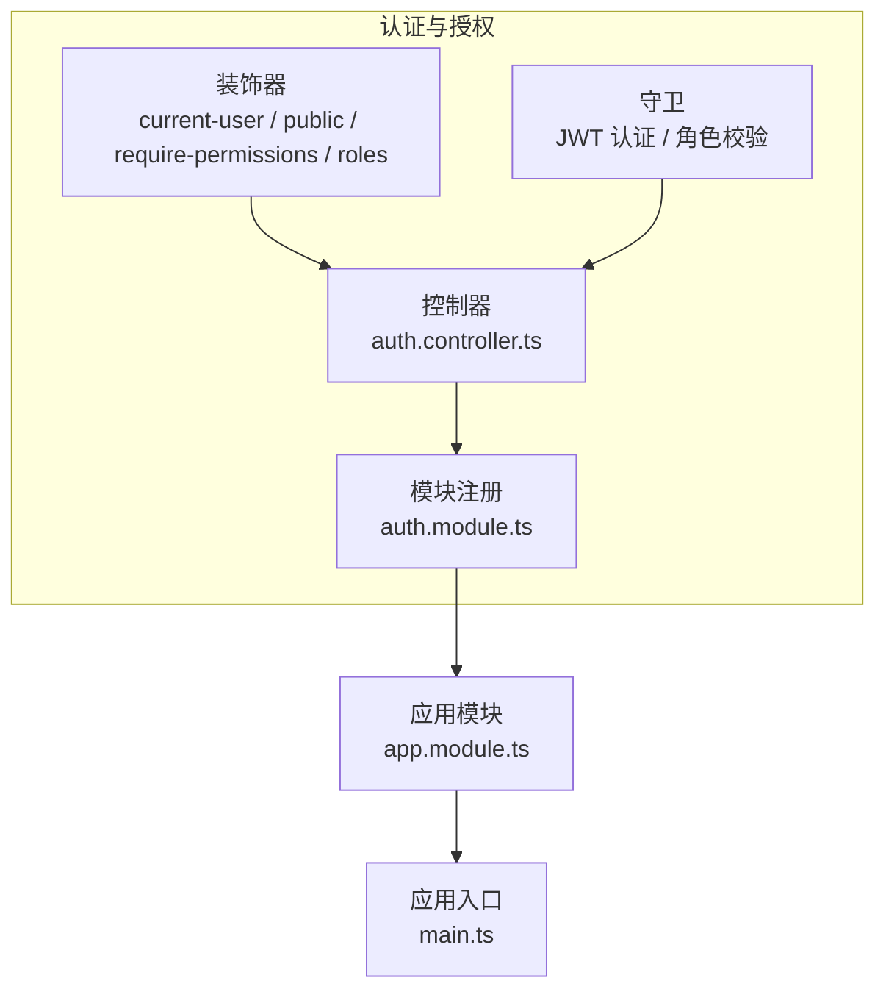
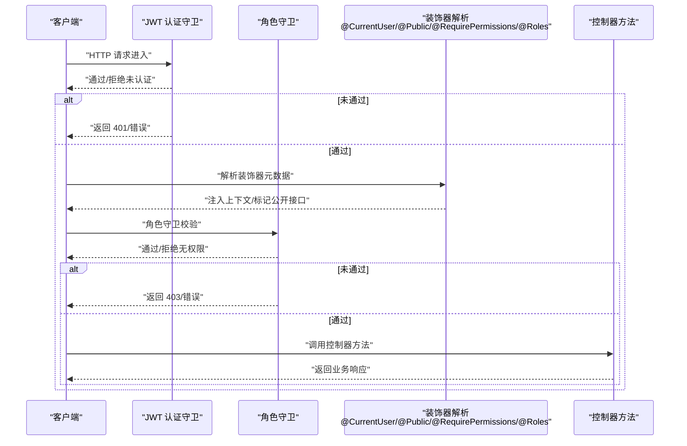
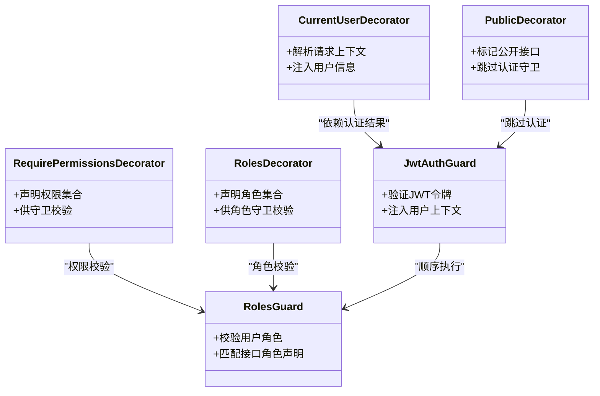

# 装饰器与守卫

<cite>
**本文引用的文件**   
- [current-user.decorator.ts](file://apps/api/src/auth/decorators/current-user.decorator.ts)
- [public.decorator.ts](file://apps/api/src/auth/decorators/public.decorator.ts)
- [require-permissions.decorator.ts](file://apps/api/src/auth/decorators/require-permissions.decorator.ts)
- [roles.decorator.ts](file://apps/api/src/auth/decorators/roles.decorator.ts)
- [jwt-auth.guard.ts](file://apps/api/src/auth/guards/jwt-auth.guard.ts)
- [roles.guard.ts](file://apps/api/src/auth/guards/roles.guard.ts)
- [auth.controller.ts](file://apps/api/src/auth/auth.controller.ts)
- [auth.module.ts](file://apps/api/src/auth/auth.module.ts)
- [app.module.ts](file://apps/api/src/app.module.ts)
- [main.ts](file://apps/api/src/main.ts)
</cite>

## 目录
1. [简介](#简介)
2. [项目结构](#项目结构)
3. [核心组件](#核心组件)
4. [架构总览](#架构总览)
5. [详细组件分析](#详细组件分析)
6. [依赖关系分析](#依赖关系分析)
7. [性能考量](#性能考量)
8. [故障排查指南](#故障排查指南)
9. [结论](#结论)
10. [附录：使用示例与最佳实践](#附录使用示例与最佳实践)

## 简介
本章节聚焦于 NestJS 应用中的装饰器与守卫机制，围绕以下目标展开：
- 自定义装饰器的实现与使用：@CurrentUser、@Public、@RequirePermissions、@Roles
- 守卫的工作机制、执行顺序与拦截逻辑
- 装饰器组合使用、守卫链式调用与自定义守卫开发指南
- 提供完整的使用示例与常见问题排查建议

## 项目结构
本项目采用模块化组织，认证与授权相关能力集中在 auth 模块中，并通过装饰器与守卫对控制器进行细粒度权限控制。关键路径如下：
- 装饰器：apps/api/src/auth/decorators
- 守卫：apps/api/src/auth/guards
- 控制器与模块：apps/api/src/auth
- 全局入口与模块装配：apps/api/src/app.module.ts、apps/api/src/main.ts

**图表来源** 
- [auth.controller.ts](file://apps/api/src/auth/auth.controller.ts)
- [auth.module.ts](file://apps/api/src/auth/auth.module.ts)
- [app.module.ts](file://apps/api/src/app.module.ts)
- [main.ts](file://apps/api/src/main.ts)

**章节来源**
- [auth.controller.ts](file://apps/api/src/auth/auth.controller.ts)
- [auth.module.ts](file://apps/api/src/auth/auth.module.ts)
- [app.module.ts](file://apps/api/src/app.module.ts)
- [main.ts](file://apps/api/src/main.ts)

## 核心组件
本节概述各装饰器与守卫的职责与交互方式：
- @CurrentUser：从请求上下文解析并注入当前登录用户信息到处理器参数
- @Public：标记接口为公开访问，跳过 JWT 认证守卫
- @RequirePermissions：声明接口所需权限集合，由守卫或拦截器进行校验
- @Roles：声明接口所需角色集合，配合角色守卫进行 RBAC 校验
- JWT 认证守卫：验证请求令牌，失败则拒绝访问
- 角色守卫：基于用户角色与接口声明的角色进行匹配校验

**章节来源**
- [current-user.decorator.ts](file://apps/api/src/auth/decorators/current-user.decorator.ts)
- [public.decorator.ts](file://apps/api/src/auth/decorators/public.decorator.ts)
- [require-permissions.decorator.ts](file://apps/api/src/auth/decorators/require-permissions.decorator.ts)
- [roles.decorator.ts](file://apps/api/src/auth/decorators/roles.decorator.ts)
- [jwt-auth.guard.ts](file://apps/api/src/auth/guards/jwt-auth.guard.ts)
- [roles.guard.ts](file://apps/api/src/auth/guards/roles.guard.ts)

## 架构总览
下图展示了典型请求在 NestJS 管道中的处理流程，包括装饰器解析、守卫执行与控制器方法调用的时序关系。

**图表来源** 
- [jwt-auth.guard.ts](file://apps/api/src/auth/guards/jwt-auth.guard.ts)
- [roles.guard.ts](file://apps/api/src/auth/guards/roles.guard.ts)
- [current-user.decorator.ts](file://apps/api/src/auth/decorators/current-user.decorator.ts)
- [public.decorator.ts](file://apps/api/src/auth/decorators/public.decorator.ts)
- [require-permissions.decorator.ts](file://apps/api/src/auth/decorators/require-permissions.decorator.ts)
- [roles.decorator.ts](file://apps/api/src/auth/decorators/roles.decorator.ts)
- [auth.controller.ts](file://apps/api/src/auth/auth.controller.ts)

## 详细组件分析

### 装饰器：@CurrentUser
- 作用：从请求对象中提取已认证的当前用户，并将其注入到控制器方法的参数中，便于后续业务逻辑直接使用用户身份。
- 使用场景：需要获取当前登录用户信息的受保护接口，如个人资料更新、操作审计等。
- 注意事项：
  - 需在已通过 JWT 认证的前提下使用，否则可能无法获取用户信息。
  - 若接口被标记为 @Public，则不应依赖该装饰器。

**章节来源**
- [current-user.decorator.ts](file://apps/api/src/auth/decorators/current-user.decorator.ts)

### 装饰器：@Public
- 作用：将接口标记为公开访问，跳过 JWT 认证守卫的校验。
- 使用场景：登录、注册、健康检查等无需鉴权的接口。
- 注意事项：
  - 仅用于放行认证，不等同于授权；如需权限控制仍需结合其他装饰器或守卫。
  - 避免误用导致敏感接口暴露。

**章节来源**
- [public.decorator.ts](file://apps/api/src/auth/decorators/public.decorator.ts)

### 装饰器：@RequirePermissions
- 作用：声明接口所需的权限集合，供守卫或中间件进行权限校验。
- 使用场景：资源级权限控制，例如“文档编辑”、“客户导入”等细粒度权限。
- 注意事项：
  - 需确保权限来源可靠（如用户权限列表、策略服务）。
  - 可与 @Roles 组合使用，实现 RBAC + ABAC 的混合策略。

**章节来源**
- [require-permissions.decorator.ts](file://apps/api/src/auth/decorators/require-permissions.decorator.ts)

### 装饰器：@Roles
- 作用：声明接口所需的角色集合，配合角色守卫进行 RBAC 校验。
- 使用场景：基于角色的访问控制，如管理员、编辑者、访客等。
- 注意事项：
  - 角色定义应集中管理，避免硬编码。
  - 与 @RequirePermissions 可组合使用，增强权限表达力。

**章节来源**
- [roles.decorator.ts](file://apps/api/src/auth/decorators/roles.decorator.ts)

### 守卫：JWT 认证守卫
- 作用：验证请求中的 JWT 令牌，成功则将用户信息注入请求上下文，失败则拒绝访问。
- 执行顺序：通常在路由匹配后、控制器方法前执行。
- 异常处理：令牌无效、过期或缺失时返回统一错误码。

**章节来源**
- [jwt-auth.guard.ts](file://apps/api/src/auth/guards/jwt-auth.guard.ts)

### 守卫：角色守卫
- 作用：根据接口声明的角色与当前用户的角色进行匹配校验。
- 执行顺序：在 JWT 认证通过后执行，确保用户身份可信后再进行角色校验。
- 扩展性：可结合策略模式动态计算角色权限。

**章节来源**
- [roles.guard.ts](file://apps/api/src/auth/guards/roles.guard.ts)

### 控制器与模块装配
- 控制器：在方法上组合使用装饰器，声明权限与角色需求。
- 模块：注册守卫与装饰器，使其在模块内生效。
- 全局配置：在应用入口启用全局守卫或中间件，实现跨模块的统一鉴权。

**章节来源**
- [auth.controller.ts](file://apps/api/src/auth/auth.controller.ts)
- [auth.module.ts](file://apps/api/src/auth/auth.module.ts)
- [app.module.ts](file://apps/api/src/app.module.ts)
- [main.ts](file://apps/api/src/main.ts)

## 依赖关系分析
装饰器与守卫之间的依赖关系如下：
- 装饰器负责声明元数据（用户、公开、权限、角色）
- 守卫读取元数据并执行校验逻辑
- 控制器方法依赖装饰器注入上下文与守卫的结果

**图表来源** 
- [current-user.decorator.ts](file://apps/api/src/auth/decorators/current-user.decorator.ts)
- [public.decorator.ts](file://apps/api/src/auth/decorators/public.decorator.ts)
- [require-permissions.decorator.ts](file://apps/api/src/auth/decorators/require-permissions.decorator.ts)
- [roles.decorator.ts](file://apps/api/src/auth/decorators/roles.decorator.ts)
- [jwt-auth.guard.ts](file://apps/api/src/auth/guards/jwt-auth.guard.ts)
- [roles.guard.ts](file://apps/api/src/auth/guards/roles.guard.ts)

**章节来源**
- [current-user.decorator.ts](file://apps/api/src/auth/decorators/current-user.decorator.ts)
- [public.decorator.ts](file://apps/api/src/auth/decorators/public.decorator.ts)
- [require-permissions.decorator.ts](file://apps/api/src/auth/decorators/require-permissions.decorator.ts)
- [roles.decorator.ts](file://apps/api/src/auth/decorators/roles.decorator.ts)
- [jwt-auth.guard.ts](file://apps/api/src/auth/guards/jwt-auth.guard.ts)
- [roles.guard.ts](file://apps/api/src/auth/guards/roles.guard.ts)

## 性能考量
- 装饰器开销：装饰器仅在元数据解析阶段运行，开销较小，但应避免在装饰器中执行重逻辑。
- 守卫执行：每个请求都会经过守卫链，建议将耗时逻辑（如数据库查询）缓存或异步化。
- 令牌验证：JWT 解码与签名验证是 CPU 密集型操作，建议使用高效的库并合理设置过期时间。
- 权限计算：复杂权限规则可引入策略模式与缓存，减少重复计算。

[本节为通用指导，不直接分析具体文件]

## 故障排查指南
常见错误与解决方案：
- 401 未认证：检查 JWT 令牌是否有效、是否包含必要字段、是否被正确传递。
- 403 无权限：确认用户角色与接口声明的角色是否匹配，权限集合是否正确加载。
- 装饰器未生效：检查装饰器是否在正确的模块中注册，控制器方法是否正确使用装饰器。
- 守卫顺序问题：确保 JWT 认证守卫在角色守卫之前执行，避免未认证用户进入角色校验。

**章节来源**
- [jwt-auth.guard.ts](file://apps/api/src/auth/guards/jwt-auth.guard.ts)
- [roles.guard.ts](file://apps/api/src/auth/guards/roles.guard.ts)
- [auth.controller.ts](file://apps/api/src/auth/auth.controller.ts)

## 结论
通过装饰器与守卫的组合，NestJS 应用实现了灵活且强大的认证与授权机制。@CurrentUser、@Public、@RequirePermissions、@Roles 等装饰器提供了清晰的接口语义，而 JWT 认证守卫与角色守卫确保了请求的安全性与合规性。在实际开发中，建议遵循最小权限原则，合理组合装饰器与守卫，并建立完善的错误处理与日志记录机制。

[本节为总结性内容，不直接分析具体文件]

## 附录：使用示例与最佳实践
- 装饰器组合：在受保护接口上同时使用 @CurrentUser 与 @RequirePermissions，确保既能获取用户信息又能校验权限。
- 守卫链式调用：在全局启用 JWT 认证守卫，并在特定模块启用角色守卫，实现分层鉴权。
- 自定义守卫开发：继承 NestJS 的 CanActivate 接口，实现自定义鉴权逻辑，并在模块中注册。
- 最佳实践：
  - 将权限与角色定义集中管理，避免硬编码。
  - 使用 @Public 仅用于真正公开的接口，避免安全漏洞。
  - 在守卫中记录关键决策点，便于审计与调试。

[本节为概念性内容，不直接分析具体文件]