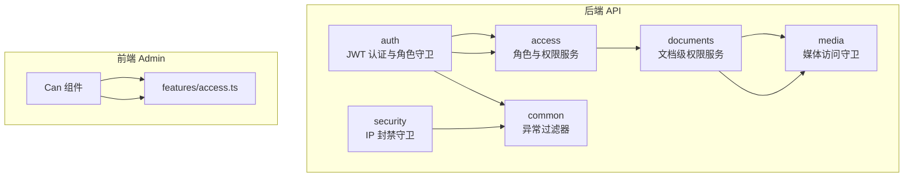
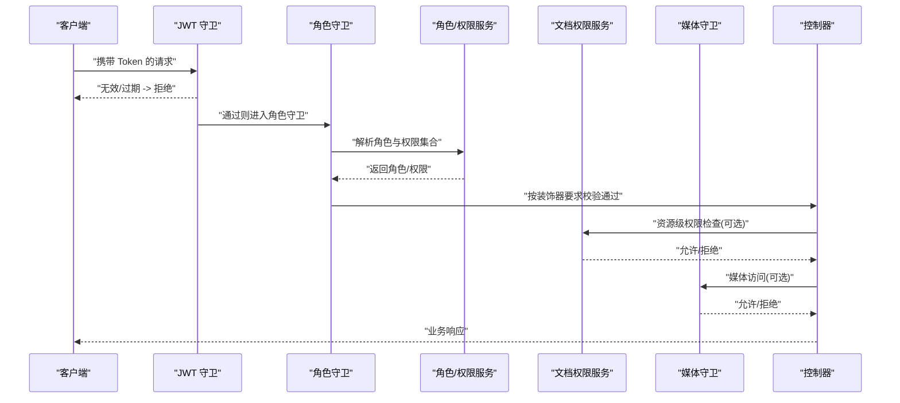
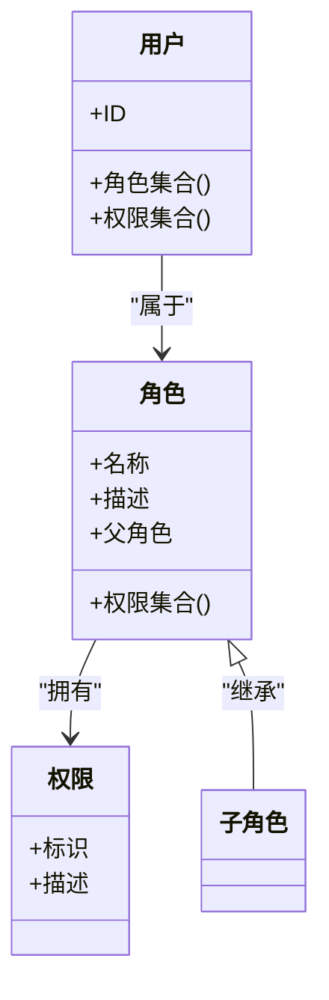
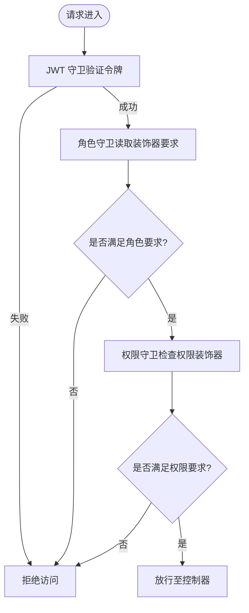
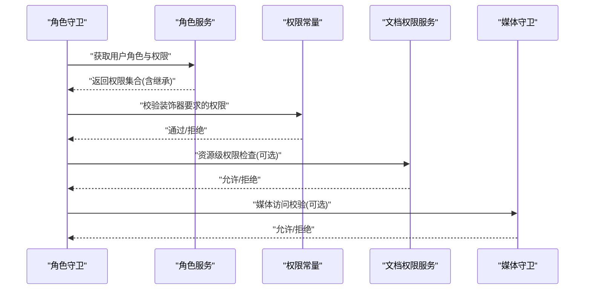
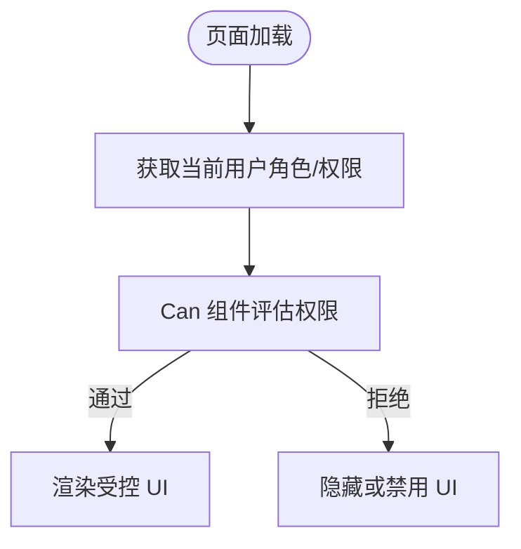
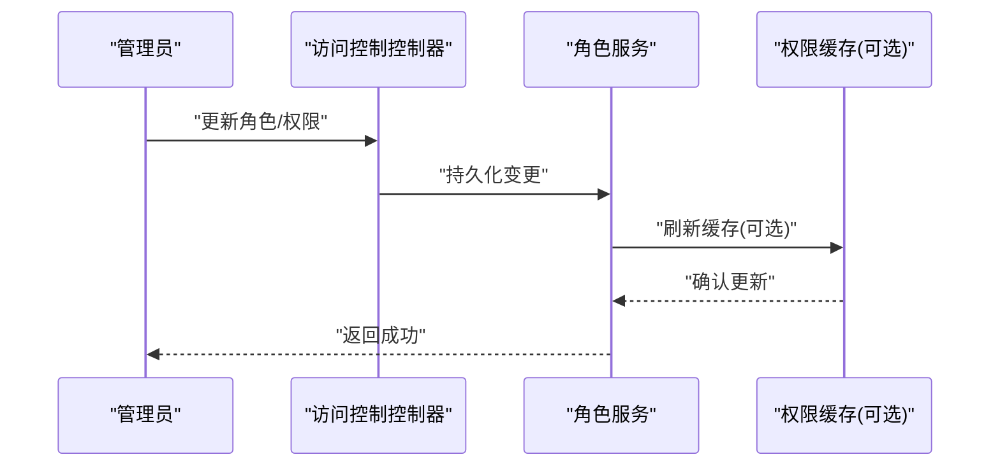
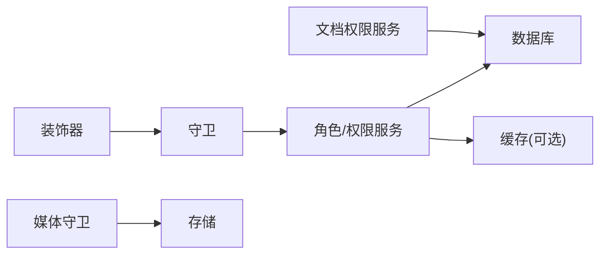

# 角色权限系统

<cite>
**本文引用的文件**   
- [apps/api/src/auth/decorators/roles.decorator.ts](file://apps/api/src/auth/decorators/roles.decorator.ts)
- [apps/api/src/auth/decorators/require-permissions.decorator.ts](file://apps/api/src/auth/decorators/require-permissions.decorator.ts)
- [apps/api/src/auth/guards/jwt-auth.guard.ts](file://apps/api/src/auth/guards/jwt-auth.guard.ts)
- [apps/api/src/auth/guards/roles.guard.ts](file://apps/api/src/auth/guards/roles.guard.ts)
- [apps/api/src/auth/strategies/jwt.strategy.ts](file://apps/api/src/auth/strategies/jwt.strategy.ts)
- [apps/api/src/auth/auth.service.ts](file://apps/api/src/auth/auth.service.ts)
- [apps/api/src/auth/roles.ts](file://apps/api/src/auth/roles.ts)
- [apps/api/src/access/permissions.ts](file://apps/api/src/access/permissions.ts)
- [apps/api/src/access/roles.service.ts](file://apps/api/src/access/roles.service.ts)
- [apps/api/src/access/access.controller.ts](file://apps/api/src/access/access.controller.ts)
- [apps/api/src/access/access.service.ts](file://apps/api/src/access/access.service.ts)
- [apps/api/src/access/dto/role.dto.ts](file://apps/api/src/access/dto/role.dto.ts)
- [apps/api/src/documents/document-permissions.service.ts](file://apps/api/src/documents/document-permissions.service.ts)
- [apps/api/src/media/media-guard.service.ts](file://apps/api/src/media/media-guard.service.ts)
- [apps/api/src/security/ip-ban.guard.ts](file://apps/api/src/security/ip-ban.guard.ts)
- [apps/api/src/common/filters/http-exception.filter.ts](file://apps/api/src/common/filters/http-exception.filter.ts)
- [apps/admin/src/components/Can.tsx](file://apps/admin/src/components/Can.tsx)
- [apps/admin/src/features/access.ts](file://apps/admin/src/features/access.ts)
</cite>

## 目录
1. [简介](#简介)
2. [项目结构](#项目结构)
3. [核心组件](#核心组件)
4. [架构总览](#架构总览)
5. [详细组件分析](#详细组件分析)
6. [依赖关系分析](#依赖关系分析)
7. [性能考虑](#性能考虑)
8. [故障排查指南](#故障排查指南)
9. [结论](#结论)
10. [附录](#附录)

## 简介
本文件系统性阐述基于角色的访问控制（RBAC）在系统中的实现与使用，覆盖角色定义、权限分配与继承、装饰器与守卫机制、权限检查流程、动态权限管理、缓存与性能优化策略，并提供配置示例与冲突解决指南。读者可据此快速理解并扩展权限体系，确保前后端一致的安全策略。

## 项目结构
权限相关代码主要分布在后端 NestJS 模块的 auth、access、documents、media 等子系统中，前端 Admin 应用通过组件与特性模块进行权限展示与操作。

**图示来源** 
- [apps/api/src/auth/guards/jwt-auth.guard.ts](file://apps/api/src/auth/guards/jwt-auth.guard.ts)
- [apps/api/src/auth/guards/roles.guard.ts](file://apps/api/src/auth/guards/roles.guard.ts)
- [apps/api/src/access/roles.service.ts](file://apps/api/src/access/roles.service.ts)
- [apps/api/src/access/permissions.ts](file://apps/api/src/access/permissions.ts)
- [apps/api/src/documents/document-permissions.service.ts](file://apps/api/src/documents/document-permissions.service.ts)
- [apps/api/src/media/media-guard.service.ts](file://apps/api/src/media/media-guard.service.ts)
- [apps/api/src/security/ip-ban.guard.ts](file://apps/api/src/security/ip-ban.guard.ts)
- [apps/api/src/common/filters/http-exception.filter.ts](file://apps/api/src/common/filters/http-exception.filter.ts)
- [apps/admin/src/components/Can.tsx](file://apps/admin/src/components/Can.tsx)
- [apps/admin/src/features/access.ts](file://apps/admin/src/features/access.ts)

**章节来源**
- [apps/api/src/auth/guards/jwt-auth.guard.ts](file://apps/api/src/auth/guards/jwt-auth.guard.ts)
- [apps/api/src/auth/guards/roles.guard.ts](file://apps/api/src/auth/guards/roles.guard.ts)
- [apps/api/src/access/roles.service.ts](file://apps/api/src/access/roles.service.ts)
- [apps/api/src/access/permissions.ts](file://apps/api/src/access/permissions.ts)
- [apps/api/src/documents/document-permissions.service.ts](file://apps/api/src/documents/document-permissions.service.ts)
- [apps/api/src/media/media-guard.service.ts](file://apps/api/src/media/media-guard.service.ts)
- [apps/api/src/security/ip-ban.guard.ts](file://apps/api/src/security/ip-ban.guard.ts)
- [apps/api/src/common/filters/http-exception.filter.ts](file://apps/api/src/common/filters/http-exception.filter.ts)
- [apps/admin/src/components/Can.tsx](file://apps/admin/src/components/Can.tsx)
- [apps/admin/src/features/access.ts](file://apps/admin/src/features/access.ts)

## 核心组件
- 角色与权限常量：集中定义角色枚举与权限标识，便于统一管理与跨层引用。
- 装饰器：用于声明式标注控制器或方法所需的角色与权限。
- 守卫：在请求处理前执行鉴权逻辑，包括 JWT 校验、角色匹配与权限检查。
- 服务：提供角色查询、权限计算、继承合并、资源级权限判断等能力。
- 前端组件：根据当前用户角色与权限渲染 UI 元素或隐藏不可见功能。

**章节来源**
- [apps/api/src/auth/roles.ts](file://apps/api/src/auth/roles.ts)
- [apps/api/src/access/permissions.ts](file://apps/api/src/access/permissions.ts)
- [apps/api/src/auth/decorators/roles.decorator.ts](file://apps/api/src/auth/decorators/roles.decorator.ts)
- [apps/api/src/auth/decorators/require-permissions.decorator.ts](file://apps/api/src/auth/decorators/require-permissions.decorator.ts)
- [apps/api/src/auth/guards/jwt-auth.guard.ts](file://apps/api/src/auth/guards/jwt-auth.guard.ts)
- [apps/api/src/auth/guards/roles.guard.ts](file://apps/api/src/auth/guards/roles.guard.ts)
- [apps/api/src/access/roles.service.ts](file://apps/api/src/access/roles.service.ts)
- [apps/admin/src/components/Can.tsx](file://apps/admin/src/components/Can.tsx)

## 架构总览
下图展示了从请求进入、JWT 校验、角色守卫到权限检查的整体流程，以及资源级权限与前端渲染的联动。

**图示来源** 
- [apps/api/src/auth/guards/jwt-auth.guard.ts](file://apps/api/src/auth/guards/jwt-auth.guard.ts)
- [apps/api/src/auth/guards/roles.guard.ts](file://apps/api/src/auth/guards/roles.guard.ts)
- [apps/api/src/access/roles.service.ts](file://apps/api/src/access/roles.service.ts)
- [apps/api/src/documents/document-permissions.service.ts](file://apps/api/src/documents/document-permissions.service.ts)
- [apps/api/src/media/media-guard.service.ts](file://apps/api/src/media/media-guard.service.ts)

## 详细组件分析

### 角色与权限模型
- 角色定义：以枚举形式集中管理，避免硬编码与不一致。
- 权限定义：细粒度操作标识，如“创建”“编辑”“删除”“查看”等，支持组合与继承。
- 继承关系：父角色包含子角色的全部权限，便于构建层级化角色体系。

**图示来源** 
- [apps/api/src/auth/roles.ts](file://apps/api/src/auth/roles.ts)
- [apps/api/src/access/permissions.ts](file://apps/api/src/access/permissions.ts)
- [apps/api/src/access/roles.service.ts](file://apps/api/src/access/roles.service.ts)

**章节来源**
- [apps/api/src/auth/roles.ts](file://apps/api/src/auth/roles.ts)
- [apps/api/src/access/permissions.ts](file://apps/api/src/access/permissions.ts)
- [apps/api/src/access/roles.service.ts](file://apps/api/src/access/roles.service.ts)

### 装饰器与守卫机制
- 角色装饰器：在控制器或方法上声明所需角色，守卫据此校验。
- 权限装饰器：声明所需权限标识，支持单个或多个权限的组合。
- JWT 守卫：验证令牌有效性并注入用户上下文。
- 角色守卫：结合装饰器与用户上下文进行角色/权限判定。

**图示来源** 
- [apps/api/src/auth/decorators/roles.decorator.ts](file://apps/api/src/auth/decorators/roles.decorator.ts)
- [apps/api/src/auth/decorators/require-permissions.decorator.ts](file://apps/api/src/auth/decorators/require-permissions.decorator.ts)
- [apps/api/src/auth/guards/jwt-auth.guard.ts](file://apps/api/src/auth/guards/jwt-auth.guard.ts)
- [apps/api/src/auth/guards/roles.guard.ts](file://apps/api/src/auth/guards/roles.guard.ts)

**章节来源**
- [apps/api/src/auth/decorators/roles.decorator.ts](file://apps/api/src/auth/decorators/roles.decorator.ts)
- [apps/api/src/auth/decorators/require-permissions.decorator.ts](file://apps/api/src/auth/decorators/require-permissions.decorator.ts)
- [apps/api/src/auth/guards/jwt-auth.guard.ts](file://apps/api/src/auth/guards/jwt-auth.guard.ts)
- [apps/api/src/auth/guards/roles.guard.ts](file://apps/api/src/auth/guards/roles.guard.ts)

### 权限检查与服务
- 角色服务：提供角色查询、权限合并、继承展开、动态更新能力。
- 权限常量：集中维护权限标识，供装饰器与服务调用。
- 资源级权限：针对文档等资源进行细粒度授权，支持对象级读写控制。
- 媒体守卫：对媒体访问进行额外权限校验，防止越权下载。

**图示来源** 
- [apps/api/src/access/roles.service.ts](file://apps/api/src/access/roles.service.ts)
- [apps/api/src/access/permissions.ts](file://apps/api/src/access/permissions.ts)
- [apps/api/src/documents/document-permissions.service.ts](file://apps/api/src/documents/document-permissions.service.ts)
- [apps/api/src/media/media-guard.service.ts](file://apps/api/src/media/media-guard.service.ts)

**章节来源**
- [apps/api/src/access/roles.service.ts](file://apps/api/src/access/roles.service.ts)
- [apps/api/src/access/permissions.ts](file://apps/api/src/access/permissions.ts)
- [apps/api/src/documents/document-permissions.service.ts](file://apps/api/src/documents/document-permissions.service.ts)
- [apps/api/src/media/media-guard.service.ts](file://apps/api/src/media/media-guard.service.ts)

### 前端权限渲染
- Can 组件：根据当前用户角色与权限决定是否渲染特定 UI。
- 特性模块：封装权限相关的业务逻辑与数据流，便于复用与维护。

**图示来源** 
- [apps/admin/src/components/Can.tsx](file://apps/admin/src/components/Can.tsx)
- [apps/admin/src/features/access.ts](file://apps/admin/src/features/access.ts)

**章节来源**
- [apps/admin/src/components/Can.tsx](file://apps/admin/src/components/Can.tsx)
- [apps/admin/src/features/access.ts](file://apps/admin/src/features/access.ts)

### 动态权限管理与配置示例
- 动态更新：通过角色服务接口修改角色与权限，实时生效于后续请求。
- 配置示例：在控制器上使用装饰器声明所需角色与权限；在服务中调用权限常量进行判断。
- 资源级配置：为文档设置不同用户的可见与编辑权限，支持继承与覆盖。

**图示来源** 
- [apps/api/src/access/access.controller.ts](file://apps/api/src/access/access.controller.ts)
- [apps/api/src/access/access.service.ts](file://apps/api/src/access/access.service.ts)
- [apps/api/src/access/dto/role.dto.ts](file://apps/api/src/access/dto/role.dto.ts)
- [apps/api/src/access/roles.service.ts](file://apps/api/src/access/roles.service.ts)

**章节来源**
- [apps/api/src/access/access.controller.ts](file://apps/api/src/access/access.controller.ts)
- [apps/api/src/access/access.service.ts](file://apps/api/src/access/access.service.ts)
- [apps/api/src/access/dto/role.dto.ts](file://apps/api/src/access/dto/role.dto.ts)
- [apps/api/src/access/roles.service.ts](file://apps/api/src/access/roles.service.ts)

## 依赖关系分析
- 低耦合高内聚：装饰器仅声明需求，守卫负责校验，服务专注权限计算，职责清晰。
- 外部依赖：数据库（角色与权限存储）、缓存（加速权限计算）、存储（媒体访问控制）。
- 潜在循环依赖：通过服务抽象与接口隔离避免循环导入。

**图示来源** 
- [apps/api/src/auth/decorators/roles.decorator.ts](file://apps/api/src/auth/decorators/roles.decorator.ts)
- [apps/api/src/auth/decorators/require-permissions.decorator.ts](file://apps/api/src/auth/decorators/require-permissions.decorator.ts)
- [apps/api/src/auth/guards/jwt-auth.guard.ts](file://apps/api/src/auth/guards/jwt-auth.guard.ts)
- [apps/api/src/auth/guards/roles.guard.ts](file://apps/api/src/auth/guards/roles.guard.ts)
- [apps/api/src/access/roles.service.ts](file://apps/api/src/access/roles.service.ts)
- [apps/api/src/documents/document-permissions.service.ts](file://apps/api/src/documents/document-permissions.service.ts)
- [apps/api/src/media/media-guard.service.ts](file://apps/api/src/media/media-guard.service.ts)

**章节来源**
- [apps/api/src/auth/decorators/roles.decorator.ts](file://apps/api/src/auth/decorators/roles.decorator.ts)
- [apps/api/src/auth/decorators/require-permissions.decorator.ts](file://apps/api/src/auth/decorators/require-permissions.decorator.ts)
- [apps/api/src/auth/guards/jwt-auth.guard.ts](file://apps/api/src/auth/guards/jwt-auth.guard.ts)
- [apps/api/src/auth/guards/roles.guard.ts](file://apps/api/src/auth/guards/roles.guard.ts)
- [apps/api/src/access/roles.service.ts](file://apps/api/src/access/roles.service.ts)
- [apps/api/src/documents/document-permissions.service.ts](file://apps/api/src/documents/document-permissions.service.ts)
- [apps/api/src/media/media-guard.service.ts](file://apps/api/src/media/media-guard.service.ts)

## 性能考虑
- 权限缓存：将用户角色与权限集合缓存至内存或 Redis，减少重复计算与数据库访问。
- 惰性加载：仅在需要时加载资源级权限，避免全量计算。
- 批量校验：对同一请求中的多个权限检查进行合并与短路求值。
- 前端缓存：缓存用户权限状态，降低频繁请求。

[本节为通用指导，不直接分析具体文件]

## 故障排查指南
- 常见错误：
  - 令牌无效或过期：检查 JWT 配置与客户端传递的 Token。
  - 角色缺失：确认用户是否被正确分配角色，装饰器要求是否匹配。
  - 权限不足：检查权限常量与装饰器声明是否一致。
  - 资源级拒绝：核对文档或媒体的权限配置是否正确。
- 定位步骤：
  - 启用日志记录，观察守卫与服务调用链。
  - 使用异常过滤器统一捕获并输出结构化错误信息。
  - 逐步缩小范围：先验证 JWT，再验证角色，最后验证权限。

**章节来源**
- [apps/api/src/common/filters/http-exception.filter.ts](file://apps/api/src/common/filters/http-exception.filter.ts)
- [apps/api/src/security/ip-ban.guard.ts](file://apps/api/src/security/ip-ban.guard.ts)

## 结论
本 RBAC 体系通过装饰器与守卫实现声明式鉴权，配合角色服务与资源级权限服务，形成从全局到对象的完整权限控制链路。借助缓存与惰性加载优化性能，并通过统一的异常过滤提升可观测性。建议持续完善权限常量与角色继承模型，确保前后端一致性与可扩展性。

[本节为总结，不直接分析具体文件]

## 附录
- 配置示例要点：
  - 在控制器或方法上使用角色与权限装饰器声明需求。
  - 在服务中使用权限常量进行判断，避免硬编码。
  - 为敏感资源（文档、媒体）配置细粒度权限。
- 冲突解决指南：
  - 明确优先级：资源级权限优先于全局权限，显式拒绝优于隐式允许。
  - 继承覆盖：子角色可覆盖父角色权限，但需谨慎设计以避免安全漏洞。
  - 审计与回滚：记录权限变更历史，支持快速回滚与审计追踪。

[本节为补充说明，不直接分析具体文件]