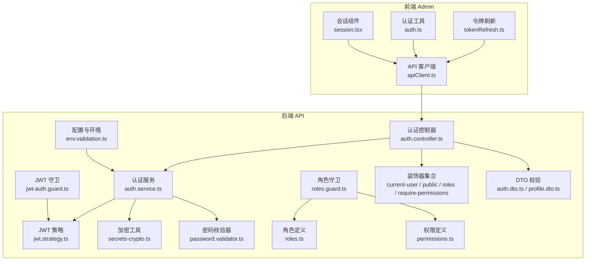
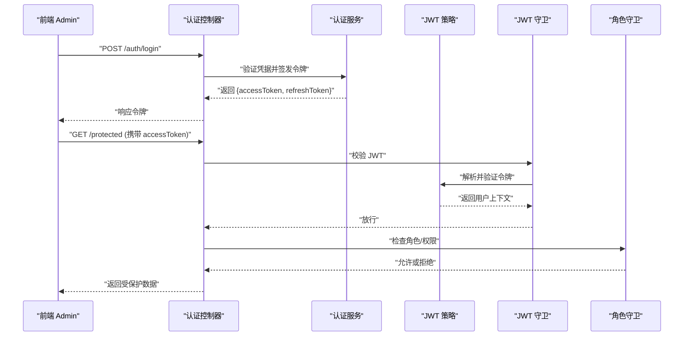
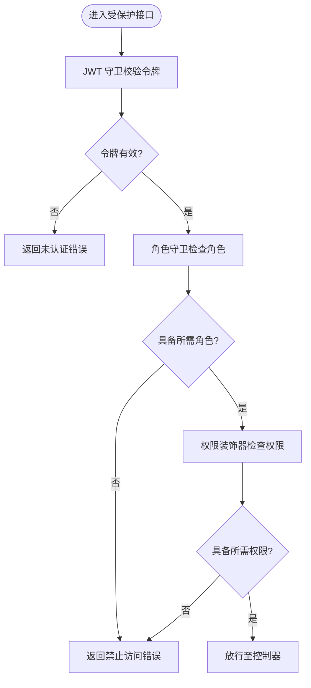
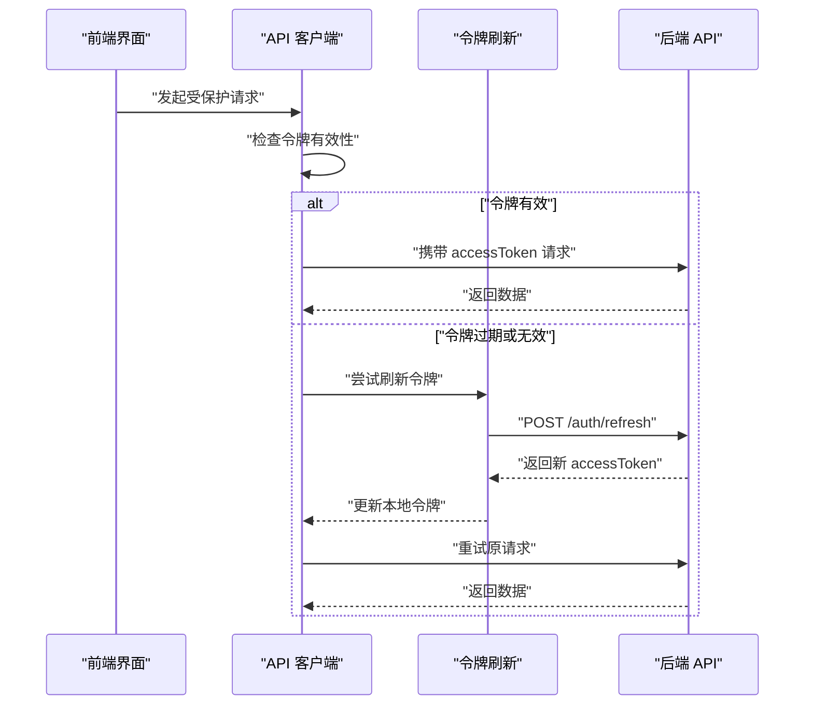
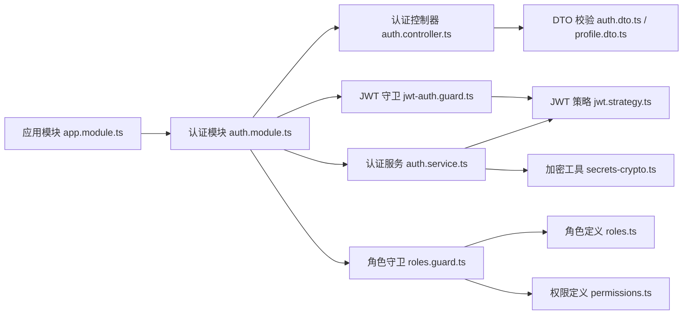

# 认证授权系统

<cite>
**本文引用的文件**   
- [auth.controller.ts](file://apps/api/src/auth/auth.controller.ts)
- [auth.service.ts](file://apps/api/src/auth/auth.service.ts)
- [jwt.strategy.ts](file://apps/api/src/auth/strategies/jwt.strategy.ts)
- [jwt-auth.guard.ts](file://apps/api/src/auth/guards/jwt-auth.guard.ts)
- [roles.guard.ts](file://apps/api/src/auth/guards/roles.guard.ts)
- [current-user.decorator.ts](file://apps/api/src/auth/decorators/current-user.decorator.ts)
- [public.decorator.ts](file://apps/api/src/auth/decorators/public.decorator.ts)
- [require-permissions.decorator.ts](file://apps/api/src/auth/decorators/require-permissions.decorator.ts)
- [roles.decorator.ts](file://apps/api/src/auth/decorators/roles.decorator.ts)
- [auth.module.ts](file://apps/api/src/auth/auth.module.ts)
- [app.module.ts](file://apps/api/src/app.module.ts)
- [env.validation.ts](file://apps/api/src/config/env.validation.ts)
- [secrets-crypto.ts](file://apps/api/src/common/crypto/secrets-crypto.ts)
- [password.validator.ts](file://apps/api/src/common/validators/password.validator.ts)
- [auth.dto.ts](file://apps/api/src/auth/dto/auth.dto.ts)
- [profile.dto.ts](file://apps/api/src/auth/dto/profile.dto.ts)
- [roles.ts](file://apps/api/src/auth/roles.ts)
- [permissions.ts](file://apps/api/src/access/permissions.ts)
- [tokenRefresh.ts](file://apps/admin/src/lib/tokenRefresh.ts)
- [apiClient.ts](file://apps/admin/src/lib/apiClient.ts)
- [auth.ts](file://apps/admin/src/lib/auth.ts)
- [session.tsx](file://apps/admin/src/components/session.tsx)
</cite>

## 目录
1. [简介](#简介)
2. [项目结构](#项目结构)
3. [核心组件](#核心组件)
4. [架构总览](#架构总览)
5. [详细组件分析](#详细组件分析)
6. [依赖关系分析](#依赖关系分析)
7. [性能考量](#性能考量)
8. [故障排查指南](#故障排查指南)
9. [结论](#结论)
10. [附录](#附录)

## 简介
本文件面向认证与授权子系统，围绕基于 JWT 的用户身份验证、登录流程、令牌签发与校验、会话管理、角色权限模型、装饰器与守卫机制、访问控制策略、密码加密与安全最佳实践、常见攻击防护以及集成示例与故障排查进行系统化说明。文档以代码仓库中的实际实现为依据，帮助开发者快速理解并安全地扩展该能力。

## 项目结构
认证授权相关代码主要分布在后端 NestJS 模块 apps/api/src/auth 及其周边（guards、decorators、strategies、dto），前端 Next.js 应用 apps/admin/src/lib 中负责令牌刷新与请求封装。整体采用前后端分离架构：前端通过 HTTP API 调用后端认证接口，使用 JWT 作为无状态令牌；后端通过 Passport + JWT Strategy 完成鉴权，结合自定义 Guard 与 Decorator 实现细粒度权限控制。

**图示来源** 
- [auth.controller.ts](file://apps/api/src/auth/auth.controller.ts)
- [auth.service.ts](file://apps/api/src/auth/auth.service.ts)
- [jwt.strategy.ts](file://apps/api/src/auth/strategies/jwt.strategy.ts)
- [jwt-auth.guard.ts](file://apps/api/src/auth/guards/jwt-auth.guard.ts)
- [roles.guard.ts](file://apps/api/src/auth/guards/roles.guard.ts)
- [current-user.decorator.ts](file://apps/api/src/auth/decorators/current-user.decorator.ts)
- [public.decorator.ts](file://apps/api/src/auth/decorators/public.decorator.ts)
- [require-permissions.decorator.ts](file://apps/api/src/auth/decorators/require-permissions.decorator.ts)
- [roles.decorator.ts](file://apps/api/src/auth/decorators/roles.decorator.ts)
- [auth.dto.ts](file://apps/api/src/auth/dto/auth.dto.ts)
- [profile.dto.ts](file://apps/api/src/auth/dto/profile.dto.ts)
- [roles.ts](file://apps/api/src/auth/roles.ts)
- [permissions.ts](file://apps/api/src/access/permissions.ts)
- [env.validation.ts](file://apps/api/src/config/env.validation.ts)
- [secrets-crypto.ts](file://apps/api/src/common/crypto/secrets-crypto.ts)
- [password.validator.ts](file://apps/api/src/common/validators/password.validator.ts)
- [apiClient.ts](file://apps/admin/src/lib/apiClient.ts)
- [tokenRefresh.ts](file://apps/admin/src/lib/tokenRefresh.ts)
- [auth.ts](file://apps/admin/src/lib/auth.ts)
- [session.tsx](file://apps/admin/src/components/session.tsx)

**章节来源**
- [auth.controller.ts](file://apps/api/src/auth/auth.controller.ts)
- [auth.service.ts](file://apps/api/src/auth/auth.service.ts)
- [jwt.strategy.ts](file://apps/api/src/auth/strategies/jwt.strategy.ts)
- [jwt-auth.guard.ts](file://apps/api/src/auth/guards/jwt-auth.guard.ts)
- [roles.guard.ts](file://apps/api/src/auth/guards/roles.guard.ts)
- [current-user.decorator.ts](file://apps/api/src/auth/decorators/current-user.decorator.ts)
- [public.decorator.ts](file://apps/api/src/auth/decorators/public.decorator.ts)
- [require-permissions.decorator.ts](file://apps/api/src/auth/decorators/require-permissions.decorator.ts)
- [roles.decorator.ts](file://apps/api/src/auth/decorators/roles.decorator.ts)
- [auth.dto.ts](file://apps/api/src/auth/dto/auth.dto.ts)
- [profile.dto.ts](file://apps/api/src/auth/dto/profile.dto.ts)
- [roles.ts](file://apps/api/src/auth/roles.ts)
- [permissions.ts](file://apps/api/src/access/permissions.ts)
- [env.validation.ts](file://apps/api/src/config/env.validation.ts)
- [secrets-crypto.ts](file://apps/api/src/common/crypto/secrets-crypto.ts)
- [password.validator.ts](file://apps/api/src/common/validators/password.validator.ts)
- [apiClient.ts](file://apps/admin/src/lib/apiClient.ts)
- [tokenRefresh.ts](file://apps/admin/src/lib/tokenRefresh.ts)
- [auth.ts](file://apps/admin/src/lib/auth.ts)
- [session.tsx](file://apps/admin/src/components/session.tsx)

## 核心组件
- 认证控制器：提供登录、登出、获取当前用户等 HTTP 接口，接收 DTO 并进行基础校验。
- 认证服务：封装业务逻辑，包括用户查询、密码比对、JWT 签发与刷新、会话信息组装。
- JWT 策略：从请求头解析并验证 JWT，将用户信息注入到上下文。
- JWT 守卫：保护路由，确保请求携带有效令牌。
- 角色守卫：基于角色或权限进行访问控制，配合装饰器实现细粒度授权。
- 装饰器：
  - current-user：注入当前已认证用户对象。
  - public：标记公开接口，跳过鉴权。
  - roles：声明所需角色。
  - require-permissions：声明所需权限。
- DTO：对输入参数进行结构化校验与类型约束。
- 环境配置：集中管理密钥、过期时间等敏感配置。
- 加密与校验：密码哈希、强度校验等安全工具。

**章节来源**
- [auth.controller.ts](file://apps/api/src/auth/auth.controller.ts)
- [auth.service.ts](file://apps/api/src/auth/auth.service.ts)
- [jwt.strategy.ts](file://apps/api/src/auth/strategies/jwt.strategy.ts)
- [jwt-auth.guard.ts](file://apps/api/src/auth/guards/jwt-auth.guard.ts)
- [roles.guard.ts](file://apps/api/src/auth/guards/roles.guard.ts)
- [current-user.decorator.ts](file://apps/api/src/auth/decorators/current-user.decorator.ts)
- [public.decorator.ts](file://apps/api/src/auth/decorators/public.decorator.ts)
- [require-permissions.decorator.ts](file://apps/api/src/auth/decorators/require-permissions.decorator.ts)
- [roles.decorator.ts](file://apps/api/src/auth/decorators/roles.decorator.ts)
- [auth.dto.ts](file://apps/api/src/auth/dto/auth.dto.ts)
- [profile.dto.ts](file://apps/api/src/auth/dto/profile.dto.ts)
- [env.validation.ts](file://apps/api/src/config/env.validation.ts)
- [secrets-crypto.ts](file://apps/api/src/common/crypto/secrets-crypto.ts)
- [password.validator.ts](file://apps/api/src/common/validators/password.validator.ts)

## 架构总览
下图展示了从前端发起登录到后端签发 JWT，再到受保护资源访问的完整序列。

**图示来源** 
- [auth.controller.ts](file://apps/api/src/auth/auth.controller.ts)
- [auth.service.ts](file://apps/api/src/auth/auth.service.ts)
- [jwt.strategy.ts](file://apps/api/src/auth/strategies/jwt.strategy.ts)
- [jwt-auth.guard.ts](file://apps/api/src/auth/guards/jwt-auth.guard.ts)
- [roles.guard.ts](file://apps/api/src/auth/guards/roles.guard.ts)

## 详细组件分析

### 认证控制器（登录与用户信息）
- 职责：暴露登录、登出、获取当前用户等接口；接收并校验 DTO；调用认证服务完成业务处理。
- 关键点：
  - 登录接口：校验用户名/密码，成功后返回访问令牌与可选刷新令牌。
  - 当前用户接口：在已认证上下文中返回用户基本信息。
  - 公开接口：通过装饰器标记无需鉴权的接口。
- 错误处理：统一异常过滤器捕获非法输入、认证失败等错误并返回标准格式。

**章节来源**
- [auth.controller.ts](file://apps/api/src/auth/auth.controller.ts)
- [auth.dto.ts](file://apps/api/src/auth/dto/auth.dto.ts)
- [public.decorator.ts](file://apps/api/src/auth/decorators/public.decorator.ts)

### 认证服务（业务逻辑与令牌签发）
- 职责：用户凭证校验、密码比对、JWT 签发与刷新、用户信息组装。
- 关键点：
  - 密码比对：使用安全的哈希算法进行比对。
  - 令牌生成：包含用户标识、角色、权限等必要载荷，设置合理过期时间。
  - 刷新令牌：支持前端在访问令牌过期前刷新，避免频繁重新登录。
- 安全要点：
  - 密钥管理：从环境变量读取，避免硬编码。
  - 最小化载荷：仅包含必要信息，降低泄露风险。

**章节来源**
- [auth.service.ts](file://apps/api/src/auth/auth.service.ts)
- [secrets-crypto.ts](file://apps/api/src/common/crypto/secrets-crypto.ts)
- [env.validation.ts](file://apps/api/src/config/env.validation.ts)

### JWT 策略（令牌解析与用户注入）
- 职责：从请求头提取 JWT，验证签名与有效期，将用户信息注入到请求上下文。
- 关键点：
  - 解析位置：通常从 Authorization 头部读取 Bearer Token。
  - 失败处理：无效或过期令牌触发未认证异常。
  - 上下文注入：后续守卫与控制器可通过装饰器获取用户。

**章节来源**
- [jwt.strategy.ts](file://apps/api/src/auth/strategies/jwt.strategy.ts)

### JWT 守卫（认证拦截）
- 职责：保护路由，确保请求携带有效 JWT。
- 关键点：
  - 白名单：通过公开装饰器跳过鉴权。
  - 异常处理：未认证时返回标准错误码。

**章节来源**
- [jwt-auth.guard.ts](file://apps/api/src/auth/guards/jwt-auth.guard.ts)
- [public.decorator.ts](file://apps/api/src/auth/decorators/public.decorator.ts)

### 角色守卫与权限控制
- 职责：基于角色与权限进行访问控制，配合装饰器实现细粒度授权。
- 关键点：
  - 角色守卫：检查用户是否具备指定角色。
  - 权限装饰器：声明接口所需的权限集合，守卫逐一校验。
  - 角色定义：集中维护角色枚举与映射。
  - 权限定义：集中维护权限点与资源映射。

**图示来源** 
- [roles.guard.ts](file://apps/api/src/auth/guards/roles.guard.ts)
- [roles.decorator.ts](file://apps/api/src/auth/decorators/roles.decorator.ts)
- [require-permissions.decorator.ts](file://apps/api/src/auth/decorators/require-permissions.decorator.ts)
- [roles.ts](file://apps/api/src/auth/roles.ts)
- [permissions.ts](file://apps/api/src/access/permissions.ts)

**章节来源**
- [roles.guard.ts](file://apps/api/src/auth/guards/roles.guard.ts)
- [roles.decorator.ts](file://apps/api/src/auth/decorators/roles.decorator.ts)
- [require-permissions.decorator.ts](file://apps/api/src/auth/decorators/require-permissions.decorator.ts)
- [roles.ts](file://apps/api/src/auth/roles.ts)
- [permissions.ts](file://apps/api/src/access/permissions.ts)

### 装饰器与上下文注入
- current-user：在控制器方法中直接注入当前用户对象，简化业务逻辑。
- public：标记公开接口，跳过 JWT 守卫。
- roles：声明所需角色，供角色守卫校验。
- require-permissions：声明所需权限，供权限守卫校验。

**章节来源**
- [current-user.decorator.ts](file://apps/api/src/auth/decorators/current-user.decorator.ts)
- [public.decorator.ts](file://apps/api/src/auth/decorators/public.decorator.ts)
- [roles.decorator.ts](file://apps/api/src/auth/decorators/roles.decorator.ts)
- [require-permissions.decorator.ts](file://apps/api/src/auth/decorators/require-permissions.decorator.ts)

### DTO 与输入校验
- auth.dto：登录请求体结构，包含用户名、密码等字段及校验规则。
- profile.dto：用户资料更新请求体结构，包含字段校验与类型约束。
- 作用：统一输入校验，减少控制器中的重复逻辑，提升安全性与可维护性。

**章节来源**
- [auth.dto.ts](file://apps/api/src/auth/dto/auth.dto.ts)
- [profile.dto.ts](file://apps/api/src/auth/dto/profile.dto.ts)

### 密码加密与安全校验
- secrets-crypto：集中管理加密相关工具与密钥读取。
- password.validator：密码强度校验，防止弱口令。
- 最佳实践：
  - 使用强哈希算法（如 bcrypt/scrypt）存储密码。
  - 不在日志中输出敏感信息。
  - 定期轮换密钥与令牌过期策略。

**章节来源**
- [secrets-crypto.ts](file://apps/api/src/common/crypto/secrets-crypto.ts)
- [password.validator.ts](file://apps/api/src/common/validators/password.validator.ts)

### 前端集成与令牌刷新
- apiClient：封装 HTTP 请求，自动附加 Authorization 头。
- tokenRefresh：在访问令牌即将过期时主动刷新，保证用户体验。
- auth：前端认证工具函数，管理本地令牌与状态。
- session：会话组件，展示当前用户信息与退出操作。

**图示来源** 
- [apiClient.ts](file://apps/admin/src/lib/apiClient.ts)
- [tokenRefresh.ts](file://apps/admin/src/lib/tokenRefresh.ts)
- [auth.ts](file://apps/admin/src/lib/auth.ts)
- [session.tsx](file://apps/admin/src/components/session.tsx)

**章节来源**
- [apiClient.ts](file://apps/admin/src/lib/apiClient.ts)
- [tokenRefresh.ts](file://apps/admin/src/lib/tokenRefresh.ts)
- [auth.ts](file://apps/admin/src/lib/auth.ts)
- [session.tsx](file://apps/admin/src/components/session.tsx)

## 依赖关系分析
- 模块装配：认证模块在应用模块中注册，确保全局可用。
- 依赖链：控制器依赖服务，服务依赖策略与加密工具，守卫依赖策略与装饰器。
- 外部依赖：NestJS、Passport、JWT、Prisma（若涉及用户数据）、环境变量校验库。

**图示来源** 
- [app.module.ts](file://apps/api/src/app.module.ts)
- [auth.module.ts](file://apps/api/src/auth/auth.module.ts)
- [auth.controller.ts](file://apps/api/src/auth/auth.controller.ts)
- [auth.service.ts](file://apps/api/src/auth/auth.service.ts)
- [jwt.strategy.ts](file://apps/api/src/auth/strategies/jwt.strategy.ts)
- [secrets-crypto.ts](file://apps/api/src/common/crypto/secrets-crypto.ts)
- [jwt-auth.guard.ts](file://apps/api/src/auth/guards/jwt-auth.guard.ts)
- [roles.guard.ts](file://apps/api/src/auth/guards/roles.guard.ts)
- [roles.ts](file://apps/api/src/auth/roles.ts)
- [permissions.ts](file://apps/api/src/access/permissions.ts)
- [auth.dto.ts](file://apps/api/src/auth/dto/auth.dto.ts)
- [profile.dto.ts](file://apps/api/src/auth/dto/profile.dto.ts)

**章节来源**
- [app.module.ts](file://apps/api/src/app.module.ts)
- [auth.module.ts](file://apps/api/src/auth/auth.module.ts)

## 性能考量
- 令牌大小：尽量精简 JWT 载荷，减少网络传输开销。
- 刷新策略：前端在令牌接近过期时主动刷新，避免阻塞请求。
- 缓存策略：对非敏感用户信息可在前端短期缓存，减少重复请求。
- 服务端校验：JWT 校验为无状态操作，避免额外数据库查询，提高吞吐。

[本节为通用指导，不直接分析具体文件]

## 故障排查指南
- 登录失败
  - 检查 DTO 校验是否通过，确认用户名与密码格式。
  - 查看认证服务中的用户查询与密码比对逻辑。
- 未认证错误
  - 确认请求头是否正确携带 Authorization: Bearer <token>。
  - 检查 JWT 守卫与策略是否生效，确认令牌未过期且签名正确。
- 禁止访问
  - 检查角色守卫与权限装饰器声明是否符合用户角色与权限。
  - 确认角色与权限定义是否与用户数据一致。
- 令牌刷新失败
  - 检查刷新接口是否启用，刷新令牌是否有效。
  - 确认前端刷新逻辑是否在合适时机触发。
- 安全告警
  - 检查密钥是否从环境变量读取，避免硬编码。
  - 确认密码哈希算法与强度校验已启用。

**章节来源**
- [auth.controller.ts](file://apps/api/src/auth/auth.controller.ts)
- [auth.service.ts](file://apps/api/src/auth/auth.service.ts)
- [jwt.strategy.ts](file://apps/api/src/auth/strategies/jwt.strategy.ts)
- [jwt-auth.guard.ts](file://apps/api/src/auth/guards/jwt-auth.guard.ts)
- [roles.guard.ts](file://apps/api/src/auth/guards/roles.guard.ts)
- [tokenRefresh.ts](file://apps/admin/src/lib/tokenRefresh.ts)
- [apiClient.ts](file://apps/admin/src/lib/apiClient.ts)

## 结论
本认证授权系统基于 JWT 实现了无状态的身份验证与灵活的权限控制。通过守卫与装饰器的组合，能够以声明式方式管理访问策略；结合严格的输入校验、密码加密与密钥管理，满足生产环境的安全要求。前端通过令牌刷新与请求封装提升了用户体验与健壮性。建议在生产部署中持续监控安全事件，定期审计权限模型与密钥轮换策略。

[本节为总结性内容，不直接分析具体文件]

## 附录
- 安全最佳实践
  - 使用强哈希算法存储密码，禁用明文存储。
  - 限制令牌生命周期，启用刷新令牌机制。
  - 对所有输入进行严格校验，防止注入与越权。
  - 最小化 JWT 载荷，避免敏感信息泄露。
  - 启用 HTTPS，防止中间人攻击。
  - 记录关键安全事件，便于审计与溯源。
- 常见攻击防护
  - CSRF：对敏感操作启用同源策略与 CSRF Token。
  - XSS：对用户输入进行转义与白名单过滤。
  - 暴力破解：实施速率限制与账户锁定策略。
  - 重放攻击：使用一次性令牌或时间戳校验。

[本节为通用指导，不直接分析具体文件]