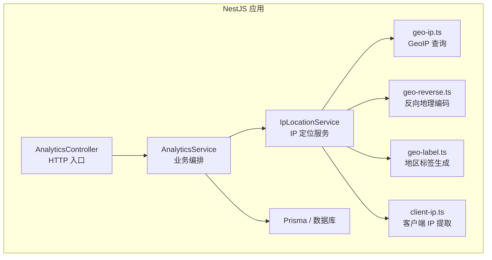
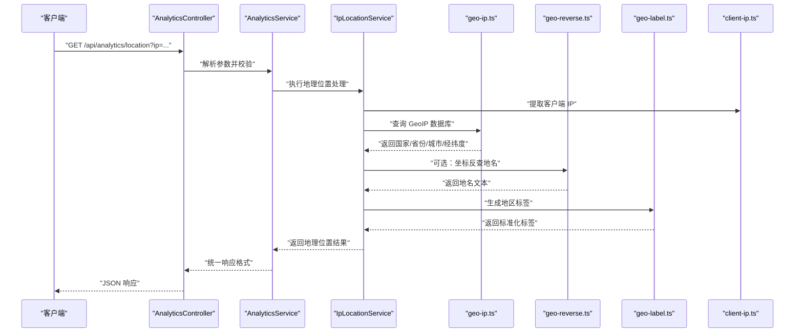
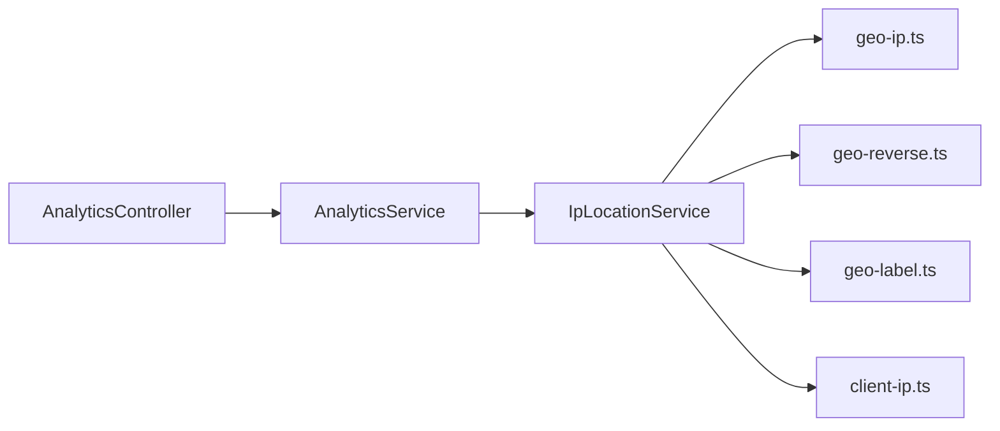

# 地理位置服务

<cite>
**本文引用的文件**   
- [analytics.controller.ts](file://apps/api/src/analytics/analytics.controller.ts)
- [analytics.service.ts](file://apps/api/src/analytics/analytics.service.ts)
- [ip-location.service.ts](file://apps/api/src/analytics/ip-location.service.ts)
- [geo-ip.ts](file://apps/api/src/analytics/utils/geo-ip.ts)
- [geo-reverse.ts](file://apps/api/src/analytics/utils/geo-reverse.ts)
- [geo-label.ts](file://apps/api/src/analytics/utils/geo-label.ts)
- [client-ip.ts](file://apps/api/src/analytics/utils/client-ip.ts)
- [schema.prisma](file://apps/api/prisma/schema.prisma)
- [env.validation.ts](file://apps/api/src/config/env.validation.ts)
</cite>

## 目录
1. [简介](#简介)
2. [项目结构](#项目结构)
3. [核心组件](#核心组件)
4. [架构总览](#架构总览)
5. [详细组件分析](#详细组件分析)
6. [依赖关系分析](#依赖关系分析)
7. [性能考虑](#性能考虑)
8. [故障排查指南](#故障排查指南)
9. [结论](#结论)
10. [附录：API 接口与使用示例](#附录api-接口与使用示例)

## 简介
本文件面向“地理位置服务”的完整说明，覆盖以下能力：
- IP 地址地理定位（国家、省份、城市）
- 反向地理编码（坐标到地名）
- 地区标签生成（用于分析与展示）
- GeoIP 数据库的使用方式、缓存策略与精度优化
- 多语言地区名称支持
- 地理位置相关 API 接口与使用示例

该服务位于后端 NestJS 应用（apps/api）中，通过控制器暴露 REST 接口，由服务层协调工具模块完成 IP 解析、GeoIP 查询、反向地理编码与标签生成。

## 项目结构
地理位置功能主要分布在 analytics 模块及其 utils 子目录：
- 控制器：提供 HTTP 端点
- 服务：编排业务逻辑与外部依赖
- 工具：封装 IP 提取、GeoIP、反向地理编码、标签生成等能力
- 数据模型：Prisma schema 定义访客与地理位置相关字段
- 配置：环境变量校验与加载

图表来源
- [analytics.controller.ts](file://apps/api/src/analytics/analytics.controller.ts)
- [analytics.service.ts](file://apps/api/src/analytics/analytics.service.ts)
- [ip-location.service.ts](file://apps/api/src/analytics/ip-location.service.ts)
- [geo-ip.ts](file://apps/api/src/analytics/utils/geo-ip.ts)
- [geo-reverse.ts](file://apps/api/src/analytics/utils/geo-reverse.ts)
- [geo-label.ts](file://apps/api/src/analytics/utils/geo-label.ts)
- [client-ip.ts](file://apps/api/src/analytics/utils/client-ip.ts)

章节来源
- [analytics.controller.ts](file://apps/api/src/analytics/analytics.controller.ts)
- [analytics.service.ts](file://apps/api/src/analytics/analytics.service.ts)
- [ip-location.service.ts](file://apps/api/src/analytics/ip-location.service.ts)
- [geo-ip.ts](file://apps/api/src/analytics/utils/geo-ip.ts)
- [geo-reverse.ts](file://apps/api/src/analytics/utils/geo-reverse.ts)
- [geo-label.ts](file://apps/api/src/analytics/utils/geo-label.ts)
- [client-ip.ts](file://apps/api/src/analytics/utils/client-ip.ts)

## 核心组件
- 控制器层（AnalyticsController）
  - 暴露地理位置相关的 REST 接口，接收请求参数并返回结构化结果
- 服务层（AnalyticsService、IpLocationService）
  - AnalyticsService：聚合分析场景下的地理位置信息
  - IpLocationService：负责 IP 定位、反向地理编码、标签生成与缓存
- 工具层
  - geo-ip.ts：基于 GeoIP 数据库进行 IP→国家/省份/城市/经纬度 解析
  - geo-reverse.ts：经纬度→地名（省市区）的反向地理编码
  - geo-label.ts：将解析结果标准化为地区标签（如“中国-广东省-深圳市”）
  - client-ip.ts：从请求头或代理链中提取真实客户端 IP
- 数据与配置
  - Prisma schema：存储访客、访问记录及地理位置摘要
  - env.validation.ts：校验 GeoIP 路径、第三方 API Key、缓存开关等环境变量

章节来源
- [analytics.controller.ts](file://apps/api/src/analytics/analytics.controller.ts)
- [analytics.service.ts](file://apps/api/src/analytics/analytics.service.ts)
- [ip-location.service.ts](file://apps/api/src/analytics/ip-location.service.ts)
- [geo-ip.ts](file://apps/api/src/analytics/utils/geo-ip.ts)
- [geo-reverse.ts](file://apps/api/src/analytics/utils/geo-reverse.ts)
- [geo-label.ts](file://apps/api/src/analytics/utils/geo-label.ts)
- [client-ip.ts](file://apps/api/src/analytics/utils/client-ip.ts)
- [schema.prisma](file://apps/api/prisma/schema.prisma)
- [env.validation.ts](file://apps/api/src/config/env.validation.ts)

## 架构总览
下图展示了地理位置服务的整体调用链路：客户端请求经控制器进入服务层，再由 IpLocationService 协调工具模块完成 IP 提取、GeoIP 查询、反向地理编码与标签生成，最终返回给调用方。

图表来源
- [analytics.controller.ts](file://apps/api/src/analytics/analytics.controller.ts)
- [analytics.service.ts](file://apps/api/src/analytics/analytics.service.ts)
- [ip-location.service.ts](file://apps/api/src/analytics/ip-location.service.ts)
- [geo-ip.ts](file://apps/api/src/analytics/utils/geo-ip.ts)
- [geo-reverse.ts](file://apps/api/src/analytics/utils/geo-reverse.ts)
- [geo-label.ts](file://apps/api/src/analytics/utils/geo-label.ts)
- [client-ip.ts](file://apps/api/src/analytics/utils/client-ip.ts)

## 详细组件分析

### IP 地址地理定位（GeoIP）
- 目标
  - 根据 IP 地址获取国家、省份、城市、经纬度等地理信息
- 实现要点
  - 使用 geo-ip.ts 提供的查询方法，读取本地 GeoIP 数据库文件
  - 对无效 IP、未命中结果进行容错处理
  - 结合 client-ip.ts 获取真实客户端 IP（考虑代理、X-Forwarded-For 等）
- 数据结构与复杂度
  - 典型返回对象包含：country、province、city、latitude、longitude
  - 时间复杂度取决于 GeoIP 库实现；空间复杂度受数据库文件大小影响
- 错误处理
  - 非法 IP 输入、数据库缺失、查询超时等异常需捕获并降级返回空值或默认值

章节来源
- [geo-ip.ts](file://apps/api/src/analytics/utils/geo-ip.ts)
- [client-ip.ts](file://apps/api/src/analytics/utils/client-ip.ts)

### 反向地理编码（坐标→地名）
- 目标
  - 将经纬度转换为可读的地名（省市区），增强展示效果
- 实现要点
  - 使用 geo-reverse.ts 提供的反查方法，调用第三方地理编码服务
  - 支持失败重试与超时控制
  - 对无结果或模糊匹配结果进行回退策略（如仅返回国家/省份）
- 多语言支持
  - 根据请求语言或系统设置选择返回语言版本的地名

章节来源
- [geo-reverse.ts](file://apps/api/src/analytics/utils/geo-reverse.ts)

### 地区标签生成
- 目标
  - 将国家/省份/城市等信息组合为标准化的地区标签字符串
- 实现要点
  - 使用 geo-label.ts 生成“国家-省份-城市”格式的标签
  - 支持按区域层级裁剪（如仅显示国家或国家+省份）
  - 支持多语言地区名称拼接
- 应用场景
  - 访客画像、流量统计、地图可视化、报表筛选

章节来源
- [geo-label.ts](file://apps/api/src/analytics/utils/geo-label.ts)

### 客户端 IP 提取
- 目标
  - 从 HTTP 请求中可靠地提取真实客户端 IP
- 实现要点
  - 优先信任可信代理头（如 X-Forwarded-For、CF-Connecting-IP）
  - 对伪造或循环引用进行防护
  - 回退到 socket.remoteAddress 作为最后手段

章节来源
- [client-ip.ts](file://apps/api/src/analytics/utils/client-ip.ts)

### 服务编排与控制器
- AnalyticsController
  - 暴露地理位置查询接口，参数包括 ip、lang、precision 等
  - 统一响应格式，包含状态码、消息体与数据体
- AnalyticsService
  - 聚合多个工具方法，组织业务流程
  - 可集成缓存、日志、指标上报等横切关注点
- IpLocationService
  - 封装 IP 定位、反向地理编码、标签生成的核心逻辑
  - 管理 GeoIP 数据库路径、第三方 API Key、缓存键与过期策略

章节来源
- [analytics.controller.ts](file://apps/api/src/analytics/analytics.controller.ts)
- [analytics.service.ts](file://apps/api/src/analytics/analytics.service.ts)
- [ip-location.service.ts](file://apps/api/src/analytics/ip-location.service.ts)

## 依赖关系分析
- 模块内依赖
  - 控制器依赖服务，服务依赖 IpLocationService，IpLocationService 依赖工具模块
- 外部依赖
  - GeoIP 数据库文件（本地磁盘）
  - 第三方地理编码服务（可选）
  - 缓存层（可选，如内存或 Redis）
- 潜在风险
  - 循环依赖：确保工具模块不反向依赖服务层
  - 外部服务不可用：增加降级与熔断策略
  - 数据库文件过大：按需分片或更新频率控制

图表来源
- [analytics.controller.ts](file://apps/api/src/analytics/analytics.controller.ts)
- [analytics.service.ts](file://apps/api/src/analytics/analytics.service.ts)
- [ip-location.service.ts](file://apps/api/src/analytics/ip-location.service.ts)
- [geo-ip.ts](file://apps/api/src/analytics/utils/geo-ip.ts)
- [geo-reverse.ts](file://apps/api/src/analytics/utils/geo-reverse.ts)
- [geo-label.ts](file://apps/api/src/analytics/utils/geo-label.ts)
- [client-ip.ts](file://apps/api/src/analytics/utils/client-ip.ts)

章节来源
- [analytics.controller.ts](file://apps/api/src/analytics/analytics.controller.ts)
- [analytics.service.ts](file://apps/api/src/analytics/analytics.service.ts)
- [ip-location.service.ts](file://apps/api/src/analytics/ip-location.service.ts)

## 性能考虑
- GeoIP 数据库
  - 使用二进制索引格式（如 .mmdb）提升查询速度
  - 启动时预加载至内存，避免频繁 IO
  - 定期更新数据库以维持准确性
- 缓存策略
  - 对相同 IP 的查询结果进行短期缓存（TTL 建议 5–15 分钟）
  - 缓存键包含语言与精度参数，避免跨语言污染
  - 大流量场景下可使用分布式缓存（Redis）
- 反向地理编码
  - 对坐标反查结果进行缓存，降低第三方 API 调用次数
  - 失败重试采用指数退避，避免雪崩
- 精度优化
  - 根据业务需求选择不同精度的 GeoIP 库（城市级 vs 国家/省份级）
  - 对移动网络与 CDN 节点 IP 做特殊处理，必要时回退到国家级别

[本节为通用指导，无需具体文件来源]

## 故障排查指南
- 常见问题
  - GeoIP 数据库缺失或路径错误：检查环境变量与部署路径
  - 第三方地理编码服务超时或限流：增加重试与降级逻辑
  - 客户端 IP 被代理篡改：校验可信代理链与头部白名单
  - 缓存不一致：清理缓存并重新加载数据库
- 诊断步骤
  - 启用调试日志，记录 IP 提取、GeoIP 查询、反查与标签生成过程
  - 验证环境变量配置是否正确加载
  - 检查数据库文件完整性与版本一致性

章节来源
- [env.validation.ts](file://apps/api/src/config/env.validation.ts)

## 结论
地理位置服务通过清晰的层次划分与模块化设计，实现了 IP 地理定位、反向地理编码与地区标签生成的完整能力。借助 GeoIP 数据库与可选的反向地理编码服务，系统能够在高并发场景下提供稳定、准确的地理信息。合理的缓存策略与精度优化进一步提升了性能与用户体验。

[本节为总结性内容，无需具体文件来源]

## 附录：API 接口与使用示例
- 接口概览
  - GET /api/analytics/location
    - 查询参数：
      - ip: 可选，指定 IP 地址；未提供则从请求头提取
      - lang: 可选，语言代码（如 zh-CN、en）
      - precision: 可选，精度级别（country/province/city）
    - 响应体：
      - status: 状态码
      - message: 描述信息
      - data: { country, province, city, latitude, longitude, label }
- 使用示例
  - curl -H "Accept-Language: zh-CN" "https://your-domain/api/analytics/location?ip=8.8.8.8&lang=zh-CN&precision=city"
  - 前端 fetch 调用，解析 JSON 并渲染地图或标签

章节来源
- [analytics.controller.ts](file://apps/api/src/analytics/analytics.controller.ts)
- [analytics.service.ts](file://apps/api/src/analytics/analytics.service.ts)
- [ip-location.service.ts](file://apps/api/src/analytics/ip-location.service.ts)