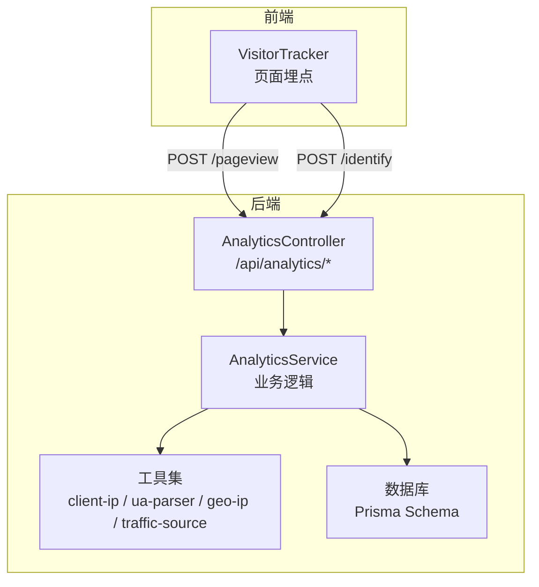
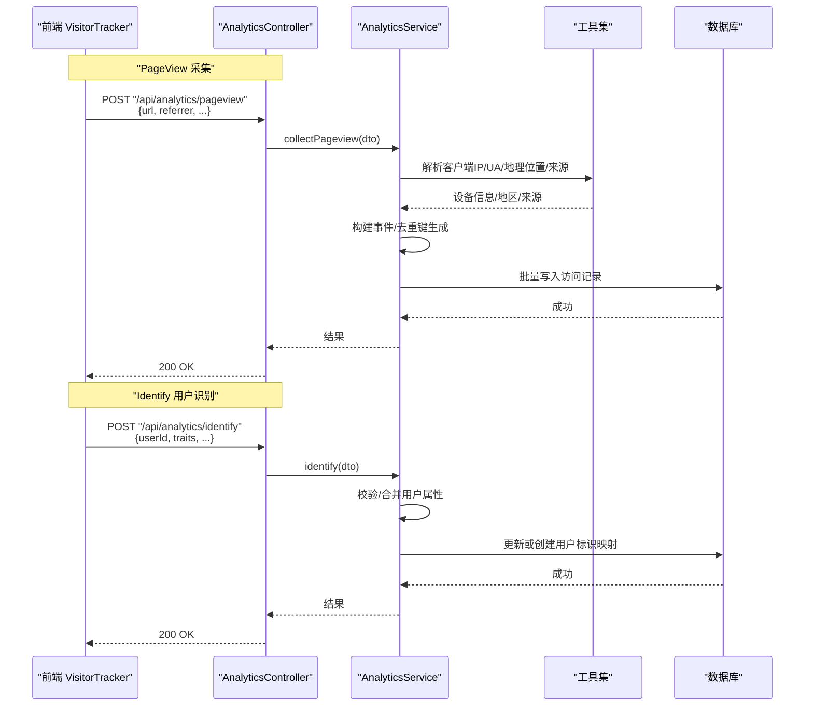
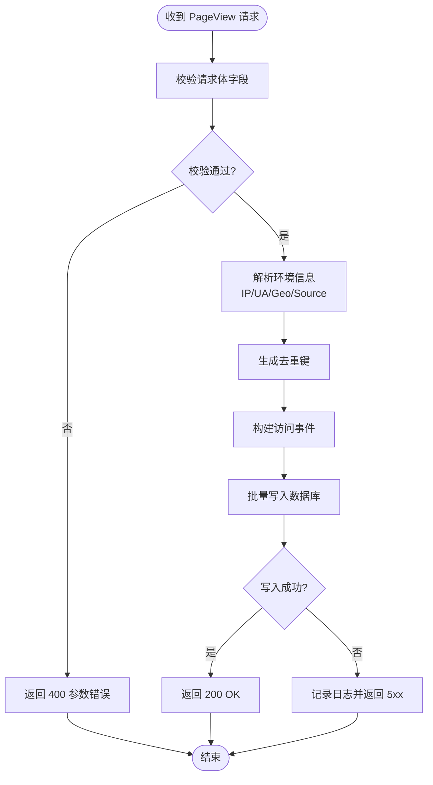
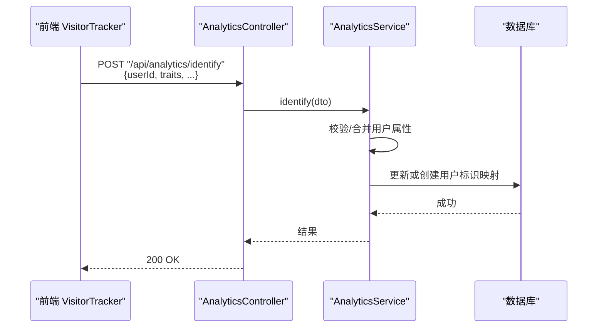
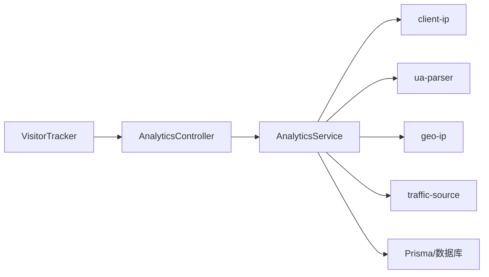

# 数据采集与处理

<cite>
**本文引用的文件**   
- [analytics.controller.ts](file://apps/api/src/analytics/analytics.controller.ts)
- [collect-pageview.dto.ts](file://apps/api/src/analytics/dto/collect-pageview.dto.ts)
- [identify.dto.ts](file://apps/api/src/analytics/dto/identify.dto.ts)
- [analytics.service.ts](file://apps/api/src/analytics/analytics.service.ts)
- [client-ip.ts](file://apps/api/src/analytics/utils/client-ip.ts)
- [geo-ip.ts](file://apps/api/src/analytics/utils/geo-ip.ts)
- [ua-parser.ts](file://apps/api/src/analytics/utils/ua-parser.ts)
- [traffic-source.ts](file://apps/api/src/analytics/utils/traffic-source.ts)
- [VisitorTracker.tsx](file://apps/web/src/components/analytics/VisitorTracker.tsx)
- [schema.prisma](file://apps/api/prisma/schema.prisma)
</cite>

## 目录
1. [简介](#简介)
2. [项目结构](#项目结构)
3. [核心组件](#核心组件)
4. [架构总览](#架构总览)
5. [详细组件分析](#详细组件分析)
6. [依赖关系分析](#依赖关系分析)
7. [性能考量](#性能考量)
8. [故障排查指南](#故障排查指南)
9. [结论](#结论)
10. [附录](#附录)

## 简介
本文件面向访客数据分析采集与处理系统，聚焦页面访问数据收集、用户识别机制、事件追踪和数据验证流程。重点解释 PageView 与 Identify 接口的实现原理，包括请求参数校验、数据格式化与存储策略，并覆盖错误处理、数据去重与批量处理机制。文末提供 API 调用示例与最佳实践建议，帮助读者快速集成与优化。

## 项目结构
本项目采用前后端分离的架构：
- 前端（Next.js）通过浏览器侧埋点组件上报页面访问与用户识别事件。
- 后端（NestJS）提供采集接口，负责参数校验、设备与环境信息解析、地理位置推断、来源渠道归因、数据持久化与去重。
- 数据库使用 Prisma 管理实体与迁移。

图表来源
- [analytics.controller.ts](file://apps/api/src/analytics/analytics.controller.ts)
- [analytics.service.ts](file://apps/api/src/analytics/analytics.service.ts)
- [VisitorTracker.tsx](file://apps/web/src/components/analytics/VisitorTracker.tsx)
- [schema.prisma](file://apps/api/prisma/schema.prisma)

章节来源
- [analytics.controller.ts](file://apps/api/src/analytics/analytics.controller.ts)
- [analytics.service.ts](file://apps/api/src/analytics/analytics.service.ts)
- [VisitorTracker.tsx](file://apps/web/src/components/analytics/VisitorTracker.tsx)
- [schema.prisma](file://apps/api/prisma/schema.prisma)

## 核心组件
- 控制器层：暴露采集接口，接收并转发请求体至服务层。
- 服务层：执行参数校验、设备与环境解析、地理定位、来源归因、数据去重与批量写入。
- 工具层：IP 解析、UA 解析、地理位置查询、流量来源推断等。
- 前端埋点：在页面生命周期中自动上报 PageView，并在用户身份变化时上报 Identify。

章节来源
- [analytics.controller.ts](file://apps/api/src/analytics/analytics.controller.ts)
- [analytics.service.ts](file://apps/api/src/analytics/analytics.service.ts)
- [client-ip.ts](file://apps/api/src/analytics/utils/client-ip.ts)
- [ua-parser.ts](file://apps/api/src/analytics/utils/ua-parser.ts)
- [geo-ip.ts](file://apps/api/src/analytics/utils/geo-ip.ts)
- [traffic-source.ts](file://apps/api/src/analytics/utils/traffic-source.ts)
- [VisitorTracker.tsx](file://apps/web/src/components/analytics/VisitorTracker.tsx)

## 架构总览
以下序列图展示一次 PageView 采集的端到端流程，以及 Identify 的用户识别流程。

图表来源
- [analytics.controller.ts](file://apps/api/src/analytics/analytics.controller.ts)
- [analytics.service.ts](file://apps/api/src/analytics/analytics.service.ts)
- [client-ip.ts](file://apps/api/src/analytics/utils/client-ip.ts)
- [ua-parser.ts](file://apps/api/src/analytics/utils/ua-parser.ts)
- [geo-ip.ts](file://apps/api/src/analytics/utils/geo-ip.ts)
- [traffic-source.ts](file://apps/api/src/analytics/utils/traffic-source.ts)
- [schema.prisma](file://apps/api/prisma/schema.prisma)

## 详细组件分析

### PageView 接口（页面访问采集）
- 入口与参数
  - 路径：/api/analytics/pageview
  - 方法：POST
  - 请求体字段：页面 URL、来源 Referrer、时间戳、可选自定义维度（如页面标题、语言、屏幕尺寸等）
  - 参数校验：基于 DTO 进行必填项与格式校验，非法请求直接返回错误码
- 数据处理
  - 客户端 IP 解析：从请求头获取真实 IP（考虑代理/负载均衡场景）
  - UA 解析：提取浏览器、操作系统、设备类型等
  - 地理位置：根据 IP 查询地区与国家
  - 流量来源：根据 Referrer 与域名规则推断来源渠道
- 数据去重
  - 生成唯一键（例如：URL + 时间窗口 + 会话/设备指纹），避免重复上报导致统计失真
- 存储策略
  - 批量写入访问事件表，减少数据库往返次数
  - 支持异步落库与失败重试
- 错误处理
  - 参数校验失败：返回 400
  - 外部依赖异常（如 GeoIP）：降级为未知地区，不中断主流程
  - 写入失败：记录日志并返回 5xx，前端可重试

图表来源
- [analytics.controller.ts](file://apps/api/src/analytics/analytics.controller.ts)
- [collect-pageview.dto.ts](file://apps/api/src/analytics/dto/collect-pageview.dto.ts)
- [analytics.service.ts](file://apps/api/src/analytics/analytics.service.ts)
- [client-ip.ts](file://apps/api/src/analytics/utils/client-ip.ts)
- [ua-parser.ts](file://apps/api/src/analytics/utils/ua-parser.ts)
- [geo-ip.ts](file://apps/api/src/analytics/utils/geo-ip.ts)
- [traffic-source.ts](file://apps/api/src/analytics/utils/traffic-source.ts)

章节来源
- [analytics.controller.ts](file://apps/api/src/analytics/analytics.controller.ts)
- [collect-pageview.dto.ts](file://apps/api/src/analytics/dto/collect-pageview.dto.ts)
- [analytics.service.ts](file://apps/api/src/analytics/analytics.service.ts)
- [client-ip.ts](file://apps/api/src/analytics/utils/client-ip.ts)
- [ua-parser.ts](file://apps/api/src/analytics/utils/ua-parser.ts)
- [geo-ip.ts](file://apps/api/src/analytics/utils/geo-ip.ts)
- [traffic-source.ts](file://apps/api/src/analytics/utils/traffic-source.ts)

### Identify 接口（用户识别）
- 入口与参数
  - 路径：/api/analytics/identify
  - 方法：POST
  - 请求体字段：用户 ID、用户属性（traits）、可选匿名 ID、时间戳等
  - 参数校验：基于 DTO 校验用户 ID 与属性合法性
- 数据处理
  - 用户识别：将匿名会话与已登录用户关联，合并或更新用户属性
  - 去重策略：按 userId 或匿名ID+设备指纹生成唯一键，避免重复更新
- 存储策略
  - 更新或创建用户标识映射表，便于后续事件关联
- 错误处理
  - 参数校验失败：返回 400
  - 写入冲突：幂等更新，保证一致性
  - 外部依赖异常：记录日志并返回 5xx

图表来源
- [analytics.controller.ts](file://apps/api/src/analytics/analytics.controller.ts)
- [identify.dto.ts](file://apps/api/src/analytics/dto/identify.dto.ts)
- [analytics.service.ts](file://apps/api/src/analytics/analytics.service.ts)
- [schema.prisma](file://apps/api/prisma/schema.prisma)

章节来源
- [analytics.controller.ts](file://apps/api/src/analytics/analytics.controller.ts)
- [identify.dto.ts](file://apps/api/src/analytics/dto/identify.dto.ts)
- [analytics.service.ts](file://apps/api/src/analytics/analytics.service.ts)

### 前端埋点组件（VisitorTracker）
- 触发时机
  - 页面加载完成：自动上报 PageView
  - 路由切换：再次上报 PageView，携带新 URL 与 Referrer
  - 用户登录/登出：上报 Identify，更新 userId 与 traits
- 上报策略
  - 防抖与节流：避免高频重复上报
  - 离线缓存：网络不可用时本地暂存，恢复后批量上报
  - 错误重试：指数退避重试，失败记录日志

章节来源
- [VisitorTracker.tsx](file://apps/web/src/components/analytics/VisitorTracker.tsx)

### 数据模型与存储（Prisma）
- 实体设计
  - 访问事件表：包含 URL、Referrer、设备信息、地理位置、来源、时间戳等
  - 用户标识表：包含 userId、匿名ID、设备指纹、属性映射、更新时间等
- 索引与约束
  - 对常用查询字段建立索引（如 userId、createdAt）
  - 唯一约束用于去重（如 userId + createdAt 窗口）
- 迁移与版本控制
  - 使用 Prisma Migrate 管理 schema 演进

章节来源
- [schema.prisma](file://apps/api/prisma/schema.prisma)

## 依赖关系分析
- 控制器依赖服务层，服务层依赖工具集与数据库
- 工具集之间低耦合，各自负责单一职责（IP、UA、Geo、Source）
- 前端埋点仅依赖 HTTP 客户端与本地状态管理

图表来源
- [analytics.controller.ts](file://apps/api/src/analytics/analytics.controller.ts)
- [analytics.service.ts](file://apps/api/src/analytics/analytics.service.ts)
- [client-ip.ts](file://apps/api/src/analytics/utils/client-ip.ts)
- [ua-parser.ts](file://apps/api/src/analytics/utils/ua-parser.ts)
- [geo-ip.ts](file://apps/api/src/analytics/utils/geo-ip.ts)
- [traffic-source.ts](file://apps/api/src/analytics/utils/traffic-source.ts)
- [VisitorTracker.tsx](file://apps/web/src/components/analytics/VisitorTracker.tsx)

章节来源
- [analytics.controller.ts](file://apps/api/src/analytics/analytics.controller.ts)
- [analytics.service.ts](file://apps/api/src/analytics/analytics.service.ts)

## 性能考量
- 批量写入：聚合多条事件后一次性写入数据库，降低 I/O 开销
- 去重键计算：使用轻量哈希算法，避免复杂计算影响响应时间
- 异步处理：非关键路径（如 GeoIP）采用异步或缓存，提升吞吐
- 限流与熔断：对上游限制频率，防止雪崩；外部依赖失败快速失败
- 前端优化：防抖/节流、离线缓存、重试退避，减少无效请求

## 故障排查指南
- 常见问题
  - 参数校验失败：检查 DTO 定义与前端传参是否一致
  - 地理位置为空：确认 IP 解析链路正确，必要时降级为“未知”
  - 重复事件：检查去重键生成逻辑与时间窗口设置
  - 写入失败：查看数据库连接与事务状态，关注重试策略
- 调试建议
  - 开启详细日志，记录请求体、解析结果与写入状态
  - 使用测试用例模拟边界条件（空值、超长字符串、非法字符）
  - 监控关键指标（QPS、延迟、错误率、去重命中率）

章节来源
- [collect-pageview.dto.ts](file://apps/api/src/analytics/dto/collect-pageview.dto.ts)
- [identify.dto.ts](file://apps/api/src/analytics/dto/identify.dto.ts)
- [analytics.service.ts](file://apps/api/src/analytics/analytics.service.ts)

## 结论
本系统通过清晰的分层设计与完善的工具链，实现了稳定高效的访客数据采集与处理。PageView 与 Identify 接口覆盖了页面访问与用户识别的核心场景，结合参数校验、去重、批量写入与错误处理，确保数据的准确性与系统的可用性。建议在生产环境中配合监控与告警，持续优化性能与稳定性。

## 附录

### API 调用示例
- PageView
  - 方法：POST
  - 路径：/api/analytics/pageview
  - 请求体：包含 url、referrer、timestamp 等字段
  - 响应：200 OK 或错误码
- Identify
  - 方法：POST
  - 路径：/api/analytics/identify
  - 请求体：包含 userId、traits、anonymousId 等字段
  - 响应：200 OK 或错误码

### 最佳实践
- 前端埋点
  - 仅在必要时机上报，避免过度采集
  - 合理设置去重与重试策略，保障数据完整性
- 后端处理
  - 严格参数校验，拒绝非法请求
  - 使用批量写入与异步处理，提升吞吐
  - 对外部依赖进行降级与熔断，保证主流程稳定
- 数据存储
  - 设计合理的索引与约束，提高查询效率
  - 定期归档历史数据，控制表规模