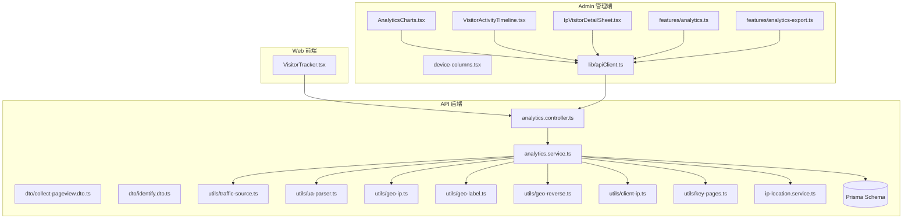
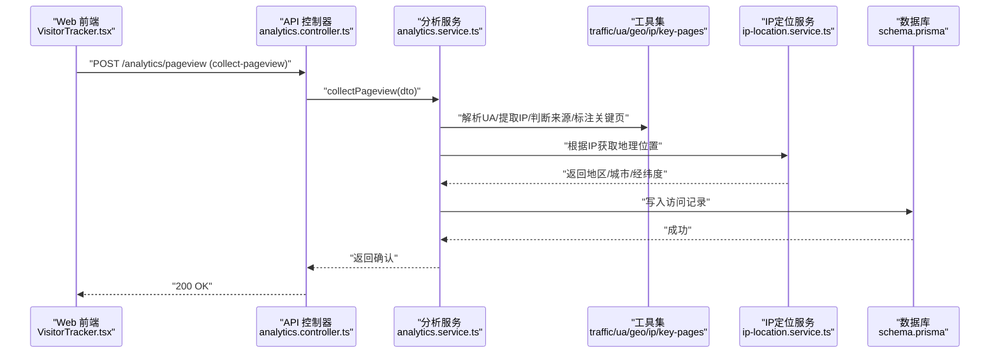
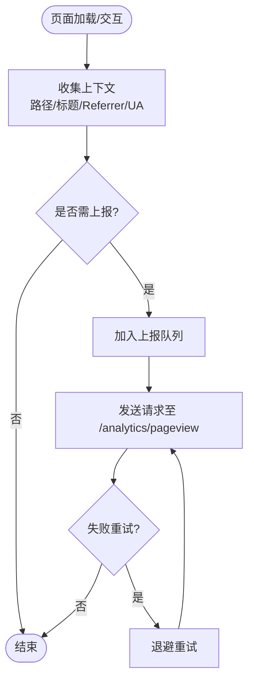
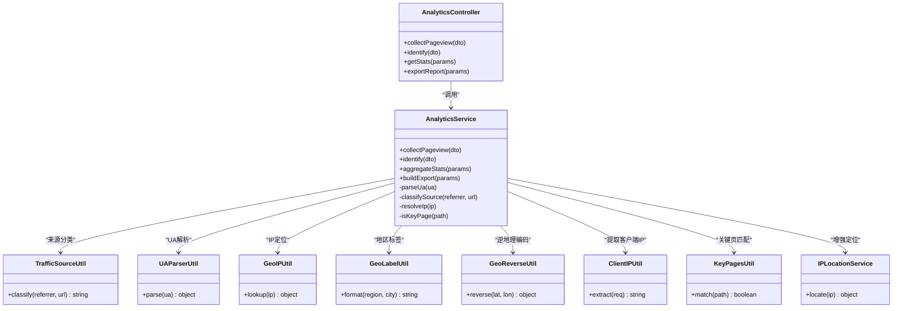
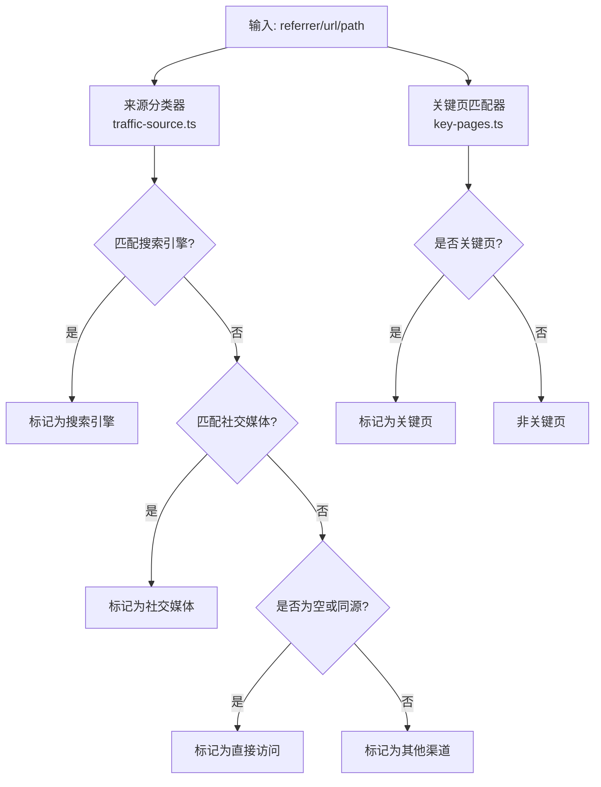
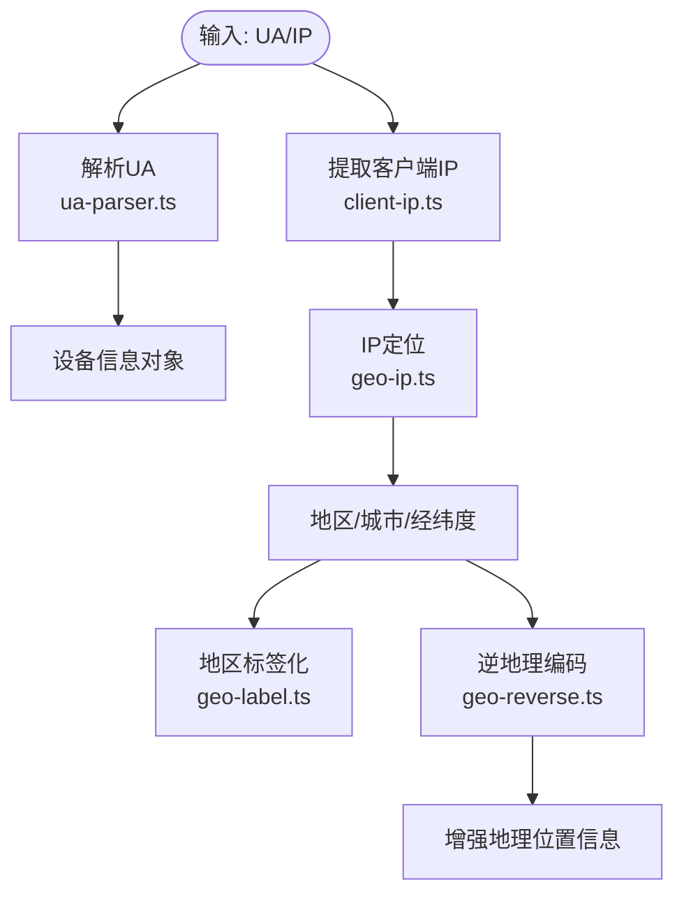
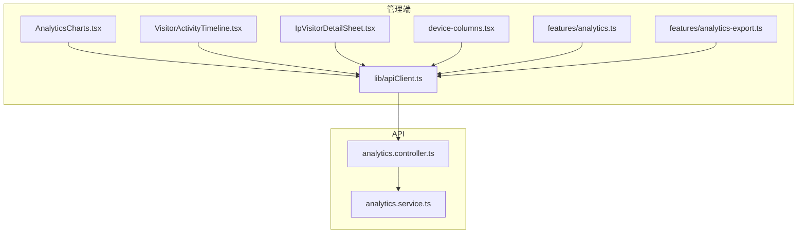
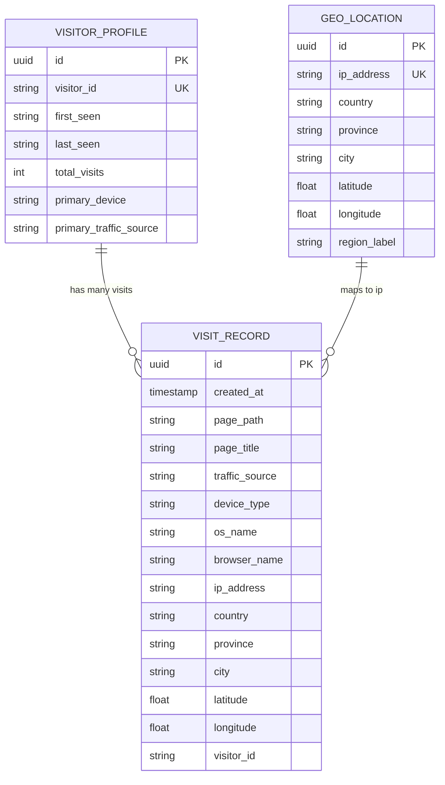
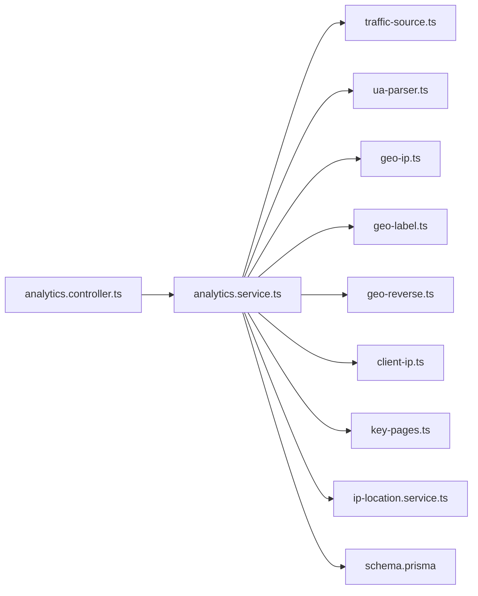

# 流量分析与统计

<cite>
**本文引用的文件**   
- [analytics.controller.ts](file://apps/api/src/analytics/analytics.controller.ts)
- [analytics.service.ts](file://apps/api/src/analytics/analytics.service.ts)
- [collect-pageview.dto.ts](file://apps/api/src/analytics/dto/collect-pageview.dto.ts)
- [identify.dto.ts](file://apps/api/src/analytics/dto/identify.dto.ts)
- [traffic-source.ts](file://apps/api/src/analytics/utils/traffic-source.ts)
- [ua-parser.ts](file://apps/api/src/analytics/utils/ua-parser.ts)
- [geo-ip.ts](file://apps/api/src/analytics/utils/geo-ip.ts)
- [geo-label.ts](file://apps/api/src/analytics/utils/geo-label.ts)
- [geo-reverse.ts](file://apps/api/src/analytics/utils/geo-reverse.ts)
- [client-ip.ts](file://apps/api/src/analytics/utils/client-ip.ts)
- [key-pages.ts](file://apps/api/src/analytics/utils/key-pages.ts)
- [ip-location.service.ts](file://apps/api/src/analytics/ip-location.service.ts)
- [VisitorTracker.tsx](file://apps/web/src/components/analytics/VisitorTracker.tsx)
- [AnalyticsCharts.tsx](file://apps/admin/src/components/analytics/AnalyticsCharts.tsx)
- [VisitorActivityTimeline.tsx](file://apps/admin/src/components/analytics/VisitorActivityTimeline.tsx)
- [IpVisitorDetailSheet.tsx](file://apps/admin/src/components/analytics/IpVisitorDetailSheet.tsx)
- [device-columns.tsx](file://apps/admin/src/components/analytics/device-columns.tsx)
- [analytics.ts](file://apps/admin/src/features/analytics.ts)
- [analytics-export.ts](file://apps/admin/src/features/analytics-export.ts)
- [apiClient.ts](file://apps/admin/src/lib/apiClient.ts)
- [schema.prisma](file://apps/api/prisma/schema.prisma)
</cite>

## 目录
1. [简介](#简介)
2. [项目结构](#项目结构)
3. [核心组件](#核心组件)
4. [架构总览](#架构总览)
5. [详细组件分析](#详细组件分析)
6. [依赖关系分析](#依赖关系分析)
7. [性能考量](#性能考量)
8. [故障排查指南](#故障排查指南)
9. [结论](#结论)
10. [附录](#附录)

## 简介
本文件面向“流量分析与统计”能力，系统化说明流量来源追踪、关键页面识别与访问模式分析。文档覆盖搜索引擎来源、社交媒体引流与直接访问的分类统计方法，并提供热门页面分析、访问路径追踪与用户行为序列的落地方案。同时给出统计分析API与报表生成接口的使用指引，帮助运营与产品团队快速定位高价值内容与优化转化路径。

## 项目结构
本项目采用多应用（Monorepo）组织：
- apps/web：前端站点，负责埋点采集与上报
- apps/admin：管理后台，提供可视化图表、筛选与导出
- apps/api：后端服务，提供数据采集、聚合与分析接口，并持久化到数据库

**图示来源** 
- [VisitorTracker.tsx](file://apps/web/src/components/analytics/VisitorTracker.tsx)
- [AnalyticsCharts.tsx](file://apps/admin/src/components/analytics/AnalyticsCharts.tsx)
- [VisitorActivityTimeline.tsx](file://apps/admin/src/components/analytics/VisitorActivityTimeline.tsx)
- [IpVisitorDetailSheet.tsx](file://apps/admin/src/components/analytics/IpVisitorDetailSheet.tsx)
- [device-columns.tsx](file://apps/admin/src/components/analytics/device-columns.tsx)
- [analytics.ts](file://apps/admin/src/features/analytics.ts)
- [analytics-export.ts](file://apps/admin/src/features/analytics-export.ts)
- [apiClient.ts](file://apps/admin/src/lib/apiClient.ts)
- [analytics.controller.ts](file://apps/api/src/analytics/analytics.controller.ts)
- [analytics.service.ts](file://apps/api/src/analytics/analytics.service.ts)
- [collect-pageview.dto.ts](file://apps/api/src/analytics/dto/collect-pageview.dto.ts)
- [identify.dto.ts](file://apps/api/src/analytics/dto/identify.dto.ts)
- [traffic-source.ts](file://apps/api/src/analytics/utils/traffic-source.ts)
- [ua-parser.ts](file://apps/api/src/analytics/utils/ua-parser.ts)
- [geo-ip.ts](file://apps/api/src/analytics/utils/geo-ip.ts)
- [geo-label.ts](file://apps/api/src/analytics/utils/geo-label.ts)
- [geo-reverse.ts](file://apps/api/src/analytics/utils/geo-reverse.ts)
- [client-ip.ts](file://apps/api/src/analytics/utils/client-ip.ts)
- [key-pages.ts](file://apps/api/src/analytics/utils/key-pages.ts)
- [ip-location.service.ts](file://apps/api/src/analytics/ip-location.service.ts)
- [schema.prisma](file://apps/api/prisma/schema.prisma)

**章节来源**
- [analytics.controller.ts](file://apps/api/src/analytics/analytics.controller.ts)
- [analytics.service.ts](file://apps/api/src/analytics/analytics.service.ts)
- [VisitorTracker.tsx](file://apps/web/src/components/analytics/VisitorTracker.tsx)
- [AnalyticsCharts.tsx](file://apps/admin/src/components/analytics/AnalyticsCharts.tsx)
- [VisitorActivityTimeline.tsx](file://apps/admin/src/components/analytics/VisitorActivityTimeline.tsx)
- [IpVisitorDetailSheet.tsx](file://apps/admin/src/components/analytics/IpVisitorDetailSheet.tsx)
- [device-columns.tsx](file://apps/admin/src/components/analytics/device-columns.tsx)
- [analytics.ts](file://apps/admin/src/features/analytics.ts)
- [analytics-export.ts](file://apps/admin/src/features/analytics-export.ts)
- [apiClient.ts](file://apps/admin/src/lib/apiClient.ts)
- [schema.prisma](file://apps/api/prisma/schema.prisma)

## 核心组件
- 数据采集（Web 前端埋点）
  - 在页面加载或交互时触发事件上报，携带页面路径、来源、设备信息、地理位置等上下文。
- 数据接入（API 控制器与服务）
  - 接收并校验请求体，解析UA、提取客户端IP、推断流量来源、标注关键页面、解析地理信息，写入存储。
- 数据分析（Admin 管理端）
  - 提供多维筛选、趋势图、时间线、设备分布、IP访客详情等视图，支持导出报表。
- 数据存储（Prisma Schema）
  - 定义访问记录、访客标识、地理位置等实体，支撑查询与聚合。

**章节来源**
- [VisitorTracker.tsx](file://apps/web/src/components/analytics/VisitorTracker.tsx)
- [analytics.controller.ts](file://apps/api/src/analytics/analytics.controller.ts)
- [analytics.service.ts](file://apps/api/src/analytics/analytics.service.ts)
- [collect-pageview.dto.ts](file://apps/api/src/analytics/dto/collect-pageview.dto.ts)
- [identify.dto.ts](file://apps/api/src/analytics/dto/identify.dto.ts)
- [traffic-source.ts](file://apps/api/src/analytics/utils/traffic-source.ts)
- [ua-parser.ts](file://apps/api/src/analytics/utils/ua-parser.ts)
- [geo-ip.ts](file://apps/api/src/analytics/utils/geo-ip.ts)
- [geo-label.ts](file://apps/api/src/analytics/utils/geo-label.ts)
- [geo-reverse.ts](file://apps/api/src/analytics/utils/geo-reverse.ts)
- [client-ip.ts](file://apps/api/src/analytics/utils/client-ip.ts)
- [key-pages.ts](file://apps/api/src/analytics/utils/key-pages.ts)
- [ip-location.service.ts](file://apps/api/src/analytics/ip-location.service.ts)
- [schema.prisma](file://apps/api/prisma/schema.prisma)

## 架构总览
整体流程分为“采集—处理—存储—展示—导出”五个阶段：
- 采集：Web 端 VisitorTracker 收集页面浏览与事件，调用 API 上报。
- 处理：Controller 校验DTO，Service 组合工具函数完成来源分类、UA解析、IP定位、关键页标注。
- 存储：通过 Prisma 将访问记录持久化，便于后续聚合查询。
- 展示：Admin 端通过 apiClient 调用分析接口，渲染图表与明细。
- 导出：按维度导出CSV/Excel，用于离线分析。

**图示来源** 
- [VisitorTracker.tsx](file://apps/web/src/components/analytics/VisitorTracker.tsx)
- [analytics.controller.ts](file://apps/api/src/analytics/analytics.controller.ts)
- [analytics.service.ts](file://apps/api/src/analytics/analytics.service.ts)
- [traffic-source.ts](file://apps/api/src/analytics/utils/traffic-source.ts)
- [ua-parser.ts](file://apps/api/src/analytics/utils/ua-parser.ts)
- [geo-ip.ts](file://apps/api/src/analytics/utils/geo-ip.ts)
- [geo-label.ts](file://apps/api/src/analytics/utils/geo-label.ts)
- [geo-reverse.ts](file://apps/api/src/analytics/utils/geo-reverse.ts)
- [client-ip.ts](file://apps/api/src/analytics/utils/client-ip.ts)
- [key-pages.ts](file://apps/api/src/analytics/utils/key-pages.ts)
- [ip-location.service.ts](file://apps/api/src/analytics/ip-location.service.ts)
- [schema.prisma](file://apps/api/prisma/schema.prisma)

## 详细组件分析

### 数据采集（Web 埋点）
- 触发时机：页面加载、路由切换、关键交互（如点击CTA）。
- 上报字段：页面路径、标题、来源（referral）、设备信息（UA）、时间戳、可选访客ID。
- 上报策略：批量上报、失败重试、防抖节流。

**图示来源** 
- [VisitorTracker.tsx](file://apps/web/src/components/analytics/VisitorTracker.tsx)

**章节来源**
- [VisitorTracker.tsx](file://apps/web/src/components/analytics/VisitorTracker.tsx)

### 数据接入（API 控制器与服务）
- 控制器职责：路由定义、参数校验（DTO）、鉴权（如需）、统一响应。
- 服务职责：组装工具函数，完成来源分类、UA解析、IP定位、关键页标注、数据落库。
- DTO设计：pageview与identify两类入参，确保字段完整与类型安全。

**图示来源** 
- [analytics.controller.ts](file://apps/api/src/analytics/analytics.controller.ts)
- [analytics.service.ts](file://apps/api/src/analytics/analytics.service.ts)
- [traffic-source.ts](file://apps/api/src/analytics/utils/traffic-source.ts)
- [ua-parser.ts](file://apps/api/src/analytics/utils/ua-parser.ts)
- [geo-ip.ts](file://apps/api/src/analytics/utils/geo-ip.ts)
- [geo-label.ts](file://apps/api/src/analytics/utils/geo-label.ts)
- [geo-reverse.ts](file://apps/api/src/analytics/utils/geo-reverse.ts)
- [client-ip.ts](file://apps/api/src/analytics/utils/client-ip.ts)
- [key-pages.ts](file://apps/api/src/analytics/utils/key-pages.ts)
- [ip-location.service.ts](file://apps/api/src/analytics/ip-location.service.ts)

**章节来源**
- [analytics.controller.ts](file://apps/api/src/analytics/analytics.controller.ts)
- [analytics.service.ts](file://apps/api/src/analytics/analytics.service.ts)
- [collect-pageview.dto.ts](file://apps/api/src/analytics/dto/collect-pageview.dto.ts)
- [identify.dto.ts](file://apps/api/src/analytics/dto/identify.dto.ts)

### 流量来源分类与关键页面识别
- 来源分类规则：
  - 搜索引擎：根据referrer域名与关键词特征判定（如google、bing、baidu等）。
  - 社交媒体：根据社交平台域名与分享链接特征判定（如weixin、weibo、facebook、twitter等）。
  - 直接访问：无referrer或同源直接访问。
  - 其他渠道：广告联盟、邮件营销、外部合作等。
- 关键页面识别：
  - 基于路径白名单或正则匹配（如首页、产品页、案例页、博客列表、详情页、联系页等）。
  - 对关键页面进行加权统计，用于热门页面排名与转化漏斗分析。

**图示来源** 
- [traffic-source.ts](file://apps/api/src/analytics/utils/traffic-source.ts)
- [key-pages.ts](file://apps/api/src/analytics/utils/key-pages.ts)

**章节来源**
- [traffic-source.ts](file://apps/api/src/analytics/utils/traffic-source.ts)
- [key-pages.ts](file://apps/api/src/analytics/utils/key-pages.ts)

### 地理位置解析与设备信息
- UA解析：识别操作系统、浏览器、设备类型（移动/桌面/平板），用于设备分布统计。
- IP定位：结合第三方IP库或服务，获取国家、省份、城市、经纬度；必要时进行逆地理编码补充。
- 地区标签：格式化输出可读的地区名称，便于报表展示。

**图示来源** 
- [ua-parser.ts](file://apps/api/src/analytics/utils/ua-parser.ts)
- [client-ip.ts](file://apps/api/src/analytics/utils/client-ip.ts)
- [geo-ip.ts](file://apps/api/src/analytics/utils/geo-ip.ts)
- [geo-label.ts](file://apps/api/src/analytics/utils/geo-label.ts)
- [geo-reverse.ts](file://apps/api/src/analytics/utils/geo-reverse.ts)

**章节来源**
- [ua-parser.ts](file://apps/api/src/analytics/utils/ua-parser.ts)
- [client-ip.ts](file://apps/api/src/analytics/utils/client-ip.ts)
- [geo-ip.ts](file://apps/api/src/analytics/utils/geo-ip.ts)
- [geo-label.ts](file://apps/api/src/analytics/utils/geo-label.ts)
- [geo-reverse.ts](file://apps/api/src/analytics/utils/geo-reverse.ts)
- [ip-location.service.ts](file://apps/api/src/analytics/ip-location.service.ts)

### 管理端可视化与报表
- 图表组件：
  - 趋势图：访问量、来源占比、设备分布随时间变化。
  - 时间线：访客活动轨迹，支持按IP或访客ID查看。
  - 设备列：设备类型、操作系统、浏览器分布。
  - IP访客详情：IP维度的访问明细与地理位置。
- 数据接口：
  - 统计分析：按时间范围、来源、设备、地区等维度聚合。
  - 报表导出：支持CSV/Excel格式下载。

**图示来源** 
- [AnalyticsCharts.tsx](file://apps/admin/src/components/analytics/AnalyticsCharts.tsx)
- [VisitorActivityTimeline.tsx](file://apps/admin/src/components/analytics/VisitorActivityTimeline.tsx)
- [IpVisitorDetailSheet.tsx](file://apps/admin/src/components/analytics/IpVisitorDetailSheet.tsx)
- [device-columns.tsx](file://apps/admin/src/components/analytics/device-columns.tsx)
- [analytics.ts](file://apps/admin/src/features/analytics.ts)
- [analytics-export.ts](file://apps/admin/src/features/analytics-export.ts)
- [apiClient.ts](file://apps/admin/src/lib/apiClient.ts)
- [analytics.controller.ts](file://apps/api/src/analytics/analytics.controller.ts)
- [analytics.service.ts](file://apps/api/src/analytics/analytics.service.ts)

**章节来源**
- [AnalyticsCharts.tsx](file://apps/admin/src/components/analytics/AnalyticsCharts.tsx)
- [VisitorActivityTimeline.tsx](file://apps/admin/src/components/analytics/VisitorActivityTimeline.tsx)
- [IpVisitorDetailSheet.tsx](file://apps/admin/src/components/analytics/IpVisitorDetailSheet.tsx)
- [device-columns.tsx](file://apps/admin/src/components/analytics/device-columns.tsx)
- [analytics.ts](file://apps/admin/src/features/analytics.ts)
- [analytics-export.ts](file://apps/admin/src/features/analytics-export.ts)
- [apiClient.ts](file://apps/admin/src/lib/apiClient.ts)

### 数据存储模型
- 访问记录：包含页面路径、标题、来源、设备信息、地理位置、时间戳、访客ID等。
- 访客标识：用于跨会话关联同一访客的行为序列。
- 地理位置：国家、省份、城市、经纬度、地区标签。

**图示来源** 
- [schema.prisma](file://apps/api/prisma/schema.prisma)

**章节来源**
- [schema.prisma](file://apps/api/prisma/schema.prisma)

## 依赖关系分析
- 模块耦合：
  - Controller依赖Service，Service依赖多个工具函数与IP定位服务，形成清晰的单向依赖。
  - Admin端通过apiClient统一调用API，避免分散的网络请求逻辑。
- 外部依赖：
  - UA解析库、IP定位服务、地理位置库。
  - 数据库ORM（Prisma）。
- 潜在循环依赖：
  - 工具函数之间保持独立，避免相互引用。
  - Service层集中编排，降低耦合风险。

**图示来源** 
- [analytics.controller.ts](file://apps/api/src/analytics/analytics.controller.ts)
- [analytics.service.ts](file://apps/api/src/analytics/analytics.service.ts)
- [traffic-source.ts](file://apps/api/src/analytics/utils/traffic-source.ts)
- [ua-parser.ts](file://apps/api/src/analytics/utils/ua-parser.ts)
- [geo-ip.ts](file://apps/api/src/analytics/utils/geo-ip.ts)
- [geo-label.ts](file://apps/api/src/analytics/utils/geo-label.ts)
- [geo-reverse.ts](file://apps/api/src/analytics/utils/geo-reverse.ts)
- [client-ip.ts](file://apps/api/src/analytics/utils/client-ip.ts)
- [key-pages.ts](file://apps/api/src/analytics/utils/key-pages.ts)
- [ip-location.service.ts](file://apps/api/src/analytics/ip-location.service.ts)
- [schema.prisma](file://apps/api/prisma/schema.prisma)

**章节来源**
- [analytics.controller.ts](file://apps/api/src/analytics/analytics.controller.ts)
- [analytics.service.ts](file://apps/api/src/analytics/analytics.service.ts)
- [schema.prisma](file://apps/api/prisma/schema.prisma)

## 性能考量
- 上报优化：
  - 批量上报与去重，减少网络请求次数。
  - 失败重试与指数退避，提高可靠性。
- 数据处理：
  - 工具函数尽量无状态，避免重复计算。
  - IP定位结果缓存，降低外部服务调用频率。
- 查询优化：
  - 按时间范围与维度建立索引，提升聚合查询效率。
  - 分页与限流，防止大查询导致延迟。
- 存储优化：
  - 冷热数据分离，历史数据归档。
  - 定期清理无效或重复记录。

[本节为通用指导，不直接分析具体文件]

## 故障排查指南
- 常见问题：
  - 上报失败：检查网络连通性、接口权限、请求体字段完整性。
  - 来源分类异常：核对referrer与URL规则，更新匹配策略。
  - 地理位置缺失：确认IP库可用性与配置，检查逆地理编码服务。
  - 设备信息错误：验证UA解析库版本与兼容性。
- 调试建议：
  - 启用日志记录，记录关键步骤输入输出。
  - 使用测试用例覆盖边界条件（如空referrer、非法UA）。
  - 监控外部服务健康状态与超时阈值。

**章节来源**
- [analytics.controller.ts](file://apps/api/src/analytics/analytics.controller.ts)
- [analytics.service.ts](file://apps/api/src/analytics/analytics.service.ts)
- [traffic-source.ts](file://apps/api/src/analytics/utils/traffic-source.ts)
- [ua-parser.ts](file://apps/api/src/analytics/utils/ua-parser.ts)
- [geo-ip.ts](file://apps/api/src/analytics/utils/geo-ip.ts)
- [ip-location.service.ts](file://apps/api/src/analytics/ip-location.service.ts)

## 结论
本系统通过前端埋点、后端处理与可视化展示，构建了完整的流量分析与统计闭环。借助来源分类、关键页识别、设备与地理位置解析，能够精准洞察用户行为与内容热度。配合统计分析API与报表导出，可为运营决策与产品优化提供可靠数据支撑。建议在持续迭代中完善来源规则、优化查询性能，并加强监控与告警机制。

[本节为总结性内容，不直接分析具体文件]

## 附录
- 统计分析API概览：
  - 页面浏览采集：POST /analytics/pageview，入参参考 collect-pageview.dto.ts。
  - 访客识别：POST /analytics/identify，入参参考 identify.dto.ts。
  - 统计分析：GET /analytics/stats，支持时间范围、来源、设备、地区等过滤。
  - 报表导出：GET /analytics/export，支持CSV/Excel格式。
- 关键页面规则：
  - 维护 key-pages.ts 中的路径白名单或正则，确保关键页识别准确。
- 数据来源与维护：
  - 更新 traffic-source.ts 的来源分类规则，适配新渠道。
  - 维护 geo-ip.ts 与 ip-location.service.ts 的IP库配置与缓存策略。

**章节来源**
- [collect-pageview.dto.ts](file://apps/api/src/analytics/dto/collect-pageview.dto.ts)
- [identify.dto.ts](file://apps/api/src/analytics/dto/identify.dto.ts)
- [key-pages.ts](file://apps/api/src/analytics/utils/key-pages.ts)
- [traffic-source.ts](file://apps/api/src/analytics/utils/traffic-source.ts)
- [geo-ip.ts](file://apps/api/src/analytics/utils/geo-ip.ts)
- [ip-location.service.ts](file://apps/api/src/analytics/ip-location.service.ts)