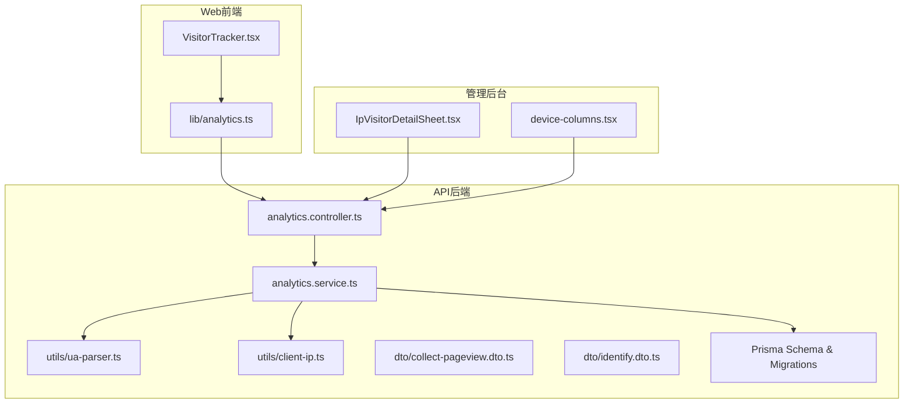
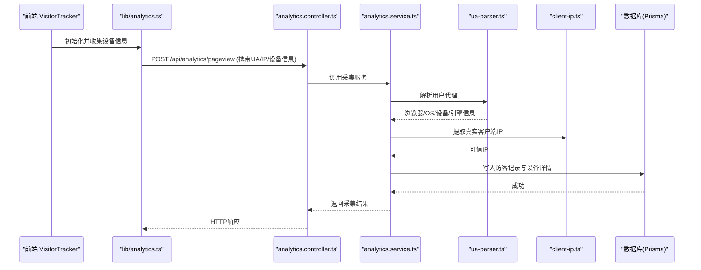
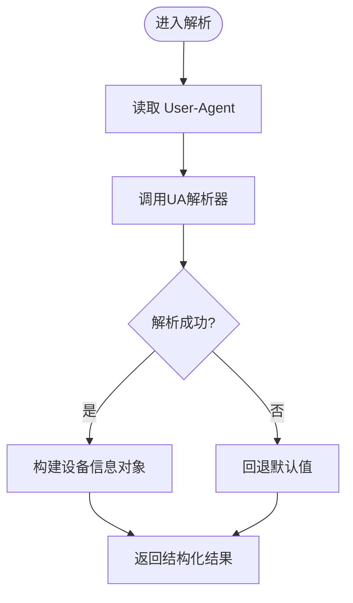
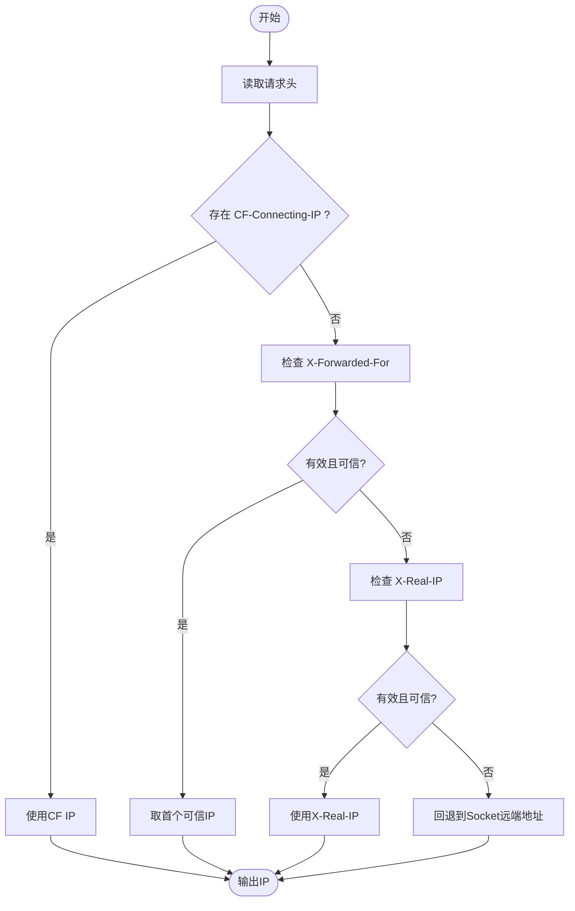
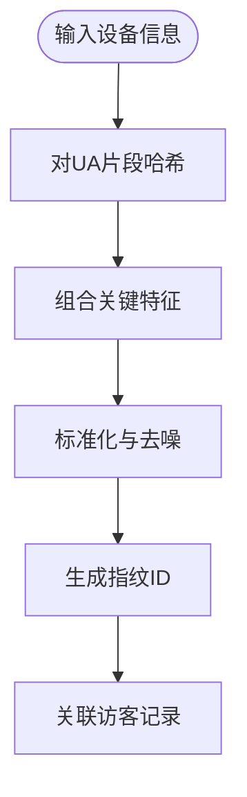
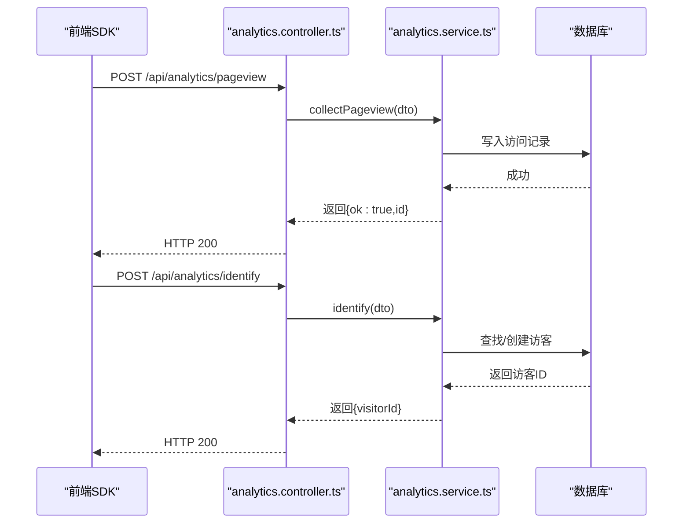
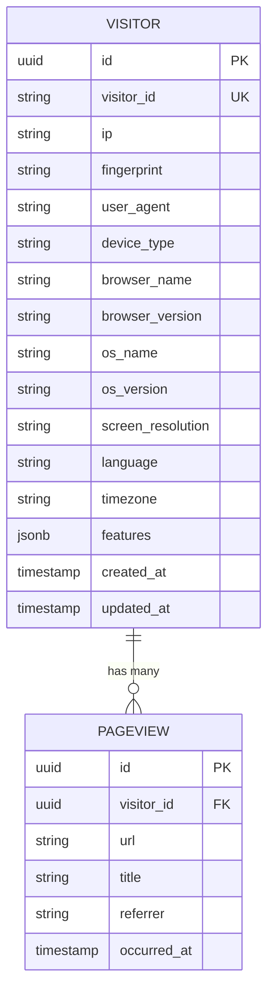
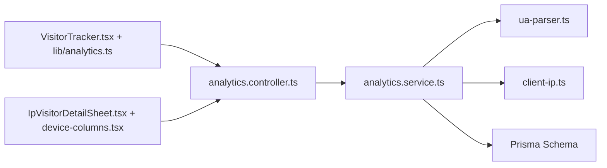

# 设备识别与分析

<cite>
**本文引用的文件**   
- [ua-parser.ts](file://apps/api/src/analytics/utils/ua-parser.ts)
- [client-ip.ts](file://apps/api/src/analytics/utils/client-ip.ts)
- [analytics.controller.ts](file://apps/api/src/analytics/analytics.controller.ts)
- [analytics.service.ts](file://apps/api/src/analytics/analytics.service.ts)
- [collect-pageview.dto.ts](file://apps/api/src/analytics/dto/collect-pageview.dto.ts)
- [identify.dto.ts](file://apps/api/src/analytics/dto/identify.dto.ts)
- [schema.prisma](file://apps/api/prisma/schema.prisma)
- [20260723110621_add_device_details/migration.sql](file://apps/api/prisma/migrations/20260723110621_add_device_details/migration.sql)
- [VisitorTracker.tsx](file://apps/web/src/components/analytics/VisitorTracker.tsx)
- [analytics.ts](file://apps/web/src/lib/analytics.ts)
- [IpVisitorDetailSheet.tsx](file://apps/admin/src/components/analytics/IpVisitorDetailSheet.tsx)
- [device-columns.tsx](file://apps/admin/src/components/analytics/device-columns.tsx)
</cite>

## 目录
1. [简介](#简介)
2. [项目结构](#项目结构)
3. [核心组件](#核心组件)
4. [架构总览](#架构总览)
5. [详细组件分析](#详细组件分析)
6. [依赖关系分析](#依赖关系分析)
7. [性能考虑](#性能考虑)
8. [故障排查指南](#故障排查指南)
9. [结论](#结论)
10. [附录](#附录)

## 简介
本文件围绕“设备识别与分析”能力，系统性说明用户代理字符串解析、设备类型识别、浏览器与操作系统检测、客户端IP获取（含代理支持）、真实IP识别、设备指纹生成、移动端检测与功能特性探测，并提供设备分析API与数据处理示例。文档面向前后端开发者与数据分析人员，兼顾可读性与可落地性。

## 项目结构
设备识别与分析相关代码主要分布在以下模块：
- API后端（NestJS）
  - 分析控制器与服务：处理页面访问采集、访客识别、设备信息解析与存储
  - 工具库：UA解析、客户端IP提取
  - DTO：请求参数校验与数据结构定义
  - 数据库模型与迁移：设备详情字段扩展
- Web前端（Next.js）
  - 访客追踪组件与SDK：收集设备信息、上报事件
- 管理后台（Next.js Admin）
  - 访客详情面板与设备列展示：用于运营与排障

图表来源
- [VisitorTracker.tsx](file://apps/web/src/components/analytics/VisitorTracker.tsx)
- [analytics.ts](file://apps/web/src/lib/analytics.ts)
- [analytics.controller.ts](file://apps/api/src/analytics/analytics.controller.ts)
- [analytics.service.ts](file://apps/api/src/analytics/analytics.service.ts)
- [ua-parser.ts](file://apps/api/src/analytics/utils/ua-parser.ts)
- [client-ip.ts](file://apps/api/src/analytics/utils/client-ip.ts)
- [collect-pageview.dto.ts](file://apps/api/src/analytics/dto/collect-pageview.dto.ts)
- [identify.dto.ts](file://apps/api/src/analytics/dto/identify.dto.ts)
- [schema.prisma](file://apps/api/prisma/schema.prisma)
- [20260723110621_add_device_details/migration.sql](file://apps/api/prisma/migrations/20260723110621_add_device_details/migration.sql)
- [IpVisitorDetailSheet.tsx](file://apps/admin/src/components/analytics/IpVisitorDetailSheet.tsx)
- [device-columns.tsx](file://apps/admin/src/components/analytics/device-columns.tsx)

章节来源
- [analytics.controller.ts](file://apps/api/src/analytics/analytics.controller.ts)
- [analytics.service.ts](file://apps/api/src/analytics/analytics.service.ts)
- [ua-parser.ts](file://apps/api/src/analytics/utils/ua-parser.ts)
- [client-ip.ts](file://apps/api/src/analytics/utils/client-ip.ts)
- [collect-pageview.dto.ts](file://apps/api/src/analytics/dto/collect-pageview.dto.ts)
- [identify.dto.ts](file://apps/api/src/analytics/dto/identify.dto.ts)
- [schema.prisma](file://apps/api/prisma/schema.prisma)
- [20260723110621_add_device_details/migration.sql](file://apps/api/prisma/migrations/20260723110621_add_device_details/migration.sql)
- [VisitorTracker.tsx](file://apps/web/src/components/analytics/VisitorTracker.tsx)
- [analytics.ts](file://apps/web/src/lib/analytics.ts)
- [IpVisitorDetailSheet.tsx](file://apps/admin/src/components/analytics/IpVisitorDetailSheet.tsx)
- [device-columns.tsx](file://apps/admin/src/components/analytics/device-columns.tsx)

## 核心组件
- UA解析器：基于用户代理字符串识别浏览器、引擎、版本、设备型号、CPU架构等
- 客户端IP提取：综合X-Forwarded-For、CF-Connecting-IP、X-Real-IP等头部，结合可信代理白名单，返回最可能的真实IP
- 分析服务：聚合UA解析与IP提取结果，构造设备指纹，落库并对外暴露接口
- 前端追踪：在页面加载时收集设备信息（如UA、屏幕尺寸、语言、时区、Canvas指纹等），上报至后端
- 管理后台展示：按IP或设备维度查看访客详情与设备属性列

章节来源
- [ua-parser.ts](file://apps/api/src/analytics/utils/ua-parser.ts)
- [client-ip.ts](file://apps/api/src/analytics/utils/client-ip.ts)
- [analytics.service.ts](file://apps/api/src/analytics/analytics.service.ts)
- [VisitorTracker.tsx](file://apps/web/src/components/analytics/VisitorTracker.tsx)
- [analytics.ts](file://apps/web/src/lib/analytics.ts)
- [IpVisitorDetailSheet.tsx](file://apps/admin/src/components/analytics/IpVisitorDetailSheet.tsx)
- [device-columns.tsx](file://apps/admin/src/components/analytics/device-columns.tsx)

## 架构总览
整体数据流从前端采集到后端解析、存储与展示：

图表来源
- [VisitorTracker.tsx](file://apps/web/src/components/analytics/VisitorTracker.tsx)
- [analytics.ts](file://apps/web/src/lib/analytics.ts)
- [analytics.controller.ts](file://apps/api/src/analytics/analytics.controller.ts)
- [analytics.service.ts](file://apps/api/src/analytics/analytics.service.ts)
- [ua-parser.ts](file://apps/api/src/analytics/utils/ua-parser.ts)
- [client-ip.ts](file://apps/api/src/analytics/utils/client-ip.ts)
- [schema.prisma](file://apps/api/prisma/schema.prisma)

## 详细组件分析

### 用户代理解析与设备识别
- 输入：HTTP请求头中的User-Agent
- 处理：使用UA解析器提取浏览器名称/版本、渲染引擎、操作系统、设备品牌/型号、CPU架构、是否移动设备等
- 输出：结构化设备信息对象，供后续指纹生成与统计使用

图表来源
- [ua-parser.ts](file://apps/api/src/analytics/utils/ua-parser.ts)

章节来源
- [ua-parser.ts](file://apps/api/src/analytics/utils/ua-parser.ts)

### 客户端IP获取与代理支持
- 输入：请求上下文与头部（如X-Forwarded-For、CF-Connecting-IP、X-Real-IP、Remote Address）
- 策略：
  - 优先信任CDN/负载均衡提供的可信头部
  - 对多段X-Forwarded-For进行清洗，取首个可信IP
  - 若不可信则回退到连接远端地址
- 输出：最终可信客户端IP

图表来源
- [client-ip.ts](file://apps/api/src/analytics/utils/client-ip.ts)

章节来源
- [client-ip.ts](file://apps/api/src/analytics/utils/client-ip.ts)

### 设备指纹生成
- 组成要素：
  - 稳定标识：客户端IP、部分UA哈希、设备型号、屏幕分辨率、语言、时区
  - 可选增强：Canvas/WebGL指纹片段、插件列表、字体枚举（谨慎使用，注意隐私）
- 规则：
  - 对敏感信息进行哈希化与截断
  - 对动态字段（如随机UA片段）做容错
  - 统一编码为短ID便于索引与查询

图表来源
- [analytics.service.ts](file://apps/api/src/analytics/analytics.service.ts)
- [ua-parser.ts](file://apps/api/src/analytics/utils/ua-parser.ts)
- [client-ip.ts](file://apps/api/src/analytics/utils/client-ip.ts)

章节来源
- [analytics.service.ts](file://apps/api/src/analytics/analytics.service.ts)

### 移动端检测与功能特性探测
- 移动端检测：基于UA关键字、屏幕宽度、触控能力、平台标识
- 功能特性探测：
  - 前端通过navigator与window对象检测（如localStorage、service worker、WebRTC、Canvas）
  - 将检测结果随请求一并上报，辅助后端进行差异化分析与统计

章节来源
- [VisitorTracker.tsx](file://apps/web/src/components/analytics/VisitorTracker.tsx)
- [analytics.ts](file://apps/web/src/lib/analytics.ts)

### 设备分析API与数据处理示例
- 页面访问采集
  - 方法：POST
  - 路径：/api/analytics/pageview
  - 入参：用户代理、页面URL、标题、来源、时间戳、设备信息（由前端SDK组装）
  - 出参：采集状态与ID
- 访客识别
  - 方法：POST
  - 路径：/api/analytics/identify
  - 入参：设备指纹、IP、UA、会话标识
  - 出参：访客ID与合并策略

图表来源
- [analytics.controller.ts](file://apps/api/src/analytics/analytics.controller.ts)
- [analytics.service.ts](file://apps/api/src/analytics/analytics.service.ts)
- [collect-pageview.dto.ts](file://apps/api/src/analytics/dto/collect-pageview.dto.ts)
- [identify.dto.ts](file://apps/api/src/analytics/dto/identify.dto.ts)

章节来源
- [analytics.controller.ts](file://apps/api/src/analytics/analytics.controller.ts)
- [analytics.service.ts](file://apps/api/src/analytics/analytics.service.ts)
- [collect-pageview.dto.ts](file://apps/api/src/analytics/dto/collect-pageview.dto.ts)
- [identify.dto.ts](file://apps/api/src/analytics/dto/identify.dto.ts)

### 数据库模型与设备详情
- 设备详情扩展：新增设备相关字段（如设备类型、浏览器、操作系统、分辨率、语言、时区、指纹等）
- 迁移：通过Prisma迁移脚本添加字段与索引，提升查询性能

图表来源
- [schema.prisma](file://apps/api/prisma/schema.prisma)
- [20260723110621_add_device_details/migration.sql](file://apps/api/prisma/migrations/20260723110621_add_device_details/migration.sql)

章节来源
- [schema.prisma](file://apps/api/prisma/schema.prisma)
- [20260723110621_add_device_details/migration.sql](file://apps/api/prisma/migrations/20260723110621_add_device_details/migration.sql)

### 管理后台展示与列配置
- 访客详情面板：按IP维度查看历史访问、设备信息与地理位置
- 设备列：展示设备类型、浏览器、操作系统、分辨率等关键指标，支持筛选与排序

章节来源
- [IpVisitorDetailSheet.tsx](file://apps/admin/src/components/analytics/IpVisitorDetailSheet.tsx)
- [device-columns.tsx](file://apps/admin/src/components/analytics/device-columns.tsx)

## 依赖关系分析
- 控制器依赖服务层，服务层依赖UA解析与IP提取工具
- 前端SDK依赖网络请求与浏览器API
- 数据库层通过Prisma访问，迁移确保Schema一致性

图表来源
- [analytics.controller.ts](file://apps/api/src/analytics/analytics.controller.ts)
- [analytics.service.ts](file://apps/api/src/analytics/analytics.service.ts)
- [ua-parser.ts](file://apps/api/src/analytics/utils/ua-parser.ts)
- [client-ip.ts](file://apps/api/src/analytics/utils/client-ip.ts)
- [schema.prisma](file://apps/api/prisma/schema.prisma)
- [VisitorTracker.tsx](file://apps/web/src/components/analytics/VisitorTracker.tsx)
- [analytics.ts](file://apps/web/src/lib/analytics.ts)
- [IpVisitorDetailSheet.tsx](file://apps/admin/src/components/analytics/IpVisitorDetailSheet.tsx)
- [device-columns.tsx](file://apps/admin/src/components/analytics/device-columns.tsx)

章节来源
- [analytics.controller.ts](file://apps/api/src/analytics/analytics.controller.ts)
- [analytics.service.ts](file://apps/api/src/analytics/analytics.service.ts)
- [ua-parser.ts](file://apps/api/src/analytics/utils/ua-parser.ts)
- [client-ip.ts](file://apps/api/src/analytics/utils/client-ip.ts)
- [schema.prisma](file://apps/api/prisma/schema.prisma)
- [VisitorTracker.tsx](file://apps/web/src/components/analytics/VisitorTracker.tsx)
- [analytics.ts](file://apps/web/src/lib/analytics.ts)
- [IpVisitorDetailSheet.tsx](file://apps/admin/src/components/analytics/IpVisitorDetailSheet.tsx)
- [device-columns.tsx](file://apps/admin/src/components/analytics/device-columns.tsx)

## 性能考虑
- UA解析与IP提取应在服务层缓存热点结果，避免重复计算
- 设备指纹生成采用轻量哈希与固定长度输出，减少存储与传输开销
- 批量写入与异步队列可降低主链路延迟
- 数据库层面为常用查询字段建立索引（如ip、fingerprint、occurred_at）

## 故障排查指南
- 无法识别设备类型
  - 检查User-Agent是否为空或被篡改
  - 确认UA解析器版本与正则覆盖范围
- 客户端IP不正确
  - 核对反向代理与CDN配置，确保可信头部正确传递
  - 检查X-Forwarded-For顺序与可信IP白名单
- 指纹不稳定
  - 检查动态字段（如随机UA片段、时区变化）是否被纳入指纹
  - 调整指纹算法的容错阈值
- 前端未上报
  - 检查网络请求与跨域配置
  - 确认浏览器权限（如localStorage、Cookie）

章节来源
- [ua-parser.ts](file://apps/api/src/analytics/utils/ua-parser.ts)
- [client-ip.ts](file://apps/api/src/analytics/utils/client-ip.ts)
- [analytics.service.ts](file://apps/api/src/analytics/analytics.service.ts)
- [VisitorTracker.tsx](file://apps/web/src/components/analytics/VisitorTracker.tsx)
- [analytics.ts](file://apps/web/src/lib/analytics.ts)

## 结论
本方案通过标准化的UA解析、严格的IP提取策略、稳定的设备指纹生成以及完善的前后端协作，实现了可靠的设备识别与分析能力。配合管理后台的可视化展示，可为产品运营、安全风控与用户体验优化提供数据支撑。建议在生产环境持续优化指纹算法与缓存策略，并关注隐私合规要求。

## 附录
- 常见设备类型映射：手机、平板、桌面、智能电视、游戏机等
- 浏览器与引擎对照：Chrome/Chromium、Firefox、Safari、Edge、WebView等
- 操作系统识别：iOS、Android、Windows、macOS、Linux发行版等
- 功能特性探测清单：Canvas、WebGL、Service Worker、IndexedDB、WebRTC等