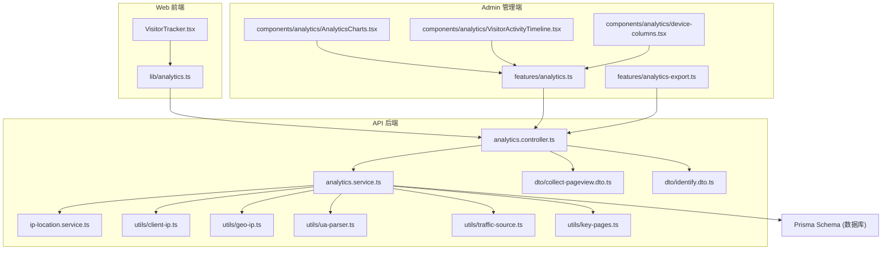
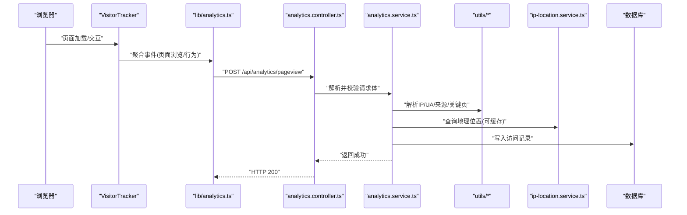
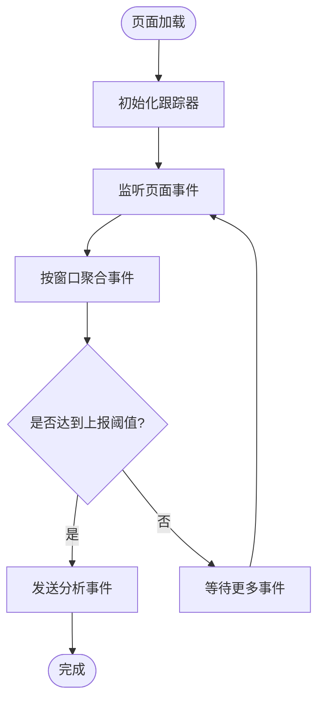
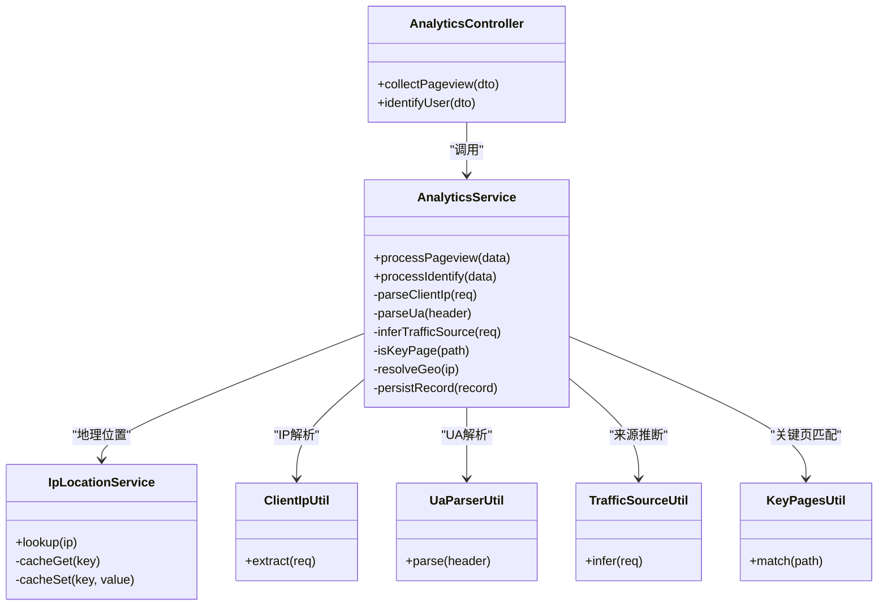
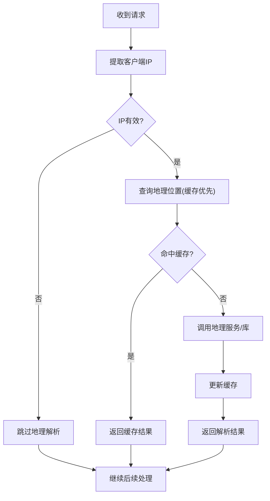
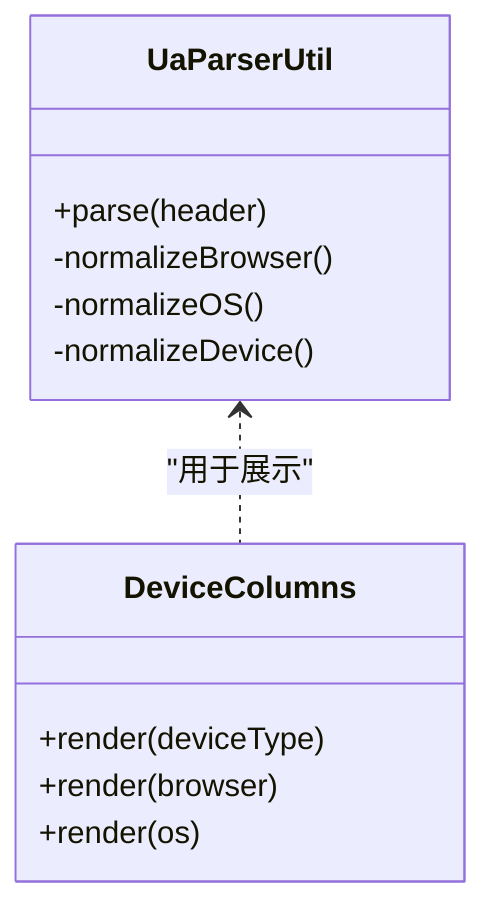
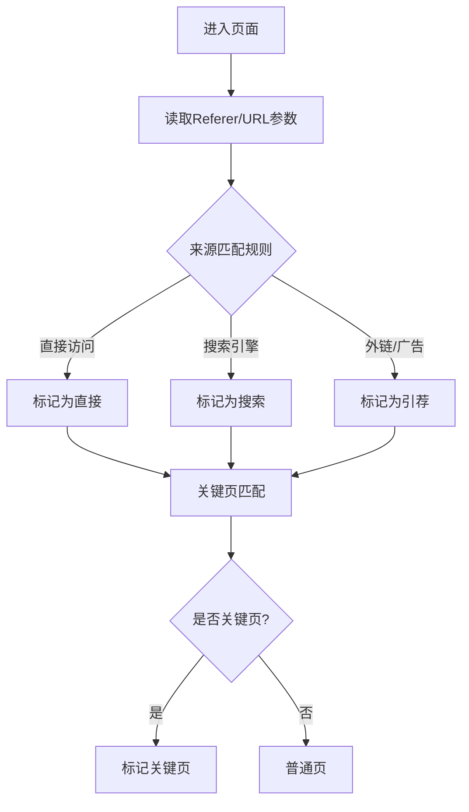
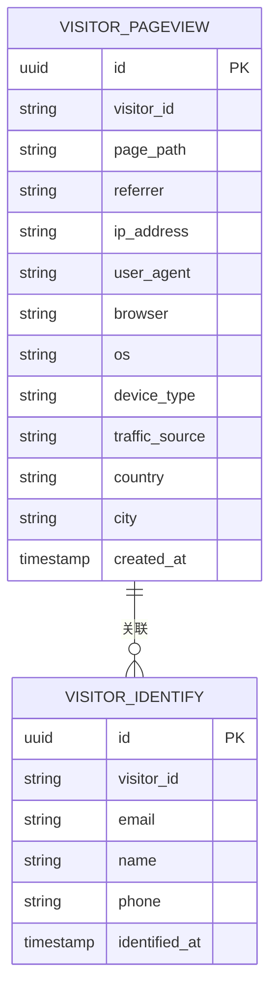
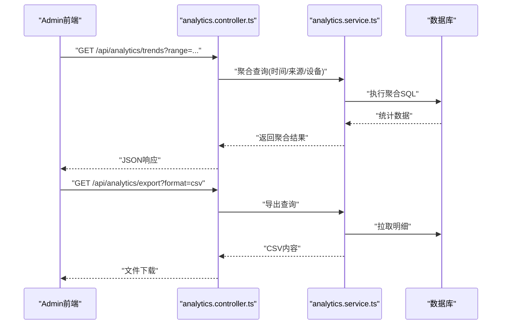
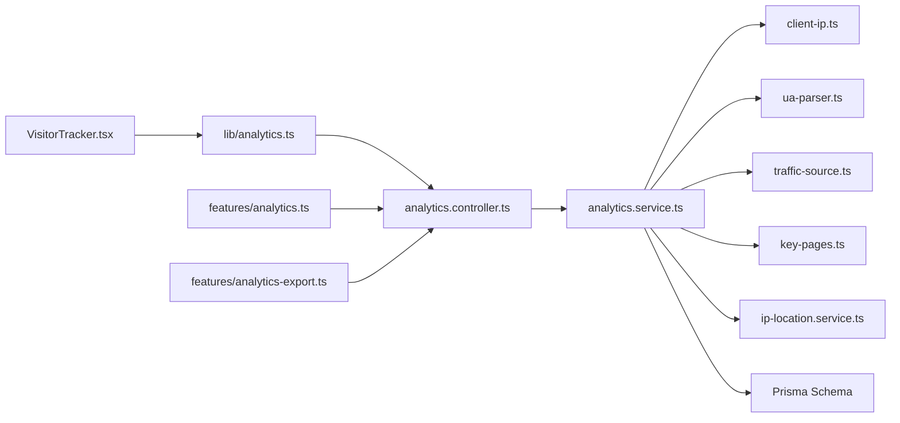

# 访客分析与追踪

<cite>
**本文引用的文件**   
- [apps/api/src/analytics/analytics.controller.ts](file://apps/api/src/analytics/analytics.controller.ts)
- [apps/api/src/analytics/analytics.service.ts](file://apps/api/src/analytics/analytics.service.ts)
- [apps/api/src/analytics/ip-location.service.ts](file://apps/api/src/analytics/ip-location.service.ts)
- [apps/api/src/analytics/utils/client-ip.ts](file://apps/api/src/analytics/utils/client-ip.ts)
- [apps/api/src/analytics/utils/geo-ip.ts](file://apps/api/src/analytics/utils/geo-ip.ts)
- [apps/api/src/analytics/utils/geo-label.ts](file://apps/api/src/analytics/utils/geo-label.ts)
- [apps/api/src/analytics/utils/geo-reverse.ts](file://apps/api/src/analytics/utils/geo-reverse.ts)
- [apps/api/src/analytics/utils/key-pages.ts](file://apps/api/src/analytics/utils/key-pages.ts)
- [apps/api/src/analytics/utils/traffic-source.ts](file://apps/api/src/analytics/utils/traffic-source.ts)
- [apps/api/src/analytics/utils/ua-parser.ts](file://apps/api/src/analytics/utils/ua-parser.ts)
- [apps/api/src/analytics/dto/collect-pageview.dto.ts](file://apps/api/src/analytics/dto/collect-pageview.dto.ts)
- [apps/api/src/analytics/dto/identify.dto.ts](file://apps/api/src/analytics/dto/identify.dto.ts)
- [apps/admin/src/features/analytics-export.ts](file://apps/admin/src/features/analytics-export.ts)
- [apps/admin/src/features/analytics.ts](file://apps/admin/src/features/analytics.ts)
- [apps/admin/src/components/analytics/AnalyticsCharts.tsx](file://apps/admin/src/components/analytics/AnalyticsCharts.tsx)
- [apps/admin/src/components/analytics/VisitorActivityTimeline.tsx](file://apps/admin/src/components/analytics/VisitorActivityTimeline.tsx)
- [apps/admin/src/components/analytics/device-columns.tsx](file://apps/admin/src/components/analytics/device-columns.tsx)
- [apps/web/src/components/analytics/VisitorTracker.tsx](file://apps/web/src/components/analytics/VisitorTracker.tsx)
- [apps/web/src/lib/analytics.ts](file://apps/web/src/lib/analytics.ts)
- [apps/api/prisma/schema.prisma](file://apps/api/prisma/schema.prisma)
</cite>

## 目录
1. [简介](#简介)
2. [项目结构](#项目结构)
3. [核心组件](#核心组件)
4. [架构总览](#架构总览)
5. [详细组件分析](#详细组件分析)
6. [依赖关系分析](#依赖关系分析)
7. [性能考量](#性能考量)
8. [故障排查指南](#故障排查指南)
9. [结论](#结论)
10. [附录](#附录)

## 简介
本文件系统性地梳理“访客分析与追踪”模块，覆盖页面访问统计、用户行为追踪、地理位置识别与设备信息收集。文档重点说明数据采集、存储策略、实时统计与报表生成，并涵盖IP地址解析、用户代理分析、流量来源追踪和关键页面识别。同时提供分析API接口和数据导出功能的说明，帮助开发者快速集成与扩展。

## 项目结构
该功能横跨三个应用层：
- 前端采集（Web）：在浏览器侧埋点，上报页面浏览与行为事件。
- 后端服务（API）：接收上报数据，解析IP、UA、来源等，持久化到数据库，并提供查询与分析接口。
- 管理后台（Admin）：可视化展示分析结果、趋势图表、活动时序与导出报表。

**图示来源** 
- [apps/web/src/components/analytics/VisitorTracker.tsx](file://apps/web/src/components/analytics/VisitorTracker.tsx)
- [apps/web/src/lib/analytics.ts](file://apps/web/src/lib/analytics.ts)
- [apps/api/src/analytics/analytics.controller.ts](file://apps/api/src/analytics/analytics.controller.ts)
- [apps/api/src/analytics/analytics.service.ts](file://apps/api/src/analytics/analytics.service.ts)
- [apps/api/src/analytics/ip-location.service.ts](file://apps/api/src/analytics/ip-location.service.ts)
- [apps/api/src/analytics/utils/client-ip.ts](file://apps/api/src/analytics/utils/client-ip.ts)
- [apps/api/src/analytics/utils/geo-ip.ts](file://apps/api/src/analytics/utils/geo-ip.ts)
- [apps/api/src/analytics/utils/ua-parser.ts](file://apps/api/src/analytics/utils/ua-parser.ts)
- [apps/api/src/analytics/utils/traffic-source.ts](file://apps/api/src/analytics/utils/traffic-source.ts)
- [apps/api/src/analytics/utils/key-pages.ts](file://apps/api/src/analytics/utils/key-pages.ts)
- [apps/api/src/analytics/dto/collect-pageview.dto.ts](file://apps/api/src/analytics/dto/collect-pageview.dto.ts)
- [apps/api/src/analytics/dto/identify.dto.ts](file://apps/api/src/analytics/dto/identify.dto.ts)
- [apps/admin/src/features/analytics.ts](file://apps/admin/src/features/analytics.ts)
- [apps/admin/src/features/analytics-export.ts](file://apps/admin/src/features/analytics-export.ts)
- [apps/admin/src/components/analytics/AnalyticsCharts.tsx](file://apps/admin/src/components/analytics/AnalyticsCharts.tsx)
- [apps/admin/src/components/analytics/VisitorActivityTimeline.tsx](file://apps/admin/src/components/analytics/VisitorActivityTimeline.tsx)
- [apps/admin/src/components/analytics/device-columns.tsx](file://apps/admin/src/components/analytics/device-columns.tsx)
- [apps/api/prisma/schema.prisma](file://apps/api/prisma/schema.prisma)

**章节来源**
- [apps/api/src/analytics/analytics.controller.ts](file://apps/api/src/analytics/analytics.controller.ts)
- [apps/api/src/analytics/analytics.service.ts](file://apps/api/src/analytics/analytics.service.ts)
- [apps/api/prisma/schema.prisma](file://apps/api/prisma/schema.prisma)

## 核心组件
- 数据采集（Web）
  - VisitorTracker：在页面生命周期中自动采集页面浏览、滚动、停留等行为，聚合后上报。
  - lib/analytics：封装上报逻辑，统一请求格式与重试策略。
- 数据分析（API）
  - analytics.controller：定义分析相关API路由，接收页面浏览与识别事件。
  - analytics.service：处理业务逻辑，调用工具库进行IP解析、UA解析、来源推断、关键页判定，并持久化。
  - ip-location.service：负责IP地理定位的缓存与查询。
  - utils/*：client-ip、geo-ip、geo-label、geo-reverse、key-pages、traffic-source、ua-parser等工具函数。
  - dto/*：输入校验DTO，确保上报字段完整与安全。
- 管理端（Admin）
  - features/analytics：调用后端分析接口，获取指标、明细与聚合数据。
  - features/analytics-export：实现CSV/Excel等导出能力。
  - components/analytics：图表、时间线、设备列渲染等UI组件。

**章节来源**
- [apps/web/src/components/analytics/VisitorTracker.tsx](file://apps/web/src/components/analytics/VisitorTracker.tsx)
- [apps/web/src/lib/analytics.ts](file://apps/web/src/lib/analytics.ts)
- [apps/api/src/analytics/analytics.controller.ts](file://apps/api/src/analytics/analytics.controller.ts)
- [apps/api/src/analytics/analytics.service.ts](file://apps/api/src/analytics/analytics.service.ts)
- [apps/api/src/analytics/ip-location.service.ts](file://apps/api/src/analytics/ip-location.service.ts)
- [apps/api/src/analytics/utils/client-ip.ts](file://apps/api/src/analytics/utils/client-ip.ts)
- [apps/api/src/analytics/utils/geo-ip.ts](file://apps/api/src/analytics/utils/geo-ip.ts)
- [apps/api/src/analytics/utils/geo-label.ts](file://apps/api/src/analytics/utils/geo-label.ts)
- [apps/api/src/analytics/utils/geo-reverse.ts](file://apps/api/src/analytics/utils/geo-reverse.ts)
- [apps/api/src/analytics/utils/key-pages.ts](file://apps/api/src/analytics/utils/key-pages.ts)
- [apps/api/src/analytics/utils/traffic-source.ts](file://apps/api/src/analytics/utils/traffic-source.ts)
- [apps/api/src/analytics/utils/ua-parser.ts](file://apps/api/src/analytics/utils/ua-parser.ts)
- [apps/api/src/analytics/dto/collect-pageview.dto.ts](file://apps/api/src/analytics/dto/collect-pageview.dto.ts)
- [apps/api/src/analytics/dto/identify.dto.ts](file://apps/api/src/analytics/dto/identify.dto.ts)
- [apps/admin/src/features/analytics.ts](file://apps/admin/src/features/analytics.ts)
- [apps/admin/src/features/analytics-export.ts](file://apps/admin/src/features/analytics-export.ts)
- [apps/admin/src/components/analytics/AnalyticsCharts.tsx](file://apps/admin/src/components/analytics/AnalyticsCharts.tsx)
- [apps/admin/src/components/analytics/VisitorActivityTimeline.tsx](file://apps/admin/src/components/analytics/VisitorActivityTimeline.tsx)
- [apps/admin/src/components/analytics/device-columns.tsx](file://apps/admin/src/components/analytics/device-columns.tsx)

## 架构总览
系统采用前后端分离架构：
- Web端通过轻量SDK埋点，将事件批量上报至API。
- API层对数据进行清洗、解析与入库，并提供查询与分析接口。
- Admin端消费API，提供可视化与导出能力。

**图示来源** 
- [apps/web/src/components/analytics/VisitorTracker.tsx](file://apps/web/src/components/analytics/VisitorTracker.tsx)
- [apps/web/src/lib/analytics.ts](file://apps/web/src/lib/analytics.ts)
- [apps/api/src/analytics/analytics.controller.ts](file://apps/api/src/analytics/analytics.controller.ts)
- [apps/api/src/analytics/analytics.service.ts](file://apps/api/src/analytics/analytics.service.ts)
- [apps/api/src/analytics/ip-location.service.ts](file://apps/api/src/analytics/ip-location.service.ts)
- [apps/api/src/analytics/utils/client-ip.ts](file://apps/api/src/analytics/utils/client-ip.ts)
- [apps/api/src/analytics/utils/ua-parser.ts](file://apps/api/src/analytics/utils/ua-parser.ts)
- [apps/api/src/analytics/utils/traffic-source.ts](file://apps/api/src/analytics/utils/traffic-source.ts)
- [apps/api/src/analytics/utils/key-pages.ts](file://apps/api/src/analytics/utils/key-pages.ts)
- [apps/api/prisma/schema.prisma](file://apps/api/prisma/schema.prisma)

## 详细组件分析

### 数据采集（Web）
- VisitorTracker：监听页面可见性变化、滚动、点击等事件，按时间窗口聚合，减少网络开销。
- lib/analytics：统一上报接口，支持失败重试与离线队列（可选）。

**图示来源** 
- [apps/web/src/components/analytics/VisitorTracker.tsx](file://apps/web/src/components/analytics/VisitorTracker.tsx)
- [apps/web/src/lib/analytics.ts](file://apps/web/src/lib/analytics.ts)

**章节来源**
- [apps/web/src/components/analytics/VisitorTracker.tsx](file://apps/web/src/components/analytics/VisitorTracker.tsx)
- [apps/web/src/lib/analytics.ts](file://apps/web/src/lib/analytics.ts)

### 分析API控制器与服务
- analytics.controller：定义页面浏览与识别接口，参数校验使用DTO。
- analytics.service：核心处理流程包括：
  - 客户端IP提取与校验
  - UA解析（浏览器、操作系统、设备类型）
  - 流量来源推断（直接、搜索引擎、外链、广告等）
  - 关键页面识别（首页、产品页、落地页等）
  - 地理位置解析（IP→城市/国家，含缓存）
  - 数据持久化与聚合统计

**图示来源** 
- [apps/api/src/analytics/analytics.controller.ts](file://apps/api/src/analytics/analytics.controller.ts)
- [apps/api/src/analytics/analytics.service.ts](file://apps/api/src/analytics/analytics.service.ts)
- [apps/api/src/analytics/ip-location.service.ts](file://apps/api/src/analytics/ip-location.service.ts)
- [apps/api/src/analytics/utils/client-ip.ts](file://apps/api/src/analytics/utils/client-ip.ts)
- [apps/api/src/analytics/utils/ua-parser.ts](file://apps/api/src/analytics/utils/ua-parser.ts)
- [apps/api/src/analytics/utils/traffic-source.ts](file://apps/api/src/analytics/utils/traffic-source.ts)
- [apps/api/src/analytics/utils/key-pages.ts](file://apps/api/src/analytics/utils/key-pages.ts)

**章节来源**
- [apps/api/src/analytics/analytics.controller.ts](file://apps/api/src/analytics/analytics.controller.ts)
- [apps/api/src/analytics/analytics.service.ts](file://apps/api/src/analytics/analytics.service.ts)
- [apps/api/src/analytics/ip-location.service.ts](file://apps/api/src/analytics/ip-location.service.ts)
- [apps/api/src/analytics/utils/client-ip.ts](file://apps/api/src/analytics/utils/client-ip.ts)
- [apps/api/src/analytics/utils/ua-parser.ts](file://apps/api/src/analytics/utils/ua-parser.ts)
- [apps/api/src/analytics/utils/traffic-source.ts](file://apps/api/src/analytics/utils/traffic-source.ts)
- [apps/api/src/analytics/utils/key-pages.ts](file://apps/api/src/analytics/utils/key-pages.ts)

### 地理位置与IP解析
- client-ip：从请求头或代理链中提取真实客户端IP。
- geo-ip/geo-label/geo-reverse：基于IP查询地理位置，支持反向解析与标签化。
- ip-location.service：对外暴露查询接口，内部可能结合本地库或外部服务，并具备缓存机制。

**图示来源** 
- [apps/api/src/analytics/utils/client-ip.ts](file://apps/api/src/analytics/utils/client-ip.ts)
- [apps/api/src/analytics/utils/geo-ip.ts](file://apps/api/src/analytics/utils/geo-ip.ts)
- [apps/api/src/analytics/utils/geo-label.ts](file://apps/api/src/analytics/utils/geo-label.ts)
- [apps/api/src/analytics/utils/geo-reverse.ts](file://apps/api/src/analytics/utils/geo-reverse.ts)
- [apps/api/src/analytics/ip-location.service.ts](file://apps/api/src/analytics/ip-location.service.ts)

**章节来源**
- [apps/api/src/analytics/utils/client-ip.ts](file://apps/api/src/analytics/utils/client-ip.ts)
- [apps/api/src/analytics/utils/geo-ip.ts](file://apps/api/src/analytics/utils/geo-ip.ts)
- [apps/api/src/analytics/utils/geo-label.ts](file://apps/api/src/analytics/utils/geo-label.ts)
- [apps/api/src/analytics/utils/geo-reverse.ts](file://apps/api/src/analytics/utils/geo-reverse.ts)
- [apps/api/src/analytics/ip-location.service.ts](file://apps/api/src/analytics/ip-location.service.ts)

### 用户代理分析与设备信息
- ua-parser：解析User-Agent字符串，提取浏览器、版本、操作系统、设备类型等信息。
- device-columns：在管理端展示设备维度统计列。

**图示来源** 
- [apps/api/src/analytics/utils/ua-parser.ts](file://apps/api/src/analytics/utils/ua-parser.ts)
- [apps/admin/src/components/analytics/device-columns.tsx](file://apps/admin/src/components/analytics/device-columns.tsx)

**章节来源**
- [apps/api/src/analytics/utils/ua-parser.ts](file://apps/api/src/analytics/utils/ua-parser.ts)
- [apps/admin/src/components/analytics/device-columns.tsx](file://apps/admin/src/components/analytics/device-columns.tsx)

### 流量来源追踪与关键页面识别
- traffic-source：根据Referer、URL参数、域名等判断流量来源（直接访问、搜索引擎、外链、广告等）。
- key-pages：根据路径规则识别关键页面（如首页、产品详情、落地页），用于转化漏斗分析。

**图示来源** 
- [apps/api/src/analytics/utils/traffic-source.ts](file://apps/api/src/analytics/utils/traffic-source.ts)
- [apps/api/src/analytics/utils/key-pages.ts](file://apps/api/src/analytics/utils/key-pages.ts)

**章节来源**
- [apps/api/src/analytics/utils/traffic-source.ts](file://apps/api/src/analytics/utils/traffic-source.ts)
- [apps/api/src/analytics/utils/key-pages.ts](file://apps/api/src/analytics/utils/key-pages.ts)

### 数据存储与模型
- Prisma schema：定义访问记录、用户识别、设备信息等表结构，支撑统计与查询。
- 建议索引：按时间、IP、页面路径、来源等字段建立索引，提升查询性能。

**图示来源** 
- [apps/api/prisma/schema.prisma](file://apps/api/prisma/schema.prisma)

**章节来源**
- [apps/api/prisma/schema.prisma](file://apps/api/prisma/schema.prisma)

### 管理端可视化与导出
- features/analytics：聚合查询接口，返回趋势、来源分布、设备分布等。
- features/analytics-export：导出CSV/Excel，便于线下分析。
- components/analytics：图表、时间线与设备列渲染。

**图示来源** 
- [apps/admin/src/features/analytics.ts](file://apps/admin/src/features/analytics.ts)
- [apps/admin/src/features/analytics-export.ts](file://apps/admin/src/features/analytics-export.ts)
- [apps/admin/src/components/analytics/AnalyticsCharts.tsx](file://apps/admin/src/components/analytics/AnalyticsCharts.tsx)
- [apps/admin/src/components/analytics/VisitorActivityTimeline.tsx](file://apps/admin/src/components/analytics/VisitorActivityTimeline.tsx)
- [apps/admin/src/components/analytics/device-columns.tsx](file://apps/admin/src/components/analytics/device-columns.tsx)
- [apps/api/src/analytics/analytics.controller.ts](file://apps/api/src/analytics/analytics.controller.ts)
- [apps/api/src/analytics/analytics.service.ts](file://apps/api/src/analytics/analytics.service.ts)

**章节来源**
- [apps/admin/src/features/analytics.ts](file://apps/admin/src/features/analytics.ts)
- [apps/admin/src/features/analytics-export.ts](file://apps/admin/src/features/analytics-export.ts)
- [apps/admin/src/components/analytics/AnalyticsCharts.tsx](file://apps/admin/src/components/analytics/AnalyticsCharts.tsx)
- [apps/admin/src/components/analytics/VisitorActivityTimeline.tsx](file://apps/admin/src/components/analytics/VisitorActivityTimeline.tsx)
- [apps/admin/src/components/analytics/device-columns.tsx](file://apps/admin/src/components/analytics/device-columns.tsx)

## 依赖关系分析
- 前端依赖：VisitorTracker依赖lib/analytics进行上报；Admin依赖features/analytics与export进行数据消费与导出。
- 后端依赖：controller依赖service；service依赖多个utils与ip-location.service；最终依赖数据库。
- 外部依赖：地理位置解析可能依赖本地库或第三方服务；UA解析依赖标准UA字符串。

**图示来源** 
- [apps/web/src/components/analytics/VisitorTracker.tsx](file://apps/web/src/components/analytics/VisitorTracker.tsx)
- [apps/web/src/lib/analytics.ts](file://apps/web/src/lib/analytics.ts)
- [apps/api/src/analytics/analytics.controller.ts](file://apps/api/src/analytics/analytics.controller.ts)
- [apps/api/src/analytics/analytics.service.ts](file://apps/api/src/analytics/analytics.service.ts)
- [apps/api/src/analytics/utils/client-ip.ts](file://apps/api/src/analytics/utils/client-ip.ts)
- [apps/api/src/analytics/utils/ua-parser.ts](file://apps/api/src/analytics/utils/ua-parser.ts)
- [apps/api/src/analytics/utils/traffic-source.ts](file://apps/api/src/analytics/utils/traffic-source.ts)
- [apps/api/src/analytics/utils/key-pages.ts](file://apps/api/src/analytics/utils/key-pages.ts)
- [apps/api/src/analytics/ip-location.service.ts](file://apps/api/src/analytics/ip-location.service.ts)
- [apps/api/prisma/schema.prisma](file://apps/api/prisma/schema.prisma)
- [apps/admin/src/features/analytics.ts](file://apps/admin/src/features/analytics.ts)
- [apps/admin/src/features/analytics-export.ts](file://apps/admin/src/features/analytics-export.ts)

**章节来源**
- [apps/api/src/analytics/analytics.controller.ts](file://apps/api/src/analytics/analytics.controller.ts)
- [apps/api/src/analytics/analytics.service.ts](file://apps/api/src/analytics/analytics.service.ts)
- [apps/api/prisma/schema.prisma](file://apps/api/prisma/schema.prisma)

## 性能考量
- 上报优化：前端按时间窗口聚合事件，降低网络请求频率；支持失败重试与队列。
- 解析缓存：地理位置解析应启用缓存，避免重复查询；必要时设置TTL与降级策略。
- 数据库索引：针对高频查询字段（时间、IP、页面路径、来源）建立索引，提升聚合查询效率。
- 异步处理：大数据量导入导出建议使用异步任务与流式输出，避免阻塞主线程。
- 限流与去重：对上报接口实施限流与去重，防止恶意刷量与重复记录。

[本节为通用指导，不直接分析具体文件]

## 故障排查指南
- 上报失败：检查网络连通性与跨域配置；查看前端日志与重试策略。
- IP解析异常：确认代理链配置与X-Forwarded-For头部；验证地理位置服务可用性。
- UA解析错误：核对User-Agent字符串格式；必要时增加兼容处理。
- 数据来源不准：检查Referer与URL参数传递是否正确；确认关键页匹配规则。
- 导出缓慢：评估数据量与索引；考虑分页与异步导出。

**章节来源**
- [apps/web/src/lib/analytics.ts](file://apps/web/src/lib/analytics.ts)
- [apps/api/src/analytics/utils/client-ip.ts](file://apps/api/src/analytics/utils/client-ip.ts)
- [apps/api/src/analytics/utils/ua-parser.ts](file://apps/api/src/analytics/utils/ua-parser.ts)
- [apps/api/src/analytics/utils/traffic-source.ts](file://apps/api/src/analytics/utils/traffic-source.ts)
- [apps/api/src/analytics/utils/key-pages.ts](file://apps/api/src/analytics/utils/key-pages.ts)
- [apps/api/src/analytics/ip-location.service.ts](file://apps/api/src/analytics/ip-location.service.ts)

## 结论
本系统实现了完整的访客分析与追踪闭环：前端轻量埋点、后端高效解析与存储、管理端可视化与导出。通过IP解析、UA分析、来源推断与关键页识别，为运营与产品决策提供可靠数据支撑。建议在部署时关注性能优化与稳定性保障，持续完善规则与指标体系。

[本节为总结性内容，不直接分析具体文件]

## 附录
- API接口建议
  - POST /api/analytics/pageview：上报页面浏览与行为事件（参考DTO：collect-pageview.dto.ts）
  - POST /api/analytics/identify：用户识别与绑定（参考DTO：identify.dto.ts）
  - GET /api/analytics/trends：趋势与聚合统计（Admin调用）
  - GET /api/analytics/export：导出CSV/Excel（Admin调用）
- 数据字段建议
  - 基础：visitor_id、page_path、referrer、ip_address、user_agent
  - 解析：browser、os、device_type、traffic_source、country、city
  - 时间：created_at、identified_at
- 最佳实践
  - 前端：合理聚合与上报频率，避免影响用户体验
  - 后端：严格校验输入，启用缓存与限流，保证高可用
  - 管理端：提供多维度筛选与导出，支持自定义报表

[本节为补充说明，不直接分析具体文件]