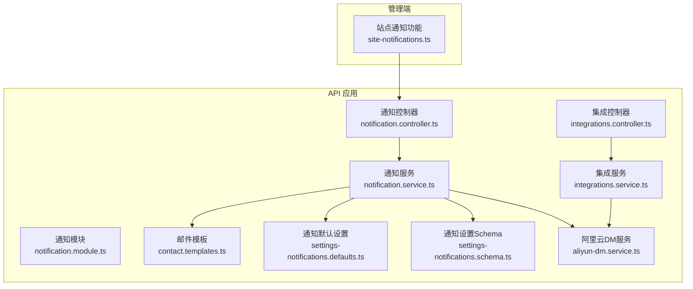
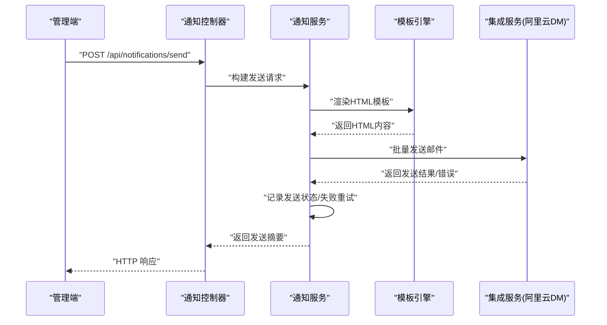
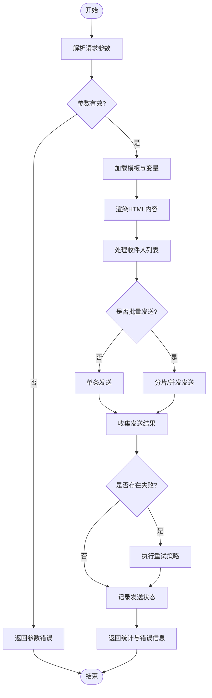
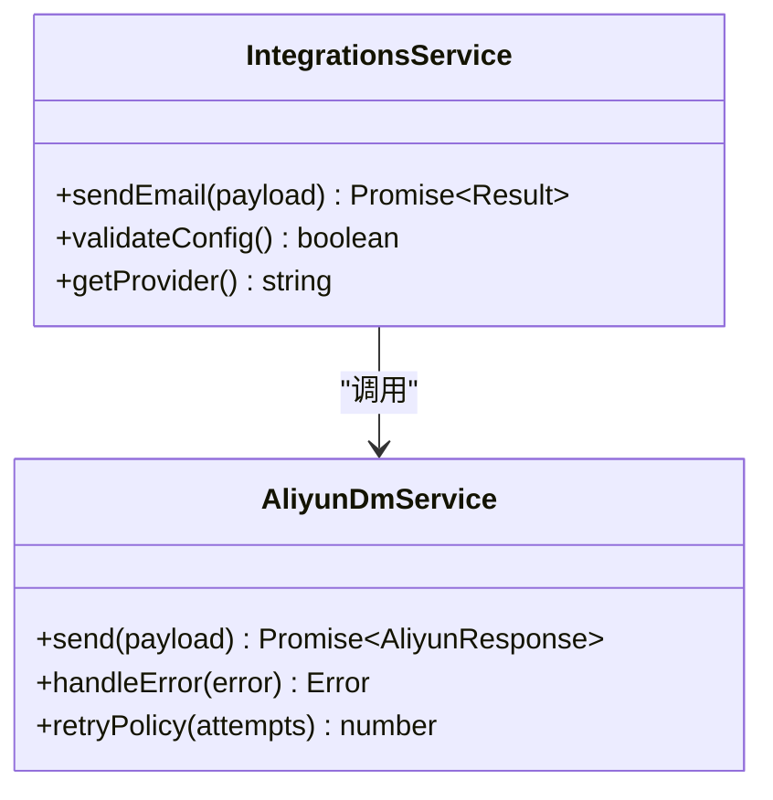
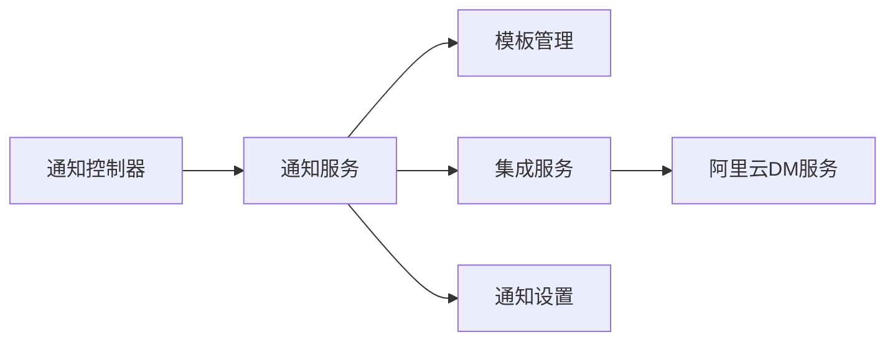

# 通知系统

<cite>
**本文引用的文件**   
- [notification.controller.ts](file://apps/api/src/notifications/notification.controller.ts)
- [notification.service.ts](file://apps/api/src/notifications/notification.service.ts)
- [notification.module.ts](file://apps/api/src/notifications/notification.module.ts)
- [contact.templates.ts](file://apps/api/src/notifications/email/templates/contact.templates.ts)
- [settings-notifications.defaults.ts](file://apps/api/src/settings/settings-notifications.defaults.ts)
- [settings-notifications.schema.ts](file://apps/api/src/settings/settings-notifications.schema.ts)
- [integrations.controller.ts](file://apps/api/src/integrations/integrations.controller.ts)
- [integrations.service.ts](file://apps/api/src/integrations/integrations.service.ts)
- [integrations.schema.ts](file://apps/api/src/integrations/integrations.schema.ts)
- [aliyun-dm.service.ts](file://apps/api/src/integrations/aliyun-dm.service.ts)
- [site-notifications.ts](file://apps/admin/src/features/site-notifications.ts)
</cite>

## 目录
1. [简介](#简介)
2. [项目结构](#项目结构)
3. [核心组件](#核心组件)
4. [架构总览](#架构总览)
5. [详细组件分析](#详细组件分析)
6. [依赖关系分析](#依赖关系分析)
7. [性能考虑](#性能考虑)
8. [故障排查指南](#故障排查指南)
9. [结论](#结论)
10. [附录](#附录)

## 简介
本文件为通知系统的技术文档，聚焦邮件通知、模板管理与发送队列处理。内容涵盖：
- 阿里云邮件服务集成（Direct Mail）
- HTML 模板渲染与变量替换
- 批量发送与失败重试机制
- 通知历史记录、发送状态跟踪与错误处理策略
- 通知 API 接口说明与模板定制指南

该模块位于后端 NestJS 应用中，提供统一的邮件发送能力，并通过设置项管理通知配置，通过集成层对接阿里云 DM 服务。

## 项目结构
通知相关代码主要分布在以下位置：
- 控制器与服务：apps/api/src/notifications
- 邮件模板：apps/api/src/notifications/email/templates
- 通知设置：apps/api/src/settings
- 集成层（阿里云 DM）：apps/api/src/integrations
- 前端调用入口（管理端）：apps/admin/src/features/site-notifications.ts

**图表来源** 
- [notification.controller.ts](file://apps/api/src/notifications/notification.controller.ts)
- [notification.service.ts](file://apps/api/src/notifications/notification.service.ts)
- [notification.module.ts](file://apps/api/src/notifications/notification.module.ts)
- [contact.templates.ts](file://apps/api/src/notifications/email/templates/contact.templates.ts)
- [settings-notifications.defaults.ts](file://apps/api/src/settings/settings-notifications.defaults.ts)
- [settings-notifications.schema.ts](file://apps/api/src/settings/settings-notifications.schema.ts)
- [integrations.controller.ts](file://apps/api/src/integrations/integrations.controller.ts)
- [integrations.service.ts](file://apps/api/src/integrations/integrations.service.ts)
- [aliyun-dm.service.ts](file://apps/api/src/integrations/aliyun-dm.service.ts)

**章节来源**
- [notification.controller.ts](file://apps/api/src/notifications/notification.controller.ts)
- [notification.service.ts](file://apps/api/src/notifications/notification.service.ts)
- [notification.module.ts](file://apps/api/src/notifications/notification.module.ts)
- [contact.templates.ts](file://apps/api/src/notifications/email/templates/contact.templates.ts)
- [settings-notifications.defaults.ts](file://apps/api/src/settings/settings-notifications.defaults.ts)
- [settings-notifications.schema.ts](file://apps/api/src/settings/settings-notifications.schema.ts)
- [integrations.controller.ts](file://apps/api/src/integrations/integrations.controller.ts)
- [integrations.service.ts](file://apps/api/src/integrations/integrations.service.ts)
- [aliyun-dm.service.ts](file://apps/api/src/integrations/aliyun-dm.service.ts)
- [site-notifications.ts](file://apps/admin/src/features/site-notifications.ts)

## 核心组件
- 通知控制器：暴露通知相关的 HTTP 接口，接收请求并委派给通知服务处理。
- 通知服务：封装邮件发送的核心逻辑，包括模板渲染、收件人列表处理、批量发送、失败重试、状态记录等。
- 邮件模板：集中管理 HTML 模板内容与占位符，支持按场景选择模板。
- 通知设置：定义通知开关、默认值与校验规则，确保配置一致性。
- 集成层：统一接入第三方邮件服务（当前为阿里云 Direct Mail），屏蔽差异并提供稳定接口。

**章节来源**
- [notification.controller.ts](file://apps/api/src/notifications/notification.controller.ts)
- [notification.service.ts](file://apps/api/src/notifications/notification.service.ts)
- [contact.templates.ts](file://apps/api/src/notifications/email/templates/contact.templates.ts)
- [settings-notifications.defaults.ts](file://apps/api/src/settings/settings-notifications.defaults.ts)
- [settings-notifications.schema.ts](file://apps/api/src/settings/settings-notifications.schema.ts)
- [integrations.controller.ts](file://apps/api/src/integrations/integrations.controller.ts)
- [integrations.service.ts](file://apps/api/src/integrations/integrations.service.ts)
- [aliyun-dm.service.ts](file://apps/api/src/integrations/aliyun-dm.service.ts)

## 架构总览
通知系统采用分层设计：
- 控制层：对外暴露 RESTful 接口，负责参数校验与响应包装。
- 业务层：实现发送流程编排、模板渲染、重试策略、状态记录。
- 集成层：对接阿里云 DM，提供发送能力与结果回调。
- 数据层：通过设置模块持久化通知配置；可扩展为数据库或缓存存储发送历史与状态。

**图表来源** 
- [notification.controller.ts](file://apps/api/src/notifications/notification.controller.ts)
- [notification.service.ts](file://apps/api/src/notifications/notification.service.ts)
- [contact.templates.ts](file://apps/api/src/notifications/email/templates/contact.templates.ts)
- [integrations.service.ts](file://apps/api/src/integrations/integrations.service.ts)
- [aliyun-dm.service.ts](file://apps/api/src/integrations/aliyun-dm.service.ts)

## 详细组件分析

### 通知控制器
职责：
- 定义路由与 HTTP 方法，映射到通知服务的对应方法。
- 对入参进行基础校验，组织请求体后交由服务处理。
- 统一异常处理与响应格式。

关键点：
- 接口命名清晰，便于前端调用。
- 支持批量发送的请求体结构（如收件人数组、模板标识、变量对象）。
- 将发送结果中的关键信息（成功数、失败数、错误原因）返回给调用方。

**章节来源**
- [notification.controller.ts](file://apps/api/src/notifications/notification.controller.ts)

### 通知服务
职责：
- 解析请求参数，确定目标模板与变量。
- 渲染 HTML 模板，生成最终邮件内容。
- 处理收件人列表，支持去重、过滤无效邮箱。
- 调用集成层进行批量发送。
- 记录发送状态（成功/失败/重试中），实现失败重试。
- 聚合发送结果，返回统计信息与错误详情。

关键点：
- 模板渲染：根据模板标识选择模板，注入变量，生成 HTML。
- 批量发送：分片或并发策略，避免一次性过大负载。
- 失败重试：指数退避或固定间隔，限制最大重试次数。
- 状态跟踪：维护每条消息的状态与错误码，便于查询与审计。

**图表来源** 
- [notification.service.ts](file://apps/api/src/notifications/notification.service.ts)
- [contact.templates.ts](file://apps/api/src/notifications/email/templates/contact.templates.ts)
- [integrations.service.ts](file://apps/api/src/integrations/integrations.service.ts)
- [aliyun-dm.service.ts](file://apps/api/src/integrations/aliyun-dm.service.ts)

**章节来源**
- [notification.service.ts](file://apps/api/src/notifications/notification.service.ts)

### 邮件模板管理
职责：
- 集中管理 HTML 模板，按场景分类（如联系表单、通知提醒等）。
- 定义模板变量与默认值，保证渲染稳定性。
- 提供模板选择器，根据业务类型动态加载模板。

关键点：
- 模板结构清晰，变量命名规范，便于维护。
- 支持多语言扩展（如需），通过变量注入不同文案。
- 模板校验：在渲染前检查必要变量是否存在。

**章节来源**
- [contact.templates.ts](file://apps/api/src/notifications/email/templates/contact.templates.ts)

### 通知设置与默认值
职责：
- 定义通知功能的开关、默认配置与校验规则。
- 提供默认值，确保未配置时系统仍可运行。
- 通过 Schema 约束配置项类型与取值范围。

关键点：
- 可配置项包括：是否启用通知、默认模板、重试策略、限流阈值等。
- 设置变更需触发服务重新加载配置，避免重启影响。

**章节来源**
- [settings-notifications.defaults.ts](file://apps/api/src/settings/settings-notifications.defaults.ts)
- [settings-notifications.schema.ts](file://apps/api/src/settings/settings-notifications.schema.ts)

### 集成层与阿里云 DM 服务
职责：
- 抽象邮件发送接口，屏蔽底层差异。
- 实现阿里云 Direct Mail 的客户端调用，处理认证、签名、请求构造。
- 统一错误码与异常转换，便于上层处理。

关键点：
- 连接池与超时配置，提升发送性能与稳定性。
- 重试与降级：网络异常时自动重试，达到上限后快速失败。
- 日志与监控：记录关键步骤与错误信息，便于问题定位。

**图表来源** 
- [integrations.service.ts](file://apps/api/src/integrations/integrations.service.ts)
- [aliyun-dm.service.ts](file://apps/api/src/integrations/aliyun-dm.service.ts)

**章节来源**
- [integrations.controller.ts](file://apps/api/src/integrations/integrations.controller.ts)
- [integrations.service.ts](file://apps/api/src/integrations/integrations.service.ts)
- [integrations.schema.ts](file://apps/api/src/integrations/integrations.schema.ts)
- [aliyun-dm.service.ts](file://apps/api/src/integrations/aliyun-dm.service.ts)

### 管理端调用入口
职责：
- 提供前端调用通知接口的封装，简化参数组装与错误处理。
- 支持批量发送与状态轮询（如需）。

关键点：
- 统一错误提示与用户反馈。
- 支持取消发送与进度展示（可选增强）。

**章节来源**
- [site-notifications.ts](file://apps/admin/src/features/site-notifications.ts)

## 依赖关系分析
通知模块依赖设置模块与集成模块，形成清晰的解耦结构：
- 控制器依赖服务，服务依赖模板与集成层。
- 设置模块提供运行时配置，集成模块提供外部服务访问。
- 无循环依赖，职责单一，易于测试与维护。

**图表来源** 
- [notification.controller.ts](file://apps/api/src/notifications/notification.controller.ts)
- [notification.service.ts](file://apps/api/src/notifications/notification.service.ts)
- [contact.templates.ts](file://apps/api/src/notifications/email/templates/contact.templates.ts)
- [integrations.service.ts](file://apps/api/src/integrations/integrations.service.ts)
- [aliyun-dm.service.ts](file://apps/api/src/integrations/aliyun-dm.service.ts)
- [settings-notifications.defaults.ts](file://apps/api/src/settings/settings-notifications.defaults.ts)

**章节来源**
- [notification.controller.ts](file://apps/api/src/notifications/notification.controller.ts)
- [notification.service.ts](file://apps/api/src/notifications/notification.service.ts)
- [integrations.service.ts](file://apps/api/src/integrations/integrations.service.ts)
- [aliyun-dm.service.ts](file://apps/api/src/integrations/aliyun-dm.service.ts)
- [settings-notifications.defaults.ts](file://apps/api/src/settings/settings-notifications.defaults.ts)

## 性能考虑
- 批量发送：建议分片处理，避免单次请求过大导致超时或内存压力。
- 并发控制：限制并发数，防止对下游服务造成冲击。
- 模板渲染：预编译或缓存常用模板，减少重复计算。
- 重试策略：指数退避与最大重试次数，避免雪崩效应。
- 资源清理：及时释放连接与临时文件，避免资源泄漏。

[本节为通用指导，不直接分析具体文件]

## 故障排查指南
常见问题与处理建议：
- 模板变量缺失：检查模板定义与传入变量是否匹配，增加默认值与校验。
- 收件人无效：过滤非法邮箱地址，记录失败原因。
- 发送失败：查看集成层错误码与日志，确认阿里云 DM 配置与配额。
- 重试风暴：调整重试间隔与次数，避免频繁重试导致阻塞。
- 状态不一致：核对发送记录与实际结果，必要时进行补偿。

**章节来源**
- [notification.service.ts](file://apps/api/src/notifications/notification.service.ts)
- [integrations.service.ts](file://apps/api/src/integrations/integrations.service.ts)
- [aliyun-dm.service.ts](file://apps/api/src/integrations/aliyun-dm.service.ts)

## 结论
通知系统通过分层设计与模块化组织，实现了邮件通知、模板管理与发送队列处理的完整闭环。结合阿里云 DM 服务，提供了稳定高效的邮件发送能力。通过设置管理与错误处理策略，确保了系统的可配置性与健壮性。未来可扩展更多渠道与更复杂的队列处理能力。

[本节为总结，不直接分析具体文件]

## 附录
- 通知 API 接口：参考控制器定义的路由与方法。
- 模板定制指南：参考模板文件结构与变量约定。
- 集成配置：参考集成模块与阿里云 DM 服务配置项。

[本节为补充信息，不直接分析具体文件]