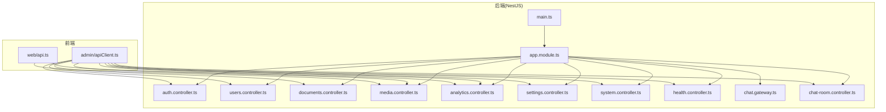
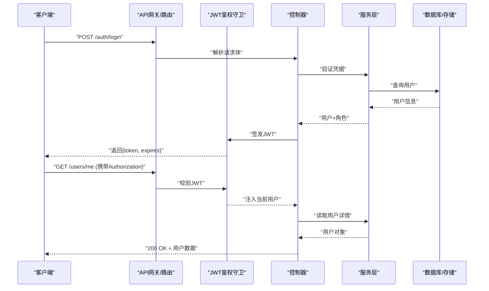
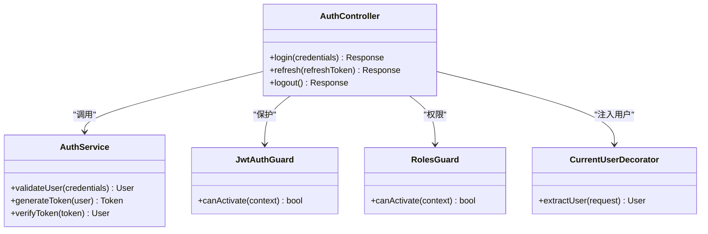
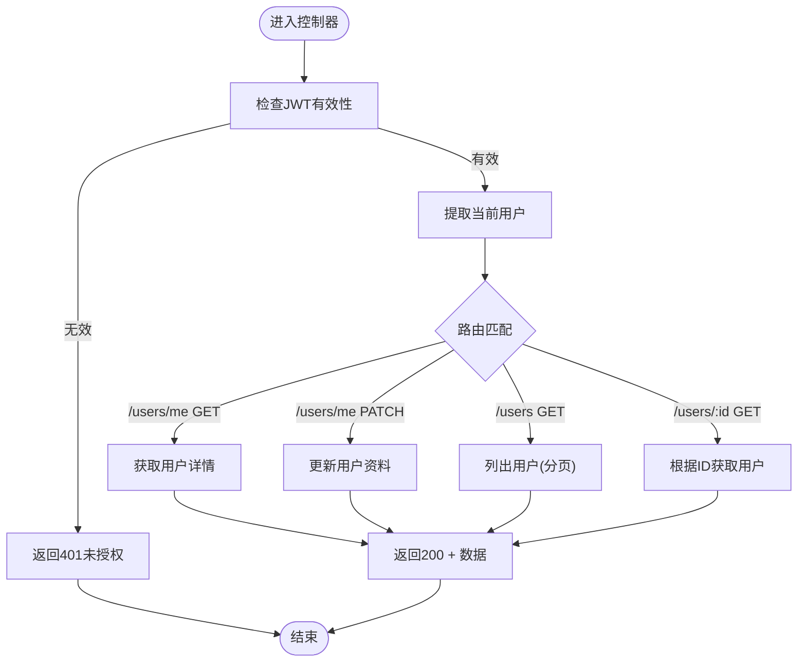
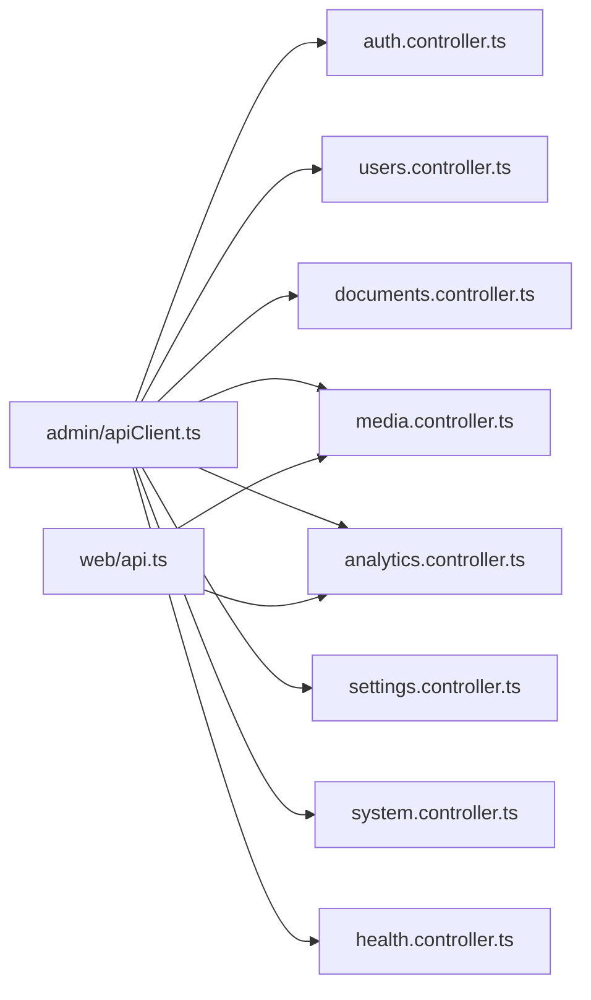

# API接口文档

<cite>
**本文档引用的文件**   
- [apps/api/src/main.ts](file://apps/api/src/main.ts)
- [apps/api/src/app.module.ts](file://apps/api/src/app.module.ts)
- [apps/api/src/auth/auth.controller.ts](file://apps/api/src/auth/auth.controller.ts)
- [apps/api/src/auth/auth.service.ts](file://apps/api/src/auth/auth.service.ts)
- [apps/api/src/auth/guards/jwt-auth.guard.ts](file://apps/api/src/auth/guards/jwt-auth.guard.ts)
- [apps/api/src/auth/guards/roles.guard.ts](file://apps/api/src/auth/guards/roles.guard.ts)
- [apps/api/src/auth/decorators/current-user.decorator.ts](file://apps/api/src/auth/decorators/current-user.decorator.ts)
- [apps/api/src/auth/decorators/require-permissions.decorator.ts](file://apps/api/src/auth/decorators/require-permissions.decorator.ts)
- [apps/api/src/common/filters/http-exception.filter.ts](file://apps/api/src/common/filters/http-exception.filter.ts)
- [apps/api/src/common/interceptors/transform.interceptor.ts](file://apps/api/src/common/interceptors/transform.interceptor.ts)
- [apps/api/src/analytics/analytics.controller.ts](file://apps/api/src/analytics/analytics.controller.ts)
- [apps/api/src/analytics/dto/collect-pageview.dto.ts](file://apps/api/src/analytics/dto/collect-pageview.dto.ts)
- [apps/api/src/analytics/dto/identify.dto.ts](file://apps/api/src/analytics/dto/identify.dto.ts)
- [apps/api/src/users/users.controller.ts](file://apps/api/src/users/users.controller.ts)
- [apps/api/src/users/dto/user.dto.ts](file://apps/api/src/users/dto/user.dto.ts)
- [apps/api/src/access/access.controller.ts](file://apps/api/src/access/access.controller.ts)
- [apps/api/src/access/dto/role.dto.ts](file://apps/api/src/access/dto/role.dto.ts)
- [apps/api/src/documents/documents.controller.ts](file://apps/api/src/documents/documents.controller.ts)
- [apps/api/src/documents/dto/document.dto.ts](file://apps/api/src/documents/dto/document-permission.dto.ts)
- [apps/api/src/media/media.controller.ts](file://apps/api/src/media/media.controller.ts)
- [apps/api/src/support/chat.gateway.ts](file://apps/api/src/support/chat.gateway.ts)
- [apps/api/src/support/chat-room.controller.ts](file://apps/api/src/support/chat-room.controller.ts)
- [apps/api/src/settings/settings.controller.ts](file://apps/api/src/settings/settings.controller.ts)
- [apps/api/src/system/system.controller.ts](file://apps/api/src/system/system.controller.ts)
- [apps/api/src/health/health.controller.ts](file://apps/api/src/health/health.controller.ts)
- [apps/api/src/config/env.validation.ts](file://apps/api/src/config/env.validation.ts)
- [apps/admin/src/lib/apiClient.ts](file://apps/admin/src/lib/apiClient.ts)
- [apps/web/src/lib/api.ts](file://apps/web/src/lib/api.ts)
</cite>

## 目录
1. [简介](#简介)
2. [项目结构](#项目结构)
3. [核心组件](#核心组件)
4. [架构总览](#架构总览)
5. [详细组件分析](#详细组件分析)
6. [依赖关系分析](#依赖关系分析)
7. [性能考虑](#性能考虑)
8. [故障排查指南](#故障排查指南)
9. [结论](#结论)
10. [附录](#附录)

## 简介
本文件为项目的API接口规范与集成参考，面向前端开发与第三方集成。内容涵盖：
- RESTful API端点规范（HTTP方法、URL路径、请求参数、响应格式、错误码）
- 统一认证与权限验证流程（JWT、角色与权限）
- 数据校验与分页处理规范
- WebSocket实时通信协议（连接、消息格式、事件类型）
- OpenAPI/Swagger与Postman集合的生成与使用建议
- 客户端SDK示例与最佳实践

## 项目结构
后端基于NestJS模块化架构，按领域划分控制器、服务与DTO；前端通过Next.js应用调用后端API或BFF代理。关键入口与模块如下：
- 应用启动与全局配置：main.ts、app.module.ts
- 认证与安全：auth模块、guards、decorators、filters、interceptors
- 业务域：users、access、documents、media、analytics、settings、system、health等
- 实时通信：support模块中的WebSocket Gateway
- 前端客户端封装：admin与web应用的apiClient与api库

图表来源
- [apps/api/src/main.ts](file://apps/api/src/main.ts)
- [apps/api/src/app.module.ts](file://apps/api/src/app.module.ts)
- [apps/api/src/auth/auth.controller.ts](file://apps/api/src/auth/auth.controller.ts)
- [apps/api/src/users/users.controller.ts](file://apps/api/src/users/users.controller.ts)
- [apps/api/src/documents/documents.controller.ts](file://apps/api/src/documents/documents.controller.ts)
- [apps/api/src/media/media.controller.ts](file://apps/api/src/media/media.controller.ts)
- [apps/api/src/analytics/analytics.controller.ts](file://apps/api/src/analytics/analytics.controller.ts)
- [apps/api/src/settings/settings.controller.ts](file://apps/api/src/settings/settings.controller.ts)
- [apps/api/src/system/system.controller.ts](file://apps/api/src/system/system.controller.ts)
- [apps/api/src/health/health.controller.ts](file://apps/api/src/health/health.controller.ts)
- [apps/api/src/support/chat.gateway.ts](file://apps/api/src/support/chat.gateway.ts)
- [apps/api/src/support/chat-room.controller.ts](file://apps/api/src/support/chat-room.controller.ts)
- [apps/admin/src/lib/apiClient.ts](file://apps/admin/src/lib/apiClient.ts)
- [apps/web/src/lib/api.ts](file://apps/web/src/lib/api.ts)

章节来源
- [apps/api/src/main.ts](file://apps/api/src/main.ts)
- [apps/api/src/app.module.ts](file://apps/api/src/app.module.ts)

## 核心组件
- 认证与授权
  - JWT鉴权守卫与策略：用于登录、令牌签发与校验
  - 角色与权限装饰器：控制访问粒度
  - 当前用户注入装饰器：在控制器中获取已认证用户上下文
- 通用过滤器与拦截器
  - HTTP异常过滤器：统一错误响应格式
  - 响应转换拦截器：统一成功响应包装
- 数据校验
  - DTO定义：各模块的请求体与查询参数校验
- 分页与排序
  - 列表接口统一分页参数与返回结构
- 实时通信
  - WebSocket Gateway：聊天与会话状态推送

章节来源
- [apps/api/src/auth/guards/jwt-auth.guard.ts](file://apps/api/src/auth/guards/jwt-auth.guard.ts)
- [apps/api/src/auth/decorators/current-user.decorator.ts](file://apps/api/src/auth/decorators/current-user.decorator.ts)
- [apps/api/src/auth/decorators/require-permissions.decorator.ts](file://apps/api/src/auth/decorators/require-permissions.decorator.ts)
- [apps/api/src/common/filters/http-exception.filter.ts](file://apps/api/src/common/filters/http-exception.filter.ts)
- [apps/api/src/common/interceptors/transform.interceptor.ts](file://apps/api/src/common/interceptors/transform.interceptor.ts)
- [apps/api/src/analytics/dto/collect-pageview.dto.ts](file://apps/api/src/analytics/dto/collect-pageview.dto.ts)
- [apps/api/src/analytics/dto/identify.dto.ts](file://apps/api/src/analytics/dto/identify.dto.ts)
- [apps/api/src/users/dto/user.dto.ts](file://apps/api/src/users/dto/user.dto.ts)
- [apps/api/src/access/dto/role.dto.ts](file://apps/api/src/access/dto/role.dto.ts)
- [apps/api/src/documents/dto/document-permission.dto.ts](file://apps/api/src/documents/dto/document-permission.dto.ts)

## 架构总览
系统采用前后端分离架构，前端通过REST与WebSocket与后端交互。认证由JWT完成，权限由角色与自定义权限装饰器控制。所有HTTP异常被统一捕获并转换为标准错误响应。

图表来源
- [apps/api/src/auth/auth.controller.ts](file://apps/api/src/auth/auth.controller.ts)
- [apps/api/src/auth/auth.service.ts](file://apps/api/src/auth/auth.service.ts)
- [apps/api/src/auth/guards/jwt-auth.guard.ts](file://apps/api/src/auth/guards/jwt-auth.guard.ts)
- [apps/api/src/users/users.controller.ts](file://apps/api/src/users/users.controller.ts)

## 详细组件分析

### 认证与授权（Auth）
- 登录
  - 方法：POST
  - 路径：/auth/login
  - 请求体：用户名/邮箱、密码（具体字段以DTO为准）
  - 响应：包含访问令牌与过期时间
  - 错误：401（凭据无效）、422（参数校验失败）
- 刷新令牌
  - 方法：POST
  - 路径：/auth/refresh
  - 请求体：刷新令牌
  - 响应：新的访问令牌
- 登出
  - 方法：POST
  - 路径：/auth/logout
  - 响应：成功确认
- 权限控制
  - 使用角色与权限装饰器限制访问
  - 未授权返回403，令牌无效返回401

图表来源
- [apps/api/src/auth/auth.controller.ts](file://apps/api/src/auth/auth.controller.ts)
- [apps/api/src/auth/auth.service.ts](file://apps/api/src/auth/auth.service.ts)
- [apps/api/src/auth/guards/jwt-auth.guard.ts](file://apps/api/src/auth/guards/jwt-auth.guard.ts)
- [apps/api/src/auth/decorators/current-user.decorator.ts](file://apps/api/src/auth/decorators/current-user.decorator.ts)

章节来源
- [apps/api/src/auth/auth.controller.ts](file://apps/api/src/auth/auth.controller.ts)
- [apps/api/src/auth/auth.service.ts](file://apps/api/src/auth/auth.service.ts)
- [apps/api/src/auth/guards/jwt-auth.guard.ts](file://apps/api/src/auth/guards/jwt-auth.guard.ts)
- [apps/api/src/auth/decorators/current-user.decorator.ts](file://apps/api/src/auth/decorators/current-user.decorator.ts)
- [apps/api/src/auth/decorators/require-permissions.decorator.ts](file://apps/api/src/auth/decorators/require-permissions.decorator.ts)

### 用户管理（Users）
- 获取当前用户
  - 方法：GET
  - 路径：/users/me
  - 鉴权：需要有效JWT
  - 响应：用户基本信息
- 更新用户资料
  - 方法：PATCH
  - 路径：/users/me
  - 请求体：可更新字段（以DTO为准）
  - 响应：更新后的用户信息
- 用户列表与详情
  - 方法：GET
  - 路径：/users、/users/:id
  - 鉴权：管理员或具备相应权限
  - 分页：支持page、pageSize、sort等参数
  - 响应：列表或单个用户对象

图表来源
- [apps/api/src/users/users.controller.ts](file://apps/api/src/users/users.controller.ts)
- [apps/api/src/users/dto/user.dto.ts](file://apps/api/src/users/dto/user.dto.ts)

章节来源
- [apps/api/src/users/users.controller.ts](file://apps/api/src/users/users.controller.ts)
- [apps/api/src/users/dto/user.dto.ts](file://apps/api/src/users/dto/user.dto.ts)

### 访问控制与角色（Access）
- 角色管理
  - 方法：GET/POST/PATCH/DELETE
  - 路径：/access/roles、/access/roles/:id
  - 鉴权：管理员或具备角色管理权限
  - 请求体：角色名称、权限集合（以DTO为准）
- 权限校验
  - 使用权限装饰器进行细粒度控制
  - 未满足权限返回403

章节来源
- [apps/api/src/access/access.controller.ts](file://apps/api/src/access/access.controller.ts)
- [apps/api/src/access/dto/role.dto.ts](file://apps/api/src/access/dto/role.dto.ts)

### 文档管理（Documents）
- 文档CRUD
  - 方法：GET/POST/PATCH/DELETE
  - 路径：/documents、/documents/:id
  - 鉴权：按文档权限模型控制
  - 请求体：标题、内容、标签、权限等（以DTO为准）
- 文档权限
  - 方法：GET/POST/PATCH/DELETE
  - 路径：/documents/:id/permissions
  - 请求体：用户/角色与操作权限映射

章节来源
- [apps/api/src/documents/documents.controller.ts](file://apps/api/src/documents/documents.controller.ts)
- [apps/api/src/documents/dto/document-permission.dto.ts](file://apps/api/src/documents/dto/document-permission.dto.ts)

### 媒体资源（Media）
- 上传与下载
  - 方法：POST/GET
  - 路径：/media/upload、/media/:path
  - 鉴权：上传需认证，下载可能公开或受限
  - 响应：上传成功后返回媒体URL或元数据
- 水印与静态路径
  - 服务端支持水印与静态路径白名单

章节来源
- [apps/api/src/media/media.controller.ts](file://apps/api/src/media/media.controller.ts)

### 分析采集（Analytics）
- 页面浏览采集
  - 方法：POST
  - 路径：/analytics/pageview
  - 请求体：页面信息、设备与来源（以DTO为准）
  - 响应：200成功
- 访客识别
  - 方法：POST
  - 路径：/analytics/identify
  - 请求体：访客标识与属性（以DTO为准）

章节来源
- [apps/api/src/analytics/analytics.controller.ts](file://apps/api/src/analytics/analytics.controller.ts)
- [apps/api/src/analytics/dto/collect-pageview.dto.ts](file://apps/api/src/analytics/dto/collect-pageview.dto.ts)
- [apps/api/src/analytics/dto/identify.dto.ts](file://apps/api/src/analytics/dto/identify.dto.ts)

### 设置与系统（Settings & System）
- 站点设置
  - 方法：GET/PUT
  - 路径：/settings/*
  - 鉴权：管理员
  - 请求体：键值对配置（以Schema为准）
- 系统信息与健康检查
  - 方法：GET
  - 路径：/system/info、/health/check
  - 响应：系统版本、运行状态等

章节来源
- [apps/api/src/settings/settings.controller.ts](file://apps/api/src/settings/settings.controller.ts)
- [apps/api/src/system/system.controller.ts](file://apps/api/src/system/system.controller.ts)
- [apps/api/src/health/health.controller.ts](file://apps/api/src/health/health.controller.ts)

### 实时通信（WebSocket）
- 连接协议
  - 使用Socket.IO或原生WebSocket
  - 连接时携带JWT作为认证参数
- 命名空间与房间
  - 会话级房间：每个对话一个房间
  - 在线状态：加入/离开房间触发存在性事件
- 消息格式
  - 文本消息、附件、系统提示
  - 事件类型：message、typing、presence、error
- 错误处理
  - 连接失败、鉴权失败、房间不存在等错误事件

章节来源
- [apps/api/src/support/chat.gateway.ts](file://apps/api/src/support/chat.gateway.ts)
- [apps/api/src/support/chat-room.controller.ts](file://apps/api/src/support/chat-room.controller.ts)

## 依赖关系分析
- 控制器依赖服务层，服务层依赖数据访问层（Prisma/存储）
- 认证与权限贯穿所有受保护端点
- 过滤器与拦截器统一处理异常与响应格式
- 前端通过统一的API客户端封装请求、重试与鉴权

图表来源
- [apps/admin/src/lib/apiClient.ts](file://apps/admin/src/lib/apiClient.ts)
- [apps/web/src/lib/api.ts](file://apps/web/src/lib/api.ts)
- [apps/api/src/auth/auth.controller.ts](file://apps/api/src/auth/auth.controller.ts)
- [apps/api/src/users/users.controller.ts](file://apps/api/src/users/users.controller.ts)
- [apps/api/src/documents/documents.controller.ts](file://apps/api/src/documents/documents.controller.ts)
- [apps/api/src/media/media.controller.ts](file://apps/api/src/media/media.controller.ts)
- [apps/api/src/analytics/analytics.controller.ts](file://apps/api/src/analytics/analytics.controller.ts)
- [apps/api/src/settings/settings.controller.ts](file://apps/api/src/settings/settings.controller.ts)
- [apps/api/src/system/system.controller.ts](file://apps/api/src/system/system.controller.ts)
- [apps/api/src/health/health.controller.ts](file://apps/api/src/health/health.controller.ts)

章节来源
- [apps/admin/src/lib/apiClient.ts](file://apps/admin/src/lib/apiClient.ts)
- [apps/web/src/lib/api.ts](file://apps/web/src/lib/api.ts)

## 性能考虑
- 缓存策略：对只读列表与静态资源启用缓存头
- 分页与限流：列表接口默认分页，避免大结果集；对高频接口实施限流
- 异步处理：耗时任务使用队列或后台任务
- 连接池：数据库与外部存储的连接池优化
- 压缩与传输：启用Gzip/Brotli，减少响应体积

## 故障排查指南
- 常见错误码
  - 400：请求参数错误（校验失败）
  - 401：未认证或令牌无效
  - 403：权限不足
  - 404：资源不存在
  - 422：请求体验证失败
  - 500：服务器内部错误
- 日志与调试
  - 查看统一异常过滤器输出
  - 开启请求ID中间件追踪链路
- 常见问题定位
  - 认证失败：检查Authorization头与令牌有效期
  - 权限拒绝：核对角色与权限装饰器配置
  - 数据校验错误：对照DTO字段要求

章节来源
- [apps/api/src/common/filters/http-exception.filter.ts](file://apps/api/src/common/filters/http-exception.filter.ts)
- [apps/api/src/config/env.validation.ts](file://apps/api/src/config/env.validation.ts)

## 结论
本API文档提供了完整的REST与WebSocket接口规范，覆盖认证、权限、数据校验、分页与错误处理等关键方面。结合OpenAPI与Postman集合，可快速生成文档与测试套件，提升前后端协作效率与第三方集成质量。

## 附录

### 统一响应格式
- 成功响应
  - 结构：{ code, message, data }
  - code：业务状态码（如200表示成功）
  - message：提示信息
  - data：业务数据（对象或数组）
- 错误响应
  - 结构：{ code, message, details? }
  - code：错误码（如401、403、422等）
  - message：错误描述
  - details：可选，详细错误信息（字段级）

### 分页规范
- 查询参数
  - page：页码（从1开始）
  - pageSize：每页数量
  - sort：排序字段与方向（如field:asc）
  - filter：过滤条件（JSON或查询串）
- 响应结构
  - data：数组
  - pagination：{ total, page, pageSize, totalPages }

### 认证与权限规范
- 认证方式
  - Bearer Token：Authorization: Bearer <token>
- 权限模型
  - 角色：基础访问控制
  - 权限：细粒度操作控制（如read/write/delete）
- 令牌生命周期
  - 访问令牌短期有效，刷新令牌用于续期

### WebSocket协议规范
- 连接建立
  - URL：ws(s)://host/namespace
  - 认证：连接时附带token参数或在握手后发送鉴权消息
- 事件类型
  - message：聊天消息
  - typing：输入状态
  - presence：在线状态变化
  - error：错误事件
- 消息格式
  - type：事件类型
  - payload：业务数据
  - timestamp：时间戳

### OpenAPI/Swagger与Postman集合
- 生成OpenAPI
  - 使用NestJS Swagger插件扫描控制器与DTO
  - 导出schema为YAML/JSON
- Postman集合
  - 导入OpenAPI生成集合
  - 环境变量：BASE_URL、TOKEN、REFRESH_TOKEN
- 客户端SDK示例
  - 封装认证、重试、错误处理
  - 提供类型安全的请求方法

章节来源
- [apps/api/src/common/interceptors/transform.interceptor.ts](file://apps/api/src/common/interceptors/transform.interceptor.ts)
- [apps/api/src/config/env.validation.ts](file://apps/api/src/config/env.validation.ts)