# 内容管理API

<cite>
**本文引用的文件**   
- [blogs.controller.ts](file://apps/api/src/blogs/blogs.controller.ts)
- [blogs.service.ts](file://apps/api/src/blogs/blogs.service.ts)
- [blog.dto.ts](file://apps/api/src/blogs/dto/blog.dto.ts)
- [news.controller.ts](file://apps/api/src/news/news.controller.ts)
- [news.service.ts](file://apps/api/src/news/news.service.ts)
- [news.dto.ts](file://apps/api/src/news/dto/news.dto.ts)
- [cases.controller.ts](file://apps/api/src/cases/cases.controller.ts)
- [cases.service.ts](file://apps/api/src/cases/cases.service.ts)
- [case.dto.ts](file://apps/api/src/cases/dto/case.dto.ts)
- [documents.controller.ts](file://apps/api/src/documents/documents.controller.ts)
- [documents.service.ts](file://apps/api/src/documents/documents.service.ts)
- [document.dto.ts](file://apps/api/src/documents/dto/document.dto.ts)
- [trade-shows.controller.ts](file://apps/api/src/trade-shows/trade-shows.controller.ts)
- [trade-shows.service.ts](file://apps/api/src/trade-shows/trade-shows.service.ts)
- [trade-show.dto.ts](file://apps/api/src/trade-shows/dto/trade-show.dto.ts)
- [content-status.enum.ts](file://apps/api/src/common/enums/content-status.enum.ts)
- [markdown.ts](file://apps/api/src/common/utils/markdown.ts)
- [content-list.ts](file://apps/api/src/common/utils/content-list.ts)
- [content-query.ts](file://apps/api/src/common/utils/content-query.ts)
- [content-metadata.ts](file://apps/api/src/common/utils/content-metadata.ts)
- [publishing.service.ts](file://apps/api/src/publishing/publishing.service.ts)
- [schema.prisma](file://apps/api/prisma/schema.prisma)
</cite>

## 目录
1. [简介](#简介)
2. [项目结构](#项目结构)
3. [核心组件](#核心组件)
4. [架构总览](#架构总览)
5. [详细组件分析](#详细组件分析)
6. [依赖关系分析](#依赖关系分析)
7. [性能考虑](#性能考虑)
8. [故障排查指南](#故障排查指南)
9. [结论](#结论)
10. [附录](#附录)

## 简介
本文件为内容管理API的权威文档，覆盖博客、新闻、案例、文档与展会等内容的增删改查接口。重点说明Markdown内容处理、富文本编辑支持、版本控制与发布流程，以及内容分类、标签管理、SEO优化与搜索功能的API规范。同时提供内容预览、草稿保存与批量操作的接口示例与最佳实践。

## 项目结构
后端采用NestJS模块化架构，按业务域划分模块（blogs、news、cases、documents、trade-shows），每个模块包含控制器、服务与DTO；通用能力集中在common目录（枚举、工具函数、中间件、过滤器等）；数据模型与迁移位于prisma目录；发布流程由独立模块提供服务。

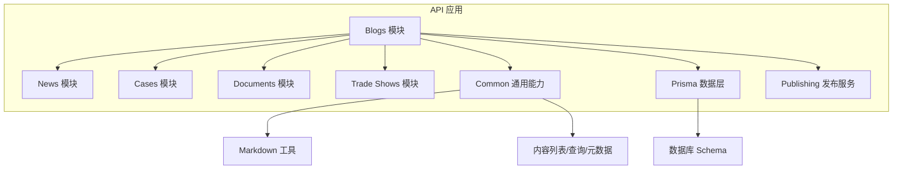

图表来源
- [blogs.controller.ts](file://apps/api/src/blogs/blogs.controller.ts)
- [news.controller.ts](file://apps/api/src/news/news.controller.ts)
- [cases.controller.ts](file://apps/api/src/cases/cases.controller.ts)
- [documents.controller.ts](file://apps/api/src/documents/documents.controller.ts)
- [trade-shows.controller.ts](file://apps/api/src/trade-shows/trade-shows.controller.ts)
- [content-list.ts](file://apps/api/src/common/utils/content-list.ts)
- [content-query.ts](file://apps/api/src/common/utils/content-query.ts)
- [content-metadata.ts](file://apps/api/src/common/utils/content-metadata.ts)
- [markdown.ts](file://apps/api/src/common/utils/markdown.ts)
- [schema.prisma](file://apps/api/prisma/schema.prisma)

章节来源
- [blogs.controller.ts](file://apps/api/src/blogs/blogs.controller.ts)
- [news.controller.ts](file://apps/api/src/news/news.controller.ts)
- [cases.controller.ts](file://apps/api/src/cases/cases.controller.ts)
- [documents.controller.ts](file://apps/api/src/documents/documents.controller.ts)
- [trade-shows.controller.ts](file://apps/api/src/trade-shows/trade-shows.controller.ts)
- [content-list.ts](file://apps/api/src/common/utils/content-list.ts)
- [content-query.ts](file://apps/api/src/common/utils/content-query.ts)
- [content-metadata.ts](file://apps/api/src/common/utils/content-metadata.ts)
- [markdown.ts](file://apps/api/src/common/utils/markdown.ts)
- [schema.prisma](file://apps/api/prisma/schema.prisma)

## 核心组件
- 内容模块控制器：定义REST端点，负责参数校验、权限校验与响应封装。
- 内容模块服务：实现CRUD、分页、过滤、排序、Markdown渲染、SEO元数据生成、版本与发布流程。
- DTO：统一输入输出结构，确保字段类型与校验规则一致。
- 通用工具：Markdown处理、内容列表构建、查询条件解析、元数据处理。
- 发布服务：集中处理草稿、预发布、已发布、下线等状态流转与审计。

章节来源
- [blogs.service.ts](file://apps/api/src/blogs/blogs.service.ts)
- [news.service.ts](file://apps/api/src/news/news.service.ts)
- [cases.service.ts](file://apps/api/src/cases/cases.service.ts)
- [documents.service.ts](file://apps/api/src/documents/documents.service.ts)
- [trade-shows.service.ts](file://apps/api/src/trade-shows/trade-shows.service.ts)
- [content-list.ts](file://apps/api/src/common/utils/content-list.ts)
- [content-query.ts](file://apps/api/src/common/utils/content-query.ts)
- [content-metadata.ts](file://apps/api/src/common/utils/content-metadata.ts)
- [publishing.service.ts](file://apps/api/src/publishing/publishing.service.ts)

## 架构总览
内容管理API遵循“控制器→服务→工具/数据层”的分层模式。所有资源均通过统一的查询与列表工具进行分页、过滤与排序；Markdown内容在服务层渲染并缓存SEO元数据；发布流程通过发布服务统一管理状态机。

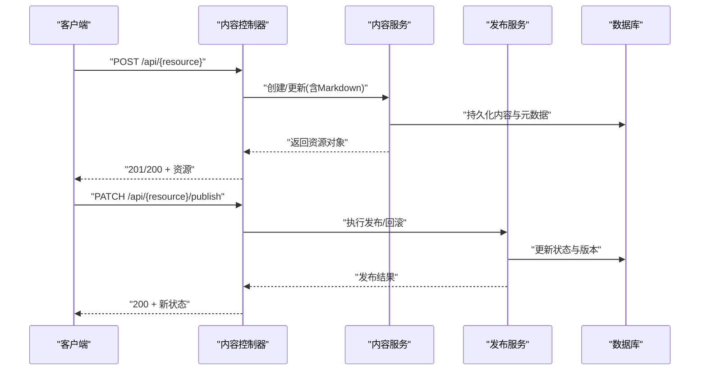

图表来源
- [blogs.controller.ts](file://apps/api/src/blogs/blogs.controller.ts)
- [blogs.service.ts](file://apps/api/src/blogs/blogs.service.ts)
- [publishing.service.ts](file://apps/api/src/publishing/publishing.service.ts)
- [schema.prisma](file://apps/api/prisma/schema.prisma)

## 详细组件分析

### 博客 API
- 端点概览
  - 列表：GET /api/blogs
  - 详情：GET /api/blogs/:id
  - 创建：POST /api/blogs
  - 更新：PUT/PATCH /api/blogs/:id
  - 删除：DELETE /api/blogs/:id
  - 发布：PATCH /api/blogs/:id/publish
  - 预览：GET /api/blogs/:id/preview
- 请求体字段（参考DTO）
  - 标题、摘要、正文（Markdown）、封面图、分类、标签、作者、SEO标题/描述/关键词、状态（草稿/预发布/已发布/下线）、排序权重、发布时间、语言等
- 查询参数
  - 分页：page、pageSize
  - 过滤：category、tag、status、authorId、language、dateRange
  - 排序：sortBy、order
- 行为说明
  - Markdown正文在服务层渲染为HTML并生成SEO元数据
  - 支持草稿保存与版本记录
  - 发布流程调用发布服务，更新状态与审计日志

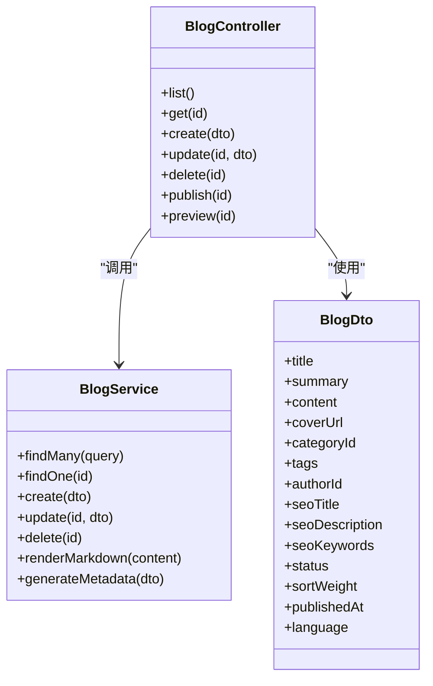

图表来源
- [blogs.controller.ts](file://apps/api/src/blogs/blogs.controller.ts)
- [blogs.service.ts](file://apps/api/src/blogs/blogs.service.ts)
- [blog.dto.ts](file://apps/api/src/blogs/dto/blog.dto.ts)

章节来源
- [blogs.controller.ts](file://apps/api/src/blogs/blogs.controller.ts)
- [blogs.service.ts](file://apps/api/src/blogs/blogs.service.ts)
- [blog.dto.ts](file://apps/api/src/blogs/dto/blog.dto.ts)

### 新闻 API
- 端点概览
  - 列表：GET /api/news
  - 详情：GET /api/news/:id
  - 创建：POST /api/news
  - 更新：PUT/PATCH /api/news/:id
  - 删除：DELETE /api/news/:id
  - 发布：PATCH /api/news/:id/publish
  - 预览：GET /api/news/:id/preview
- 字段与查询
  - 标题、摘要、正文（Markdown）、封面图、分类、标签、作者、SEO元数据、状态、排序、发布时间、语言
  - 支持按时间范围、分类、标签、作者筛选与分页排序
- 行为说明
  - Markdown渲染与SEO元数据自动生成
  - 草稿保存与版本控制
  - 发布流程与审计

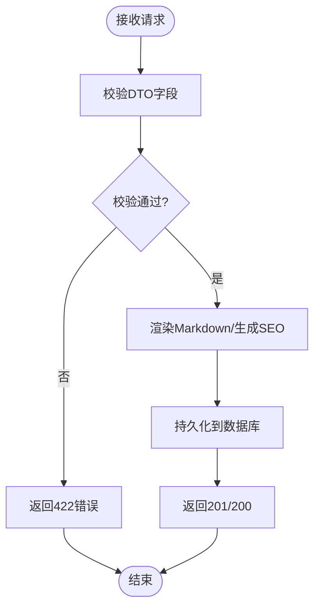

图表来源
- [news.controller.ts](file://apps/api/src/news/news.controller.ts)
- [news.service.ts](file://apps/api/src/news/news.service.ts)
- [news.dto.ts](file://apps/api/src/news/dto/news.dto.ts)

章节来源
- [news.controller.ts](file://apps/api/src/news/news.controller.ts)
- [news.service.ts](file://apps/api/src/news/news.service.ts)
- [news.dto.ts](file://apps/api/src/news/dto/news.dto.ts)

### 案例 API
- 端点概览
  - 列表：GET /api/cases
  - 详情：GET /api/cases/:id
  - 创建：POST /api/cases
  - 更新：PUT/PATCH /api/cases/:id
  - 删除：DELETE /api/cases/:id
  - 发布：PATCH /api/cases/:id/publish
  - 预览：GET /api/cases/:id/preview
- 字段与查询
  - 标题、摘要、正文（Markdown）、客户名称、行业、解决方案、封面图、分类、标签、作者、SEO元数据、状态、排序、发布时间、语言
  - 支持按行业、解决方案、标签、作者筛选与分页排序
- 行为说明
  - Markdown渲染与SEO元数据生成
  - 草稿保存与版本控制
  - 发布流程与审计

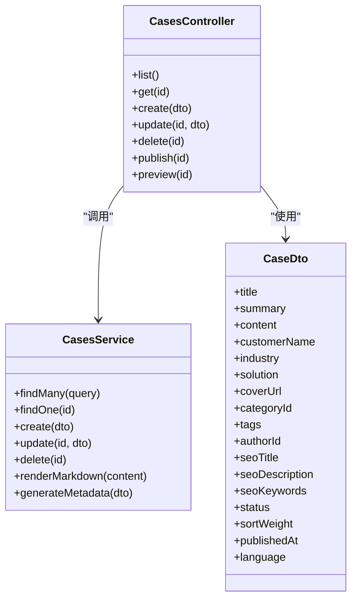

图表来源
- [cases.controller.ts](file://apps/api/src/cases/cases.controller.ts)
- [cases.service.ts](file://apps/api/src/cases/cases.service.ts)
- [case.dto.ts](file://apps/api/src/cases/dto/case.dto.ts)

章节来源
- [cases.controller.ts](file://apps/api/src/cases/cases.controller.ts)
- [cases.service.ts](file://apps/api/src/cases/cases.service.ts)
- [case.dto.ts](file://apps/api/src/cases/dto/case.dto.ts)

### 文档 API
- 端点概览
  - 列表：GET /api/documents
  - 详情：GET /api/documents/:id
  - 创建：POST /api/documents
  - 更新：PUT/PATCH /api/documents/:id
  - 删除：DELETE /api/documents/:id
  - 发布：PATCH /api/documents/:id/publish
  - 预览：GET /api/documents/:id/preview
- 字段与查询
  - 标题、摘要、正文（Markdown）、文件夹ID、标签、作者、SEO元数据、状态、排序、发布时间、语言
  - 支持按文件夹、标签、作者筛选与分页排序
- 行为说明
  - Markdown渲染与SEO元数据生成
  - 草稿保存与版本控制
  - 发布流程与审计

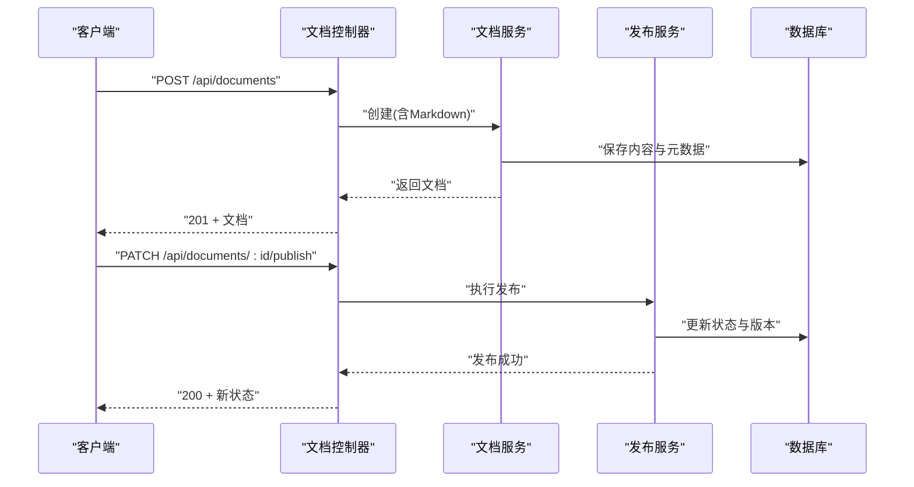

图表来源
- [documents.controller.ts](file://apps/api/src/documents/documents.controller.ts)
- [documents.service.ts](file://apps/api/src/documents/documents.service.ts)
- [publishing.service.ts](file://apps/api/src/publishing/publishing.service.ts)
- [schema.prisma](file://apps/api/prisma/schema.prisma)

章节来源
- [documents.controller.ts](file://apps/api/src/documents/documents.controller.ts)
- [documents.service.ts](file://apps/api/src/documents/documents.service.ts)
- [document.dto.ts](file://apps/api/src/documents/dto/document.dto.ts)

### 展会 API
- 端点概览
  - 列表：GET /api/trade-shows
  - 详情：GET /api/trade-shows/:id
  - 创建：POST /api/trade-shows
  - 更新：PUT/PATCH /api/trade-shows/:id
  - 删除：DELETE /api/trade-shows/:id
  - 发布：PATCH /api/trade-shows/:id/publish
  - 预览：GET /api/trade-shows/:id/preview
- 字段与查询
  - 标题、摘要、正文（Markdown）、地点、时间、封面图、分类、标签、作者、SEO元数据、状态、排序、发布时间、语言
  - 支持按地点、时间范围、分类、标签、作者筛选与分页排序
- 行为说明
  - Markdown渲染与SEO元数据生成
  - 草稿保存与版本控制
  - 发布流程与审计

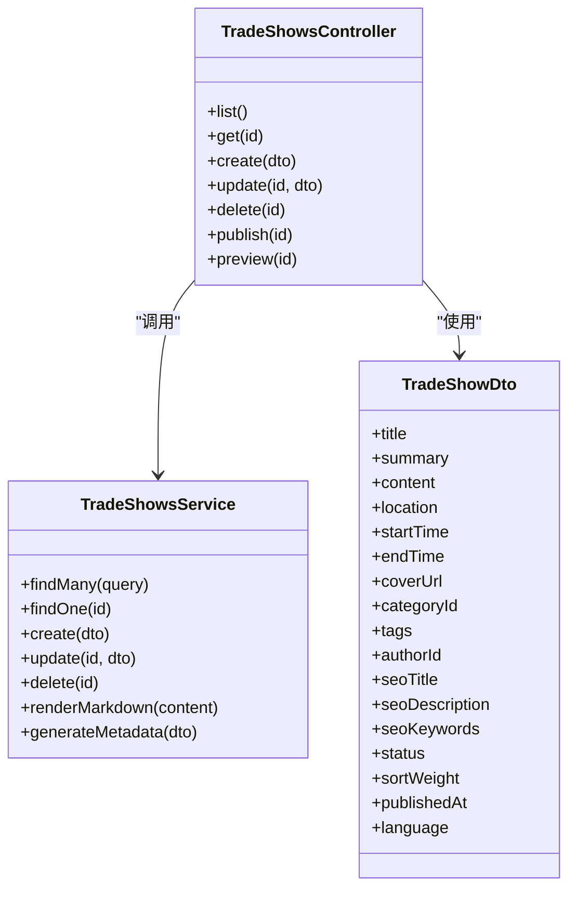

图表来源
- [trade-shows.controller.ts](file://apps/api/src/trade-shows/trade-shows.controller.ts)
- [trade-shows.service.ts](file://apps/api/src/trade-shows/trade-shows.service.ts)
- [trade-show.dto.ts](file://apps/api/src/trade-shows/dto/trade-show.dto.ts)

章节来源
- [trade-shows.controller.ts](file://apps/api/src/trade-shows/trade-shows.controller.ts)
- [trade-shows.service.ts](file://apps/api/src/trade-shows/trade-shows.service.ts)
- [trade-show.dto.ts](file://apps/api/src/trade-shows/dto/trade-show.dto.ts)

### Markdown 与富文本支持
- Markdown处理
  - 在服务层对正文进行安全渲染，生成HTML片段
  - 支持代码高亮、表格、图片、链接等常用语法
- 富文本编辑
  - 前端可使用Vditor等编辑器提交Markdown或富文本，后端统一转为Markdown存储
- SEO元数据
  - 根据标题、摘要与正文自动提取关键词与描述，生成SEO字段
- 预览
  - 提供预览端点，返回渲染后的HTML用于前端即时预览

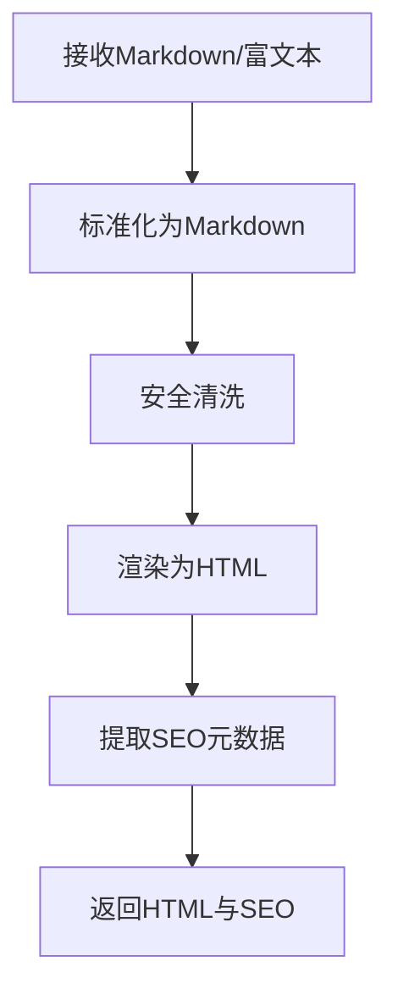

图表来源
- [markdown.ts](file://apps/api/src/common/utils/markdown.ts)
- [content-metadata.ts](file://apps/api/src/common/utils/content-metadata.ts)

章节来源
- [markdown.ts](file://apps/api/src/common/utils/markdown.ts)
- [content-metadata.ts](file://apps/api/src/common/utils/content-metadata.ts)

### 版本控制与发布流程
- 版本控制
  - 每次更新创建新版本记录，保留历史快照
  - 支持回滚至指定版本
- 发布流程
  - 状态机：草稿 → 预发布 → 已发布 → 下线
  - 发布时更新状态、版本号与审计信息
  - 支持批量发布与取消发布

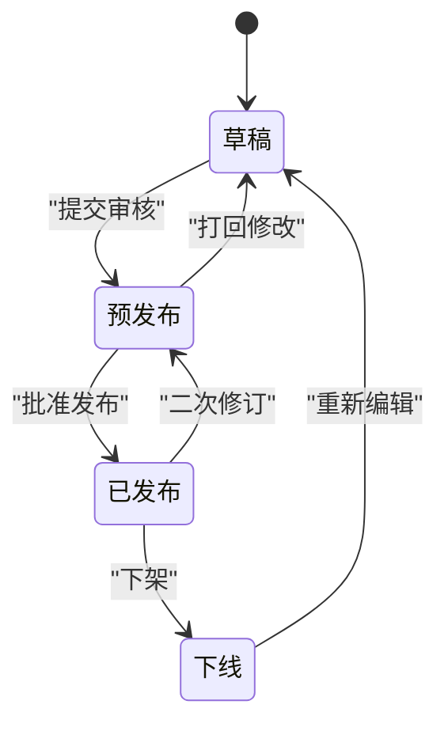

图表来源
- [content-status.enum.ts](file://apps/api/src/common/enums/content-status.enum.ts)
- [publishing.service.ts](file://apps/api/src/publishing/publishing.service.ts)

章节来源
- [content-status.enum.ts](file://apps/api/src/common/enums/content-status.enum.ts)
- [publishing.service.ts](file://apps/api/src/publishing/publishing.service.ts)

### 内容分类与标签管理
- 分类
  - 每个资源支持关联分类，便于列表过滤与导航
- 标签
  - 多标签支持，便于跨资源检索与聚合
- 管理接口
  - 分类与标签的CRUD可通过统一资源接口或扩展模块提供
  - 建议在DTO中明确分类ID与标签数组字段

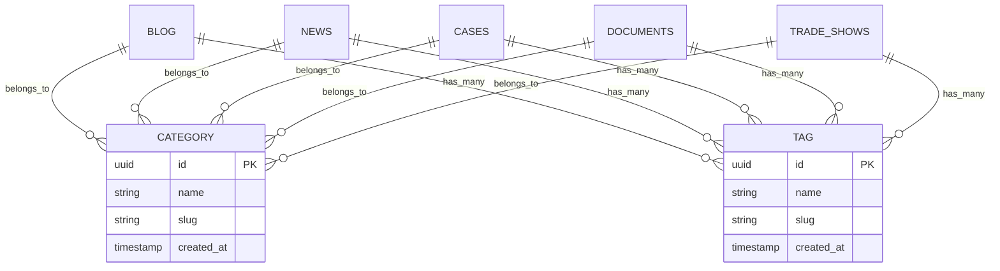

图表来源
- [schema.prisma](file://apps/api/prisma/schema.prisma)

章节来源
- [schema.prisma](file://apps/api/prisma/schema.prisma)

### SEO优化与搜索功能
- SEO优化
  - 自动生成SEO标题、描述与关键词
  - 支持自定义覆盖默认值
- 搜索功能
  - 全文搜索建议与结果聚合
  - 支持按分类、标签、作者、时间范围过滤

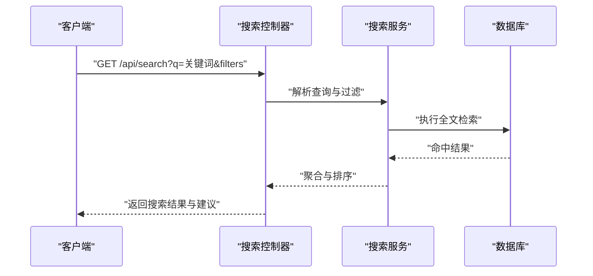

图表来源
- [content-query.ts](file://apps/api/src/common/utils/content-query.ts)
- [content-list.ts](file://apps/api/src/common/utils/content-list.ts)

章节来源
- [content-query.ts](file://apps/api/src/common/utils/content-query.ts)
- [content-list.ts](file://apps/api/src/common/utils/content-list.ts)

### 内容预览、草稿保存与批量操作
- 内容预览
  - 提供预览端点，返回渲染后的HTML与SEO元数据
- 草稿保存
  - 支持保存草稿状态，不对外发布
- 批量操作
  - 批量创建、更新、删除与发布
  - 事务性保证，失败回滚

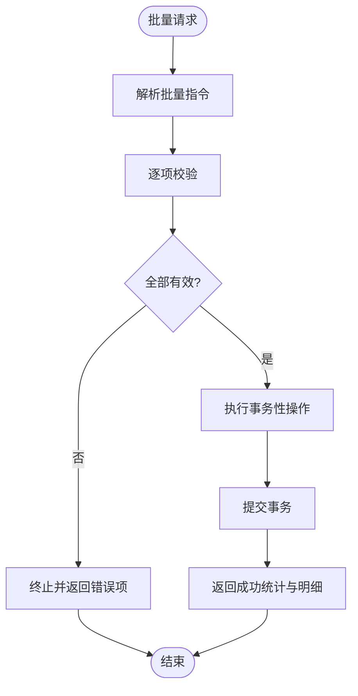

图表来源
- [content-list.ts](file://apps/api/src/common/utils/content-list.ts)
- [content-query.ts](file://apps/api/src/common/utils/content-query.ts)

章节来源
- [content-list.ts](file://apps/api/src/common/utils/content-list.ts)
- [content-query.ts](file://apps/api/src/common/utils/content-query.ts)

## 依赖关系分析
- 控制器依赖服务，服务依赖通用工具与数据层
- 发布服务被各内容模块复用，保证状态机一致性
- Markdown与SEO工具在各服务中统一调用，避免重复实现

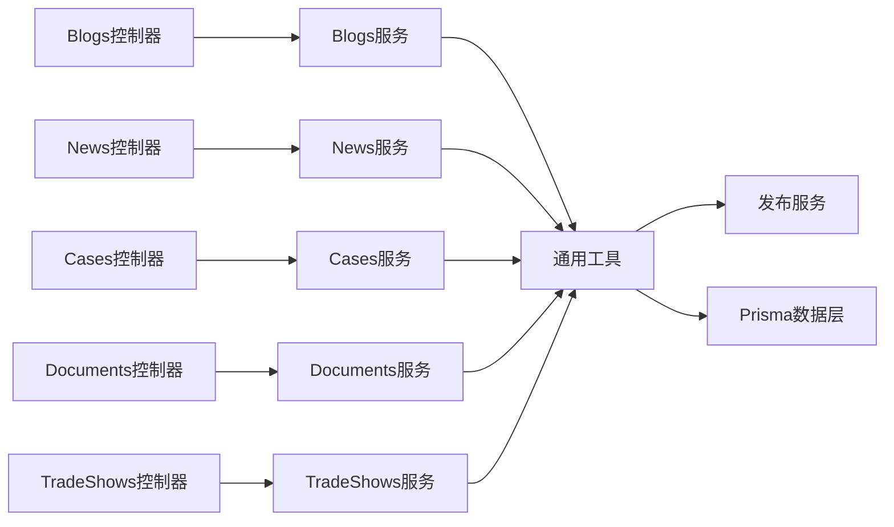

图表来源
- [blogs.controller.ts](file://apps/api/src/blogs/blogs.controller.ts)
- [news.controller.ts](file://apps/api/src/news/news.controller.ts)
- [cases.controller.ts](file://apps/api/src/cases/cases.controller.ts)
- [documents.controller.ts](file://apps/api/src/documents/documents.controller.ts)
- [trade-shows.controller.ts](file://apps/api/src/trade-shows/trade-shows.controller.ts)
- [content-list.ts](file://apps/api/src/common/utils/content-list.ts)
- [content-query.ts](file://apps/api/src/common/utils/content-query.ts)
- [content-metadata.ts](file://apps/api/src/common/utils/content-metadata.ts)
- [publishing.service.ts](file://apps/api/src/publishing/publishing.service.ts)
- [schema.prisma](file://apps/api/prisma/schema.prisma)

章节来源
- [blogs.controller.ts](file://apps/api/src/blogs/blogs.controller.ts)
- [news.controller.ts](file://apps/api/src/news/news.controller.ts)
- [cases.controller.ts](file://apps/api/src/cases/cases.controller.ts)
- [documents.controller.ts](file://apps/api/src/documents/documents.controller.ts)
- [trade-shows.controller.ts](file://apps/api/src/trade-shows/trade-shows.controller.ts)
- [content-list.ts](file://apps/api/src/common/utils/content-list.ts)
- [content-query.ts](file://apps/api/src/common/utils/content-query.ts)
- [content-metadata.ts](file://apps/api/src/common/utils/content-metadata.ts)
- [publishing.service.ts](file://apps/api/src/publishing/publishing.service.ts)
- [schema.prisma](file://apps/api/prisma/schema.prisma)

## 性能考虑
- 分页与过滤：合理使用page、pageSize与过滤条件，避免全表扫描
- Markdown渲染：对热点内容进行缓存，减少重复渲染开销
- SEO元数据：在写入时生成并缓存，读取时直接返回
- 发布流程：批量操作使用事务，减少锁竞争与重试
- 索引策略：为常用过滤字段（分类、标签、作者、时间）建立索引

## 故障排查指南
- 常见错误
  - 422：DTO校验失败，检查必填字段与类型
  - 404：资源不存在，确认ID与权限
  - 500：内部错误，查看服务日志与数据库连接
- 调试建议
  - 启用请求ID中间件，追踪请求链路
  - 使用审计拦截器，记录关键操作
  - 检查Markdown渲染与安全清洗逻辑

章节来源
- [content-query.ts](file://apps/api/src/common/utils/content-query.ts)
- [content-list.ts](file://apps/api/src/common/utils/content-list.ts)

## 结论
内容管理API以模块化与服务化为核心，提供统一的内容CRUD、Markdown渲染、SEO优化、版本控制与发布流程。通过通用工具与发布服务，确保各资源行为一致性与可维护性。建议在生产环境启用缓存、索引与监控，以提升性能与稳定性。

## 附录
- 接口命名规范：RESTful风格，动词+名词复数
- 字段命名规范：小驼峰，语义清晰
- 状态枚举：统一使用content-status枚举
- 错误码：HTTP标准码+业务码组合