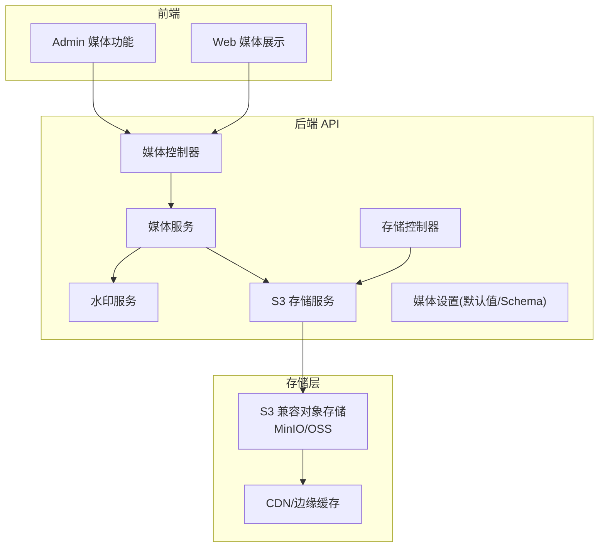
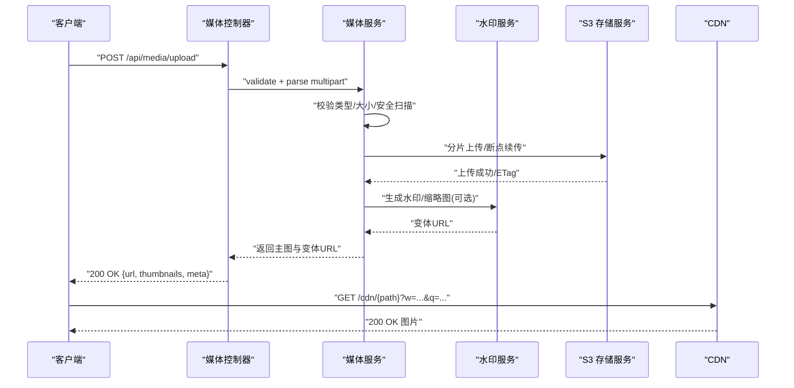
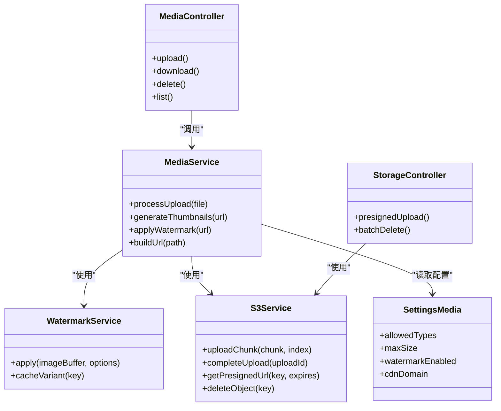

# 媒体存储API

<cite>
**本文引用的文件**   
- [apps/api/src/media/media.controller.ts](file://apps/api/src/media/media.controller.ts)
- [apps/api/src/media/media.service.ts](file://apps/api/src/media/media.service.ts)
- [apps/api/src/media/watermark.service.ts](file://apps/api/src/media/watermark.service.ts)
- [apps/api/src/storage/s3.service.ts](file://apps/api/src/storage/s3.service.ts)
- [apps/api/src/storage/storage.controller.ts](file://apps/api/src/storage/storage.controller.ts)
- [apps/api/src/settings/settings-media.schema.ts](file://apps/api/src/settings/settings-media.schema.ts)
- [apps/api/src/settings/settings-media.defaults.ts](file://apps/api/src/settings/settings-media.defaults.ts)
- [apps/admin/src/features/site-media.ts](file://apps/admin/src/features/site-media.ts)
- [apps/admin/src/lib/media-url.ts](file://apps/admin/src/lib/media-url.ts)
- [apps/web/src/lib/media-url.ts](file://apps/web/src/lib/media-url.ts)
- [apps/web/src/lib/oss-image-loader.ts](file://apps/web/src/lib/oss-image-loader.ts)
- [infra/docker/minio/cors.xml](file://infra/docker/minio/cors.xml)
- [infra/docker/oss/cors.json](file://infra/docker/oss/cors.json)
</cite>

## 目录
1. [简介](#简介)
2. [项目结构](#项目结构)
3. [核心组件](#核心组件)
4. [架构总览](#架构总览)
5. [详细组件分析](#详细组件分析)
6. [依赖关系分析](#依赖关系分析)
7. [性能考虑](#性能考虑)
8. [故障排查指南](#故障排查指南)
9. [结论](#结论)
10. [附录](#附录)

## 简介
本文件为媒体存储API的详细技术文档，覆盖文件上传、下载、删除与管理的RESTful接口，以及S3兼容对象存储集成、图片水印处理、缩略图生成与CDN加速配置。文档同时说明文件类型验证、大小限制、安全检查与访问控制策略，并提供多文件上传、断点续传与批量操作的接口示例与最佳实践。

## 项目结构
媒体存储相关代码主要分布在后端API模块（NestJS）与前端应用（Admin/Web）中：
- 后端API
  - 媒体控制器与服务：负责路由、校验、业务编排与存储交互
  - S3存储服务：封装S3兼容客户端的上传、下载、删除与元数据操作
  - 水印服务：图片水印合成与变体生成
  - 设置模块：媒体存储默认值与Schema校验
- 前端
  - Admin端：媒体选择器、URL构建与站点媒体配置
  - Web端：媒体URL构建与OSS图片加载器（CDN参数化）
- 基础设施
  - MinIO/CORS配置：本地开发对象存储跨域策略
  - OSS CORS配置：生产环境对象存储跨域策略

图表来源 
- [apps/api/src/media/media.controller.ts](file://apps/api/src/media/media.controller.ts)
- [apps/api/src/media/media.service.ts](file://apps/api/src/media/media.service.ts)
- [apps/api/src/media/watermark.service.ts](file://apps/api/src/media/watermark.service.ts)
- [apps/api/src/storage/s3.service.ts](file://apps/api/src/storage/s3.service.ts)
- [apps/api/src/storage/storage.controller.ts](file://apps/api/src/storage/storage.controller.ts)
- [apps/api/src/settings/settings-media.schema.ts](file://apps/api/src/settings/settings-media.schema.ts)
- [apps/api/src/settings/settings-media.defaults.ts](file://apps/api/src/settings/settings-media.defaults.ts)

章节来源
- [apps/api/src/media/media.controller.ts](file://apps/api/src/media/media.controller.ts)
- [apps/api/src/media/media.service.ts](file://apps/api/src/media/media.service.ts)
- [apps/api/src/storage/s3.service.ts](file://apps/api/src/storage/s3.service.ts)
- [apps/api/src/storage/storage.controller.ts](file://apps/api/src/storage/storage.controller.ts)
- [apps/api/src/settings/settings-media.schema.ts](file://apps/api/src/settings/settings-media.schema.ts)
- [apps/api/src/settings/settings-media.defaults.ts](file://apps/api/src/settings/settings-media.defaults.ts)

## 核心组件
- 媒体控制器（MediaController）
  - 提供媒体上传、下载、删除、列表与管理等HTTP接口
  - 统一鉴权、限流与审计拦截
- 媒体服务（MediaService）
  - 编排上传流程：校验、去重、命名、路径组织、元数据记录
  - 触发水印与缩略图生成任务
  - 返回可访问URL（支持CDN前缀）
- 水印服务（WatermarkService）
  - 基于原图生成带水印的变体
  - 支持位置、透明度、尺寸适配
- S3存储服务（S3Service）
  - 封装S3 SDK：分片上传、断点续传、签名直传、下载、删除、元数据读取
  - 错误重试与超时控制
- 存储控制器（StorageController）
  - 暴露通用存储能力（如预签名URL、批量删除）
- 媒体设置（Settings-Media）
  - Schema定义：允许的文件类型、最大大小、水印开关、CDN域名等
  - 默认值：默认存储桶、路径模板、压缩质量、缩略图尺寸

章节来源
- [apps/api/src/media/media.controller.ts](file://apps/api/src/media/media.controller.ts)
- [apps/api/src/media/media.service.ts](file://apps/api/src/media/media.service.ts)
- [apps/api/src/media/watermark.service.ts](file://apps/api/src/media/watermark.service.ts)
- [apps/api/src/storage/s3.service.ts](file://apps/api/src/storage/s3.service.ts)
- [apps/api/src/storage/storage.controller.ts](file://apps/api/src/storage/storage.controller.ts)
- [apps/api/src/settings/settings-media.schema.ts](file://apps/api/src/settings/settings-media.schema.ts)
- [apps/api/src/settings/settings-media.defaults.ts](file://apps/api/src/settings/settings-media.defaults.ts)

## 架构总览
媒体存储API采用分层设计：控制器负责请求解析与响应格式化；服务层实现业务逻辑；存储层通过S3Service对接对象存储；可选的水印与缩略图处理在上传后异步或同步执行；CDN通过域名与图片参数进行加速。

图表来源 
- [apps/api/src/media/media.controller.ts](file://apps/api/src/media/media.controller.ts)
- [apps/api/src/media/media.service.ts](file://apps/api/src/media/media.service.ts)
- [apps/api/src/media/watermark.service.ts](file://apps/api/src/media/watermark.service.ts)
- [apps/api/src/storage/s3.service.ts](file://apps/api/src/storage/s3.service.ts)

## 详细组件分析

### 媒体控制器（MediaController）
- 职责
  - 定义RESTful路由：上传、下载、删除、列表、元数据更新
  - 统一鉴权与权限检查（角色/资源级）
  - 输入校验（类型、大小、文件名白名单）
  - 输出标准化（URL、缩略图、元信息）
- 关键行为
  - 单文件/多文件上传
  - 分块上传与断点续传（通过分片ID与序列号）
  - 批量删除与批量元数据更新
  - 预签名URL生成（用于浏览器直传）

章节来源
- [apps/api/src/media/media.controller.ts](file://apps/api/src/media/media.controller.ts)

### 媒体服务（MediaService）
- 职责
  - 上传流程编排：校验、命名、路径组织、元数据持久化
  - 触发水印与缩略图生成（同步或队列）
  - URL组装（支持CDN域名与查询参数）
  - 错误处理与重试
- 数据结构
  - 文件元数据：名称、类型、大小、哈希、路径、版本、状态
  - 变体信息：缩略图尺寸、水印样式、生成时间
- 复杂度
  - 上传：O(n) 分片合并
  - 水印/缩略图：按像素处理的I/O密集型，建议异步

章节来源
- [apps/api/src/media/media.service.ts](file://apps/api/src/media/media.service.ts)

### 水印服务（WatermarkService）
- 职责
  - 在原图上叠加文字/图片水印
  - 支持位置、透明度、缩放、边距
  - 输出PNG/JPG变体
- 优化
  - 缓存已生成变体，避免重复计算
  - 使用内存流减少磁盘IO

章节来源
- [apps/api/src/media/watermark.service.ts](file://apps/api/src/media/watermark.service.ts)

### S3存储服务（S3Service）
- 职责
  - 封装S3 SDK：上传（分片）、下载、删除、元数据读写
  - 预签名URL生成（限制过期时间与权限）
  - 断点续传：基于分片ETag与索引
- 错误处理
  - 网络重试、超时、部分失败回滚
  - 异常分类（权限、容量、格式）

章节来源
- [apps/api/src/storage/s3.service.ts](file://apps/api/src/storage/s3.service.ts)

### 存储控制器（StorageController）
- 职责
  - 通用存储能力：预签名上传/下载、批量删除、生命周期管理
  - 与媒体控制器解耦，便于复用

章节来源
- [apps/api/src/storage/storage.controller.ts](file://apps/api/src/storage/storage.controller.ts)

### 媒体设置（Settings-Media）
- Schema字段
  - 允许的文件类型（image/*, video/*, application/pdf等）
  - 最大文件大小（字节）
  - 水印开关与样式
  - CDN域名与图片参数（宽度、质量、裁剪）
  - 存储桶与路径模板
- 默认值
  - 默认存储桶、默认CDN域名、默认缩略图尺寸

章节来源
- [apps/api/src/settings/settings-media.schema.ts](file://apps/api/src/settings/settings-media.schema.ts)
- [apps/api/src/settings/settings-media.defaults.ts](file://apps/api/src/settings/settings-media.defaults.ts)

### 前端媒体URL构建与CDN
- Admin端
  - 媒体URL构建：拼接CDN域名与路径，附加参数（尺寸、质量）
  - 站点媒体配置：读取/更新媒体设置
- Web端
  - 媒体URL构建：统一入口，确保CDN参数一致
  - OSS图片加载器：根据参数动态生成CDN链接

章节来源
- [apps/admin/src/features/site-media.ts](file://apps/admin/src/features/site-media.ts)
- [apps/admin/src/lib/media-url.ts](file://apps/admin/src/lib/media-url.ts)
- [apps/web/src/lib/media-url.ts](file://apps/web/src/lib/media-url.ts)
- [apps/web/src/lib/oss-image-loader.ts](file://apps/web/src/lib/oss-image-loader.ts)

## 依赖关系分析
- 控制器依赖服务：MediaController依赖MediaService；StorageController依赖S3Service
- 服务依赖存储：MediaService依赖S3Service与WatermarkService
- 设置驱动行为：MediaService根据媒体设置决定是否启用水印、缩略图与CDN参数
- 前端依赖URL构建：Admin/Web通过media-url工具统一生成CDN链接

图表来源 
- [apps/api/src/media/media.controller.ts](file://apps/api/src/media/media.controller.ts)
- [apps/api/src/media/media.service.ts](file://apps/api/src/media/media.service.ts)
- [apps/api/src/media/watermark.service.ts](file://apps/api/src/media/watermark.service.ts)
- [apps/api/src/storage/s3.service.ts](file://apps/api/src/storage/s3.service.ts)
- [apps/api/src/storage/storage.controller.ts](file://apps/api/src/storage/storage.controller.ts)
- [apps/api/src/settings/settings-media.schema.ts](file://apps/api/src/settings/settings-media.schema.ts)

章节来源
- [apps/api/src/media/media.controller.ts](file://apps/api/src/media/media.controller.ts)
- [apps/api/src/media/media.service.ts](file://apps/api/src/media/media.service.ts)
- [apps/api/src/media/watermark.service.ts](file://apps/api/src/media/watermark.service.ts)
- [apps/api/src/storage/s3.service.ts](file://apps/api/src/storage/s3.service.ts)
- [apps/api/src/storage/storage.controller.ts](file://apps/api/src/storage/storage.controller.ts)
- [apps/api/src/settings/settings-media.schema.ts](file://apps/api/src/settings/settings-media.schema.ts)

## 性能考虑
- 上传
  - 使用分片上传与并发提升吞吐
  - 断点续传降低失败成本
  - 服务端校验前置，避免无效传输
- 处理
  - 水印与缩略图异步处理，避免阻塞上传
  - 结果缓存（按内容哈希或参数键）
- 存储
  - 合理分桶与路径组织，提升检索效率
  - 使用预签名URL直传，减轻服务器带宽压力
- CDN
  - 开启边缘缓存与图片参数化，减少源站请求
  - 合理设置缓存TTL与失效策略

[本节为通用指导，不直接分析具体文件]

## 故障排查指南
- 上传失败
  - 检查文件类型与大小限制是否符合Schema
  - 确认S3凭据与权限（Bucket、Policy）
  - 查看分片上传日志与ETag一致性
- 水印/缩略图未生成
  - 确认水印服务可用性与缓存命中
  - 检查输入图像格式与尺寸
- 下载403/404
  - 核对预签名URL有效期与权限
  - 检查CORS配置（MinIO/OSS）
- CDN无法访问
  - 确认CDN域名绑定与缓存规则
  - 检查源站返回码与跨域头

章节来源
- [infra/docker/minio/cors.xml](file://infra/docker/minio/cors.xml)
- [infra/docker/oss/cors.json](file://infra/docker/oss/cors.json)

## 结论
媒体存储API通过清晰的层次结构与模块化设计，实现了安全的文件上传、下载、删除与管理，结合S3兼容存储、水印与缩略图处理、CDN加速，满足高可用与高性能需求。通过严格的类型与大小校验、访问控制与错误处理，保障系统稳定与安全。建议在生产环境中启用异步处理与缓存，并完善监控与告警。

[本节为总结性内容，不直接分析具体文件]

## 附录

### RESTful接口规范（摘要）
- 上传
  - POST /api/media/upload
  - 支持单文件与多文件；multipart/form-data
  - 可选参数：分片ID、序号、总片数（断点续传）
  - 响应：{ url, thumbnails[], meta }
- 下载
  - GET /api/media/:id/download
  - 返回文件流或预签名URL（直传场景）
- 删除
  - DELETE /api/media/:id
  - 支持批量删除：DELETE /api/media/batch
- 列表与搜索
  - GET /api/media?query=&page=&size=
  - 支持按类型、时间、标签过滤
- 元数据更新
  - PATCH /api/media/:id/meta
  - 支持标题、描述、标签、可见性

章节来源
- [apps/api/src/media/media.controller.ts](file://apps/api/src/media/media.controller.ts)
- [apps/api/src/media/media.service.ts](file://apps/api/src/media/media.service.ts)

### 文件类型验证与大小限制
- 允许类型
  - image/jpeg, image/png, image/webp, video/mp4, application/pdf 等（由Schema定义）
- 大小限制
  - 单文件最大大小（字节），可通过设置调整
- 安全检查
  - 文件名白名单、MIME类型校验、病毒扫描（可选）

章节来源
- [apps/api/src/settings/settings-media.schema.ts](file://apps/api/src/settings/settings-media.schema.ts)
- [apps/api/src/settings/settings-media.defaults.ts](file://apps/api/src/settings/settings-media.defaults.ts)

### 访问控制与安全
- 鉴权
  - JWT令牌校验，角色/权限控制
- 授权
  - 资源级权限（仅所有者或管理员可删除）
- 安全
  - 输入校验、防注入、速率限制
  - 预签名URL过期与范围限制

章节来源
- [apps/api/src/media/media.controller.ts](file://apps/api/src/media/media.controller.ts)
- [apps/api/src/media/media.service.ts](file://apps/api/src/media/media.service.ts)

### 多文件上传、断点续传与批量操作示例
- 多文件上传
  - 多次调用上传接口或使用批量端点
  - 每个文件独立分片与ETag
- 断点续传
  - 首次上传获取分片ID
  - 按序上传分片，完成后合并
- 批量删除
  - 提交文件ID列表，服务端原子删除

章节来源
- [apps/api/src/storage/storage.controller.ts](file://apps/api/src/storage/storage.controller.ts)
- [apps/api/src/storage/s3.service.ts](file://apps/api/src/storage/s3.service.ts)

### CDN加速配置
- 域名与路径
  - 设置CDN域名与路径模板
- 图片参数
  - 宽度、高度、质量、裁剪、水印开关
- 缓存策略
  - TTL、失效规则、回源策略

章节来源
- [apps/web/src/lib/oss-image-loader.ts](file://apps/web/src/lib/oss-image-loader.ts)
- [apps/admin/src/lib/media-url.ts](file://apps/admin/src/lib/media-url.ts)
- [apps/web/src/lib/media-url.ts](file://apps/web/src/lib/media-url.ts)