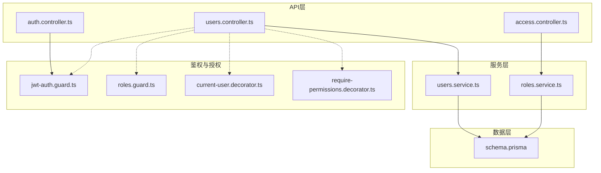
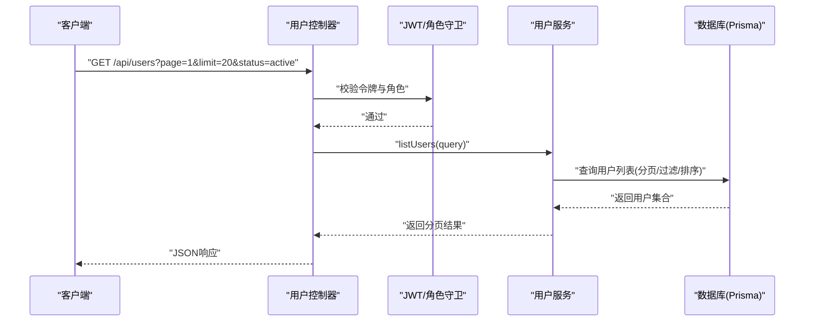
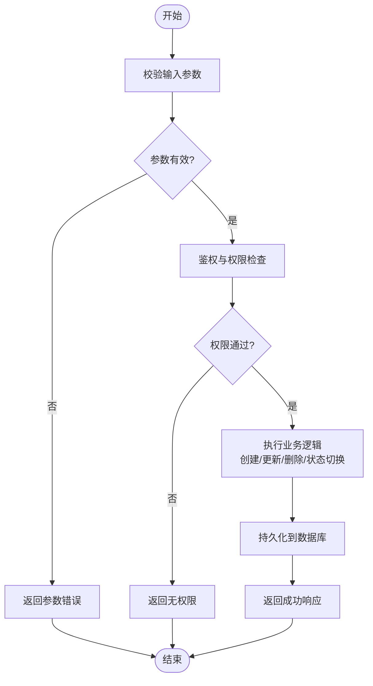
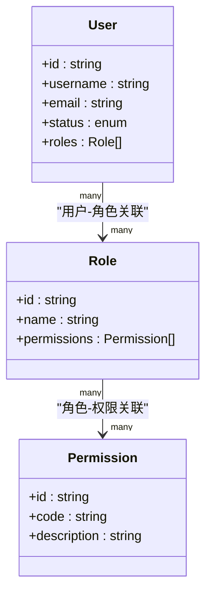
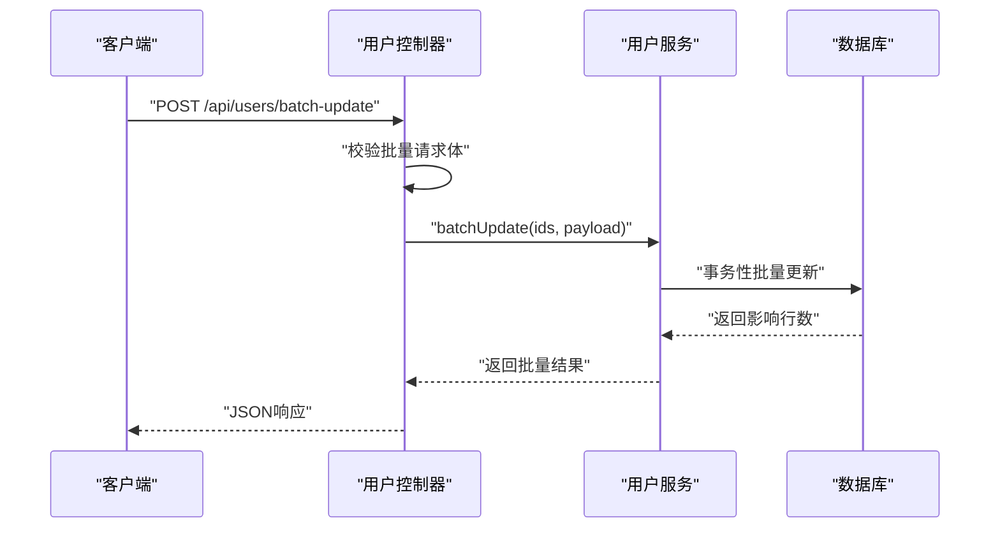
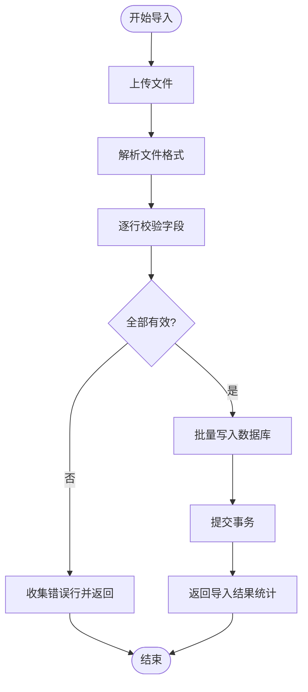
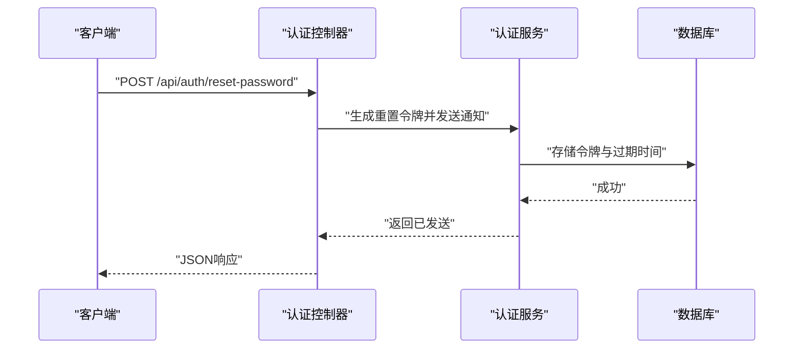
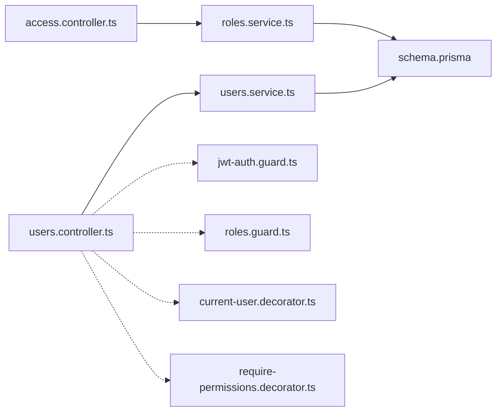

# 用户管理API

<cite>
**本文引用的文件**   
- [users.controller.ts](file://apps/api/src/users/users.controller.ts)
- [users.service.ts](file://apps/api/src/users/users.service.ts)
- [user.dto.ts](file://apps/api/src/users/dto/user.dto.ts)
- [access.controller.ts](file://apps/api/src/access/access.controller.ts)
- [roles.service.ts](file://apps/api/src/access/roles.service.ts)
- [permissions.ts](file://apps/api/src/access/permissions.ts)
- [auth.controller.ts](file://apps/api/src/auth/auth.controller.ts)
- [jwt-auth.guard.ts](file://apps/api/src/auth/guards/jwt-auth.guard.ts)
- [roles.guard.ts](file://apps/api/src/auth/guards/roles.guard.ts)
- [current-user.decorator.ts](file://apps/api/src/auth/decorators/current-user.decorator.ts)
- [require-permissions.decorator.ts](file://apps/api/src/auth/decorators/require-permissions.decorator.ts)
- [schema.prisma](file://apps/api/prisma/schema.prisma)
- [seed-roles.ts](file://apps/api/scripts/seed-roles.ts)
</cite>

## 目录
1. [简介](#简介)
2. [项目结构](#项目结构)
3. [核心组件](#核心组件)
4. [架构总览](#架构总览)
5. [详细组件分析](#详细组件分析)
6. [依赖关系分析](#依赖关系分析)
7. [性能考虑](#性能考虑)
8. [故障排查指南](#故障排查指南)
9. [结论](#结论)
10. [附录](#附录)

## 简介
本文件为“用户管理API”的完整技术文档，覆盖以下能力：
- 用户的CRUD操作（创建、读取、更新、删除）
- 角色分配与权限管理
- 用户状态控制（启用/禁用等）
- 批量操作、搜索过滤与分页接口
- 数据模型与字段验证规则、业务约束
- 用户导入导出、密码重置与账户管理接口规范

该API基于NestJS构建，使用Prisma进行数据访问，JWT鉴权与RBAC权限控制贯穿全链路。

## 项目结构
用户管理相关代码主要位于后端API模块中，采用分层架构：
- 控制器层：定义HTTP路由与请求校验
- 服务层：实现业务逻辑（含批量、搜索、分页、状态变更、角色分配等）
- DTO层：统一输入输出结构与字段校验
- 鉴权与授权：JWT守卫、角色守卫、装饰器
- 数据模型：Prisma Schema定义用户、角色、权限等实体及关系

图表来源
- [users.controller.ts](file://apps/api/src/users/users.controller.ts)
- [users.service.ts](file://apps/api/src/users/users.service.ts)
- [access.controller.ts](file://apps/api/src/access/access.controller.ts)
- [roles.service.ts](file://apps/api/src/access/roles.service.ts)
- [jwt-auth.guard.ts](file://apps/api/src/auth/guards/jwt-auth.guard.ts)
- [roles.guard.ts](file://apps/api/src/auth/guards/roles.guard.ts)
- [current-user.decorator.ts](file://apps/api/src/auth/decorators/current-user.decorator.ts)
- [require-permissions.decorator.ts](file://apps/api/src/auth/decorators/require-permissions.decorator.ts)
- [schema.prisma](file://apps/api/prisma/schema.prisma)

章节来源
- [users.controller.ts](file://apps/api/src/users/users.controller.ts)
- [users.service.ts](file://apps/api/src/users/users.service.ts)
- [user.dto.ts](file://apps/api/src/users/dto/user.dto.ts)
- [access.controller.ts](file://apps/api/src/access/access.controller.ts)
- [roles.service.ts](file://apps/api/src/access/roles.service.ts)
- [permissions.ts](file://apps/api/src/access/permissions.ts)
- [auth.controller.ts](file://apps/api/src/auth/auth.controller.ts)
- [jwt-auth.guard.ts](file://apps/api/src/auth/guards/jwt-auth.guard.ts)
- [roles.guard.ts](file://apps/api/src/auth/guards/roles.guard.ts)
- [current-user.decorator.ts](file://apps/api/src/auth/decorators/current-user.decorator.ts)
- [require-permissions.decorator.ts](file://apps/api/src/auth/decorators/require-permissions.decorator.ts)
- [schema.prisma](file://apps/api/prisma/schema.prisma)
- [seed-roles.ts](file://apps/api/scripts/seed-roles.ts)

## 核心组件
- 用户控制器（users.controller.ts）：暴露用户相关的REST端点，包括列表查询、详情获取、创建、更新、删除、状态切换、批量操作、导入导出、密码重置等。
- 用户服务（users.service.ts）：封装用户领域逻辑，处理分页、排序、过滤、去重、事务性批量写入、角色关联、权限校验、审计日志等。
- 用户DTO（user.dto.ts）：定义用户输入输出的校验规则与类型约束，如邮箱格式、用户名唯一性、密码强度、状态枚举等。
- 访问控制（access.controller.ts, roles.service.ts, permissions.ts）：提供角色与权限管理能力，支持角色分配、权限矩阵、继承与合并策略。
- 鉴权与授权（auth.*）：JWT鉴权、角色守卫、当前用户注入、权限装饰器，确保接口安全与最小权限原则。
- 数据模型（schema.prisma）：定义用户、角色、权限、用户角色关联等实体与关系，保证数据一致性与完整性。

章节来源
- [users.controller.ts](file://apps/api/src/users/users.controller.ts)
- [users.service.ts](file://apps/api/src/users/users.service.ts)
- [user.dto.ts](file://apps/api/src/users/dto/user.dto.ts)
- [access.controller.ts](file://apps/api/src/access/access.controller.ts)
- [roles.service.ts](file://apps/api/src/access/roles.service.ts)
- [permissions.ts](file://apps/api/src/access/permissions.ts)
- [auth.controller.ts](file://apps/api/src/auth/auth.controller.ts)
- [jwt-auth.guard.ts](file://apps/api/src/auth/guards/jwt-auth.guard.ts)
- [roles.guard.ts](file://apps/api/src/auth/guards/roles.guard.ts)
- [current-user.decorator.ts](file://apps/api/src/auth/decorators/current-user.decorator.ts)
- [require-permissions.decorator.ts](file://apps/api/src/auth/decorators/require-permissions.decorator.ts)
- [schema.prisma](file://apps/api/prisma/schema.prisma)

## 架构总览
用户管理的整体调用链如下：客户端通过受保护的API访问用户资源，控制器接收请求并做参数校验，服务层执行业务逻辑并与数据库交互，鉴权与授权在请求进入时完成。

图表来源
- [users.controller.ts](file://apps/api/src/users/users.controller.ts)
- [users.service.ts](file://apps/api/src/users/users.service.ts)
- [jwt-auth.guard.ts](file://apps/api/src/auth/guards/jwt-auth.guard.ts)
- [roles.guard.ts](file://apps/api/src/auth/guards/roles.guard.ts)
- [schema.prisma](file://apps/api/prisma/schema.prisma)

## 详细组件分析

### 用户CRUD与状态控制
- 创建用户：支持必填字段校验（用户名、邮箱、密码），唯一性检查，默认状态设置，可选初始角色分配。
- 读取用户：支持按ID获取详情；列表查询支持多条件过滤（状态、角色、创建时间范围）、排序、分页。
- 更新用户：支持基本信息修改、邮箱/用户名变更校验、角色重新分配、状态切换（启用/禁用）。
- 删除用户：软删除或硬删除策略，需具备管理员权限，记录审计日志。
- 状态控制：启用/禁用接口，限制自身状态修改，强制会话失效策略。

图表来源
- [users.controller.ts](file://apps/api/src/users/users.controller.ts)
- [users.service.ts](file://apps/api/src/users/users.service.ts)
- [user.dto.ts](file://apps/api/src/users/dto/user.dto.ts)
- [jwt-auth.guard.ts](file://apps/api/src/auth/guards/jwt-auth.guard.ts)
- [roles.guard.ts](file://apps/api/src/auth/guards/roles.guard.ts)

章节来源
- [users.controller.ts](file://apps/api/src/users/users.controller.ts)
- [users.service.ts](file://apps/api/src/users/users.service.ts)
- [user.dto.ts](file://apps/api/src/users/dto/user.dto.ts)

### 角色分配与权限管理
- 角色管理：创建、更新、删除角色，维护角色名称与描述。
- 权限矩阵：定义细粒度权限（如用户读/写、角色分配、导入导出等），支持权限组合与继承。
- 用户角色绑定：为用户分配一个或多个角色，支持批量分配与撤销。
- 权限校验：接口级权限装饰器，确保操作符合最小权限原则。

图表来源
- [schema.prisma](file://apps/api/prisma/schema.prisma)
- [permissions.ts](file://apps/api/src/access/permissions.ts)
- [roles.service.ts](file://apps/api/src/access/roles.service.ts)

章节来源
- [access.controller.ts](file://apps/api/src/access/access.controller.ts)
- [roles.service.ts](file://apps/api/src/access/roles.service.ts)
- [permissions.ts](file://apps/api/src/access/permissions.ts)
- [schema.prisma](file://apps/api/prisma/schema.prisma)

### 批量操作、搜索过滤与分页
- 批量操作：批量启用/禁用、批量分配/撤销角色、批量导入用户。
- 搜索过滤：支持按用户名、邮箱、状态、角色、创建时间范围等多维度过滤。
- 分页接口：统一分页参数（page、limit、sort、order），返回总数与数据集合。

图表来源
- [users.controller.ts](file://apps/api/src/users/users.controller.ts)
- [users.service.ts](file://apps/api/src/users/users.service.ts)

章节来源
- [users.controller.ts](file://apps/api/src/users/users.controller.ts)
- [users.service.ts](file://apps/api/src/users/users.service.ts)
- [user.dto.ts](file://apps/api/src/users/dto/user.dto.ts)

### 用户导入导出
- 导入：支持CSV/Excel上传，解析数据、校验字段、去重、批量写入，失败行回滚或跳过策略可配置。
- 导出：按筛选条件导出用户数据为CSV/Excel，支持字段选择与模板下载。

图表来源
- [users.controller.ts](file://apps/api/src/users/users.controller.ts)
- [users.service.ts](file://apps/api/src/users/users.service.ts)

章节来源
- [users.controller.ts](file://apps/api/src/users/users.controller.ts)
- [users.service.ts](file://apps/api/src/users/users.service.ts)

### 密码重置与账户管理
- 密码重置：支持管理员重置用户密码、用户自助重置（邮件链接），包含时效性与一次性令牌机制。
- 账户管理：锁定/解锁账户、修改邮箱/手机号、注销账户（软删除）、审计日志记录。

图表来源
- [auth.controller.ts](file://apps/api/src/auth/auth.controller.ts)
- [auth.service.ts](file://apps/api/src/auth/auth.service.ts)

章节来源
- [auth.controller.ts](file://apps/api/src/auth/auth.controller.ts)
- [auth.service.ts](file://apps/api/src/auth/auth.service.ts)

## 依赖关系分析
- 控制器与服务：用户控制器依赖用户服务，访问控制控制器依赖角色服务。
- 鉴权与授权：所有用户接口受JWT与角色守卫保护，权限装饰器用于细粒度控制。
- 数据模型：Prisma Schema定义用户、角色、权限及其关联关系，服务层通过Prisma Client访问。

图表来源
- [users.controller.ts](file://apps/api/src/users/users.controller.ts)
- [users.service.ts](file://apps/api/src/users/users.service.ts)
- [access.controller.ts](file://apps/api/src/access/access.controller.ts)
- [roles.service.ts](file://apps/api/src/access/roles.service.ts)
- [jwt-auth.guard.ts](file://apps/api/src/auth/guards/jwt-auth.guard.ts)
- [roles.guard.ts](file://apps/api/src/auth/guards/roles.guard.ts)
- [current-user.decorator.ts](file://apps/api/src/auth/decorators/current-user.decorator.ts)
- [require-permissions.decorator.ts](file://apps/api/src/auth/decorators/require-permissions.decorator.ts)
- [schema.prisma](file://apps/api/prisma/schema.prisma)

章节来源
- [users.controller.ts](file://apps/api/src/users/users.controller.ts)
- [users.service.ts](file://apps/api/src/users/users.service.ts)
- [access.controller.ts](file://apps/api/src/access/access.controller.ts)
- [roles.service.ts](file://apps/api/src/access/roles.service.ts)
- [jwt-auth.guard.ts](file://apps/api/src/auth/guards/jwt-auth.guard.ts)
- [roles.guard.ts](file://apps/api/src/auth/guards/roles.guard.ts)
- [current-user.decorator.ts](file://apps/api/src/auth/decorators/current-user.decorator.ts)
- [require-permissions.decorator.ts](file://apps/api/src/auth/decorators/require-permissions.decorator.ts)
- [schema.prisma](file://apps/api/prisma/schema.prisma)

## 性能考虑
- 分页与索引：对用户表常用查询字段（用户名、邮箱、状态、创建时间）建立索引，提升过滤与排序性能。
- 批量操作：使用事务性批量写入减少数据库往返，避免部分失败导致的数据不一致。
- 缓存策略：对只读列表与字典数据（如角色、权限）引入缓存，降低数据库压力。
- 异步处理：导入导出任务采用异步队列处理，避免阻塞主线程。
- 连接池：合理配置Prisma连接池大小，根据并发量调整。

[本节为通用指导，不直接分析具体文件]

## 故障排查指南
- 鉴权失败：检查JWT令牌有效性、角色与权限配置是否正确。
- 参数校验错误：核对DTO校验规则，确认请求体字段是否符合要求。
- 数据冲突：用户名或邮箱唯一性冲突，需先查询是否存在。
- 导入失败：查看错误行明细，修正数据格式后重试。
- 性能问题：检查慢查询与索引使用情况，优化分页与过滤条件。

章节来源
- [jwt-auth.guard.ts](file://apps/api/src/auth/guards/jwt-auth.guard.ts)
- [roles.guard.ts](file://apps/api/src/auth/guards/roles.guard.ts)
- [user.dto.ts](file://apps/api/src/users/dto/user.dto.ts)

## 结论
用户管理API提供了完整的CRUD、角色权限、状态控制、批量操作、搜索分页、导入导出与密码重置能力。通过严格的鉴权与授权机制，确保系统安全与数据一致性。建议在生产环境启用缓存、异步任务与监控告警，以提升稳定性与可观测性。

[本节为总结性内容，不直接分析具体文件]

## 附录

### 数据模型与字段验证规则
- 用户实体：包含用户名、邮箱、密码哈希、状态、创建/更新时间戳等字段。
- 角色实体：包含角色名、描述、权限集合。
- 权限实体：包含权限码、描述、所属模块。
- 关联关系：用户-角色多对多，角色-权限多对多。
- 字段验证：用户名长度与唯一性、邮箱格式与唯一性、密码强度、状态枚举值。

章节来源
- [schema.prisma](file://apps/api/prisma/schema.prisma)
- [user.dto.ts](file://apps/api/src/users/dto/user.dto.ts)
- [permissions.ts](file://apps/api/src/access/permissions.ts)

### 接口规范示例
- 用户列表：GET /api/users?page=1&limit=20&status=active&role=admin
- 用户详情：GET /api/users/:id
- 创建用户：POST /api/users
- 更新用户：PUT /api/users/:id
- 删除用户：DELETE /api/users/:id
- 批量更新：POST /api/users/batch-update
- 导入用户：POST /api/users/import
- 导出用户：GET /api/users/export?format=csv
- 重置密码：POST /api/auth/reset-password
- 分配角色：PUT /api/users/:id/roles

章节来源
- [users.controller.ts](file://apps/api/src/users/users.controller.ts)
- [auth.controller.ts](file://apps/api/src/auth/auth.controller.ts)

### 初始化与种子数据
- 角色种子脚本：预置系统角色与权限，便于开发测试。
- 用户种子：创建默认管理员与测试用户。

章节来源
- [seed-roles.ts](file://apps/api/scripts/seed-roles.ts)