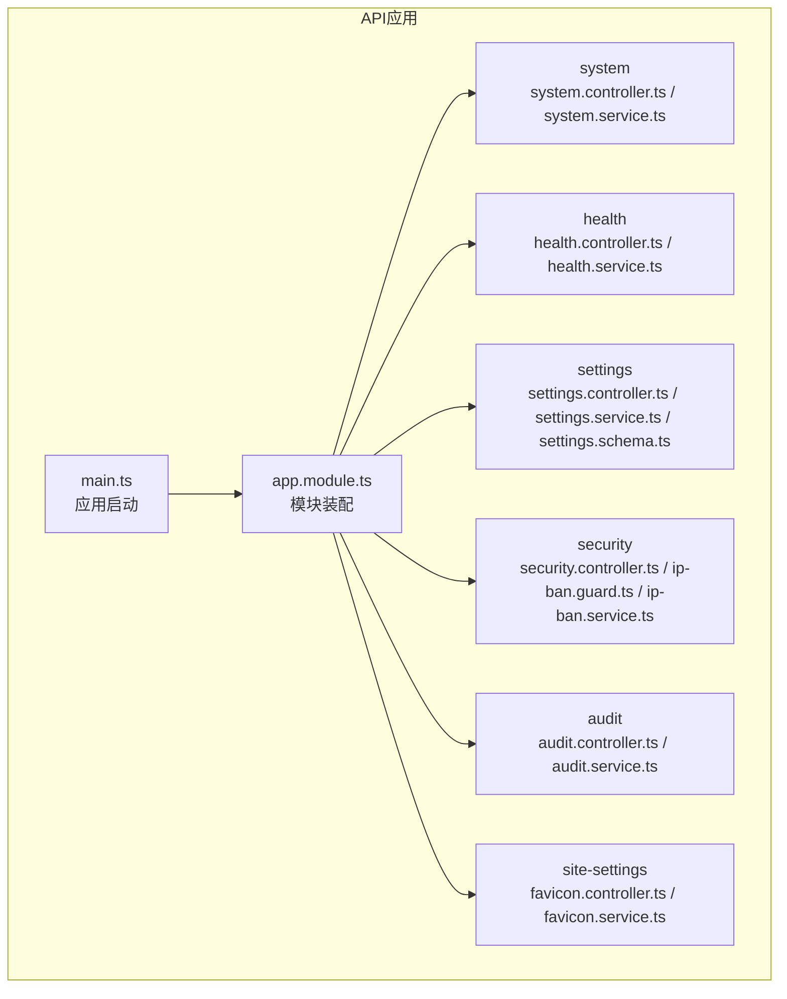
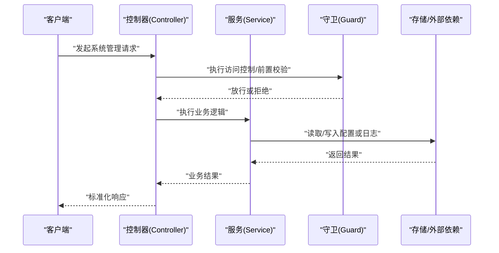
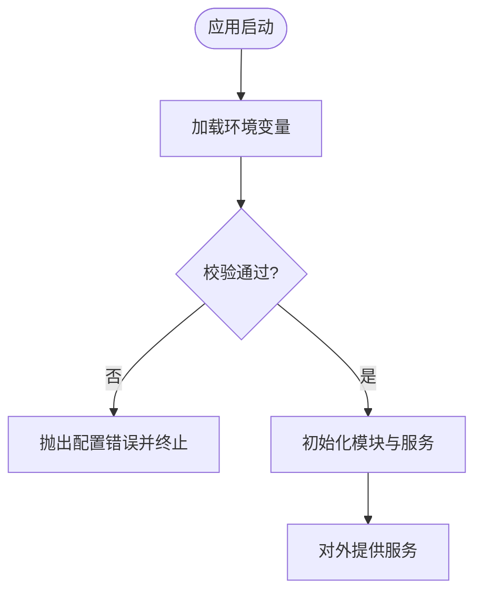
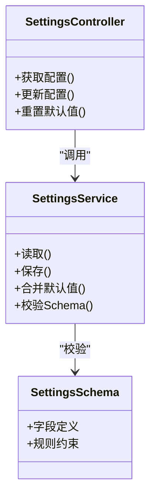
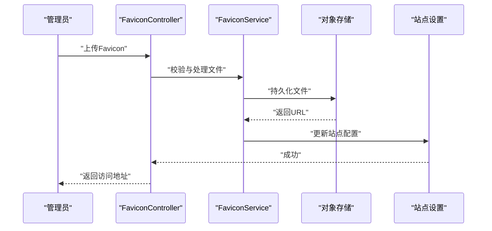
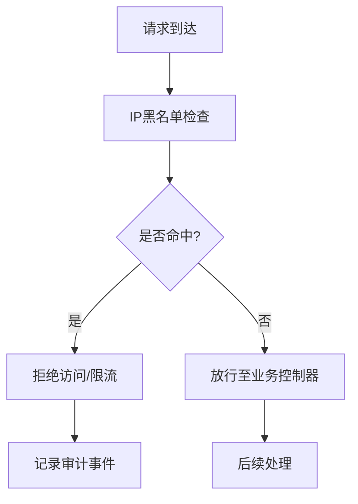
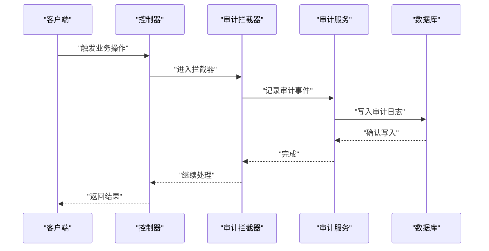
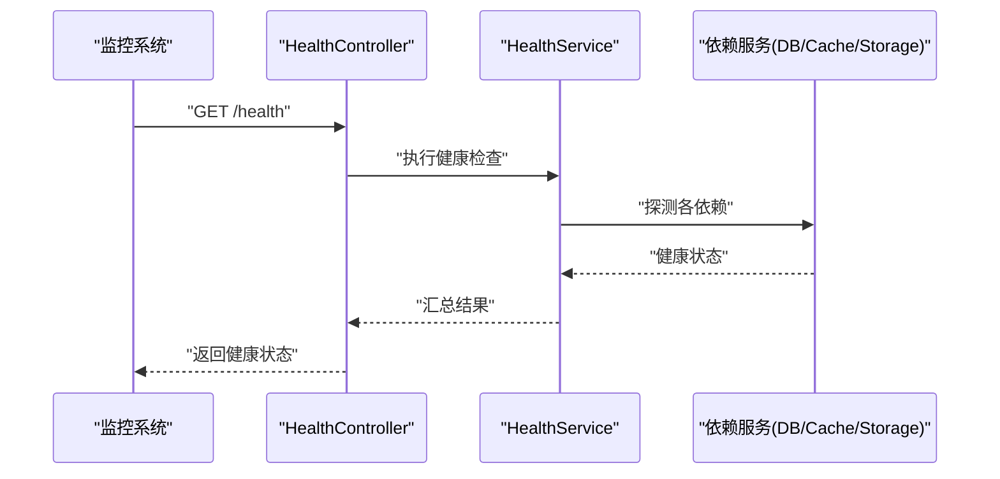
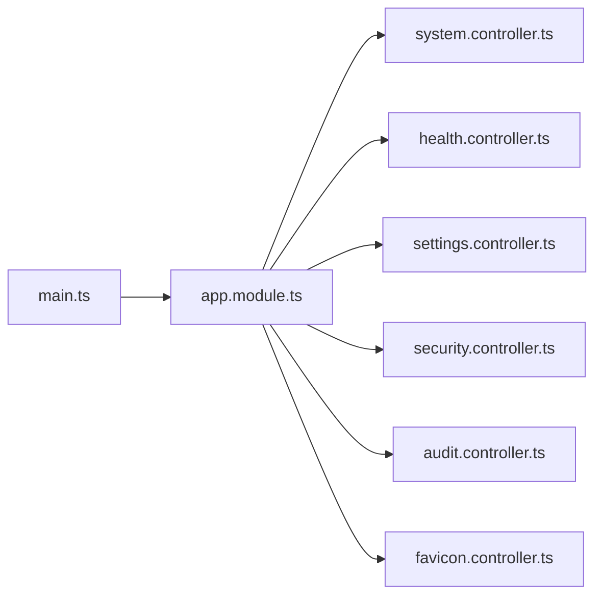

# 系统管理API

<cite>
**本文引用的文件**   
- [system.controller.ts](file://apps/api/src/system/system.controller.ts)
- [system.service.ts](file://apps/api/src/system/system.service.ts)
- [health.controller.ts](file://apps/api/src/health/health.controller.ts)
- [health.service.ts](file://apps/api/src/health/health.service.ts)
- [settings.controller.ts](file://apps/api/src/settings/settings.controller.ts)
- [settings.service.ts](file://apps/api/src/settings/settings.service.ts)
- [settings.schema.ts](file://apps/api/src/settings/settings.schema.ts)
- [security.controller.ts](file://apps/api/src/security/security.controller.ts)
- [ip-ban.guard.ts](file://apps/api/src/security/ip-ban.guard.ts)
- [ip-ban.service.ts](file://apps/api/src/security/ip-ban.service.ts)
- [audit.controller.ts](file://apps/api/src/audit/audit.controller.ts)
- [audit.service.ts](file://apps/api/src/audit/audit.service.ts)
- [env.validation.ts](file://apps/api/src/config/env.validation.ts)
- [app.module.ts](file://apps/api/src/app.module.ts)
- [main.ts](file://apps/api/src/main.ts)
- [favicon.controller.ts](file://apps/api/src/site-settings/favicon.controller.ts)
- [favicon.service.ts](file://apps/api/src/site-settings/favicon.service.ts)
</cite>

## 目录
1. [简介](#简介)
2. [项目结构](#项目结构)
3. [核心组件](#核心组件)
4. [架构总览](#架构总览)
5. [详细组件分析](#详细组件分析)
6. [依赖关系分析](#依赖关系分析)
7. [性能与调优](#性能与调优)
8. [故障排查指南](#故障排查指南)
9. [结论](#结论)
10. [附录：API规范](#附录api规范)

## 简介
本文件面向系统管理员与后端开发者，系统化梳理并文档化“系统管理API”，覆盖以下能力域：
- 系统配置与环境变量校验
- 站点设置（含Favicon等）
- 安全策略（IP黑名单、访问控制、安全扫描与合规检查）
- 审计日志查询与管理
- 系统健康检查、备份恢复与故障排查接口

该文档以代码仓库中的实际实现为依据，提供清晰的模块职责、数据流、调用序列与错误处理建议，帮助读者快速定位问题并高效集成。

## 项目结构
系统管理相关能力集中在 NestJS API 应用中，采用模块化组织方式：
- system：系统级配置与状态
- health：健康检查与指标采集
- settings：站点与系统设置（含Schema校验）
- security：安全策略（IP封禁、访问控制守卫）
- audit：审计日志
- site-settings：站点设置扩展（如Favicon）

图表来源
- [main.ts](file://apps/api/src/main.ts)
- [app.module.ts](file://apps/api/src/app.module.ts)
- [system.controller.ts](file://apps/api/src/system/system.controller.ts)
- [health.controller.ts](file://apps/api/src/health/health.controller.ts)
- [settings.controller.ts](file://apps/api/src/settings/settings.controller.ts)
- [security.controller.ts](file://apps/api/src/security/security.controller.ts)
- [audit.controller.ts](file://apps/api/src/audit/audit.controller.ts)
- [favicon.controller.ts](file://apps/api/src/site-settings/favicon.controller.ts)

章节来源
- [main.ts](file://apps/api/src/main.ts)
- [app.module.ts](file://apps/api/src/app.module.ts)

## 核心组件
- 系统配置与环境校验
  - 通过环境变量校验模块确保运行期配置完整与安全。
- 系统状态与功能开关
  - 暴露系统版本、运行时环境、功能开关与关键指标。
- 站点设置
  - 统一读写站点配置，支持结构化Schema校验与默认值。
- 安全策略
  - IP黑名单管理、请求拦截守卫、访问控制与基础安全扫描入口。
- 审计日志
  - 记录并查询操作审计事件，便于合规与排障。
- 健康检查
  - 聚合服务健康状态与依赖健康度，支撑自动化运维。

章节来源
- [env.validation.ts](file://apps/api/src/config/env.validation.ts)
- [system.controller.ts](file://apps/api/src/system/system.controller.ts)
- [system.service.ts](file://apps/api/src/system/system.service.ts)
- [settings.controller.ts](file://apps/api/src/settings/settings.controller.ts)
- [settings.service.ts](file://apps/api/src/settings/settings.service.ts)
- [settings.schema.ts](file://apps/api/src/settings/settings.schema.ts)
- [security.controller.ts](file://apps/api/src/security/security.controller.ts)
- [ip-ban.guard.ts](file://apps/api/src/security/ip-ban.guard.ts)
- [ip-ban.service.ts](file://apps/api/src/security/ip-ban.service.ts)
- [audit.controller.ts](file://apps/api/src/audit/audit.controller.ts)
- [audit.service.ts](file://apps/api/src/audit/audit.service.ts)
- [health.controller.ts](file://apps/api/src/health/health.controller.ts)
- [health.service.ts](file://apps/api/src/health/health.service.ts)

## 架构总览
系统管理API遵循典型的NestJS分层架构：Controller负责HTTP路由与参数校验，Service封装业务逻辑，Guard/Interceptor/Pipe提供横切关注点（鉴权、审计、转换），Prisma/存储层负责持久化。

图表来源
- [system.controller.ts](file://apps/api/src/system/system.controller.ts)
- [system.service.ts](file://apps/api/src/system/system.service.ts)
- [settings.controller.ts](file://apps/api/src/settings/settings.controller.ts)
- [settings.service.ts](file://apps/api/src/settings/settings.service.ts)
- [security.controller.ts](file://apps/api/src/security/security.controller.ts)
- [ip-ban.guard.ts](file://apps/api/src/security/ip-ban.guard.ts)
- [ip-ban.service.ts](file://apps/api/src/security/ip-ban.service.ts)
- [audit.controller.ts](file://apps/api/src/audit/audit.controller.ts)
- [audit.service.ts](file://apps/api/src/audit/audit.service.ts)
- [health.controller.ts](file://apps/api/src/health/health.controller.ts)
- [health.service.ts](file://apps/api/src/health/health.service.ts)

## 详细组件分析

### 系统配置与环境校验
- 职责
  - 校验环境变量完整性与类型，保障运行期配置安全。
  - 暴露系统信息、功能开关与关键指标。
- 关键点
  - 环境变量校验失败将阻止应用启动或返回明确错误。
  - 系统信息接口通常包含版本、运行环境、时区、可用内存等。
- 典型流程
  - 启动阶段加载并校验环境变量；
  - 系统信息接口聚合运行时状态与配置摘要。

图表来源
- [env.validation.ts](file://apps/api/src/config/env.validation.ts)
- [main.ts](file://apps/api/src/main.ts)
- [system.controller.ts](file://apps/api/src/system/system.controller.ts)
- [system.service.ts](file://apps/api/src/system/system.service.ts)

章节来源
- [env.validation.ts](file://apps/api/src/config/env.validation.ts)
- [system.controller.ts](file://apps/api/src/system/system.controller.ts)
- [system.service.ts](file://apps/api/src/system/system.service.ts)

### 站点设置（Settings）
- 职责
  - 统一管理站点配置项，支持按模块分组与Schema校验。
  - 提供默认值、增量更新与批量写入能力。
- 关键点
  - 使用Schema定义字段类型、必填性与取值范围。
  - 变更需具备审计追踪与权限控制。
- 典型流程
  - 读取当前配置 -> 校验输入 -> 持久化 -> 返回最新配置。

图表来源
- [settings.controller.ts](file://apps/api/src/settings/settings.controller.ts)
- [settings.service.ts](file://apps/api/src/settings/settings.service.ts)
- [settings.schema.ts](file://apps/api/src/settings/settings.schema.ts)

章节来源
- [settings.controller.ts](file://apps/api/src/settings/settings.controller.ts)
- [settings.service.ts](file://apps/api/src/settings/settings.service.ts)
- [settings.schema.ts](file://apps/api/src/settings/settings.schema.ts)

### 站点设置扩展：Favicon
- 职责
  - 上传、预览与删除站点图标（Favicon）。
- 关键点
  - 文件类型与大小限制；
  - 缓存与CDN路径生成；
  - 与站点设置联动更新。
- 典型流程
  - 上传校验 -> 存储 -> 更新站点配置 -> 返回访问URL。

图表来源
- [favicon.controller.ts](file://apps/api/src/site-settings/favicon.controller.ts)
- [favicon.service.ts](file://apps/api/src/site-settings/favicon.service.ts)

章节来源
- [favicon.controller.ts](file://apps/api/src/site-settings/favicon.controller.ts)
- [favicon.service.ts](file://apps/api/src/site-settings/favicon.service.ts)

### 安全策略（IP黑名单与访问控制）
- 职责
  - 维护IP黑名单，拦截恶意或违规访问；
  - 提供全局或局部访问控制守卫；
  - 暴露安全扫描与合规检查的入口。
- 关键点
  - 黑名单命中即拒绝访问或限流；
  - 支持动态增删改查与批量导入；
  - 与审计日志联动记录拦截事件。
- 典型流程
  - 请求进入 -> 守卫检查IP -> 命中则拒绝 -> 未命中继续处理。

图表来源
- [security.controller.ts](file://apps/api/src/security/security.controller.ts)
- [ip-ban.guard.ts](file://apps/api/src/security/ip-ban.guard.ts)
- [ip-ban.service.ts](file://apps/api/src/security/ip-ban.service.ts)

章节来源
- [security.controller.ts](file://apps/api/src/security/security.controller.ts)
- [ip-ban.guard.ts](file://apps/api/src/security/ip-ban.guard.ts)
- [ip-ban.service.ts](file://apps/api/src/security/ip-ban.service.ts)

### 审计日志
- 职责
  - 记录系统内关键操作的审计事件，包括操作人、时间、资源、动作与结果。
- 关键点
  - 高吞吐写入与分页查询；
  - 敏感信息脱敏；
  - 与访问控制、中间件集成自动记录。
- 典型流程
  - 操作发生 -> 中间件/拦截器捕获 -> 写入审计表 -> 提供查询接口。

图表来源
- [audit.controller.ts](file://apps/api/src/audit/audit.controller.ts)
- [audit.service.ts](file://apps/api/src/audit/audit.service.ts)

章节来源
- [audit.controller.ts](file://apps/api/src/audit/audit.controller.ts)
- [audit.service.ts](file://apps/api/src/audit/audit.service.ts)

### 健康检查
- 职责
  - 聚合系统健康状态与依赖健康度（数据库、缓存、对象存储等）。
- 关键点
  - 区分就绪与存活探针；
  - 指标可被监控平台抓取；
  - 失败时给出明确的依赖诊断信息。
- 典型流程
  - 健康端点被调用 -> 逐个检查依赖 -> 汇总状态 -> 返回JSON。

图表来源
- [health.controller.ts](file://apps/api/src/health/health.controller.ts)
- [health.service.ts](file://apps/api/src/health/health.service.ts)

章节来源
- [health.controller.ts](file://apps/api/src/health/health.controller.ts)
- [health.service.ts](file://apps/api/src/health/health.service.ts)

## 依赖关系分析
- 模块耦合
  - Controller仅负责路由与参数校验，业务逻辑下沉至Service，降低耦合。
  - Guard与中间件作为横切关注点，避免在业务中重复实现。
- 外部依赖
  - 数据库（Prisma）、对象存储、缓存等通过Service抽象，便于替换与测试。
- 潜在风险
  - 循环依赖需在模块装配时规避；
  - 大对象传输需考虑限流与分片。

图表来源
- [main.ts](file://apps/api/src/main.ts)
- [app.module.ts](file://apps/api/src/app.module.ts)

章节来源
- [app.module.ts](file://apps/api/src/app.module.ts)

## 性能与调优
- 配置与开关
  - 通过系统配置接口启用/禁用非核心功能，减少不必要的I/O。
- 缓存策略
  - 对热点配置与静态资源启用缓存，缩短响应时间。
- 连接池与超时
  - 合理设置数据库与对象存储的连接池大小与超时阈值。
- 限流与熔断
  - 对写操作与外部依赖调用实施限流与熔断，保护系统稳定性。
- 监控指标
  - 暴露关键指标（QPS、延迟、错误率、依赖健康度），接入APM与告警。

[本节为通用指导，不直接分析具体文件]

## 故障排查指南
- 常见问题
  - 环境变量缺失或类型错误导致启动失败；
  - 健康检查失败指示依赖不可用；
  - IP黑名单误拦截导致合法访问被拒；
  - 审计日志丢失或写入缓慢影响性能。
- 排查步骤
  - 查看健康检查输出，定位失败依赖；
  - 核对环境变量与配置Schema；
  - 检查IP黑名单与访问控制规则；
  - 审查审计日志与错误日志，定位异常链路。
- 建议
  - 为关键路径增加重试与降级；
  - 对写入操作进行异步化与批量化；
  - 定期清理过期审计日志与临时文件。

章节来源
- [health.controller.ts](file://apps/api/src/health/health.controller.ts)
- [health.service.ts](file://apps/api/src/health/health.service.ts)
- [env.validation.ts](file://apps/api/src/config/env.validation.ts)
- [ip-ban.guard.ts](file://apps/api/src/security/ip-ban.guard.ts)
- [ip-ban.service.ts](file://apps/api/src/security/ip-ban.service.ts)
- [audit.controller.ts](file://apps/api/src/audit/audit.controller.ts)
- [audit.service.ts](file://apps/api/src/audit/audit.service.ts)

## 结论
系统管理API围绕“配置—安全—审计—健康”四大支柱构建，采用清晰的分层与模块化设计，便于扩展与维护。通过严格的配置校验、完善的访问控制、全面的审计追踪与健壮的健康检查，能够有效支撑生产环境的稳定运行与合规要求。建议在部署与运维过程中结合监控与告警体系，持续优化性能与可靠性。

[本节为总结性内容，不直接分析具体文件]

## 附录：API规范
以下为系统管理相关接口的概览说明（方法、路径、用途、权限与典型响应字段）。具体字段以各控制器与服务实现为准。

- 系统配置与环境
  - GET /api/system/info
    - 用途：获取系统信息与运行时状态
    - 权限：管理员
    - 响应：版本、环境、功能开关、关键指标
  - PUT /api/system/config
    - 用途：更新系统配置（受Schema校验）
    - 权限：管理员
    - 响应：更新后的配置摘要

- 站点设置
  - GET /api/settings
    - 用途：获取站点配置
    - 权限：管理员
    - 响应：配置对象（按模块分组）
  - PATCH /api/settings
    - 用途：增量更新站点配置
    - 权限：管理员
    - 响应：最新配置
  - POST /api/settings/reset
    - 用途：重置为默认配置
    - 权限：管理员
    - 响应：默认配置

- 站点设置扩展（Favicon）
  - POST /api/site-settings/favicon/upload
    - 用途：上传站点图标
    - 权限：管理员
    - 响应：访问URL与元信息
  - DELETE /api/site-settings/favicon
    - 用途：删除站点图标
    - 权限：管理员
    - 响应：成功标志

- 安全策略（IP黑名单与访问控制）
  - GET /api/security/blocked-ips
    - 用途：查询IP黑名单
    - 权限：管理员
    - 响应：列表（IP、原因、时间）
  - POST /api/security/blocked-ips
    - 用途：新增IP到黑名单
    - 权限：管理员
    - 响应：创建结果
  - DELETE /api/security/blocked-ips/:ip
    - 用途：从黑名单移除IP
    - 权限：管理员
    - 响应：删除结果
  - 访问控制守卫
    - 行为：命中黑名单的请求将被拒绝或限流
    - 审计：拦截事件记录至审计日志

- 审计日志
  - GET /api/audit/logs
    - 用途：查询审计日志（支持分页与过滤）
    - 权限：管理员
    - 响应：日志条目（操作人、时间、资源、动作、结果）

- 健康检查
  - GET /api/health
    - 用途：系统健康检查
    - 权限：公开（或受限）
    - 响应：整体健康状态与依赖健康详情

[本节为接口概览，具体字段与状态码以实际实现为准]