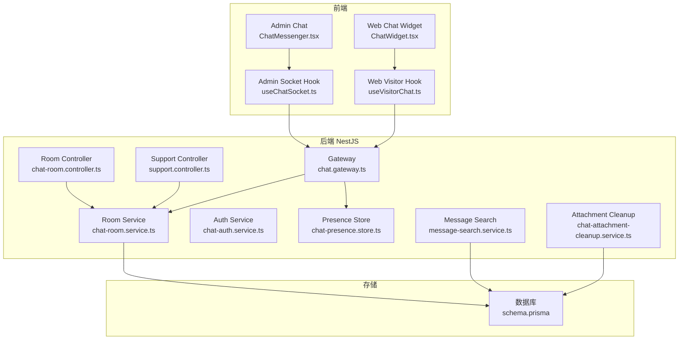
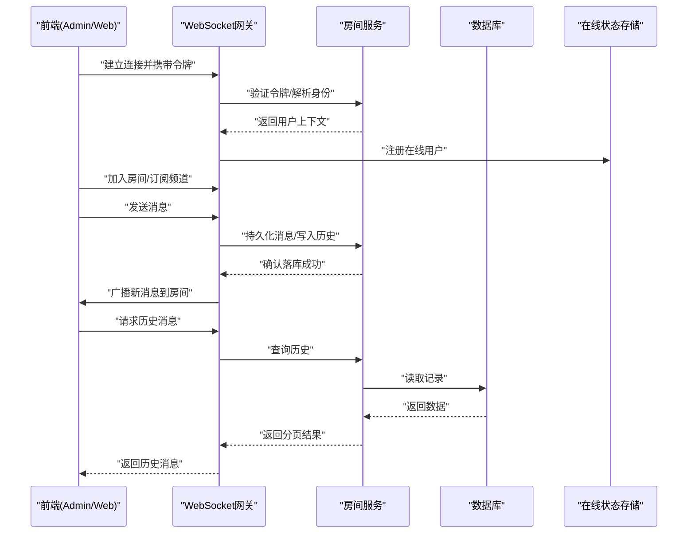
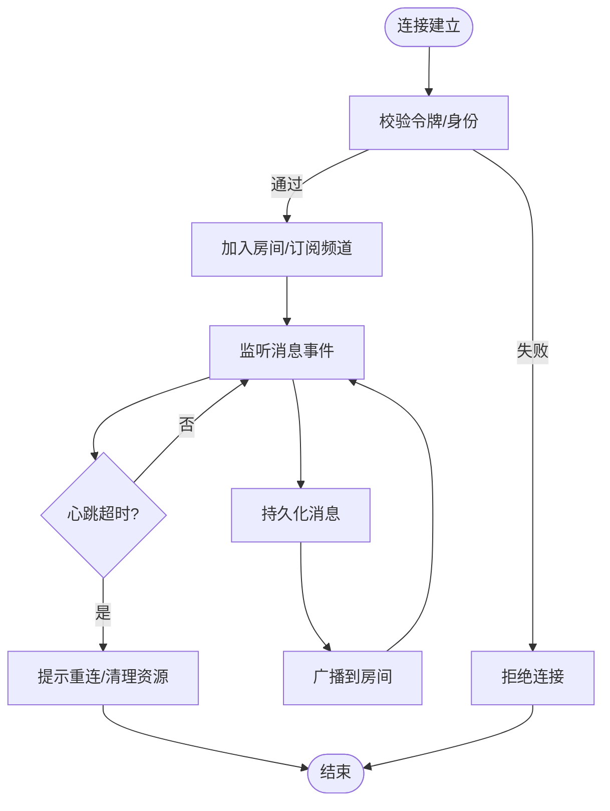
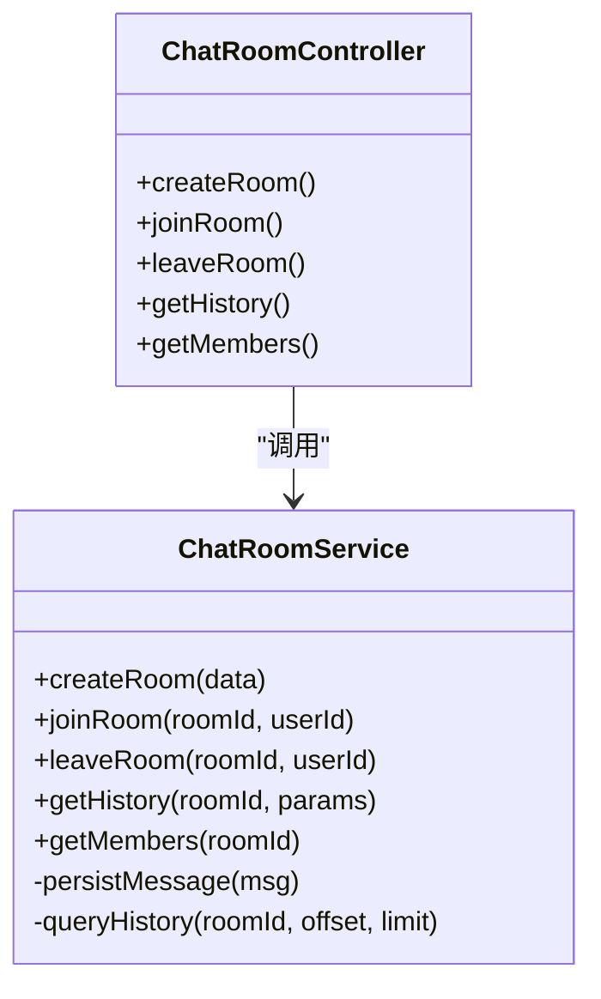
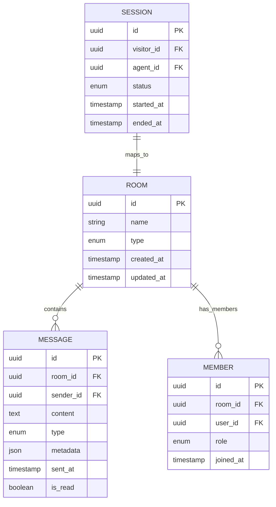
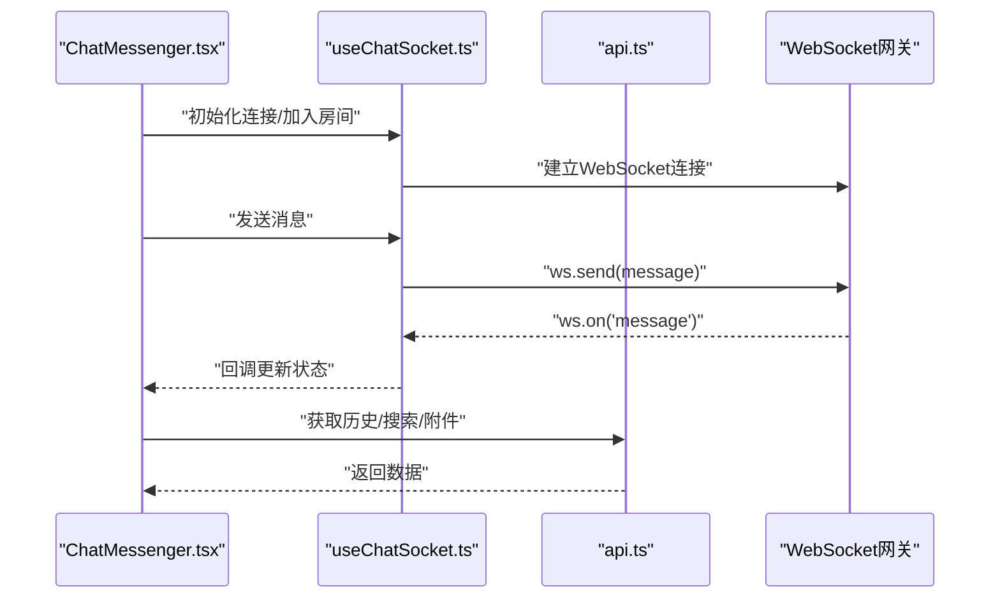
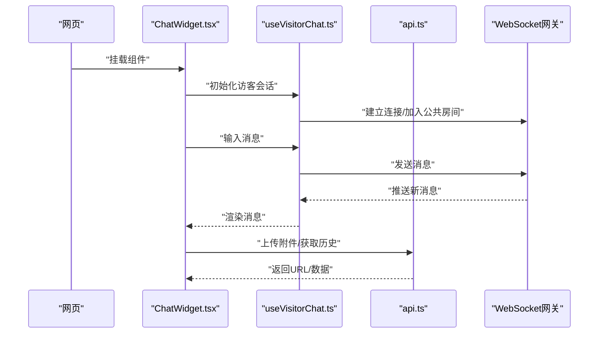
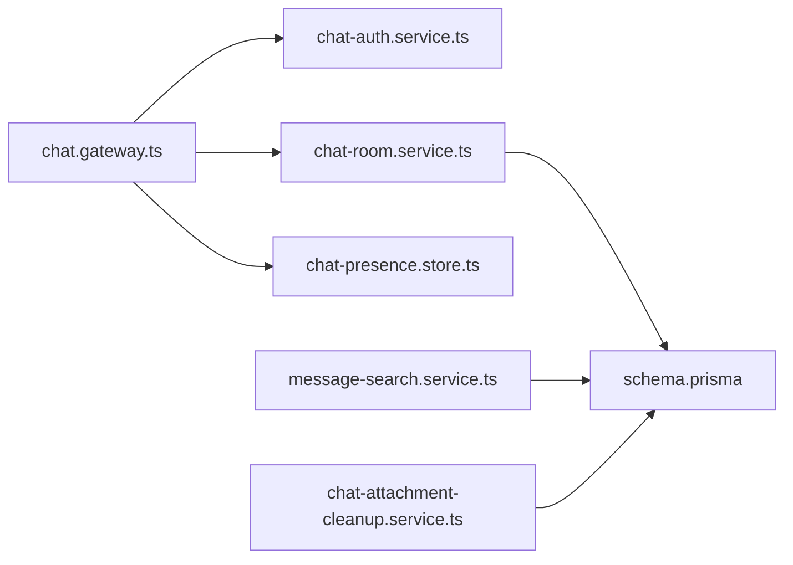

# 聊天系统API

<cite>
**本文引用的文件**
- [chat.gateway.ts](file://apps/api/src/support/chat.gateway.ts)
- [chat-room.controller.ts](file://apps/api/src/support/chat-room.controller.ts)
- [chat-room.service.ts](file://apps/api/src/support/chat-room.service.ts)
- [support.controller.ts](file://apps/api/src/support/support.controller.ts)
- [support.service.ts](file://apps/api/src/support/support.service.ts)
- [chat-auth.service.ts](file://apps/api/src/support/chat-auth.service.ts)
- [chat-presence.store.ts](file://apps/api/src/support/chat-presence.store.ts)
- [message-search.service.ts](file://apps/api/src/support/message-search.service.ts)
- [chat-attachment-cleanup.service.ts](file://apps/api/src/support/chat-attachment-cleanup.service.ts)
- [schema.prisma](file://apps/api/prisma/schema.prisma)
- [api.ts](file://apps/admin/src/features/chat/api.ts)
- [useChatSocket.ts](file://apps/admin/src/features/chat/useChatSocket.ts)
- [types.ts](file://apps/admin/src/features/chat/types.ts)
- [ChatMessenger.tsx](file://apps/admin/src/features/chat/ChatMessenger.tsx)
- [ChatPresenceProvider.tsx](file://apps/admin/src/features/chat/ChatPresenceProvider.tsx)
- [api.ts](file://apps/web/src/features/chat/api.ts)
- [useVisitorChat.ts](file://apps/web/src/features/chat/useVisitorChat.ts)
- [presence.ts](file://apps/web/src/features/chat/presence.ts)
- [ChatWidget.tsx](file://apps/web/src/components/chat/ChatWidget.tsx)
</cite>

## 目录
1. [简介](#简介)
2. [项目结构](#项目结构)
3. [核心组件](#核心组件)
4. [架构总览](#架构总览)
5. [详细组件分析](#详细组件分析)
6. [依赖关系分析](#依赖关系分析)
7. [性能考量](#性能考量)
8. [故障排查指南](#故障排查指南)
9. [结论](#结论)
10. [附录](#附录)

## 简介
本文件为聊天系统API的完整技术文档，覆盖WebSocket连接建立、消息收发、房间管理、在线状态同步、实时推送、历史消息查询、文件附件传输与清理、消息搜索、会话生命周期管理、消息持久化与离线处理策略，以及前后端集成示例和错误处理方案。读者可据此快速完成接入与排障。

## 项目结构
聊天功能横跨后端NestJS模块与前端Admin/Web双端：
- 后端（apps/api）
  - support 模块提供聊天网关、控制器与服务，包含房间、认证、在线状态、搜索、附件清理等能力
  - Prisma schema 定义聊天相关数据模型与迁移
- 前端（apps/admin 与 apps/web）
  - Admin端：聊天控制台与客服工作台，使用WebSocket Hook与REST API
  - Web端：访客聊天小部件，封装连接、事件与状态管理

**图示来源**
- [chat.gateway.ts](file://apps/api/src/support/chat.gateway.ts)
- [chat-room.controller.ts](file://apps/api/src/support/chat-room.controller.ts)
- [support.controller.ts](file://apps/api/src/support/support.controller.ts)
- [chat-room.service.ts](file://apps/api/src/support/chat-room.service.ts)
- [chat-auth.service.ts](file://apps/api/src/support/chat-auth.service.ts)
- [chat-presence.store.ts](file://apps/api/src/support/chat-presence.store.ts)
- [message-search.service.ts](file://apps/api/src/support/message-search.service.ts)
- [chat-attachment-cleanup.service.ts](file://apps/api/src/support/chat-attachment-cleanup.service.ts)
- [schema.prisma](file://apps/api/prisma/schema.prisma)
- [ChatMessenger.tsx](file://apps/admin/src/features/chat/ChatMessenger.tsx)
- [useChatSocket.ts](file://apps/admin/src/features/chat/useChatSocket.ts)
- [ChatWidget.tsx](file://apps/web/src/components/chat/ChatWidget.tsx)
- [useVisitorChat.ts](file://apps/web/src/features/chat/useVisitorChat.ts)

**章节来源**
- [chat.gateway.ts](file://apps/api/src/support/chat.gateway.ts)
- [chat-room.controller.ts](file://apps/api/src/support/chat-room.controller.ts)
- [support.controller.ts](file://apps/api/src/support/support.controller.ts)
- [chat-room.service.ts](file://apps/api/src/support/chat-room.service.ts)
- [schema.prisma](file://apps/api/prisma/schema.prisma)

## 核心组件
- WebSocket网关（chat.gateway.ts）
  - 负责WebSocket握手、鉴权、房间订阅/发布、在线状态广播、消息转发与持久化触发
- 房间控制器（chat-room.controller.ts）
  - REST接口用于创建/加入/离开房间、获取房间信息、列表与分页
- 支持控制器（support.controller.ts）
  - 面向客服/管理员的会话控制、转接、关闭、标注等能力
- 房间服务（chat-room.service.ts）
  - 房间状态、成员管理、消息落库、历史查询、离线队列
- 认证服务（chat-auth.service.ts）
  - 生成/校验聊天令牌、角色权限校验、访客匿名与会话绑定
- 在线状态存储（chat-presence.store.ts）
  - 内存或缓存中的用户在线映射、最近活跃时间、房间可见性
- 消息搜索（message-search.service.ts）
  - 全文检索、按房间/用户/时间范围过滤、结果分页
- 附件清理（chat-attachment-cleanup.service.ts）
  - 定时任务清理过期附件、统计回收空间

**章节来源**
- [chat.gateway.ts](file://apps/api/src/support/chat.gateway.ts)
- [chat-room.controller.ts](file://apps/api/src/support/chat-room.controller.ts)
- [support.controller.ts](file://apps/api/src/support/support.controller.ts)
- [chat-room.service.ts](file://apps/api/src/support/chat-room.service.ts)
- [chat-auth.service.ts](file://apps/api/src/support/chat-auth.service.ts)
- [chat-presence.store.ts](file://apps/api/src/support/chat-presence.store.ts)
- [message-search.service.ts](file://apps/api/src/support/message-search.service.ts)
- [chat-attachment-cleanup.service.ts](file://apps/api/src/support/chat-attachment-cleanup.service.ts)

## 架构总览
聊天系统采用“REST + WebSocket”混合架构：
- REST：房间管理、历史消息、搜索、附件上传下载、会话控制
- WebSocket：实时消息、在线状态、事件广播

**图示来源**
- [chat.gateway.ts](file://apps/api/src/support/chat.gateway.ts)
- [chat-room.service.ts](file://apps/api/src/support/chat-room.service.ts)
- [schema.prisma](file://apps/api/prisma/schema.prisma)

## 详细组件分析

### WebSocket网关（chat.gateway.ts）
职责
- 连接建立与鉴权：从握手参数中解析令牌，调用认证服务校验身份
- 房间订阅：根据房间ID加入/离开，维护订阅集合
- 消息路由：将消息持久化后广播至房间成员
- 在线状态：用户上线/下线时更新并广播
- 事件通道：心跳、重连提示、系统公告等

关键流程
- 连接建立 → 鉴权 → 初始化用户上下文 → 加入默认房间
- 收到消息 → 校验权限 → 落库 → 广播给房间成员
- 断开连接 → 清理订阅 → 更新在线状态

**图示来源**
- [chat.gateway.ts](file://apps/api/src/support/chat.gateway.ts)
- [chat-auth.service.ts](file://apps/api/src/support/chat-auth.service.ts)

**章节来源**
- [chat.gateway.ts](file://apps/api/src/support/chat.gateway.ts)
- [chat-auth.service.ts](file://apps/api/src/support/chat-auth.service.ts)

### 房间控制器与服务（chat-room.controller.ts / chat-room.service.ts）
职责
- 控制器：暴露REST接口，如创建房间、加入/离开、获取房间详情、成员列表、分页历史
- 服务：实现业务逻辑，包括房间状态管理、成员权限、消息落库、历史分页、离线队列

典型接口
- POST /rooms：创建房间
- POST /rooms/:id/join：加入房间
- DELETE /rooms/:id/leave：离开房间
- GET /rooms/:id/history：分页历史消息
- GET /rooms/:id/members：成员列表

**图示来源**
- [chat-room.controller.ts](file://apps/api/src/support/chat-room.controller.ts)
- [chat-room.service.ts](file://apps/api/src/support/chat-room.service.ts)

**章节来源**
- [chat-room.controller.ts](file://apps/api/src/support/chat-room.controller.ts)
- [chat-room.service.ts](file://apps/api/src/support/chat-room.service.ts)

### 支持控制器与服务（support.controller.ts / support.service.ts）
职责
- 面向客服/管理员的会话操作：分配、转接、关闭、标记、备注
- 与房间服务协作，确保会话状态一致

典型接口
- POST /support/assign：分配客服
- POST /support/transfer：转接会话
- POST /support/close：关闭会话
- GET /support/sessions：会话列表

**章节来源**
- [support.controller.ts](file://apps/api/src/support/support.controller.ts)
- [support.service.ts](file://apps/api/src/support/support.service.ts)

### 认证服务（chat-auth.service.ts）
职责
- 生成聊天令牌（JWT或短期Token），绑定用户角色与权限
- 校验令牌有效性、权限范围（访客/客服/管理员）
- 与全局鉴权体系集成（如NestGuard）

**章节来源**
- [chat-auth.service.ts](file://apps/api/src/support/chat-auth.service.ts)

### 在线状态存储（chat-presence.store.ts）
职责
- 维护用户在线映射：userId → {roomIds, lastActive}
- 提供查询接口：房间在线人数、用户是否在线、最近活跃时间
- 支持扩展为Redis以水平扩展

**章节来源**
- [chat-presence.store.ts](file://apps/api/src/support/chat-presence.store.ts)

### 消息搜索（message-search.service.ts）
职责
- 全文检索：按关键词、房间ID、用户ID、时间范围过滤
- 分页与排序：按时间倒序、命中高亮
- 可选索引：Elasticsearch或数据库全文索引

**章节来源**
- [message-search.service.ts](file://apps/api/src/support/message-search.service.ts)

### 附件清理（chat-attachment-cleanup.service.ts）
职责
- 定时任务扫描过期附件，删除文件并清理数据库引用
- 统计回收空间，输出日志
- 支持配置保留策略（如30天）

**章节来源**
- [chat-attachment-cleanup.service.ts](file://apps/api/src/support/chat-attachment-cleanup.service.ts)

### 数据模型（schema.prisma）
聊天相关实体通常包括：
- 房间（Room）：标识、名称、类型、状态、创建者
- 消息（Message）：内容、类型、发送者、房间、附件、时间戳、已读状态
- 成员（Member）：房间与用户关联、角色、加入时间
- 会话（Session）：访客/客服关联、状态、开始/结束时间

**图示来源**
- [schema.prisma](file://apps/api/prisma/schema.prisma)

**章节来源**
- [schema.prisma](file://apps/api/prisma/schema.prisma)

### 前端集成（Admin端）
- useChatSocket.ts：封装WebSocket连接、重连、事件订阅、消息发送
- types.ts：定义消息、房间、在线状态等类型
- api.ts：REST调用（房间、历史、搜索、附件）
- ChatMessenger.tsx：聊天界面、消息渲染、附件预览
- ChatPresenceProvider.tsx：在线状态上下文

**图示来源**
- [useChatSocket.ts](file://apps/admin/src/features/chat/useChatSocket.ts)
- [api.ts](file://apps/admin/src/features/chat/api.ts)
- [types.ts](file://apps/admin/src/features/chat/types.ts)
- [ChatMessenger.tsx](file://apps/admin/src/features/chat/ChatMessenger.tsx)

**章节来源**
- [useChatSocket.ts](file://apps/admin/src/features/chat/useChatSocket.ts)
- [api.ts](file://apps/admin/src/features/chat/api.ts)
- [types.ts](file://apps/admin/src/features/chat/types.ts)
- [ChatMessenger.tsx](file://apps/admin/src/features/chat/ChatMessenger.tsx)

### 前端集成（Web端）
- useVisitorChat.ts：访客聊天Hook，自动连接、消息发送、状态同步
- presence.ts：在线状态工具函数
- ChatWidget.tsx：悬浮聊天小部件，嵌入页面

**图示来源**
- [useVisitorChat.ts](file://apps/web/src/features/chat/useVisitorChat.ts)
- [api.ts](file://apps/web/src/features/chat/api.ts)
- [presence.ts](file://apps/web/src/features/chat/presence.ts)
- [ChatWidget.tsx](file://apps/web/src/components/chat/ChatWidget.tsx)

**章节来源**
- [useVisitorChat.ts](file://apps/web/src/features/chat/useVisitorChat.ts)
- [api.ts](file://apps/web/src/features/chat/api.ts)
- [presence.ts](file://apps/web/src/features/chat/presence.ts)
- [ChatWidget.tsx](file://apps/web/src/components/chat/ChatWidget.tsx)

## 依赖关系分析
- 网关依赖认证服务进行鉴权，依赖房间服务进行消息持久化与房间管理
- 房间服务依赖数据库（Prisma）进行持久化
- 在线状态存储可独立扩展（内存/Redis）
- 搜索服务依赖数据库或外部搜索引擎
- 附件清理服务依赖文件系统与数据库元数据

**图示来源**
- [chat.gateway.ts](file://apps/api/src/support/chat.gateway.ts)
- [chat-auth.service.ts](file://apps/api/src/support/chat-auth.service.ts)
- [chat-room.service.ts](file://apps/api/src/support/chat-room.service.ts)
- [chat-presence.store.ts](file://apps/api/src/support/chat-presence.store.ts)
- [message-search.service.ts](file://apps/api/src/support/message-search.service.ts)
- [chat-attachment-cleanup.service.ts](file://apps/api/src/support/chat-attachment-cleanup.service.ts)
- [schema.prisma](file://apps/api/prisma/schema.prisma)

**章节来源**
- [chat.gateway.ts](file://apps/api/src/support/chat.gateway.ts)
- [chat-room.service.ts](file://apps/api/src/support/chat-room.service.ts)
- [schema.prisma](file://apps/api/prisma/schema.prisma)

## 性能考量
- 连接池与限流：限制单IP并发连接数，避免DDoS
- 消息批处理：批量落库减少IO压力
- 分页与游标：历史消息使用游标分页，避免深翻页
- 在线状态缓存：使用Redis提升跨节点一致性
- 附件分片上传：大文件分块上传与断点续传
- 搜索索引：对高频字段建立索引或使用搜索引擎

[本节为通用指导，不直接分析具体文件]

## 故障排查指南
常见问题与定位步骤
- WebSocket连接失败
  - 检查令牌是否有效、网络代理是否支持WS升级
  - 查看网关鉴权日志与错误码
- 消息未送达
  - 确认房间订阅是否正确，检查广播通道
  - 查看消息落库是否成功，重试机制是否生效
- 在线状态不同步
  - 检查心跳间隔与超时设置
  - 若分布式部署，确认在线状态存储是否共享
- 历史消息缺失
  - 检查分页参数与游标逻辑
  - 确认数据库事务是否提交
- 附件无法访问
  - 检查存储路径与CORS配置
  - 清理任务是否误删

**章节来源**
- [chat.gateway.ts](file://apps/api/src/support/chat.gateway.ts)
- [chat-room.service.ts](file://apps/api/src/support/chat-room.service.ts)
- [chat-attachment-cleanup.service.ts](file://apps/api/src/support/chat-attachment-cleanup.service.ts)

## 结论
本聊天系统API通过REST与WebSocket协同，实现了完整的即时通讯能力。房间管理、在线状态、消息持久化、搜索与附件处理均具备可扩展设计。前端Admin与Web端提供了开箱即用的集成方案。建议在生产环境启用连接限流、在线状态缓存与搜索索引，以提升稳定性与性能。

[本节为总结，不直接分析具体文件]

## 附录
- 错误码约定：统一HTTP状态码与WebSocket事件错误码
- 安全建议：令牌有效期、权限最小化、敏感内容脱敏
- 监控指标：连接数、消息吞吐、延迟、错误率、附件大小分布

[本节为补充说明，不直接分析具体文件]