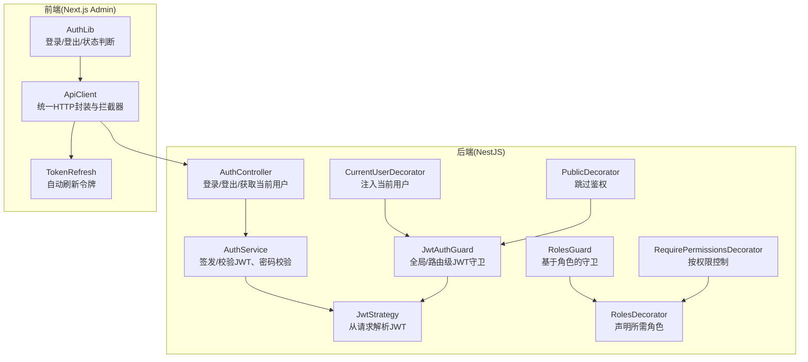
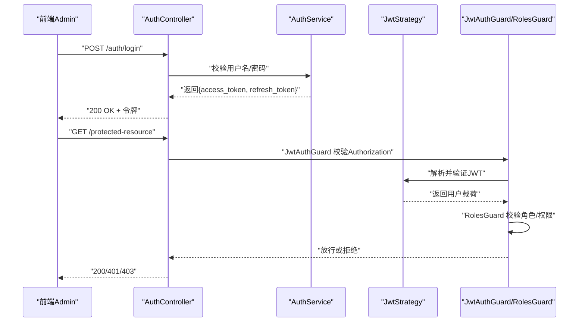
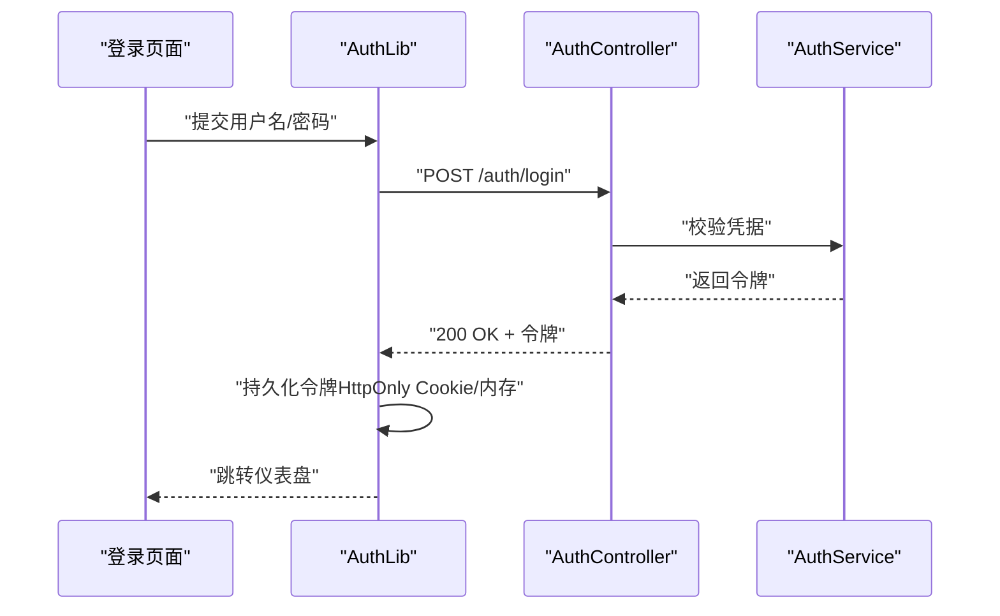
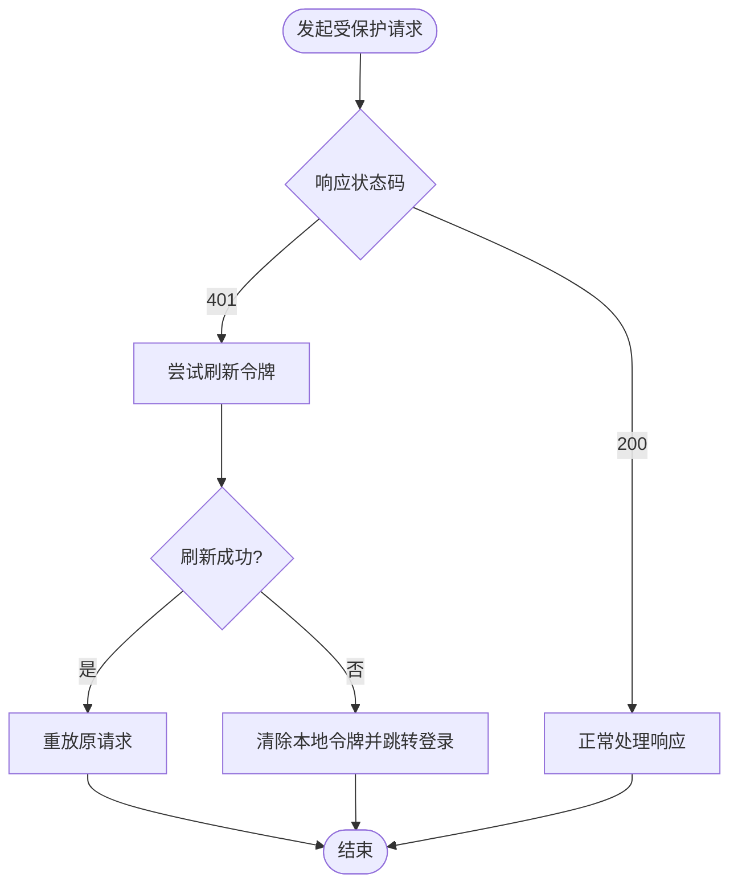
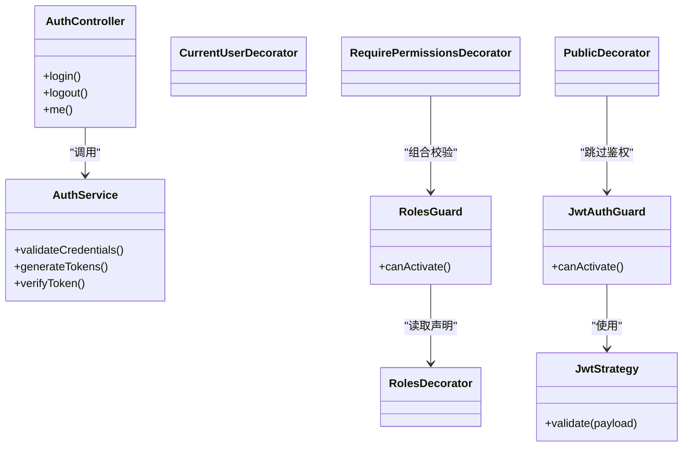

# 认证与授权API

<cite>
**本文引用的文件**
- [auth.controller.ts](file://apps/api/src/auth/auth.controller.ts)
- [auth.service.ts](file://apps/api/src/auth/auth.service.ts)
- [jwt.strategy.ts](file://apps/api/src/auth/strategies/jwt.strategy.ts)
- [jwt-auth.guard.ts](file://apps/api/src/auth/guards/jwt-auth.guard.ts)
- [roles.guard.ts](file://apps/api/src/auth/guards/roles.guard.ts)
- [current-user.decorator.ts](file://apps/api/src/auth/decorators/current-user.decorator.ts)
- [require-permissions.decorator.ts](file://apps/api/src/auth/decorators/require-permissions.decorator.ts)
- [roles.decorator.ts](file://apps/api/src/auth/decorators/roles.decorator.ts)
- [public.decorator.ts](file://apps/api/src/auth/decorators/public.decorator.ts)
- [auth.dto.ts](file://apps/api/src/auth/dto/auth.dto.ts)
- [profile.dto.ts](file://apps/api/src/auth/dto/profile.dto.ts)
- [roles.ts](file://apps/api/src/auth/roles.ts)
- [tokenRefresh.ts](file://apps/admin/src/lib/tokenRefresh.ts)
- [apiClient.ts](file://apps/admin/src/lib/apiClient.ts)
- [auth.ts](file://apps/admin/src/lib/auth.ts)
</cite>

## 目录
1. [简介](#简介)
2. [项目结构](#项目结构)
3. [核心组件](#核心组件)
4. [架构总览](#架构总览)
5. [详细组件分析](#详细组件分析)
6. [依赖关系分析](#依赖关系分析)
7. [性能考虑](#性能考虑)
8. [故障排查指南](#故障排查指南)
9. [结论](#结论)
10. [附录](#附录)

## 简介
本文件面向后端与前端开发者，系统化说明项目的认证与授权API规范，覆盖用户登录、登出、JWT令牌生成与校验、权限装饰器使用、角色验证机制、访问控制策略、请求头格式、令牌刷新流程以及错误处理示例。同时提供前端集成指引与安全最佳实践，帮助快速落地并稳定运行。

## 项目结构
认证与授权能力集中在后端 NestJS 模块中，并通过 Guard、Strategy、Decorator 等机制实现无状态鉴权；前端 Next.js Admin 应用通过 API Client 与 Token Refresh 逻辑完成会话管理。

图表来源
- [auth.controller.ts](file://apps/api/src/auth/auth.controller.ts)
- [auth.service.ts](file://apps/api/src/auth/auth.service.ts)
- [jwt.strategy.ts](file://apps/api/src/auth/strategies/jwt.strategy.ts)
- [jwt-auth.guard.ts](file://apps/api/src/auth/guards/jwt-auth.guard.ts)
- [roles.guard.ts](file://apps/api/src/auth/guards/roles.guard.ts)
- [current-user.decorator.ts](file://apps/api/src/auth/decorators/current-user.decorator.ts)
- [require-permissions.decorator.ts](file://apps/api/src/auth/decorators/require-permissions.decorator.ts)
- [roles.decorator.ts](file://apps/api/src/auth/decorators/roles.decorator.ts)
- [public.decorator.ts](file://apps/api/src/auth/decorators/public.decorator.ts)
- [apiClient.ts](file://apps/admin/src/lib/apiClient.ts)
- [tokenRefresh.ts](file://apps/admin/src/lib/tokenRefresh.ts)
- [auth.ts](file://apps/admin/src/lib/auth.ts)

章节来源
- [auth.controller.ts](file://apps/api/src/auth/auth.controller.ts)
- [auth.service.ts](file://apps/api/src/auth/auth.service.ts)
- [jwt.strategy.ts](file://apps/api/src/auth/strategies/jwt.strategy.ts)
- [jwt-auth.guard.ts](file://apps/api/src/auth/guards/jwt-auth.guard.ts)
- [roles.guard.ts](file://apps/api/src/auth/guards/roles.guard.ts)
- [current-user.decorator.ts](file://apps/api/src/auth/decorators/current-user.decorator.ts)
- [require-permissions.decorator.ts](file://apps/api/src/auth/decorators/require-permissions.decorator.ts)
- [roles.decorator.ts](file://apps/api/src/auth/decorators/roles.decorator.ts)
- [public.decorator.ts](file://apps/api/src/auth/decorators/public.decorator.ts)
- [apiClient.ts](file://apps/admin/src/lib/apiClient.ts)
- [tokenRefresh.ts](file://apps/admin/src/lib/tokenRefresh.ts)
- [auth.ts](file://apps/admin/src/lib/auth.ts)

## 核心组件
- 控制器层：提供登录、登出、获取当前用户信息、刷新令牌等接口。
- 服务层：负责密码校验、JWT签发与校验、用户上下文构建。
- 策略与守卫：从请求头提取并验证JWT；在路由级别进行角色与权限检查。
- 装饰器：简化当前用户注入、角色声明、权限声明与公开接口标记。
- 前端客户端：统一请求封装、自动附加Authorization头、失败时自动刷新令牌。

章节来源
- [auth.controller.ts](file://apps/api/src/auth/auth.controller.ts)
- [auth.service.ts](file://apps/api/src/auth/auth.service.ts)
- [jwt.strategy.ts](file://apps/api/src/auth/strategies/jwt.strategy.ts)
- [jwt-auth.guard.ts](file://apps/api/src/auth/guards/jwt-auth.guard.ts)
- [roles.guard.ts](file://apps/api/src/auth/guards/roles.guard.ts)
- [current-user.decorator.ts](file://apps/api/src/auth/decorators/current-user.decorator.ts)
- [require-permissions.decorator.ts](file://apps/api/src/auth/decorators/require-permissions.decorator.ts)
- [roles.decorator.ts](file://apps/api/src/auth/decorators/roles.decorator.ts)
- [public.decorator.ts](file://apps/api/src/auth/decorators/public.decorator.ts)
- [apiClient.ts](file://apps/admin/src/lib/apiClient.ts)
- [tokenRefresh.ts](file://apps/admin/src/lib/tokenRefresh.ts)
- [auth.ts](file://apps/admin/src/lib/auth.ts)

## 架构总览
下图展示了从前端发起登录到后端签发JWT，再到受保护资源访问的完整调用链。

图表来源
- [auth.controller.ts](file://apps/api/src/auth/auth.controller.ts)
- [auth.service.ts](file://apps/api/src/auth/auth.service.ts)
- [jwt.strategy.ts](file://apps/api/src/auth/strategies/jwt.strategy.ts)
- [jwt-auth.guard.ts](file://apps/api/src/auth/guards/jwt-auth.guard.ts)
- [roles.guard.ts](file://apps/api/src/auth/guards/roles.guard.ts)

## 详细组件分析

### 认证控制器（登录/登出/当前用户）
- 登录接口：接收用户名与密码，成功后返回访问令牌与可选刷新令牌。
- 登出接口：支持服务端失效刷新令牌或清理会话（依实现而定）。
- 当前用户接口：在已认证上下文中返回用户基本信息。

建议的请求头与响应
- 请求头
  - Content-Type: application/json
  - Authorization: Bearer <access_token>（受保护接口）
- 成功响应
  - 登录：包含 access_token、refresh_token（如启用）、过期时间等
  - 当前用户：用户ID、角色、权限列表等

章节来源
- [auth.controller.ts](file://apps/api/src/auth/auth.controller.ts)
- [auth.dto.ts](file://apps/api/src/auth/dto/auth.dto.ts)
- [profile.dto.ts](file://apps/api/src/auth/dto/profile.dto.ts)

### 认证服务（JWT签发与校验）
- 签发JWT：根据用户信息与角色/权限生成短期有效的访问令牌，必要时签发刷新令牌。
- 校验JWT：配合策略从请求头解析并验签，构造可注入的用户上下文。
- 登出：若使用刷新令牌，可在服务端维护黑名单或缩短有效期以增强安全。

章节来源
- [auth.service.ts](file://apps/api/src/auth/auth.service.ts)
- [jwt.strategy.ts](file://apps/api/src/auth/strategies/jwt.strategy.ts)

### 策略与守卫（JWT与角色）
- JwtStrategy：从请求头提取Bearer令牌并验证签名与过期时间。
- JwtAuthGuard：全局或路由级守卫，确保请求携带有效JWT。
- RolesGuard：结合装饰器声明的角色要求，校验当前用户是否具备相应角色。

章节来源
- [jwt.strategy.ts](file://apps/api/src/auth/strategies/jwt.strategy.ts)
- [jwt-auth.guard.ts](file://apps/api/src/auth/guards/jwt-auth.guard.ts)
- [roles.guard.ts](file://apps/api/src/auth/guards/roles.guard.ts)

### 装饰器（当前用户、角色、权限、公开）
- CurrentUserDecorator：将已认证用户对象注入控制器方法参数。
- RolesDecorator：声明接口所需的角色集合，由RolesGuard执行校验。
- RequirePermissionsDecorator：声明接口所需的权限集合，细粒度控制访问。
- PublicDecorator：标记接口为公开，跳过JWT守卫。

章节来源
- [current-user.decorator.ts](file://apps/api/src/auth/decorators/current-user.decorator.ts)
- [roles.decorator.ts](file://apps/api/src/auth/decorators/roles.decorator.ts)
- [require-permissions.decorator.ts](file://apps/api/src/auth/decorators/require-permissions.decorator.ts)
- [public.decorator.ts](file://apps/api/src/auth/decorators/public.decorator.ts)

### 角色与权限定义
- 角色枚举/常量：集中管理系统角色（如管理员、编辑、访客等）。
- 权限矩阵：将业务操作映射为权限标识，供RequirePermissionsDecorator使用。

章节来源
- [roles.ts](file://apps/api/src/auth/roles.ts)

### 前端集成（API客户端与令牌刷新）
- ApiClient：统一封装fetch/axios，自动附加Authorization头，处理通用错误。
- TokenRefresh：监听401响应，尝试使用refresh_token换取新access_token并重放原请求。
- AuthLib：封装登录、登出、状态判断、本地存储令牌等逻辑。

章节来源
- [apiClient.ts](file://apps/admin/src/lib/apiClient.ts)
- [tokenRefresh.ts](file://apps/admin/src/lib/tokenRefresh.ts)
- [auth.ts](file://apps/admin/src/lib/auth.ts)

#### 登录序列图（前端→后端）

图表来源
- [auth.controller.ts](file://apps/api/src/auth/auth.controller.ts)
- [auth.service.ts](file://apps/api/src/auth/auth.service.ts)
- [auth.ts](file://apps/admin/src/lib/auth.ts)

#### 令牌刷新流程图

图表来源
- [tokenRefresh.ts](file://apps/admin/src/lib/tokenRefresh.ts)
- [apiClient.ts](file://apps/admin/src/lib/apiClient.ts)

## 依赖关系分析
- 控制器依赖服务：AuthController → AuthService
- 守卫依赖策略：JwtAuthGuard → JwtStrategy
- 装饰器与守卫协作：RolesDecorator → RolesGuard；RequirePermissionsDecorator → 权限校验逻辑
- 前端依赖：ApiClient → TokenRefresh → 后端认证接口

图表来源
- [auth.controller.ts](file://apps/api/src/auth/auth.controller.ts)
- [auth.service.ts](file://apps/api/src/auth/auth.service.ts)
- [jwt.strategy.ts](file://apps/api/src/auth/strategies/jwt.strategy.ts)
- [jwt-auth.guard.ts](file://apps/api/src/auth/guards/jwt-auth.guard.ts)
- [roles.guard.ts](file://apps/api/src/auth/guards/roles.guard.ts)
- [current-user.decorator.ts](file://apps/api/src/auth/decorators/current-user.decorator.ts)
- [roles.decorator.ts](file://apps/api/src/auth/decorators/roles.decorator.ts)
- [require-permissions.decorator.ts](file://apps/api/src/auth/decorators/require-permissions.decorator.ts)
- [public.decorator.ts](file://apps/api/src/auth/decorators/public.decorator.ts)

## 性能考虑
- 短生命周期JWT：减少泄露风险，降低服务端校验成本。
- 刷新令牌策略：合理设置refresh_token有效期与轮换机制，避免频繁刷新。
- 缓存与索引：对常用用户信息查询建立索引，减少数据库压力。
- 限流与防暴力破解：对登录接口实施速率限制与验证码。
- 前端重试与退避：网络异常时采用指数退避重试，避免雪崩。

[本节为通用指导，不直接分析具体文件]

## 故障排查指南
常见错误与处理
- 401 未认证：检查Authorization头是否正确携带Bearer令牌；确认令牌未过期。
- 403 禁止访问：检查用户角色与权限是否满足接口声明；确认RolesGuard与RequirePermissionsDecorator配置正确。
- 刷新失败：确认refresh_token有效且未被吊销；检查跨域与Cookie属性（Secure/HttpOnly/SameSite）。
- 登录失败：核对用户名/密码；查看后端日志与服务端错误输出。

定位步骤
- 前端：打开浏览器控制台与Network面板，查看请求头与响应体。
- 后端：开启调试日志，关注JWT校验失败原因与守卫拒绝路径。
- 环境：确认环境变量（JWT密钥、过期时间、CORS等）配置一致。

章节来源
- [jwt.strategy.ts](file://apps/api/src/auth/strategies/jwt.strategy.ts)
- [jwt-auth.guard.ts](file://apps/api/src/auth/guards/jwt-auth.guard.ts)
- [roles.guard.ts](file://apps/api/src/auth/guards/roles.guard.ts)
- [apiClient.ts](file://apps/admin/src/lib/apiClient.ts)
- [tokenRefresh.ts](file://apps/admin/src/lib/tokenRefresh.ts)

## 结论
本项目采用NestJS的Guard/Strategy/Decorator体系实现了清晰、可扩展的认证与授权方案。前端通过统一的API客户端与令牌刷新机制，保障用户体验与安全性。遵循本文档的接口规范与实践建议，可快速集成并稳定运行。

[本节为总结性内容，不直接分析具体文件]

## 附录

### API规范速览
- 登录
  - 方法：POST
  - 路径：/auth/login
  - 请求体：用户名、密码
  - 响应：access_token、refresh_token（可选）、过期时间
- 登出
  - 方法：POST
  - 路径：/auth/logout
  - 请求头：Authorization
  - 响应：成功状态
- 当前用户
  - 方法：GET
  - 路径：/auth/me
  - 请求头：Authorization
  - 响应：用户基本信息、角色、权限

章节来源
- [auth.controller.ts](file://apps/api/src/auth/auth.controller.ts)
- [auth.dto.ts](file://apps/api/src/auth/dto/auth.dto.ts)
- [profile.dto.ts](file://apps/api/src/auth/dto/profile.dto.ts)

### 请求头与令牌格式
- Authorization: Bearer <access_token>
- Content-Type: application/json
- 刷新令牌：优先使用HttpOnly Cookie或安全的本地存储；避免明文保存在localStorage

章节来源
- [jwt.strategy.ts](file://apps/api/src/auth/strategies/jwt.strategy.ts)
- [apiClient.ts](file://apps/admin/src/lib/apiClient.ts)
- [tokenRefresh.ts](file://apps/admin/src/lib/tokenRefresh.ts)

### 权限装饰器使用示例（概念）
- 仅管理员可访问：在控制器方法上添加角色装饰器，声明“admin”
- 需要特定权限：使用权限装饰器声明“document:write”
- 公开接口：使用公共装饰器跳过JWT校验

章节来源
- [roles.decorator.ts](file://apps/api/src/auth/decorators/roles.decorator.ts)
- [require-permissions.decorator.ts](file://apps/api/src/auth/decorators/require-permissions.decorator.ts)
- [public.decorator.ts](file://apps/api/src/auth/decorators/public.decorator.ts)

### 前端集成要点
- 登录后保存令牌并设置默认请求头
- 捕获401触发刷新流程，刷新失败则跳转登录
- 敏感操作二次确认与最小权限原则
- 使用HTTPS与安全的Cookie属性

章节来源
- [auth.ts](file://apps/admin/src/lib/auth.ts)
- [apiClient.ts](file://apps/admin/src/lib/apiClient.ts)
- [tokenRefresh.ts](file://apps/admin/src/lib/tokenRefresh.ts)