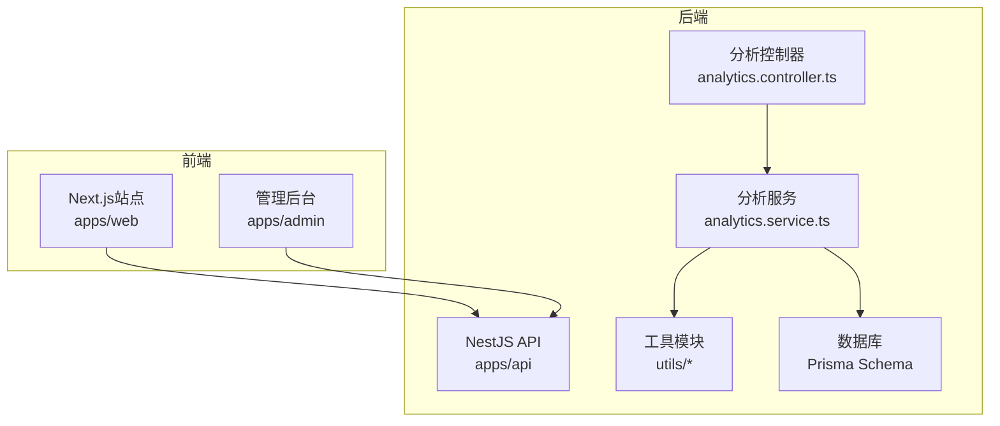
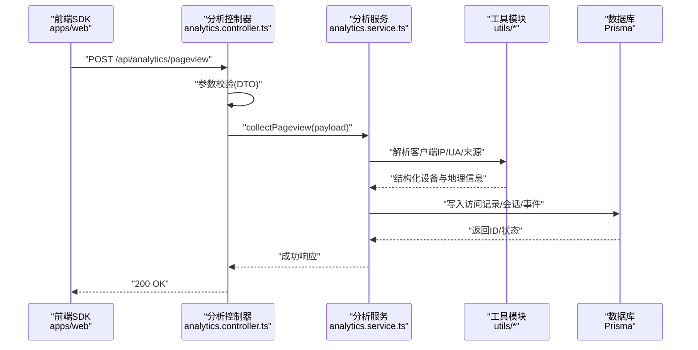
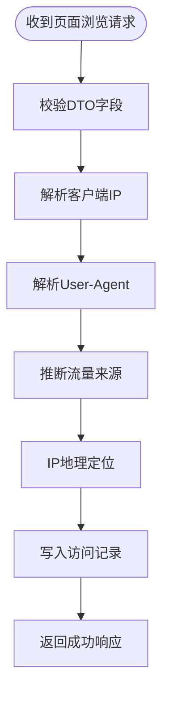
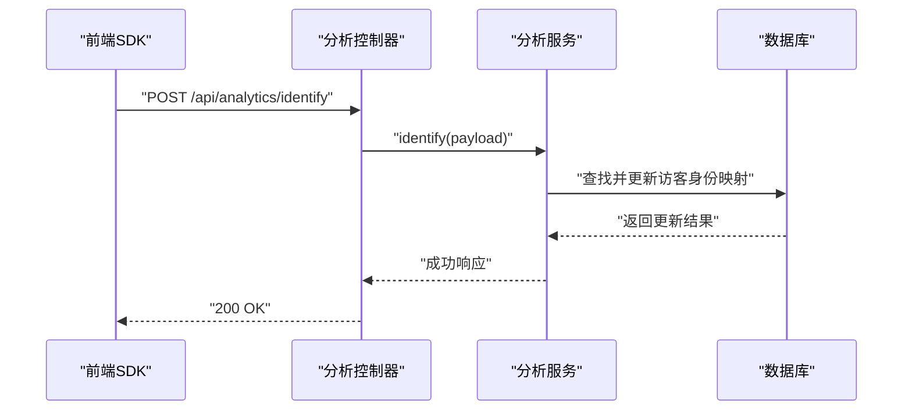
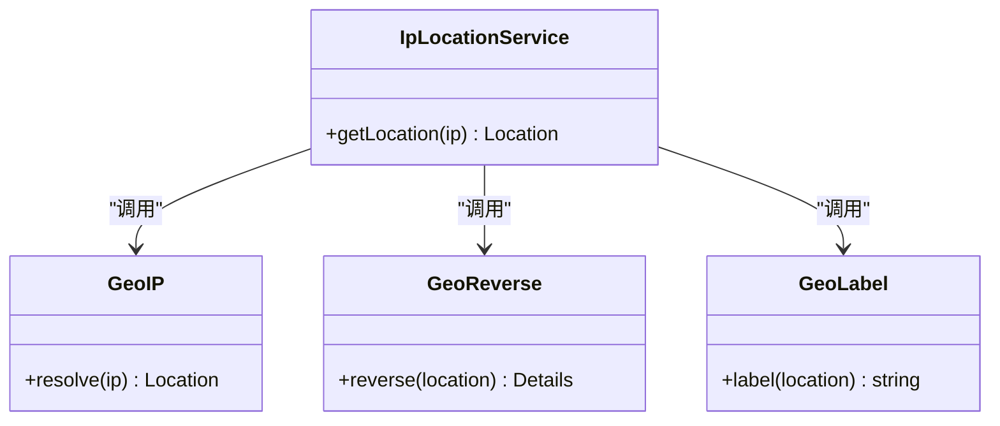
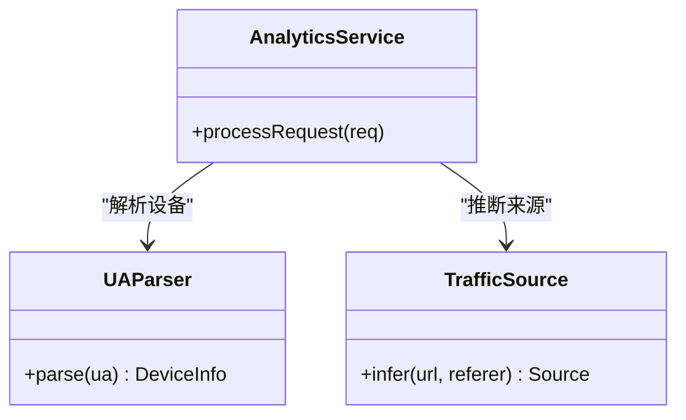
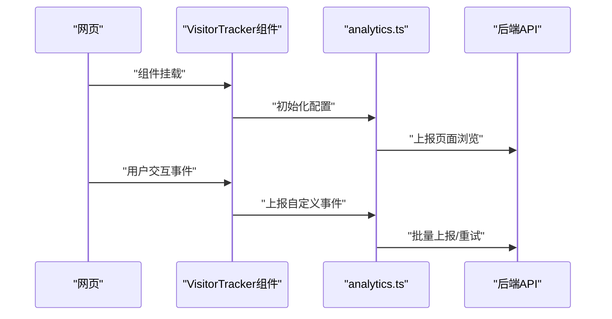
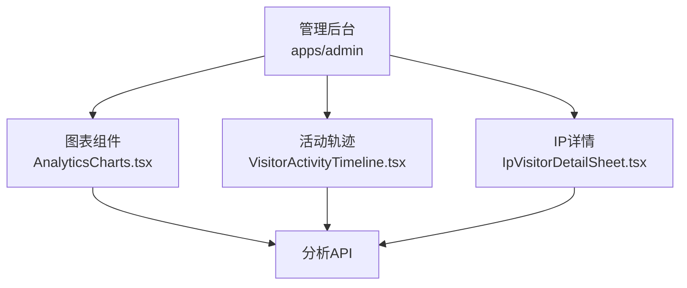
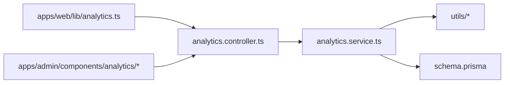

# 访客分析API

<cite>
**本文引用的文件**   
- [analytics.controller.ts](file://apps/api/src/analytics/analytics.controller.ts)
- [analytics.service.ts](file://apps/api/src/analytics/analytics.service.ts)
- [collect-pageview.dto.ts](file://apps/api/src/analytics/dto/collect-pageview.dto.ts)
- [identify.dto.ts](file://apps/api/src/analytics/dto/identify.dto.ts)
- [client-ip.ts](file://apps/api/src/analytics/utils/client-ip.ts)
- [geo-ip.ts](file://apps/api/src/analytics/utils/geo-ip.ts)
- [geo-label.ts](file://apps/api/src/analytics/utils/geo-label.ts)
- [geo-reverse.ts](file://apps/api/src/analytics/utils/geo-reverse.ts)
- [ua-parser.ts](file://apps/api/src/analytics/utils/ua-parser.ts)
- [traffic-source.ts](file://apps/api/src/analytics/utils/traffic-source.ts)
- [ip-location.service.ts](file://apps/api/src/analytics/ip-location.service.ts)
- [schema.prisma](file://apps/api/prisma/schema.prisma)
- [VisitorTracker.tsx](file://apps/web/src/components/analytics/VisitorTracker.tsx)
- [analytics.ts](file://apps/web/src/lib/analytics.ts)
- [analytics-granularity.ts](file://apps/admin/src/lib/analytics-granularity.ts)
- [analytics-geo-hints.ts](file://apps/admin/src/lib/analytics-geo-hints.ts)
- [AnalyticsCharts.tsx](file://apps/admin/src/components/analytics/AnalyticsCharts.tsx)
- [VisitorActivityTimeline.tsx](file://apps/admin/src/components/analytics/VisitorActivityTimeline.tsx)
- [IpVisitorDetailSheet.tsx](file://apps/admin/src/components/analytics/IpVisitorDetailSheet.tsx)
</cite>

## 目录
1. [简介](#简介)
2. [项目结构](#项目结构)
3. [核心组件](#核心组件)
4. [架构总览](#架构总览)
5. [详细组件分析](#详细组件分析)
6. [依赖关系分析](#依赖关系分析)
7. [性能考虑](#性能考虑)
8. [故障排查指南](#故障排查指南)
9. [结论](#结论)
10. [附录](#附录)

## 简介
本文件为“访客分析API”的完整技术文档，覆盖以下能力：
- 页面访问追踪与事件上报（含自定义事件）
- 访客行为分析与会话聚合
- 地理位置识别（IP定位、反向解析、标签化）
- 设备信息收集（UA解析、设备类型、浏览器/操作系统）
- 实时数据分析、流量统计、转化率追踪
- 前端SDK集成指南（Web端）
- 数据隐私保护建议
- 存储结构与查询方法说明

该API由NestJS后端提供，配合Next.js前端SDK采集数据，并通过Prisma持久化到数据库。管理后台提供可视化分析面板与导出能力。

## 项目结构
本项目采用多应用仓库结构，与访客分析相关的关键目录如下：
- apps/api：NestJS后端服务，包含分析控制器、服务、DTO、工具模块与数据库模型
- apps/web：Next.js站点，包含前端SDK与埋点组件
- apps/admin：管理后台，提供分析图表、时间线、按IP维度查看等能力
- apps/api/prisma：数据库Schema与迁移

**图示来源** 
- [analytics.controller.ts](file://apps/api/src/analytics/analytics.controller.ts)
- [analytics.service.ts](file://apps/api/src/analytics/analytics.service.ts)
- [schema.prisma](file://apps/api/prisma/schema.prisma)

**章节来源**
- [analytics.controller.ts](file://apps/api/src/analytics/analytics.controller.ts)
- [analytics.service.ts](file://apps/api/src/analytics/analytics.service.ts)
- [schema.prisma](file://apps/api/prisma/schema.prisma)

## 核心组件
- 分析控制器（Controller）：暴露REST接口，接收页面浏览与识别请求，校验参数并委派给服务层处理
- 分析服务（Service）：实现业务逻辑，包括访客识别、会话关联、地理定位、UA解析、来源归因、数据写入
- DTO：定义输入校验结构（如页面浏览上报、访客识别）
- 工具模块：客户端IP获取、IP地理定位、反向解析、地理标签、UA解析、流量来源推断
- IP位置服务：封装第三方或本地IP库查询
- 前端SDK：在Web端自动采集页面浏览、滚动深度、点击事件、表单交互等，支持自定义事件上报
- 管理后台：基于API提供图表、时间线、按IP/设备/来源等多维分析

**章节来源**
- [analytics.controller.ts](file://apps/api/src/analytics/analytics.controller.ts)
- [analytics.service.ts](file://apps/api/src/analytics/analytics.service.ts)
- [collect-pageview.dto.ts](file://apps/api/src/analytics/dto/collect-pageview.dto.ts)
- [identify.dto.ts](file://apps/api/src/analytics/dto/identify.dto.ts)
- [client-ip.ts](file://apps/api/src/analytics/utils/client-ip.ts)
- [geo-ip.ts](file://apps/api/src/analytics/utils/geo-ip.ts)
- [geo-label.ts](file://apps/api/src/analytics/utils/geo-label.ts)
- [geo-reverse.ts](file://apps/api/src/analytics/utils/geo-reverse.ts)
- [ua-parser.ts](file://apps/api/src/analytics/utils/ua-parser.ts)
- [traffic-source.ts](file://apps/api/src/analytics/utils/traffic-source.ts)
- [ip-location.service.ts](file://apps/api/src/analytics/ip-location.service.ts)
- [VisitorTracker.tsx](file://apps/web/src/components/analytics/VisitorTracker.tsx)
- [analytics.ts](file://apps/web/src/lib/analytics.ts)

## 架构总览
整体流程：前端SDK采集事件并调用后端API；后端控制器校验并路由至服务；服务进行IP定位、UA解析、来源归因，最终写入数据库；管理后台通过查询接口展示分析结果。

**图示来源** 
- [analytics.controller.ts](file://apps/api/src/analytics/analytics.controller.ts)
- [analytics.service.ts](file://apps/api/src/analytics/analytics.service.ts)
- [client-ip.ts](file://apps/api/src/analytics/utils/client-ip.ts)
- [ua-parser.ts](file://apps/api/src/analytics/utils/ua-parser.ts)
- [traffic-source.ts](file://apps/api/src/analytics/utils/traffic-source.ts)
- [schema.prisma](file://apps/api/prisma/schema.prisma)

## 详细组件分析

### 页面访问追踪接口
- 功能：记录页面浏览事件，包含URL、标题、来源、设备、地理位置、时间戳等
- 输入：页面浏览DTO（路径、标题、来源、用户代理、IP等）
- 处理：解析客户端IP、UA、来源；生成或关联访客ID与会话ID；写入访问记录
- 输出：统一成功响应

**图示来源** 
- [collect-pageview.dto.ts](file://apps/api/src/analytics/dto/collect-pageview.dto.ts)
- [client-ip.ts](file://apps/api/src/analytics/utils/client-ip.ts)
- [ua-parser.ts](file://apps/api/src/analytics/utils/ua-parser.ts)
- [traffic-source.ts](file://apps/api/src/analytics/utils/traffic-source.ts)
- [geo-ip.ts](file://apps/api/src/analytics/utils/geo-ip.ts)
- [analytics.service.ts](file://apps/api/src/analytics/analytics.service.ts)

**章节来源**
- [analytics.controller.ts](file://apps/api/src/analytics/analytics.controller.ts)
- [collect-pageview.dto.ts](file://apps/api/src/analytics/dto/collect-pageview.dto.ts)
- [analytics.service.ts](file://apps/api/src/analytics/analytics.service.ts)

### 访客识别接口
- 功能：将匿名访客与已知身份（如邮箱、手机号、CRM ID）关联，用于转化追踪
- 输入：识别DTO（标识符、可选元数据）
- 处理：更新访客身份映射、合并会话、标记转化路径
- 输出：成功响应及关联结果

**图示来源** 
- [identify.dto.ts](file://apps/api/src/analytics/dto/identify.dto.ts)
- [analytics.controller.ts](file://apps/api/src/analytics/analytics.controller.ts)
- [analytics.service.ts](file://apps/api/src/analytics/analytics.service.ts)
- [schema.prisma](file://apps/api/prisma/schema.prisma)

**章节来源**
- [identify.dto.ts](file://apps/api/src/analytics/dto/identify.dto.ts)
- [analytics.controller.ts](file://apps/api/src/analytics/analytics.controller.ts)
- [analytics.service.ts](file://apps/api/src/analytics/analytics.service.ts)

### 地理位置识别与标签化
- 功能：根据IP获取地理位置、时区、语言环境，并进行标签化（国家/地区/城市）
- 工具：IP定位、反向解析、标签生成
- 使用场景：地域流量分布、区域转化率、合规策略

**图示来源** 
- [geo-ip.ts](file://apps/api/src/analytics/utils/geo-ip.ts)
- [geo-reverse.ts](file://apps/api/src/analytics/utils/geo-reverse.ts)
- [geo-label.ts](file://apps/api/src/analytics/utils/geo-label.ts)
- [ip-location.service.ts](file://apps/api/src/analytics/ip-location.service.ts)

**章节来源**
- [geo-ip.ts](file://apps/api/src/analytics/utils/geo-ip.ts)
- [geo-reverse.ts](file://apps/api/src/analytics/utils/geo-reverse.ts)
- [geo-label.ts](file://apps/api/src/analytics/utils/geo-label.ts)
- [ip-location.service.ts](file://apps/api/src/analytics/ip-location.service.ts)

### 设备信息与来源归因
- 功能：解析User-Agent得到设备类型、浏览器、操作系统；推断流量来源（直接、搜索引擎、社交媒体、广告等）
- 工具：UA解析、来源推断
- 使用场景：设备维度分析、渠道ROI评估

**图示来源** 
- [ua-parser.ts](file://apps/api/src/analytics/utils/ua-parser.ts)
- [traffic-source.ts](file://apps/api/src/analytics/utils/traffic-source.ts)
- [analytics.service.ts](file://apps/api/src/analytics/analytics.service.ts)

**章节来源**
- [ua-parser.ts](file://apps/api/src/analytics/utils/ua-parser.ts)
- [traffic-source.ts](file://apps/api/src/analytics/utils/traffic-source.ts)
- [analytics.service.ts](file://apps/api/src/analytics/analytics.service.ts)

### 前端SDK集成指南（Web端）
- 自动采集：页面浏览、滚动深度、点击、表单提交
- 自定义事件：支持上报业务事件（如下载、咨询、购买意向）
- 配置项：站点ID、上报间隔、隐私开关、去重策略
- 集成步骤：引入SDK脚本、初始化配置、在关键页面触发事件

**图示来源** 
- [VisitorTracker.tsx](file://apps/web/src/components/analytics/VisitorTracker.tsx)
- [analytics.ts](file://apps/web/src/lib/analytics.ts)
- [analytics.controller.ts](file://apps/api/src/analytics/analytics.controller.ts)

**章节来源**
- [VisitorTracker.tsx](file://apps/web/src/components/analytics/VisitorTracker.tsx)
- [analytics.ts](file://apps/web/src/lib/analytics.ts)

### 管理后台分析面板
- 功能：实时流量、趋势图、设备分布、来源占比、转化率漏斗、活动轨迹时间线
- 维度：按IP、设备、来源、时间粒度筛选
- 导出：支持CSV/JSON导出

**图示来源** 
- [AnalyticsCharts.tsx](file://apps/admin/src/components/analytics/AnalyticsCharts.tsx)
- [VisitorActivityTimeline.tsx](file://apps/admin/src/components/analytics/VisitorActivityTimeline.tsx)
- [IpVisitorDetailSheet.tsx](file://apps/admin/src/components/analytics/IpVisitorDetailSheet.tsx)
- [analytics.controller.ts](file://apps/api/src/analytics/analytics.controller.ts)

**章节来源**
- [AnalyticsCharts.tsx](file://apps/admin/src/components/analytics/AnalyticsCharts.tsx)
- [VisitorActivityTimeline.tsx](file://apps/admin/src/components/analytics/VisitorActivityTimeline.tsx)
- [IpVisitorDetailSheet.tsx](file://apps/admin/src/components/analytics/IpVisitorDetailSheet.tsx)

## 依赖关系分析
- 控制器依赖服务与DTO
- 服务依赖工具模块与数据库
- 前端SDK依赖后端API
- 管理后台依赖分析API与图表组件

**图示来源** 
- [analytics.controller.ts](file://apps/api/src/analytics/analytics.controller.ts)
- [analytics.service.ts](file://apps/api/src/analytics/analytics.service.ts)
- [schema.prisma](file://apps/api/prisma/schema.prisma)
- [analytics.ts](file://apps/web/src/lib/analytics.ts)
- [AnalyticsCharts.tsx](file://apps/admin/src/components/analytics/AnalyticsCharts.tsx)

**章节来源**
- [analytics.controller.ts](file://apps/api/src/analytics/analytics.controller.ts)
- [analytics.service.ts](file://apps/api/src/analytics/analytics.service.ts)
- [schema.prisma](file://apps/api/prisma/schema.prisma)
- [analytics.ts](file://apps/web/src/lib/analytics.ts)

## 性能考虑
- 批量上报：前端SDK支持事件批量发送，降低网络开销
- 去重策略：基于URL+时间窗口去重，避免重复计数
- 异步写入：后端服务采用异步持久化，减少请求延迟
- 缓存优化：对热点IP地理查询进行缓存（可结合Redis）
- 压缩传输：启用Gzip/Brotli压缩，减小Payload体积
- 采样策略：高并发场景下可对非关键事件进行采样上报

[本节为通用指导，不直接分析具体文件]

## 故障排查指南
- 常见问题
  - 上报失败：检查网络连通性、CORS配置、API路径
  - 数据缺失：确认SDK初始化、事件触发时机、去重策略
  - 定位不准：检查IP库更新、代理/CDN透传X-Forwarded-For
  - 性能问题：排查批量上报频率、数据库写入瓶颈
- 调试建议
  - 开启SDK调试日志
  - 使用浏览器开发者工具监控Network
  - 后端启用请求ID中间件追踪链路
  - 定期校验IP库与UA解析库版本

**章节来源**
- [client-ip.ts](file://apps/api/src/analytics/utils/client-ip.ts)
- [ua-parser.ts](file://apps/api/src/analytics/utils/ua-parser.ts)
- [geo-ip.ts](file://apps/api/src/analytics/utils/geo-ip.ts)

## 结论
访客分析API提供了完整的页面追踪、行为分析、地理识别与设备信息采集能力，结合前端SDK与管理后台，形成端到端的分析闭环。通过合理的性能优化与隐私保护措施，可在保障用户体验的同时获得高质量的数据洞察。

[本节为总结性内容，不直接分析具体文件]

## 附录

### 数据隐私保护建议
- 最小化采集：仅采集必要字段，避免敏感个人信息
- 匿名化处理：对IP进行哈希或脱敏存储
- 用户同意：提供隐私政策与同意开关
- 数据保留：设定合理的数据保留周期与清理策略
- 合规审计：定期审查数据采集与使用合规性

[本节为通用指导，不直接分析具体文件]

### 存储结构与查询方法
- 存储结构：基于Prisma定义的实体（访客、会话、页面浏览、事件、地理位置等）
- 查询方法：按时间范围、来源、设备、地理位置、访客ID等多维度过滤与聚合
- 指标计算：UV/PV、跳出率、平均停留时长、转化率、渠道贡献度

**章节来源**
- [schema.prisma](file://apps/api/prisma/schema.prisma)

### 实时数据分析与流量统计
- 实时流：可通过WebSocket或轮询接口获取最新访问数据
- 流量统计：按小时/天/周聚合PV、UV、来源分布
- 转化率追踪：从页面浏览到目标事件（如表单提交、购买）的漏斗分析

**章节来源**
- [analytics.controller.ts](file://apps/api/src/analytics/analytics.controller.ts)
- [analytics.service.ts](file://apps/api/src/analytics/analytics.service.ts)

### 自定义事件上报
- 事件类型：业务自定义事件（下载、咨询、收藏等）
- 字段规范：事件名、属性键值对、时间戳、访客ID
- 上报策略：批量、重试、失败回退

**章节来源**
- [analytics.ts](file://apps/web/src/lib/analytics.ts)
- [analytics.controller.ts](file://apps/api/src/analytics/analytics.controller.ts)

### 管理后台分析维度
- 时间粒度：分钟/小时/天/周/月
- 地理维度：国家/地区/城市
- 设备维度：移动端/桌面端、浏览器、操作系统
- 来源维度：直接、搜索引擎、社交媒体、广告

**章节来源**
- [analytics-granularity.ts](file://apps/admin/src/lib/analytics-granularity.ts)
- [analytics-geo-hints.ts](file://apps/admin/src/lib/analytics-geo-hints.ts)
- [AnalyticsCharts.tsx](file://apps/admin/src/components/analytics/AnalyticsCharts.tsx)