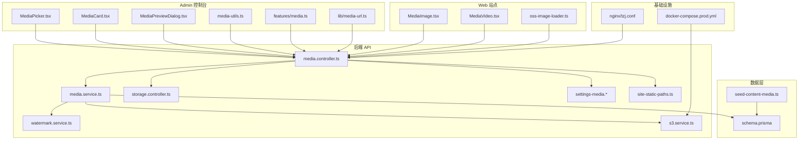
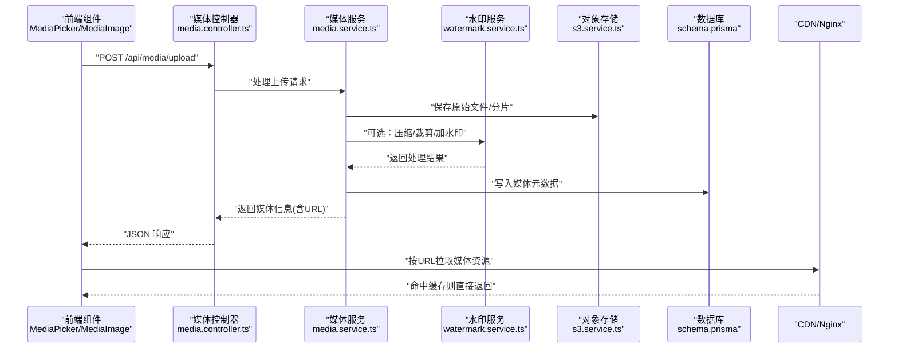
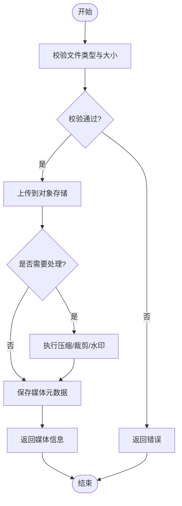
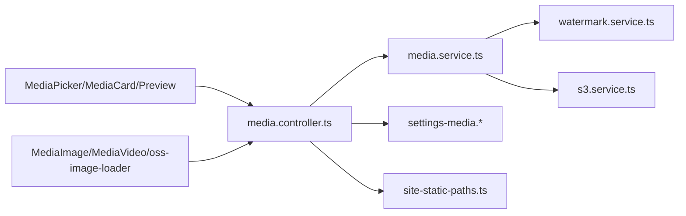

# 内容媒体管理

<cite>
**本文引用的文件**   
- [media.controller.ts](file://apps/api/src/media/media.controller.ts)
- [media.service.ts](file://apps/api/src/media/media.service.ts)
- [watermark.service.ts](file://apps/api/src/media/watermark.service.ts)
- [s3.service.ts](file://apps/api/src/storage/s3.service.ts)
- [storage.controller.ts](file://apps/api/src/storage/storage.controller.ts)
- [settings-media.defaults.ts](file://apps/api/src/settings/settings-media.defaults.ts)
- [settings-media.schema.ts](file://apps/api/src/settings/settings-media.schema.ts)
- [site-static-paths.ts](file://apps/api/src/media/site-static-paths.ts)
- [MediaPicker.tsx](file://apps/admin/src/components/crud/MediaPicker.tsx)
- [MediaCard.tsx](file://apps/admin/src/components/media/MediaCard.tsx)
- [MediaPreviewDialog.tsx](file://apps/admin/src/components/media/MediaPreviewDialog.tsx)
- [media-utils.ts](file://apps/admin/src/components/media/media-utils.ts)
- [media.ts](file://apps/admin/src/features/media.ts)
- [site-media.ts](file://apps/admin/src/features/site-media.ts)
- [media-url.ts](file://apps/admin/src/lib/media-url.ts)
- [oss-image-loader.ts](file://apps/web/src/lib/oss-image-loader.ts)
- [MediaImage.tsx](file://apps/web/src/components/MediaImage.tsx)
- [MediaVideo.tsx](file://apps/web/src/components/MediaVideo.tsx)
- [schema.prisma](file://apps/api/prisma/schema.prisma)
- [seed-content-media.ts](file://apps/api/prisma/seed-content-media.ts)
- [docker-compose.prod.yml](file://infra/docker/docker-compose.prod.yml)
- [nginx/tzj.conf](file://infra/docker/nginx/tzj.conf)
</cite>

## 目录
1. [简介](#简介)
2. [项目结构](#项目结构)
3. [核心组件](#核心组件)
4. [架构总览](#架构总览)
5. [详细组件分析](#详细组件分析)
6. [依赖关系分析](#依赖关系分析)
7. [性能考虑](#性能考虑)
8. [故障排查指南](#故障排查指南)
9. [结论](#结论)
10. [附录](#附录)

## 简介
本文件系统性地梳理内容媒体管理子系统，覆盖图片上传、压缩、裁剪、水印处理、存储策略（本地与对象存储）、CDN 集成、缓存管理与性能优化；同时说明媒体库组织、分类标签、搜索过滤与批量操作；并给出媒体预览、格式转换、安全校验与病毒扫描的扩展建议。文档包含数据模型、API 接口、前端组件集成示例，帮助构建高效的媒体资源管理系统。

## 项目结构
媒体相关能力横跨后端 NestJS 模块、Prisma 数据模型、Admin 控制台与 Web 站点：
- 后端 API：媒体控制器与服务、水印服务、对象存储服务、设置项（默认值与校验模式）
- 数据库：Prisma schema 定义媒体实体与关联
- Admin 控制台：媒体选择器、卡片展示、预览对话框、工具函数与特性层
- Web 站点：OSS 图片加载器、通用媒体组件
- 基础设施：Docker Compose、Nginx 配置用于 CDN/代理与静态路径

图表来源 
- [media.controller.ts](file://apps/api/src/media/media.controller.ts)
- [media.service.ts](file://apps/api/src/media/media.service.ts)
- [watermark.service.ts](file://apps/api/src/media/watermark.service.ts)
- [s3.service.ts](file://apps/api/src/storage/s3.service.ts)
- [storage.controller.ts](file://apps/api/src/storage/storage.controller.ts)
- [settings-media.defaults.ts](file://apps/api/src/settings/settings-media.defaults.ts)
- [settings-media.schema.ts](file://apps/api/src/settings/settings-media.schema.ts)
- [site-static-paths.ts](file://apps/api/src/media/site-static-paths.ts)
- [MediaPicker.tsx](file://apps/admin/src/components/crud/MediaPicker.tsx)
- [MediaCard.tsx](file://apps/admin/src/components/media/MediaCard.tsx)
- [MediaPreviewDialog.tsx](file://apps/admin/src/components/media/MediaPreviewDialog.tsx)
- [media-utils.ts](file://apps/admin/src/components/media/media-utils.ts)
- [media.ts](file://apps/admin/src/features/media.ts)
- [media-url.ts](file://apps/admin/src/lib/media-url.ts)
- [oss-image-loader.ts](file://apps/web/src/lib/oss-image-loader.ts)
- [MediaImage.tsx](file://apps/web/src/components/MediaImage.tsx)
- [MediaVideo.tsx](file://apps/web/src/components/MediaVideo.tsx)
- [schema.prisma](file://apps/api/prisma/schema.prisma)
- [seed-content-media.ts](file://apps/api/prisma/seed-content-media.ts)
- [docker-compose.prod.yml](file://infra/docker/docker-compose.prod.yml)
- [nginx/tzj.conf](file://infra/docker/nginx/tzj.conf)

章节来源
- [media.controller.ts](file://apps/api/src/media/media.controller.ts)
- [media.service.ts](file://apps/api/src/media/media.service.ts)
- [watermark.service.ts](file://apps/api/src/media/watermark.service.ts)
- [s3.service.ts](file://apps/api/src/storage/s3.service.ts)
- [storage.controller.ts](file://apps/api/src/storage/storage.controller.ts)
- [settings-media.defaults.ts](file://apps/api/src/settings/settings-media.defaults.ts)
- [settings-media.schema.ts](file://apps/api/src/settings/settings-media.schema.ts)
- [site-static-paths.ts](file://apps/api/src/media/site-static-paths.ts)
- [MediaPicker.tsx](file://apps/admin/src/components/crud/MediaPicker.tsx)
- [MediaCard.tsx](file://apps/admin/src/components/media/MediaCard.tsx)
- [MediaPreviewDialog.tsx](file://apps/admin/src/components/media/MediaPreviewDialog.tsx)
- [media-utils.ts](file://apps/admin/src/components/media/media-utils.ts)
- [media.ts](file://apps/admin/src/features/media.ts)
- [media-url.ts](file://apps/admin/src/lib/media-url.ts)
- [oss-image-loader.ts](file://apps/web/src/lib/oss-image-loader.ts)
- [MediaImage.tsx](file://apps/web/src/components/MediaImage.tsx)
- [MediaVideo.tsx](file://apps/web/src/components/MediaVideo.tsx)
- [schema.prisma](file://apps/api/prisma/schema.prisma)
- [seed-content-media.ts](file://apps/api/prisma/seed-content-media.ts)
- [docker-compose.prod.yml](file://infra/docker/docker-compose.prod.yml)
- [nginx/tzj.conf](file://infra/docker/nginx/tzj.conf)

## 核心组件
- 媒体控制器与服务：提供上传、列表、查询、删除等 REST 接口；封装媒体元数据、URL 生成、分页与筛选
- 水印服务：对图片进行文字或图像水印合成，支持位置、透明度、尺寸等参数
- 对象存储服务：对接 S3/OSS，实现分片上传、直传签名、回调与下载
- 存储控制器：统一存储能力入口，便于多后端切换
- 设置项：媒体默认配置（压缩、裁剪、水印开关、存储后端、CDN 域名等）与校验模式
- 静态路径映射：将媒体访问路径映射到 CDN 或代理规则
- 前端组件：Admin 媒体选择器、卡片、预览对话框；Web 媒体图片/视频组件与 OSS 图片加载器
- 数据模型：媒体实体字段、关联关系与索引设计

章节来源
- [media.controller.ts](file://apps/api/src/media/media.controller.ts)
- [media.service.ts](file://apps/api/src/media/media.service.ts)
- [watermark.service.ts](file://apps/api/src/media/watermark.service.ts)
- [s3.service.ts](file://apps/api/src/storage/s3.service.ts)
- [storage.controller.ts](file://apps/api/src/storage/storage.controller.ts)
- [settings-media.defaults.ts](file://apps/api/src/settings/settings-media.defaults.ts)
- [settings-media.schema.ts](file://apps/api/src/settings/settings-media.schema.ts)
- [site-static-paths.ts](file://apps/api/src/media/site-static-paths.ts)
- [MediaPicker.tsx](file://apps/admin/src/components/crud/MediaPicker.tsx)
- [MediaCard.tsx](file://apps/admin/src/components/media/MediaCard.tsx)
- [MediaPreviewDialog.tsx](file://apps/admin/src/components/media/MediaPreviewDialog.tsx)
- [media-utils.ts](file://apps/admin/src/components/media/media-utils.ts)
- [media.ts](file://apps/admin/src/features/media.ts)
- [media-url.ts](file://apps/admin/src/lib/media-url.ts)
- [oss-image-loader.ts](file://apps/web/src/lib/oss-image-loader.ts)
- [MediaImage.tsx](file://apps/web/src/components/MediaImage.tsx)
- [MediaVideo.tsx](file://apps/web/src/components/MediaVideo.tsx)
- [schema.prisma](file://apps/api/prisma/schema.prisma)

## 架构总览
媒体系统采用“前端组件 + 后端服务 + 对象存储 + CDN”的分层架构：
- 前端通过 MediaPicker/MediaImage/MediaVideo 调用媒体 API，获取 URL 与缩略图
- 后端媒体服务负责上传流程、元数据持久化、可选的图片处理（压缩/裁剪/水印）
- 对象存储服务承载原始与处理后文件，支持分片与签名直传
- Nginx/CDN 加速静态资源访问，结合缓存头提升性能

图表来源 
- [media.controller.ts](file://apps/api/src/media/media.controller.ts)
- [media.service.ts](file://apps/api/src/media/media.service.ts)
- [watermark.service.ts](file://apps/api/src/media/watermark.service.ts)
- [s3.service.ts](file://apps/api/src/storage/s3.service.ts)
- [schema.prisma](file://apps/api/prisma/schema.prisma)
- [nginx/tzj.conf](file://infra/docker/nginx/tzj.conf)

## 详细组件分析

### 媒体控制器与服务
职责：
- 接收上传、列表、查询、删除等请求
- 调用媒体服务完成业务逻辑
- 返回统一的 JSON 结构与错误码

关键点：
- 上传接口支持分块与断点续传（由对象存储服务配合）
- 列表接口支持分页、排序、筛选（类型、标签、时间范围等）
- 删除接口需校验权限与引用关系

章节来源
- [media.controller.ts](file://apps/api/src/media/media.controller.ts)
- [media.service.ts](file://apps/api/src/media/media.service.ts)

### 水印服务
职责：
- 为图片添加文字或图像水印
- 支持位置、透明度、缩放、重复平铺等参数

关键点：
- 可配置是否启用水印（受设置项控制）
- 与媒体服务协作，在上传后或按需生成带水印版本

章节来源
- [watermark.service.ts](file://apps/api/src/media/watermark.service.ts)

### 对象存储服务
职责：
- 对接 S3/OSS，实现上传、下载、删除、签名直传
- 支持分片上传、并发、重试与失败回滚

关键点：
- 根据环境配置选择不同后端（MinIO、阿里云 OSS 等）
- 与 Nginx/CDN 配合，提供稳定的访问域名与缓存策略

章节来源
- [s3.service.ts](file://apps/api/src/storage/s3.service.ts)
- [storage.controller.ts](file://apps/api/src/storage/storage.controller.ts)

### 设置项（默认值与校验模式）
职责：
- 定义媒体默认配置：压缩质量、裁剪比例、水印开关、存储后端、CDN 域名、缓存时长等
- 提供校验模式确保配置合法性

关键点：
- 可通过后台设置动态调整行为
- 与媒体服务联动，影响上传与处理流程

章节来源
- [settings-media.defaults.ts](file://apps/api/src/settings/settings-media.defaults.ts)
- [settings-media.schema.ts](file://apps/api/src/settings/settings-media.schema.ts)

### 静态路径映射
职责：
- 将媒体访问路径映射到 CDN 或代理规则
- 支持多域名与路径前缀

关键点：
- 与 Nginx 配置协同，实现缓存与防盗链
- 便于灰度切换与回滚

章节来源
- [site-static-paths.ts](file://apps/api/src/media/site-static-paths.ts)

### 前端组件（Admin 控制台）
- MediaPicker：媒体选择器，支持多选、搜索、分页、预览
- MediaCard：媒体卡片展示，显示缩略图、名称、大小、类型
- MediaPreviewDialog：大图预览，支持旋转、缩放、下载
- media-utils：工具函数（格式判断、尺寸计算、URL 拼接）
- features/media：媒体特性层（API 调用封装、状态管理）
- lib/media-url：媒体 URL 生成与解析

章节来源
- [MediaPicker.tsx](file://apps/admin/src/components/crud/MediaPicker.tsx)
- [MediaCard.tsx](file://apps/admin/src/components/media/MediaCard.tsx)
- [MediaPreviewDialog.tsx](file://apps/admin/src/components/media/MediaPreviewDialog.tsx)
- [media-utils.ts](file://apps/admin/src/components/media/media-utils.ts)
- [media.ts](file://apps/admin/src/features/media.ts)
- [media-url.ts](file://apps/admin/src/lib/media-url.ts)

### 前端组件（Web 站点）
- MediaImage：通用图片组件，支持懒加载、占位图、自适应尺寸
- MediaVideo：通用视频组件，支持流式播放、预加载
- oss-image-loader：OSS 图片处理器，支持缩放、裁剪、格式转换、质量优化

章节来源
- [MediaImage.tsx](file://apps/web/src/components/MediaImage.tsx)
- [MediaVideo.tsx](file://apps/web/src/components/MediaVideo.tsx)
- [oss-image-loader.ts](file://apps/web/src/lib/oss-image-loader.ts)

### 数据模型（Prisma）
- 媒体实体：包含文件名、路径、URL、类型、大小、宽高、MIME、哈希、创建/更新时间等
- 关联关系：与内容（文章、案例、新闻等）的多对一或多对多关系
- 索引设计：针对常用查询字段建立索引以提升检索性能

章节来源
- [schema.prisma](file://apps/api/prisma/schema.prisma)
- [seed-content-media.ts](file://apps/api/prisma/seed-content-media.ts)

### 上传与处理流程图

图表来源 
- [media.controller.ts](file://apps/api/src/media/media.controller.ts)
- [media.service.ts](file://apps/api/src/media/media.service.ts)
- [watermark.service.ts](file://apps/api/src/media/watermark.service.ts)
- [s3.service.ts](file://apps/api/src/storage/s3.service.ts)

## 依赖关系分析
- 控制器依赖服务：媒体控制器依赖媒体服务，媒体服务依赖水印服务与对象存储服务
- 设置项驱动行为：媒体默认配置与校验模式影响上传与处理流程
- 前端依赖 API：Admin 与 Web 组件通过媒体 API 获取数据与资源
- 基础设施依赖：Nginx/CDN 与对象存储共同保障静态资源的高效访问

图表来源 
- [media.controller.ts](file://apps/api/src/media/media.controller.ts)
- [media.service.ts](file://apps/api/src/media/media.service.ts)
- [watermark.service.ts](file://apps/api/src/media/watermark.service.ts)
- [s3.service.ts](file://apps/api/src/storage/s3.service.ts)
- [settings-media.defaults.ts](file://apps/api/src/settings/settings-media.defaults.ts)
- [settings-media.schema.ts](file://apps/api/src/settings/settings-media.schema.ts)
- [site-static-paths.ts](file://apps/api/src/media/site-static-paths.ts)
- [MediaPicker.tsx](file://apps/admin/src/components/crud/MediaPicker.tsx)
- [MediaCard.tsx](file://apps/admin/src/components/media/MediaCard.tsx)
- [MediaPreviewDialog.tsx](file://apps/admin/src/components/media/MediaPreviewDialog.tsx)
- [MediaImage.tsx](file://apps/web/src/components/MediaImage.tsx)
- [MediaVideo.tsx](file://apps/web/src/components/MediaVideo.tsx)
- [oss-image-loader.ts](file://apps/web/src/lib/oss-image-loader.ts)

章节来源
- [media.controller.ts](file://apps/api/src/media/media.controller.ts)
- [media.service.ts](file://apps/api/src/media/media.service.ts)
- [watermark.service.ts](file://apps/api/src/media/watermark.service.ts)
- [s3.service.ts](file://apps/api/src/storage/s3.service.ts)
- [settings-media.defaults.ts](file://apps/api/src/settings/settings-media.defaults.ts)
- [settings-media.schema.ts](file://apps/api/src/settings/settings-media.schema.ts)
- [site-static-paths.ts](file://apps/api/src/media/site-static-paths.ts)
- [MediaPicker.tsx](file://apps/admin/src/components/crud/MediaPicker.tsx)
- [MediaCard.tsx](file://apps/admin/src/components/media/MediaCard.tsx)
- [MediaPreviewDialog.tsx](file://apps/admin/src/components/media/MediaPreviewDialog.tsx)
- [MediaImage.tsx](file://apps/web/src/components/MediaImage.tsx)
- [MediaVideo.tsx](file://apps/web/src/components/MediaVideo.tsx)
- [oss-image-loader.ts](file://apps/web/src/lib/oss-image-loader.ts)

## 性能考虑
- 对象存储直传与分片上传：减少后端带宽压力，提升大文件上传稳定性
- 图片处理流水线：按需压缩、裁剪、水印，避免不必要的处理开销
- CDN 缓存策略：合理设置缓存头与 TTL，利用浏览器与边缘缓存
- 数据库索引：针对高频查询字段建立索引，降低查询延迟
- 前端懒加载与占位图：减少首屏资源体积，提升渲染速度
- 并发与重试：上传与下载过程增加重试机制，提高鲁棒性

[本节为通用指导，不直接分析具体文件]

## 故障排查指南
常见问题与定位思路：
- 上传失败：检查对象存储连接、权限、分片配置与网络超时
- 水印异常：确认水印素材路径、字体、透明度与目标图片尺寸匹配
- 访问 404：核对静态路径映射、CDN 域名与缓存刷新
- 列表慢：检查数据库索引、分页参数与筛选条件复杂度
- 前端无法预览：确认媒体 URL 生成规则与跨域策略

章节来源
- [s3.service.ts](file://apps/api/src/storage/s3.service.ts)
- [watermark.service.ts](file://apps/api/src/media/watermark.service.ts)
- [site-static-paths.ts](file://apps/api/src/media/site-static-paths.ts)
- [media.controller.ts](file://apps/api/src/media/media.controller.ts)
- [media.service.ts](file://apps/api/src/media/media.service.ts)

## 结论
本媒体管理系统以清晰的分层架构与模块化设计，实现了从上传、处理到分发与展示的完整闭环。通过对象存储与 CDN 的协同、灵活的设置项与前端组件的解耦，能够满足高并发、高性能与可扩展的媒体资源管理需求。建议在后续迭代中完善安全校验与病毒扫描、增强批量操作与审计日志，并持续优化图片处理流水线与缓存策略。

[本节为总结性内容，不直接分析具体文件]

## 附录

### 媒体数据模型概览
- 媒体实体字段：标识、文件名、路径、URL、类型、大小、宽高、MIME、哈希、创建/更新时间
- 关联关系：与内容实体的关联（如文章、案例、新闻等），支持一对多或多对多
- 索引与约束：针对常用查询字段建立索引，保证唯一性与完整性

章节来源
- [schema.prisma](file://apps/api/prisma/schema.prisma)
- [seed-content-media.ts](file://apps/api/prisma/seed-content-media.ts)

### API 接口概览
- 上传接口：支持单文件与分片上传，返回媒体信息与 URL
- 列表接口：分页、排序、筛选（类型、标签、时间范围等）
- 详情接口：根据 ID 获取媒体元数据与访问 URL
- 删除接口：校验权限与引用关系后删除文件与元数据

章节来源
- [media.controller.ts](file://apps/api/src/media/media.controller.ts)
- [media.service.ts](file://apps/api/src/media/media.service.ts)

### 前端组件集成示例
- Admin 媒体选择器：集成 MediaPicker，支持多选、搜索、分页与预览
- Web 媒体组件：使用 MediaImage/MediaVideo，结合 oss-image-loader 实现动态处理
- URL 生成：通过 media-url 工具统一生成媒体访问地址，适配 CDN 与代理

章节来源
- [MediaPicker.tsx](file://apps/admin/src/components/crud/MediaPicker.tsx)
- [MediaImage.tsx](file://apps/web/src/components/MediaImage.tsx)
- [MediaVideo.tsx](file://apps/web/src/components/MediaVideo.tsx)
- [oss-image-loader.ts](file://apps/web/src/lib/oss-image-loader.ts)
- [media-url.ts](file://apps/admin/src/lib/media-url.ts)

### 基础设施与部署
- Docker Compose：编排对象存储、数据库、Redis 等服务
- Nginx：配置静态路径映射、缓存与防盗链

章节来源
- [docker-compose.prod.yml](file://infra/docker/docker-compose.prod.yml)
- [nginx/tzj.conf](file://infra/docker/nginx/tzj.conf)