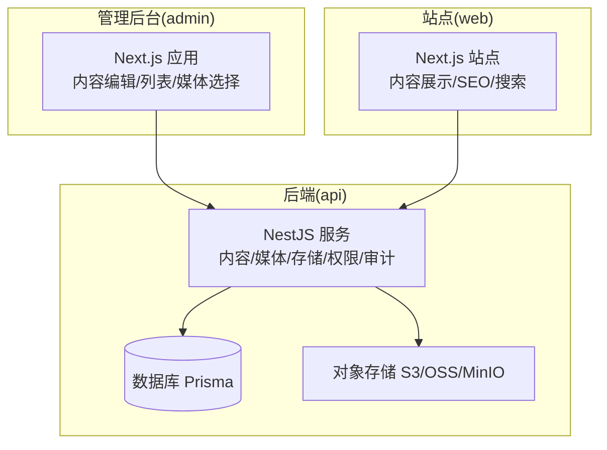
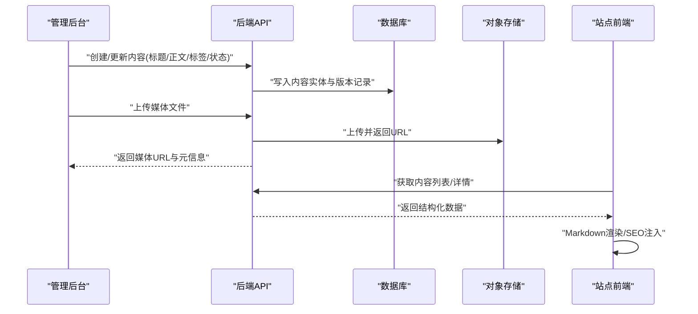
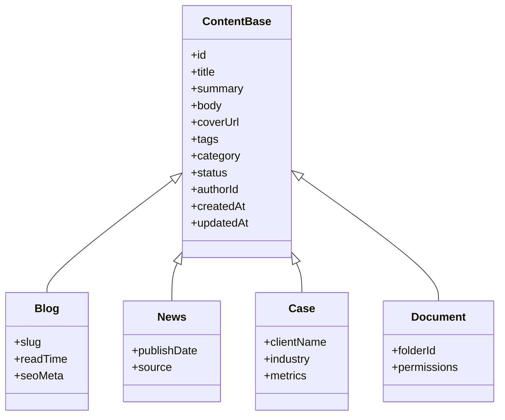
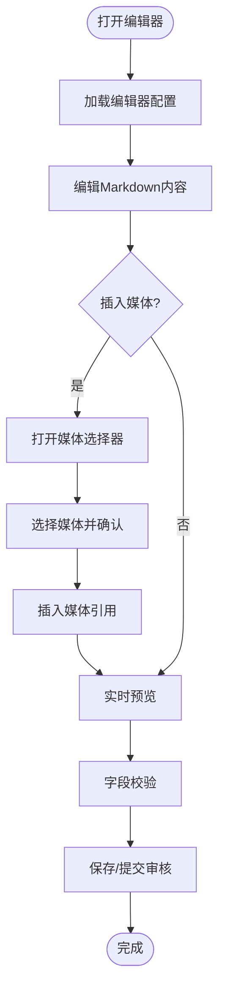
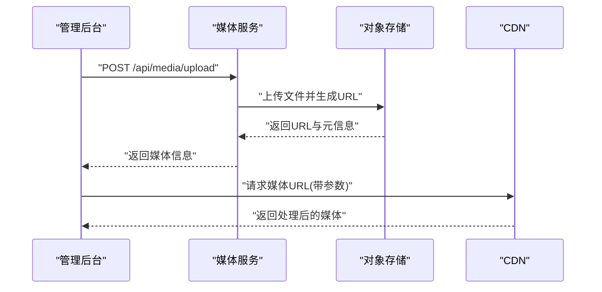
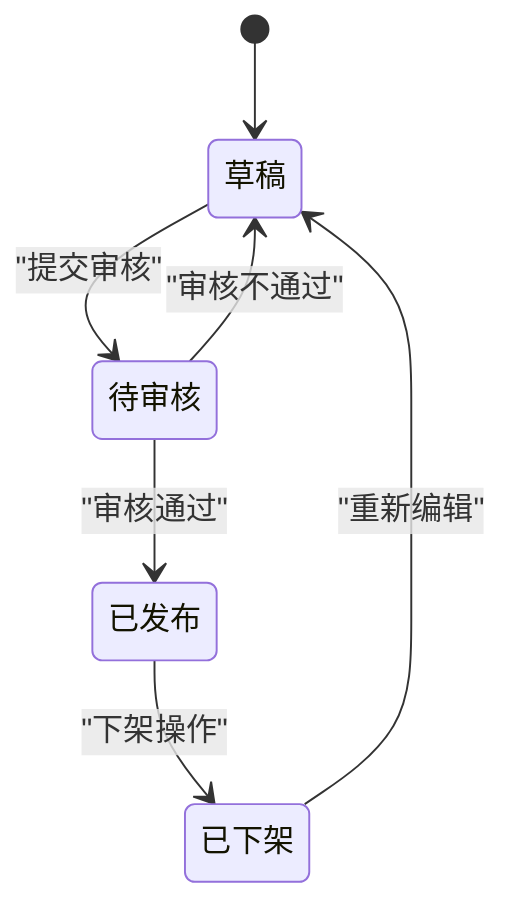
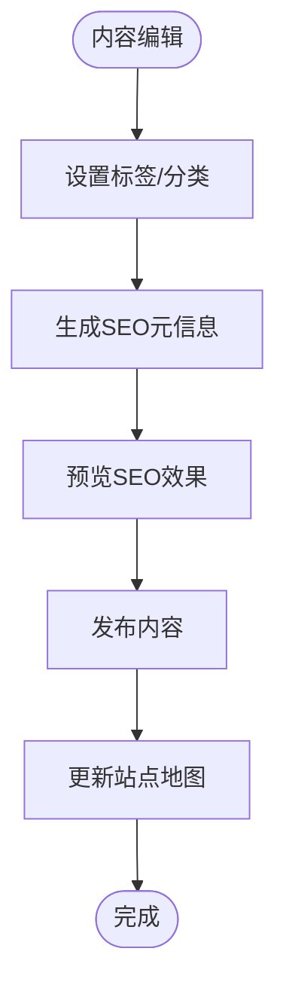
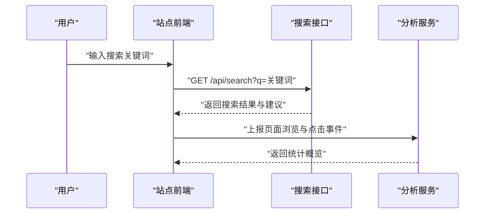
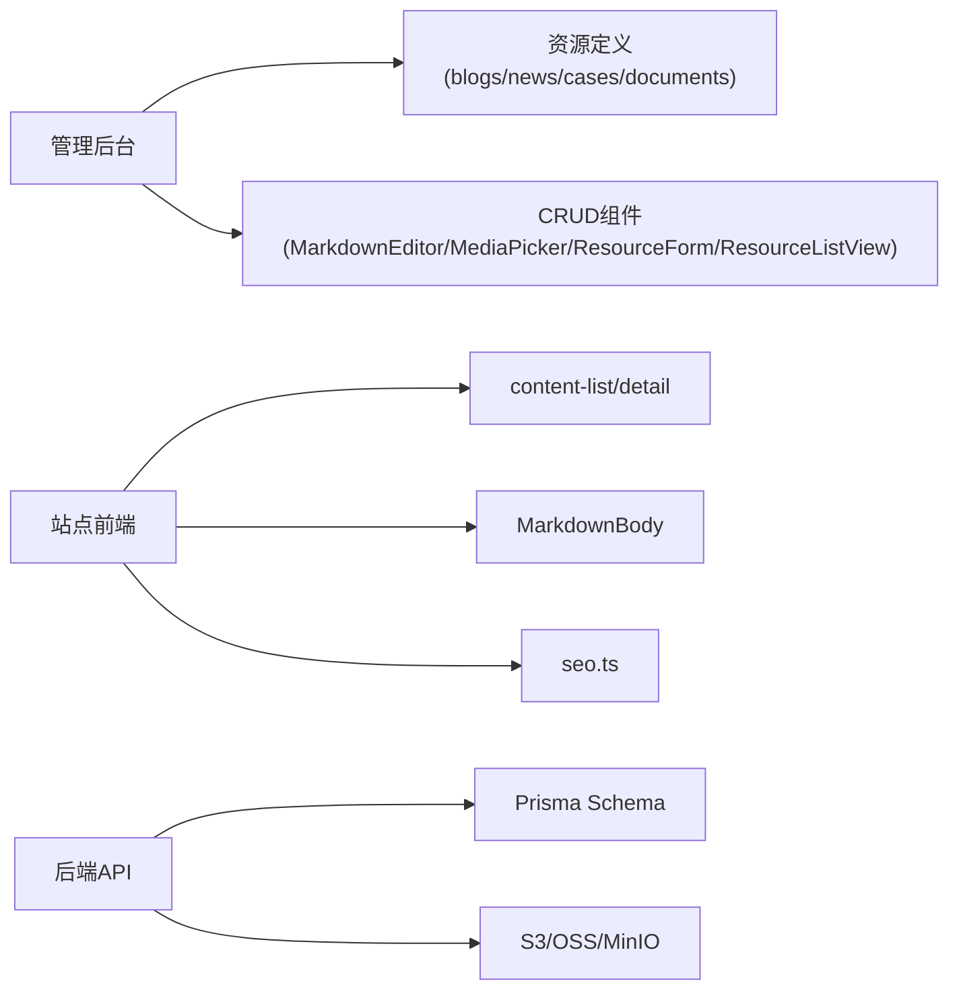

# 内容管理系统

<cite>
**本文档引用的文件**   
- [README.md](file://README.md)
- [package.json](file://package.json)
- [apps/admin/src/app/(dashboard)/blog/page.tsx](file://apps/admin/src/app/(dashboard)/blog/page.tsx)
- [apps/admin/src/app/(dashboard)/news/page.tsx](file://apps/admin/src/app/(dashboard)/news/page.tsx)
- [apps/admin/src/app/(dashboard)/cases/page.tsx](file://apps/admin/src/app/(dashboard)/cases/page.tsx)
- [apps/admin/src/app/(dashboard)/documents/page.tsx](file://apps/admin/src/app/(dashboard)/documents/page.tsx)
- [apps/admin/src/components/crud/MarkdownEditor.tsx](file://apps/admin/src/components/crud/MarkdownEditor.tsx)
- [apps/admin/src/components/crud/MediaPicker.tsx](file://apps/admin/src/components/crud/MediaPicker.tsx)
- [apps/admin/src/components/crud/ResourceForm.tsx](file://apps/admin/src/components/crud/ResourceForm.tsx)
- [apps/admin/src/components/crud/ResourceListView.tsx](file://apps/admin/src/components/crud/ResourceListView.tsx)
- [apps/admin/src/features/resources/blog.tsx](file://apps/admin/src/features/resources/blog.tsx)
- [apps/admin/src/features/resources/news.tsx](file://apps/admin/src/features/resources/news.tsx)
- [apps/admin/src/features/resources/cases.tsx](file://apps/admin/src/features/resources/cases.tsx)
- [apps/admin/src/features/resources/documents.tsx](file://apps/admin/src/features/resources/documents.tsx)
- [apps/api/src/blogs/blogs.controller.ts](file://apps/api/src/blogs/blogs.controller.ts)
- [apps/api/src/blogs/blogs.service.ts](file://apps/api/src/blogs/blogs.service.ts)
- [apps/api/src/news/news.controller.ts](file://apps/api/src/news/news.controller.ts)
- [apps/api/src/news/news.service.ts](file://apps/api/src/news/news.service.ts)
- [apps/api/src/cases/cases.controller.ts](file://apps/api/src/cases/cases.controller.ts)
- [apps/api/src/cases/cases.service.ts](file://apps/api/src/cases/cases.service.ts)
- [apps/api/src/documents/documents.controller.ts](file://apps/api/src/documents/documents.controller.ts)
- [apps/api/src/documents/documents.service.ts](file://apps/api/src/documents/documents.service.ts)
- [apps/api/src/media/media.controller.ts](file://apps/api/src/media/media.controller.ts)
- [apps/api/src/media/media.service.ts](file://apps/api/src/media/media.service.ts)
- [apps/api/src/storage/s3.service.ts](file://apps/api/src/storage/s3.service.ts)
- [apps/api/src/prisma/schema.prisma](file://apps/api/src/prisma/schema.prisma)
- [apps/web/src/lib/content-list.ts](file://apps/web/src/lib/content-list.ts)
- [apps/web/src/lib/content-detail.ts](file://apps/web/src/lib/content-detail.ts)
- [apps/web/src/lib/seo.ts](file://apps/web/src/lib/seo.ts)
- [apps/web/src/components/content/MarkdownBody.tsx](file://apps/web/src/components/content/MarkdownBody.tsx)
- [apps/web/src/components/search/SearchPage.tsx](file://apps/web/src/components/search/SearchPage.tsx)
- [apps/web/src/app/[locale]/search/route.ts](file://apps/web/src/app/[locale]/search/route.ts)
</cite>

## 目录
1. [简介](#简介)
2. [项目结构](#项目结构)
3. [核心组件](#核心组件)
4. [架构总览](#架构总览)
5. [详细组件分析](#详细组件分析)
6. [依赖关系分析](#依赖关系分析)
7. [性能考量](#性能考量)
8. [故障排查指南](#故障排查指南)
9. [结论](#结论)
10. [附录](#附录)

## 简介
本内容管理系统（CMS）面向博客、新闻、案例、文档等多种内容类型，提供统一的建模、编辑、发布与运营能力。系统包含：
- 统一的内容模型设计，支持标签分类、状态流转与版本控制
- 富文本编辑器集成与 Markdown 支持，内置预览与资源插入
- 媒体资源管理、图片处理与 CDN 集成
- 内容搜索、推荐与数据分析能力
- 面向内容运营人员与编辑的高效创作与管理工具

该文档从系统架构、数据流、关键组件到最佳实践进行系统化说明，帮助读者快速理解并高效使用。

## 项目结构
仓库采用多应用（Monorepo）组织方式，主要包含：
- apps/admin：管理后台前端（Next.js），提供内容编辑、媒体选择、列表视图等
- apps/api：后端服务（NestJS），提供内容、媒体、存储、权限、审计等 API
- apps/web：站点前端（Next.js），负责内容展示、SEO、搜索与分析采集
- infra：部署与基础设施配置（Docker、Nginx、MinIO/OSS、Postgres、Redis）
- packages：共享包（主题、UI、类型定义等）

图表来源
- [apps/admin/package.json](file://apps/admin/package.json)
- [apps/api/package.json](file://apps/api/package.json)
- [apps/web/package.json](file://apps/web/package.json)

章节来源
- [README.md](file://README.md)
- [package.json](file://package.json)

## 核心组件
- 内容模型与领域模块：博客、新闻、案例、文档等通过统一的 CRUD 控制器与服务层暴露接口，配合 Prisma Schema 定义数据结构
- 编辑器与资源：MarkdownEditor 提供 Markdown 编辑与预览；MediaPicker 提供媒体选择与插入；ResourceForm/ResourceListView 提供通用表单与列表
- 媒体与存储：media.controller/service 封装上传、访问、水印等能力；s3.service 对接对象存储（S3/OSS/MinIO）
- 站点渲染与 SEO：web 端通过 content-list/detail 拉取数据，MarkdownBody 渲染内容，seo.ts 生成 SEO 元信息
- 搜索与分析：web 端 search route 聚合搜索建议与结果，analytics 采集页面浏览与用户行为

章节来源
- [apps/api/src/blogs/blogs.controller.ts](file://apps/api/src/blogs/blogs.controller.ts)
- [apps/api/src/blogs/blogs.service.ts](file://apps/api/src/blogs/blogs.service.ts)
- [apps/api/src/news/news.controller.ts](file://apps/api/src/news/news.controller.ts)
- [apps/api/src/news/news.service.ts](file://apps/api/src/news/news.service.ts)
- [apps/api/src/cases/cases.controller.ts](file://apps/api/src/cases/cases.controller.ts)
- [apps/api/src/cases/cases.service.ts](file://apps/api/src/cases/cases.service.ts)
- [apps/api/src/documents/documents.controller.ts](file://apps/api/src/documents/documents.controller.ts)
- [apps/api/src/documents/documents.service.ts](file://apps/api/src/documents/documents.service.ts)
- [apps/api/src/media/media.controller.ts](file://apps/api/src/media/media.controller.ts)
- [apps/api/src/media/media.service.ts](file://apps/api/src/media/media.service.ts)
- [apps/api/src/storage/s3.service.ts](file://apps/api/src/storage/s3.service.ts)
- [apps/admin/src/components/crud/MarkdownEditor.tsx](file://apps/admin/src/components/crud/MarkdownEditor.tsx)
- [apps/admin/src/components/crud/MediaPicker.tsx](file://apps/admin/src/components/crud/MediaPicker.tsx)
- [apps/admin/src/components/crud/ResourceForm.tsx](file://apps/admin/src/components/crud/ResourceForm.tsx)
- [apps/admin/src/components/crud/ResourceListView.tsx](file://apps/admin/src/components/crud/ResourceListView.tsx)
- [apps/web/src/lib/content-list.ts](file://apps/web/src/lib/content-list.ts)
- [apps/web/src/lib/content-detail.ts](file://apps/web/src/lib/content-detail.ts)
- [apps/web/src/lib/seo.ts](file://apps/web/src/lib/seo.ts)
- [apps/web/src/components/content/MarkdownBody.tsx](file://apps/web/src/components/content/MarkdownBody.tsx)
- [apps/web/src/app/[locale]/search/route.ts](file://apps/web/src/app/[locale]/search/route.ts)

## 架构总览
系统采用前后端分离与模块化设计：
- 管理后台通过 Next.js 路由与组件驱动内容编辑与资源管理
- 后端 NestJS 按领域划分模块（blogs/news/cases/documents/media/storage），对外提供 RESTful API
- 数据持久化由 Prisma 管理，对象存储通过 S3 兼容接口实现
- 站点侧 Next.js 负责内容渲染、SEO、搜索与分析采集

图表来源
- [apps/api/src/blogs/blogs.controller.ts](file://apps/api/src/blogs/blogs.controller.ts)
- [apps/api/src/blogs/blogs.service.ts](file://apps/api/src/blogs/blogs.service.ts)
- [apps/api/src/media/media.controller.ts](file://apps/api/src/media/media.controller.ts)
- [apps/api/src/media/media.service.ts](file://apps/api/src/media/media.service.ts)
- [apps/api/src/storage/s3.service.ts](file://apps/api/src/storage/s3.service.ts)
- [apps/web/src/lib/content-list.ts](file://apps/web/src/lib/content-list.ts)
- [apps/web/src/lib/content-detail.ts](file://apps/web/src/lib/content-detail.ts)

## 详细组件分析

### 内容模型与领域模块
- 统一模型：各内容类型（博客、新闻、案例、文档）共享基础字段（标题、摘要、正文、封面、标签、分类、状态、作者、时间戳等），并通过 Prisma Schema 定义实体与关系
- 版本控制：在保存时维护版本记录，支持回滚与差异对比
- 审核机制：通过状态机（草稿/待审/已发布/已下架）控制发布流程，结合权限与审计日志追踪操作人

图表来源
- [apps/api/src/prisma/schema.prisma](file://apps/api/src/prisma/schema.prisma)

章节来源
- [apps/api/src/prisma/schema.prisma](file://apps/api/src/prisma/schema.prisma)
- [apps/api/src/blogs/blogs.controller.ts](file://apps/api/src/blogs/blogs.controller.ts)
- [apps/api/src/blogs/blogs.service.ts](file://apps/api/src/blogs/blogs.service.ts)
- [apps/api/src/news/news.controller.ts](file://apps/api/src/news/news.controller.ts)
- [apps/api/src/news/news.service.ts](file://apps/api/src/news/news.service.ts)
- [apps/api/src/cases/cases.controller.ts](file://apps/api/src/cases/cases.controller.ts)
- [apps/api/src/cases/cases.service.ts](file://apps/api/src/cases/cases.service.ts)
- [apps/api/src/documents/documents.controller.ts](file://apps/api/src/documents/documents.controller.ts)
- [apps/api/src/documents/documents.service.ts](file://apps/api/src/documents/documents.service.ts)

### 富文本编辑器与 Markdown 支持
- MarkdownEditor：基于 Vditor 的 Markdown 编辑器，支持实时预览、快捷键、代码高亮、表格、数学公式等
- 资源插入：通过 MediaPicker 将媒体资源插入到正文中，自动转换为合适的引用格式
- 预览与校验：提供本地预览与基础校验（标题长度、必填字段、图片尺寸等）

图表来源
- [apps/admin/src/components/crud/MarkdownEditor.tsx](file://apps/admin/src/components/crud/MarkdownEditor.tsx)
- [apps/admin/src/components/crud/MediaPicker.tsx](file://apps/admin/src/components/crud/MediaPicker.tsx)

章节来源
- [apps/admin/src/components/crud/MarkdownEditor.tsx](file://apps/admin/src/components/crud/MarkdownEditor.tsx)
- [apps/admin/src/components/crud/MediaPicker.tsx](file://apps/admin/src/components/crud/MediaPicker.tsx)

### 媒体资源管理与图片处理
- 上传流程：管理后台调用 media 接口上传文件，后端通过 s3.service 写入对象存储并返回 URL
- 访问控制：媒体访问可通过鉴权中间件或签名 URL 保护敏感资源
- 图片处理：支持裁剪、压缩、水印等处理，适配不同场景（缩略图、详情页大图）
- CDN 集成：通过域名前缀或代理层接入 CDN，提升静态资源加载速度

图表来源
- [apps/api/src/media/media.controller.ts](file://apps/api/src/media/media.controller.ts)
- [apps/api/src/media/media.service.ts](file://apps/api/src/media/media.service.ts)
- [apps/api/src/storage/s3.service.ts](file://apps/api/src/storage/s3.service.ts)

章节来源
- [apps/api/src/media/media.controller.ts](file://apps/api/src/media/media.controller.ts)
- [apps/api/src/media/media.service.ts](file://apps/api/src/media/media.service.ts)
- [apps/api/src/storage/s3.service.ts](file://apps/api/src/storage/s3.service.ts)

### 内容发布流程与审核机制
- 草稿与发布：内容默认以草稿状态保存，经审核后进入已发布状态
- 版本控制：每次保存生成新版本，支持回滚与变更历史查看
- 权限与审计：基于角色与权限控制编辑与发布操作，审计日志记录关键动作

图表来源
- [apps/api/src/blogs/blogs.service.ts](file://apps/api/src/blogs/blogs.service.ts)
- [apps/api/src/news/news.service.ts](file://apps/api/src/news/news.service.ts)
- [apps/api/src/cases/cases.service.ts](file://apps/api/src/cases/cases.service.ts)
- [apps/api/src/documents/documents.service.ts](file://apps/api/src/documents/documents.service.ts)

章节来源
- [apps/api/src/blogs/blogs.service.ts](file://apps/api/src/blogs/blogs.service.ts)
- [apps/api/src/news/news.service.ts](file://apps/api/src/news/news.service.ts)
- [apps/api/src/cases/cases.service.ts](file://apps/api/src/cases/cases.service.ts)
- [apps/api/src/documents/documents.service.ts](file://apps/api/src/documents/documents.service.ts)

### 标签分类与 SEO 优化
- 标签与分类：内容可关联多个标签与分类，便于检索与展示
- SEO 元信息：标题、描述、关键词、OpenGraph、JSON-LD 等元数据自动生成与覆盖
- 站点地图与 robots：动态生成 sitemap 与 robots.txt，提升搜索引擎收录

图表来源
- [apps/web/src/lib/seo.ts](file://apps/web/src/lib/seo.ts)

章节来源
- [apps/web/src/lib/seo.ts](file://apps/web/src/lib/seo.ts)

### 内容搜索、推荐与数据分析
- 搜索：web 端提供搜索页与搜索建议，后端聚合内容索引与筛选条件
- 推荐：基于标签、分类与用户行为进行相关性推荐
- 数据分析：采集页面浏览、用户设备、地理位置等信息，用于分析与可视化

图表来源
- [apps/web/src/app/[locale]/search/route.ts](file://apps/web/src/app/[locale]/search/route.ts)
- [apps/web/src/components/search/SearchPage.tsx](file://apps/web/src/components/search/SearchPage.tsx)

章节来源
- [apps/web/src/app/[locale]/search/route.ts](file://apps/web/src/app/[locale]/search/route.ts)
- [apps/web/src/components/search/SearchPage.tsx](file://apps/web/src/components/search/SearchPage.tsx)

### 文档管理与权限
- 文档树：支持文件夹层级与拖拽排序，便于知识管理
- 权限控制：文档级权限与分享链接，支持只读/编辑/下载等粒度
- 版本与审计：文档修改历史与操作审计，确保合规与安全

章节来源
- [apps/api/src/documents/documents.controller.ts](file://apps/api/src/documents/documents.controller.ts)
- [apps/api/src/documents/documents.service.ts](file://apps/api/src/documents/documents.service.ts)

## 依赖关系分析
- 管理后台依赖内容资源定义（features/resources/*）与通用 CRUD 组件（MarkdownEditor/MediaPicker/ResourceForm/ResourceListView）
- 后端按领域模块划分，控制器与服务层解耦，Prisma 作为 ORM
- 站点前端通过 lib 层抽象内容列表与详情逻辑，MarkdownBody 渲染正文，seo.ts 注入 SEO

图表来源
- [apps/admin/src/features/resources/blog.tsx](file://apps/admin/src/features/resources/blog.tsx)
- [apps/admin/src/features/resources/news.tsx](file://apps/admin/src/features/resources/news.tsx)
- [apps/admin/src/features/resources/cases.tsx](file://apps/admin/src/features/resources/cases.tsx)
- [apps/admin/src/features/resources/documents.tsx](file://apps/admin/src/features/resources/documents.tsx)
- [apps/admin/src/components/crud/MarkdownEditor.tsx](file://apps/admin/src/components/crud/MarkdownEditor.tsx)
- [apps/admin/src/components/crud/MediaPicker.tsx](file://apps/admin/src/components/crud/MediaPicker.tsx)
- [apps/admin/src/components/crud/ResourceForm.tsx](file://apps/admin/src/components/crud/ResourceForm.tsx)
- [apps/admin/src/components/crud/ResourceListView.tsx](file://apps/admin/src/components/crud/ResourceListView.tsx)
- [apps/web/src/lib/content-list.ts](file://apps/web/src/lib/content-list.ts)
- [apps/web/src/lib/content-detail.ts](file://apps/web/src/lib/content-detail.ts)
- [apps/web/src/components/content/MarkdownBody.tsx](file://apps/web/src/components/content/MarkdownBody.tsx)
- [apps/web/src/lib/seo.ts](file://apps/web/src/lib/seo.ts)
- [apps/api/src/prisma/schema.prisma](file://apps/api/src/prisma/schema.prisma)
- [apps/api/src/storage/s3.service.ts](file://apps/api/src/storage/s3.service.ts)

章节来源
- [apps/admin/src/features/resources/blog.tsx](file://apps/admin/src/features/resources/blog.tsx)
- [apps/admin/src/features/resources/news.tsx](file://apps/admin/src/features/resources/news.tsx)
- [apps/admin/src/features/resources/cases.tsx](file://apps/admin/src/features/resources/cases.tsx)
- [apps/admin/src/features/resources/documents.tsx](file://apps/admin/src/features/resources/documents.tsx)
- [apps/admin/src/components/crud/MarkdownEditor.tsx](file://apps/admin/src/components/crud/MarkdownEditor.tsx)
- [apps/admin/src/components/crud/MediaPicker.tsx](file://apps/admin/src/components/crud/MediaPicker.tsx)
- [apps/admin/src/components/crud/ResourceForm.tsx](file://apps/admin/src/components/crud/ResourceForm.tsx)
- [apps/admin/src/components/crud/ResourceListView.tsx](file://apps/admin/src/components/crud/ResourceListView.tsx)
- [apps/web/src/lib/content-list.ts](file://apps/web/src/lib/content-list.ts)
- [apps/web/src/lib/content-detail.ts](file://apps/web/src/lib/content-detail.ts)
- [apps/web/src/components/content/MarkdownBody.tsx](file://apps/web/src/components/content/MarkdownBody.tsx)
- [apps/web/src/lib/seo.ts](file://apps/web/src/lib/seo.ts)
- [apps/api/src/prisma/schema.prisma](file://apps/api/src/prisma/schema.prisma)
- [apps/api/src/storage/s3.service.ts](file://apps/api/src/storage/s3.service.ts)

## 性能考量
- 媒体资源：启用 CDN 缓存与按需处理（裁剪/压缩），减少带宽与首屏加载时间
- 内容渲染：服务端渲染（SSR）与静态生成（SSG）结合，合理缓存页面与 API 响应
- 数据库查询：使用分页、索引与选择性字段返回，避免 N+1 查询
- 编辑器体验：懒加载编辑器与媒体库，减少初始包体积

[本节为通用指导，无需特定文件来源]

## 故障排查指南
- 媒体上传失败：检查对象存储配置（AccessKey/Secret/Bucket/CORS）、网络连通性与权限策略
- 内容无法发布：确认状态流转规则与权限，查看审计日志定位操作人
- 搜索无结果：核对索引构建与关键词匹配策略，检查搜索接口返回结构
- SEO 异常：验证 meta 注入与 JSON-LD 结构，使用浏览器开发者工具与搜索引擎抓取工具检测

章节来源
- [apps/api/src/media/media.controller.ts](file://apps/api/src/media/media.controller.ts)
- [apps/api/src/media/media.service.ts](file://apps/api/src/media/media.service.ts)
- [apps/api/src/storage/s3.service.ts](file://apps/api/src/storage/s3.service.ts)
- [apps/web/src/app/[locale]/search/route.ts](file://apps/web/src/app/[locale]/search/route.ts)

## 结论
本内容管理系统通过统一建模、模块化设计与完善的编辑与发布流程，为博客、新闻、案例、文档等多类型内容提供了高效的创作与管理能力。结合媒体资源管理、CDN 集成、搜索与分析功能，能够满足内容运营与编辑团队的实际需求。建议在后续迭代中持续优化性能与用户体验，完善权限与审计能力，提升系统的可扩展性与安全性。

[本节为总结性内容，无需特定文件来源]

## 附录
- 常用路径参考：
  - 管理后台内容页面：apps/admin/src/app/(dashboard)/blog、news、cases、documents
  - 资源定义与通用组件：apps/admin/src/features/resources/*、apps/admin/src/components/crud/*
  - 后端领域模块：apps/api/src/{blogs,news,cases,documents}/controller & service
  - 媒体与存储：apps/api/src/media/*、apps/api/src/storage/s3.service.ts
  - 站点内容与 SEO：apps/web/src/lib/content-list.ts、content-detail.ts、seo.ts
  - 搜索与分析：apps/web/src/app/[locale]/search/route.ts、components/search/*

[本节为补充信息，无需特定文件来源]