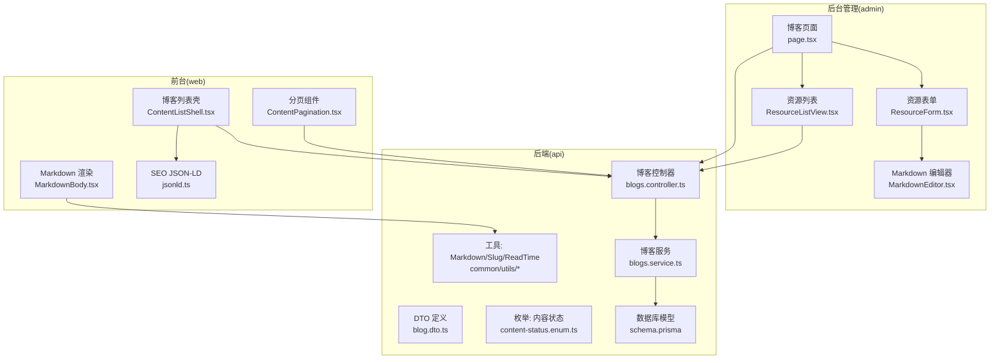
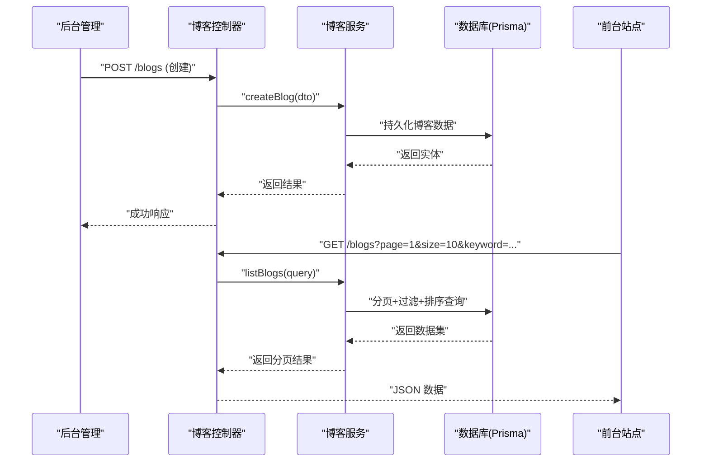
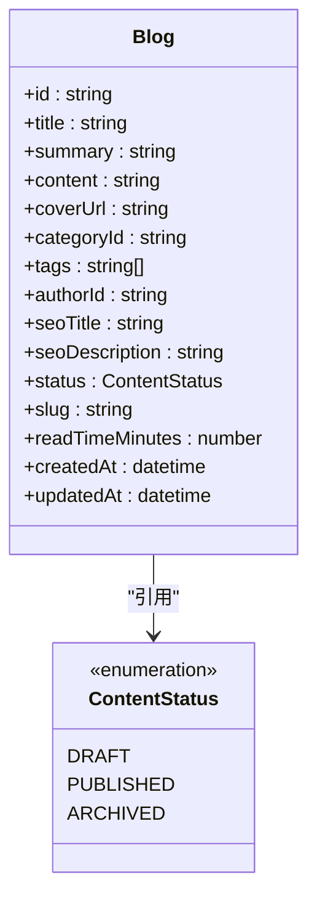
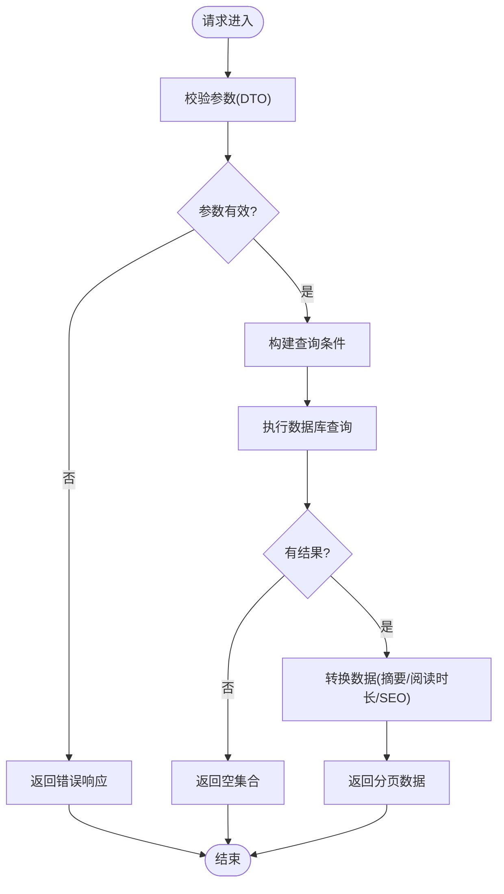
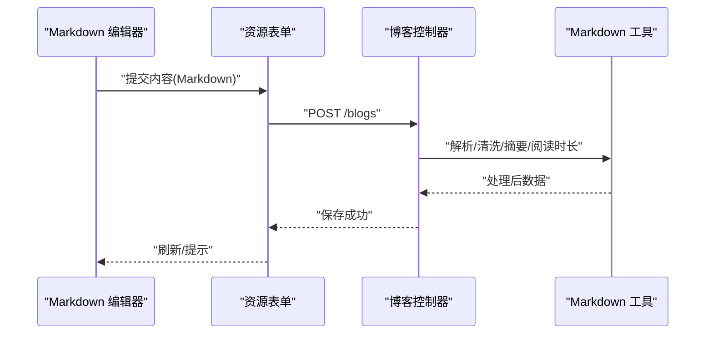
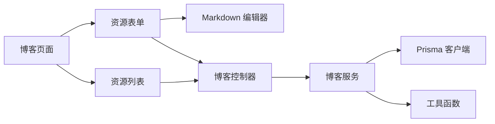

# 博客管理

<cite>
**本文引用的文件**   
- [apps/admin/src/app/(dashboard)/blog/page.tsx](file://apps/admin/src/app/(dashboard)/blog/page.tsx)
- [apps/admin/src/features/resources/blog.tsx](file://apps/admin/src/features/resources/blog.tsx)
- [apps/admin/src/components/crud/ResourceForm.tsx](file://apps/admin/src/components/crud/ResourceForm.tsx)
- [apps/admin/src/components/crud/ResourceListView.tsx](file://apps/admin/src/components/crud/ResourceListView.tsx)
- [apps/admin/src/components/crud/MarkdownEditor.tsx](file://apps/admin/src/components/crud/MarkdownEditor.tsx)
- [apps/admin/src/lib/vditor-i18n-zh-cn.ts](file://apps/admin/src/lib/vditor-i18n-zh-cn.ts)
- [apps/api/src/blogs/blogs.controller.ts](file://apps/api/src/blogs/blogs.controller.ts)
- [apps/api/src/blogs/blogs.service.ts](file://apps/api/src/blogs/blogs.service.ts)
- [apps/api/src/blogs/dto/blog.dto.ts](file://apps/api/src/blogs/dto/blog.dto.ts)
- [apps/api/src/common/enums/content-status.enum.ts](file://apps/api/src/common/enums/content-status.enum.ts)
- [apps/api/src/common/utils/markdown.ts](file://apps/api/src/common/utils/markdown.ts)
- [apps/api/src/common/utils/slug.ts](file://apps/api/src/common/utils/slug.ts)
- [apps/api/src/common/utils/read-time.ts](file://apps/api/src/common/utils/read-time.ts)
- [apps/api/src/prisma/schema.prisma](file://apps/api/src/prisma/schema.prisma)
- [apps/web/src/lib/blog.ts](file://apps/web/src/lib/blog.ts)
- [apps/web/src/components/content/ContentListShell.tsx](file://apps/web/src/components/content/ContentListShell.tsx)
- [apps/web/src/components/content/ContentPagination.tsx](file://apps/web/src/components/content/ContentPagination.tsx)
- [apps/web/src/components/content/MarkdownBody.tsx](file://apps/web/src/components/content/MarkdownBody.tsx)
- [apps/web/src/lib/jsonld.ts](file://apps/web/src/lib/jsonld.ts)
</cite>

## 目录
1. [简介](#简介)
2. [项目结构](#项目结构)
3. [核心组件](#核心组件)
4. [架构总览](#架构总览)
5. [详细组件分析](#详细组件分析)
6. [依赖关系分析](#依赖关系分析)
7. [性能考虑](#性能考虑)
8. [故障排查指南](#故障排查指南)
9. [结论](#结论)
10. [附录](#附录)

## 简介
本文件系统性地梳理并文档化博客管理模块，覆盖以下内容：
- 博客内容的增删改查（CRUD）与发布状态控制
- 富文本编辑器集成（Vditor）、Markdown 支持与内容预览
- SEO 优化（结构化数据、元信息）
- 分类与标签系统、作者管理与版本控制思路
- 列表展示、分页查询、搜索过滤与排序
- 草稿保存、批量操作与数据模型设计
- API 接口定义与使用示例

该文档面向开发者与产品/运营人员，既提供高层概览，也深入到代码级实现细节。

## 项目结构
本项目采用前后端分离的 Monorepo 架构：
- apps/admin：后台管理前端（Next.js），包含博客资源的管理页面、表单、列表视图、Markdown 编辑器等
- apps/api：后端服务（NestJS），提供博客相关的 REST API、权限校验、数据处理与数据库访问
- apps/web：前台站点（Next.js），负责博客列表展示、详情渲染、SEO 输出与搜索体验

图表来源
- [apps/admin/src/app/(dashboard)/blog/page.tsx](file://apps/admin/src/app/(dashboard)/blog/page.tsx)
- [apps/admin/src/components/crud/ResourceForm.tsx](file://apps/admin/src/components/crud/ResourceForm.tsx)
- [apps/admin/src/components/crud/ResourceListView.tsx](file://apps/admin/src/components/crud/ResourceListView.tsx)
- [apps/admin/src/components/crud/MarkdownEditor.tsx](file://apps/admin/src/components/crud/MarkdownEditor.tsx)
- [apps/api/src/blogs/blogs.controller.ts](file://apps/api/src/blogs/blogs.controller.ts)
- [apps/api/src/blogs/blogs.service.ts](file://apps/api/src/blogs/blogs.service.ts)
- [apps/api/src/blogs/dto/blog.dto.ts](file://apps/api/src/blogs/dto/blog.dto.ts)
- [apps/api/src/common/enums/content-status.enum.ts](file://apps/api/src/common/enums/content-status.enum.ts)
- [apps/api/src/common/utils/markdown.ts](file://apps/api/src/common/utils/markdown.ts)
- [apps/api/src/common/utils/slug.ts](file://apps/api/src/common/utils/slug.ts)
- [apps/api/src/common/utils/read-time.ts](file://apps/api/src/common/utils/read-time.ts)
- [apps/api/src/prisma/schema.prisma](file://apps/api/src/prisma/schema.prisma)
- [apps/web/src/components/content/ContentListShell.tsx](file://apps/web/src/components/content/ContentListShell.tsx)
- [apps/web/src/components/content/ContentPagination.tsx](file://apps/web/src/components/content/ContentPagination.tsx)
- [apps/web/src/components/content/MarkdownBody.tsx](file://apps/web/src/components/content/MarkdownBody.tsx)
- [apps/web/src/lib/jsonld.ts](file://apps/web/src/lib/jsonld.ts)

章节来源
- [apps/admin/src/app/(dashboard)/blog/page.tsx](file://apps/admin/src/app/(dashboard)/blog/page.tsx)
- [apps/api/src/blogs/blogs.controller.ts](file://apps/api/src/blogs/blogs.controller.ts)
- [apps/web/src/components/content/ContentListShell.tsx](file://apps/web/src/components/content/ContentListShell.tsx)

## 核心组件
- 博客资源页（admin）：聚合列表与表单入口，承载创建/编辑/删除等操作
- 资源表单（admin）：统一表单封装，支持字段校验、草稿保存、图片/媒体选择、Markdown 编辑器集成
- 资源列表（admin）：统一列表封装，支持分页、搜索、筛选、排序、批量操作
- Markdown 编辑器（admin）：基于 Vditor 的富文本/Markdown 编辑器，支持中英文本地化、实时预览
- 博客控制器与服务（api）：REST 接口与业务逻辑，处理 CRUD、状态流转、SEO 元数据处理
- 博客列表与详情（web）：前台列表展示、分页、搜索过滤、Markdown 渲染与 SEO 输出

章节来源
- [apps/admin/src/features/resources/blog.tsx](file://apps/admin/src/features/resources/blog.tsx)
- [apps/admin/src/components/crud/ResourceForm.tsx](file://apps/admin/src/components/crud/ResourceForm.tsx)
- [apps/admin/src/components/crud/ResourceListView.tsx](file://apps/admin/src/components/crud/ResourceListView.tsx)
- [apps/admin/src/components/crud/MarkdownEditor.tsx](file://apps/admin/src/components/crud/MarkdownEditor.tsx)
- [apps/api/src/blogs/blogs.controller.ts](file://apps/api/src/blogs/blogs.controller.ts)
- [apps/api/src/blogs/blogs.service.ts](file://apps/api/src/blogs/blogs.service.ts)
- [apps/web/src/components/content/ContentListShell.tsx](file://apps/web/src/components/content/ContentListShell.tsx)

## 架构总览
博客模块遵循“前端资源层 + 后端领域层”的分层架构：
- 前端通过统一的 ResourceForm/ResourceListView 复用能力，快速构建博客管理界面
- 后端以 Controller/Service 分层，DTO 约束输入输出，Prisma 管理数据模型
- 工具层提供 Markdown、Slug、阅读时长等通用能力
- 前台 web 消费 API，完成列表、详情、SEO 渲染

图表来源
- [apps/api/src/blogs/blogs.controller.ts](file://apps/api/src/blogs/blogs.controller.ts)
- [apps/api/src/blogs/blogs.service.ts](file://apps/api/src/blogs/blogs.service.ts)
- [apps/api/src/prisma/schema.prisma](file://apps/api/src/prisma/schema.prisma)

## 详细组件分析

### 博客数据模型与状态
- 数据模型：博客实体包含标题、摘要、正文（Markdown）、封面图、分类、标签、作者、SEO 元信息、状态、时间戳等字段
- 发布状态：使用统一的内容状态枚举，支持草稿、已发布、已归档等状态流转
- Slug 生成：根据标题自动生成 URL 友好的 slug，避免重复冲突
- 阅读时长：基于正文内容估算阅读时长，提升用户体验

图表来源
- [apps/api/src/prisma/schema.prisma](file://apps/api/src/prisma/schema.prisma)
- [apps/api/src/common/enums/content-status.enum.ts](file://apps/api/src/common/enums/content-status.enum.ts)

章节来源
- [apps/api/src/prisma/schema.prisma](file://apps/api/src/prisma/schema.prisma)
- [apps/api/src/common/enums/content-status.enum.ts](file://apps/api/src/common/enums/content-status.enum.ts)

### 博客 API 接口与流程
- 列表查询：支持分页、关键词搜索、分类/标签过滤、排序（按时间、热度等）
- 创建/更新：校验 DTO，生成 slug，计算阅读时长，写入 SEO 元信息
- 删除：软删除或硬删除策略（由服务层决定）
- 状态变更：草稿→已发布→已归档的状态机

图表来源
- [apps/api/src/blogs/blogs.controller.ts](file://apps/api/src/blogs/blogs.controller.ts)
- [apps/api/src/blogs/blogs.service.ts](file://apps/api/src/blogs/blogs.service.ts)
- [apps/api/src/blogs/dto/blog.dto.ts](file://apps/api/src/blogs/dto/blog.dto.ts)

章节来源
- [apps/api/src/blogs/blogs.controller.ts](file://apps/api/src/blogs/blogs.controller.ts)
- [apps/api/src/blogs/blogs.service.ts](file://apps/api/src/blogs/blogs.service.ts)
- [apps/api/src/blogs/dto/blog.dto.ts](file://apps/api/src/blogs/dto/blog.dto.ts)

### 富文本编辑器与 Markdown 支持
- 编辑器集成：使用 Vditor 作为 Markdown/富文本编辑器，支持中文本地化配置
- 实时预览：编辑器内嵌预览面板，便于作者即时查看效果
- 内容处理：后端对 Markdown 进行安全清洗、摘要提取、阅读时长估算
- 媒体插入：支持图片/视频等资源上传与引用

图表来源
- [apps/admin/src/components/crud/MarkdownEditor.tsx](file://apps/admin/src/components/crud/MarkdownEditor.tsx)
- [apps/admin/src/components/crud/ResourceForm.tsx](file://apps/admin/src/components/crud/ResourceForm.tsx)
- [apps/api/src/common/utils/markdown.ts](file://apps/api/src/common/utils/markdown.ts)

章节来源
- [apps/admin/src/components/crud/MarkdownEditor.tsx](file://apps/admin/src/components/crud/MarkdownEditor.tsx)
- [apps/admin/src/lib/vditor-i18n-zh-cn.ts](file://apps/admin/src/lib/vditor-i18n-zh-cn.ts)
- [apps/api/src/common/utils/markdown.ts](file://apps/api/src/common/utils/markdown.ts)

### 分类与标签系统、作者管理与发布状态
- 分类与标签：在博客实体中维护分类 ID 与标签数组，支持多对多扩展（可结合 Prisma 关联表）
- 作者管理：通过 authorId 关联用户体系，支持作者维度统计与权限控制
- 发布状态：基于统一枚举，确保状态一致性；可在列表页按状态筛选

章节来源
- [apps/api/src/prisma/schema.prisma](file://apps/api/src/prisma/schema.prisma)
- [apps/api/src/common/enums/content-status.enum.ts](file://apps/api/src/common/enums/content-status.enum.ts)

### 列表展示、分页查询、搜索过滤与排序
- 列表展示：后台 ResourceListView 与前台 ContentListShell 统一封装，提供一致的交互体验
- 分页查询：支持 page/size 参数，服务端分页减少传输体积
- 搜索过滤：关键词搜索（标题/摘要/正文片段匹配）、分类/标签过滤、状态筛选
- 排序：支持按发布时间、阅读量、更新时间等多维度排序

章节来源
- [apps/admin/src/components/crud/ResourceListView.tsx](file://apps/admin/src/components/crud/ResourceListView.tsx)
- [apps/web/src/components/content/ContentListShell.tsx](file://apps/web/src/components/content/ContentListShell.tsx)
- [apps/web/src/components/content/ContentPagination.tsx](file://apps/web/src/components/content/ContentPagination.tsx)

### 内容预览、草稿保存、版本控制与批量操作
- 内容预览：编辑器内实时预览，详情页独立渲染 Markdown
- 草稿保存：表单支持暂存草稿，避免内容丢失
- 版本控制：可通过扩展实体字段记录历史版本（如 version、diff），或在服务层实现快照机制
- 批量操作：列表页支持多选批量删除、批量状态变更、批量导出

章节来源
- [apps/admin/src/components/crud/ResourceForm.tsx](file://apps/admin/src/components/crud/ResourceForm.tsx)
- [apps/web/src/components/content/MarkdownBody.tsx](file://apps/web/src/components/content/MarkdownBody.tsx)

### SEO 优化
- 元信息：标题、描述、封面图、canonical 链接等
- 结构化数据：通过 JSON-LD 注入 Article/NewsArticle 等类型，提升搜索引擎收录质量
- 静态资源：为图片/媒体提供合适的 alt 与尺寸，提升可访问性与加载性能

章节来源
- [apps/web/src/lib/jsonld.ts](file://apps/web/src/lib/jsonld.ts)
- [apps/api/src/blogs/dto/blog.dto.ts](file://apps/api/src/blogs/dto/blog.dto.ts)

## 依赖关系分析
- 前端依赖：ResourceForm/ResourceListView/MarkdownEditor 被博客页面聚合调用
- 后端依赖：Controller 依赖 Service，Service 依赖 Prisma 与工具函数
- 工具依赖：Markdown/Slug/ReadTime 被多处复用，降低耦合

图表来源
- [apps/admin/src/app/(dashboard)/blog/page.tsx](file://apps/admin/src/app/(dashboard)/blog/page.tsx)
- [apps/admin/src/components/crud/ResourceForm.tsx](file://apps/admin/src/components/crud/ResourceForm.tsx)
- [apps/admin/src/components/crud/ResourceListView.tsx](file://apps/admin/src/components/crud/ResourceListView.tsx)
- [apps/admin/src/components/crud/MarkdownEditor.tsx](file://apps/admin/src/components/crud/MarkdownEditor.tsx)
- [apps/api/src/blogs/blogs.controller.ts](file://apps/api/src/blogs/blogs.controller.ts)
- [apps/api/src/blogs/blogs.service.ts](file://apps/api/src/blogs/blogs.service.ts)

章节来源
- [apps/admin/src/app/(dashboard)/blog/page.tsx](file://apps/admin/src/app/(dashboard)/blog/page.tsx)
- [apps/api/src/blogs/blogs.controller.ts](file://apps/api/src/blogs/blogs.controller.ts)
- [apps/api/src/blogs/blogs.service.ts](file://apps/api/src/blogs/blogs.service.ts)

## 性能考虑
- 分页与懒加载：列表默认分页，详情按需加载
- 缓存策略：热门博客列表可引入 Redis 缓存，缩短响应时间
- 图片优化：CDN 加速、WebP 格式、懒加载与占位图
- 服务端渲染：前台可使用 SSR/SSG 提升首屏性能与 SEO
- 数据库索引：对常用查询字段（slug、category、status、createdAt）建立索引

[本节为通用指导，不直接分析具体文件]

## 故障排查指南
- 编辑器无法加载：检查 Vditor 资源路径与国际化配置是否正确
- Markdown 渲染异常：确认后端清洗规则与前端渲染组件是否一致
- 分页数据为空：检查查询参数与数据库索引，确认过滤条件是否过严
- SEO 未生效：核对 JSON-LD 注入与元信息字段是否完整
- 状态不一致：检查状态枚举与前端显示映射是否匹配

章节来源
- [apps/admin/src/lib/vditor-i18n-zh-cn.ts](file://apps/admin/src/lib/vditor-i18n-zh-cn.ts)
- [apps/web/src/components/content/MarkdownBody.tsx](file://apps/web/src/components/content/MarkdownBody.tsx)
- [apps/web/src/lib/jsonld.ts](file://apps/web/src/lib/jsonld.ts)

## 结论
本博客管理系统通过前后端分层与通用组件复用，实现了完整的 CRUD、Markdown 编辑、SEO 优化与列表展示能力。建议后续增强版本控制、权限细化与性能监控，进一步提升系统的可扩展性与稳定性。

[本节为总结性内容，不直接分析具体文件]

## 附录

### API 接口参考
- 列表查询：GET /blogs?page=&size=&keyword=&categoryId=&tag=&status=&sort=
- 创建博客：POST /blogs
- 更新博客：PUT /blogs/:id
- 删除博客：DELETE /blogs/:id
- 状态变更：PATCH /blogs/:id/status

章节来源
- [apps/api/src/blogs/blogs.controller.ts](file://apps/api/src/blogs/blogs.controller.ts)
- [apps/api/src/blogs/dto/blog.dto.ts](file://apps/api/src/blogs/dto/blog.dto.ts)

### 使用示例
- 后台新建博客：打开博客页面 → 点击新增 → 填写标题/摘要/正文 → 选择分类/标签 → 保存草稿或发布
- 前台浏览博客：访问博客列表 → 搜索/筛选 → 点击详情 → 渲染 Markdown 与 SEO 元信息

章节来源
- [apps/admin/src/app/(dashboard)/blog/page.tsx](file://apps/admin/src/app/(dashboard)/blog/page.tsx)
- [apps/web/src/components/content/ContentListShell.tsx](file://apps/web/src/components/content/ContentListShell.tsx)