# 展会管理

<cite>
**本文引用的文件**   
- [trade-shows.controller.ts](file://apps/api/src/trade-shows/trade-shows.controller.ts)
- [trade-shows.service.ts](file://apps/api/src/trade-shows/trade-shows.service.ts)
- [trade-show.dto.ts](file://apps/api/src/trade-shows/dto/trade-show.dto.ts)
- [schema.prisma](file://apps/api/prisma/schema.prisma)
- [tradeShows.tsx](file://apps/admin/src/features/resources/tradeShows.tsx)
- [ResourceForm.tsx](file://apps/admin/src/components/crud/ResourceForm.tsx)
- [ResourceListView.tsx](file://apps/admin/src/components/crud/ResourceListView.tsx)
- [apiClient.ts](file://apps/admin/src/lib/apiClient.ts)
- [route.ts](file://apps/web/src/app/api/search/route.ts)
- [ContentListShell.tsx](file://apps/web/src/components/content/ContentListShell.tsx)
- [ContentListToolbar.tsx](file://apps/web/src/components/content/ContentListToolbar.tsx)
- [ContentCategoryTabs.tsx](file://apps/web/src/components/content/ContentCategoryTabs.tsx)
- [analytics.controller.ts](file://apps/api/src/analytics/analytics.controller.ts)
- [analytics.service.ts](file://apps/api/src/analytics/analytics.service.ts)
</cite>

## 目录
1. [简介](#简介)
2. [项目结构](#项目结构)
3. [核心组件](#核心组件)
4. [架构总览](#架构总览)
5. [详细组件分析](#详细组件分析)
6. [依赖分析](#依赖分析)
7. [性能考虑](#性能考虑)
8. [故障排查指南](#故障排查指南)
9. [结论](#结论)
10. [附录](#附录)

## 简介
本文件面向“展会管理系统”的构建与使用，围绕展会的结构化编辑、时间管理与地点配置，以及分类、状态控制、报名与参会者信息收集等能力展开。同时覆盖展会展示页面生成、地图集成、日程安排与活动详情管理，并提供搜索、筛选、推荐与数据分析的实现思路与集成要点。文档以仓库中现有代码为依据，给出数据模型、API接口与前后端组件的集成指引，帮助快速搭建完整的展会管理平台。

## 项目结构
本项目采用多应用（Monorepo）组织：
- apps/api：NestJS 后端服务，提供 REST API、权限、审计、媒体、设置、分析与展会管理等模块。
- apps/admin：Next.js 管理后台，包含资源 CRUD、表单、列表视图、媒体选择器与通用 CRUD 组件。
- apps/web：Next.js 前端站点，负责内容展示、搜索、推荐与分析采集。
- apps/api/prisma：数据库 schema 与迁移，定义实体关系与字段约束。

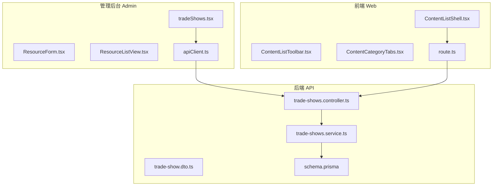

图表来源 
- [trade-shows.controller.ts](file://apps/api/src/trade-shows/trade-shows.controller.ts)
- [trade-shows.service.ts](file://apps/api/src/trade-shows/trade-shows.service.ts)
- [trade-show.dto.ts](file://apps/api/src/trade-shows/dto/trade-show.dto.ts)
- [schema.prisma](file://apps/api/prisma/schema.prisma)
- [tradeShows.tsx](file://apps/admin/src/features/resources/tradeShows.tsx)
- [ResourceForm.tsx](file://apps/admin/src/components/crud/ResourceForm.tsx)
- [ResourceListView.tsx](file://apps/admin/src/components/crud/ResourceListView.tsx)
- [apiClient.ts](file://apps/admin/src/lib/apiClient.ts)
- [ContentListShell.tsx](file://apps/web/src/components/content/ContentListShell.tsx)
- [ContentListToolbar.tsx](file://apps/web/src/components/content/ContentListToolbar.tsx)
- [ContentCategoryTabs.tsx](file://apps/web/src/components/content/ContentCategoryTabs.tsx)
- [route.ts](file://apps/web/src/app/api/search/route.ts)

章节来源
- [trade-shows.controller.ts](file://apps/api/src/trade-shows/trade-shows.controller.ts)
- [trade-shows.service.ts](file://apps/api/src/trade-shows/trade-shows.service.ts)
- [trade-show.dto.ts](file://apps/api/src/trade-shows/dto/trade-show.dto.ts)
- [schema.prisma](file://apps/api/prisma/schema.prisma)
- [tradeShows.tsx](file://apps/admin/src/features/resources/tradeShows.tsx)
- [ResourceForm.tsx](file://apps/admin/src/components/crud/ResourceForm.tsx)
- [ResourceListView.tsx](file://apps/admin/src/components/crud/ResourceListView.tsx)
- [apiClient.ts](file://apps/admin/src/lib/apiClient.ts)
- [ContentListShell.tsx](file://apps/web/src/components/content/ContentListShell.tsx)
- [ContentListToolbar.tsx](file://apps/web/src/components/content/ContentListToolbar.tsx)
- [ContentCategoryTabs.tsx](file://apps/web/src/components/content/ContentCategoryTabs.tsx)
- [route.ts](file://apps/web/src/app/api/search/route.ts)

## 核心组件
- 后端控制器与服务
  - trade-shows.controller.ts：暴露展会相关 REST 路由，统一请求校验与响应格式。
  - trade-shows.service.ts：封装业务逻辑，包括查询、过滤、分页、排序、统计与关联操作。
  - trade-show.dto.ts：定义输入输出 DTO，用于参数校验与类型安全。
- 数据模型
  - schema.prisma：定义展会实体、分类、状态、时间、地点、报名与参会者等表结构与关系。
- 管理后台
  - tradeShows.tsx：展会资源的入口与路由配置。
  - ResourceForm.tsx：通用表单组件，支持富文本、媒体选择、时间范围、地点与附件上传。
  - ResourceListView.tsx：通用列表组件，支持分页、排序、筛选与批量操作。
  - apiClient.ts：HTTP 客户端封装，处理鉴权、重试与错误映射。
- 前端站点
  - ContentListShell.tsx / ContentListToolbar.tsx / ContentCategoryTabs.tsx：内容列表壳层、工具栏与分类标签，用于展会列表展示与筛选。
  - route.ts：搜索建议与聚合接口，支撑搜索、筛选与推荐。

章节来源
- [trade-shows.controller.ts](file://apps/api/src/trade-shows/trade-shows.controller.ts)
- [trade-shows.service.ts](file://apps/api/src/trade-shows/trade-shows.service.ts)
- [trade-show.dto.ts](file://apps/api/src/trade-shows/dto/trade-show.dto.ts)
- [schema.prisma](file://apps/api/prisma/schema.prisma)
- [tradeShows.tsx](file://apps/admin/src/features/resources/tradeShows.tsx)
- [ResourceForm.tsx](file://apps/admin/src/components/crud/ResourceForm.tsx)
- [ResourceListView.tsx](file://apps/admin/src/components/crud/ResourceListView.tsx)
- [apiClient.ts](file://apps/admin/src/lib/apiClient.ts)
- [ContentListShell.tsx](file://apps/web/src/components/content/ContentListShell.tsx)
- [ContentListToolbar.tsx](file://apps/web/src/components/content/ContentListToolbar.tsx)
- [ContentCategoryTabs.tsx](file://apps/web/src/components/content/ContentCategoryTabs.tsx)
- [route.ts](file://apps/web/src/app/api/search/route.ts)

## 架构总览
展会管理系统的整体交互流程如下：管理后台通过通用 CRUD 组件对展会进行结构化编辑；Web 端通过搜索与分类组件获取并展示展会列表与详情；后端控制器接收请求，交由服务层处理业务逻辑，最终读写数据库。

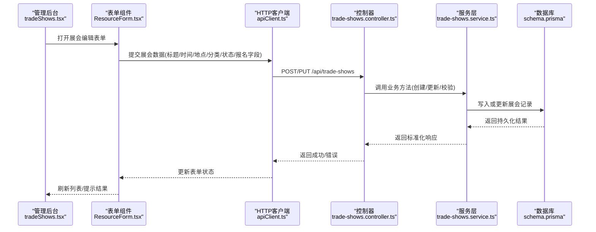

图表来源 
- [tradeShows.tsx](file://apps/admin/src/features/resources/tradeShows.tsx)
- [ResourceForm.tsx](file://apps/admin/src/components/crud/ResourceForm.tsx)
- [apiClient.ts](file://apps/admin/src/lib/apiClient.ts)
- [trade-shows.controller.ts](file://apps/api/src/trade-shows/trade-shows.controller.ts)
- [trade-shows.service.ts](file://apps/api/src/trade-shows/trade-shows.service.ts)
- [schema.prisma](file://apps/api/prisma/schema.prisma)

## 详细组件分析

### 数据模型与实体关系
展会相关的数据模型在 Prisma Schema 中定义，通常包含以下实体与关系：
- 展会（TradeShow）：标题、描述、封面图、分类、状态、开始/结束时间、地点、报名开关、报名截止、详情内容、SEO 信息等。
- 分类（Category）：展会分类维度，如行业、主题、地区等。
- 地点（Location）：名称、地址、经纬度、地图标记、场馆信息等。
- 报名（Registration）：展会与参会者的关联，含状态、来源、渠道等。
- 参会者（Attendee）：姓名、邮箱、公司、职位、联系方式、来源等。
- 日程（Schedule）：按天或时段的活动安排，关联展会与地点。

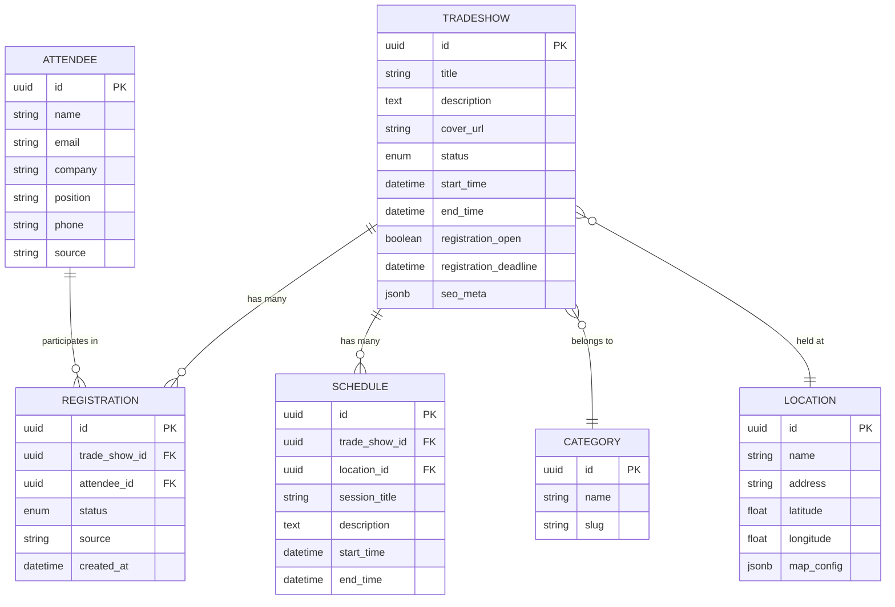

图表来源 
- [schema.prisma](file://apps/api/prisma/schema.prisma)

章节来源
- [schema.prisma](file://apps/api/prisma/schema.prisma)

### 后端 API 与控制流
- 控制器职责
  - 定义 REST 路由（如列表、详情、创建、更新、删除）。
  - 参数校验（基于 DTO）、权限校验、审计日志埋点。
- 服务层职责
  - 实现查询条件构建（分类、状态、时间范围、地点、关键词）。
  - 分页、排序、计数与聚合统计。
  - 报名与参会者数据的增删改查与关联维护。
  - 日程安排的维护与冲突检测。

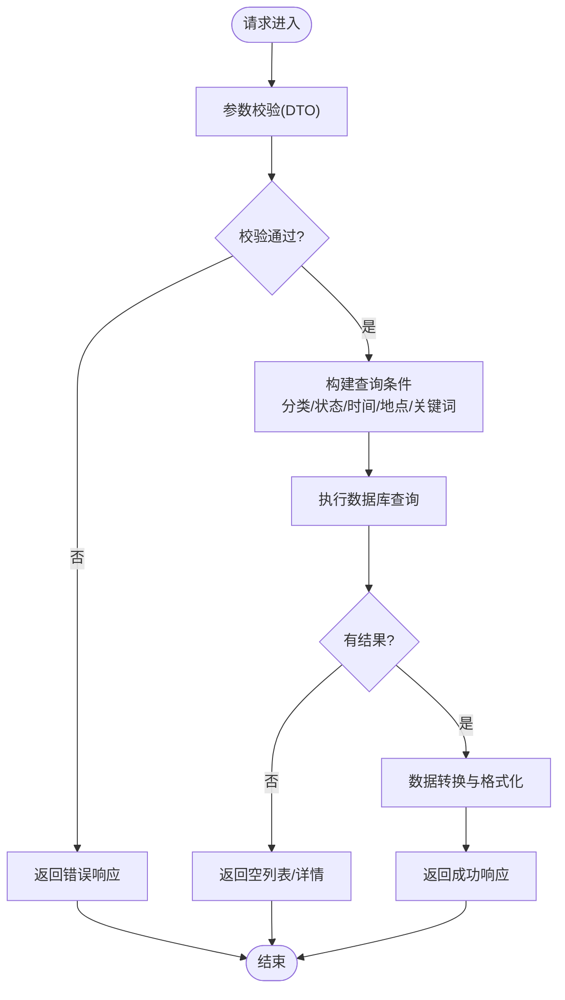

图表来源 
- [trade-shows.controller.ts](file://apps/api/src/trade-shows/trade-shows.controller.ts)
- [trade-shows.service.ts](file://apps/api/src/trade-shows/trade-shows.service.ts)
- [trade-show.dto.ts](file://apps/api/src/trade-shows/dto/trade-show.dto.ts)

章节来源
- [trade-shows.controller.ts](file://apps/api/src/trade-shows/trade-shows.controller.ts)
- [trade-shows.service.ts](file://apps/api/src/trade-shows/trade-shows.service.ts)
- [trade-show.dto.ts](file://apps/api/src/trade-shows/dto/trade-show.dto.ts)

### 管理后台：结构化编辑与列表
- 资源入口
  - tradeShows.tsx：注册展会资源的路由与菜单项，绑定列表与编辑器。
- 表单组件
  - ResourceForm.tsx：支持富文本编辑（Markdown/Vditor）、媒体选择、时间范围选择、地点选择与附件上传。可配置字段映射到 DTO。
- 列表组件
  - ResourceListView.tsx：支持分页、排序、筛选、批量操作与导出。
- HTTP 客户端
  - apiClient.ts：封装请求头、鉴权、重试与错误处理，统一错误提示。

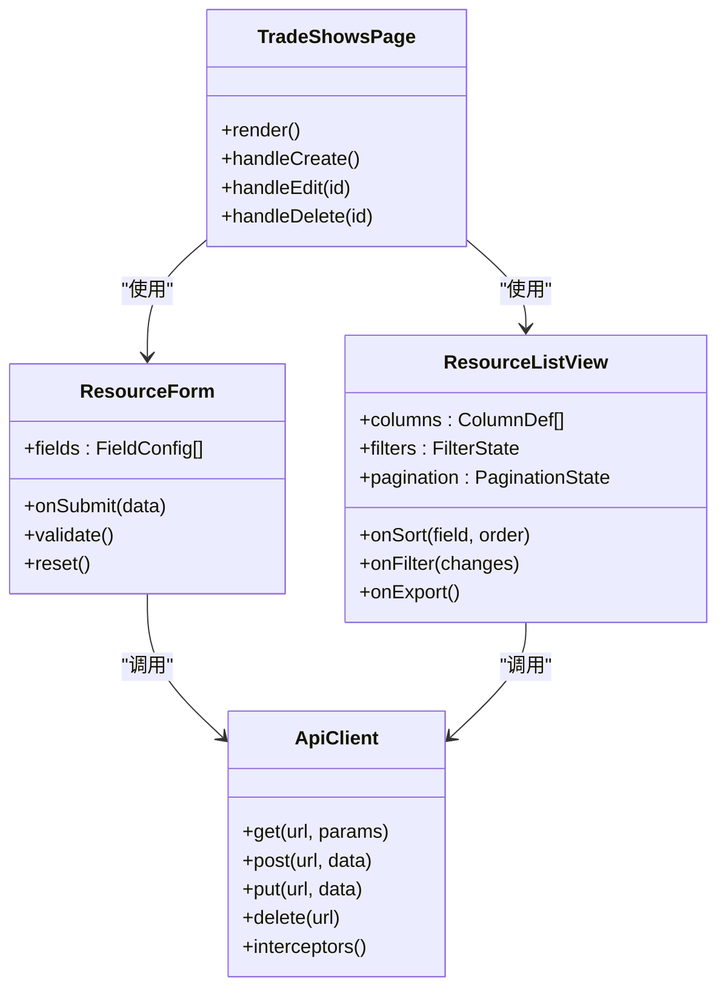

图表来源 
- [tradeShows.tsx](file://apps/admin/src/features/resources/tradeShows.tsx)
- [ResourceForm.tsx](file://apps/admin/src/components/crud/ResourceForm.tsx)
- [ResourceListView.tsx](file://apps/admin/src/components/crud/ResourceListView.tsx)
- [apiClient.ts](file://apps/admin/src/lib/apiClient.ts)

章节来源
- [tradeShows.tsx](file://apps/admin/src/features/resources/tradeShows.tsx)
- [ResourceForm.tsx](file://apps/admin/src/components/crud/ResourceForm.tsx)
- [ResourceListView.tsx](file://apps/admin/src/components/crud/ResourceListView.tsx)
- [apiClient.ts](file://apps/admin/src/lib/apiClient.ts)

### 前端展示：列表、筛选、分类与详情
- 列表壳层
  - ContentListShell.tsx：统一渲染内容列表，加载数据、错误与空态处理。
- 工具栏与分类
  - ContentListToolbar.tsx：搜索框、筛选器、排序与分页控件。
  - ContentCategoryTabs.tsx：分类标签切换，联动列表数据。
- 搜索与建议
  - route.ts：聚合搜索建议与关键词联想，支持按分类、状态、时间、地点等维度。

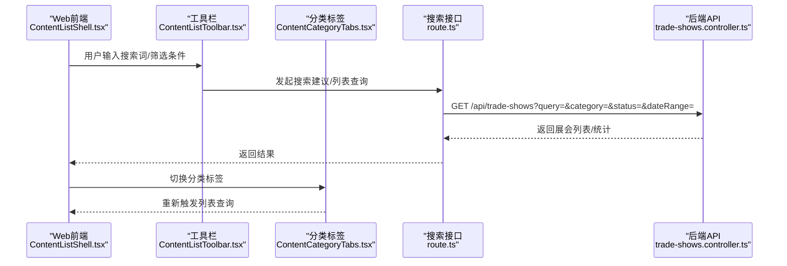

图表来源 
- [ContentListShell.tsx](file://apps/web/src/components/content/ContentListShell.tsx)
- [ContentListToolbar.tsx](file://apps/web/src/components/content/ContentListToolbar.tsx)
- [ContentCategoryTabs.tsx](file://apps/web/src/components/content/ContentCategoryTabs.tsx)
- [route.ts](file://apps/web/src/app/api/search/route.ts)
- [trade-shows.controller.ts](file://apps/api/src/trade-shows/trade-shows.controller.ts)

章节来源
- [ContentListShell.tsx](file://apps/web/src/components/content/ContentListShell.tsx)
- [ContentListToolbar.tsx](file://apps/web/src/components/content/ContentListToolbar.tsx)
- [ContentCategoryTabs.tsx](file://apps/web/src/components/content/ContentCategoryTabs.tsx)
- [route.ts](file://apps/web/src/app/api/search/route.ts)
- [trade-shows.controller.ts](file://apps/api/src/trade-shows/trade-shows.controller.ts)

### 报名管理与参会者信息收集
- 报名流程
  - 前端表单收集参会者基本信息（姓名、邮箱、公司、职位、电话、来源），提交至后端报名接口。
  - 后端校验数据完整性与唯一性（如邮箱去重），写入报名记录并关联展会与参会者。
- 状态控制
  - 报名状态（待确认、已确认、已取消、已完成）与展会状态（草稿、发布、进行中、已结束）联动。
- 数据模型
  - Registration 与 Attendee 表关联，便于统计报名转化率与参会者画像。

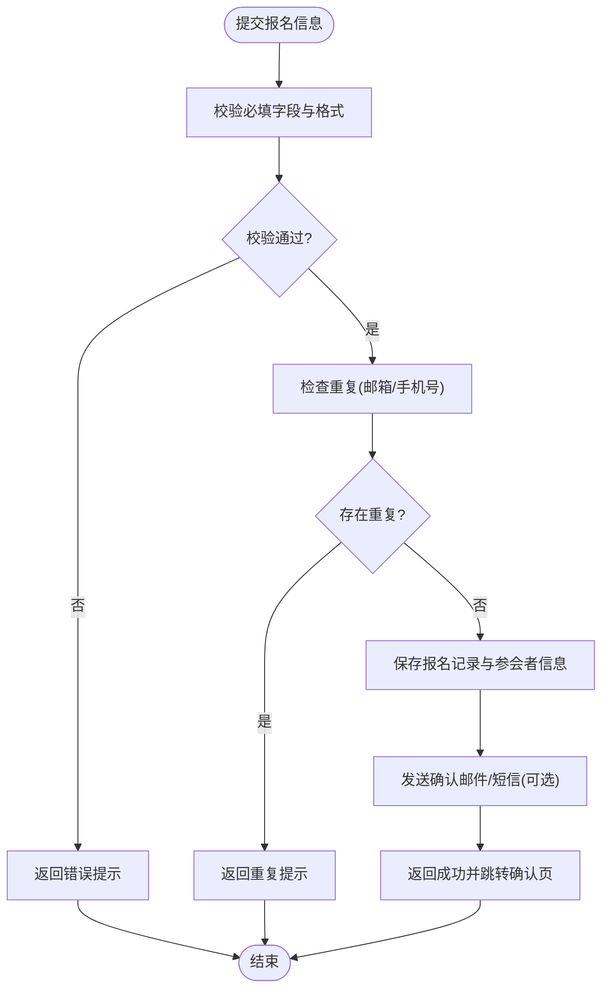

图表来源 
- [schema.prisma](file://apps/api/prisma/schema.prisma)
- [trade-shows.service.ts](file://apps/api/src/trade-shows/trade-shows.service.ts)

章节来源
- [schema.prisma](file://apps/api/prisma/schema.prisma)
- [trade-shows.service.ts](file://apps/api/src/trade-shows/trade-shows.service.ts)

### 日程安排与活动详情管理
- 日程模型
  - Schedule 表关联展会与地点，支持按天/时段划分活动，包含标题、描述、起止时间等。
- 冲突检测
  - 同一地点在同一时间段内避免重复安排，服务层进行冲突校验。
- 详情展示
  - 前端根据展会 ID 拉取日程列表，按时间轴渲染，支持地图标注与导航。

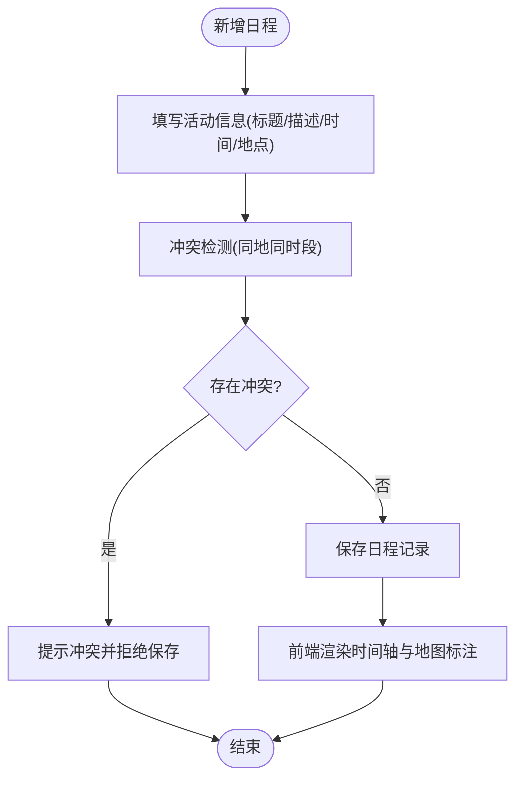

图表来源 
- [schema.prisma](file://apps/api/prisma/schema.prisma)
- [trade-shows.service.ts](file://apps/api/src/trade-shows/trade-shows.service.ts)

章节来源
- [schema.prisma](file://apps/api/prisma/schema.prisma)
- [trade-shows.service.ts](file://apps/api/src/trade-shows/trade-shows.service.ts)

### 地图集成与地点配置
- 地点配置
  - Location 表存储名称、地址、经纬度与地图配置（如自定义标记、缩放级别）。
- 地图展示
  - 前端使用地图 SDK（如高德/百度/Google Maps）渲染地点标记，支持点击查看详情与路线规划。
- 数据同步
  - 管理后台编辑地点时，自动更新地图配置与坐标，确保展示一致性。

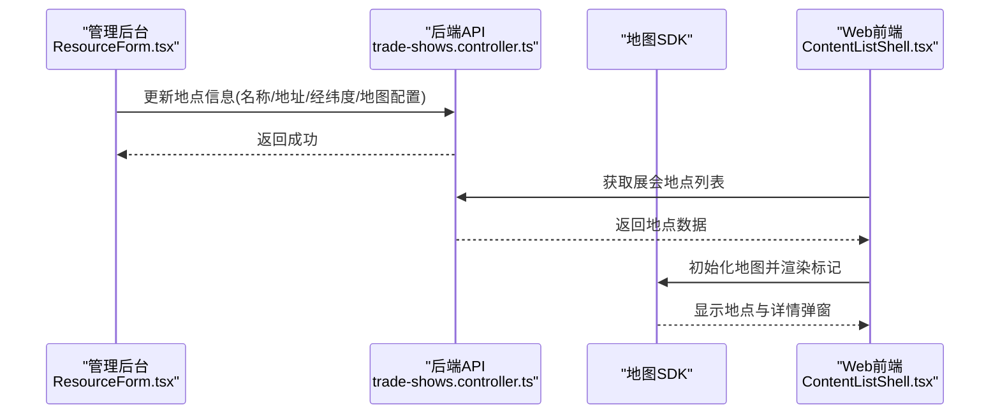

图表来源 
- [ResourceForm.tsx](file://apps/admin/src/components/crud/ResourceForm.tsx)
- [trade-shows.controller.ts](file://apps/api/src/trade-shows/trade-shows.controller.ts)
- [ContentListShell.tsx](file://apps/web/src/components/content/ContentListShell.tsx)
- [schema.prisma](file://apps/api/prisma/schema.prisma)

章节来源
- [ResourceForm.tsx](file://apps/admin/src/components/crud/ResourceForm.tsx)
- [trade-shows.controller.ts](file://apps/api/src/trade-shows/trade-shows.controller.ts)
- [ContentListShell.tsx](file://apps/web/src/components/content/ContentListShell.tsx)
- [schema.prisma](file://apps/api/prisma/schema.prisma)

### 搜索、筛选、推荐与数据分析
- 搜索与建议
  - route.ts 提供搜索建议与聚合接口，支持关键词、分类、状态、时间、地点等多维筛选。
- 推荐策略
  - 基于分类热度、时间临近度、地点偏好与历史行为进行推荐排序。
- 数据分析
  - analytics.controller.ts 与 analytics.service.ts 提供页面浏览、事件采集与统计报表，支撑展会曝光与转化分析。

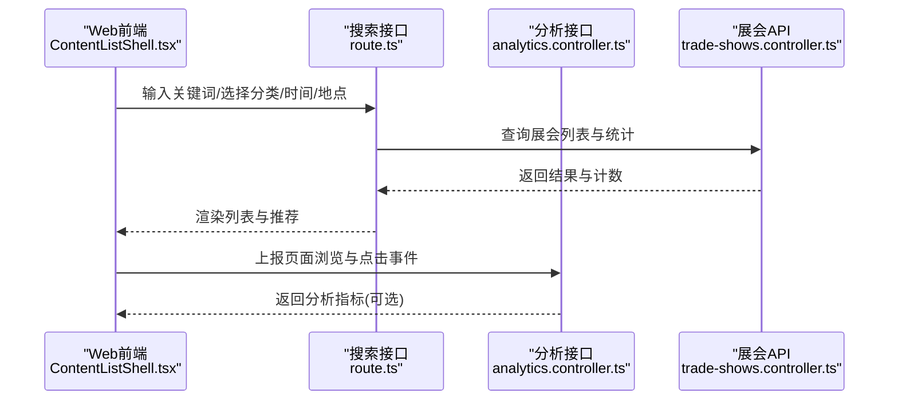

图表来源 
- [route.ts](file://apps/web/src/app/api/search/route.ts)
- [analytics.controller.ts](file://apps/api/src/analytics/analytics.controller.ts)
- [analytics.service.ts](file://apps/api/src/analytics/analytics.service.ts)
- [ContentListShell.tsx](file://apps/web/src/components/content/ContentListShell.tsx)
- [trade-shows.controller.ts](file://apps/api/src/trade-shows/trade-shows.controller.ts)

章节来源
- [route.ts](file://apps/web/src/app/api/search/route.ts)
- [analytics.controller.ts](file://apps/api/src/analytics/analytics.controller.ts)
- [analytics.service.ts](file://apps/api/src/analytics/analytics.service.ts)
- [ContentListShell.tsx](file://apps/web/src/components/content/ContentListShell.tsx)
- [trade-shows.controller.ts](file://apps/api/src/trade-shows/trade-shows.controller.ts)

## 依赖分析
- 模块耦合
  - 控制器依赖服务层，服务层依赖数据模型（Prisma）。
  - 管理后台通过 apiClient 调用后端 API，前端通过搜索接口与展会 API 交互。
- 外部依赖
  - 地图 SDK（高德/百度/Google Maps）用于地点展示与导航。
  - 媒体存储服务（OSS/S3）用于封面图与附件上传。
  - 邮件/短信服务用于报名确认通知。

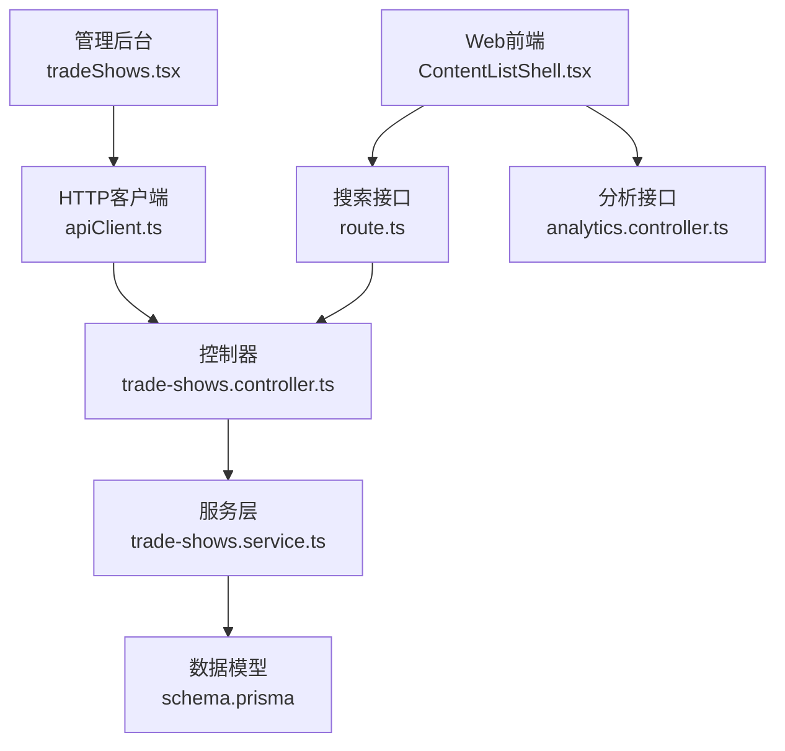

图表来源 
- [tradeShows.tsx](file://apps/admin/src/features/resources/tradeShows.tsx)
- [apiClient.ts](file://apps/admin/src/lib/apiClient.ts)
- [trade-shows.controller.ts](file://apps/api/src/trade-shows/trade-shows.controller.ts)
- [trade-shows.service.ts](file://apps/api/src/trade-shows/trade-shows.service.ts)
- [schema.prisma](file://apps/api/prisma/schema.prisma)
- [ContentListShell.tsx](file://apps/web/src/components/content/ContentListShell.tsx)
- [route.ts](file://apps/web/src/app/api/search/route.ts)
- [analytics.controller.ts](file://apps/api/src/analytics/analytics.controller.ts)

章节来源
- [tradeShows.tsx](file://apps/admin/src/features/resources/tradeShows.tsx)
- [apiClient.ts](file://apps/admin/src/lib/apiClient.ts)
- [trade-shows.controller.ts](file://apps/api/src/trade-shows/trade-shows.controller.ts)
- [trade-shows.service.ts](file://apps/api/src/trade-shows/trade-shows.service.ts)
- [schema.prisma](file://apps/api/prisma/schema.prisma)
- [ContentListShell.tsx](file://apps/web/src/components/content/ContentListShell.tsx)
- [route.ts](file://apps/web/src/app/api/search/route.ts)
- [analytics.controller.ts](file://apps/api/src/analytics/analytics.controller.ts)

## 性能考虑
- 查询优化
  - 使用索引（分类、状态、时间范围、地点）提升查询效率。
  - 分页与懒加载减少首屏压力。
- 缓存策略
  - 热点展会列表与分类统计使用 Redis 缓存，降低数据库压力。
- 媒体优化
  - 图片压缩与 CDN 加速，按需加载与懒加载。
- 并发控制
  - 报名接口限流与幂等设计，防止重复提交。

[本节为通用指导，不直接分析具体文件]

## 故障排查指南
- 常见错误
  - 参数校验失败：检查 DTO 定义与前端表单字段映射。
  - 数据重复：检查邮箱/手机号唯一性约束与去重逻辑。
  - 地图加载失败：检查地图 SDK 密钥与坐标有效性。
- 调试建议
  - 启用审计日志与请求追踪，定位问题链路。
  - 使用 apiClient 的错误拦截器统一捕获与提示。

章节来源
- [trade-show.dto.ts](file://apps/api/src/trade-shows/dto/trade-show.dto.ts)
- [apiClient.ts](file://apps/admin/src/lib/apiClient.ts)
- [schema.prisma](file://apps/api/prisma/schema.prisma)

## 结论
本展会管理系统以模块化架构为基础，结合管理后台的结构化编辑与前端的内容展示，实现了从数据建模、API 开发到界面集成的完整闭环。通过分类、状态、时间与地点的配置，以及报名与参会者信息管理，系统能够支撑复杂的展会运营需求。搜索、筛选、推荐与数据分析能力进一步提升了用户体验与运营效率。建议在生产环境中加强缓存、监控与安全防护，确保系统稳定与高性能。

[本节为总结性内容，不直接分析具体文件]

## 附录
- 集成清单
  - 管理后台：tradeShows.tsx、ResourceForm.tsx、ResourceListView.tsx、apiClient.ts。
  - 后端：trade-shows.controller.ts、trade-shows.service.ts、trade-show.dto.ts、schema.prisma。
  - 前端：ContentListShell.tsx、ContentListToolbar.tsx、ContentCategoryTabs.tsx、route.ts。
  - 分析：analytics.controller.ts、analytics.service.ts。
- 扩展建议
  - 增加国际化支持（i18n）与多语言内容管理。
  - 引入工作流引擎，支持审批与自动化通知。
  - 增强数据分析看板，提供可视化报表与导出功能。

[本节为补充说明，不直接分析具体文件]