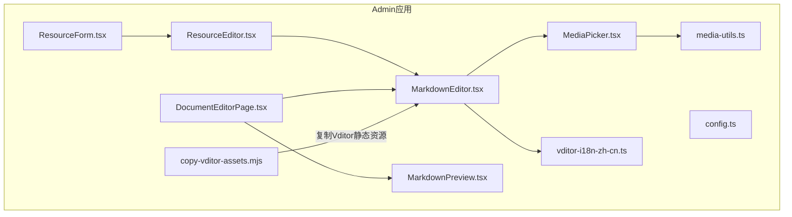
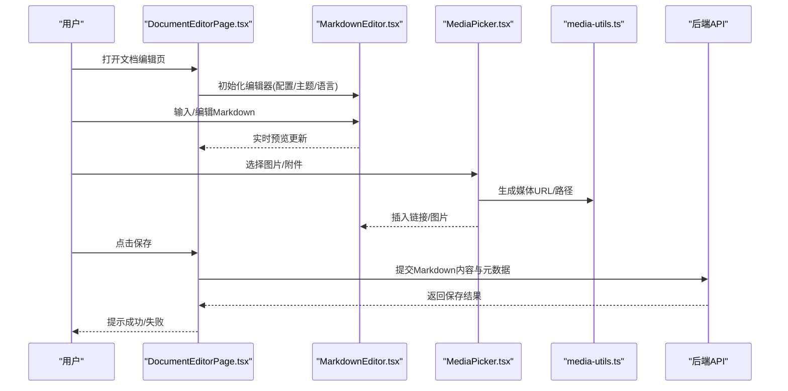
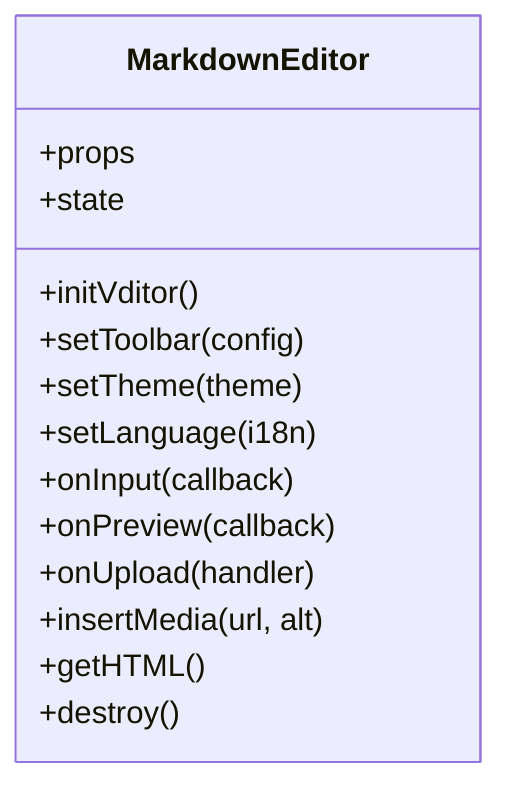
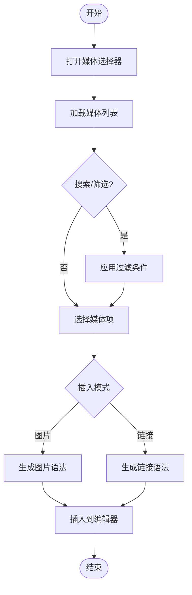
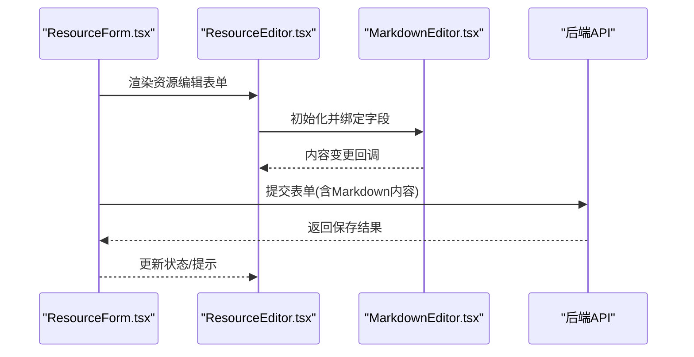
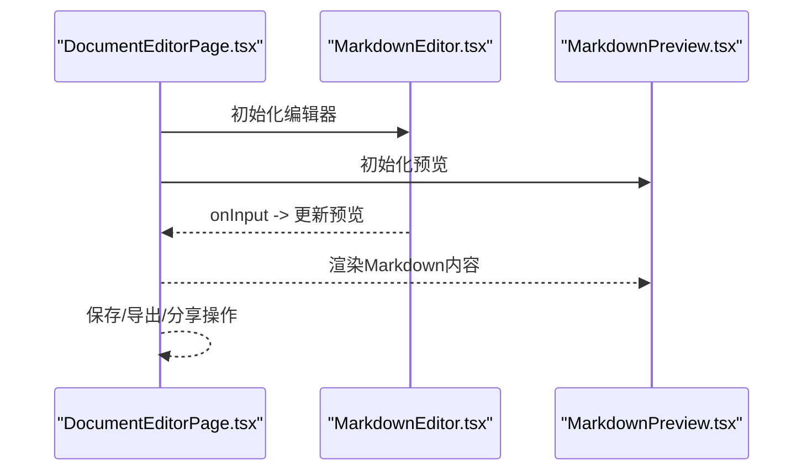
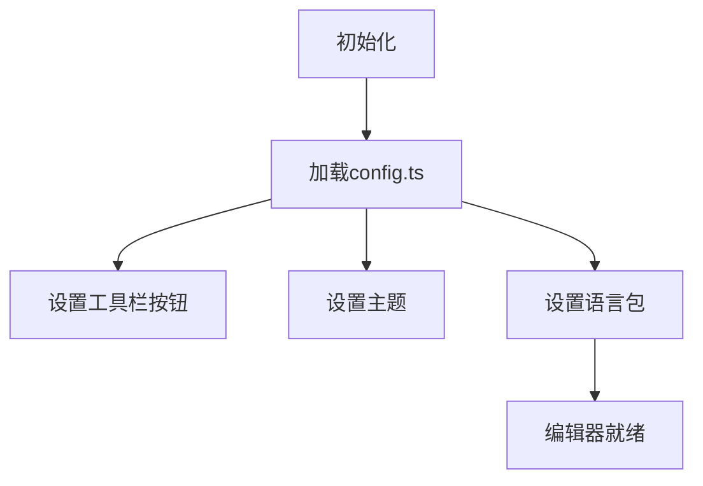
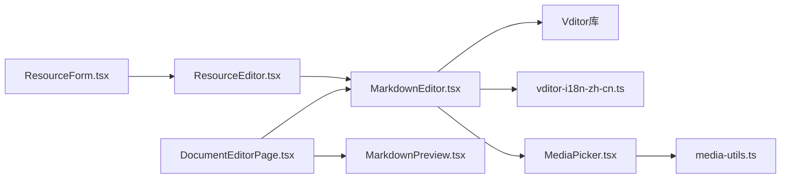

# Markdown编辑器

<cite>
**本文引用的文件**   
- [MarkdownEditor.tsx](file://apps/admin/src/components/crud/MarkdownEditor.tsx)
- [MediaPicker.tsx](file://apps/admin/src/components/crud/MediaPicker.tsx)
- [ResourceEditor.tsx](file://apps/admin/src/components/crud/ResourceEditor.tsx)
- [ResourceForm.tsx](file://apps/admin/src/components/crud/ResourceForm.tsx)
- [config.ts](file://apps/admin/src/components/crud/config.ts)
- [vditor-i18n-zh-cn.ts](file://apps/admin/src/lib/vditor-i18n-zh-cn.ts)
- [DocumentEditorPage.tsx](file://apps/admin/src/components/documents/DocumentEditorPage.tsx)
- [MarkdownPreview.tsx](file://apps/admin/src/components/documents/MarkdownPreview.tsx)
- [media-utils.ts](file://apps/admin/src/components/media/media-utils.ts)
- [copy-vditor-assets.mjs](file://apps/admin/scripts/copy-vditor-assets.mjs)
</cite>

## 目录
1. [简介](#简介)
2. [项目结构](#项目结构)
3. [核心组件](#核心组件)
4. [架构总览](#架构总览)
5. [详细组件分析](#详细组件分析)
6. [依赖关系分析](#依赖关系分析)
7. [性能考虑](#性能考虑)
8. [故障排查指南](#故障排查指南)
9. [结论](#结论)
10. [附录](#附录)

## 简介
本文件面向使用 Vditor 的 Markdown 编辑器集成与扩展，覆盖以下主题：
- 编辑器集成配置、工具栏定制与主题样式
- 实时预览、语法高亮、表格编辑与代码块支持
- 图片上传、附件管理与媒体资源处理
- 编辑器扩展开发、快捷键自定义与协作编辑能力
- 完整的 Markdown 内容创作体验（以文档管理场景为例）

本仓库在 admin 应用中通过 React 组件封装 Vditor，并结合媒体选择器与后端媒体服务，形成从编辑到发布的一体化流程。

## 项目结构
与 Markdown 编辑器相关的核心位置如下：
- 编辑器组件与表单：apps/admin/src/components/crud/*
- 文档编辑页面与预览：apps/admin/src/components/documents/*
- 国际化与本地化：apps/admin/src/lib/vditor-i18n-zh-cn.ts
- 媒体工具与资源：apps/admin/src/components/media/media-utils.ts
- Vditor 静态资源复制脚本：apps/admin/scripts/copy-vditor-assets.mjs

图表来源 
- [MarkdownEditor.tsx](file://apps/admin/src/components/crud/MarkdownEditor.tsx)
- [MediaPicker.tsx](file://apps/admin/src/components/crud/MediaPicker.tsx)
- [ResourceEditor.tsx](file://apps/admin/src/components/crud/ResourceEditor.tsx)
- [ResourceForm.tsx](file://apps/admin/src/components/crud/ResourceForm.tsx)
- [config.ts](file://apps/admin/src/components/crud/config.ts)
- [vditor-i18n-zh-cn.ts](file://apps/admin/src/lib/vditor-i18n-zh-cn.ts)
- [DocumentEditorPage.tsx](file://apps/admin/src/components/documents/DocumentEditorPage.tsx)
- [MarkdownPreview.tsx](file://apps/admin/src/components/documents/MarkdownPreview.tsx)
- [media-utils.ts](file://apps/admin/src/components/media/media-utils.ts)
- [copy-vditor-assets.mjs](file://apps/admin/scripts/copy-vditor-assets.mjs)

章节来源
- [MarkdownEditor.tsx](file://apps/admin/src/components/crud/MarkdownEditor.tsx)
- [MediaPicker.tsx](file://apps/admin/src/components/crud/MediaPicker.tsx)
- [ResourceEditor.tsx](file://apps/admin/src/components/crud/ResourceEditor.tsx)
- [ResourceForm.tsx](file://apps/admin/src/components/crud/ResourceForm.tsx)
- [config.ts](file://apps/admin/src/components/crud/config.ts)
- [vditor-i18n-zh-cn.ts](file://apps/admin/src/lib/vditor-i18n-zh-cn.ts)
- [DocumentEditorPage.tsx](file://apps/admin/src/components/documents/DocumentEditorPage.tsx)
- [MarkdownPreview.tsx](file://apps/admin/src/components/documents/MarkdownPreview.tsx)
- [media-utils.ts](file://apps/admin/src/components/media/media-utils.ts)
- [copy-vditor-assets.mjs](file://apps/admin/scripts/copy-vditor-assets.mjs)

## 核心组件
- MarkdownEditor.tsx：基于 Vditor 的 Markdown 编辑器封装，负责初始化、工具栏配置、主题设置、事件回调（如输入、预览、上传等）。
- MediaPicker.tsx：媒体选择器，提供图片/附件浏览与插入功能，与编辑器联动。
- ResourceEditor.tsx / ResourceForm.tsx：资源编辑与表单容器，将 MarkdownEditor 嵌入到业务表单中，统一数据流与校验。
- config.ts：集中定义编辑器相关配置项（如工具栏按钮、默认值、上传接口等），便于复用与扩展。
- vditor-i18n-zh-cn.ts：Vditor 中文本地化文案，确保界面语言一致。
- DocumentEditorPage.tsx：文档编辑页面，整合 MarkdownEditor、预览与保存流程。
- MarkdownPreview.tsx：Markdown 渲染预览组件，用于阅读模式或对比预览。
- media-utils.ts：媒体路径处理、URL 生成与兼容性工具。
- copy-vditor-assets.mjs：构建期脚本，复制 Vditor 静态资源到 public 目录，确保前端可访问。

章节来源
- [MarkdownEditor.tsx](file://apps/admin/src/components/crud/MarkdownEditor.tsx)
- [MediaPicker.tsx](file://apps/admin/src/components/crud/MediaPicker.tsx)
- [ResourceEditor.tsx](file://apps/admin/src/components/crud/ResourceEditor.tsx)
- [ResourceForm.tsx](file://apps/admin/src/components/crud/ResourceForm.tsx)
- [config.ts](file://apps/admin/src/components/crud/config.ts)
- [vditor-i18n-zh-cn.ts](file://apps/admin/src/lib/vditor-i18n-zh-cn.ts)
- [DocumentEditorPage.tsx](file://apps/admin/src/components/documents/DocumentEditorPage.tsx)
- [MarkdownPreview.tsx](file://apps/admin/src/components/documents/MarkdownPreview.tsx)
- [media-utils.ts](file://apps/admin/src/components/media/media-utils.ts)
- [copy-vditor-assets.mjs](file://apps/admin/scripts/copy-vditor-assets.mjs)

## 架构总览
下图展示了 Markdown 编辑器在文档编辑流程中的整体交互：用户在编辑器中输入内容，触发实时预览；通过媒体选择器插入图片/附件；保存时调用后端 API 完成持久化。

图表来源 
- [DocumentEditorPage.tsx](file://apps/admin/src/components/documents/DocumentEditorPage.tsx)
- [MarkdownEditor.tsx](file://apps/admin/src/components/crud/MarkdownEditor.tsx)
- [MediaPicker.tsx](file://apps/admin/src/components/crud/MediaPicker.tsx)
- [media-utils.ts](file://apps/admin/src/components/media/media-utils.ts)

## 详细组件分析

### MarkdownEditor 组件分析
- 职责：封装 Vditor 实例，提供工具栏定制、主题切换、语言包注入、事件回调（输入、预览、上传、粘贴等）。
- 关键能力：
  - 工具栏定制：按需启用/禁用按钮（如加粗、斜体、标题、列表、表格、代码块、图片、链接等）。
  - 主题样式：支持多主题切换，适配暗色/亮色模式。
  - 实时预览：监听输入事件，增量渲染预览区域。
  - 语法高亮：为代码块启用高亮插件。
  - 表格编辑：启用表格行/列操作与对齐。
  - 图片上传：对接媒体上传接口，支持拖拽与粘贴。
  - 快捷键：自定义常用快捷键（如 Ctrl+B、Ctrl+K、Ctrl+Shift+V 等）。
  - 扩展点：通过插件机制扩展功能（如自定义工具栏按钮、插入模板、审计日志等）。

图表来源 
- [MarkdownEditor.tsx](file://apps/admin/src/components/crud/MarkdownEditor.tsx)

章节来源
- [MarkdownEditor.tsx](file://apps/admin/src/components/crud/MarkdownEditor.tsx)

### 媒体选择器与上传流程
- 职责：提供媒体库浏览、搜索、选择与插入；与编辑器联动，将选中的媒体转换为 Markdown 链接或图片语法。
- 关键能力：
  - 媒体列表加载：分页、筛选、排序。
  - 上传入口：支持拖拽、批量上传、进度反馈。
  - URL 处理：通过 media-utils 生成跨域兼容的媒体地址。
  - 插入策略：根据上下文决定插入图片语法或超链接。

图表来源 
- [MediaPicker.tsx](file://apps/admin/src/components/crud/MediaPicker.tsx)
- [media-utils.ts](file://apps/admin/src/components/media/media-utils.ts)

章节来源
- [MediaPicker.tsx](file://apps/admin/src/components/crud/MediaPicker.tsx)
- [media-utils.ts](file://apps/admin/src/components/media/media-utils.ts)

### 资源编辑与表单集成
- 职责：将 MarkdownEditor 嵌入到资源表单中，统一管理字段、校验与提交。
- 关键能力：
  - 表单绑定：将编辑器内容映射到表单字段。
  - 校验规则：对 Markdown 内容进行基础校验（如必填、长度限制）。
  - 提交处理：组装请求体，调用后端保存接口。
  - 错误处理：展示服务器返回的错误信息。

图表来源 
- [ResourceForm.tsx](file://apps/admin/src/components/crud/ResourceForm.tsx)
- [ResourceEditor.tsx](file://apps/admin/src/components/crud/ResourceEditor.tsx)
- [MarkdownEditor.tsx](file://apps/admin/src/components/crud/MarkdownEditor.tsx)

章节来源
- [ResourceForm.tsx](file://apps/admin/src/components/crud/ResourceForm.tsx)
- [ResourceEditor.tsx](file://apps/admin/src/components/crud/ResourceEditor.tsx)

### 文档编辑页面与预览
- 职责：组合 MarkdownEditor 与 MarkdownPreview，提供编辑与阅读双视图，支持同步滚动与差异对比。
- 关键能力：
  - 双面板布局：左侧编辑、右侧预览。
  - 实时预览：监听编辑器输入，增量更新预览。
  - 导出与分享：生成 HTML/PDF 或分享链接。
  - 权限控制：基于角色控制编辑/只读模式。

图表来源 
- [DocumentEditorPage.tsx](file://apps/admin/src/components/documents/DocumentEditorPage.tsx)
- [MarkdownPreview.tsx](file://apps/admin/src/components/documents/MarkdownPreview.tsx)

章节来源
- [DocumentEditorPage.tsx](file://apps/admin/src/components/documents/DocumentEditorPage.tsx)
- [MarkdownPreview.tsx](file://apps/admin/src/components/documents/MarkdownPreview.tsx)

### 配置与国际化
- 配置中心：通过 config.ts 集中管理工具栏、默认值、上传接口、主题、语言等。
- 国际化：通过 vditor-i18n-zh-cn.ts 注入中文文案，确保界面一致性。

图表来源 
- [config.ts](file://apps/admin/src/components/crud/config.ts)
- [vditor-i18n-zh-cn.ts](file://apps/admin/src/lib/vditor-i18n-zh-cn.ts)

章节来源
- [config.ts](file://apps/admin/src/components/crud/config.ts)
- [vditor-i18n-zh-cn.ts](file://apps/admin/src/lib/vditor-i18n-zh-cn.ts)

### 静态资源与构建脚本
- 作用：在构建阶段复制 Vditor 的静态资源到 public 目录，确保前端可正确加载 CSS/JS。
- 关键点：路径映射、版本管理、缓存策略。

章节来源
- [copy-vditor-assets.mjs](file://apps/admin/scripts/copy-vditor-assets.mjs)

## 依赖关系分析
- 组件内聚性：MarkdownEditor 作为核心，被 ResourceEditor/DocumentEditorPage 复用；MediaPicker 与编辑器解耦，通过回调插入内容。
- 外部依赖：Vditor 库、媒体服务 API、国际化文案。
- 潜在循环依赖：避免在 MarkdownEditor 中直接依赖表单层，应通过 props/callback 通信。

图表来源 
- [MarkdownEditor.tsx](file://apps/admin/src/components/crud/MarkdownEditor.tsx)
- [ResourceEditor.tsx](file://apps/admin/src/components/crud/ResourceEditor.tsx)
- [ResourceForm.tsx](file://apps/admin/src/components/crud/ResourceForm.tsx)
- [DocumentEditorPage.tsx](file://apps/admin/src/components/documents/DocumentEditorPage.tsx)
- [MarkdownPreview.tsx](file://apps/admin/src/components/documents/MarkdownPreview.tsx)
- [MediaPicker.tsx](file://apps/admin/src/components/crud/MediaPicker.tsx)
- [media-utils.ts](file://apps/admin/src/components/media/media-utils.ts)
- [vditor-i18n-zh-cn.ts](file://apps/admin/src/lib/vditor-i18n-zh-cn.ts)

章节来源
- [MarkdownEditor.tsx](file://apps/admin/src/components/crud/MarkdownEditor.tsx)
- [ResourceEditor.tsx](file://apps/admin/src/components/crud/ResourceEditor.tsx)
- [ResourceForm.tsx](file://apps/admin/src/components/crud/ResourceForm.tsx)
- [DocumentEditorPage.tsx](file://apps/admin/src/components/documents/DocumentEditorPage.tsx)
- [MarkdownPreview.tsx](file://apps/admin/src/components/documents/MarkdownPreview.tsx)
- [MediaPicker.tsx](file://apps/admin/src/components/crud/MediaPicker.tsx)
- [media-utils.ts](file://apps/admin/src/components/media/media-utils.ts)
- [vditor-i18n-zh-cn.ts](file://apps/admin/src/lib/vditor-i18n-zh-cn.ts)

## 性能考虑
- 懒加载：按需加载 Vditor 插件与主题，减少首屏体积。
- 防抖/节流：对输入事件进行防抖，降低预览渲染压力。
- 虚拟列表：媒体列表采用虚拟滚动，提升大数据量下的性能。
- 缓存策略：对常用模板、图标、语言包进行缓存。
- 图片优化：压缩与懒加载，避免阻塞主线程。

## 故障排查指南
- 编辑器无法显示：检查 Vditor 静态资源是否复制到 public 目录；确认 CDN/本地路径是否正确。
- 图片上传失败：核对上传接口地址、鉴权头、文件大小限制；查看浏览器控制台网络请求。
- 预览不更新：检查输入事件绑定与防抖逻辑；确认预览组件是否正确接收内容。
- 语言包未生效：确认中文文案文件已加载且键名匹配。
- 快捷键冲突：排查全局快捷键与编辑器快捷键冲突。

章节来源
- [copy-vditor-assets.mjs](file://apps/admin/scripts/copy-vditor-assets.mjs)
- [MediaPicker.tsx](file://apps/admin/src/components/crud/MediaPicker.tsx)
- [MarkdownEditor.tsx](file://apps/admin/src/components/crud/MarkdownEditor.tsx)
- [vditor-i18n-zh-cn.ts](file://apps/admin/src/lib/vditor-i18n-zh-cn.ts)

## 结论
本仓库通过 React 组件封装 Vditor，结合媒体选择器与后端服务，提供了完整的 Markdown 编辑体验。通过模块化设计与清晰的依赖关系，实现了工具栏定制、主题样式、实时预览、语法高亮、表格编辑、代码块支持、图片上传与附件管理等核心能力。未来可扩展协作编辑、版本历史、审计日志等功能，进一步提升内容创作效率。

## 附录
- 最佳实践：
  - 将编辑器配置集中在 config.ts，便于统一维护。
  - 使用 MediaPicker 与 media-utils 解耦媒体处理逻辑。
  - 通过事件回调与 props 实现组件间通信，避免强耦合。
  - 对敏感操作（如删除、覆盖）增加二次确认。
- 扩展建议：
  - 引入 WebSocket 实现多人协作编辑。
  - 增加内容版本管理与回滚能力。
  - 集成富文本转 Markdown 的工具链，提升兼容性。