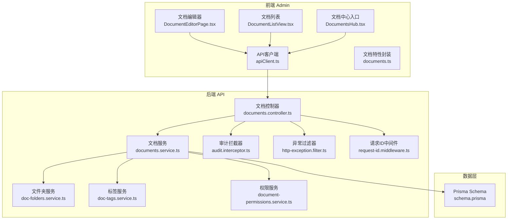
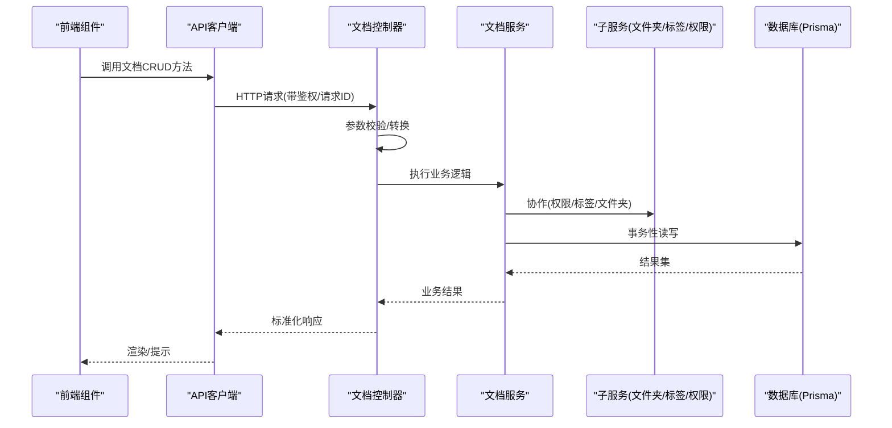
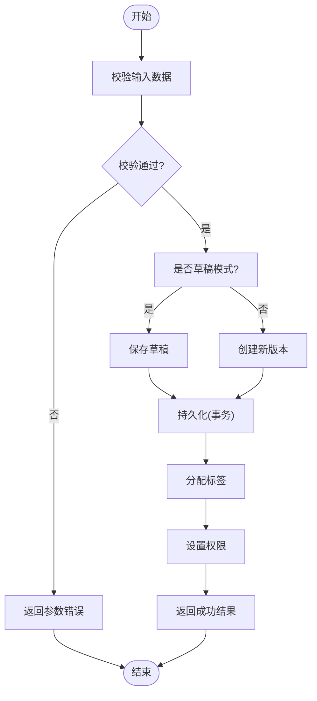
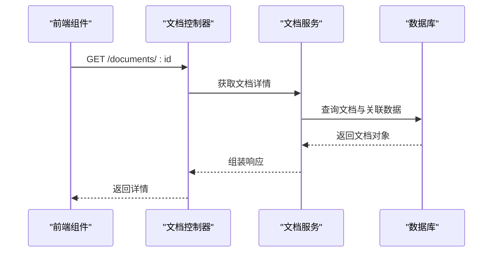
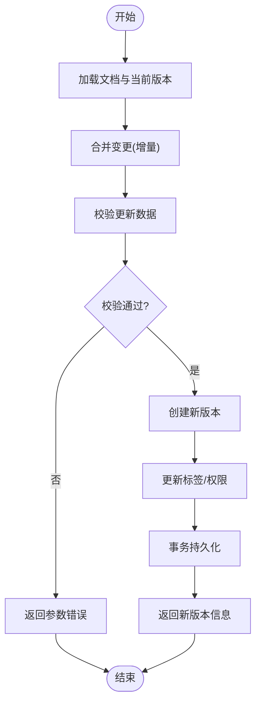
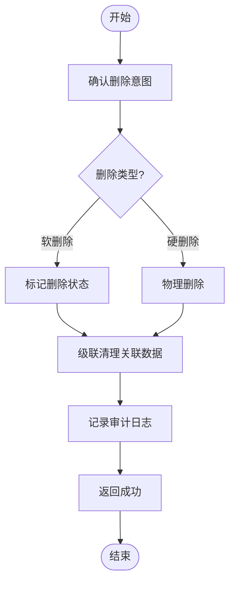
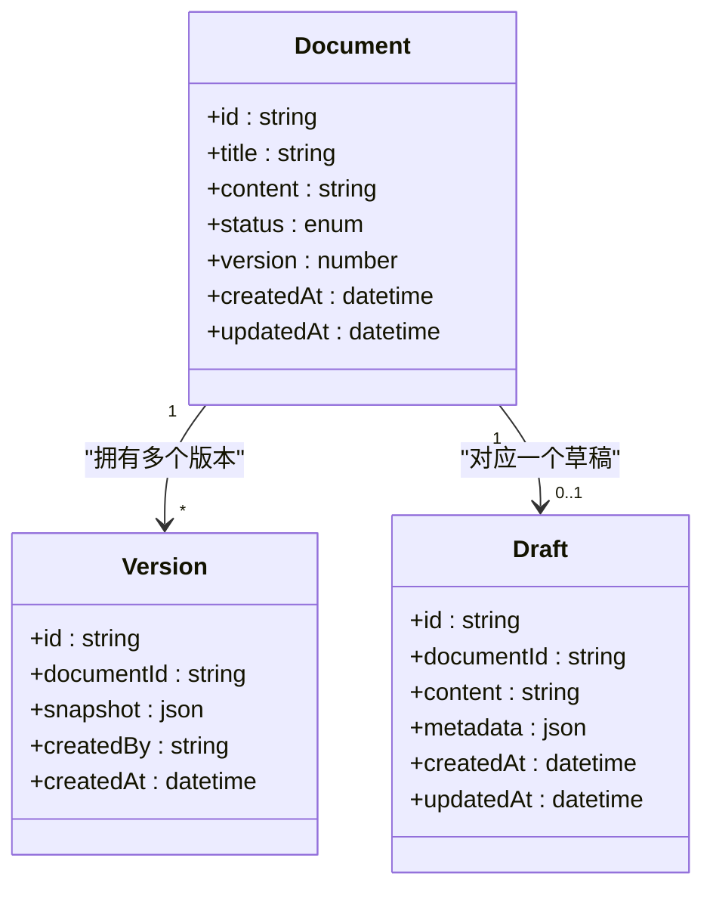
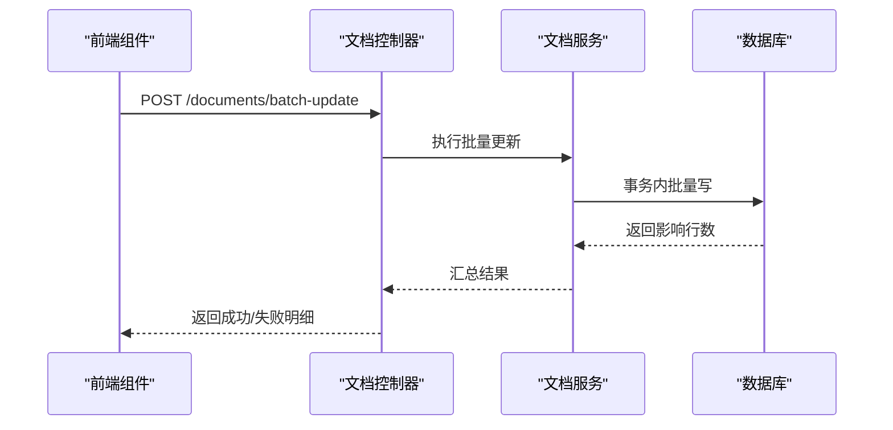
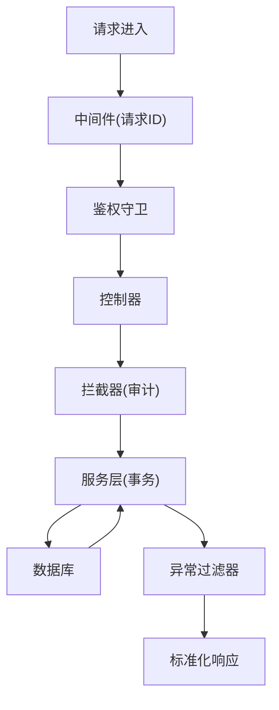
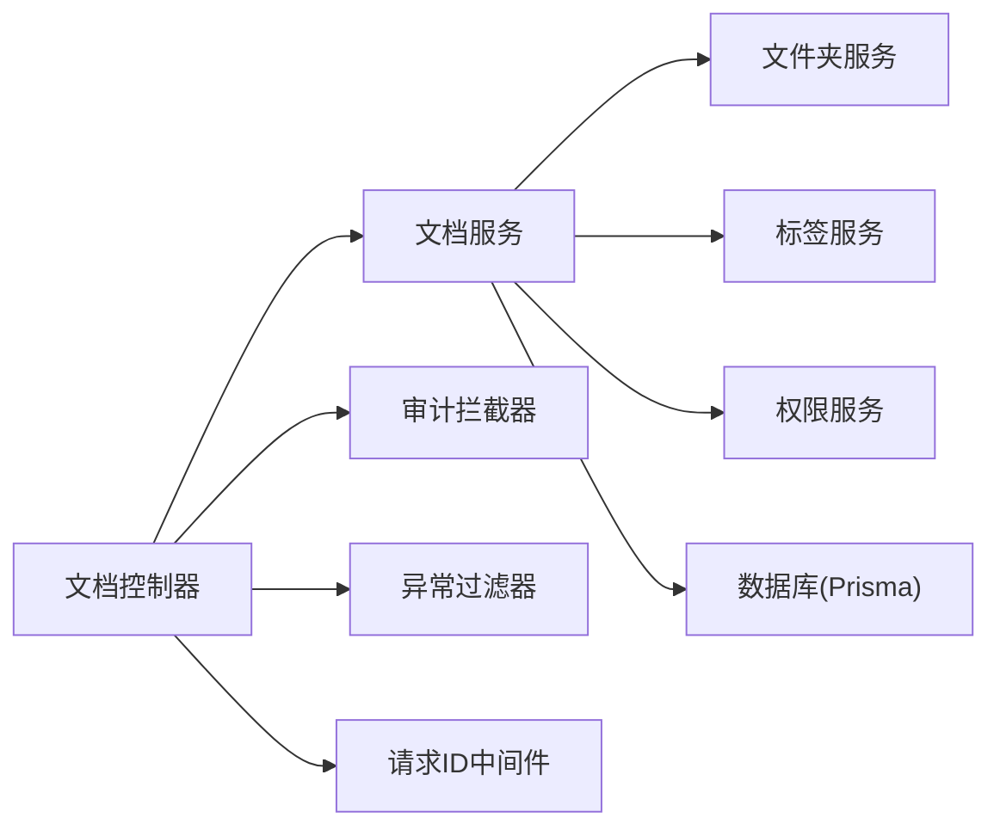

# 文档CRUD操作

<cite>
**本文引用的文件**   
- [documents.controller.ts](file://apps/api/src/documents/documents.controller.ts)
- [documents.service.ts](file://apps/api/src/documents/documents.service.ts)
- [document.dto.ts](file://apps/api/src/documents/dto/document.dto.ts)
- [document-permission.dto.ts](file://apps/api/src/documents/dto/document-permission.dto.ts)
- [doc-folders.service.ts](file://apps/api/src/documents/doc-folders.service.ts)
- [doc-tags.service.ts](file://apps/api/src/documents/doc-tags.service.ts)
- [document-permissions.service.ts](file://apps/api/src/documents/document-permissions.service.ts)
- [schema.prisma](file://apps/api/prisma/schema.prisma)
- [content-status.enum.ts](file://apps/api/src/common/enums/content-status.enum.ts)
- [audit.interceptor.ts](file://apps/api/src/common/interceptors/audit.interceptor.ts)
- [http-exception.filter.ts](file://apps/api/src/common/filters/http-exception.filter.ts)
- [request-id.middleware.ts](file://apps/api/src/common/middleware/request-id.middleware.ts)
- [apiClient.ts](file://apps/admin/src/lib/apiClient.ts)
- [documents.ts](file://apps/admin/src/features/documents.ts)
- [DocumentEditorPage.tsx](file://apps/admin/src/components/documents/DocumentEditorPage.tsx)
- [DocumentListView.tsx](file://apps/admin/src/components/documents/DocumentListView.tsx)
- [DocumentsHub.tsx](file://apps/admin/src/components/documents/DocumentsHub.tsx)
</cite>

## 目录
1. [简介](#简介)
2. [项目结构](#项目结构)
3. [核心组件](#核心组件)
4. [架构总览](#架构总览)
5. [详细组件分析](#详细组件分析)
6. [依赖关系分析](#依赖关系分析)
7. [性能考虑](#性能考虑)
8. [故障排查指南](#故障排查指南)
9. [结论](#结论)
10. [附录](#附录)

## 简介
本文件面向“文档”模块的完整CRUD流程，覆盖创建、读取、更新与删除操作；详细说明数据模型、字段校验与业务规则；解释版本控制、草稿保存与批量操作能力；提供RESTful API接口规范、错误处理与事务管理策略，形成标准化的文档数据管理解决方案。读者可据此快速理解前后端交互、服务层逻辑与数据库模型设计。

## 项目结构
文档功能在前后端均有实现：
- 前端（Admin）：页面与组件负责用户交互、表单编辑、列表展示、权限对话框等，并通过统一的API客户端调用后端接口。
- 后端（API）：基于NestJS模块化组织，包含控制器、服务、DTO、中间件、拦截器、过滤器以及Prisma数据访问层。
- 数据库：使用Prisma进行ORM建模与迁移管理。

图表来源
- [DocumentEditorPage.tsx](file://apps/admin/src/components/documents/DocumentEditorPage.tsx)
- [DocumentListView.tsx](file://apps/admin/src/components/documents/DocumentListView.tsx)
- [DocumentsHub.tsx](file://apps/admin/src/components/documents/DocumentsHub.tsx)
- [apiClient.ts](file://apps/admin/src/lib/apiClient.ts)
- [documents.ts](file://apps/admin/src/features/documents.ts)
- [documents.controller.ts](file://apps/api/src/documents/documents.controller.ts)
- [documents.service.ts](file://apps/api/src/documents/documents.service.ts)
- [doc-folders.service.ts](file://apps/api/src/documents/doc-folders.service.ts)
- [doc-tags.service.ts](file://apps/api/src/documents/doc-tags.service.ts)
- [document-permissions.service.ts](file://apps/api/src/documents/document-permissions.service.ts)
- [schema.prisma](file://apps/api/prisma/schema.prisma)
- [audit.interceptor.ts](file://apps/api/src/common/interceptors/audit.interceptor.ts)
- [http-exception.filter.ts](file://apps/api/src/common/filters/http-exception.filter.ts)
- [request-id.middleware.ts](file://apps/api/src/common/middleware/request-id.middleware.ts)

章节来源
- [documents.controller.ts](file://apps/api/src/documents/documents.controller.ts)
- [documents.service.ts](file://apps/api/src/documents/documents.service.ts)
- [schema.prisma](file://apps/api/prisma/schema.prisma)

## 核心组件
- 控制器（Controller）：暴露RESTful路由，接收并校验请求参数，委派给服务层处理，统一返回格式。
- 服务（Service）：实现文档CRUD、版本控制、草稿保存、权限与标签管理、文件夹归属等业务逻辑，协调多个子服务。
- DTO：定义输入输出数据结构与校验规则，确保接口契约稳定。
- 数据模型（Schema）：通过Prisma定义实体、关系与约束，支撑查询与事务。
- 横切关注点：审计日志、异常过滤、请求ID追踪贯穿请求生命周期。

章节来源
- [documents.controller.ts](file://apps/api/src/documents/documents.controller.ts)
- [documents.service.ts](file://apps/api/src/documents/documents.service.ts)
- [document.dto.ts](file://apps/api/src/documents/dto/document.dto.ts)
- [document-permission.dto.ts](file://apps/api/src/documents/dto/document-permission.dto.ts)
- [schema.prisma](file://apps/api/prisma/schema.prisma)

## 架构总览
文档模块采用分层架构：前端通过API客户端发起HTTP请求，由控制器路由到服务层，服务层组合多个子服务完成业务编排，最终通过Prisma访问数据库。横切能力（审计、异常、请求ID）以中间件、拦截器、过滤器形式注入。

图表来源
- [documents.controller.ts](file://apps/api/src/documents/documents.controller.ts)
- [documents.service.ts](file://apps/api/src/documents/documents.service.ts)
- [doc-folders.service.ts](file://apps/api/src/documents/doc-folders.service.ts)
- [doc-tags.service.ts](file://apps/api/src/documents/doc-tags.service.ts)
- [document-permissions.service.ts](file://apps/api/src/documents/document-permissions.service.ts)
- [schema.prisma](file://apps/api/prisma/schema.prisma)

## 详细组件分析

### 数据模型与字段验证
- 文档实体：包含标题、内容、状态、作者、时间戳、排序、可见性等基础字段；支持多语言或富文本内容存储。
- 版本控制：通过版本表或内嵌版本数组记录每次变更，支持回滚与对比。
- 草稿机制：独立草稿状态或草稿表，允许未发布内容的持续编辑。
- 权限模型：细粒度到文档级别的访问控制，支持角色与用户授权。
- 标签与分类：多对多关系，便于检索与聚合。
- 文件夹归属：树形结构组织文档集合。

字段验证建议：
- 必填字段非空校验（如标题、内容）。
- 长度限制与字符集限制（如标题最大长度）。
- 状态枚举值校验（如草稿、已发布、归档）。
- 权限分配合法性校验（用户/角色存在性与有效性）。

章节来源
- [schema.prisma](file://apps/api/prisma/schema.prisma)
- [document.dto.ts](file://apps/api/src/documents/dto/document.dto.ts)
- [document-permission.dto.ts](file://apps/api/src/documents/dto/document-permission.dto.ts)
- [content-status.enum.ts](file://apps/api/src/common/enums/content-status.enum.ts)

### 创建流程（Create）
- 前端：用户在编辑器填写标题、内容、选择标签、设置权限与文件夹，提交表单。
- 后端：控制器接收请求，DTO校验通过后进入服务层；服务层根据状态决定写入草稿或正式版本；必要时初始化权限与标签关联；最后持久化并返回结果。

图表来源
- [documents.controller.ts](file://apps/api/src/documents/documents.controller.ts)
- [documents.service.ts](file://apps/api/src/documents/documents.service.ts)
- [doc-tags.service.ts](file://apps/api/src/documents/doc-tags.service.ts)
- [document-permissions.service.ts](file://apps/api/src/documents/document-permissions.service.ts)
- [schema.prisma](file://apps/api/prisma/schema.prisma)

章节来源
- [documents.controller.ts](file://apps/api/src/documents/documents.controller.ts)
- [documents.service.ts](file://apps/api/src/documents/documents.service.ts)
- [document.dto.ts](file://apps/api/src/documents/dto/document.dto.ts)

### 读取流程（Read）
- 列表查询：支持分页、筛选（状态、标签、文件夹）、排序与搜索关键词。
- 详情获取：按ID或唯一标识获取文档详情，包括版本信息、权限摘要、标签与文件夹。
- 预览与渲染：前端根据内容类型渲染Markdown或富文本，支持媒体资源嵌入。

图表来源
- [documents.controller.ts](file://apps/api/src/documents/documents.controller.ts)
- [documents.service.ts](file://apps/api/src/documents/documents.service.ts)
- [schema.prisma](file://apps/api/prisma/schema.prisma)

章节来源
- [documents.controller.ts](file://apps/api/src/documents/documents.controller.ts)
- [documents.service.ts](file://apps/api/src/documents/documents.service.ts)

### 更新流程（Update）
- 增量更新：仅更新变更字段，避免全量覆盖。
- 版本控制：每次有效更新生成新版本，保留历史快照。
- 草稿合并：将草稿合并为正式版本时触发校验与发布流程。
- 权限与标签：支持动态调整，保持与文档版本一致。

图表来源
- [documents.controller.ts](file://apps/api/src/documents/documents.controller.ts)
- [documents.service.ts](file://apps/api/src/documents/documents.service.ts)
- [doc-tags.service.ts](file://apps/api/src/documents/doc-tags.service.ts)
- [document-permissions.service.ts](file://apps/api/src/documents/document-permissions.service.ts)
- [schema.prisma](file://apps/api/prisma/schema.prisma)

章节来源
- [documents.controller.ts](file://apps/api/src/documents/documents.controller.ts)
- [documents.service.ts](file://apps/api/src/documents/documents.service.ts)

### 删除流程（Delete）
- 软删除：默认标记删除状态，保留历史数据以便恢复与审计。
- 硬删除：管理员或特定场景下执行物理删除，需二次确认。
- 级联清理：清理关联的权限、标签、媒体引用等。

图表来源
- [documents.controller.ts](file://apps/api/src/documents/documents.controller.ts)
- [documents.service.ts](file://apps/api/src/documents/documents.service.ts)
- [audit.interceptor.ts](file://apps/api/src/common/interceptors/audit.interceptor.ts)
- [schema.prisma](file://apps/api/prisma/schema.prisma)

章节来源
- [documents.controller.ts](file://apps/api/src/documents/documents.controller.ts)
- [documents.service.ts](file://apps/api/src/documents/documents.service.ts)

### 版本控制与草稿保存
- 版本策略：每次有效变更生成新版本，支持回滚至指定版本。
- 草稿机制：编辑过程中自动或手动保存草稿，避免丢失；发布前进行完整性校验。
- 并发控制：基于版本号或乐观锁防止覆盖冲突。

图表来源
- [schema.prisma](file://apps/api/prisma/schema.prisma)

章节来源
- [documents.service.ts](file://apps/api/src/documents/documents.service.ts)
- [schema.prisma](file://apps/api/prisma/schema.prisma)

### 批量操作
- 批量更新：支持对多个文档进行状态切换、标签批量添加/移除、权限批量授予。
- 批量删除：支持软/硬删除，附带审计记录。
- 事务保障：批量操作在事务中执行，保证一致性。

图表来源
- [documents.controller.ts](file://apps/api/src/documents/documents.controller.ts)
- [documents.service.ts](file://apps/api/src/documents/documents.service.ts)
- [schema.prisma](file://apps/api/prisma/schema.prisma)

章节来源
- [documents.controller.ts](file://apps/api/src/documents/documents.controller.ts)
- [documents.service.ts](file://apps/api/src/documents/documents.service.ts)

### RESTful API接口规范
- 基础路径：/api/documents
- 常用方法：
  - POST /documents：创建文档（支持草稿/正式版）
  - GET /documents/:id：获取文档详情
  - PUT /documents/:id：更新文档（增量更新，生成新版本）
  - DELETE /documents/:id：删除文档（软/硬删除）
  - POST /documents/batch-update：批量更新
  - GET /documents：列表查询（分页、筛选、排序）
- 请求头：
  - Authorization：Bearer Token（鉴权）
  - X-Request-Id：请求追踪ID（可选）
- 响应体：
  - 成功：{ code, message, data }
  - 失败：{ code, message, errors }

章节来源
- [documents.controller.ts](file://apps/api/src/documents/documents.controller.ts)
- [document.dto.ts](file://apps/api/src/documents/dto/document.dto.ts)

### 错误处理与事务管理
- 异常过滤：统一捕获并格式化异常，返回标准错误结构。
- 事务管理：服务层关键操作包裹在事务中，确保数据一致性。
- 审计日志：记录关键操作的主体、时间与结果，便于追溯。

图表来源
- [request-id.middleware.ts](file://apps/api/src/common/middleware/request-id.middleware.ts)
- [audit.interceptor.ts](file://apps/api/src/common/interceptors/audit.interceptor.ts)
- [http-exception.filter.ts](file://apps/api/src/common/filters/http-exception.filter.ts)
- [documents.service.ts](file://apps/api/src/documents/documents.service.ts)

章节来源
- [http-exception.filter.ts](file://apps/api/src/common/filters/http-exception.filter.ts)
- [audit.interceptor.ts](file://apps/api/src/common/interceptors/audit.interceptor.ts)
- [request-id.middleware.ts](file://apps/api/src/common/middleware/request-id.middleware.ts)

## 依赖关系分析
- 控制器依赖服务层，服务层依赖多个子服务（文件夹、标签、权限）与数据库。
- DTO定义输入输出契约，确保前后端数据一致性。
- 横切组件（中间件、拦截器、过滤器）解耦于业务逻辑，提升可维护性。

图表来源
- [documents.controller.ts](file://apps/api/src/documents/documents.controller.ts)
- [documents.service.ts](file://apps/api/src/documents/documents.service.ts)
- [doc-folders.service.ts](file://apps/api/src/documents/doc-folders.service.ts)
- [doc-tags.service.ts](file://apps/api/src/documents/doc-tags.service.ts)
- [document-permissions.service.ts](file://apps/api/src/documents/document-permissions.service.ts)
- [audit.interceptor.ts](file://apps/api/src/common/interceptors/audit.interceptor.ts)
- [http-exception.filter.ts](file://apps/api/src/common/filters/http-exception.filter.ts)
- [request-id.middleware.ts](file://apps/api/src/common/middleware/request-id.middleware.ts)

章节来源
- [documents.controller.ts](file://apps/api/src/documents/documents.controller.ts)
- [documents.service.ts](file://apps/api/src/documents/documents.service.ts)

## 性能考虑
- 查询优化：合理使用索引（标题、状态、标签、文件夹），避免全表扫描。
- 分页与懒加载：列表页启用分页，详情页按需加载关联数据。
- 缓存策略：热点文档可引入缓存（Redis），减少数据库压力。
- 事务粒度：尽量缩小事务范围，降低锁竞争。
- 批量操作：优先使用批量SQL，减少往返次数。

[本节为通用指导，不直接分析具体文件]

## 故障排查指南
- 常见错误：
  - 参数校验失败：检查DTO定义与前端传参。
  - 权限不足：确认用户角色与文档权限配置。
  - 版本冲突：检查并发更新逻辑与乐观锁实现。
  - 事务失败：查看数据库日志与服务层异常堆栈。
- 调试工具：
  - 请求ID追踪：通过X-Request-Id定位日志。
  - 审计日志：查看操作主体与时间线。
  - 异常过滤器：统一错误消息与堆栈信息。

章节来源
- [http-exception.filter.ts](file://apps/api/src/common/filters/http-exception.filter.ts)
- [audit.interceptor.ts](file://apps/api/src/common/interceptors/audit.interceptor.ts)
- [request-id.middleware.ts](file://apps/api/src/common/middleware/request-id.middleware.ts)

## 结论
本文档模块通过清晰的分层架构、严格的DTO校验、完善的版本控制与草稿机制、细粒度的权限管理以及健壮的异常与事务处理，提供了标准化的文档数据管理解决方案。前端组件与后端服务紧密协作，确保用户体验与数据一致性。建议在生产环境中结合缓存、监控与审计进一步提升系统稳定性与可观测性。

[本节为总结，不直接分析具体文件]

## 附录
- 前端组件参考：
  - [DocumentEditorPage.tsx](file://apps/admin/src/components/documents/DocumentEditorPage.tsx)
  - [DocumentListView.tsx](file://apps/admin/src/components/documents/DocumentListView.tsx)
  - [DocumentsHub.tsx](file://apps/admin/src/components/documents/DocumentsHub.tsx)
  - [apiClient.ts](file://apps/admin/src/lib/apiClient.ts)
  - [documents.ts](file://apps/admin/src/features/documents.ts)

章节来源
- [DocumentEditorPage.tsx](file://apps/admin/src/components/documents/DocumentEditorPage.tsx)
- [DocumentListView.tsx](file://apps/admin/src/components/documents/DocumentListView.tsx)
- [DocumentsHub.tsx](file://apps/admin/src/components/documents/DocumentsHub.tsx)
- [apiClient.ts](file://apps/admin/src/lib/apiClient.ts)
- [documents.ts](file://apps/admin/src/features/documents.ts)