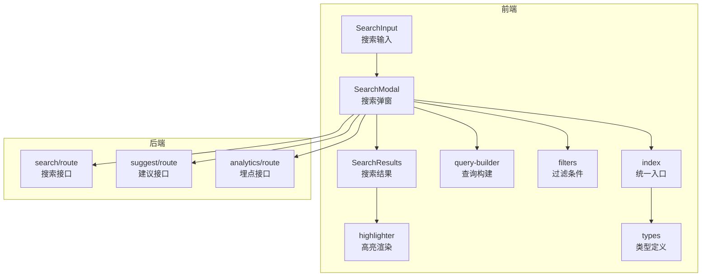
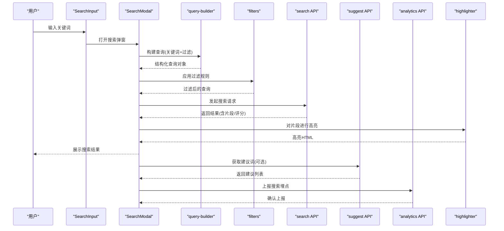
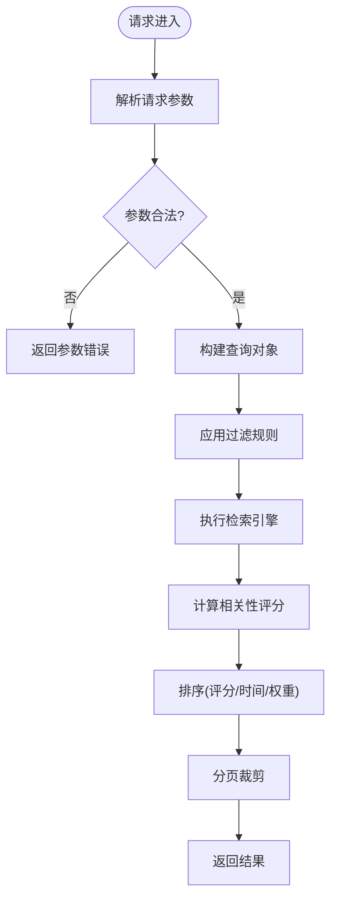
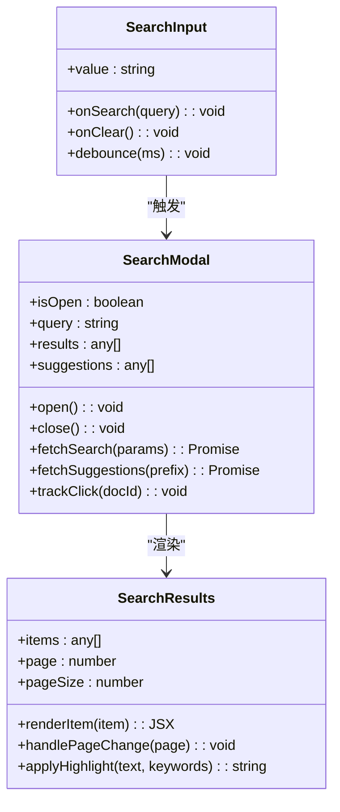
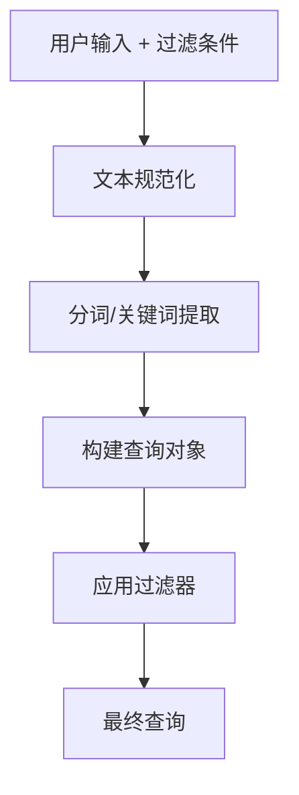
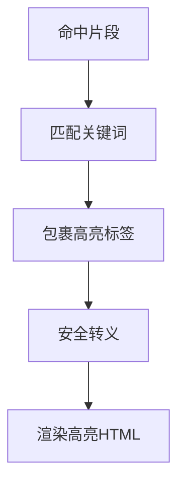
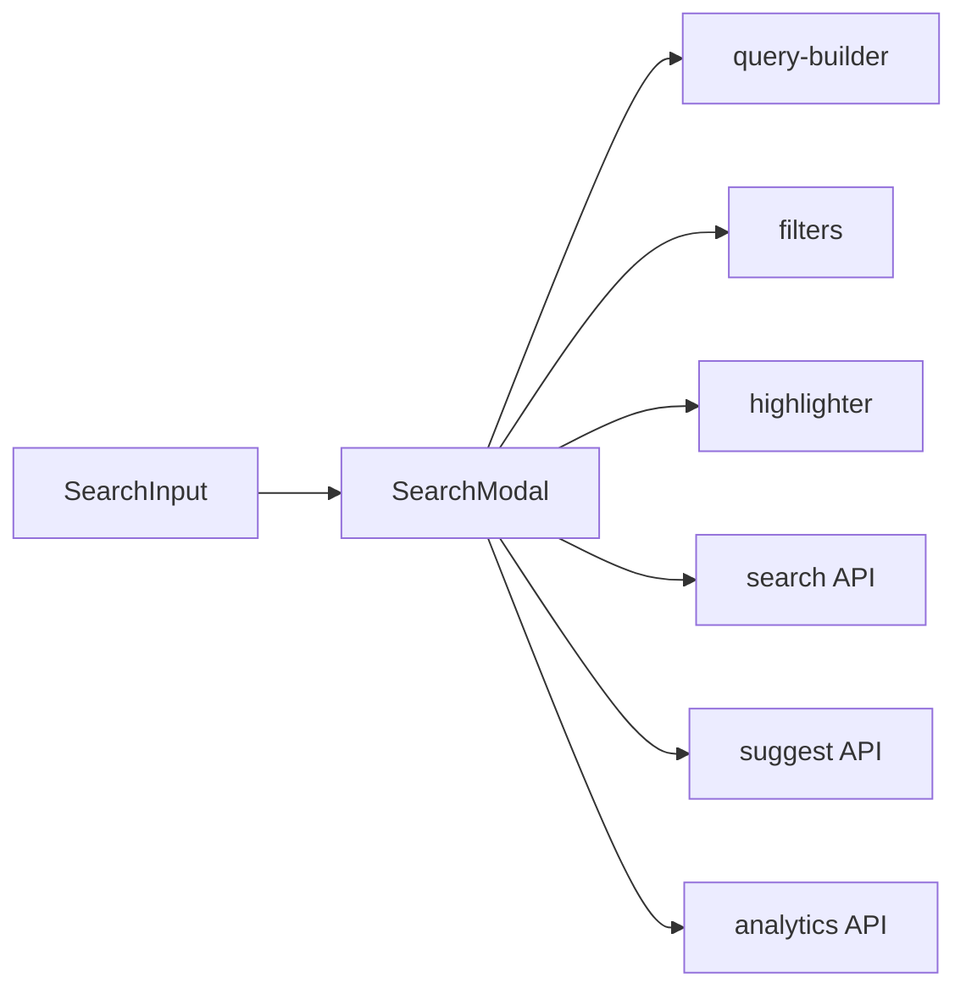

# 文档搜索功能

<cite>
**本文档引用的文件**   
- [apps/web/src/app/api/search/route.ts](file://apps/web/src/app/api/search/route.ts)
- [apps/web/src/app/api/search/suggest/route.ts](file://apps/web/src/app/api/search/suggest/route.ts)
- [apps/web/src/app/api/search/analytics/route.ts](file://apps/web/src/app/api/search/analytics/route.ts)
- [apps/web/src/components/search/SearchInput.tsx](file://apps/web/src/components/search/SearchInput.tsx)
- [apps/web/src/components/search/SearchResults.tsx](file://apps/web/src/components/search/SearchResults.tsx)
- [apps/web/src/components/search/SearchModal.tsx](file://apps/web/src/components/search/SearchModal.tsx)
- [apps/web/src/lib/search/index.ts](file://apps/web/src/lib/search/index.ts)
- [apps/web/src/lib/search/query-builder.ts](file://apps/web/src/lib/search/query-builder.ts)
- [apps/web/src/lib/search/highlighter.ts](file://apps/web/src/lib/search/highlighter.ts)
- [apps/web/src/lib/search/filters.ts](file://apps/web/src/lib/search/filters.ts)
- [apps/web/src/lib/search/types.ts](file://apps/web/src/lib/search/types.ts)
- [apps/admin/src/features/documents.ts](file://apps/admin/src/features/documents.ts)
- [apps/admin/src/components/documents/DocumentListView.tsx](file://apps/admin/src/components/documents/DocumentListView.tsx)
- [apps/admin/src/components/crud/ResourceListView.tsx](file://apps/admin/src/components/crud/ResourceListView.tsx)
</cite>

## 目录
1. [简介](#简介)
2. [项目结构](#项目结构)
3. [核心组件](#核心组件)
4. [架构总览](#架构总览)
5. [详细组件分析](#详细组件分析)
6. [依赖关系分析](#依赖关系分析)
7. [性能考虑](#性能考虑)
8. [故障排查指南](#故障排查指南)
9. [结论](#结论)
10. [附录](#附录)

## 简介
本文件面向“文档搜索”功能的实现与使用，覆盖全文检索、索引构建、查询优化、关键词匹配、模糊搜索、高级筛选、结果排序、高亮显示与相关性评分。同时给出搜索API接口说明、前端搜索组件集成方式以及性能优化策略，帮助快速搭建高效的文档检索体验。

## 项目结构
搜索能力由前后端协同实现：
- 后端提供REST API用于搜索、建议与埋点统计
- 前端包含搜索输入、弹窗、结果展示等交互组件
- 公共库封装查询构建、过滤、高亮与类型定义

图表来源
- [apps/web/src/components/search/SearchInput.tsx](file://apps/web/src/components/search/SearchInput.tsx)
- [apps/web/src/components/search/SearchModal.tsx](file://apps/web/src/components/search/SearchModal.tsx)
- [apps/web/src/components/search/SearchResults.tsx](file://apps/web/src/components/search/SearchResults.tsx)
- [apps/web/src/lib/search/query-builder.ts](file://apps/web/src/lib/search/query-builder.ts)
- [apps/web/src/lib/search/filters.ts](file://apps/web/src/lib/search/filters.ts)
- [apps/web/src/lib/search/highlighter.ts](file://apps/web/src/lib/search/highlighter.ts)
- [apps/web/src/lib/search/index.ts](file://apps/web/src/lib/search/index.ts)
- [apps/web/src/lib/search/types.ts](file://apps/web/src/lib/search/types.ts)
- [apps/web/src/app/api/search/route.ts](file://apps/web/src/app/api/search/route.ts)
- [apps/web/src/app/api/search/suggest/route.ts](file://apps/web/src/app/api/search/suggest/route.ts)
- [apps/web/src/app/api/search/analytics/route.ts](file://apps/web/src/app/api/search/analytics/route.ts)

章节来源
- [apps/web/src/app/api/search/route.ts](file://apps/web/src/app/api/search/route.ts)
- [apps/web/src/app/api/search/suggest/route.ts](file://apps/web/src/app/api/search/suggest/route.ts)
- [apps/web/src/app/api/search/analytics/route.ts](file://apps/web/src/app/api/search/analytics/route.ts)
- [apps/web/src/components/search/SearchInput.tsx](file://apps/web/src/components/search/SearchInput.tsx)
- [apps/web/src/components/search/SearchModal.tsx](file://apps/web/src/components/search/SearchModal.tsx)
- [apps/web/src/components/search/SearchResults.tsx](file://apps/web/src/components/search/SearchResults.tsx)
- [apps/web/src/lib/search/index.ts](file://apps/web/src/lib/search/index.ts)
- [apps/web/src/lib/search/query-builder.ts](file://apps/web/src/lib/search/query-builder.ts)
- [apps/web/src/lib/search/highlighter.ts](file://apps/web/src/lib/search/highlighter.ts)
- [apps/web/src/lib/search/filters.ts](file://apps/web/src/lib/search/filters.ts)
- [apps/web/src/lib/search/types.ts](file://apps/web/src/lib/search/types.ts)

## 核心组件
- 搜索API层
  - 搜索接口：接收查询词、分页、排序、过滤参数，返回命中文档列表与元数据
  - 建议接口：基于输入前缀返回候选词或标题片段
  - 埋点接口：记录搜索行为（查询词、结果数、点击项）
- 前端组件层
  - SearchInput：输入框、防抖、快捷键触发
  - SearchModal：弹窗容器、状态管理、调用API、展示结果
  - SearchResults：结果列表、分页、跳转、高亮片段
- 公共库层
  - query-builder：将用户输入与过滤条件转换为结构化查询
  - filters：字段级过滤（类型、时间、标签、作者等）
  - highlighter：对命中片段进行高亮标记
  - types：统一的请求/响应类型定义
  - index：对外暴露的统一方法（搜索、建议、埋点）

章节来源
- [apps/web/src/app/api/search/route.ts](file://apps/web/src/app/api/search/route.ts)
- [apps/web/src/app/api/search/suggest/route.ts](file://apps/web/src/app/api/search/suggest/route.ts)
- [apps/web/src/app/api/search/analytics/route.ts](file://apps/web/src/app/api/search/analytics/route.ts)
- [apps/web/src/components/search/SearchInput.tsx](file://apps/web/src/components/search/SearchInput.tsx)
- [apps/web/src/components/search/SearchModal.tsx](file://apps/web/src/components/search/SearchModal.tsx)
- [apps/web/src/components/search/SearchResults.tsx](file://apps/web/src/components/search/SearchResults.tsx)
- [apps/web/src/lib/search/query-builder.ts](file://apps/web/src/lib/search/query-builder.ts)
- [apps/web/src/lib/search/filters.ts](file://apps/web/src/lib/search/filters.ts)
- [apps/web/src/lib/search/highlighter.ts](file://apps/web/src/lib/search/highlighter.ts)
- [apps/web/src/lib/search/types.ts](file://apps/web/src/lib/search/types.ts)
- [apps/web/src/lib/search/index.ts](file://apps/web/src/lib/search/index.ts)

## 架构总览
搜索流程从前端输入开始，经过查询构建与过滤，调用后端搜索与建议接口，返回结果后在前端进行高亮与排序展示；同时记录埋点用于后续分析与优化。

图表来源
- [apps/web/src/components/search/SearchInput.tsx](file://apps/web/src/components/search/SearchInput.tsx)
- [apps/web/src/components/search/SearchModal.tsx](file://apps/web/src/components/search/SearchModal.tsx)
- [apps/web/src/lib/search/query-builder.ts](file://apps/web/src/lib/search/query-builder.ts)
- [apps/web/src/lib/search/filters.ts](file://apps/web/src/lib/search/filters.ts)
- [apps/web/src/lib/search/highlighter.ts](file://apps/web/src/lib/search/highlighter.ts)
- [apps/web/src/app/api/search/route.ts](file://apps/web/src/app/api/search/route.ts)
- [apps/web/src/app/api/search/suggest/route.ts](file://apps/web/src/app/api/search/suggest/route.ts)
- [apps/web/src/app/api/search/analytics/route.ts](file://apps/web/src/app/api/search/analytics/route.ts)

## 详细组件分析

### 搜索API接口
- 搜索接口
  - 入参：关键词、分页（页码、每页条数）、排序（字段、方向）、过滤（类型、时间范围、标签、作者等）
  - 出参：文档列表（标题、摘要、链接、评分、命中片段）、总数、是否还有下一页
  - 处理逻辑：解析查询→应用过滤→执行检索→计算相关性评分→排序→分页→返回
- 建议接口
  - 入参：前缀字符串、限制数量
  - 出参：候选词或标题片段列表
- 埋点接口
  - 入参：查询词、结果数、点击的文档ID、会话ID等
  - 出参：成功状态

图表来源
- [apps/web/src/app/api/search/route.ts](file://apps/web/src/app/api/search/route.ts)
- [apps/web/src/app/api/search/suggest/route.ts](file://apps/web/src/app/api/search/suggest/route.ts)
- [apps/web/src/app/api/search/analytics/route.ts](file://apps/web/src/app/api/search/analytics/route.ts)

章节来源
- [apps/web/src/app/api/search/route.ts](file://apps/web/src/app/api/search/route.ts)
- [apps/web/src/app/api/search/suggest/route.ts](file://apps/web/src/app/api/search/suggest/route.ts)
- [apps/web/src/app/api/search/analytics/route.ts](file://apps/web/src/app/api/search/analytics/route.ts)

### 前端搜索组件
- SearchInput
  - 职责：接收用户输入、防抖、快捷键触发搜索弹窗
  - 关键点：输入节流、最小长度阈值、清空按钮、无障碍支持
- SearchModal
  - 职责：弹窗容器、状态管理、调用搜索与建议API、展示结果、处理键盘导航
  - 关键点：防抖请求、取消重复请求、加载态、空结果提示、错误重试
- SearchResults
  - 职责：渲染结果列表、分页、跳转详情、高亮片段
  - 关键点：虚拟滚动（大数据量）、片段截取、高亮样式、点击埋点

图表来源
- [apps/web/src/components/search/SearchInput.tsx](file://apps/web/src/components/search/SearchInput.tsx)
- [apps/web/src/components/search/SearchModal.tsx](file://apps/web/src/components/search/SearchModal.tsx)
- [apps/web/src/components/search/SearchResults.tsx](file://apps/web/src/components/search/SearchResults.tsx)

章节来源
- [apps/web/src/components/search/SearchInput.tsx](file://apps/web/src/components/search/SearchInput.tsx)
- [apps/web/src/components/search/SearchModal.tsx](file://apps/web/src/components/search/SearchModal.tsx)
- [apps/web/src/components/search/SearchResults.tsx](file://apps/web/src/components/search/SearchResults.tsx)

### 查询构建与过滤
- query-builder
  - 职责：将用户输入与过滤条件组合为结构化查询对象
  - 关键点：分词策略、布尔表达式、字段映射、默认值填充
- filters
  - 职责：按字段过滤（类型、时间、标签、作者、状态等）
  - 关键点：范围查询、多值匹配、大小写与空格规范化

图表来源
- [apps/web/src/lib/search/query-builder.ts](file://apps/web/src/lib/search/query-builder.ts)
- [apps/web/src/lib/search/filters.ts](file://apps/web/src/lib/search/filters.ts)

章节来源
- [apps/web/src/lib/search/query-builder.ts](file://apps/web/src/lib/search/query-builder.ts)
- [apps/web/src/lib/search/filters.ts](file://apps/web/src/lib/search/filters.ts)

### 高亮与相关性评分
- highlighter
  - 职责：对命中片段进行高亮标记，避免破坏原有HTML结构
  - 关键点：正则匹配、安全转义、片段裁剪、样式注入
- 相关性评分
  - 维度：关键词命中位置、标题/正文权重、发布时间衰减、用户行为加权
  - 输出：每个结果的评分字段，用于排序与展示

图表来源
- [apps/web/src/lib/search/highlighter.ts](file://apps/web/src/lib/search/highlighter.ts)

章节来源
- [apps/web/src/lib/search/highlighter.ts](file://apps/web/src/lib/search/highlighter.ts)

### 类型定义与统一入口
- types
  - 职责：定义搜索请求、响应、过滤条件、建议与埋点的类型
  - 关键点：严格校验、扩展性设计
- index
  - 职责：对外暴露搜索、建议、埋点等方法，屏蔽内部实现细节

章节来源
- [apps/web/src/lib/search/types.ts](file://apps/web/src/lib/search/types.ts)
- [apps/web/src/lib/search/index.ts](file://apps/web/src/lib/search/index.ts)

### 后台管理中的文档搜索
- features/documents
  - 职责：封装文档相关的CRUD与搜索能力，供页面与表格复用
- DocumentListView / ResourceListView
  - 职责：在列表页中集成搜索栏、过滤、排序与分页

章节来源
- [apps/admin/src/features/documents.ts](file://apps/admin/src/features/documents.ts)
- [apps/admin/src/components/documents/DocumentListView.tsx](file://apps/admin/src/components/documents/DocumentListView.tsx)
- [apps/admin/src/components/crud/ResourceListView.tsx](file://apps/admin/src/components/crud/ResourceListView.tsx)

## 依赖关系分析
- 前端组件依赖公共库（查询构建、过滤、高亮、类型），并通过API路由与后端通信
- 后端API之间相对独立，建议与埋点可异步调用，不影响主搜索路径

图表来源
- [apps/web/src/components/search/SearchInput.tsx](file://apps/web/src/components/search/SearchInput.tsx)
- [apps/web/src/components/search/SearchModal.tsx](file://apps/web/src/components/search/SearchModal.tsx)
- [apps/web/src/lib/search/query-builder.ts](file://apps/web/src/lib/search/query-builder.ts)
- [apps/web/src/lib/search/filters.ts](file://apps/web/src/lib/search/filters.ts)
- [apps/web/src/lib/search/highlighter.ts](file://apps/web/src/lib/search/highlighter.ts)
- [apps/web/src/app/api/search/route.ts](file://apps/web/src/app/api/search/route.ts)
- [apps/web/src/app/api/search/suggest/route.ts](file://apps/web/src/app/api/search/suggest/route.ts)
- [apps/web/src/app/api/search/analytics/route.ts](file://apps/web/src/app/api/search/analytics/route.ts)

章节来源
- [apps/web/src/components/search/SearchInput.tsx](file://apps/web/src/components/search/SearchInput.tsx)
- [apps/web/src/components/search/SearchModal.tsx](file://apps/web/src/components/search/SearchModal.tsx)
- [apps/web/src/lib/search/query-builder.ts](file://apps/web/src/lib/search/query-builder.ts)
- [apps/web/src/lib/search/filters.ts](file://apps/web/src/lib/search/filters.ts)
- [apps/web/src/lib/search/highlighter.ts](file://apps/web/src/lib/search/highlighter.ts)
- [apps/web/src/app/api/search/route.ts](file://apps/web/src/app/api/search/route.ts)
- [apps/web/src/app/api/search/suggest/route.ts](file://apps/web/src/app/api/search/suggest/route.ts)
- [apps/web/src/app/api/search/analytics/route.ts](file://apps/web/src/app/api/search/analytics/route.ts)

## 性能考虑
- 前端优化
  - 输入防抖与最小长度阈值，减少无效请求
  - 取消重复请求（AbortController），避免竞态
  - 结果列表虚拟化渲染，降低DOM压力
  - 高亮片段按需生成，避免全量重绘
- 后端优化
  - 查询缓存（热点词、短查询）
  - 分页与限制返回字段，减少传输体积
  - 异步埋点上报，不阻塞主流程
  - 建议接口限流与缓存
- 索引与检索
  - 增量更新索引，发布时触发重建
  - 分词与倒排索引优化，提升匹配速度
  - 相关性评分预计算与缓存

[本节为通用指导，无需引用具体文件]

## 故障排查指南
- 常见问题
  - 无结果：检查关键词分词、过滤条件是否过严、索引是否最新
  - 结果不准确：调整相关性权重、标题/正文权重、时间衰减因子
  - 高亮异常：确认片段安全转义、HTML结构未被破坏
  - 建议不生效：检查前缀长度、缓存键、限流策略
- 定位步骤
  - 查看网络请求参数与响应体
  - 检查前端日志与埋点上报
  - 核对过滤规则与排序配置
  - 验证索引构建任务状态

章节来源
- [apps/web/src/app/api/search/route.ts](file://apps/web/src/app/api/search/route.ts)
- [apps/web/src/app/api/search/suggest/route.ts](file://apps/web/src/app/api/search/suggest/route.ts)
- [apps/web/src/app/api/search/analytics/route.ts](file://apps/web/src/app/api/search/analytics/route.ts)
- [apps/web/src/components/search/SearchModal.tsx](file://apps/web/src/components/search/SearchModal.tsx)
- [apps/web/src/components/search/SearchResults.tsx](file://apps/web/src/components/search/SearchResults.tsx)
- [apps/web/src/lib/search/highlighter.ts](file://apps/web/src/lib/search/highlighter.ts)

## 结论
通过前后端协作与公共库封装，文档搜索功能实现了高效、可扩展的检索体验。结合关键词匹配、模糊搜索、高级筛选、相关性评分与高亮展示，能够满足复杂场景下的文档查找需求。配合性能优化与故障排查策略，可进一步提升稳定性与用户体验。

[本节为总结性内容，无需引用具体文件]

## 附录
- 最佳实践
  - 统一查询构建与过滤规则，确保一致性
  - 合理设置分页与限制，避免大结果集
  - 埋点完善，持续优化搜索质量
  - 索引增量更新，保障实时性与一致性
- 扩展方向
  - 向量检索与语义搜索
  - 多语言分词与同义词扩展
  - 个性化排序与推荐

[本节为补充信息，无需引用具体文件]