# 文档文件夹管理

<cite>
**本文引用的文件**   
- [doc-folders.service.ts](file://apps/api/src/documents/doc-folders.service.ts)
- [documents.controller.ts](file://apps/api/src/documents/documents.controller.ts)
- [documents.service.ts](file://apps/api/src/documents/documents.service.ts)
- [document-permissions.service.ts](file://apps/api/src/documents/document-permissions.service.ts)
- [document.dto.ts](file://apps/api/src/documents/dto/document.dto.ts)
- [document-permission.dto.ts](file://apps/api/src/documents/dto/document-permission.dto.ts)
- [DocFolderSidebar.tsx](file://apps/admin/src/components/documents/DocFolderSidebar.tsx)
- [DocumentsHub.tsx](file://apps/admin/src/components/documents/DocumentsHub.tsx)
- [DocumentMoveDialog.tsx](file://apps/admin/src/components/documents/DocumentMoveDialog.tsx)
- [DocumentPermissionButton.tsx](file://apps/admin/src/components/DocumentPermissionButton.tsx)
- [DocumentPermissionDialog.tsx](file://apps/admin/src/components/DocumentPermissionDialog.tsx)
- [documents.ts](file://apps/admin/src/features/documents.ts)
- [schema.prisma](file://apps/api/prisma/schema.prisma)
</cite>

## 目录
1. [简介](#简介)
2. [项目结构](#项目结构)
3. [核心组件](#核心组件)
4. [架构总览](#架构总览)
5. [详细组件分析](#详细组件分析)
6. [依赖关系分析](#依赖关系分析)
7. [性能考虑](#性能考虑)
8. [故障排查指南](#故障排查指南)
9. [结论](#结论)
10. [附录](#附录)

## 简介
本文件系统围绕“文档文件夹管理”展开，提供文件夹的层级结构、CRUD 操作、权限控制机制，以及前端树形展示、拖拽排序、批量操作与搜索能力。系统通过后端 NestJS 模块与 Prisma 数据模型实现文件夹与文档的关联、继承权限与共享机制；前端 Next.js Admin 应用提供交互式 UI，包括侧边栏文件夹树、文档列表、移动对话框、权限设置等。

## 项目结构
- 后端（NestJS）
  - 文档与文件夹：controllers/services/dtos 位于 apps/api/src/documents
  - 权限：基于角色的访问控制与资源级权限服务
  - 数据模型：Prisma schema 定义文件夹、文档、权限等实体
- 前端（Next.js Admin）
  - 文档相关组件：components/documents
  - 通用权限按钮与对话框：components/DocumentPermission*.tsx
  - 功能聚合与 API 调用封装：features/documents.ts

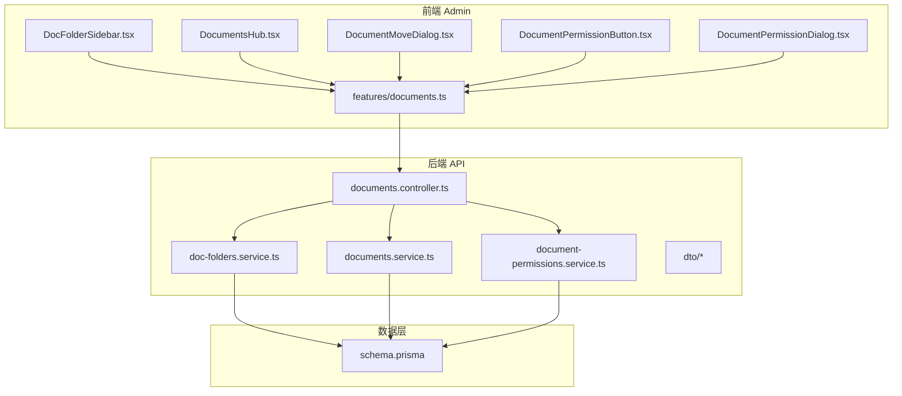

**图表来源** 
- [documents.controller.ts](file://apps/api/src/documents/documents.controller.ts)
- [doc-folders.service.ts](file://apps/api/src/documents/doc-folders.service.ts)
- [documents.service.ts](file://apps/api/src/documents/documents.service.ts)
- [document-permissions.service.ts](file://apps/api/src/documents/document-permissions.service.ts)
- [schema.prisma](file://apps/api/prisma/schema.prisma)
- [DocFolderSidebar.tsx](file://apps/admin/src/components/documents/DocFolderSidebar.tsx)
- [DocumentsHub.tsx](file://apps/admin/src/components/documents/DocumentsHub.tsx)
- [DocumentMoveDialog.tsx](file://apps/admin/src/components/documents/DocumentMoveDialog.tsx)
- [DocumentPermissionButton.tsx](file://apps/admin/src/components/DocumentPermissionButton.tsx)
- [DocumentPermissionDialog.tsx](file://apps/admin/src/components/DocumentPermissionDialog.tsx)
- [documents.ts](file://apps/admin/src/features/documents.ts)

**章节来源**
- [documents.controller.ts](file://apps/api/src/documents/documents.controller.ts)
- [doc-folders.service.ts](file://apps/api/src/documents/doc-folders.service.ts)
- [documents.service.ts](file://apps/api/src/documents/documents.service.ts)
- [document-permissions.service.ts](file://apps/api/src/documents/document-permissions.service.ts)
- [schema.prisma](file://apps/api/prisma/schema.prisma)
- [DocFolderSidebar.tsx](file://apps/admin/src/components/documents/DocFolderSidebar.tsx)
- [DocumentsHub.tsx](file://apps/admin/src/components/documents/DocumentsHub.tsx)
- [DocumentMoveDialog.tsx](file://apps/admin/src/components/documents/DocumentMoveDialog.tsx)
- [DocumentPermissionButton.tsx](file://apps/admin/src/components/DocumentPermissionButton.tsx)
- [DocumentPermissionDialog.tsx](file://apps/admin/src/components/DocumentPermissionDialog.tsx)
- [documents.ts](file://apps/admin/src/features/documents.ts)

## 核心组件
- 文件夹服务（doc-folders.service.ts）
  - 负责文件夹的创建、更新、删除、查询、层级构建与排序维护
  - 支持按父节点获取子节点、路径计算、深度限制等
- 文档服务（documents.service.ts）
  - 负责文档的 CRUD、与文件夹的关联、批量操作、搜索过滤
- 权限服务（document-permissions.service.ts）
  - 管理文档与文件夹的资源级权限，支持继承与覆盖策略
- 控制器（documents.controller.ts）
  - 暴露 RESTful 接口，统一鉴权、参数校验、响应转换
- 前端组件
  - DocFolderSidebar.tsx：渲染文件夹树、支持展开/折叠、拖拽排序
  - DocumentsHub.tsx：文档列表、批量选择、搜索、分页
  - DocumentMoveDialog.tsx：将文档移动到目标文件夹
  - DocumentPermissionButton.tsx / DocumentPermissionDialog.tsx：设置与查看权限

**章节来源**
- [doc-folders.service.ts](file://apps/api/src/documents/doc-folders.service.ts)
- [documents.service.ts](file://apps/api/src/documents/documents.service.ts)
- [document-permissions.service.ts](file://apps/api/src/documents/document-permissions.service.ts)
- [documents.controller.ts](file://apps/api/src/documents/documents.controller.ts)
- [DocFolderSidebar.tsx](file://apps/admin/src/components/documents/DocFolderSidebar.tsx)
- [DocumentsHub.tsx](file://apps/admin/src/components/documents/DocumentsHub.tsx)
- [DocumentMoveDialog.tsx](file://apps/admin/src/components/documents/DocumentMoveDialog.tsx)
- [DocumentPermissionButton.tsx](file://apps/admin/src/components/DocumentPermissionButton.tsx)
- [DocumentPermissionDialog.tsx](file://apps/admin/src/components/DocumentPermissionDialog.tsx)

## 架构总览
系统采用前后端分离架构：
- 前端通过 features/documents.ts 封装 API 调用，驱动 UI 状态与交互
- 后端控制器接收请求，委派至对应服务处理业务逻辑
- 数据层由 Prisma 管理，确保数据一致性与约束

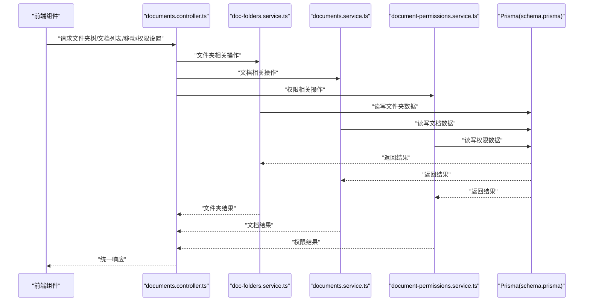

**图表来源** 
- [documents.controller.ts](file://apps/api/src/documents/documents.controller.ts)
- [doc-folders.service.ts](file://apps/api/src/documents/doc-folders.service.ts)
- [documents.service.ts](file://apps/api/src/documents/documents.service.ts)
- [document-permissions.service.ts](file://apps/api/src/documents/document-permissions.service.ts)
- [schema.prisma](file://apps/api/prisma/schema.prisma)

## 详细组件分析

### 文件夹服务（doc-folders.service.ts）
- 职责
  - 文件夹的增删改查、层级构建、路径与深度管理
  - 排序字段维护（如 orderIndex），支持拖拽后重排
- 关键流程
  - 创建文件夹：校验父节点存在性、深度限制、唯一性
  - 更新/删除：级联处理子节点或阻止删除有子节点的文件夹
  - 查询：按父节点递归构建树形结构，返回扁平或嵌套格式
  - 排序：根据拖拽事件更新 orderIndex，保证同级顺序稳定

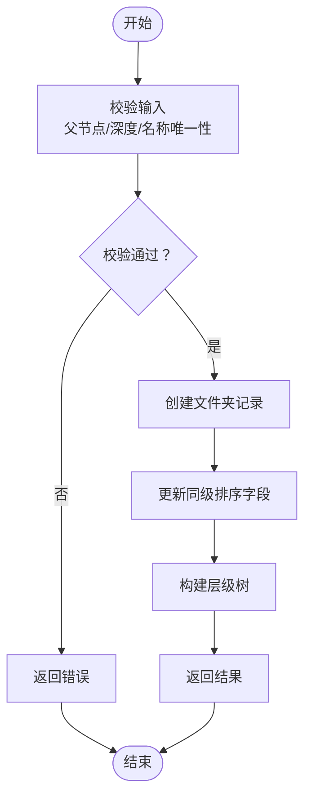

**图表来源** 
- [doc-folders.service.ts](file://apps/api/src/documents/doc-folders.service.ts)

**章节来源**
- [doc-folders.service.ts](file://apps/api/src/documents/doc-folders.service.ts)

### 文档服务（documents.service.ts）
- 职责
  - 文档的增删改查、与文件夹关联、批量操作、搜索过滤
- 关键流程
  - 创建文档：校验标题、内容、所属文件夹权限
  - 更新/删除：检查引用与权限，必要时级联处理
  - 批量操作：批量移动、批量删除、批量更新标签等
  - 搜索：按标题、内容、标签、文件夹路径等多条件筛选

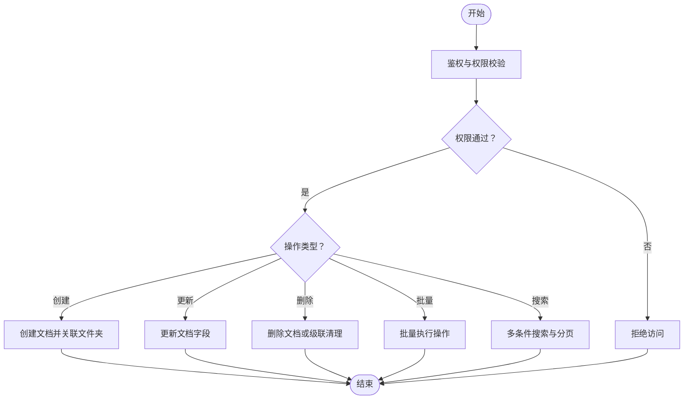

**图表来源** 
- [documents.service.ts](file://apps/api/src/documents/documents.service.ts)

**章节来源**
- [documents.service.ts](file://apps/api/src/documents/documents.service.ts)

### 权限服务（document-permissions.service.ts）
- 职责
  - 资源级权限管理（文档/文件夹），支持继承与覆盖
  - 角色与用户维度的授权、撤销、查询
- 关键流程
  - 设置权限：校验角色/用户有效性、权限粒度（读/写/管理）
  - 继承策略：子节点默认继承父节点权限，可被显式覆盖
  - 权限判定：合并继承与显式权限，计算最终有效权限集

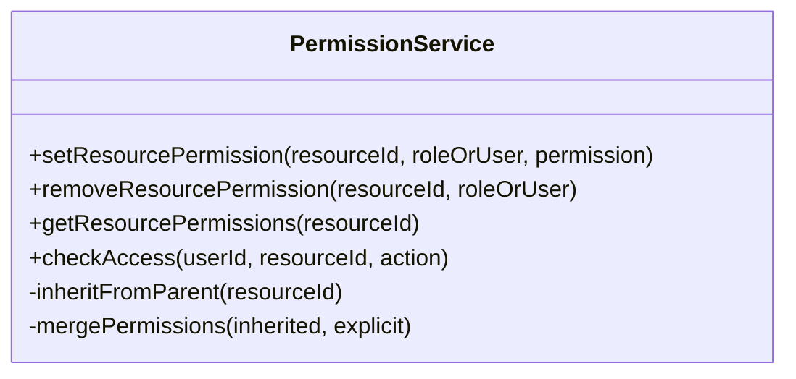

**图表来源** 
- [document-permissions.service.ts](file://apps/api/src/documents/document-permissions.service.ts)

**章节来源**
- [document-permissions.service.ts](file://apps/api/src/documents/document-permissions.service.ts)

### 控制器（documents.controller.ts）
- 职责
  - 路由与鉴权装饰器、DTO 校验、统一响应格式
  - 委托服务完成具体业务逻辑
- 典型接口
  - 文件夹：创建、更新、删除、列表、树形结构
  - 文档：创建、更新、删除、列表、搜索、批量操作
  - 权限：设置、移除、查询

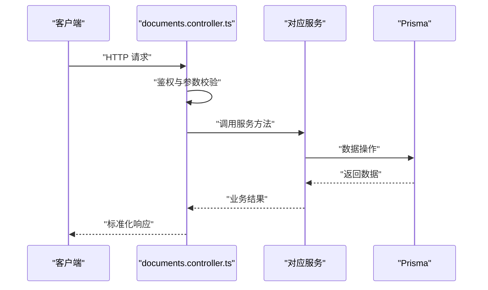

**图表来源** 
- [documents.controller.ts](file://apps/api/src/documents/documents.controller.ts)

**章节来源**
- [documents.controller.ts](file://apps/api/src/documents/documents.controller.ts)

### 前端组件与交互

#### 文件夹侧边栏（DocFolderSidebar.tsx）
- 功能
  - 渲染文件夹树，支持展开/折叠、右键菜单、拖拽排序
  - 与后端同步排序与层级变更
- 交互流程
  - 拖拽排序：捕获拖拽事件，计算目标位置，调用更新接口
  - 新建/重命名/删除：触发对应 API，刷新树结构

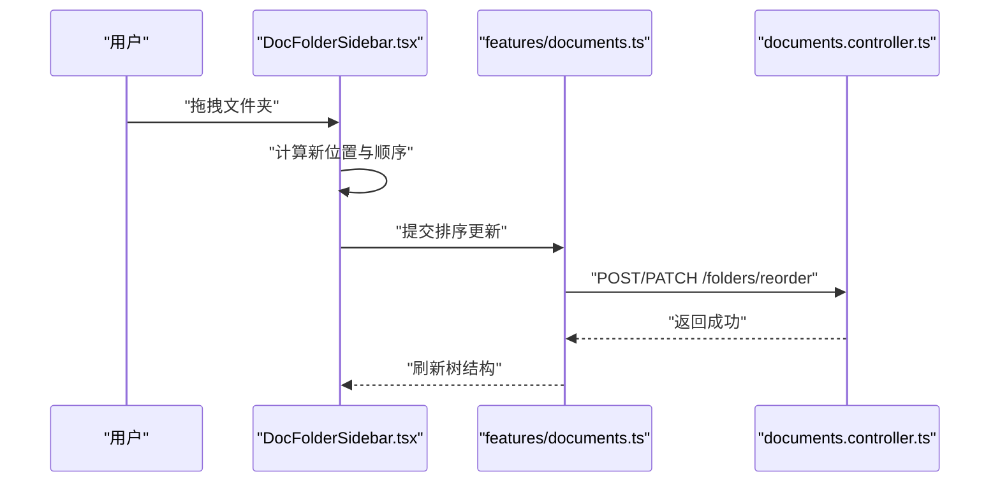

**图表来源** 
- [DocFolderSidebar.tsx](file://apps/admin/src/components/documents/DocFolderSidebar.tsx)
- [documents.ts](file://apps/admin/src/features/documents.ts)
- [documents.controller.ts](file://apps/api/src/documents/documents.controller.ts)

**章节来源**
- [DocFolderSidebar.tsx](file://apps/admin/src/components/documents/DocFolderSidebar.tsx)
- [documents.ts](file://apps/admin/src/features/documents.ts)

#### 文档中心（DocumentsHub.tsx）
- 功能
  - 文档列表展示、分页、搜索、批量选择与操作
  - 与文件夹联动，显示当前路径与上下文
- 交互流程
  - 搜索：组合关键词与过滤器，调用搜索接口
  - 批量操作：选中多个文档，执行移动/删除/标签更新

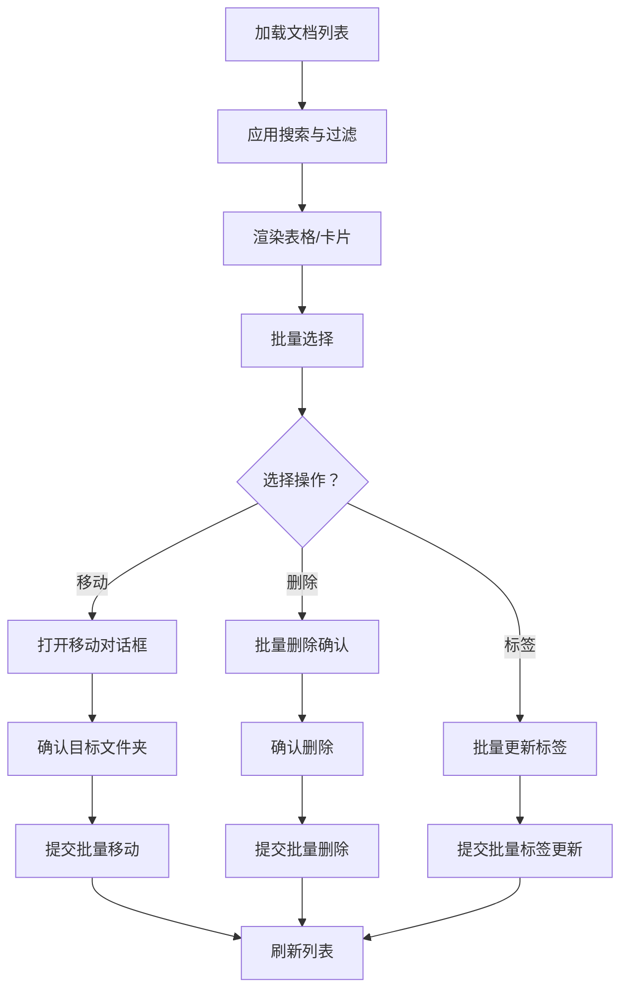

**图表来源** 
- [DocumentsHub.tsx](file://apps/admin/src/components/documents/DocumentsHub.tsx)
- [documents.ts](file://apps/admin/src/features/documents.ts)

**章节来源**
- [DocumentsHub.tsx](file://apps/admin/src/components/documents/DocumentsHub.tsx)
- [documents.ts](file://apps/admin/src/features/documents.ts)

#### 文档移动对话框（DocumentMoveDialog.tsx）
- 功能
  - 选择目标文件夹，支持预览路径与权限提示
  - 提交移动请求，更新文档归属
- 交互流程
  - 选择文件夹：调用文件夹树接口，渲染可选节点
  - 确认移动：调用移动接口，成功后关闭并刷新列表

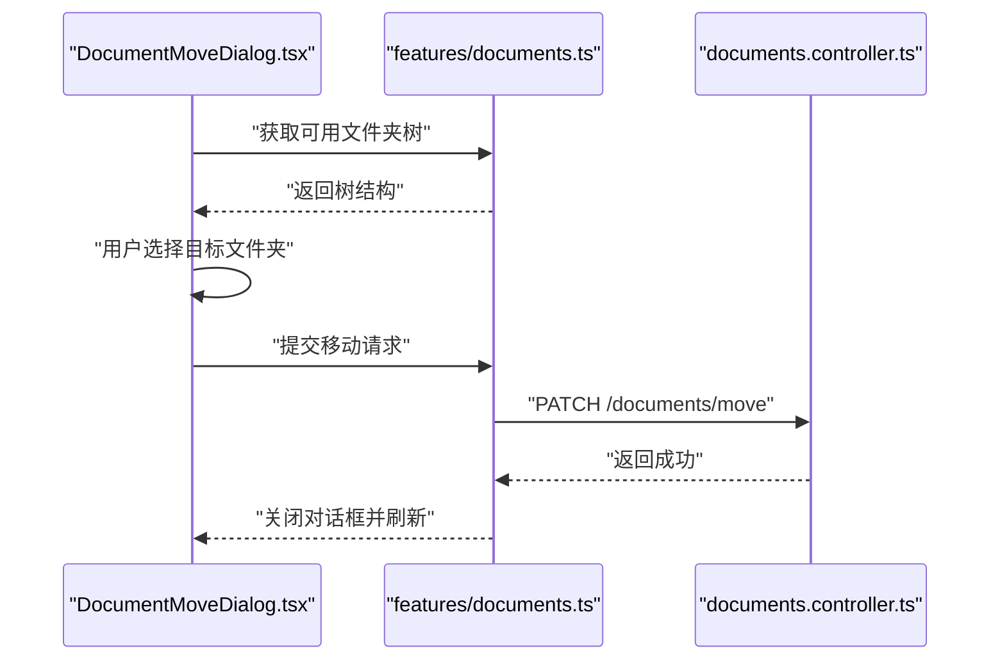

**图表来源** 
- [DocumentMoveDialog.tsx](file://apps/admin/src/components/documents/DocumentMoveDialog.tsx)
- [documents.ts](file://apps/admin/src/features/documents.ts)
- [documents.controller.ts](file://apps/api/src/documents/documents.controller.ts)

**章节来源**
- [DocumentMoveDialog.tsx](file://apps/admin/src/components/documents/DocumentMoveDialog.tsx)
- [documents.ts](file://apps/admin/src/features/documents.ts)

#### 权限按钮与对话框（DocumentPermissionButton.tsx / DocumentPermissionDialog.tsx）
- 功能
  - 快速查看与编辑资源权限，支持角色与用户维度
  - 显示继承状态与覆盖情况
- 交互流程
  - 点击按钮：打开权限对话框
  - 修改权限：提交权限设置，刷新权限视图

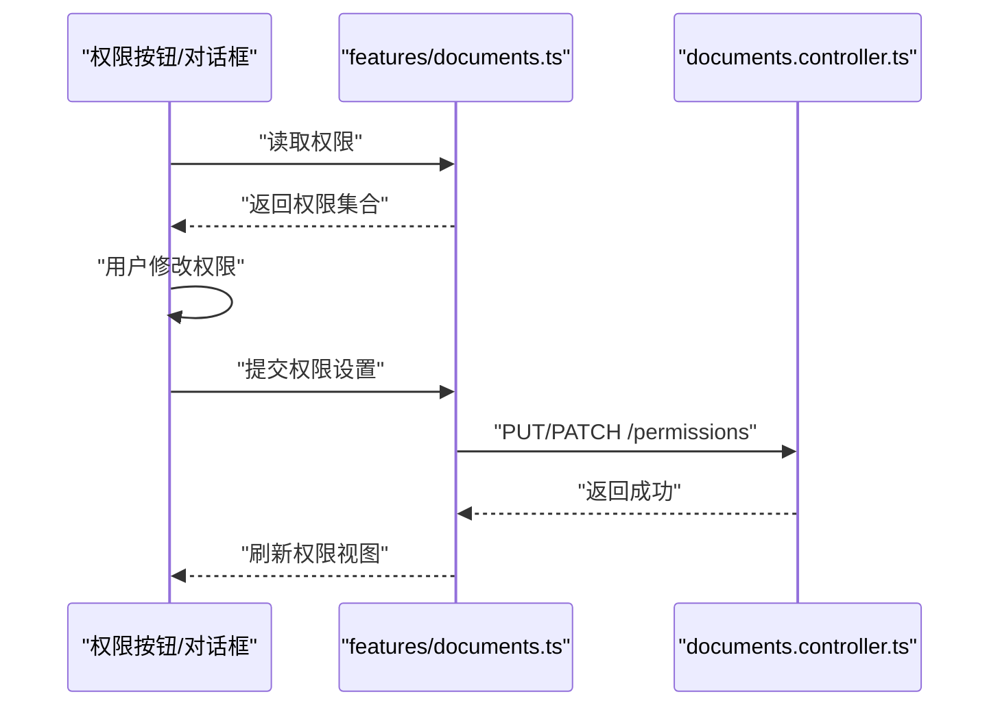

**图表来源** 
- [DocumentPermissionButton.tsx](file://apps/admin/src/components/DocumentPermissionButton.tsx)
- [DocumentPermissionDialog.tsx](file://apps/admin/src/components/DocumentPermissionDialog.tsx)
- [documents.ts](file://apps/admin/src/features/documents.ts)
- [documents.controller.ts](file://apps/api/src/documents/documents.controller.ts)

**章节来源**
- [DocumentPermissionButton.tsx](file://apps/admin/src/components/DocumentPermissionButton.tsx)
- [DocumentPermissionDialog.tsx](file://apps/admin/src/components/DocumentPermissionDialog.tsx)
- [documents.ts](file://apps/admin/src/features/documents.ts)

### 数据模型与关联关系（schema.prisma）
- 实体
  - Folder：文件夹，包含父节点、路径、深度、排序字段
  - Document：文档，包含标题、内容、所属文件夹、标签等
  - Permission：权限，关联资源（文档/文件夹）、主体（用户/角色）、权限动作
- 关系
  - Folder 与 Document：一对多（一个文件夹包含多个文档）
  - Folder 自关联：父子层级关系
  - Permission 与 Resource：多对一（多个权限指向同一资源）
  - Permission 与 Subject：多对一（多个权限来自同一主体）

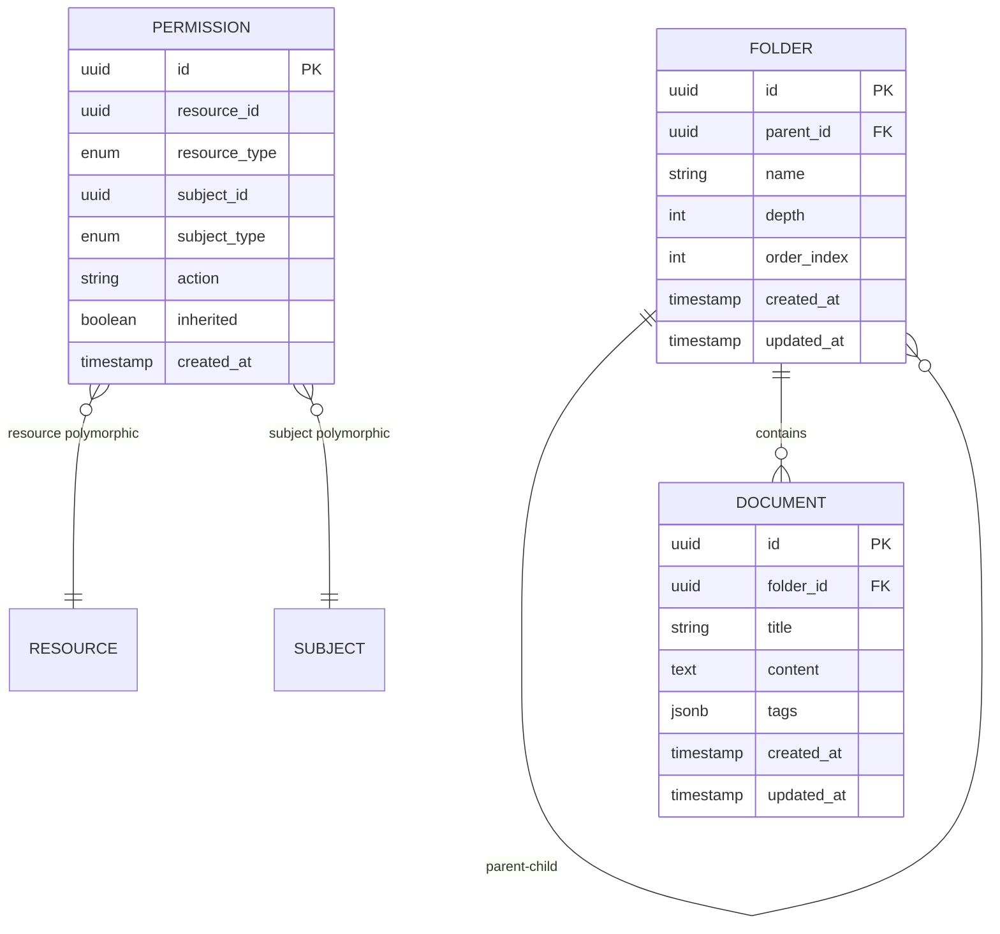

**图表来源** 
- [schema.prisma](file://apps/api/prisma/schema.prisma)

**章节来源**
- [schema.prisma](file://apps/api/prisma/schema.prisma)

## 依赖关系分析
- 控制器依赖服务：documents.controller.ts 依赖 doc-folders.service.ts、documents.service.ts、document-permissions.service.ts
- 服务依赖数据层：所有服务通过 Prisma 访问数据库
- 前端依赖 API 封装：features/documents.ts 封装所有文档与文件夹相关 API 调用
- 权限体系：基于角色与资源的细粒度控制，支持继承与覆盖

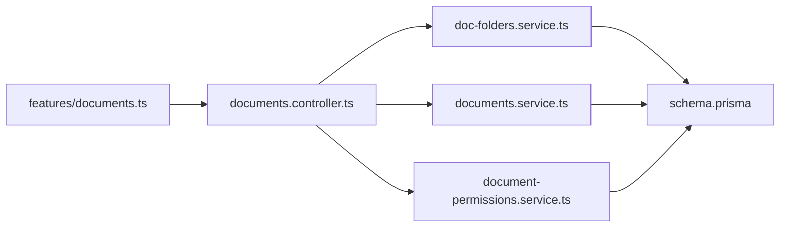

**图表来源** 
- [documents.controller.ts](file://apps/api/src/documents/documents.controller.ts)
- [doc-folders.service.ts](file://apps/api/src/documents/doc-folders.service.ts)
- [documents.service.ts](file://apps/api/src/documents/documents.service.ts)
- [document-permissions.service.ts](file://apps/api/src/documents/document-permissions.service.ts)
- [schema.prisma](file://apps/api/prisma/schema.prisma)
- [documents.ts](file://apps/admin/src/features/documents.ts)

**章节来源**
- [documents.controller.ts](file://apps/api/src/documents/documents.controller.ts)
- [doc-folders.service.ts](file://apps/api/src/documents/doc-folders.service.ts)
- [documents.service.ts](file://apps/api/src/documents/documents.service.ts)
- [document-permissions.service.ts](file://apps/api/src/documents/document-permissions.service.ts)
- [schema.prisma](file://apps/api/prisma/schema.prisma)
- [documents.ts](file://apps/admin/src/features/documents.ts)

## 性能考虑
- 树形结构构建：避免深层递归导致的性能问题，建议分页加载与懒加载
- 排序更新：批量更新 orderIndex 时尽量使用事务减少锁竞争
- 搜索优化：为常用字段建立索引（标题、标签、路径前缀）
- 权限计算：缓存继承权限结果，减少重复计算
- 前端交互：防抖搜索、虚拟滚动长列表、增量更新

[本节为通用指导，不直接分析具体文件]

## 故障排查指南
- 常见问题
  - 文件夹深度超限：检查创建时的深度限制与父节点路径
  - 权限不足：确认用户角色与资源权限设置，检查继承与覆盖
  - 拖拽排序失败：验证 orderIndex 更新是否成功，检查并发冲突
  - 搜索无结果：核对关键词与过滤器组合，检查索引状态
- 调试建议
  - 启用控制器日志输出，追踪请求链路
  - 使用 Prisma 查询日志定位数据问题
  - 前端网络面板检查 API 响应与错误码

**章节来源**
- [documents.controller.ts](file://apps/api/src/documents/documents.controller.ts)
- [doc-folders.service.ts](file://apps/api/src/documents/doc-folders.service.ts)
- [documents.service.ts](file://apps/api/src/documents/documents.service.ts)
- [document-permissions.service.ts](file://apps/api/src/documents/document-permissions.service.ts)

## 结论
本文件系统提供了完整的文档文件夹管理能力，涵盖层级结构、CRUD、权限控制、拖拽排序、批量操作与搜索。通过清晰的前后端分层与权限继承机制，能够满足灵活的文档目录管理需求。建议在大规模场景下进一步优化树加载、搜索索引与权限缓存，以提升用户体验与系统性能。

[本节为总结，不直接分析具体文件]

## 附录
- API 接口参考
  - 文件夹：创建、更新、删除、列表、树形结构、排序
  - 文档：创建、更新、删除、列表、搜索、批量移动/删除/标签
  - 权限：设置、移除、查询、继承策略
- 最佳实践
  - 合理设计文件夹层级，避免过深
  - 使用标签增强文档检索能力
  - 明确权限边界，谨慎授予管理权限
  - 前端交互注重反馈与错误提示

[本节为补充信息，不直接分析具体文件]