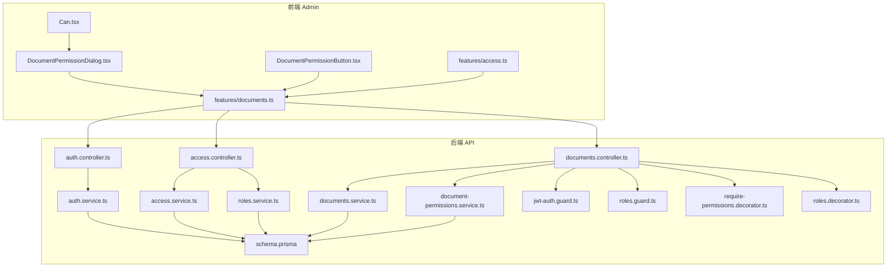
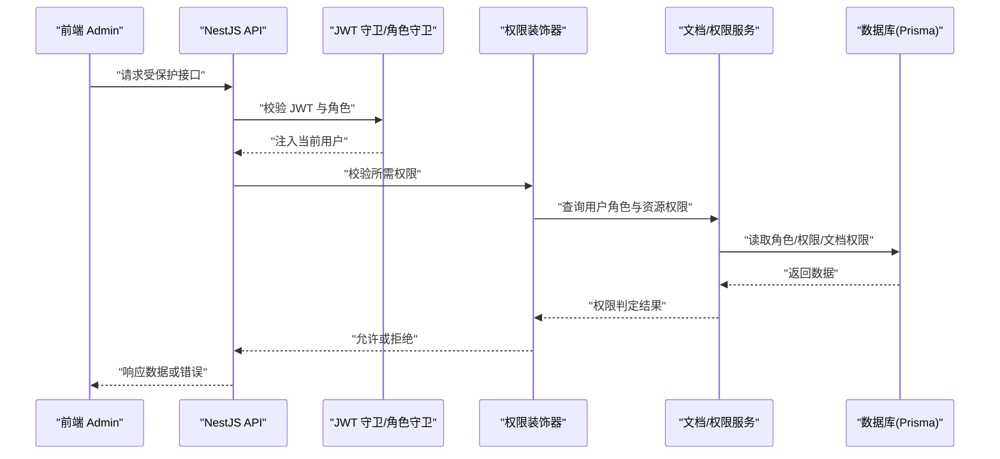
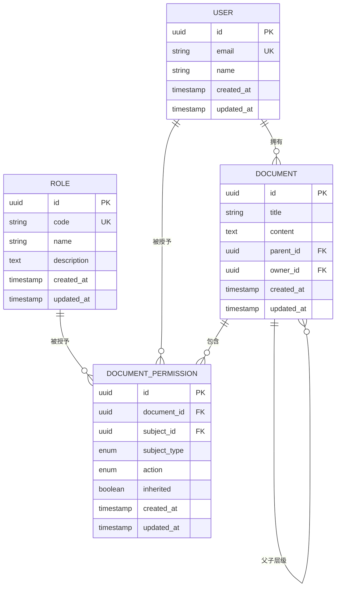
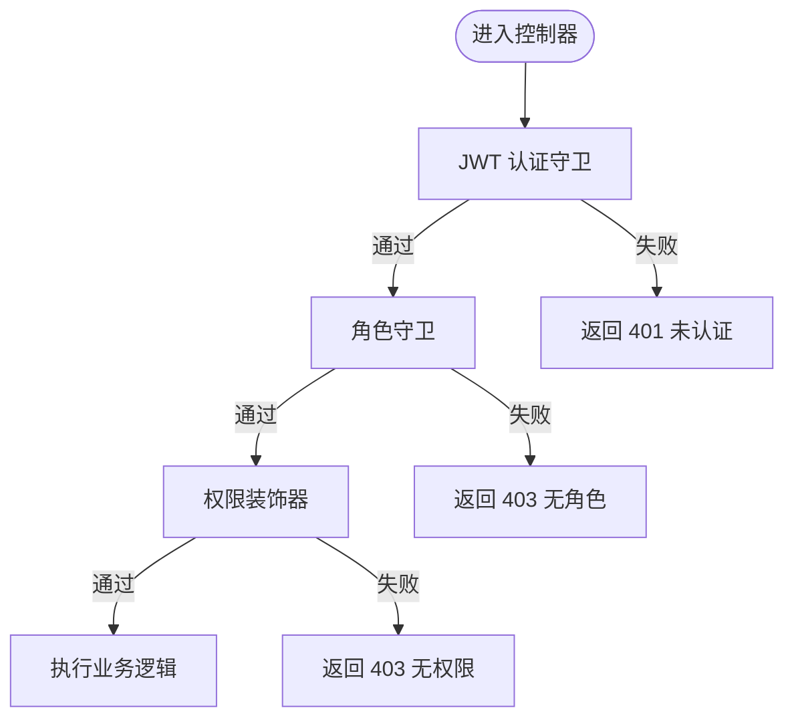
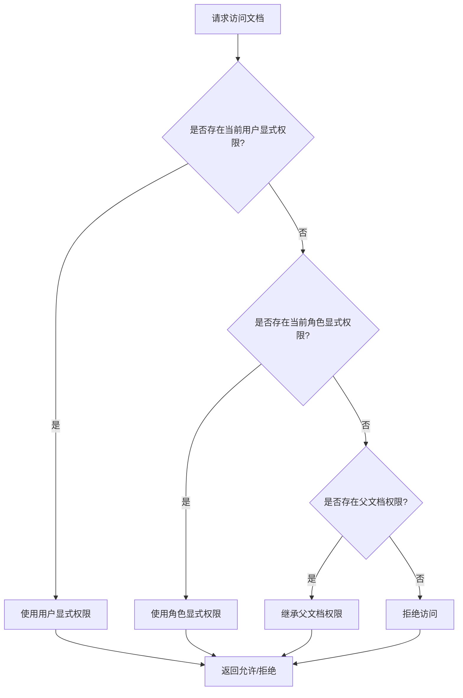
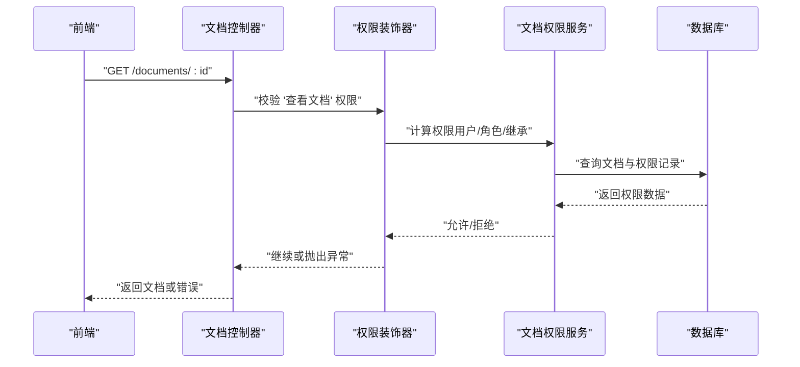
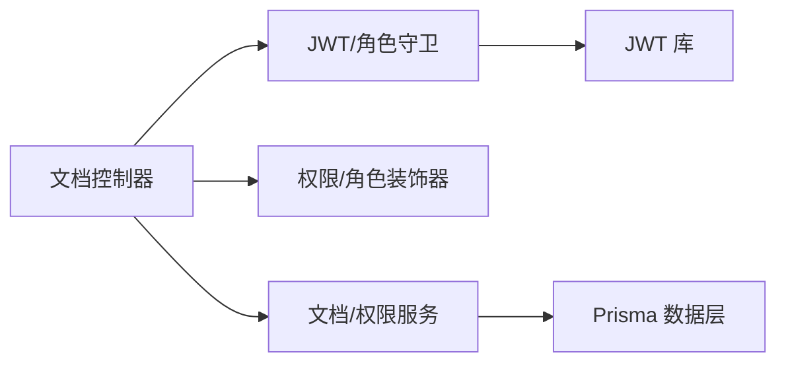

# 文档权限控制

<cite>
**本文引用的文件**   
- [access.controller.ts](file://apps/api/src/access/access.controller.ts)
- [access.service.ts](file://apps/api/src/access/access.service.ts)
- [roles.service.ts](file://apps/api/src/access/roles.service.ts)
- [permissions.ts](file://apps/api/src/access/permissions.ts)
- [jwt-auth.guard.ts](file://apps/api/src/auth/guards/jwt-auth.guard.ts)
- [roles.guard.ts](file://apps/api/src/auth/guards/roles.guard.ts)
- [require-permissions.decorator.ts](file://apps/api/src/auth/decorators/require-permissions.decorator.ts)
- [roles.decorator.ts](file://apps/api/src/auth/decorators/roles.decorator.ts)
- [auth.controller.ts](file://apps/api/src/auth/auth.controller.ts)
- [auth.service.ts](file://apps/api/src/auth/auth.service.ts)
- [documents.controller.ts](file://apps/api/src/documents/documents.controller.ts)
- [documents.service.ts](file://apps/api/src/documents/documents.service.ts)
- [document-permissions.service.ts](file://apps/api/src/documents/document-permissions.service.ts)
- [document-permission.dto.ts](file://apps/api/src/documents/dto/document-permission.dto.ts)
- [document.dto.ts](file://apps/api/src/documents/dto/document.dto.ts)
- [schema.prisma](file://apps/api/prisma/schema.prisma)
- [Can.tsx](file://apps/admin/src/components/Can.tsx)
- [DocumentPermissionDialog.tsx](file://apps/admin/src/components/DocumentPermissionDialog.tsx)
- [DocumentPermissionButton.tsx](file://apps/admin/src/components/DocumentPermissionButton.tsx)
- [access.ts](file://apps/admin/src/features/access.ts)
- [documents.ts](file://apps/admin/src/features/documents.ts)
</cite>

## 目录
1. [简介](#简介)
2. [项目结构](#项目结构)
3. [核心组件](#核心组件)
4. [架构总览](#架构总览)
5. [详细组件分析](#详细组件分析)
6. [依赖关系分析](#依赖关系分析)
7. [性能考虑](#性能考虑)
8. [故障排查指南](#故障排查指南)
9. [结论](#结论)
10. [附录](#附录)

## 简介
本文件面向企业级文档安全管控，系统化阐述基于角色的访问控制（RBAC）与基于资源的权限模型在“文档”场景中的落地方案。内容覆盖：
- 文档级别的权限设置、继承机制与冲突解决策略
- 权限检查中间件（守卫与装饰器）、动态权限渲染与前端界面适配
- 权限数据模型、API 接口设计与前后端集成示例
- 常见问题定位与优化建议

目标读者包括后端工程师、前端工程师、产品与安全负责人。

## 项目结构
本项目采用前后端分离架构：
- 后端 NestJS 服务提供认证、角色与权限管理、文档及文档权限的 CRUD 与校验能力
- 前端 Next.js 控制台通过 API 调用实现权限配置与动态 UI 渲染



图表来源
- [auth.controller.ts](file://apps/api/src/auth/auth.controller.ts)
- [auth.service.ts](file://apps/api/src/auth/auth.service.ts)
- [access.controller.ts](file://apps/api/src/access/access.controller.ts)
- [access.service.ts](file://apps/api/src/access/access.service.ts)
- [roles.service.ts](file://apps/api/src/access/roles.service.ts)
- [documents.controller.ts](file://apps/api/src/documents/documents.controller.ts)
- [documents.service.ts](file://apps/api/src/documents/documents.service.ts)
- [document-permissions.service.ts](file://apps/api/src/documents/document-permissions.service.ts)
- [jwt-auth.guard.ts](file://apps/api/src/auth/guards/jwt-auth.guard.ts)
- [roles.guard.ts](file://apps/api/src/auth/guards/roles.guard.ts)
- [require-permissions.decorator.ts](file://apps/api/src/auth/decorators/require-permissions.decorator.ts)
- [roles.decorator.ts](file://apps/api/src/auth/decorators/roles.decorator.ts)
- [schema.prisma](file://apps/api/prisma/schema.prisma)

章节来源
- [schema.prisma](file://apps/api/prisma/schema.prisma)
- [documents.controller.ts](file://apps/api/src/documents/documents.controller.ts)
- [document-permissions.service.ts](file://apps/api/src/documents/document-permissions.service.ts)
- [Can.tsx](file://apps/admin/src/components/Can.tsx)
- [DocumentPermissionDialog.tsx](file://apps/admin/src/components/DocumentPermissionDialog.tsx)
- [DocumentPermissionButton.tsx](file://apps/admin/src/components/DocumentPermissionButton.tsx)

## 核心组件
- 认证与鉴权
  - JWT 认证守卫：解析并校验令牌，注入当前用户上下文
  - 角色守卫：基于用户角色进行路由级访问控制
  - 权限装饰器：声明式要求特定资源操作权限
  - 角色装饰器：声明式要求特定角色
- 权限与角色服务
  - 角色服务：维护角色定义与成员关系
  - 权限服务：统一权限判定逻辑（含 RBAC 与资源维度）
- 文档与文档权限
  - 文档服务：文档元数据与层级管理
  - 文档权限服务：文档级权限分配、继承与冲突解决
- 前端权限渲染
  - Can 组件：根据权限结果条件渲染
  - 权限对话框与按钮：用于配置与快捷操作

章节来源
- [jwt-auth.guard.ts](file://apps/api/src/auth/guards/jwt-auth.guard.ts)
- [roles.guard.ts](file://apps/api/src/auth/guards/roles.guard.ts)
- [require-permissions.decorator.ts](file://apps/api/src/auth/decorators/require-permissions.decorator.ts)
- [roles.decorator.ts](file://apps/api/src/auth/decorators/roles.decorator.ts)
- [access.service.ts](file://apps/api/src/access/access.service.ts)
- [roles.service.ts](file://apps/api/src/access/roles.service.ts)
- [documents.service.ts](file://apps/api/src/documents/documents.service.ts)
- [document-permissions.service.ts](file://apps/api/src/documents/document-permissions.service.ts)
- [Can.tsx](file://apps/admin/src/components/Can.tsx)

## 架构总览
系统采用“认证→授权→业务”的分层设计：
- 认证层：JWT 校验与用户上下文注入
- 授权层：角色守卫 + 权限装饰器，结合 RBAC 与资源权限模型
- 业务层：文档与文档权限服务处理具体领域逻辑



图表来源
- [jwt-auth.guard.ts](file://apps/api/src/auth/guards/jwt-auth.guard.ts)
- [roles.guard.ts](file://apps/api/src/auth/guards/roles.guard.ts)
- [require-permissions.decorator.ts](file://apps/api/src/auth/decorators/require-permissions.decorator.ts)
- [documents.controller.ts](file://apps/api/src/documents/documents.controller.ts)
- [document-permissions.service.ts](file://apps/api/src/documents/document-permissions.service.ts)
- [documents.service.ts](file://apps/api/src/documents/documents.service.ts)
- [schema.prisma](file://apps/api/prisma/schema.prisma)

## 详细组件分析

### 数据模型与权限模型
- 角色与用户
  - 角色：包含角色标识、名称、描述等
  - 用户：包含用户标识、角色关联、状态等
- 资源与权限
  - 资源：以“文档”为核心资源，支持层级结构（文件夹/子文档）
  - 权限：读、写、删除、分享、管理等操作粒度
- 文档权限
  - 文档级授权：为指定用户或角色授予特定操作
  - 继承：子文档默认继承父文档权限，可被显式覆盖
  - 冲突解决：精确匹配优先于继承；按作用域优先级合并



图表来源
- [schema.prisma](file://apps/api/prisma/schema.prisma)

章节来源
- [schema.prisma](file://apps/api/prisma/schema.prisma)
- [document-permission.dto.ts](file://apps/api/src/documents/dto/document-permission.dto.ts)
- [document.dto.ts](file://apps/api/src/documents/dto/document.dto.ts)

### 认证与授权中间件
- JWT 认证守卫
  - 职责：解析请求头中的令牌，验证签名与过期时间，将用户信息注入到请求上下文
  - 失败处理：未携带或无效令牌时返回 401
- 角色守卫
  - 职责：校验当前用户是否具备所需角色
  - 失败处理：无对应角色时返回 403
- 权限装饰器
  - 职责：声明式校验对某资源的特定操作权限（如“编辑文档”）
  - 决策依据：用户角色 + 资源权限表 + 继承规则
- 角色装饰器
  - 职责：声明式要求访问者具备指定角色



图表来源
- [jwt-auth.guard.ts](file://apps/api/src/auth/guards/jwt-auth.guard.ts)
- [roles.guard.ts](file://apps/api/src/auth/guards/roles.guard.ts)
- [require-permissions.decorator.ts](file://apps/api/src/auth/decorators/require-permissions.decorator.ts)
- [roles.decorator.ts](file://apps/api/src/auth/decorators/roles.decorator.ts)

章节来源
- [jwt-auth.guard.ts](file://apps/api/src/auth/guards/jwt-auth.guard.ts)
- [roles.guard.ts](file://apps/api/src/auth/guards/roles.guard.ts)
- [require-permissions.decorator.ts](file://apps/api/src/auth/decorators/require-permissions.decorator.ts)
- [roles.decorator.ts](file://apps/api/src/auth/decorators/roles.decorator.ts)

### 文档权限服务与继承机制
- 权限分配
  - 支持为用户或角色直接授予文档操作权限
  - 支持标记是否为继承权限
- 继承与覆盖
  - 子文档若无显式权限，则向上查找最近祖先的有效权限
  - 若存在显式权限，则覆盖继承结果
- 冲突解决策略
  - 精确匹配优先：针对当前用户的权限 > 针对角色的权限 > 继承权限
  - 动作优先级：写 > 读；删除 > 写（视具体策略而定）
  - 最小权限原则：当存在冲突时，取最严格的允许结果



图表来源
- [document-permissions.service.ts](file://apps/api/src/documents/document-permissions.service.ts)

章节来源
- [document-permissions.service.ts](file://apps/api/src/documents/document-permissions.service.ts)

### 文档 API 与权限校验流程
- 典型接口
  - 获取文档列表：需“查看文档”权限
  - 获取文档详情：需“查看文档”权限
  - 更新文档：需“编辑文档”权限
  - 删除文档：需“删除文档”权限
  - 设置文档权限：需“管理文档权限”权限
- 权限校验顺序
  - 先通过 JWT 认证与角色守卫
  - 再通过权限装饰器校验资源操作
  - 最后由文档权限服务执行继承与冲突解决



图表来源
- [documents.controller.ts](file://apps/api/src/documents/documents.controller.ts)
- [require-permissions.decorator.ts](file://apps/api/src/auth/decorators/require-permissions.decorator.ts)
- [document-permissions.service.ts](file://apps/api/src/documents/document-permissions.service.ts)
- [schema.prisma](file://apps/api/prisma/schema.prisma)

章节来源
- [documents.controller.ts](file://apps/api/src/documents/documents.controller.ts)
- [document-permissions.service.ts](file://apps/api/src/documents/document-permissions.service.ts)

### 前端权限渲染与界面适配
- Can 组件
  - 根据权限结果决定是否渲染子节点
  - 适用于按钮、菜单、表单字段等细粒度控制
- 权限对话框
  - 提供文档级权限配置界面
  - 支持为用户或角色分配操作权限
- 权限按钮
  - 根据权限自动显示/隐藏或禁用操作按钮

```mermaid
classDiagram
class Can {
+props : { permission, children }
+render() ReactNode
}
class DocumentPermissionDialog {
+open : boolean
+documentId : string
+onSave(data) void
+render() ReactNode
}
class DocumentPermissionButton {
+permission : string
+children : ReactNode
+render() ReactNode
}
Can <.. DocumentPermissionDialog : "条件渲染"
DocumentPermissionButton <.. Can : "复用权限判断"
```

图表来源
- [Can.tsx](file://apps/admin/src/components/Can.tsx)
- [DocumentPermissionDialog.tsx](file://apps/admin/src/components/DocumentPermissionDialog.tsx)
- [DocumentPermissionButton.tsx](file://apps/admin/src/components/DocumentPermissionButton.tsx)

章节来源
- [Can.tsx](file://apps/admin/src/components/Can.tsx)
- [DocumentPermissionDialog.tsx](file://apps/admin/src/components/DocumentPermissionDialog.tsx)
- [DocumentPermissionButton.tsx](file://apps/admin/src/components/DocumentPermissionButton.tsx)
- [access.ts](file://apps/admin/src/features/access.ts)
- [documents.ts](file://apps/admin/src/features/documents.ts)

## 依赖关系分析
- 模块耦合
  - 控制器依赖守卫与装饰器完成鉴权
  - 控制器依赖服务完成业务逻辑
  - 服务依赖 Prisma 数据访问层
- 外部依赖
  - JWT 库用于令牌签发与校验
  - Prisma ORM 用于数据库访问
- 潜在循环依赖
  - 通过分层与接口隔离避免控制器与服务之间的循环引用



图表来源
- [documents.controller.ts](file://apps/api/src/documents/documents.controller.ts)
- [jwt-auth.guard.ts](file://apps/api/src/auth/guards/jwt-auth.guard.ts)
- [roles.guard.ts](file://apps/api/src/auth/guards/roles.guard.ts)
- [require-permissions.decorator.ts](file://apps/api/src/auth/decorators/require-permissions.decorator.ts)
- [roles.decorator.ts](file://apps/api/src/auth/decorators/roles.decorator.ts)
- [documents.service.ts](file://apps/api/src/documents/documents.service.ts)
- [document-permissions.service.ts](file://apps/api/src/documents/document-permissions.service.ts)
- [schema.prisma](file://apps/api/prisma/schema.prisma)

章节来源
- [documents.controller.ts](file://apps/api/src/documents/documents.controller.ts)
- [documents.service.ts](file://apps/api/src/documents/documents.service.ts)
- [document-permissions.service.ts](file://apps/api/src/documents/document-permissions.service.ts)
- [schema.prisma](file://apps/api/prisma/schema.prisma)

## 性能考虑
- 缓存策略
  - 对高频读取的文档权限结果进行短期缓存（如 Redis），降低数据库压力
  - 缓存键包含用户 ID、文档 ID 与操作类型，确保一致性
- 查询优化
  - 使用批量查询与预加载减少 N+1 问题
  - 索引文档权限表的 subject_id、action、inherited 字段
- 权限计算优化
  - 将继承链计算结果缓存，避免重复遍历父文档
  - 对冲突解决策略进行幂等化，保证多次调用结果一致

[本节为通用性能建议，不直接分析具体文件]

## 故障排查指南
- 常见错误
  - 401 未认证：检查 JWT 是否正确传递与签名有效
  - 403 无角色：确认用户是否被赋予所需角色
  - 403 无权限：检查文档权限分配与继承链是否正确
- 排查步骤
  - 启用调试日志，记录权限判定过程
  - 检查数据库权限记录是否完整
  - 验证前端权限渲染是否与后端一致
- 回滚与修复
  - 对错误的权限分配提供撤销与修正接口
  - 提供权限审计日志以便追溯

章节来源
- [jwt-auth.guard.ts](file://apps/api/src/auth/guards/jwt-auth.guard.ts)
- [roles.guard.ts](file://apps/api/src/auth/guards/roles.guard.ts)
- [require-permissions.decorator.ts](file://apps/api/src/auth/decorators/require-permissions.decorator.ts)
- [document-permissions.service.ts](file://apps/api/src/documents/document-permissions.service.ts)

## 结论
本方案通过 RBAC 与资源权限模型的结合，实现了文档级别的细粒度权限控制。借助守卫与装饰器的声明式鉴权、服务的继承与冲突解决策略，以及前端的动态渲染，企业可实现灵活且安全的文档安全管理。建议在大规模部署中引入缓存与审计机制，进一步提升性能与可观测性。

[本节为总结性内容，不直接分析具体文件]

## 附录
- 最佳实践
  - 明确权限命名规范，便于前后端对齐
  - 遵循最小权限原则，避免过度授权
  - 定期审计权限分配，清理冗余授权
- 扩展方向
  - 支持更多资源类型（如媒体、页面）
  - 引入策略引擎，支持复杂条件判断
  - 增加多租户隔离与跨租户权限控制

[本节为补充性内容，不直接分析具体文件]