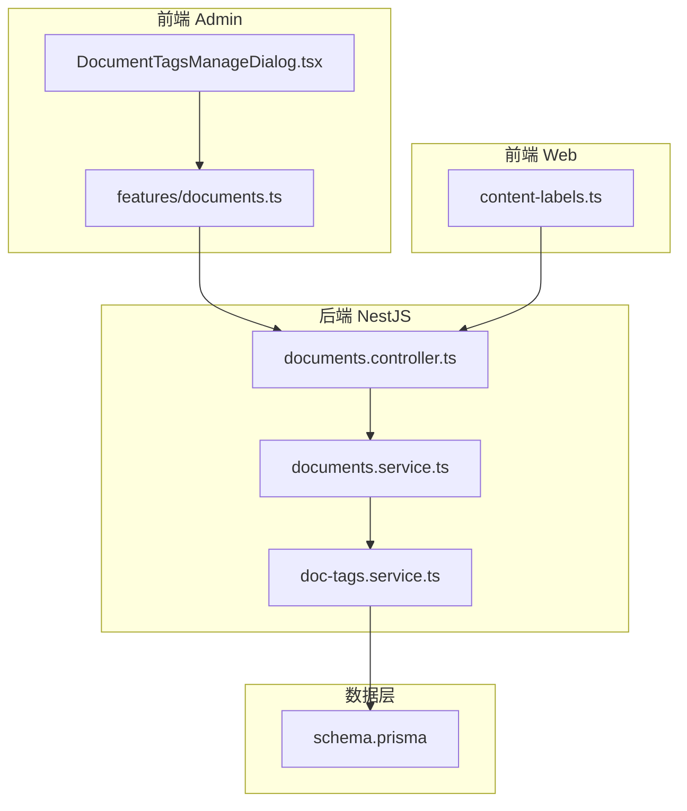
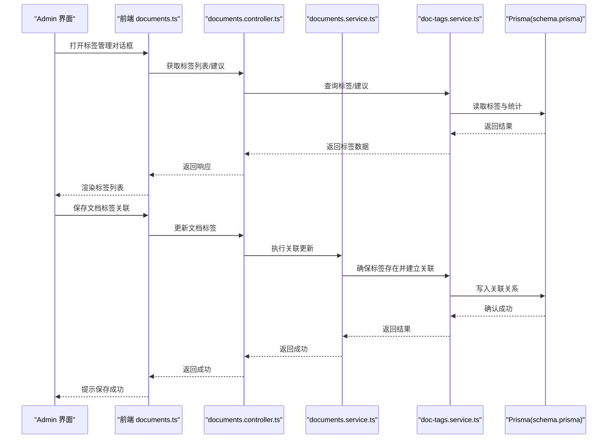
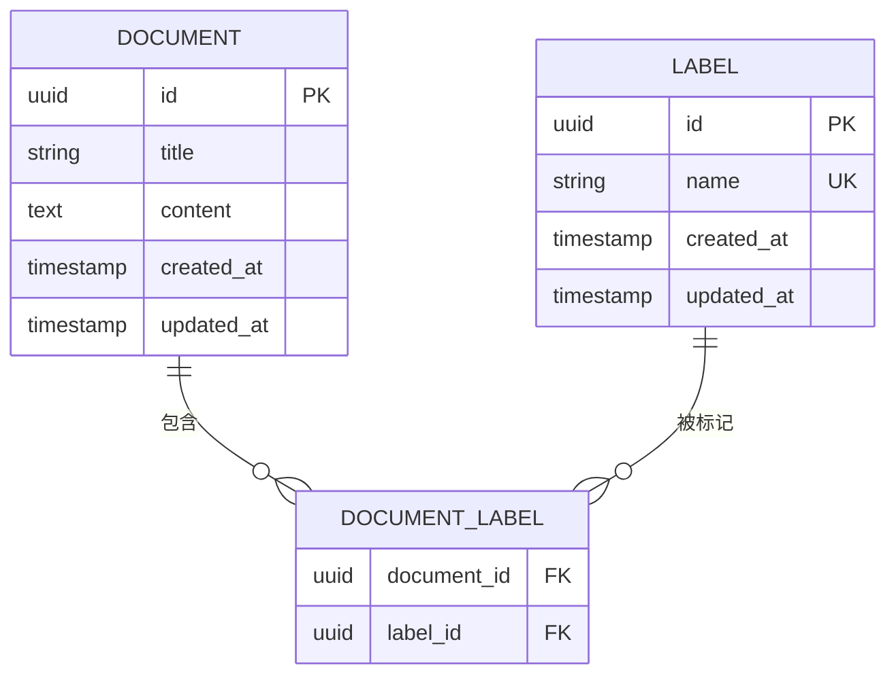
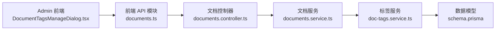

# 文档标签系统

<cite>
**本文引用的文件**   
- [doc-tags.service.ts](file://apps/api/src/documents/doc-tags.service.ts)
- [documents.controller.ts](file://apps/api/src/documents/documents.controller.ts)
- [documents.service.ts](file://apps/api/src/documents/documents.service.ts)
- [schema.prisma](file://apps/api/prisma/schema.prisma)
- [DocumentTagsManageDialog.tsx](file://apps/admin/src/components/documents/DocumentTagsManageDialog.tsx)
- [documents.ts](file://apps/admin/src/features/documents.ts)
- [content-labels.ts](file://apps/web/src/lib/content-labels.ts)
</cite>

## 目录
1. [简介](#简介)
2. [项目结构](#项目结构)
3. [核心组件](#核心组件)
4. [架构总览](#架构总览)
5. [详细组件分析](#详细组件分析)
6. [依赖关系分析](#依赖关系分析)
7. [性能考虑](#性能考虑)
8. [故障排查指南](#故障排查指南)
9. [结论](#结论)
10. [附录](#附录)

## 简介
本文件面向“文档标签系统”的创建、管理与分类组织机制，覆盖以下关键能力：
- 标签与文档的多对多关系建模与管理
- 自动标签建议与智能分类策略
- 标签搜索、过滤与统计分析
- 后端 API 接口设计与前端组件使用方式
- 最佳实践与常见问题排查

该系统的目标是帮助构建灵活、可扩展的文档分类与检索体系，提升内容组织效率与用户检索体验。

## 项目结构
标签系统贯穿前后端：
- 后端（NestJS）提供标签 CRUD、关联管理、统计查询等 API
- 数据库通过 Prisma 定义标签与文档的实体及多对多关系
- 前端（Admin）提供标签管理对话框与编辑集成
- 前端（Web）提供标签展示、筛选与搜索联动

图表来源
- [DocumentTagsManageDialog.tsx](file://apps/admin/src/components/documents/DocumentTagsManageDialog.tsx)
- [documents.ts](file://apps/admin/src/features/documents.ts)
- [documents.controller.ts](file://apps/api/src/documents/documents.controller.ts)
- [documents.service.ts](file://apps/api/src/documents/documents.service.ts)
- [doc-tags.service.ts](file://apps/api/src/documents/doc-tags.service.ts)
- [schema.prisma](file://apps/api/prisma/schema.prisma)
- [content-labels.ts](file://apps/web/src/lib/content-labels.ts)

章节来源
- [documents.controller.ts](file://apps/api/src/documents/documents.controller.ts)
- [documents.service.ts](file://apps/api/src/documents/documents.service.ts)
- [doc-tags.service.ts](file://apps/api/src/documents/doc-tags.service.ts)
- [schema.prisma](file://apps/api/prisma/schema.prisma)
- [DocumentTagsManageDialog.tsx](file://apps/admin/src/components/documents/DocumentTagsManageDialog.tsx)
- [documents.ts](file://apps/admin/src/features/documents.ts)
- [content-labels.ts](file://apps/web/src/lib/content-labels.ts)

## 核心组件
- 标签服务（doc-tags.service.ts）：负责标签的增删改查、与文档的关联维护、标签统计与聚合
- 文档控制器（documents.controller.ts）：对外暴露标签相关 API（如标签列表、关联更新、按标签过滤）
- 文档服务（documents.service.ts）：协调文档与标签的关联操作，封装事务与一致性保障
- 数据模型（schema.prisma）：定义标签实体、文档实体以及它们之间的多对多关系
- 前端管理对话框（DocumentTagsManageDialog.tsx）：在文档编辑时选择/新增/删除标签
- 前端功能模块（documents.ts）：封装调用后端标签 API 的方法
- 前端标签工具（content-labels.ts）：用于标签展示、格式化、筛选条件构建

章节来源
- [doc-tags.service.ts](file://apps/api/src/documents/doc-tags.service.ts)
- [documents.controller.ts](file://apps/api/src/documents/documents.controller.ts)
- [documents.service.ts](file://apps/api/src/documents/documents.service.ts)
- [schema.prisma](file://apps/api/prisma/schema.prisma)
- [DocumentTagsManageDialog.tsx](file://apps/admin/src/components/documents/DocumentTagsManageDialog.tsx)
- [documents.ts](file://apps/admin/src/features/documents.ts)
- [content-labels.ts](file://apps/web/src/lib/content-labels.ts)

## 架构总览
标签系统采用分层架构：
- 表现层（Admin/Web）：提供标签管理界面与展示/筛选能力
- 控制层（Controller）：接收请求、参数校验、路由到服务
- 业务层（Service）：实现标签与文档的关联逻辑、统计计算、建议生成
- 数据层（Prisma）：持久化标签与文档及其关系

图表来源
- [documents.controller.ts](file://apps/api/src/documents/documents.controller.ts)
- [documents.service.ts](file://apps/api/src/documents/documents.service.ts)
- [doc-tags.service.ts](file://apps/api/src/documents/doc-tags.service.ts)
- [schema.prisma](file://apps/api/prisma/schema.prisma)
- [documents.ts](file://apps/admin/src/features/documents.ts)
- [DocumentTagsManageDialog.tsx](file://apps/admin/src/components/documents/DocumentTagsManageDialog.tsx)

## 详细组件分析

### 数据模型与多对多关系
- 标签实体与文档实体通过中间表建立多对多关系
- 支持标签名称唯一性约束与索引优化
- 文档与标签的关联变更需保证事务性与一致性

图表来源
- [schema.prisma](file://apps/api/prisma/schema.prisma)

章节来源
- [schema.prisma](file://apps/api/prisma/schema.prisma)

### 标签服务（doc-tags.service.ts）
职责：
- 标签 CRUD：创建、更新、删除、查询
- 关联管理：为文档添加/移除标签，批量操作
- 统计聚合：按标签统计文档数量、热门标签推荐
- 建议生成：基于文本内容或历史使用频率推荐标签

关键点：
- 使用事务确保关联操作的原子性
- 对高频查询字段建立索引以提升性能
- 提供统一的错误码与异常处理

章节来源
- [doc-tags.service.ts](file://apps/api/src/documents/doc-tags.service.ts)

### 文档控制器（documents.controller.ts）
职责：
- 暴露标签相关 API：标签列表、建议、关联更新、按标签过滤
- 参数校验与权限检查
- 统一响应格式与错误处理

典型流程：
- 接收前端请求（如更新文档标签）
- 调用文档服务进行业务处理
- 返回标准化响应

章节来源
- [documents.controller.ts](file://apps/api/src/documents/documents.controller.ts)

### 文档服务（documents.service.ts）
职责：
- 协调文档与标签的关联操作
- 封装事务边界，确保数据一致性
- 提供按标签过滤、统计等高级查询

关键点：
- 与标签服务协作完成标签存在性检查与关联维护
- 避免循环依赖与重复查询

章节来源
- [documents.service.ts](file://apps/api/src/documents/documents.service.ts)

### 前端管理对话框（DocumentTagsManageDialog.tsx）
职责：
- 在文档编辑页中展示可选标签
- 支持新增标签、选择/取消选择标签
- 调用前端 API 模块提交变更

交互要点：
- 本地状态与后端同步
- 防抖输入以优化建议查询
- 错误提示与重试机制

章节来源
- [DocumentTagsManageDialog.tsx](file://apps/admin/src/components/documents/DocumentTagsManageDialog.tsx)

### 前端功能模块（documents.ts）
职责：
- 封装标签相关的 API 调用方法
- 统一错误处理与加载状态管理
- 提供类型定义与常量

章节来源
- [documents.ts](file://apps/admin/src/features/documents.ts)

### 前端标签工具（content-labels.ts）
职责：
- 标签格式化、展示规则
- 构建筛选条件与搜索参数
- 标签权重与排序策略

章节来源
- [content-labels.ts](file://apps/web/src/lib/content-labels.ts)

## 依赖关系分析
- 控制器依赖服务层，服务层依赖数据访问层（Prisma）
- 前端模块依赖控制器暴露的 API
- 标签服务与文档服务之间存在协作关系，避免循环依赖

图表来源
- [DocumentTagsManageDialog.tsx](file://apps/admin/src/components/documents/DocumentTagsManageDialog.tsx)
- [documents.ts](file://apps/admin/src/features/documents.ts)
- [documents.controller.ts](file://apps/api/src/documents/documents.controller.ts)
- [documents.service.ts](file://apps/api/src/documents/documents.service.ts)
- [doc-tags.service.ts](file://apps/api/src/documents/doc-tags.service.ts)
- [schema.prisma](file://apps/api/prisma/schema.prisma)

章节来源
- [documents.controller.ts](file://apps/api/src/documents/documents.controller.ts)
- [documents.service.ts](file://apps/api/src/documents/documents.service.ts)
- [doc-tags.service.ts](file://apps/api/src/documents/doc-tags.service.ts)
- [schema.prisma](file://apps/api/prisma/schema.prisma)
- [documents.ts](file://apps/admin/src/features/documents.ts)
- [DocumentTagsManageDialog.tsx](file://apps/admin/src/components/documents/DocumentTagsManageDialog.tsx)

## 性能考虑
- 索引优化：对标签名称、文档 ID、标签 ID 建立索引，加速关联查询
- 分页与限制：标签列表与搜索结果采用分页，避免一次性加载过多数据
- 缓存策略：热门标签与建议可引入缓存层（如 Redis）降低数据库压力
- 批量操作：支持批量添加/移除标签，减少往返次数
- 事务边界：将关联更新放入事务，提高一致性与吞吐

[本节为通用指导，不直接分析具体文件]

## 故障排查指南
常见问题与定位方法：
- 标签不存在：检查标签创建流程与唯一性约束
- 关联失败：查看事务日志与外键约束，确认文档与标签 ID 有效
- 性能问题：分析慢查询，检查索引是否命中
- 前端状态不同步：核对 API 响应与本地状态更新逻辑

章节来源
- [doc-tags.service.ts](file://apps/api/src/documents/doc-tags.service.ts)
- [documents.service.ts](file://apps/api/src/documents/documents.service.ts)
- [documents.controller.ts](file://apps/api/src/documents/documents.controller.ts)

## 结论
标签系统通过清晰的分层架构与多对多关系设计，实现了灵活的文档分类与检索能力。结合自动建议与统计分析，能够有效提升内容组织效率与用户体验。建议在后续迭代中持续优化索引、缓存与批量操作，进一步提升系统性能与稳定性。

[本节为总结性内容，不直接分析具体文件]

## 附录
- 最佳实践
  - 标签命名规范：简洁、语义明确、避免同义重复
  - 关联操作尽量批量执行，减少网络开销
  - 前端输入增加去重与校验，避免脏数据入库
  - 定期清理未使用的标签，保持标签库整洁
- 扩展方向
  - 引入标签层级与分组
  - 增强智能分类算法（如基于内容的 NLP 分类）
  - 提供标签导入/导出与迁移工具

[本节为补充信息，不直接分析具体文件]