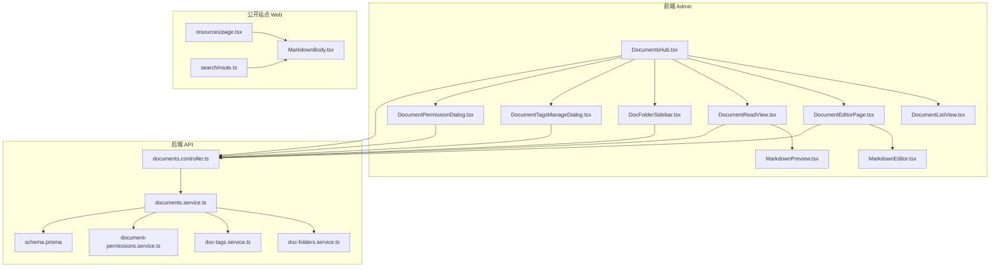
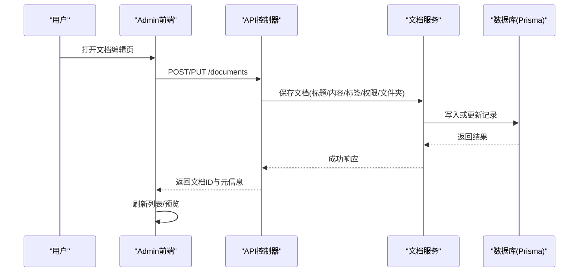
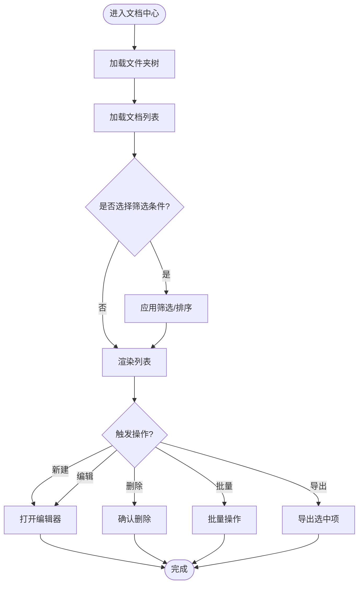
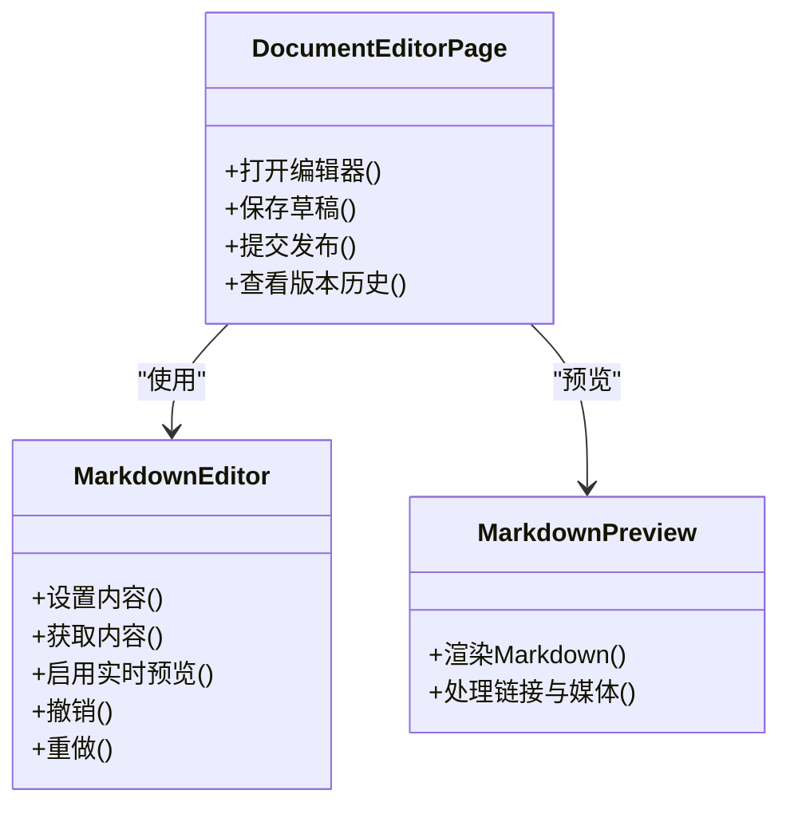
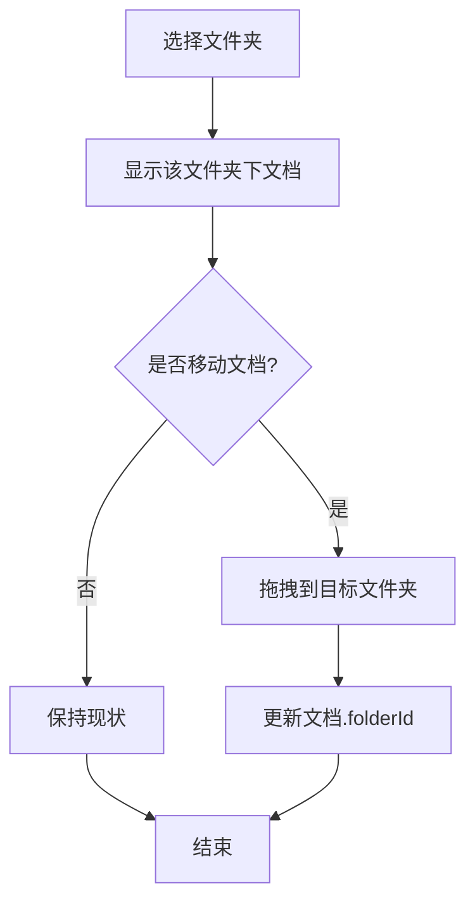
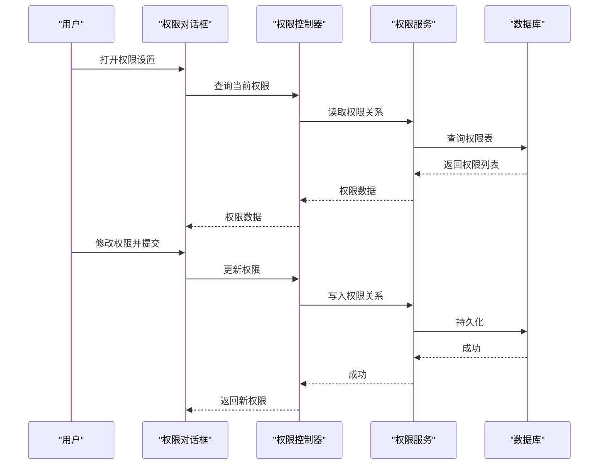
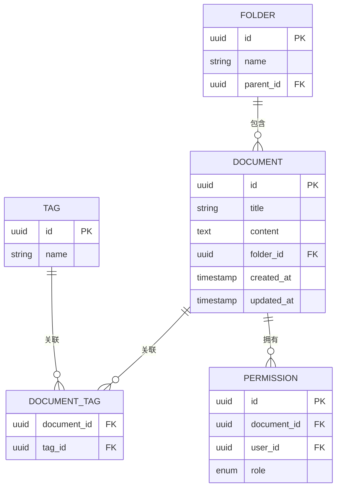
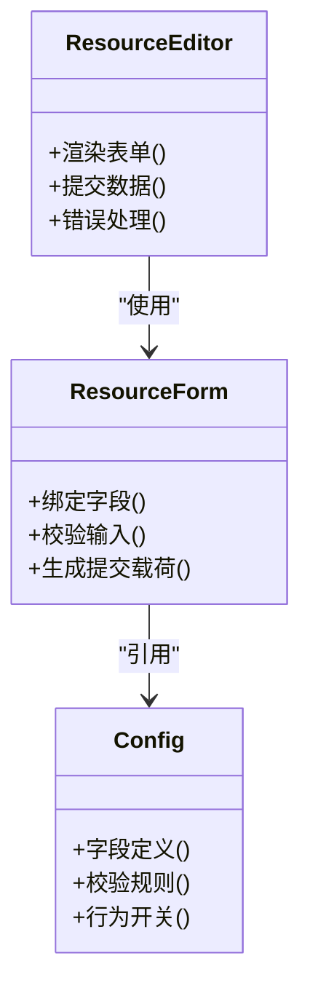
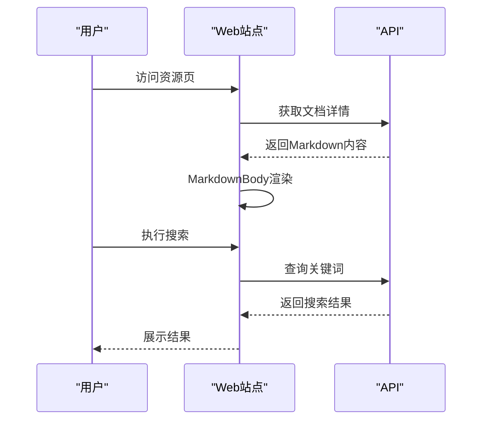
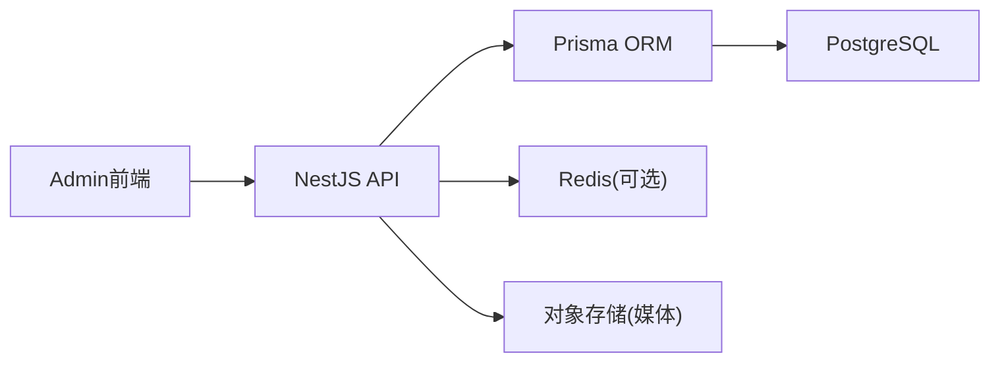

# 文档管理

<cite>
**本文引用的文件**   
- [apps/admin/src/app/(dashboard)/documents/page.tsx](file://apps/admin/src/app/(dashboard)/documents/page.tsx)
- [apps/admin/src/components/documents/DocumentsHub.tsx](file://apps/admin/src/components/documents/DocumentsHub.tsx)
- [apps/admin/src/components/documents/DocumentListView.tsx](file://apps/admin/src/components/documents/DocumentListView.tsx)
- [apps/admin/src/components/documents/DocumentEditorPage.tsx](file://apps/admin/src/components/documents/DocumentEditorPage.tsx)
- [apps/admin/src/components/documents/DocumentReadView.tsx](file://apps/admin/src/components/documents/DocumentReadView.tsx)
- [apps/admin/src/components/documents/DocumentReadPageContent.tsx](file://apps/admin/src/components/documents/DocumentReadPageContent.tsx)
- [apps/admin/src/components/documents/MarkdownPreview.tsx](file://apps/admin/src/components/documents/MarkdownPreview.tsx)
- [apps/admin/src/components/crud/MarkdownEditor.tsx](file://apps/admin/src/components/crud/MarkdownEditor.tsx)
- [apps/admin/src/features/documents.ts](file://apps/admin/src/features/documents.ts)
- [apps/api/src/documents/documents.controller.ts](file://apps/api/src/documents/documents.controller.ts)
- [apps/api/src/documents/documents.service.ts](file://apps/api/src/documents/documents.service.ts)
- [apps/api/src/documents/doc-folders.service.ts](file://apps/api/src/documents/doc-folders.service.ts)
- [apps/api/src/documents/doc-tags.service.ts](file://apps/api/src/documents/doc-tags.service.ts)
- [apps/api/src/documents/document-permissions.service.ts](file://apps/api/src/documents/document-permissions.service.ts)
- [apps/api/src/documents/dto/document.dto.ts](file://apps/api/src/documents/dto/document.dto.ts)
- [apps/api/src/documents/dto/document-permission.dto.ts](file://apps/api/src/documents/dto/document-permission.dto.ts)
- [apps/api/prisma/schema.prisma](file://apps/api/prisma/schema.prisma)
- [apps/admin/src/components/documents/DocFolderSidebar.tsx](file://apps/admin/src/components/documents/DocFolderSidebar.tsx)
- [apps/admin/src/components/documents/DocumentTagsManageDialog.tsx](file://apps/admin/src/components/documents/DocumentTagsManageDialog.tsx)
- [apps/admin/src/components/DocumentPermissionButton.tsx](file://apps/admin/src/components/DocumentPermissionButton.tsx)
- [apps/admin/src/components/DocumentPermissionDialog.tsx](file://apps/admin/src/components/DocumentPermissionDialog.tsx)
- [apps/admin/src/components/crud/ResourceEditor.tsx](file://apps/admin/src/components/crud/ResourceEditor.tsx)
- [apps/admin/src/components/crud/ResourceForm.tsx](file://apps/admin/src/components/crud/ResourceForm.tsx)
- [apps/admin/src/components/crud/config.ts](file://apps/admin/src/components/crud/config.ts)
- [apps/web/src/app/[locale]/resources/page.tsx](file://apps/web/src/app/[locale]/resources/page.tsx)
- [apps/web/src/components/content/MarkdownBody.tsx](file://apps/web/src/components/content/MarkdownBody.tsx)
- [apps/web/src/lib/search/route.ts](file://apps/web/src/lib/search/route.ts)
</cite>

## 目录
1. [简介](#简介)
2. [项目结构](#项目结构)
3. [核心组件](#核心组件)
4. [架构总览](#架构总览)
5. [详细组件分析](#详细组件分析)
6. [依赖关系分析](#依赖关系分析)
7. [性能考虑](#性能考虑)
8. [故障排查指南](#故障排查指南)
9. [结论](#结论)
10. [附录](#附录)

## 简介
本文件系统性地梳理并说明企业级“文档管理”模块的架构与实现，覆盖以下关键能力：
- 层级文件夹结构与权限控制
- Markdown编辑器集成、实时预览、版本历史与撤销重做
- 文档标签系统、全文搜索、导出导入与批量操作
- 文档分享、访问统计、评论反馈与知识图谱
- 数据模型、API接口与前端组件使用示例

该文档旨在帮助开发者快速理解现有实现，并在其基础上扩展企业级功能。

## 项目结构
文档管理功能横跨前后端：
- 前端（admin）提供文档列表、编辑器、阅读视图、权限与标签管理等界面
- 后端（api）提供文档、文件夹、标签、权限等REST API，并通过Prisma与数据库交互
- 公开站点（web）用于展示资源页面与搜索入口

图表来源
- [apps/admin/src/components/documents/DocumentsHub.tsx](file://apps/admin/src/components/documents/DocumentsHub.tsx)
- [apps/admin/src/components/documents/DocumentListView.tsx](file://apps/admin/src/components/documents/DocumentListView.tsx)
- [apps/admin/src/components/documents/DocumentEditorPage.tsx](file://apps/admin/src/components/documents/DocumentEditorPage.tsx)
- [apps/admin/src/components/documents/DocumentReadView.tsx](file://apps/admin/src/components/documents/DocumentReadView.tsx)
- [apps/admin/src/components/documents/MarkdownPreview.tsx](file://apps/admin/src/components/documents/MarkdownPreview.tsx)
- [apps/admin/src/components/crud/MarkdownEditor.tsx](file://apps/admin/src/components/crud/MarkdownEditor.tsx)
- [apps/admin/src/components/documents/DocFolderSidebar.tsx](file://apps/admin/src/components/documents/DocFolderSidebar.tsx)
- [apps/admin/src/components/documents/DocumentTagsManageDialog.tsx](file://apps/admin/src/components/documents/DocumentTagsManageDialog.tsx)
- [apps/admin/src/components/DocumentPermissionDialog.tsx](file://apps/admin/src/components/DocumentPermissionDialog.tsx)
- [apps/api/src/documents/documents.controller.ts](file://apps/api/src/documents/documents.controller.ts)
- [apps/api/src/documents/documents.service.ts](file://apps/api/src/documents/documents.service.ts)
- [apps/api/src/documents/doc-folders.service.ts](file://apps/api/src/documents/doc-folders.service.ts)
- [apps/api/src/documents/doc-tags.service.ts](file://apps/api/src/documents/doc-tags.service.ts)
- [apps/api/src/documents/document-permissions.service.ts](file://apps/api/src/documents/document-permissions.service.ts)
- [apps/api/prisma/schema.prisma](file://apps/api/prisma/schema.prisma)
- [apps/web/src/app/[locale]/resources/page.tsx](file://apps/web/src/app/[locale]/resources/page.tsx)
- [apps/web/src/components/content/MarkdownBody.tsx](file://apps/web/src/components/content/MarkdownBody.tsx)
- [apps/web/src/lib/search/route.ts](file://apps/web/src/lib/search/route.ts)

章节来源
- [apps/admin/src/app/(dashboard)/documents/page.tsx](file://apps/admin/src/app/(dashboard)/documents/page.tsx)
- [apps/admin/src/components/documents/DocumentsHub.tsx](file://apps/admin/src/components/documents/DocumentsHub.tsx)
- [apps/api/src/documents/documents.controller.ts](file://apps/api/src/documents/documents.controller.ts)
- [apps/api/prisma/schema.prisma](file://apps/api/prisma/schema.prisma)

## 核心组件
- 文档中心与列表：DocumentsHub、DocumentListView负责文档检索、分页、筛选与批量操作入口
- 编辑器与预览：DocumentEditorPage集成MarkdownEditor，支持实时预览、撤销重做与版本历史；DocumentReadView与MarkdownPreview用于只读渲染
- 文件夹与标签：DocFolderSidebar管理层级文件夹；DocumentTagsManageDialog维护标签集合与分配
- 权限与协作：DocumentPermissionDialog与后端权限服务配合，实现基于角色/用户的细粒度访问控制
- 数据层：documents.service封装CRUD、标签、权限、文件夹等操作；Prisma schema定义数据模型

章节来源
- [apps/admin/src/components/documents/DocumentsHub.tsx](file://apps/admin/src/components/documents/DocumentsHub.tsx)
- [apps/admin/src/components/documents/DocumentListView.tsx](file://apps/admin/src/components/documents/DocumentListView.tsx)
- [apps/admin/src/components/documents/DocumentEditorPage.tsx](file://apps/admin/src/components/documents/DocumentEditorPage.tsx)
- [apps/admin/src/components/documents/DocumentReadView.tsx](file://apps/admin/src/components/documents/DocumentReadView.tsx)
- [apps/admin/src/components/documents/MarkdownPreview.tsx](file://apps/admin/src/components/documents/MarkdownPreview.tsx)
- [apps/admin/src/components/crud/MarkdownEditor.tsx](file://apps/admin/src/components/crud/MarkdownEditor.tsx)
- [apps/admin/src/components/documents/DocFolderSidebar.tsx](file://apps/admin/src/components/documents/DocFolderSidebar.tsx)
- [apps/admin/src/components/documents/DocumentTagsManageDialog.tsx](file://apps/admin/src/components/documents/DocumentTagsManageDialog.tsx)
- [apps/admin/src/components/DocumentPermissionDialog.tsx](file://apps/admin/src/components/DocumentPermissionDialog.tsx)
- [apps/api/src/documents/documents.service.ts](file://apps/api/src/documents/documents.service.ts)
- [apps/api/src/documents/doc-folders.service.ts](file://apps/api/src/documents/doc-folders.service.ts)
- [apps/api/src/documents/doc-tags.service.ts](file://apps/api/src/documents/doc-tags.service.ts)
- [apps/api/src/documents/document-permissions.service.ts](file://apps/api/src/documents/document-permissions.service.ts)
- [apps/api/prisma/schema.prisma](file://apps/api/prisma/schema.prisma)

## 架构总览
文档管理采用前后端分离架构：
- 前端通过Next.js应用组织页面与组件，调用后端API完成数据读写
- 后端基于NestJS控制器与服务分层，使用Prisma进行数据持久化
- 公开站点Web用于资源展示与搜索聚合

图表来源
- [apps/admin/src/components/documents/DocumentEditorPage.tsx](file://apps/admin/src/components/documents/DocumentEditorPage.tsx)
- [apps/api/src/documents/documents.controller.ts](file://apps/api/src/documents/documents.controller.ts)
- [apps/api/src/documents/documents.service.ts](file://apps/api/src/documents/documents.service.ts)
- [apps/api/prisma/schema.prisma](file://apps/api/prisma/schema.prisma)

## 详细组件分析

### 文档列表与中心
- DocumentsHub作为文档中心的容器，整合侧边栏、工具栏与列表区域
- DocumentListView提供分页、排序、筛选与批量操作（如批量移动、删除、导出）
- 与后端通过统一的文档API交互，支持按文件夹、标签、状态过滤

章节来源
- [apps/admin/src/components/documents/DocumentsHub.tsx](file://apps/admin/src/components/documents/DocumentsHub.tsx)
- [apps/admin/src/components/documents/DocumentListView.tsx](file://apps/admin/src/components/documents/DocumentListView.tsx)
- [apps/admin/src/features/documents.ts](file://apps/admin/src/features/documents.ts)

### 编辑器与预览
- DocumentEditorPage集成MarkdownEditor，支持：
  - 实时预览（分屏或切换模式）
  - 撤销/重做（基于编辑器内核）
  - 版本历史（保存每次变更快照，支持回滚）
- DocumentReadView与MarkdownPreview用于只读渲染，确保内容与样式一致

图表来源
- [apps/admin/src/components/documents/DocumentEditorPage.tsx](file://apps/admin/src/components/documents/DocumentEditorPage.tsx)
- [apps/admin/src/components/crud/MarkdownEditor.tsx](file://apps/admin/src/components/crud/MarkdownEditor.tsx)
- [apps/admin/src/components/documents/MarkdownPreview.tsx](file://apps/admin/src/components/documents/MarkdownPreview.tsx)

章节来源
- [apps/admin/src/components/documents/DocumentEditorPage.tsx](file://apps/admin/src/components/documents/DocumentEditorPage.tsx)
- [apps/admin/src/components/crud/MarkdownEditor.tsx](file://apps/admin/src/components/crud/MarkdownEditor.tsx)
- [apps/admin/src/components/documents/MarkdownPreview.tsx](file://apps/admin/src/components/documents/MarkdownPreview.tsx)

### 文件夹与标签
- DocFolderSidebar提供层级文件夹导航与拖拽移动
- DocumentTagsManageDialog管理标签创建、分配与批量关联
- 后端doc-folders.service与doc-tags.service分别处理文件夹树与标签关系

章节来源
- [apps/admin/src/components/documents/DocFolderSidebar.tsx](file://apps/admin/src/components/documents/DocFolderSidebar.tsx)
- [apps/admin/src/components/documents/DocumentTagsManageDialog.tsx](file://apps/admin/src/components/documents/DocumentTagsManageDialog.tsx)
- [apps/api/src/documents/doc-folders.service.ts](file://apps/api/src/documents/doc-folders.service.ts)
- [apps/api/src/documents/doc-tags.service.ts](file://apps/api/src/documents/doc-tags.service.ts)

### 权限与协作
- DocumentPermissionDialog提供文档级权限配置（可见/编辑/管理），支持用户与角色维度
- 后端document-permissions.service校验与落库，结合鉴权守卫实现访问控制
- 前端DocumentPermissionButton快捷触发权限面板

图表来源
- [apps/admin/src/components/DocumentPermissionDialog.tsx](file://apps/admin/src/components/DocumentPermissionDialog.tsx)
- [apps/admin/src/components/DocumentPermissionButton.tsx](file://apps/admin/src/components/DocumentPermissionButton.tsx)
- [apps/api/src/documents/document-permissions.service.ts](file://apps/api/src/documents/document-permissions.service.ts)

章节来源
- [apps/admin/src/components/DocumentPermissionDialog.tsx](file://apps/admin/src/components/DocumentPermissionDialog.tsx)
- [apps/admin/src/components/DocumentPermissionButton.tsx](file://apps/admin/src/components/DocumentPermissionButton.tsx)
- [apps/api/src/documents/document-permissions.service.ts](file://apps/api/src/documents/document-permissions.service.ts)

### 数据模型与API
- Prisma schema定义文档、文件夹、标签、权限等实体及关系
- documents.controller暴露REST接口，documents.service封装业务逻辑
- DTO定义请求/响应数据结构，保证类型安全

图表来源
- [apps/api/prisma/schema.prisma](file://apps/api/prisma/schema.prisma)

章节来源
- [apps/api/src/documents/documents.controller.ts](file://apps/api/src/documents/documents.controller.ts)
- [apps/api/src/documents/documents.service.ts](file://apps/api/src/documents/documents.service.ts)
- [apps/api/src/documents/dto/document.dto.ts](file://apps/api/src/documents/dto/document.dto.ts)
- [apps/api/src/documents/dto/document-permission.dto.ts](file://apps/api/src/documents/dto/document-permission.dto.ts)
- [apps/api/prisma/schema.prisma](file://apps/api/prisma/schema.prisma)

### 前端组件使用示例
- ResourceEditor/ResourceForm为通用资源编辑器壳，可复用至文档场景
- config.ts集中配置字段映射、校验规则与行为开关

图表来源
- [apps/admin/src/components/crud/ResourceEditor.tsx](file://apps/admin/src/components/crud/ResourceEditor.tsx)
- [apps/admin/src/components/crud/ResourceForm.tsx](file://apps/admin/src/components/crud/ResourceForm.tsx)
- [apps/admin/src/components/crud/config.ts](file://apps/admin/src/components/crud/config.ts)

章节来源
- [apps/admin/src/components/crud/ResourceEditor.tsx](file://apps/admin/src/components/crud/ResourceEditor.tsx)
- [apps/admin/src/components/crud/ResourceForm.tsx](file://apps/admin/src/components/crud/ResourceForm.tsx)
- [apps/admin/src/components/crud/config.ts](file://apps/admin/src/components/crud/config.ts)

### 公开站点与搜索
- resources/page用于资源展示，MarkdownBody渲染富文本
- search/route提供搜索入口，聚合关键词匹配与结果展示

图表来源
- [apps/web/src/app/[locale]/resources/page.tsx](file://apps/web/src/app/[locale]/resources/page.tsx)
- [apps/web/src/components/content/MarkdownBody.tsx](file://apps/web/src/components/content/MarkdownBody.tsx)
- [apps/web/src/lib/search/route.ts](file://apps/web/src/lib/search/route.ts)

章节来源
- [apps/web/src/app/[locale]/resources/page.tsx](file://apps/web/src/app/[locale]/resources/page.tsx)
- [apps/web/src/components/content/MarkdownBody.tsx](file://apps/web/src/components/content/MarkdownBody.tsx)
- [apps/web/src/lib/search/route.ts](file://apps/web/src/lib/search/route.ts)

## 依赖关系分析
- 前端依赖：Next.js路由与组件体系、Vditor（Markdown编辑器）、UI库
- 后端依赖：NestJS模块、Prisma ORM、鉴权与权限中间件
- 外部依赖：对象存储（媒体）、Redis（缓存）、PostgreSQL（数据）

[此图为概念性依赖图，不直接映射具体源码文件]

## 性能考虑
- 列表分页与懒加载：避免一次性加载大量文档
- 编辑器优化：防抖保存、增量同步、离线草稿
- 预览渲染：服务端预渲染或静态化，减少客户端计算
- 权限校验：缓存用户权限，降低频繁查询
- 搜索索引：建立倒排索引或搜索引擎，提升全文检索效率

## 故障排查指南
- 编辑器无法保存：检查网络请求、权限与后端接口状态码
- 权限异常：核对权限配置与鉴权守卫，确认用户角色与资源归属
- 标签/文件夹不同步：检查事务一致性，确认外键约束与关联更新
- 搜索无结果：验证索引构建与关键词清洗逻辑
- 媒体加载失败：检查对象存储配置与跨域策略

章节来源
- [apps/api/src/documents/documents.controller.ts](file://apps/api/src/documents/documents.controller.ts)
- [apps/api/src/documents/documents.service.ts](file://apps/api/src/documents/documents.service.ts)
- [apps/api/src/documents/document-permissions.service.ts](file://apps/api/src/documents/document-permissions.service.ts)

## 结论
本系统以模块化、分层清晰的前后端架构为基础，提供了完整的文档管理能力。通过Markdown编辑器、权限控制、标签与文件夹体系，以及可扩展的搜索与展示能力，能够满足企业级文档平台的核心需求。建议在后续迭代中强化版本历史、协作编辑、评论反馈与知识图谱等高级特性，以提升团队协作与知识沉淀效率。

## 附录
- 数据模型参考：[apps/api/prisma/schema.prisma](file://apps/api/prisma/schema.prisma)
- API接口参考：[apps/api/src/documents/documents.controller.ts](file://apps/api/src/documents/documents.controller.ts)
- 前端组件参考：
  - [apps/admin/src/components/documents/DocumentsHub.tsx](file://apps/admin/src/components/documents/DocumentsHub.tsx)
  - [apps/admin/src/components/documents/DocumentEditorPage.tsx](file://apps/admin/src/components/documents/DocumentEditorPage.tsx)
  - [apps/admin/src/components/crud/MarkdownEditor.tsx](file://apps/admin/src/components/crud/MarkdownEditor.tsx)
- 公开站点参考：
  - [apps/web/src/app/[locale]/resources/page.tsx](file://apps/web/src/app/[locale]/resources/page.tsx)
  - [apps/web/src/components/content/MarkdownBody.tsx](file://apps/web/src/components/content/MarkdownBody.tsx)
  - [apps/web/src/lib/search/route.ts](file://apps/web/src/lib/search/route.ts)