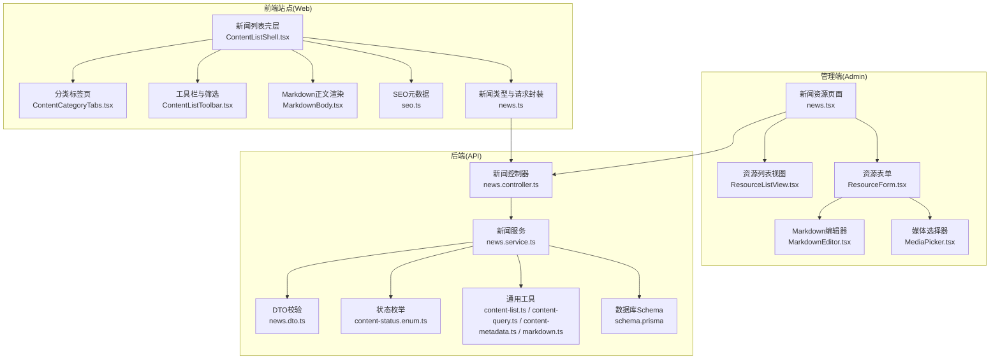
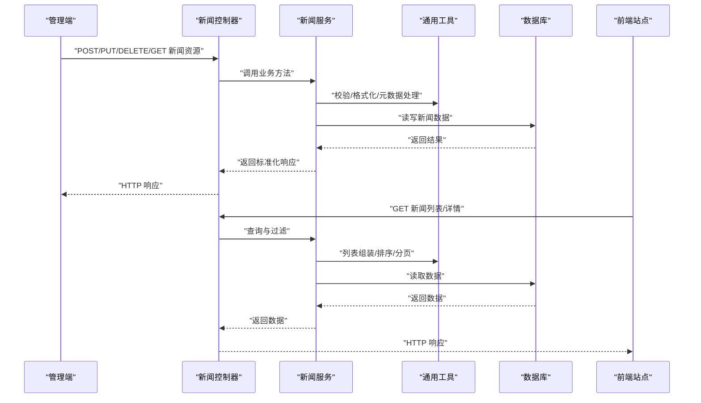
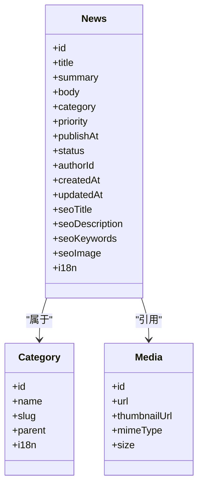
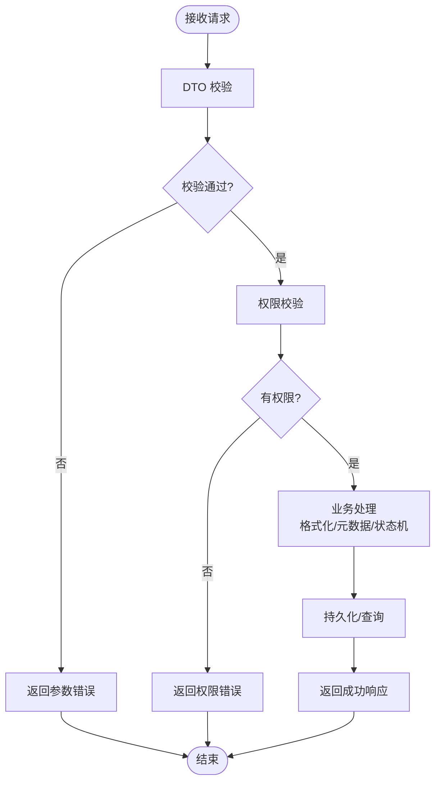
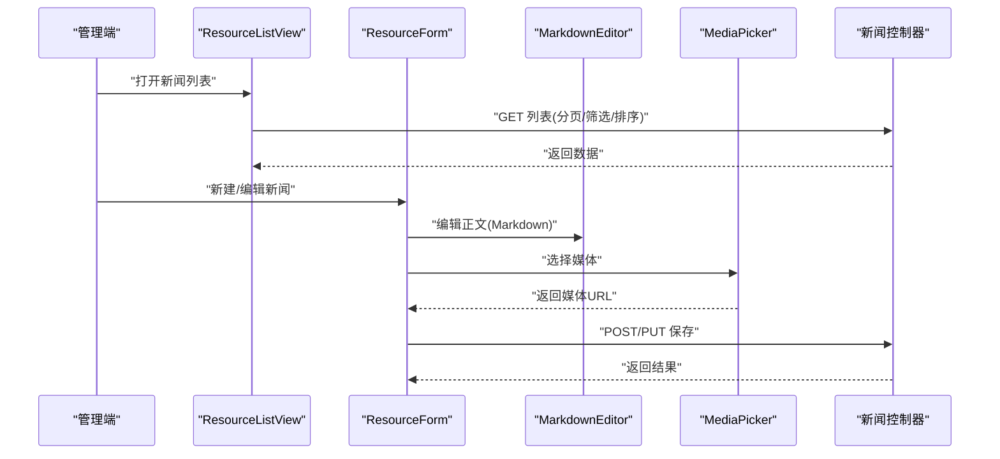
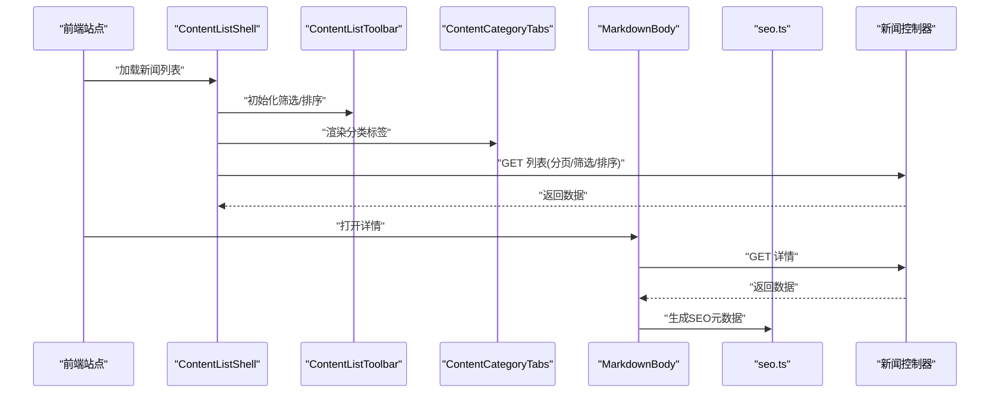
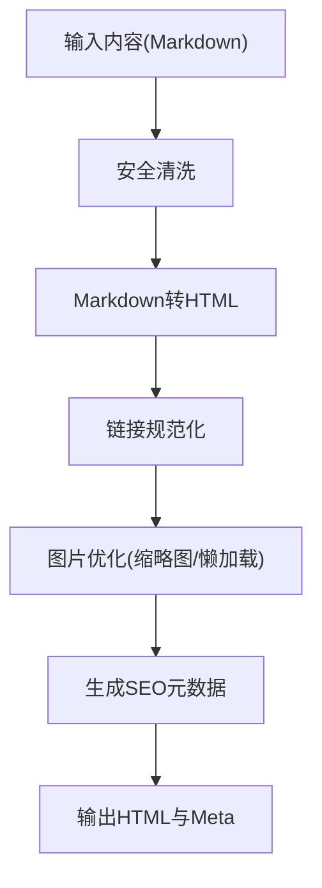
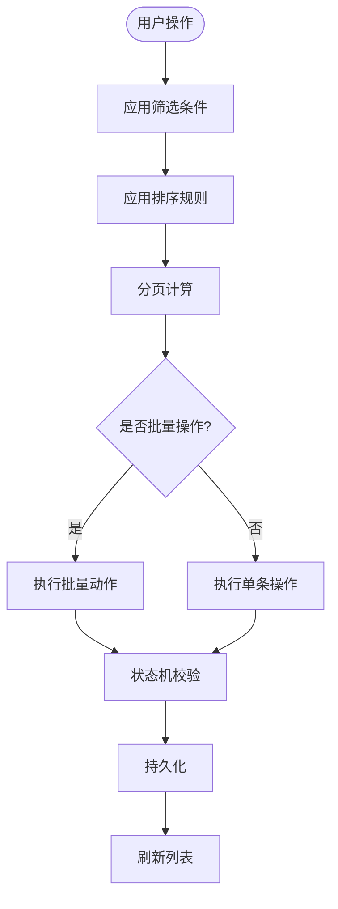
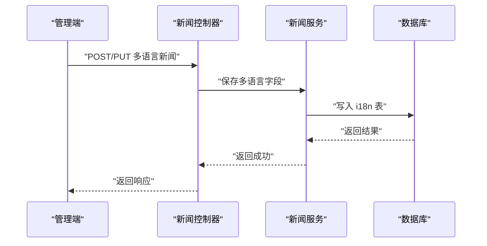
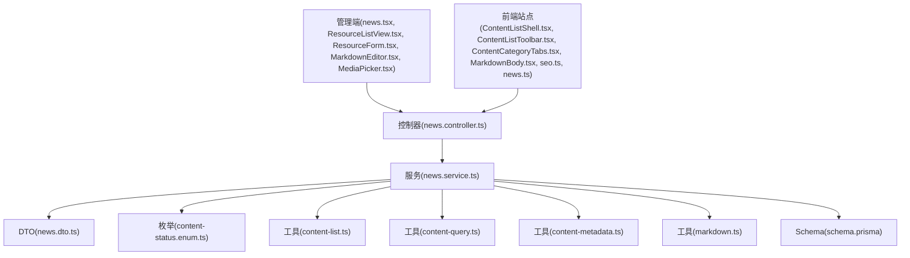

# 新闻管理

<cite>
**本文引用的文件**   
- [news.controller.ts](file://apps/api/src/news/news.controller.ts)
- [news.service.ts](file://apps/api/src/news/news.service.ts)
- [news.dto.ts](file://apps/api/src/news/dto/news.dto.ts)
- [schema.prisma](file://apps/api/prisma/schema.prisma)
- [content-status.enum.ts](file://apps/api/src/common/enums/content-status.enum.ts)
- [content-list.ts](file://apps/api/src/common/utils/content-list.ts)
- [content-query.ts](file://apps/api/src/common/utils/content-query.ts)
- [content-metadata.ts](file://apps/api/src/common/utils/content-metadata.ts)
- [markdown.ts](file://apps/api/src/common/utils/markdown.ts)
- [news.tsx](file://apps/admin/src/features/resources/news.tsx)
- [ResourceListView.tsx](file://apps/admin/src/components/crud/ResourceListView.tsx)
- [ResourceForm.tsx](file://apps/admin/src/components/crud/ResourceForm.tsx)
- [MarkdownEditor.tsx](file://apps/admin/src/components/crud/MarkdownEditor.tsx)
- [MediaPicker.tsx](file://apps/admin/src/components/crud/MediaPicker.tsx)
- [news.ts](file://apps/web/src/lib/news.ts)
- [ContentListShell.tsx](file://apps/web/src/components/content/ContentListShell.tsx)
- [ContentCategoryTabs.tsx](file://apps/web/src/components/content/ContentCategoryTabs.tsx)
- [ContentListToolbar.tsx](file://apps/web/src/components/content/ContentListToolbar.tsx)
- [MarkdownBody.tsx](file://apps/web/src/components/content/MarkdownBody.tsx)
- [seo.ts](file://apps/web/src/lib/seo.ts)
</cite>

## 目录
1. [简介](#简介)
2. [项目结构](#项目结构)
3. [核心组件](#核心组件)
4. [架构总览](#架构总览)
5. [详细组件分析](#详细组件分析)
6. [依赖关系分析](#依赖关系分析)
7. [性能考虑](#性能考虑)
8. [故障排查指南](#故障排查指南)
9. [结论](#结论)
10. [附录](#附录)

## 简介
本文件面向“新闻管理系统”的完整实现与使用，覆盖新闻内容的创建、编辑、发布与下架流程；详细说明新闻分类、优先级设置、发布时间控制与多语言支持；阐述新闻列表管理、搜索过滤、批量操作与状态管理；并给出内容格式化、图片插入、链接管理与SEO元数据配置的最佳实践。文档同时提供新闻数据模型、API接口说明以及前后端集成示例，帮助快速构建完整的新闻发布系统。

## 项目结构
本项目采用前后端分离与模块化组织：
- 后端（NestJS）：在 apps/api 中提供 REST API，包含 news 模块、通用工具与枚举、数据库 schema 定义等。
- 管理端（Next.js Admin）：在 apps/admin 中提供资源管理界面，包括新闻的增删改查、富文本编辑器、媒体选择器、列表视图与表单。
- 前端站点（Next.js Web）：在 apps/web 中提供面向用户的新闻列表与详情展示、多语言路由、SEO 元数据注入与 Markdown 渲染。

**图表来源** 
- [news.controller.ts](file://apps/api/src/news/news.controller.ts)
- [news.service.ts](file://apps/api/src/news/news.service.ts)
- [news.dto.ts](file://apps/api/src/news/dto/news.dto.ts)
- [content-status.enum.ts](file://apps/api/src/common/enums/content-status.enum.ts)
- [content-list.ts](file://apps/api/src/common/utils/content-list.ts)
- [content-query.ts](file://apps/api/src/common/utils/content-query.ts)
- [content-metadata.ts](file://apps/api/src/common/utils/content-metadata.ts)
- [markdown.ts](file://apps/api/src/common/utils/markdown.ts)
- [schema.prisma](file://apps/api/prisma/schema.prisma)
- [news.tsx](file://apps/admin/src/features/resources/news.tsx)
- [ResourceListView.tsx](file://apps/admin/src/components/crud/ResourceListView.tsx)
- [ResourceForm.tsx](file://apps/admin/src/components/crud/ResourceForm.tsx)
- [MarkdownEditor.tsx](file://apps/admin/src/components/crud/MarkdownEditor.tsx)
- [MediaPicker.tsx](file://apps/admin/src/components/crud/MediaPicker.tsx)
- [news.ts](file://apps/web/src/lib/news.ts)
- [ContentListShell.tsx](file://apps/web/src/components/content/ContentListShell.tsx)
- [ContentCategoryTabs.tsx](file://apps/web/src/components/content/ContentCategoryTabs.tsx)
- [ContentListToolbar.tsx](file://apps/web/src/components/content/ContentListToolbar.tsx)
- [MarkdownBody.tsx](file://apps/web/src/components/content/MarkdownBody.tsx)
- [seo.ts](file://apps/web/src/lib/seo.ts)

**章节来源**
- [news.controller.ts](file://apps/api/src/news/news.controller.ts)
- [news.service.ts](file://apps/api/src/news/news.service.ts)
- [news.dto.ts](file://apps/api/src/news/dto/news.dto.ts)
- [schema.prisma](file://apps/api/prisma/schema.prisma)
- [content-status.enum.ts](file://apps/api/src/common/enums/content-status.enum.ts)
- [content-list.ts](file://apps/api/src/common/utils/content-list.ts)
- [content-query.ts](file://apps/api/src/common/utils/content-query.ts)
- [content-metadata.ts](file://apps/api/src/common/utils/content-metadata.ts)
- [markdown.ts](file://apps/api/src/common/utils/markdown.ts)
- [news.tsx](file://apps/admin/src/features/resources/news.tsx)
- [ResourceListView.tsx](file://apps/admin/src/components/crud/ResourceListView.tsx)
- [ResourceForm.tsx](file://apps/admin/src/components/crud/ResourceForm.tsx)
- [MarkdownEditor.tsx](file://apps/admin/src/components/crud/MarkdownEditor.tsx)
- [MediaPicker.tsx](file://apps/admin/src/components/crud/MediaPicker.tsx)
- [news.ts](file://apps/web/src/lib/news.ts)
- [ContentListShell.tsx](file://apps/web/src/components/content/ContentListShell.tsx)
- [ContentCategoryTabs.tsx](file://apps/web/src/components/content/ContentCategoryTabs.tsx)
- [ContentListToolbar.tsx](file://apps/web/src/components/content/ContentListToolbar.tsx)
- [MarkdownBody.tsx](file://apps/web/src/components/content/MarkdownBody.tsx)
- [seo.ts](file://apps/web/src/lib/seo.ts)

## 核心组件
- 后端新闻模块
  - 控制器：暴露新闻资源的 CRUD 与批量操作接口，统一入参出参与错误处理。
  - 服务：业务编排，负责校验、转换、持久化、查询与分页、排序、过滤、状态流转。
  - DTO：字段级校验与类型约束，确保输入安全。
  - 通用工具：列表组装、查询解析、元数据处理、Markdown 处理等。
  - 枚举：内容状态（如草稿、已发布、已下架等）。
- 管理端新闻资源
  - 资源页面：注册新闻资源，挂载列表、表单、编辑器与媒体选择器。
  - 列表视图：分页、排序、筛选、批量操作（启用/禁用、删除等）。
  - 表单与编辑器：标题、摘要、分类、优先级、发布时间、正文（Markdown）、图片插入、链接管理、SEO 元数据。
  - 媒体选择器：从媒体库选择图片/视频，自动适配尺寸与占位图。
- 前端站点新闻展示
  - 列表壳层：统一布局、分页、分类切换、工具栏筛选。
  - 分类标签页：按分类聚合展示。
  - 工具栏：关键词搜索、时间范围、分类筛选、排序。
  - 正文渲染：Markdown 转 HTML，图片懒加载与外链处理。
  - SEO：动态生成标题、描述、Open Graph、结构化数据等。

**章节来源**
- [news.controller.ts](file://apps/api/src/news/news.controller.ts)
- [news.service.ts](file://apps/api/src/news/news.service.ts)
- [news.dto.ts](file://apps/api/src/news/dto/news.dto.ts)
- [content-list.ts](file://apps/api/src/common/utils/content-list.ts)
- [content-query.ts](file://apps/api/src/common/utils/content-query.ts)
- [content-metadata.ts](file://apps/api/src/common/utils/content-metadata.ts)
- [markdown.ts](file://apps/api/src/common/utils/markdown.ts)
- [content-status.enum.ts](file://apps/api/src/common/enums/content-status.enum.ts)
- [news.tsx](file://apps/admin/src/features/resources/news.tsx)
- [ResourceListView.tsx](file://apps/admin/src/components/crud/ResourceListView.tsx)
- [ResourceForm.tsx](file://apps/admin/src/components/crud/ResourceForm.tsx)
- [MarkdownEditor.tsx](file://apps/admin/src/components/crud/MarkdownEditor.tsx)
- [MediaPicker.tsx](file://apps/admin/src/components/crud/MediaPicker.tsx)
- [ContentListShell.tsx](file://apps/web/src/components/content/ContentListShell.tsx)
- [ContentCategoryTabs.tsx](file://apps/web/src/components/content/ContentCategoryTabs.tsx)
- [ContentListToolbar.tsx](file://apps/web/src/components/content/ContentListToolbar.tsx)
- [MarkdownBody.tsx](file://apps/web/src/components/content/MarkdownBody.tsx)
- [seo.ts](file://apps/web/src/lib/seo.ts)

## 架构总览
新闻管理系统的整体交互如下：
- 管理端通过 REST 调用后端新闻控制器，完成新闻的创建、更新、删除、查询与批量操作。
- 后端服务进行 DTO 校验、状态机检查、内容预处理（Markdown、链接、图片），并持久化到数据库。
- 前端站点通过统一的新闻 API 获取列表与详情，结合分类、搜索、排序与分页展示，并在详情页渲染 Markdown 正文与 SEO 元数据。

**图表来源** 
- [news.controller.ts](file://apps/api/src/news/news.controller.ts)
- [news.service.ts](file://apps/api/src/news/news.service.ts)
- [content-list.ts](file://apps/api/src/common/utils/content-list.ts)
- [content-query.ts](file://apps/api/src/common/utils/content-query.ts)
- [content-metadata.ts](file://apps/api/src/common/utils/content-metadata.ts)
- [markdown.ts](file://apps/api/src/common/utils/markdown.ts)
- [schema.prisma](file://apps/api/prisma/schema.prisma)

## 详细组件分析

### 数据模型与状态
- 数据模型
  - 新闻实体包含标题、摘要、正文（Markdown）、分类、优先级、发布时间、状态、作者、更新时间、SEO 元数据（标题、描述、关键词、OG 图像等）、多语言字段（标题/摘要/正文/SEO 的多语言版本）。
  - 分类为独立实体或枚举，支持层级与多语言名称。
  - 媒体关联用于图片/视频嵌入，支持缩略图与原始图。
- 状态管理
  - 状态枚举涵盖草稿、已发布、已下架、定时发布等。
  - 发布与下架由服务层校验权限与时间条件，保证一致性。

**图表来源** 
- [schema.prisma](file://apps/api/prisma/schema.prisma)
- [content-status.enum.ts](file://apps/api/src/common/enums/content-status.enum.ts)

**章节来源**
- [schema.prisma](file://apps/api/prisma/schema.prisma)
- [content-status.enum.ts](file://apps/api/src/common/enums/content-status.enum.ts)

### API 接口与流程
- 主要接口
  - 列表查询：支持分类、关键词、时间范围、排序、分页。
  - 详情查询：按 ID 或 slug 获取单条新闻。
  - 创建/更新：提交 DTO，服务端校验并持久化。
  - 删除/批量删除：支持软删除或硬删除策略。
  - 状态变更：发布、下架、定时发布。
- 请求/响应规范
  - 统一响应结构，包含数据、分页信息与错误码。
  - 错误处理：参数校验失败、权限不足、资源不存在等。

**图表来源** 
- [news.controller.ts](file://apps/api/src/news/news.controller.ts)
- [news.service.ts](file://apps/api/src/news/news.service.ts)
- [news.dto.ts](file://apps/api/src/news/dto/news.dto.ts)
- [content-status.enum.ts](file://apps/api/src/common/enums/content-status.enum.ts)

**章节来源**
- [news.controller.ts](file://apps/api/src/news/news.controller.ts)
- [news.service.ts](file://apps/api/src/news/news.service.ts)
- [news.dto.ts](file://apps/api/src/news/dto/news.dto.ts)

### 管理端新闻资源
- 资源页面
  - 注册新闻资源，挂载列表、表单、编辑器与媒体选择器。
  - 支持多语言字段切换与预览。
- 列表视图
  - 分页、排序、筛选（分类、状态、时间）、批量操作（启用/禁用、删除）。
- 表单与编辑器
  - 标题、摘要、分类、优先级、发布时间、正文（Markdown）、图片插入、链接管理、SEO 元数据。
  - 实时预览与校验提示。
- 媒体选择器
  - 从媒体库选择图片/视频，自动适配尺寸与占位图。

**图表来源** 
- [news.tsx](file://apps/admin/src/features/resources/news.tsx)
- [ResourceListView.tsx](file://apps/admin/src/components/crud/ResourceListView.tsx)
- [ResourceForm.tsx](file://apps/admin/src/components/crud/ResourceForm.tsx)
- [MarkdownEditor.tsx](file://apps/admin/src/components/crud/MarkdownEditor.tsx)
- [MediaPicker.tsx](file://apps/admin/src/components/crud/MediaPicker.tsx)
- [news.controller.ts](file://apps/api/src/news/news.controller.ts)

**章节来源**
- [news.tsx](file://apps/admin/src/features/resources/news.tsx)
- [ResourceListView.tsx](file://apps/admin/src/components/crud/ResourceListView.tsx)
- [ResourceForm.tsx](file://apps/admin/src/components/crud/ResourceForm.tsx)
- [MarkdownEditor.tsx](file://apps/admin/src/components/crud/MarkdownEditor.tsx)
- [MediaPicker.tsx](file://apps/admin/src/components/crud/MediaPicker.tsx)

### 前端站点新闻展示
- 列表壳层
  - 统一布局、分页、分类切换、工具栏筛选。
- 分类标签页
  - 按分类聚合展示，支持多语言分类名。
- 工具栏
  - 关键词搜索、时间范围、分类筛选、排序。
- 正文渲染
  - Markdown 转 HTML，图片懒加载与外链处理。
- SEO
  - 动态生成标题、描述、Open Graph、结构化数据等。

**图表来源** 
- [ContentListShell.tsx](file://apps/web/src/components/content/ContentListShell.tsx)
- [ContentListToolbar.tsx](file://apps/web/src/components/content/ContentListToolbar.tsx)
- [ContentCategoryTabs.tsx](file://apps/web/src/components/content/ContentCategoryTabs.tsx)
- [MarkdownBody.tsx](file://apps/web/src/components/content/MarkdownBody.tsx)
- [seo.ts](file://apps/web/src/lib/seo.ts)
- [news.ts](file://apps/web/src/lib/news.ts)
- [news.controller.ts](file://apps/api/src/news/news.controller.ts)

**章节来源**
- [ContentListShell.tsx](file://apps/web/src/components/content/ContentListShell.tsx)
- [ContentListToolbar.tsx](file://apps/web/src/components/content/ContentListToolbar.tsx)
- [ContentCategoryTabs.tsx](file://apps/web/src/components/content/ContentCategoryTabs.tsx)
- [MarkdownBody.tsx](file://apps/web/src/components/content/MarkdownBody.tsx)
- [seo.ts](file://apps/web/src/lib/seo.ts)
- [news.ts](file://apps/web/src/lib/news.ts)

### 内容格式化、图片插入、链接管理与SEO
- 内容格式化
  - Markdown 编辑器支持富文本能力，后端统一处理 Markdown 转 HTML，并进行安全清洗。
- 图片插入
  - 媒体选择器返回媒体 URL，编辑器内插入图片节点，支持缩略图与懒加载。
- 链接管理
  - 链接规范化与外链标记，避免 XSS 风险。
- SEO 元数据
  - 标题、描述、关键词、OG 图像、Twitter Card、结构化数据（JSON-LD）。

**图表来源** 
- [markdown.ts](file://apps/api/src/common/utils/markdown.ts)
- [content-metadata.ts](file://apps/api/src/common/utils/content-metadata.ts)

**章节来源**
- [markdown.ts](file://apps/api/src/common/utils/markdown.ts)
- [content-metadata.ts](file://apps/api/src/common/utils/content-metadata.ts)

### 新闻列表管理、搜索过滤、批量操作与状态管理
- 列表管理
  - 分页、排序、筛选（分类、状态、时间）、导出。
- 搜索过滤
  - 关键词模糊匹配、分类精确匹配、时间范围过滤。
- 批量操作
  - 批量发布/下架、批量删除、批量移动分类。
- 状态管理
  - 状态机校验，确保发布/下架逻辑一致性与可追溯性。

**图表来源** 
- [content-list.ts](file://apps/api/src/common/utils/content-list.ts)
- [content-query.ts](file://apps/api/src/common/utils/content-query.ts)
- [content-status.enum.ts](file://apps/api/src/common/enums/content-status.enum.ts)

**章节来源**
- [content-list.ts](file://apps/api/src/common/utils/content-list.ts)
- [content-query.ts](file://apps/api/src/common/utils/content-query.ts)
- [content-status.enum.ts](file://apps/api/src/common/enums/content-status.enum.ts)

### 多语言支持
- 多语言字段
  - 标题、摘要、正文、SEO 元数据支持多语言版本。
- 路由与本地化
  - 前端基于 locale 的路由，动态加载对应语言包。
- 分类多语言
  - 分类名称与描述支持多语言。

**图表来源** 
- [news.controller.ts](file://apps/api/src/news/news.controller.ts)
- [news.service.ts](file://apps/api/src/news/news.service.ts)
- [schema.prisma](file://apps/api/prisma/schema.prisma)

**章节来源**
- [news.controller.ts](file://apps/api/src/news/news.controller.ts)
- [news.service.ts](file://apps/api/src/news/news.service.ts)
- [schema.prisma](file://apps/api/prisma/schema.prisma)

## 依赖关系分析
- 模块耦合
  - 控制器依赖服务，服务依赖 DTO、枚举与通用工具，工具依赖数据库 Schema。
  - 管理端依赖控制器 API，前端站点依赖控制器 API 与 SEO 工具。
- 外部依赖
  - 数据库（PostgreSQL）、对象存储（MinIO/OSS）、Markdown 渲染库、国际化库。

**图表来源** 
- [news.controller.ts](file://apps/api/src/news/news.controller.ts)
- [news.service.ts](file://apps/api/src/news/news.service.ts)
- [news.dto.ts](file://apps/api/src/news/dto/news.dto.ts)
- [content-status.enum.ts](file://apps/api/src/common/enums/content-status.enum.ts)
- [content-list.ts](file://apps/api/src/common/utils/content-list.ts)
- [content-query.ts](file://apps/api/src/common/utils/content-query.ts)
- [content-metadata.ts](file://apps/api/src/common/utils/content-metadata.ts)
- [markdown.ts](file://apps/api/src/common/utils/markdown.ts)
- [schema.prisma](file://apps/api/prisma/schema.prisma)
- [news.tsx](file://apps/admin/src/features/resources/news.tsx)
- [ResourceListView.tsx](file://apps/admin/src/components/crud/ResourceListView.tsx)
- [ResourceForm.tsx](file://apps/admin/src/components/crud/ResourceForm.tsx)
- [MarkdownEditor.tsx](file://apps/admin/src/components/crud/MarkdownEditor.tsx)
- [MediaPicker.tsx](file://apps/admin/src/components/crud/MediaPicker.tsx)
- [ContentListShell.tsx](file://apps/web/src/components/content/ContentListShell.tsx)
- [ContentListToolbar.tsx](file://apps/web/src/components/content/ContentListToolbar.tsx)
- [ContentCategoryTabs.tsx](file://apps/web/src/components/content/ContentCategoryTabs.tsx)
- [MarkdownBody.tsx](file://apps/web/src/components/content/MarkdownBody.tsx)
- [seo.ts](file://apps/web/src/lib/seo.ts)
- [news.ts](file://apps/web/src/lib/news.ts)

**章节来源**
- [news.controller.ts](file://apps/api/src/news/news.controller.ts)
- [news.service.ts](file://apps/api/src/news/news.service.ts)
- [news.dto.ts](file://apps/api/src/news/dto/news.dto.ts)
- [content-status.enum.ts](file://apps/api/src/common/enums/content-status.enum.ts)
- [content-list.ts](file://apps/api/src/common/utils/content-list.ts)
- [content-query.ts](file://apps/api/src/common/utils/content-query.ts)
- [content-metadata.ts](file://apps/api/src/common/utils/content-metadata.ts)
- [markdown.ts](file://apps/api/src/common/utils/markdown.ts)
- [schema.prisma](file://apps/api/prisma/schema.prisma)
- [news.tsx](file://apps/admin/src/features/resources/news.tsx)
- [ResourceListView.tsx](file://apps/admin/src/components/crud/ResourceListView.tsx)
- [ResourceForm.tsx](file://apps/admin/src/components/crud/ResourceForm.tsx)
- [MarkdownEditor.tsx](file://apps/admin/src/components/crud/MarkdownEditor.tsx)
- [MediaPicker.tsx](file://apps/admin/src/components/crud/MediaPicker.tsx)
- [ContentListShell.tsx](file://apps/web/src/components/content/ContentListShell.tsx)
- [ContentListToolbar.tsx](file://apps/web/src/components/content/ContentListToolbar.tsx)
- [ContentCategoryTabs.tsx](file://apps/web/src/components/content/ContentCategoryTabs.tsx)
- [MarkdownBody.tsx](file://apps/web/src/components/content/MarkdownBody.tsx)
- [seo.ts](file://apps/web/src/lib/seo.ts)
- [news.ts](file://apps/web/src/lib/news.ts)

## 性能考虑
- 列表查询优化
  - 合理使用索引（分类、状态、发布时间），避免全表扫描。
  - 分页限制每页数量，避免大结果集传输。
- 内容渲染优化
  - Markdown 预渲染与缓存，减少重复转换开销。
  - 图片懒加载与 CDN 加速，降低首屏负载。
- 批量操作优化
  - 事务处理，减少数据库往返次数。
  - 异步任务队列处理耗时操作（如批量更新、媒体同步）。
- SEO 与缓存
  - 静态资源缓存与 CDN 分发，提升访问速度。
  - 动态元数据按需生成，避免不必要的计算。

[本节为通用指导，不直接分析具体文件]

## 故障排查指南
- 常见问题
  - 参数校验失败：检查 DTO 字段类型与必填项。
  - 权限不足：确认角色与权限配置。
  - 资源不存在：检查 ID/slug 是否正确。
  - Markdown 渲染异常：检查语法与外链安全性。
  - 图片加载失败：检查媒体 URL 与 CDN 配置。
- 调试建议
  - 开启详细日志，定位错误堆栈。
  - 使用 Postman/浏览器开发者工具检查请求/响应。
  - 检查数据库迁移与 Schema 一致性。

**章节来源**
- [news.dto.ts](file://apps/api/src/news/dto/news.dto.ts)
- [news.controller.ts](file://apps/api/src/news/news.controller.ts)
- [news.service.ts](file://apps/api/src/news/news.service.ts)

## 结论
本新闻管理系统提供了完整的新闻生命周期管理能力，涵盖内容创建、编辑、发布与下架，支持分类、优先级、发布时间控制与多语言。管理端与前端站点分别提供高效的资源管理与展示能力，配合通用工具与 SEO 配置，满足企业级新闻发布需求。通过合理的架构设计与性能优化，系统具备良好的可扩展性与可维护性。

[本节为总结，不直接分析具体文件]

## 附录
- 最佳实践
  - 统一 DTO 校验与错误处理，确保接口稳定性。
  - 使用 Markdown 与媒体选择器提升内容创作效率。
  - 合理设计分类与优先级，便于检索与展示。
  - 完善 SEO 元数据，提升搜索引擎可见性。
  - 实施多语言策略，覆盖更多用户群体。

[本节为补充信息，不直接分析具体文件]