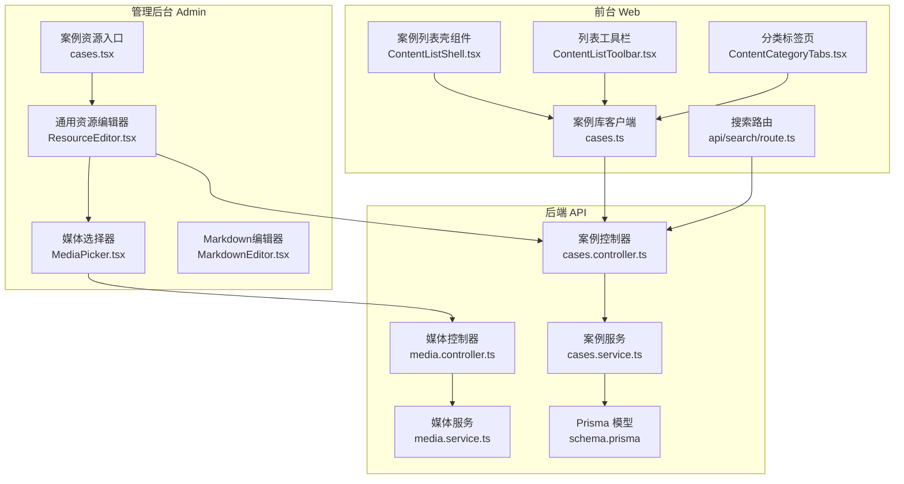
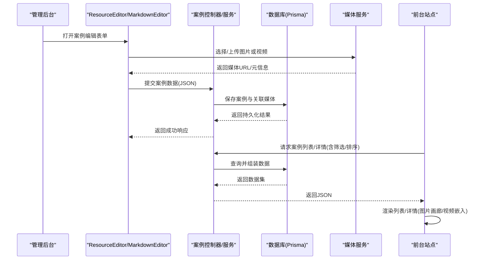
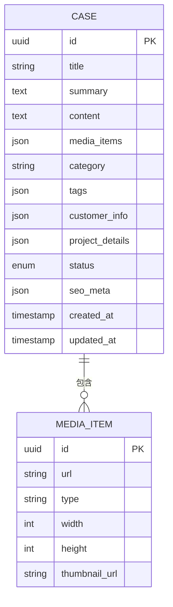
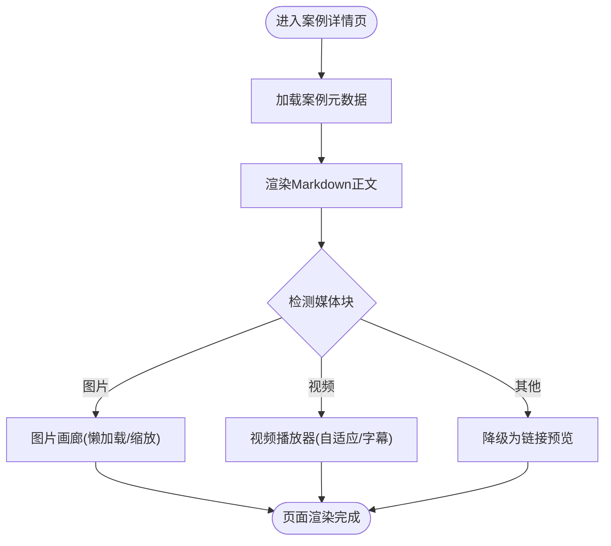
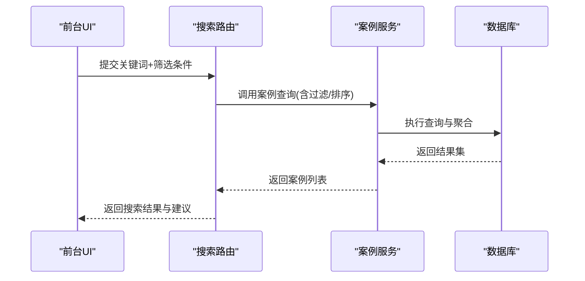
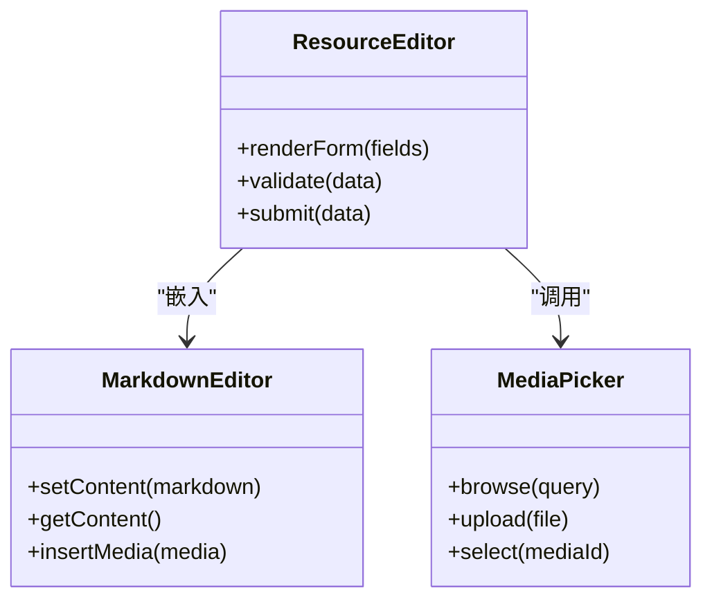
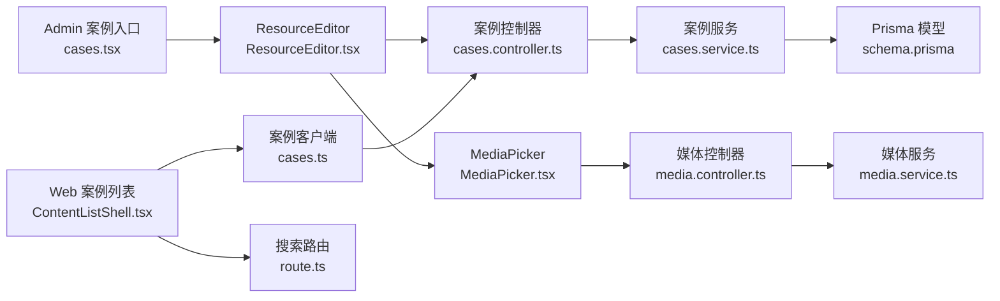

# 案例管理

<cite>
**本文引用的文件**   
- [cases.controller.ts](file://apps/api/src/cases/cases.controller.ts)
- [cases.service.ts](file://apps/api/src/cases/cases.service.ts)
- [case.dto.ts](file://apps/api/src/cases/dto/case.dto.ts)
- [schema.prisma](file://apps/api/prisma/schema.prisma)
- [seed-content.ts](file://apps/api/prisma/seed-content.ts)
- [cases.tsx](file://apps/admin/src/features/resources/cases.tsx)
- [ResourceEditor.tsx](file://apps/admin/src/components/crud/ResourceEditor.tsx)
- [MediaPicker.tsx](file://apps/admin/src/components/crud/MediaPicker.tsx)
- [MarkdownEditor.tsx](file://apps/admin/src/components/crud/MarkdownEditor.tsx)
- [ContentListShell.tsx](file://apps/web/src/components/content/ContentListShell.tsx)
- [ContentListToolbar.tsx](file://apps/web/src/components/content/ContentListToolbar.tsx)
- [ContentCategoryTabs.tsx](file://apps/web/src/components/content/ContentCategoryTabs.tsx)
- [cases.ts](file://apps/web/src/lib/cases.ts)
- [route.ts](file://apps/web/src/app/api/search/route.ts)
- [media.service.ts](file://apps/api/src/media/media.service.ts)
- [media.controller.ts](file://apps/api/src/media/media.controller.ts)
</cite>

## 目录
1. [简介](#简介)
2. [项目结构](#项目结构)
3. [核心组件](#核心组件)
4. [架构总览](#架构总览)
5. [详细组件分析](#详细组件分析)
6. [依赖关系分析](#依赖关系分析)
7. [性能考虑](#性能考虑)
8. [故障排查指南](#故障排查指南)
9. [结论](#结论)
10. [附录](#附录)

## 简介
本文件面向“案例管理系统”的完整文档，覆盖案例内容的结构化编辑、模板系统与字段管理；案例分类、行业标签、客户信息与项目详情管理；案例展示页面生成、图片画廊、视频嵌入与多媒体资源管理；以及案例搜索、筛选、排序与推荐算法。同时提供数据模型、API接口与前端组件集成指南，帮助构建专业的案例展示平台。

## 项目结构
系统采用前后端分离架构：
- 后端 NestJS（apps/api）提供案例与媒体等 REST API，使用 Prisma 管理数据库模型与迁移。
- 管理后台 Next.js（apps/admin）提供案例资源的增删改查、富文本编辑器、媒体选择器与列表工具栏。
- 前台站点 Next.js（apps/web）负责案例列表页、详情页渲染、搜索与推荐能力。

图表来源
- [cases.tsx](file://apps/admin/src/features/resources/cases.tsx)
- [ResourceEditor.tsx](file://apps/admin/src/components/crud/ResourceEditor.tsx)
- [MediaPicker.tsx](file://apps/admin/src/components/crud/MediaPicker.tsx)
- [MarkdownEditor.tsx](file://apps/admin/src/components/crud/MarkdownEditor.tsx)
- [cases.controller.ts](file://apps/api/src/cases/cases.controller.ts)
- [cases.service.ts](file://apps/api/src/cases/cases.service.ts)
- [media.service.ts](file://apps/api/src/media/media.service.ts)
- [media.controller.ts](file://apps/api/src/media/media.controller.ts)
- [schema.prisma](file://apps/api/prisma/schema.prisma)
- [ContentListShell.tsx](file://apps/web/src/components/content/ContentListShell.tsx)
- [ContentListToolbar.tsx](file://apps/web/src/components/content/ContentListToolbar.tsx)
- [ContentCategoryTabs.tsx](file://apps/web/src/components/content/ContentCategoryTabs.tsx)
- [cases.ts](file://apps/web/src/lib/cases.ts)
- [route.ts](file://apps/web/src/app/api/search/route.ts)

章节来源
- [cases.controller.ts](file://apps/api/src/cases/cases.controller.ts)
- [cases.service.ts](file://apps/api/src/cases/cases.service.ts)
- [schema.prisma](file://apps/api/prisma/schema.prisma)
- [cases.tsx](file://apps/admin/src/features/resources/cases.tsx)
- [ResourceEditor.tsx](file://apps/admin/src/components/crud/ResourceEditor.tsx)
- [MediaPicker.tsx](file://apps/admin/src/components/crud/MediaPicker.tsx)
- [MarkdownEditor.tsx](file://apps/admin/src/components/crud/MarkdownEditor.tsx)
- [ContentListShell.tsx](file://apps/web/src/components/content/ContentListShell.tsx)
- [ContentListToolbar.tsx](file://apps/web/src/components/content/ContentListToolbar.tsx)
- [ContentCategoryTabs.tsx](file://apps/web/src/components/content/ContentCategoryTabs.tsx)
- [cases.ts](file://apps/web/src/lib/cases.ts)
- [route.ts](file://apps/web/src/app/api/search/route.ts)

## 核心组件
- 案例数据模型与 DTO：定义案例实体字段、校验规则与序列化格式，支撑结构化编辑与模板渲染。
- 案例控制器与服务：对外暴露案例 CRUD、分页、筛选、排序与详情查询；内部封装业务逻辑与数据访问。
- 媒体服务与控制器：统一处理图片上传、缩略图、水印、CDN 地址解析与访问控制。
- 管理后台资源编辑器：基于通用 ResourceEditor 实现案例表单、Markdown 内容编辑与媒体选择。
- 前台案例列表与工具栏：支持分类切换、关键词搜索、多条件筛选与排序，调用案例 API 获取数据。
- 搜索路由：聚合全文检索建议与结果，结合分类与标签进行过滤。

章节来源
- [case.dto.ts](file://apps/api/src/cases/dto/case.dto.ts)
- [cases.controller.ts](file://apps/api/src/cases/cases.controller.ts)
- [cases.service.ts](file://apps/api/src/cases/cases.service.ts)
- [media.service.ts](file://apps/api/src/media/media.service.ts)
- [media.controller.ts](file://apps/api/src/media/media.controller.ts)
- [ResourceEditor.tsx](file://apps/admin/src/components/crud/ResourceEditor.tsx)
- [MediaPicker.tsx](file://apps/admin/src/components/crud/MediaPicker.tsx)
- [MarkdownEditor.tsx](file://apps/admin/src/components/crud/MarkdownEditor.tsx)
- [ContentListShell.tsx](file://apps/web/src/components/content/ContentListShell.tsx)
- [ContentListToolbar.tsx](file://apps/web/src/components/content/ContentListToolbar.tsx)
- [ContentCategoryTabs.tsx](file://apps/web/src/components/content/ContentCategoryTabs.tsx)
- [cases.ts](file://apps/web/src/lib/cases.ts)
- [route.ts](file://apps/web/src/app/api/search/route.ts)

## 架构总览
案例管理系统的端到端流程如下：
- 管理后台通过 ResourceEditor 与 MarkdownEditor 完成案例结构化编辑，并通过 MediaPicker 插入图片/视频。
- 请求经 cases.controller 路由到 cases.service，持久化至数据库（Prisma）。
- 前台 ContentListShell 与工具栏组件组合筛选与分页，调用案例 API 获取列表；详情页渲染富文本与媒体。
- 搜索路由聚合关键词与建议，返回匹配案例。

图表来源
- [cases.controller.ts](file://apps/api/src/cases/cases.controller.ts)
- [cases.service.ts](file://apps/api/src/cases/cases.service.ts)
- [media.service.ts](file://apps/api/src/media/media.service.ts)
- [ResourceEditor.tsx](file://apps/admin/src/components/crud/ResourceEditor.tsx)
- [MediaPicker.tsx](file://apps/admin/src/components/crud/MediaPicker.tsx)
- [MarkdownEditor.tsx](file://apps/admin/src/components/crud/MarkdownEditor.tsx)
- [ContentListShell.tsx](file://apps/web/src/components/content/ContentListShell.tsx)
- [cases.ts](file://apps/web/src/lib/cases.ts)

## 详细组件分析

### 数据模型与字段管理
- 案例实体包含标题、摘要、正文（Markdown）、封面图、媒体集合、分类、行业标签、客户信息、项目详情、状态、SEO 字段、时间戳等。
- DTO 层对输入进行校验与转换，确保字段类型与必填约束一致。
- 模板系统以 Markdown 为核心，配合结构化字段（如客户Logo、项目指标、技术栈）在详情页进行组合渲染。

图表来源
- [schema.prisma](file://apps/api/prisma/schema.prisma)
- [case.dto.ts](file://apps/api/src/cases/dto/case.dto.ts)

章节来源
- [schema.prisma](file://apps/api/prisma/schema.prisma)
- [case.dto.ts](file://apps/api/src/cases/dto/case.dto.ts)

### 案例分类、行业标签、客户信息与项目详情
- 分类：用于列表页分类切换与导航，支持多级分类扩展。
- 行业标签：自由标签或多选枚举，便于筛选与推荐。
- 客户信息：公司名、Logo、官网、所在城市等，支持外链跳转。
- 项目详情：项目背景、目标、方案、实施过程、成果指标等结构化字段，便于模板化渲染。

章节来源
- [schema.prisma](file://apps/api/prisma/schema.prisma)
- [case.dto.ts](file://apps/api/src/cases/dto/case.dto.ts)

### 案例展示页面生成、图片画廊与视频嵌入
- 列表页：ContentListShell 承载分页与骨架屏，ContentListToolbar 提供搜索与筛选，ContentCategoryTabs 提供分类切换。
- 详情页：MarkdownBody 渲染正文，媒体组件按类型渲染图片画廊与视频播放器，支持懒加载与自适应尺寸。
- 媒体资源：通过媒体服务统一处理上传、压缩、水印与CDN地址生成。

图表来源
- [ContentListShell.tsx](file://apps/web/src/components/content/ContentListShell.tsx)
- [ContentListToolbar.tsx](file://apps/web/src/components/content/ContentListToolbar.tsx)
- [ContentCategoryTabs.tsx](file://apps/web/src/components/content/ContentCategoryTabs.tsx)
- [media.service.ts](file://apps/api/src/media/media.service.ts)

章节来源
- [ContentListShell.tsx](file://apps/web/src/components/content/ContentListShell.tsx)
- [ContentListToolbar.tsx](file://apps/web/src/components/content/ContentListToolbar.tsx)
- [ContentCategoryTabs.tsx](file://apps/web/src/components/content/ContentCategoryTabs.tsx)
- [media.service.ts](file://apps/api/src/media/media.service.ts)

### 案例搜索、筛选、排序与推荐算法
- 搜索：前台调用搜索路由，后端聚合关键词与建议，支持按分类、标签过滤。
- 筛选：支持按分类、行业标签、客户名称、时间范围等多维度过滤。
- 排序：支持按发布时间、浏览量、评分等排序。
- 推荐：基于标签相似度、分类共现与浏览行为进行简单推荐，可扩展为协同过滤或向量检索。

图表来源
- [route.ts](file://apps/web/src/app/api/search/route.ts)
- [cases.service.ts](file://apps/api/src/cases/cases.service.ts)

章节来源
- [route.ts](file://apps/web/src/app/api/search/route.ts)
- [cases.service.ts](file://apps/api/src/cases/cases.service.ts)

### 管理后台：结构化编辑与模板系统
- ResourceEditor 提供统一的表单框架，动态绑定字段、校验与提交。
- MarkdownEditor 用于正文编辑，支持实时预览与媒体插入。
- MediaPicker 提供媒体库浏览、上传与选择，返回标准化媒体对象。
- 模板系统通过字段映射将结构化数据注入模板，生成一致的详情页布局。

图表来源
- [ResourceEditor.tsx](file://apps/admin/src/components/crud/ResourceEditor.tsx)
- [MarkdownEditor.tsx](file://apps/admin/src/components/crud/MarkdownEditor.tsx)
- [MediaPicker.tsx](file://apps/admin/src/components/crud/MediaPicker.tsx)

章节来源
- [cases.tsx](file://apps/admin/src/features/resources/cases.tsx)
- [ResourceEditor.tsx](file://apps/admin/src/components/crud/ResourceEditor.tsx)
- [MediaPicker.tsx](file://apps/admin/src/components/crud/MediaPicker.tsx)
- [MarkdownEditor.tsx](file://apps/admin/src/components/crud/MarkdownEditor.tsx)

### API 接口概览
- 案例接口：
  - 列表：GET /api/cases?category=&tags=&keyword=&sort=&page=
  - 详情：GET /api/cases/:id
  - 创建：POST /api/cases
  - 更新：PUT /api/cases/:id
  - 删除：DELETE /api/cases/:id
- 媒体接口：
  - 上传：POST /api/media/upload
  - 列表：GET /api/media?query=
  - 访问：GET /api/media/[path]

章节来源
- [cases.controller.ts](file://apps/api/src/cases/cases.controller.ts)
- [media.controller.ts](file://apps/api/src/media/media.controller.ts)

## 依赖关系分析
- 控制器依赖服务，服务依赖数据访问层（Prisma），媒体服务独立于案例服务但被编辑器与前端共同使用。
- 前台组件通过 cases.ts 客户端模块调用后端 API，搜索路由作为聚合入口。

图表来源
- [cases.tsx](file://apps/admin/src/features/resources/cases.tsx)
- [ResourceEditor.tsx](file://apps/admin/src/components/crud/ResourceEditor.tsx)
- [MediaPicker.tsx](file://apps/admin/src/components/crud/MediaPicker.tsx)
- [cases.controller.ts](file://apps/api/src/cases/cases.controller.ts)
- [cases.service.ts](file://apps/api/src/cases/cases.service.ts)
- [media.controller.ts](file://apps/api/src/media/media.controller.ts)
- [media.service.ts](file://apps/api/src/media/media.service.ts)
- [schema.prisma](file://apps/api/prisma/schema.prisma)
- [ContentListShell.tsx](file://apps/web/src/components/content/ContentListShell.tsx)
- [cases.ts](file://apps/web/src/lib/cases.ts)
- [route.ts](file://apps/web/src/app/api/search/route.ts)

章节来源
- [cases.controller.ts](file://apps/api/src/cases/cases.controller.ts)
- [cases.service.ts](file://apps/api/src/cases/cases.service.ts)
- [media.controller.ts](file://apps/api/src/media/media.controller.ts)
- [media.service.ts](file://apps/api/src/media/media.service.ts)
- [schema.prisma](file://apps/api/prisma/schema.prisma)
- [cases.tsx](file://apps/admin/src/features/resources/cases.tsx)
- [ResourceEditor.tsx](file://apps/admin/src/components/crud/ResourceEditor.tsx)
- [MediaPicker.tsx](file://apps/admin/src/components/crud/MediaPicker.tsx)
- [ContentListShell.tsx](file://apps/web/src/components/content/ContentListShell.tsx)
- [cases.ts](file://apps/web/src/lib/cases.ts)
- [route.ts](file://apps/web/src/app/api/search/route.ts)

## 性能考虑
- 列表分页与懒加载：避免一次性加载大量数据，提升首屏性能。
- 媒体优化：上传时生成缩略图与多种尺寸，CDN 缓存静态资源，按需加载视频。
- 查询优化：为常用筛选字段建立索引（分类、标签、状态、时间），减少全表扫描。
- 缓存策略：热点案例与分类列表可加入 Redis 缓存，降低数据库压力。
- 前端渲染：Markdown 预编译与增量渲染，图片懒加载与占位符，减少阻塞。

[本节为通用指导，不直接分析具体文件]

## 故障排查指南
- 媒体上传失败：检查媒体控制器权限、存储配置与CORS设置，确认上传文件大小限制。
- 案例列表为空：核对筛选参数与数据库状态，检查分页与排序参数是否合法。
- 详情页渲染异常：验证 Markdown 内容与媒体引用路径，检查媒体服务返回的 URL 是否有效。
- 搜索无结果：确认搜索路由的关键词解析与过滤逻辑，检查索引与分词配置。

章节来源
- [media.controller.ts](file://apps/api/src/media/media.controller.ts)
- [media.service.ts](file://apps/api/src/media/media.service.ts)
- [cases.controller.ts](file://apps/api/src/cases/cases.controller.ts)
- [route.ts](file://apps/web/src/app/api/search/route.ts)

## 结论
本案例管理系统通过清晰的分层架构与模块化设计，实现了从结构化编辑、模板渲染到展示与搜索的完整闭环。借助媒体服务与前端组件的协作，能够高效构建专业且可扩展的案例展示平台。建议在后续迭代中引入更丰富的推荐算法与国际化支持，进一步提升用户体验与运营效率。

[本节为总结性内容，不直接分析具体文件]

## 附录
- 示例数据：可通过 seed 脚本初始化案例与媒体数据，便于本地开发与演示。
- 部署建议：容器化部署后端与前端，配置 CDN 与数据库连接，启用 HTTPS 与缓存策略。

章节来源
- [seed-content.ts](file://apps/api/prisma/seed-content.ts)